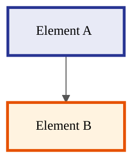

# /mermaid-create — Создать новую Mermaid диаграмму

## Назначение

Scaffold новый `.md` файл с Mermaid диаграммой по Jetix canonical style. Заполняет frontmatter, init directive, structural skeleton — ты дополняешь content.

## Аргументы

- `<topic>` (обязательно) — slug для filename (kebab-case). Например: `agent-handoff-flow`, `crm-pipeline-states`, `weekly-review-rhythm`.
- `--folder=<path>` (опционально, default: `swarm/wiki/synthesis/diagrams-YYYY-MM-DD/`) — куда положить
- `--type=<flowchart|sequence|state|gantt|mindmap|timeline|journey|quadrant|pie>` (опционально, default: `flowchart`)
- `--source=<path>` (опционально) — citation на canonical документ который визуализируем
- `--audience=<text>` (опционально) — кто читатель

## Шаг 1: Прочитать canonical style guide

Прочитай `swarm/wiki/operations/mermaid-style-guide-2026-05-07.md` — тебе нужны:
- §4 init directive boilerplate
- §1 color palette (выбрать relevant classDef set)
- §6 file structure standard
- §9 validation checklist

Не пропускай — без guide диаграмма не будет consistent.

## Шаг 2: Спросить детали (если не передали)

Если не указано — спроси у пользователя:
1. Какой topic? (для slug в filename)
2. Какой diagram type? (flowchart по default)
3. Какой source-doc? (canonical документ для citation в frontmatter)
4. Какой audience? (Цэрэн / Левенчук / partners / Jetix members / etc.)
5. Какие основные элементы? (3-5 ключевых нод/секций — чтобы заполнить skeleton)

## Шаг 3: Подготовить путь

```bash
TODAY=$(date '+%Y-%m-%d')
FOLDER="swarm/wiki/synthesis/diagrams-$TODAY"
mkdir -p "$FOLDER"
SLUG="<topic>"
# Если в папке уже есть файлы — узнай следующий номер:
NEXT_NUM=$(ls "$FOLDER" 2>/dev/null | grep -cE '^[0-9]{2}-' | xargs -I{} expr {} + 1)
# Format с leading zero:
NUM=$(printf "%02d" "$NEXT_NUM")
FILE="$FOLDER/${NUM}-${SLUG}.md"
```

Перед write — проверь что файла не существует (`ls "$FILE"`).

## Шаг 4: Сгенерировать boilerplate

Используй template:

````markdown
---
title: <Diagram title (Russian preferred)>
date: <today YYYY-MM-DD>
type: visual
diagram_engine: mermaid
source: <source path or "TBD">
audience: <audience>
purpose: <one-line purpose>
F: F4
G: visual-deliverable
R: refuted_if_<binary condition>
status: draft
---

# <emoji> <Title>

> <One-line tagline blockquote — суть диаграммы одной строкой>



---

## 📖 Описание элементов

| # | Element | Function |
|---|---------|----------|
| 1 | **<Element A>** | <one-line description> |
| 2 | **<Element B>** | <one-line description> |

---

## 🔗 Source

- [<source>](<path>) — <description>

---

## 📝 Notes

- Status: draft (для review с Ruslan)
- Render verify: GitHub UI + Notion subpage перед finalize
- Style guide: [mermaid-style-guide-2026-05-07.md](../../operations/mermaid-style-guide-2026-05-07.md)
````

Замени placeholder'ы конкретными значениями из ответов пользователя или из аргументов.

**Важно:** classDef block выбирай из §1 palette по relevance:
- Архитектурная диаграмма с мастером и инструментами → `master`, `tools`, `auto`, `phone`
- TRM-style → `trm_finance`, `trm_time`, etc.
- L0-L5 ladder → `ladder_l0` ... `ladder_l5`
- Collaboration → `partner_a`, `partner_b`, `partner_c`

Пиши ТОЛЬКО те classDef, которые используются в diagram. Не добавляй неиспользуемые — это noise.

## Шаг 5: Write файл

```python
# Используй Write tool с полным path
```

## Шаг 6: Update INDEX.md (если существует)

Если в `$FOLDER` есть `INDEX.md` — прочитай его, добавь новую запись в таблицу `4 диаграммы` (или общую navigation table). Append-only — не удаляй existing entries.

## Шаг 7: Лог

Добавь запись в `swarm/wiki/log.md`:
```
[YYYY-MM-DD] mermaid-create: <slug> → <file path> (audience: <audience>)
```

## Шаг 8: Сообщить пользователю

Кратко:
- Создал: `<file path>`
- Diagram type: `<type>`
- Открыть для preview: `https://github.com/Bogersebekov/jetix-os/blob/<branch>/<file path>`
- Следующий шаг: edit content, потом `/mermaid-iterate` для уточнений

## Правила

1. НЕ создавай файл без чтения style guide.
2. НЕ используй цвета вне §1 palette.
3. НЕ используй FontAwesome (`fa:fa-*`) или `img:url`.
4. НЕ используй `@{shape: ...}` extended syntax — stick to legacy brackets.
5. Subgraph nesting ≤2 уровней.
6. Init directive — copy-paste из §4 (одной строкой, без переносов).
7. classDef всегда в конце diagram body, не в середине.
8. Все node IDs UPPER_SNAKE_CASE; classDef names snake_case.
9. Если topic / source не ясен — спроси, не выдумывай.
10. Frontmatter `R:` обязателен — формулируй falsifiable условие.

## Ошибки которые НЕ делать

- Не создавать файл без user ack на детали (особенно audience + source)
- Не запускать `git commit` автоматически — это решает Ruslan когда review done
- Не overwrite existing файл если slug совпал — bump номер или предупреди user

## Cross-references

- Style guide: `swarm/wiki/operations/mermaid-style-guide-2026-05-07.md`
- Research base: `reports/mermaid-research-notes-2026-05-07.md`
- Iterate skill: `/mermaid-iterate`
- Export skill: `/mermaid-export`
- Validate skill: `/mermaid-validate`
