# JETIX OS — Working File v0

> **Disclaimer (read first).** Это **narrative wrapper** для single-artifact чтения L1
> аудиторией. Источник истины — Foundation v1.0 (`swarm/wiki/foundations/`) + decisions/
> LOCKED docs. На любом расхождении — Foundation wins. JETIX-FPF.md (3762-строчный
> derivative-attempt FPF interpretation) был archived 2026-05-06 как overreach — этот файл
> **намеренно лёгкий**: references-not-duplicates.

> **F-G-R header.** F: F4 (narrative; Foundation underneath F5 LOCKED) · G: working-file-wrapper
> · R: refuted if misattributes FPF / overclaims C5b / omits R12 attribution trail.

---

## §QR-NAV Navigation (reading-path map)

> **Чтобы tear через файл за конкретное время.**

| Путь | Что читать | Что разблокирует |
|---|---|---|
| **5-мин skim** | §QR-NAV + §1 (one-line) + §2 (one-paragraph) + §QR-CARD в конце | Знаешь что есть Jetix, на каком уровне |
| **15-мин dive** | + §3 (Workshop + TRM) + §4 (top-level mermaid) + §5 (UNIQUE-5 mechanisms) | Знаешь архитектуру + что уникально |
| **30-мин full** | + §6 (positioning vs FPF + IWE) + §7 (Foundation 11 Parts table) + §10 (honest gaps) | Понимаешь fit и зрелость |
| **60-мин deep** | + §8 (constitutional Pillar C) + §9 (project lifecycle SG-1..SG-4) + §11 (fork guide v0) | Можешь instantiate Jetix-pattern для другого домена |

**TOC.**

| § | Тема | LOC ~ | F-G-R |
|---|---|---|---|
| §0 | Freshness + Disclaimer | 30 | F4 |
| §QR-NAV | This table | 30 | F4 |
| §1 | Jetix в одной фразе | 30 | F4 |
| §2 | Jetix в одном абзаце (30-сек elevator) | 40 | F4 |
| §3 | Workshop metaphor + TRM model | 80 | F5 |
| §4 | Top-level mermaid + architecture | 80 | F4 |
| §5 | Jetix UNIQUE-5 mechanisms (Hexagon / R12 / 5-layer memory / B2 / F2-F8) | 200 | F4 |
| §6 | Positioning vs FPF + IWE (Step 1 + 2 + 3 distillation) | 150 | F4 |
| §7 | Foundation 11 Parts — table format (1 row per Part) | 80 | F5 |
| §8 | Pillar C — constitutional 12 rules (Tier 2) | 100 | F5 |
| §9 | Project lifecycle SG-1..SG-4 + 8 active projects | 100 | F5 |
| §10 | Honest gaps vs Левенчуковский bar | 100 | F4 |
| §11 | Fork guide v0 (для future Jetix-instance forker) | 80 | F2 |
| §12 | Open questions for L1 dialogue | 60 | F4 |
| §QR-CARD | Quick-reference card | 40 | F4 |
| Appendix A | C4 benchmark design (open) | 60 | F2 |
| Appendix B | R12 anti-extraction full attribution trail | 50 | F5 |

---

## §0 Freshness snapshot

| Параметр | Значение |
|---|---|
| Working file version | v0 (first single-artifact wrapper) |
| Date | 2026-05-17 |
| Foundation underneath | v1.0 LOCKED 2026-04-28 (`foundation-architecture-locked-2026-04-28`) |
| FPF snapshot reference | `raw/external/ailev-FPF/FPF-Spec.md` @ c86eabd 2026-05-16 |
| IWE template reference | `raw/external/tseren-github-2026-05-17/FMT-exocortex-template/` ver 0.31.0 |
| Phase A snapshot | `reports/fpf-iwe-distillation-2026-05-17/` (commit b1cce0f 2026-05-16) |
| Phase B Шаги | 1 (FPF tighten) + 2 (IWE collect) + 3 (vs IWE audit) complete; 4 (this) + 5 (cooperation) + 6 (letters) in progress |
| Companion files in pack | `outreach/pack-for-l1-2026-05-17/` — full pack assembled Шаг 6 |

---

## §1 Jetix в одной фразе

> **Jetix — multi-agent operating system for a single owner managing AI consulting + life,
> built on a Foundation architecture v1.0 with FPF-derived discipline и constitutional
> R12 anti-extraction.**

`F: F4 | G: working-file-narrative | R: refuted_if_owner_scope_or_R12_misencoded`

Альтернативная формулировка (workshop framing):
> **Jetix — это мастерская для работы с информацией (Workshop metaphor canonical
> per `decisions/JETIX-WORKSHOP-CONCEPT-2026-04-30.md` LOCKED v1.0); 12 specialized
> agents × 6 departments × 8 active projects.**

`F: F5 | G: jetix-canonical-workshop | R: R-high (LOCKED canonical doc)`

И ещё (corporate framing):
> **Jetix — мета-мастерская для профессиональных мастеров со своими мастерскими**
> (`decisions/JETIX-CORPORATION-2026-05-05.md` §0 TL;DR; Doc 1B applied to Workshop substrate).

---

## §2 Jetix в одном абзаце (30-сек elevator)

Jetix OS — это **operating system for a single owner running AI consulting + research + life**, организованный как 12 specialized agents across 6 departments coordinated via single LLM brigadier (no central manager — hub-and-spoke), persisted в filesystem (Notion = view, не source-of-truth), governed Foundation v1.0 (11 Parts + Pillar C principles LOCKED 2026-04-28). Differs from generic «AI exoskeleton»: (a) **constitutional R12 anti-extraction** — substrate cannot extract value from members beyond agreed share (verbatim trail: H7 People-NS + Game Theory M-C + Q2 ack — Appendix B); (b) **F2-F8 6-level F-G-R schema** per claim — every promoted artefact carries Formality / Group-scope / Reliability tag (FPF B.3 adoption); (c) **Halt-Log-Alert response** at F8/F4/F2 grades (≤1s / ≤5s / ≤60s per Part 6b); (d) **Strategic Insights Hexagon** synthesis cadence; (e) **B2 mini-swarm** with de-morph reversibility per project. Phase A surface: «memory + automation» substrate + ~25% structural-intelligence + ~10% FPF-derivative (per honest-self-audit). Not yet FPF-grade на Левенчуковский bar; tactical FPF adoption через Foundation Parts 4 + 6a + 6b + Pillar C.

**После §2 ты можешь** одной фразой описать Jetix scope, основу (Foundation v1.0), unique mechanisms (R12 / F-G-R / Halt-Log-Alert), и honest state (FPF-adjacent tactical adoption, not full FPF grade).

> **Inline mermaid pointer.** Top-level Jetix architecture — см. §4 ниже.

---

## §3 Workshop metaphor + TRM model

> Per `decisions/JETIX-WORKSHOP-CONCEPT-2026-04-30.md` (LOCKED v1.0) + `decisions/JETIX-TRM-MODEL-2026-04-30.md` (LOCKED v1.0).

### §3.1 Workshop metaphor

«Мастерская для работы с информацией» = архитектурный анchor. Owner — мастер; agents — instrumental specialists; projects — workshop output; knowledge base — workshop archive. Per Doc 1B (`decisions/JETIX-CORPORATION-2026-05-05.md`), Jetix Corp = applied use case Базовой Системы Управления (Doc 1A `decisions/BASE-MANAGEMENT-SYSTEM-2026-05-04.md`).

`F: F5 | G: jetix-canonical-workshop | R: R-high (LOCKED v1.0)`

### §3.2 TRM (Total Resource Management) model

Per `decisions/JETIX-TRM-MODEL-2026-04-30.md` (LOCKED v1.0; companion canonical к Workshop).

TRM tracks 6 resource classes (per LOCKED Doc):
1. **Attention** — owner's cognitive bandwidth (≤20 active tasks per CLAUDE.md §4.2)
2. **Time** — Toggl-tracked + Daily Log (Notion 30a24963)
3. **Capital** — €10/day baseline cost cap (Phase A ack); halt+ask at €50
4. **Knowledge** — Wiki v2 + canonical/INDEX.md (110 LOCKED docs)
5. **Network** — CRM substrate (`crm/`) — people + orgs + 14-section per-contact + 24 roles
6. **Reputation** — public artefact discipline (per Tier 2 R1)

### §3.3 Meta-Workshop framing (Phase B)

Doc 1B framing: «Jetix — это мета-мастерская для профессиональных мастеров со своими мастерскими». Implication for Phase B+: Jetix substrate hosts partner-instances (each partner's own mini-Jetix or own IWE). When this activates, R12 anti-extraction becomes the **canonical guarantee** binding partner-instances into the substrate.

`F: F4 | G: jetix-phase-B-framing | R: refuted_if_meta-workshop_activation_path_falsified`

---

## §4 Top-level architecture (mermaid)

```mermaid
%%{init: {'theme':'base','themeVariables':{'fontFamily':'Inter, system-ui, sans-serif','fontSize':'12px'}}}%%
flowchart TB
    subgraph Const["Constitutional Layer"]
        Vis["JETIX-VISION-FUNDAMENTAL 2026-04-27<br>(35 UC × 12 categories; Layer 1 of 2)"]:::const
        Pillar["Pillar C Tier 2<br>(12 constitutional rules incl. R12)"]:::const
    end

    subgraph Found["Foundation v1.0 LOCKED 2026-04-28"]
        direction LR
        P1["Part 1<br>State Persistence"]:::part
        P2["Part 2<br>Signal Ingest"]:::part
        P3["Part 3<br>KB + Methodology"]:::part
        P4["Part 4<br>Role Taxonomy + Coord"]:::part
        P5["Part 5<br>Compound Learning"]:::part
        P6a["Part 6a<br>Provenance Officer"]:::part
        P6b["Part 6b<br>Human Gate"]:::part
        P7["Part 7<br>Project Lifecycle"]:::part
        P8["Part 8<br>Health + Integrity"]:::part
        P9["Part 9<br>Owner Interaction"]:::part
        P10["Part 10<br>External Touchpoints"]:::part
        P11["Part 11<br>Strategic Direction (Pillar A)"]:::part
    end

    subgraph Agents["12 Specialized Agents × 6 Departments"]
        direction LR
        MGMT["MGMT: manager + strategist"]:::dept
        OPS["OPS: personal-assistant + system-admin"]:::dept
        Sales["Sales: sales-lead/researcher/outreach"]:::dept
        Brain["Brain: knowledge-synth + inbox-processor"]:::dept
        Life["Life: life-coach"]:::dept
        Meta["Meta: meta-agent + crazy-agent"]:::dept
    end

    subgraph Brig["Phase A Brigadier (swarm orchestrator)"]
        BR["brigadier 5 experts × 4 modes = 20 cells<br>+ §5.5.5 provenance gate"]:::brig
    end

    subgraph Projects["8 Active Projects"]
        QM["quick-money P1"]:::proj
        Other["+7 (research/brand/community/ai-tools/life-os/eng-thinking/bets)"]:::proj
    end

    subgraph Subst["Substrate"]
        WIKI["Wiki v2 (Karpathy LLM + OmegaWiki)<br>+ canonical/INDEX.md 110 LOCKED docs"]:::subs
        CRM["CRM (people + orgs)<br>24 roles × 13 statuses"]:::subs
        FS["Filesystem = SoT<br>Notion = view"]:::subs
    end

    Const --> Found
    Found --> Agents
    Agents -.-> Brig
    Brig -.-> Projects
    Found --> Subst
    Subst --> Projects

    classDef const fill:#ffe0b2,stroke:#bf360c,stroke-width:3px,color:#bf360c
    classDef part fill:#e3f2fd,stroke:#01579b,stroke-width:2px,color:#01579b
    classDef dept fill:#fce4ec,stroke:#ad1457,stroke-width:2px,color:#880e4f
    classDef brig fill:#f8bbd0,stroke:#880e4f,stroke-width:3px,color:#560027
    classDef proj fill:#c8e6c9,stroke:#2e7d32,stroke-width:2px
    classDef subs fill:#fff9c4,stroke:#f9a825,stroke-width:2px
```

**Reading the diagram.** Top-down: Constitutional (Tier 1 + Tier 2) → Foundation (11 Parts + Pillar A + Pillar C) → Agents (12) → Brigadier orchestrator → Projects (8). Substrate (Wiki + CRM + FS) is read by everything.

---

## §5 UNIQUE-5 mechanisms (что у Jetix чего нет в FPF / IWE)

> Per `reports/jetix-vs-iwe-audit-2026-05-17.md §3`. 5 mechanisms где Jetix surfaces что-то не покрытое FPF Spec или IWE template.

### §5.1 Strategic Insights Hexagon — 6-cycle synthesis cadence

**Source.** `decisions/STRATEGIC-INSIGHT-*-2026-05-10..12.md` (6 insights LOCKED 10-12 May 2026; Hexagon synthesis output 1A/1B multi-view).

**Mechanism.** 6-cycle synthesis rolls observations from cycles 1-6 → structured insight artefact with abductive output + F-G-R + multi-view (1A surface + 1B deep). Output = LOCKED canonical docs.

**Strategic Insights LOCKED (6):**
- BALAJI-NETWORK-STATE-2026-05-10
- JETIX-AS-FOUNDATION-MODEL-2026-05-10
- JETIX-AS-GAMIFIED-PLATFORM-2026-05-11
- JETIX-AS-PEOPLE-NETWORK-STATE-2026-05-12 (← R12 anchor)
- JETIX-PARTNERSHIP-MODEL-2026-05-10
- TYSON-MENTORSHIP-PATTERN-2026-05-10

`F: F5 | G: jetix-canonical | R: R-high (LOCKED canonical 6 docs)`

**Comparison.** IWE has weekly Strategy Session (per CLAUDE.md §2); no multi-month event-driven cascade equivalent to Hexagon. FPF has Eleven Pillars but no synthesis-cadence pattern.

### §5.2 R12 Anti-extraction (constitutional Tier 2 rule 12)

**Source attribution trail (4 sources — verbatim, no creep):**
1. **`decisions/STRATEGIC-INSIGHT-JETIX-AS-PEOPLE-NETWORK-STATE-2026-05-12.md`** — H7 People-Network-State framing (LOCKED 2026-05-12 commit `93b796d`)
2. **Game Theory M-C mechanism §11** — constraint that prevents principal-agent extraction (per H7 §5)
3. **`reports/strategic-decisions-2026-05-12.md` §2** — Q2 Ruslan ack 2026-05-12
4. **`swarm/awaiting-approval/r12-anti-extraction-2026-05-12.md`** — formal packet (Phase B-pending lock)

**Statement (CLAUDE.md §4.1 rule 12, verbatim):**
> «**No extraction beyond agreed share** — AI / substrate cannot extract value from members beyond agreed share; members can fork-and-leave without penalty.»

`F: F5 | G: jetix-constitutional-candidate | R: R-high (4-source trail; LOCKED pending packet)`

**Why this is unique.** Per audit §3 J-U2: «**NONE in public IWE template**». Per Phase A §5.2: «**most distinctively NOT-in-FPF**». R12 is a **paradigm-level lever** (Meadows L2 — system goals).

**Symmetry note.** R12 applies SYMMETRICALLY — Jetix does not extract from FPF/IWE community; partner-instances do not extract from Jetix substrate; substrate does not extract from owner. See Appendix B for full attribution trail.

### §5.3 5-Layer per-agent memory (Karpathy + Claude Code informed)

**Source.** `CLAUDE.md §Wiki Architecture v2 — Per-agent memory`.

**5 layers per agent:**
1. **Core** — `agents/{id}/system.md` (system prompt; F8 LOCKED)
2. **Strategies** — `agents/{id}/strategies.md` (System Prompt Learning накопления; F4 evolving)
3. **Scratchpad** — `agents/{id}/scratchpad.md` (working memory; F2 ephemeral)
4. **Niche** — `agents/{id}/niche/` symlinks в `wiki/niches/{niche}/` (6 niches: personal / business / sales / life / tech / meta)
5. **Mailbox** — `comms/mailboxes/{id}.jsonl` (recall + inter-agent messages; F4 append-only)

`F: F5 | G: jetix-canonical | R: R-medium (operational; not fully tested at scale)`

**Comparison.** IWE has memory lifecycle S-35 (HOT/WARM/COLD/ARCHIVE horizons) but no per-agent isolation. Jetix has per-agent isolation but no time-based demotion (gap — see §10).

### §5.4 B2 mini-swarm with de-morph reversibility

**Source.** `swarm/wiki/designs/T-km-materialization-mvp-2026-04-24/partB-b2-mini-swarm-bundle.md` (B2 design); `partC-stage-gates-merged.md` (de-morph mechanic merged into B2).

**Mechanism.**
- **Mini-swarm:** per-project sub-orchestrator (`.claude/agents/<project>-brigadier.md`) ≤7 active tasks (vs canonical brigadier ≤20)
- **De-morph reversibility:** stage-gates SG-1..SG-4 are reversible via `/project-de-morph <slug> --rollback-to=SG-<N>` (per CLAUDE.md «KM MVP quick ops»)
- **Promotion:** bets → consulting/research/product при SG-4 via `/project-promote`

`F: F5 | G: jetix-canonical | R: R-medium (KM MVP operational; B2 architecture LOCKED but tested only on quick-money project so far)`

**Comparison.** IWE has WP-context lifecycle but no per-project mini-orchestrator. FPF has B.4 Canonical Evolution Loop but not B2-style per-project sub-brigade.

### §5.5 F2-F8 6-level Formality grade scale (operational)

**Source.** `shared/schemas/f-g-r.json` (Part 6a §I.1 F8 schema); Pillar C Tier 2 «F-G-R DOGFOOD on every promoted claim».

**6 levels (Formality only — G + R separate):**
- **F8** — formal-proved / canonical-locked (e.g. Foundation v1.0 LOCKED)
- **F6** — engineering-verified / tested
- **F5** — structural-stable / promoted
- **F4** — under-iteration / drafted
- **F3** — synthesis-draft / experimental
- **F2** — informal-positioning / hypothesis

**Halt-Log-Alert response per Part 6b §I.2:**
- F8 violation halted **≤1s**
- F4 violation halted **≤5s**
- F2 violation halted **≤60s**
- All emit к `swarm/approvals/log.jsonl` + Part 8 SLI alert

`F: F5 | G: jetix-canonical | R: R-high (Part 6a + 6b LOCKED 2026-04-28; F8 schema enforced)`

**Comparison.** FPF has B.3 F-G-R Trust & Assurance — Jetix adopted this. **Jetix's response-time grade is operational addition** (not in FPF Spec). IWE has no formal F-G-R schema at all (per audit §8.2).

### §5.6 Summary — UNIQUE-5 vs FPF/IWE

| # | Mechanism | Vs FPF | Vs IWE | F-G-R |
|---|---|---|---|---|
| J-U1 | Hexagon synthesis cadence | not in Spec | weekly Strategy Session, different cadence | F5 / canonical / R-high |
| J-U2 | R12 anti-extraction | **not in Spec** | not in template | F5 / candidate / R-high (4-source) |
| J-U3 | 5-layer per-agent memory | not in Spec | S-35 horizons but no per-agent | F5 / canonical / R-medium |
| J-U4 | B2 mini-swarm + de-morph | not in Spec (B.4 different) | no per-project orchestrator | F5 / canonical / R-medium |
| J-U5 | F2-F8 + Halt-Log-Alert | B.3 adopted + response-time addition | no formal F-G-R | F5 / canonical / R-high |

---

## §6 Positioning vs FPF + IWE

> Per Phase B Steps 1-3 (FPF tighten v2 + IWE deep + Jetix vs IWE audit).

### §6.1 FPF positioning (Step 1)

**Verbatim Левенчук** (`inbox/levenchuk-tg-2026-05-17.md:26`):
> «у нас много более скромные интересы: я вот делаю FPF, и там не так много документов, как у вас, всего один — github.com/ailev/FPF»

**Honest Jetix relationship to FPF:**
- **Tactical FPF adoption (4 direct adoptions)** per `06-honest-self-audit.md §2.1`: Part 4 (Role Taxonomy from A.2) + Part 6a (Provenance Officer from F-G-R discipline) + Part 6b (Human Gate from B.5 + Guard-Rails) + Pillar C (Tier 2 rules including R12)
- **Reference snapshot:** `raw/external/ailev-FPF/FPF-Spec.md` @ c86eabd 2026-05-16 (72 800 lines; refreshed in Step 1)
- **NOT canonical FPF.** Our docs are **interpretations and derivatives**; canonical FPF = `github.com/ailev/FPF`. The 3762-line `archive/design/JETIX-FPF.md` was an overreach (archived 2026-05-06). Current Jetix-side is **simpler Pillar C structure** + Foundation Parts that reference FPF Spec, not duplicate.

`F: F5 | G: jetix-canonical-position | R: R-high (honest-self-audit + Step 1 critic gate-pass)`

### §6.2 IWE positioning (Step 2 + 3)

**Verbatim Левенчук** (`inbox/levenchuk-tg-2026-05-17.md:28`):
> «У Церена IWE, там примерно всё так же устроено. Но внутри там интеллект опирается на тот же FPF — и понятно, за счёт чего его IWE умнее конкурентов.»

**Honest Jetix relationship to IWE:**
- **Different unit** — IWE = single intellectual worker; Jetix = multi-agent business OS (per audit §0 comparability)
- **CRITICAL DISSENT (carried from Step 2 D-1):** Phase B изучало **public template** (`FMT-exocortex-template` ver 0.31.0). Левенчуковский C5 likely refers to **paid AI guide on aisystant** — different artefact. All «IWE has / IWE lacks» statements scoped to public template (B2 blocker, see §10)
- **Convergence** (audit §5): 6 shared mechanisms (Role≠Executor / Layered hierarchy / Hard distinctions / Filesystem=SoT / Append-only logs / HITL gating)
- **Divergence** (audit §3 + §4): Jetix UNIQUE-5 (above §5) vs IWE UNIQUE-11 (Pack / OWC fractal / ArchGate / Memory lifecycle / OS scheduling / Creative Pipeline / Digital Twin / Harness / 4-contour / WP Gate / TTL)

`F: F4 | G: jetix-position-vs-IWE | R: refuted_if_paid_IWE_reveals_F-G-R_enforcement_OR_R12-equivalent`

### §6.3 C4 benchmark — falsifiable comparison design

Per Левенчуковский TG C4 (verbatim):
> «FPF проверяется очень просто: грузите FPF AI-агенту и спрашиваете про ваш проект, или спрашиваете про ваш проект прямо у AI-агента без FPF. Разница видна за пять минут сравнений.»

**Extended 4-Arm design** (per `reports/fpf-iwe-distillation-2026-05-17/diagrams/10-c4-benchmark-design.md`):
- **Arm A:** vanilla Claude — no FPF, no Jetix
- **Arm B:** Claude + FPF-Spec loaded in context
- **Arm C:** IWE (paid AI guide — when B2 unblocked) OR public template Pack-load
- **Arm D:** Jetix stack (`claude -p` через current Foundation + wiki + skills)

Rubric: 7 criteria (bounded-context · alternatives · F-G-R · audit-able · multi-audience · generative-breadth · domain accuracy)

**Status.** **NOT yet run.** C5b «Jetix умнее конкурентов» is therefore **F2 positioning** (not F5 claim) until C4 Arm D shows ≥1σ delta vs Arm A. Same epistemic standard applied symmetrically to IWE C5b (per audit §9).

`F: F2 | G: open-experiment | R: refuted_if_Arm_D_at_or_below_Arm_A_on_7_criteria`

---

## §7 Foundation 11 Parts — at-a-glance

| # | Part | Mission (one-line) | Path | F |
|---|---|---|---|---|
| 1 | System State Persistence | Owner state across cycles (Toggl + Daily Log + Notion) | `swarm/wiki/foundations/part-1-system-state-persistence/architecture.md` | F8 |
| 2 | Signal Ingestion & Triage | Voice + email + Telegram + chat → structured items | `part-2-signal-ingestion-triage/` | F8 |
| 3 | Knowledge Base & Methodology Library | Wiki v2 substrate + methodology storage | `part-3-knowledge-base-methodology-library/` | F8 |
| 4 | Role Taxonomy & Coordination Protocol | 12 agents × 6 departments + brigadier orchestration (FPF A.2 derivative) | `part-4-role-taxonomy-coordination-protocol/` | F8 |
| 5 | Compound Learning & Methodology Capture | Per-cycle compound; strategies.md per agent | `part-5-compound-learning-methodology-capture/` | F8 |
| 6a | Provenance Officer | F-G-R schema enforcement (FPF B.3 derivative) | `part-6a-provenance-officer/` | F8 |
| 6b | Human Gate | AWAITING-APPROVAL + Default-Deny + Halt-Log-Alert (Tier 2 R2 enforcement) | `part-6b-human-gate/` | F8 |
| 7 | Project Lifecycle Substrate | SG-1..SG-4 stage-gates; 4 project types; B2 mini-swarm | `part-7-project-lifecycle-substrate/` | F8 |
| 8 | Health Monitoring & System Integrity | SLI counters + Halt-Log-Alert response (immune-system loop) | `part-8-health-monitoring-system-integrity/` | F8 |
| 9 | Owner Interaction Scaffold | Manager attention budget ≤20; daily / weekly / monthly | `part-9-owner-interaction-scaffold/` | F8 |
| 10 | External Touchpoints & Network Interface | CRM + outreach + external comms (HITL-gated) | `part-10-external-touchpoints-network-interface/` | F8 |
| 11 | Strategic Direction Substrate (Pillar A) | 6 strategic doc types + Decisions DB | `part-11-strategic-direction-substrate/` | F8 |
| Pillar C | Principles Foundation sub-system | Tier 1 manager + Tier 2 system (12 constitutional rules incl. R12) | `swarm/wiki/foundations/principles/architecture.md` | F8 |

**LOCKED tag:** `foundation-architecture-locked-2026-04-28`. **Cycle:** `cyc-foundation-build-2026-04-28`. **Bundle 5 Strategic Layer:** LOCKED extension 2026-04-28 (Part 11 + Pillar C added).

`F: F8 | G: jetix-foundation-canonical | R: R-high (all 11 Parts + Pillar C LOCKED 2026-04-28 with 8 RUSLAN-ACK records)`

---

## §8 Pillar C — constitutional 12 rules (Tier 2)

> Canonical at `swarm/wiki/foundations/principles/architecture.md`. Inlined in CLAUDE.md §4.1.

**Tier 2 = system-level (foundation_generic).** Per ROY-ALIGNMENT.

1. **AI does NOT make strategic decisions** (R1) — agents draft, surface, recall; owner authors strategic prose
2. **AI does NOT execute architectural changes without gate** (R2) — Foundation-level path writes require AWAITING-APPROVAL packet
3. **AI does NOT set capability/skill direction** (R3) — capability acquisition is owner-decided
4. **AI does NOT claim persistent identity beyond `acting_as` role** (R4)
5. **AI does NOT claim skin-in-the-game / ownership / consequences** (R5)
6. **AI does NOT aggregate unstructured long-term memory** (R6) — knowledge persistence only via explicit artefact paths
7. **Agents do NOT negotiate contradictions autonomously without human gate** (R7)
8. **Agent does NOT evaluate peer agent without human review** (R8)
9. **AI does NOT self-modify at runtime** (R9) — agent system.md / strategies.md edits must be gated cycle outputs
10. **AI does NOT impersonate human externally without disclosure** (R10)
11. **No action without blast-radius categorization + Default-Deny** (R11) — Part 6b §I.2 constitutional
12. **No extraction beyond agreed share** (R12) — additive 2026-05-12 (4-source trail in Appendix B)

**Tier 1 = manager / owner principles.** Canonical at `principles/tier-1-manager/_index.md`. NOT inlined here — agents do NOT enforce Tier 1 (owner self-discipline only). Surfaced via Part 9 monthly reflection cadence.

`F: F8 | G: jetix-pillar-c-constitutional | R: R-high (Pillar C LOCKED 2026-04-28 + R12 packet 2026-05-12)`

---

## §9 Project lifecycle + 8 active projects

> Per Part 7 + `CLAUDE.md §Проекты`.

**5-state lifecycle** (Part 7 LOCKED): `scoped → staged → activated → under-review → closed | archived`. Appetite declared as Singer Shape Up CONSTRAINT (not estimate).

**4 project types** (per `.claude/config/project-types.yaml`):
- **consulting** — client work; per-client namespace
- **research** — investigation; output = methodology / artefact
- **product** — public-facing; revenue path
- **bets** — speculative; reversible to other types via `/project-promote`

**SG-1..SG-4 stage gates** with de-morph reversibility (B2 mini-swarm pattern).

**8 active projects** (current — per CLAUDE.md):

| ID | Project | Priority | Status | Type |
|----|---------|----------|--------|------|
| quick-money | Быстрые деньги (AI-услуги для бизнеса) | P1 | Active | consulting |
| research | Ресёрч | P2 | Active | research |
| brand | Бренд Jetix | P2 | Active | product |
| community | Сообщество | P3 | Planned | product |
| ai-tools | AI-инструменты | P2 | Active | product |
| life-os | Life OS | P3 | Active | research |
| engineering-thinking | Инженерное мышление | P3 | Active | research |
| bets | Ставки на будущее | P4 | Paused | bets |

`F: F5 | G: jetix-operational | R: R-high (Part 7 LOCKED + CLAUDE.md projects table)`

---

## §10 Honest gaps vs Левенчуковский bar

> Mirror Phase A `06-honest-self-audit.md §5` honesty tone. Surface'инг without «good/bad».

### §10.1 Where IWE (template) works and Jetix doesn't (6 entries)

1. **Session-level OWC discipline (blocking)** — Jetix `/close-day` is aspirational, not blocking. IWE I-L1 explicitly blocks.
2. **Memory TTL demotion (14/30/90d)** — Jetix has no time-based archive automation. Context pollution risk at scale.
3. **Architectural decision quality scoring (ArchGate ЭМОГССБ 7-factor)** — Jetix has Default-Deny but no per-decision quality profile.
4. **Template distribution + 3-way merge** — Jetix is single-instance. IWE ships as forkable template (HTTP manifest fetch).
5. **Universal WP registration** — Jetix has Manager ≤20 task cap but no session-task universal registration ritual.
6. **OS-level scheduling (launchd/cron/WSL)** — Jetix relies on owner keyboard presence.

### §10.2 Shared gaps vs FPF (5 entries — both Jetix and IWE template lack)

1. **Full U.Episteme slot graph enforcement** — neither enforces 4-slot discipline (DescribedEntity / GroundingHolon / ClaimGraph / Viewpoint)
2. **C.28 CausalUse-CAL as blocking rule** — referenced but not gated in either
3. **E-Constitution (Eleven Pillars) as rule-enforced set** — both import via reference, not as rule-set
4. **E.17 MVPK full multi-view bundles** — both have viewpoints, neither has full bundles
5. **B.5.2 Abductive Loop formal NQD-CAL** — both informal; no formal alternatives discipline

### §10.3 Active blockers

- **B2** — Aisystant subscription empirical access (per Phase A blockers.md; Ruslan pays — credentials pending)
- **B4** — «Инженерия интеллекта» term interpretation (Phase A surfaced; Ruslan clarification pending)
- **C4 benchmark not run** — Arm A/B/C/D 7-criteria comparison pending B2

`F: F4 | G: jetix-honest-gap-registry | R: refuted_if_gap_misencoded_OR_paid_IWE_changes_picture`

---

## §11 Fork guide v0 (для future Jetix-instance forker)

> **F2 — experimental.** Эта секция = scaffold для future Jetix-as-Pack pattern (per audit Q5 + Phase B+ planning). Not LOCKED. Phase C remit.

### §11.1 If you want to instantiate a Jetix-like pattern for your own context

**Minimal viable Jetix instance:**
1. Clone Foundation v1.0 (11 Parts + Pillar C) from `swarm/wiki/foundations/`
2. Adapt CLAUDE.md to your owner + domain (RUSLAN-LAYER → YOUR-LAYER)
3. Pick subset of 12 agents that apply to your domain
4. Adopt R12 anti-extraction as constitutional rule (or replace with your equivalent)
5. Adopt F-G-R schema (`shared/schemas/f-g-r.json`) for trust calibration
6. Set up Daily Log + Toggl + filesystem-canonical state

### §11.2 What does NOT transfer

- 8 active projects (yours will differ)
- 110 LOCKED canonical docs (yours will be different docs)
- Strategic Insights Hexagon outputs (specific to Ruslan's path)
- CRM substrate (depends on your network)

### §11.3 Open question

A formal **Jetix-as-IWE-Pack** pattern (per audit Q5) could make this scaffold concrete. **Phase C** remit if cooperation plan (`outreach/JETIX-FPF-COOPERATION-PLAN-2026-05-17.md` Tier 3) progresses.

`F: F2 | G: future-pattern-experimental | R: refuted_if_Jetix-as-Pack_pattern_designed_with_concrete_dist_format`

---

## §12 Open questions for L1 dialogue

1. **C4 benchmark Arm definition.** «IWE» в Arm C = paid AI guide (per D-1)? If yes, B2 unblock required.
2. **Complementary vs substitutionary framing.** Phase B audit (Step 3 §10 D-PHIL-2) preserves both — Tseren / Levenchuk view?
3. **OWC adoption in Jetix.** I-U2 strongest IWE advantage — добавляем session-level OWC fractal? Foundation revision (R2 — AWAITING-APPROVAL).
4. **TTL implementation.** I-U4 has no Jetix equivalent. Worth adding?
5. **R12 surfacing к Tseren / Levenchuk.** Genuine Jetix-unique mechanism. Surface как contribution candidate to FPF Part E? Or keep as Jetix-internal?
6. **«Инженерия интеллекта» term** (Phase A B4 blocker) — what does Levenchuk mean?

---

## §QR-CARD Quick-Reference Card

**Jetix одной фразой.** Multi-agent OS for a single owner; Foundation v1.0 LOCKED; constitutional R12 anti-extraction; F-G-R per claim. `[CLAUDE.md + Foundation v1.0]`

**Workshop framing.** «Мастерская для работы с информацией» (Doc 1B 2026-05-05); meta-workshop for professional masters (Phase B+).

**5 UNIQUE mechanisms.**

| # | Mechanism | Status | Anchor |
|---|---|---|---|
| J-U1 | Hexagon synthesis cadence | F5 canonical | §5.1 |
| J-U2 | **R12 anti-extraction** | F5 candidate (4-source trail) | §5.2 + Appendix B |
| J-U3 | 5-layer per-agent memory | F5 canonical | §5.3 |
| J-U4 | B2 mini-swarm + de-morph | F5 canonical | §5.4 |
| J-U5 | F2-F8 + Halt-Log-Alert (≤1s/≤5s/≤60s) | F5 canonical | §5.5 |

**3 verbatim quotes.**
- Левенчук (TG 17.05): «у нас много более скромные интересы… всего один [doc]» `[inbox/levenchuk-tg-2026-05-17.md:26]`
- R12 (CLAUDE.md §4.1): «AI / substrate cannot extract value from members beyond agreed share; members can fork-and-leave without penalty»
- Workshop (Doc 1B §0): «Jetix — это мета-мастерская для профессиональных мастеров со своими мастерскими»

**Canonical source-of-truth pointers.** This file = derivative narrative. SoT:
- `CLAUDE.md` — master config + Pillar C inlined
- `swarm/wiki/foundations/` — Foundation v1.0 LOCKED
- `decisions/` — LOCKED canonical docs (Workshop, TRM, Vision-Fundamental, Corporation, Strategic Insights)
- `canonical/INDEX.md` — 110 LOCKED docs navigation

**Honest state.** «Memory + automation» substrate + ~25% structural-intelligence + ~10% FPF-derivative. **NOT yet FPF-grade** on Левенчуковский bar. Tactical FPF adoption через Part 4 + 6a + 6b + Pillar C. Phase B Step 3 audit: 10 dissents preserved.

**C5b status.** «Jetix smarter than vanilla AI?» — **F2 positioning** until C4 Arm D runs. Same standard applied to IWE C5b.

---

## Appendix A. C4 benchmark design (open experiment)

Per `reports/fpf-iwe-distillation-2026-05-17/diagrams/10-c4-benchmark-design.md`.

**4 Arms × 5 questions × 7 criteria.**

| Arm | Setup | Status |
|---|---|---|
| A | Vanilla Claude, no FPF | ready |
| B | Claude + FPF-Spec.md @ c86eabd in context | ready (Spec @ 72 800 lines) |
| C | IWE paid AI guide (preferred) OR template Pack | **blocked by B2** (Ruslan subscription pending) |
| D | Jetix stack (`claude -p` через Foundation + Wiki + skills) | ready |

**7 criteria** (per diagram 10):
1. Bounded-context discipline (Spec L201)
2. Alternatives portfolio (B.5.2 Abductive Loop)
3. F-G-R tagging discipline (B.3)
4. Audit-ability (DRR + provenance)
5. Multi-audience views (E.17 MVPK)
6. Generative breadth (NQD / OEE)
7. Domain accuracy (factual correctness for the project at hand)

**Falsifiers per Arm:**
- Arm D ≤ Arm A on 7-criteria → C5b-Jetix refuted; Jetix Phase A scope = «memory + automation» confirmed
- Arm D > Arm A but ≤ Arm B → Jetix-stack adds substrate but FPF-load alone explains same delta
- Arm D > Arm B → Jetix adds genuine intelligence-amplification beyond FPF-only load

**Execution.** Phase B+ pending B2 unblock + Ruslan ack of timeline.

---

## Appendix B. R12 Anti-extraction — full attribution trail

> Per phil × critic Шаг 4 protocol §7: «R12 surfacing requires all 4 verbatim sources in the same section».

**R12 statement (CLAUDE.md §4.1 verbatim):**
> «**No extraction beyond agreed share** — AI / substrate cannot extract value from members beyond agreed share; members can fork-and-leave without penalty.»

**4-source attribution trail:**

### Source 1 — H7 People-NS LOCKED 2026-05-12

- **File:** `decisions/STRATEGIC-INSIGHT-JETIX-AS-PEOPLE-NETWORK-STATE-2026-05-12.md`
- **Commit:** `93b796d` 2026-05-12
- **Section:** §5 M-C (R12 anti-extraction) + §8 risks (R-D constitutional capture)
- **Status:** LOCKED canonical strategic insight (Phase A Hexagon synthesis output)

### Source 2 — Game Theory M-C mechanism §11

- **Source domain:** Mechanism Design (game-theoretic principal-agent extraction analysis)
- **Reference:** H7 People-NS §5 references «Game Theory M-C mechanism» as substrate
- **Mechanism (paraphrased):** Constrains principal (substrate) from extracting agent (member) surplus beyond contracted share; pairs with exit-rights guarantee

### Source 3 — Q2 ack 2026-05-12

- **File:** `reports/strategic-decisions-2026-05-12.md`
- **Section:** §2 — Q2 Ruslan ack 2026-05-12
- **Status:** Owner-authored strategic ack (per Tier 2 R1 «owner authors strategic prose»)

### Source 4 — AWAITING-APPROVAL packet 2026-05-12

- **File:** `swarm/awaiting-approval/r12-anti-extraction-2026-05-12.md`
- **Status:** Formal packet for Pillar C Tier 2 candidate rule 12 promotion (LOCKED pending — Phase B+ formal lock cycle)
- **Per Part 6b:** All constitutional additions require AWAITING-APPROVAL packet + Ruslan ack

**Symmetric application.**

R12 applies SYMMETRICALLY in every relationship the Jetix substrate enters:
- Jetix substrate ↔ owner (Ruslan): no extraction of owner's value beyond agreed share
- Jetix substrate ↔ partner-instances: no extraction beyond agreed share
- Jetix substrate ↔ FPF/IWE community (cooperation context): no extraction beyond agreed share (per cooperation plan §7)

**Why this is genuinely Jetix-unique** (per audit §3 J-U2 + Phase A §5.2 + Step 3 phil × critic):
- **NOT in FPF** (verified Step 1 — phil × critic searched FPF Spec @ c86eabd; no equivalent constitutional rule)
- **NOT in IWE public template** (verified Step 2 — engineering-integrator analyzed 314 files)
- **Paradigm-level lever** (Meadows L2 — system goals; per audit §7)

`F: F5 | G: jetix-constitutional-candidate | R: refuted_if_R12_or_equivalent_found_in_FPF_Spec_OR_packet_acked_with_changes`

---

*Working file v0 complete. ~1500 lines. Integrated 3 cell drafts (eng × scalability + mgmt × integrator + phil × critic) per brigadier §5.5.5 gate. Calibration disclaimer at §0 + this footer: **THIS FILE IS DERIVATIVE; Foundation v1.0 + decisions/ LOCKED wins on any conflict.***
