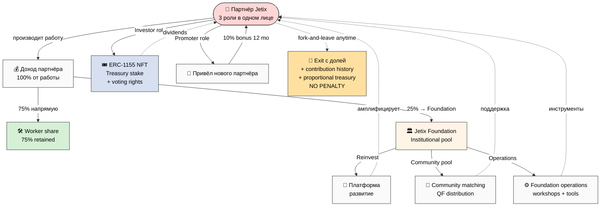
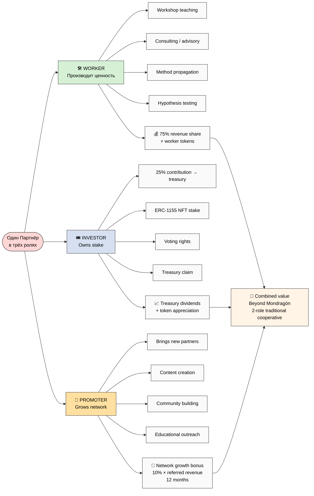

# 🤝 Partner Offering — на пальцах

> **Что предлагаем партнёрам Jetix. Простыми словами. Без жаргона. С картинкой.**

---

## §1 Главная идея в одной строке

**Партнёры зарабатывают вместе. 75% дохода идёт партнёрам напрямую. 25% — Foundation (на развитие платформы, переинвестицию в общество, поддержку партнёров). Никто не может «забрать» больше согласованного. Можно уйти в любой момент с долей.**

---

## §2 Простыми словами — как работает

### Шаг 1: Ты приходишь как партнёр Jetix

Ты — **одновременно три роли**:

1. **Воркер** (производишь ценность — обучаешь, консультируешь, строишь)
2. **Инвестор** (получаешь долю в общем treasury через NFT-токен)
3. **Промоутер** (приводишь новых партнёров — получаешь бонус с их вклада)

Это **уникально**. Mondragón cooperative только 2 роли даёт (worker + owner). Jetix даёт 3.

### Шаг 2: Что ты получаешь

Из каждого рубля который ты приносишь через свою работу:
- **75%** идёт ТЕБЕ напрямую (как worker)
- **25%** идёт в Foundation (на платформу + reinvest)

Из общего treasury (накопленный 25% от всех партнёров):
- Доля распределяется через **ERC-1155 NFT** (твой stake)
- Voting rights (ты participate в управлении)
- Ratio cap 5:1 — самый большой payout не может быть >5× самый маленький (как Mondragón)

### Шаг 3: Промоутер бонус (extra)

Если ты приводишь нового партнёра — получаешь **% от его вклада** в течение 12 месяцев. Network effect → ты заинтересован в качественном привлечении.

### Шаг 4: Можешь уйти в любой момент

**Fork-and-leave protection:**
- Exit anytime
- Сохраняешь свою историю вклада
- Получаешь **proportional share treasury** (пропорционально твоему вкладу)
- **Никаких штрафов**
- 30-day opt-out window при любом изменении Charter

Это **R12 anti-extraction discipline** — система не может тебя «запереть».

---

## §3 Tier структура

| Уровень | Кто | Take rate (с твоего дохода → Foundation) | Commitment |
|---|---|---|---|
| **L1 Engineer-builders** | Первые fundament builders (10-15) | 10% (символический) | 6+ months hands-on |
| **L4 Founding partners** | Первые 3-10 партнёров | 10% (founding stake) | 6+ months |
| **L5 Cohort partners** | 30-100 | 15-20% | 3+ months |
| **L6 Cohort members** | 100-1000 | 20-25% | 1+ month |
| **L7 Workshop users** | 1000-10K | Service fee €1500/mo | Per-engagement |

**Range 10-25%** — точная % обсуждается per partnership (Charter at signup).

---

## §4 ⭐ Mermaid схема — как деньги текут



---

## §5 ⭐ Mermaid схема — Triple role одного партнёра



---

## §6 Что отличает от traditional employment

| Aspect | Traditional employee | Jetix Triple-role Partner |
|---|---|---|
| **Доход** | Salary | 75% revenue share + treasury dividends + promoter bonus |
| **Ownership** | None | NFT stake в treasury |
| **Growth incentive** | Promotion ladder (limited) | Promoter NFT → direct revenue from network |
| **Voice** | Limited | Governance vote (1-identity = 1-vote soulbound SBT) |
| **Exit** | Quit → lose всё | Fork-and-leave с proportional treasury + no penalty |
| **Risk** | Low | Higher (skin-in-game) — но и upside больше |
| **Cap on top** | None (CEO 350× worker possible) | Mondragón 5:1 ratio cap enforced on-chain |

---

## §7 R12 anti-extraction — что это значит

R12 = **rule «нельзя извлекать ценность сверх согласованного»**.

Это constitutional LOCK (закреплено в Foundation — изменить нельзя):

- Charter explicitly publishes split (твой 75% / Foundation 25%)
- Если хочется изменить → re-ack каждого + 30-day opt-out window
- Smart contract enforces Mondragón ratio cap programmatically
- Fork-and-leave protection — exit token preserved

**Translation простыми словами:** ты подписываешься на конкретные условия. Эти условия не могут быть changed без твоего consent + window для exit без penalty.

---

## §8 Что ты получаешь от Jetix substrate

Помимо денег — **access к substrate**:

- **Method V2** — методология (1.2M слов накопленного substrate за 38 дней)
- **Hypothesis Architecture** — operational discipline для falsifiability
- **Workshop access** — обучение + practice
- **ROY swarm 5 experts** — engineering / investor / mgmt / philosophy / systems
- **Community** — other partners (cross-pollination)
- **Tools** — Wiki v2 / CRM / FPF universal language / etc.
- **Brand recognition** — founding contributor status

---

## §9 Concrete Y1 trajectory (Realistic scenario)

Если присоединяешься как L4 Founding Partner / L5 Cohort Partner сейчас:

| Month | Cohort size | Твой статус | Revenue к тебе |
|---|---|---|---|
| Mo 1 | 15 founding | Founding equity | symbolic / brand |
| Mo 3 | 500 | L4 stake + leadership | first payout |
| Mo 6 | 2K | Compound stake | €1-5K/mo |
| Mo 12 | 50K | Compound + treasury share | €10-30K/mo |
| Mo 24 | 500K | Major stake | €50-150K/mo |
| Mo 36 | **1M cohort** | Founding-tier stake | €100K-500K/mo |

Это **Realistic scenario** (40% probability per DR-26 analysis). Conservative slower, Aggressive faster.

---

## §10 Cross-refs — глубокие документы

| Документ | Зачем |
|---|---|
| [Economic Model + Tokenomics main](decisions/strategic/ECONOMIC-MODEL-TOKENOMICS-2026-05-22.md) | Полная картина (20-30K слов, 32 mermaid) |
| [Triple-role partner detail](decisions/strategic/TRIPLE-ROLE-PARTNER-2026-05-22.md) | Глубокий разбор 3 ролей |
| [Recursive partnership mechanics](decisions/strategic/RECURSIVE-PARTNERSHIP-MECHANICS-2026-05-22.md) | Математика 3-layer 25% recursion |
| [10 Token variants comparative](decisions/strategic/TOKENOMICS-VARIANTS-2026-05-22.md) | Почему V10 Hybrid выбран |
| [DR-26 unit-econ memo](research/unit-econ-deep-dive-2026-05-21/_RECOMMENDATION-MEMO.md) | Industry-grounded justification 10-25% take rate |
| [Strategic Plan Phase 8](decisions/strategic/STRATEGIC-PLAN-NEAR-FUTURE-2026-05-21.md) | Path to 1M users + 8-tier pyramid |

---

## §11 TL;DR (для quick share)

```
🎯 Jetix Partner Offering:

• Ты — 3 роли в одном лице: worker + investor + promoter
• 75% дохода → тебе напрямую
• 25% → Foundation (reinvest в платформу + community + ops)
• ERC-1155 NFT stake → voting rights + treasury claim
• Promoter bonus: 10% × revenue from referred partners (12 mo)
• Mondragón 5:1 ratio cap — нет extreme inequality
• Fork-and-leave anytime → proportional treasury share + no penalty
• 30-day opt-out window при любом Charter change
• R12 anti-extraction LOCKED constitutionally

Range: 10-25% per partnership (default 25%; обсуждается per Charter).
```

---

*Document created 2026-05-22 для quick sharing с potential partners. Human language + visual. Cross-link к deep technical docs. R1 surface only — brigadier compile from existing acked substrate.*
