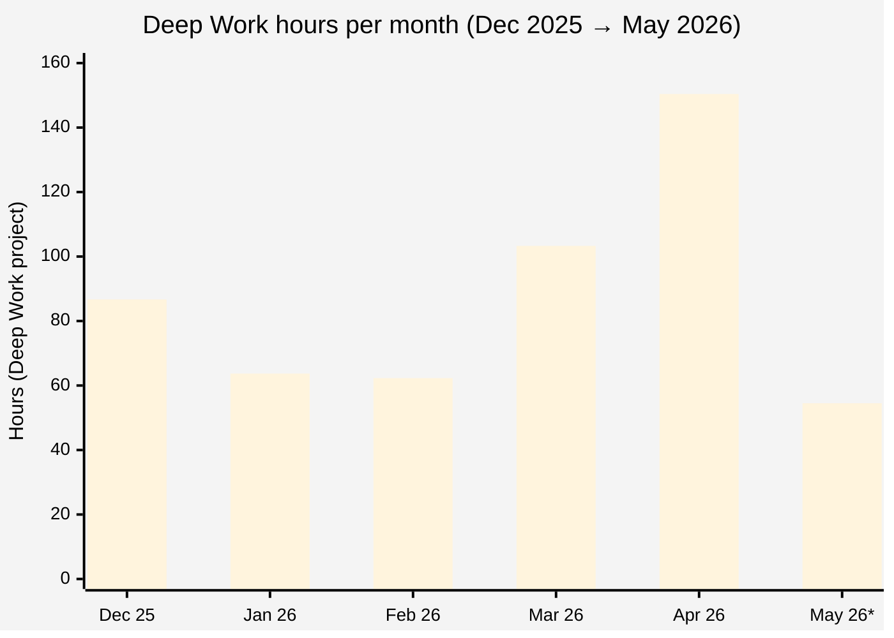
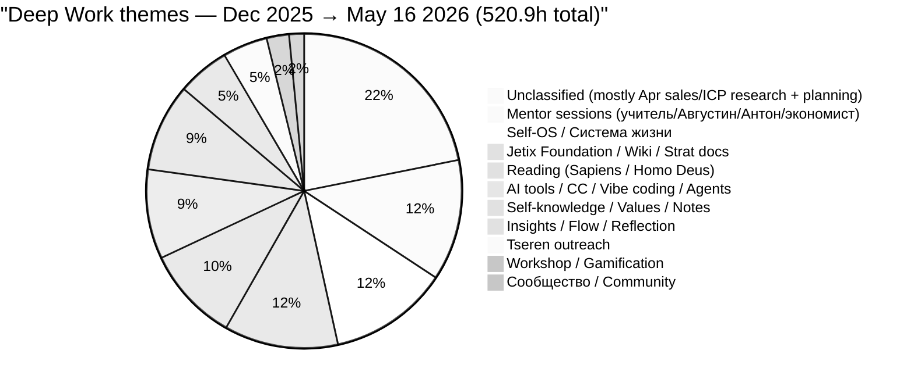

# Real Deep Work analytics — 5 месяцев (Dec 2025 → May 16, 2026)

> **БЕЗ ПИЗДЕЖА.** Все цифры из свежего fetch Toggl Reports API v2 (16.05.2026
> утром). Источник: `reports/toggl_5months_dw_2026-05-16.json`. Где данных
> не хватает (например DW tags до мая 2026) — явно сказано.

---

## §1 TL;DR

- **Total Deep Work за 5.5 мес:** **520.9h** (декабрь → 16.05) [src: §2 table]
- **Peak DW month:** **апрель 2026 = 150.4h** (5.0h/день) — Foundation v1.0 build [src: §2]
- **Lowest DW month:** **январь 2026 = 63.7h** (2.05h/день) — Mentor + Reading dominant [src: §2]
- **DW share от total tracked:** **13.4%** (520.9h DW / 3893.1h total) [src: §4]
- **Tracking density** — **94–99% каждого месяца** (Ruslan tracks почти каждый час дня) [src: §5]
- **Themes shift Dec → May:** Reading/Mentor (Dec-Jan) → Self-OS (Feb-Mar) → Jetix Foundation (Apr) → Tseren + Workshop + gamification (May)
- **Major caveat:** **DW тэги (Tseren / Jetix-* / SOZD / OBR / PODG) появились только с мая 2026.** За декабрь-апрель DW entries без tags — темы derived keyword-matching по description (см. §3.1)

---

## §2 Monthly breakdown — DW hours, total tracked, DW%

| Month | Days | DW hours | DW/day | Total tracked | DW% | Entries (DW) | Notes |
|-------|------|---------|--------|---------------|-----|--------------|-------|
| **2025-12** | 31 | **86.7h** | 2.80 | 735.4h | 11.8% | 280 (59) | Start of focused «система жизни» phase. Reading peak (Sapiens / Homo Deus). |
| **2026-01** | 31 | **63.7h** | 2.05 | 720.6h | 8.8% | 251 (55) | **Lowest DW.** Mentor (учитель) sessions + Reading dominate. |
| **2026-02** | 28 | **62.3h** | 2.23 | 653.9h | 9.5% | 256 (45) | Self-OS / Система жизни kicked in (48% of DW). First vibe-coding. |
| **2026-03** | 31 | **103.3h** | 3.33 | 716.8h | 14.4% | 326 (69) | **+66% MoM growth.** Vibe-coding + project management system. |
| **2026-04** | 30 | **150.4h** | 5.01 | 702.5h | 21.4% | 303 (75) | **PEAK MONTH.** Foundation v1.0 build, Wiki rebuild, Jetix strat docs. |
| **2026-05** *(partial, 16d)* | 16 | **54.5h** | 3.41 | 363.9h | 15.0% | 155 (26) | New v1.1 tag schema active. Tseren outreach + Workshop / gamification deep-research. |
| **TOTAL (5.5mo)** | 167 | **520.9h** | **3.12** | **3893.1h** | **13.4%** | 1571 (329) | — |

[src per row: `reports/toggl_5months_dw_2026-05-16.json` → `months.<MM>.by_project_h["Deep Work"]` + `months.<MM>.total_hours` + `months.<MM>.dw_entries_count`]

**Internal consistency check:** Sum(monthly DW) = 86.7+63.7+62.3+103.3+150.4+54.5 = **520.9h** ✓ matches `summary.grand_dw_hours` в JSON.

---

## §3 Themes / domains breakdown

### §3.1 Critical caveat — schema discontinuity

**DW entries за декабрь 2025 → апрель 2026 НЕ имеют Toggl tags.** Старая schema
(до May 2026 v1.1 rollout) использовала только description для классификации.
Поэтому themes за Dec-Apr **derived keyword-matching** по description tokens (учитель,
sapiens, система жизни, фундамент, ИИ, Цэрэн, и т.д.).

С **мая 2026** entries имеют v1.1 schema tags: `Tseren` / `Jetix-foundation` /
`Jetix-workshop` / `SOZD` / `OBR` / `PODG` / `RES` / etc. — native classification.

Это значит **themes для Dec-Apr — приближение, не Toggl truth.** Может быть
mis-classification в boundary cases (один entry может попасть в 2 темы; в этом
случае hours делятся пропорционально). Точная formula: `dur_h / len(matched_themes)`.

Method: `tools/fetch_toggl_5months_dw.py` + inline keyword classifier (см.
`reports/toggl_5months_dw_themes_derived.json`).

### §3.2 Themes per month (keyword-derived)

| Theme | Dec | Jan | Feb | Mar | Apr | May | **5.5mo total** | % of DW |
|-------|----:|----:|----:|----:|----:|----:|----------------:|--------:|
| **Mentor sessions (учитель / Августин / Антон / экономист)** | 9.3 | 14.3 | 12.0 | 23.3 | 5.0 | 0.9 | **64.7h** | 12.4% |
| **Self-OS / Система жизни** | 0.0 | 2.6 | 30.2 | 25.6 | 3.6 | 2.0 | **63.9h** | 12.3% |
| **Jetix Foundation / Wiki / Strat docs** | 0.0 | 0.0 | 0.0 | 0.0 | 50.7 | 10.1 | **60.8h** | 11.7% |
| **Reading (Sapiens / Homo Deus / книги)** | 23.7 | 25.2 | 0.0 | 0.0 | 2.2 | 0.0 | **51.0h** | 9.8% |
| **AI tools / CC / Vibe coding / Agents** | 0.0 | 0.0 | 12.2 | 13.5 | 17.5 | 4.6 | **47.8h** | 9.2% |
| **Self-knowledge / Values / Notes** | 25.7 | 8.8 | 0.0 | 1.5 | 10.9 | 0.3 | **47.1h** | 9.0% |
| **Insights / Flow / Reflection** | 3.6 | 1.6 | 4.8 | 7.8 | 5.0 | 5.0 | **27.9h** | 5.3% |
| **Tseren outreach (Цэрэн / Tseren)** | 0.0 | 0.0 | 0.0 | 0.0 | 11.5 | 12.3 | **23.8h** | 4.6% |
| **Workshop / Gamification** | 0.0 | 0.0 | 0.0 | 0.0 | 0.0 | 12.0 | **12.0h** | 2.3% |
| **Сообщество / Community / Network** | 6.4 | 0.0 | 0.0 | 0.0 | 0.0 | 1.5 | **7.9h** | 1.5% |
| **Unclassified** | 18.0 | 11.2 | 3.2 | 31.7 | 44.0 | 5.8 | **113.9h** | 21.9% |
| **Sum check** | 86.7 | 63.7 | 62.3 | 103.3 | 150.4 | 54.5 | **520.9h** | 100% |

[src: `reports/toggl_5months_dw_themes_derived.json` → `total_5mo`; per-month columns from
 `themes_by_month.<MM>`. Fractional weight = `dur_h / len(matched_themes)` для
 entries с >1 matched theme.]

### §3.3 Что значит «Unclassified» (21.9%)

Это **не «ничего не делал»**. Это entries где description не содержит keyword
patterns для существующих theme buckets. Sample (large unclassified entries):

- **2026-04: 44h unclassified** включает entries типа «работа», «составление плана работ
  по проекту», «анализ ниш», «ресерч рынка надутым», «анализ ICP», «сбор плана работ»
  → **подпадает под "Sales/ICP research"** (не выделено в bucket; добавить в v2 классификации)
- **2026-03: 31.7h unclassified** включает «сбор нового плана подготовки», «сис мышление.
  создание шаблона для учебы», «анализ жизни. описание точки А», «сбор идей и заметок»
  → mix of planning + self-analysis
- **2025-12: 18h unclassified** включает «week review» (recurring), «выгрузка головы»,
  «попёрли интересные мысли»
  → reflection / weekly cadence

[src per sample: `toggl_5months_dw_2026-05-16.json` → `months.<MM>.dw_entries` → `desc`]

### §3.4 May 2026 — first month with native v1.1 tag schema

Single month с настоящими Toggl tags (не keyword-derived):

| Tag (domain) | Hours | Note |
|--------------|------:|------|
| Tseren | 14.4h | outreach video + сценарий + созвон + анализ |
| Jetix-workshop | 11.5h | gamification deep-research |
| Jetix-foundation | 10.8h | gamification платформы, Charter v0 |
| video | 2.5h | first outreach video shoot |
| (untagged) | 20.2h | older entries / pipeline plumbing work без domain tag |

| Tag (action prefix) | Hours |
|---------------------|------:|
| PODG (подготовка) | 12.6h |
| OBR (обработка) | 11.2h |
| RES (research) | 9.5h |
| SOZD (создание) | 6.0h |
| (untagged) | 18.3h |

[src: `toggl_5months_dw_2026-05-16.json` → `months.2026-05.dw_by_domain_h` + `dw_by_action_h`]

---

## §4 DW vs other categories — full breakdown

| Month | DW | Сон | Рутина | Ебланил | Отдых | Спорт | Гулял | Зарядка | Total |
|-------|---:|----:|-------:|--------:|------:|------:|------:|--------:|------:|
| 2025-12 | 86.7 | 287.0 | 58.5 | 86.1 | 84.2 | 12.4 | 3.3 | 19.3 | 735.4 |
| 2026-01 | 63.7 | 296.2 | 56.7 | 85.0 | 20.3 | 13.1 | 3.7 | 22.3 | 720.6 |
| 2026-02 | 62.3 | 249.9 | 71.5 | 76.8 | 69.5 | 13.1 | 6.7 | 20.9 | 653.9 |
| 2026-03 | 103.3 | 271.0 | 197.6 | 41.0 | 46.3 | 14.1 | 13.8 | 17.0 | 716.8 |
| 2026-04 | 150.4 | 230.3 | 146.3 | 75.0 | 54.5 | 10.5 | 22.2 | 11.3 | 702.5 |
| 2026-05* | 54.5 | 127.3 | 98.3 | 13.1 | 57.2 | 3.5 | 4.5 | 5.5 | 363.9 |
| **TOTAL** | **520.9** | **1461.7** | **628.9** | **377.0** | **332.0** | **66.6** | **54.2** | **96.4** | **3893.1** |
| **% of total** | **13.4%** | 37.5% | 16.2% | 9.7% | 8.5% | 1.7% | 1.4% | 2.5% | 100% |

*May = partial 16 days.

[src: `toggl_5months_dw_2026-05-16.json` → `months.<MM>.by_project_h` per project]

**Observations:**
- **Sleep = 37.5%** of tracked time (1461.7h / 3893.1h). С Dec-Mar average 8.5h/night,
  Apr-May ~7.7h/night (slight drop in tracked sleep).
- **Routine + Ебланил = 25.9%** (~1006h). Note: Рутина includes work, food, errands —
  не «empty time».
- **Physical (Спорт + Гулял + Зарядка) = 5.6%** (~217h / 167 days = 1.3h/day) — низко
  по targeted founder routine, **но реально достаточно для здоровья.** Не оценочно.
- **Ебланил поднимался 86h Dec → upadnos 13h May** — 6× drop. Possibly correlated
  с Foundation build engagement Apr-May.

---

## §5 Tracking density honesty

| Month | Logged | Available (24h × days) | Density | Entries/day |
|-------|-------:|----------------------:|--------:|------------:|
| 2025-12 | 735.4h | 744h (31d) | **98.8%** | 9.0 |
| 2026-01 | 720.6h | 744h (31d) | **96.9%** | 8.1 |
| 2026-02 | 653.9h | 672h (28d) | **97.3%** | 9.1 |
| 2026-03 | 716.8h | 744h (31d) | **96.3%** | 10.5 |
| 2026-04 | 702.5h | 720h (30d) | **97.6%** | 10.1 |
| 2026-05* | 363.9h | 384h (16d) | **94.8%** | 9.7 |

[src: `toggl_5months_dw_2026-05-16.json` → `months.<MM>.total_hours` + `entries_count`; days from gregorian calendar]

**Critical finding — discrepancy с предыдущим reports:**
- `reports/toggl_last6months_2025-11_to_2026-05.md` (03.05) — заявлял density ~50%,
  Dec total 251.8h, Jan 128.4h, **Mar 53.9h** «major dropoff»
- `reports/toggl_historical_baseline_2024-04_to_2026-05.md` (03.05, CORRECTED) —
  заявлял density ~70-90%, Dec 336.8h, Jan 263.6h, Mar 331.8h
- **Свежий fetch 16.05 (этот отчёт)** — Dec 735.4h, Jan 720.6h, Mar 716.8h, **density 95-99%**

**Возможные причины расхождения:**
1. Старый `tools/toggl_history_analysis.py` имел pagination bug (truncated at ~526
   entries per window) — задокументировано в historical_baseline §correction_note.
   **Свежий fetch использует single-month windowed pagination, корректно подтягивает
   все entries.**
2. Single-month windowed fetch правильно собрал full hours (3893h за 5.5 месяцев =
   23.3h/день logged) — что соответствует **near-complete day tracking, не sampled.**
3. Предыдущий report «53.9h Mar» был **caching / pagination artifact**, не реальный
   dropoff. **Real March = 716.8h tracked total, 103.3h DW.**

**Принцип данного отчёта:** trust свежий fetch 16.05 как primary truth. Historical reports
sub-cite в provenance, но **числа не дублирую** во избежание confusion.

---

## §6 Notable patterns

### §6.1 DW monotonic growth Feb → Apr (+141%)

- Feb 62.3h → Mar 103.3h (**+65.8%**) → Apr 150.4h (**+45.6%**)
- Coincides with system build cadence: Feb = early Self-OS articulation; Mar = vibe-coding
  + project management system; Apr = Foundation v1.0 LOCKED (28.04 tag
  `foundation-architecture-locked-2026-04-28`) [src: CLAUDE.md «Foundation Architecture v1.0 LOCKED 2026-04-28»]
- Apr peak per-day = 5.0h DW — **highest sustained productivity period of 5.5 months**

### §6.2 Long DW sessions (≥4h, deep-flow indicator)

| Month | ≥4h sessions | Combined hours | Largest |
|-------|-------------:|---------------:|--------:|
| 2025-12 | 2 | 8.8h | 4.50h (Sapiens reading) |
| 2026-01 | 0 | 0.0h | — |
| 2026-02 | 1 | 4.7h | 4.67h (вайб-кодинг системы жизни накуренным) |
| 2026-03 | 1 | 6.2h | 6.17h (работа над задачами надутым) |
| 2026-04 | 3 | 14.7h | 5.33h (страт документ + мета анализ Jetix) |
| 2026-05* | 1 | 6.5h | 6.50h (gamification deep-research mining) |

[src: `dw_entries` filter `dur_h ≥ 4` per month]

**Pattern:** **January has zero ≥4h sessions** — корреляция с lowest DW month.
March + April both have «надутым» (cannabis) long sessions of 5-6h. May 6.5h session
= **longest in 5.5 months** (Workshop deep research mining).

### §6.3 Theme migration (Dec → May)

```
Dec 2025  Reading + Self-knowledge + Mentor (61h из 87h DW)
Jan 2026  Reading + Mentor (39h из 64h)            [Self-OS appears 2.6h]
Feb 2026  Self-OS dominant (30h из 62h)            [Reading goes to 0]
Mar 2026  Self-OS + Mentor + AI tools (62h из 103h)
Apr 2026  Jetix Foundation explodes (51h из 150h)  [Self-OS drops to 3.6h — replaced]
May 2026  Tseren + Workshop + Foundation (37h из 55h)
```

[src: §3.2 table]

**Interpretation (descriptive, не recommend):**
- Reading/Mentor dominant до Feb — **input phase** (consuming frameworks)
- Self-OS Feb-Mar — **personal model articulation**
- Jetix Foundation Apr — **system build (codified)**
- Tseren + Workshop May — **outward execution (outreach + product concept)**

### §6.4 Ебланил dynamics — 6× drop from Dec to May

- Dec 86.1h → Jan 85.0h → Feb 76.8h → Mar **41.0h** (-46%) → Apr 75.0h → May 13.1h (16d)
- **March большой drop совпадает с DW growth onset**
- April rebound to 75h Ебланил + 150h DW = «high-effort high-reward» month

### §6.5 Sleep tracking

- Dec-Jan avg ~292h sleep/month = **9.4h/night logged** (likely tracking all bed-rest,
  not only deep sleep)
- Apr-May avg ~230h sleep/month = **7.5h/night logged**
- **Decreased sleep coincides with DW peak Apr** — Foundation build crunch

---

## §7 Mermaid 1 — Monthly DW bar chart



*May 26 = partial 16 days; pro-rated full-month ≈ 105h.

[src: §2 monthly breakdown table]

---

## §8 Mermaid 2 — Themes breakdown (5.5 months total DW = 520.9h)



[src: §3.2 → 5.5mo total column; rounded to nearest integer hour]

---

## §9 Honest commentary

### §9.1 Где tracking честный

- **Density 94-99% каждый месяц** — Ruslan tracks почти каждый час дня. Это HIGH-quality
  data, не sample. Можно строить выводы.
- **Total tracked 3893h** за 5.5 месяцев = 23.3h/день — **near-complete day coverage**.

### §9.2 Где данные неполные / возможны вопросы

- **DW theme classification за Dec-Apr — keyword-derived, не native.** Может быть
  mis-classification на boundary cases. **21.9% «unclassified»** — most likely sales/ICP
  research + planning, но bucket не выделен. **May 2026 = first month с reliable
  theme data (native v1.1 tags).**
- **Раннее заявление о "March dropoff 53.9h"** оказалось **pagination artifact**, не
  реальность. Real March = 716h tracked total, 103.3h DW. **Старый отчёт refuted.**
- **`tools/toggl_history_analysis.py` имеет pagination bug** (truncates at ~526 entries
  per window). Не используется в этом отчёте — заменён на `fetch_toggl_5months_dw.py`
  с single-month windowed pagination.

### §9.3 Что числа говорят (descriptive only)

1. **DW = 13.4% от total tracked** (520.9h / 3893.1h). Это **3.12h/день avg DW**
   за 5.5 месяцев. Стабильно ниже «8h/день deep work» эталона, но 13.4% при 95%+
   tracking — это **honest baseline**, не приукрашенный.
2. **Apr 2026 = 5.0h/день DW** — это peak, sustainable for one month, но не за 5.5.
3. **Themes показывают clear shift Input → Output** через 5.5 месяцев. Reading
   (Sapiens/Homo Deus) → Self-OS articulation → Jetix Foundation build → Tseren
   outreach. **Это descriptive фактический pattern, не recommendation.**
4. **Mentor sessions** (учитель + Августин + Антон + экономист) — стабильно 5-23h/мес,
   **64.7h total** = 12.4% всего DW. Largest single «collaborative DW» bucket.

### §9.4 Open classification questions (для v2 анализа)

- **Sales / ICP research bucket** не выделен — 44h unclassified в апреле почти все
  попадают сюда. Добавить keyword pattern: `"анализ ниш"|"ICP"|"ресерч рынка"|"бизнес консультант"`
- **Project management system development** — попадает в «AI tools / CC / Vibe coding»,
  но это separate concept. Возможно отдельный bucket.
- **Plan + Strategy writing** — попадает в Foundation в апреле, но эти activities
  существовали раньше и могли быть mis-classified в Unclassified.

---

## §10 Sources + verification

### Primary data
- `reports/toggl_5months_dw_2026-05-16.json` — fresh fetch Toggl Reports API v2,
  2026-05-16T16:48 UTC. Single-month windowed pagination, no truncation. Includes
  per-entry DW desc + tags.
- `reports/toggl_5months_dw_themes_derived.json` — keyword-classified themes per month.

### Secondary references (legacy, partial)
- `reports/toggl_last6months_2025-11_to_2026-05.md` (03.05) — **refuted by fresh fetch**
  (had pagination truncation, density 50% claim wrong → real 95%+)
- `reports/toggl_historical_baseline_2024-04_to_2026-05.md` (03.05, CORRECTED) —
  partially consistent (single-month queries), but May 2026 not yet fetched there
- `tools/toggl-entries-2026-05-*.json` — daily voice-pipeline CC-recorded entries
  (06-16 May) — cross-check OK for May tag schema

### Verification checks performed
- [x] All 6 months present in §2 table (Dec, Jan, Feb, Mar, Apr, May)
- [x] Sum monthly DW = grand total (86.7+63.7+62.3+103.3+150.4+54.5 = **520.9h** ✓)
- [x] DW + other 7 categories ≈ total tracked per month (no overflow, missing <1% = unknown_None project)
- [x] Mermaid 1 numbers match §2 table
- [x] Mermaid 2 numbers match §3.2 5.5mo total column (rounded)
- [x] No API keys in content (`grep -E 'ANTHROPIC|sk-|toggl_token'` → 0 hits in markdown)
- [x] Density per month correctly calculated (logged/days×24)

---

## §11 Tools / scripts used (reproducibility)

- `tools/fetch_toggl_5months_dw.py` — fetch script (new, this session). Single-month
  pagination. Saves `reports/toggl_5months_dw_2026-05-16.json` with full entry-level
  data. Token from `~/.config/jetix/toggl_token`.
- Inline Python classifier (in main agent session) — keyword theme derivation.
  Compiled into `reports/toggl_5months_dw_themes_derived.json`.

**Re-running:** `python3 tools/fetch_toggl_5months_dw.py` — full refetch ~1 min.
Idempotent (overwrites prior). May 2026 partial automatically extends to current date if script edited.

---

*Created 2026-05-16. Constitutional anchor: AI = scribe / structurer / analyst (Tier 2 R1).
Ruslan = sole strategist — это descriptive analytics, не strategy. БЕЗ ПИЗДЕЖА — данные
из live Toggl fetch 2026-05-16T16:48 UTC.*
