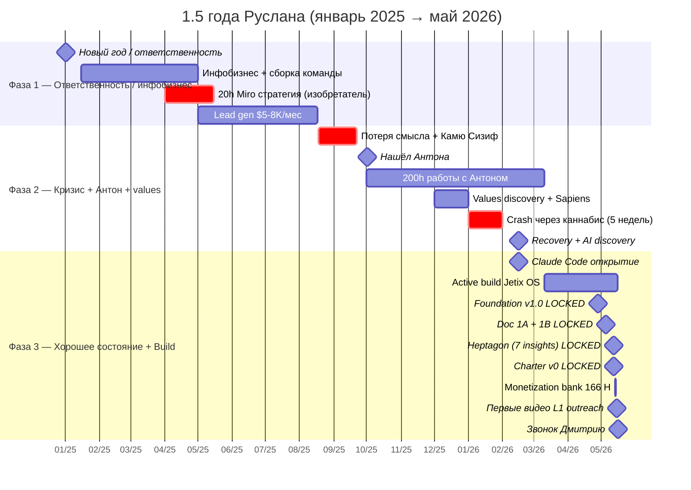
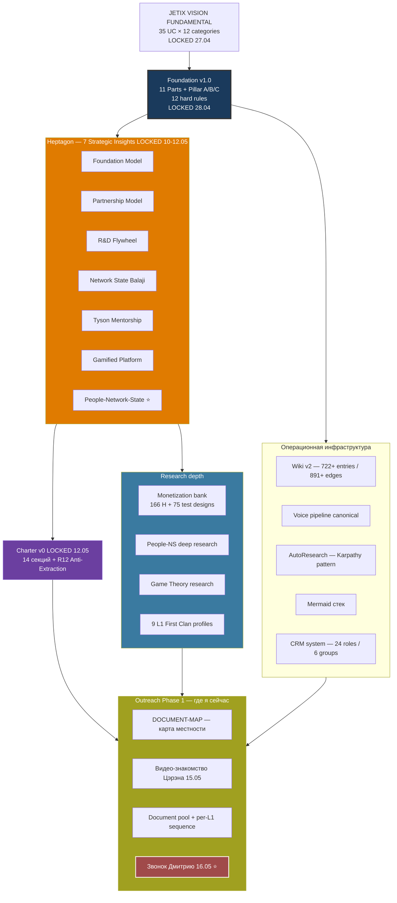

# 📞 Звонок с Дмитрием (Гуманитарщина) — call prep + narrative 1.5 года

> **Что это.** Документ для использования прямо во время звонка. Цель / план / 1.5-год narrative + статистика + 2 mermaid + open questions + anticipated. Не verbatim — talking points + reference.

---

## §1 ЦЕЛИ ЗВОНКА — ДВЕ

### Цель A — Обратная связь по содержанию
Получить feedback от умного человека по моим идеям / мыслям / наработкам — **что он думает**, интересно / не интересно, **что с этим можно сделать дальше**.

### Цель B — Обратная связь по подаче ⭐
**Как я подаю информацию** — насколько *разжёвано*, *пережёвано*, понятно. Доходит ли до умного человека **суть** того что я говорю. Это критично — нужна внешняя калибровка способа коммуникации (для всех будущих outreach звонков с L1).

> Обе цели — равноценны. Цель B часто упускается, но именно она даст мне rumb для следующих 8 звонков с L1.

---

## §2 ПЛАН ЗВОНКА — 5 блоков

| # | Блок | ~Доля | Ведёт | Цель |
|---|---|---|---|---|
| 1 | Приветствие + контекст «почему звоню» | 2-3 мин | Я | Setting + frame |
| 2 | **Кто я / 1.5 года narrative** | 10-15 мин | Я | Calibration + контекст; здесь Цель B измеряется |
| 3 | Где я сейчас + наработки | 5-10 мин | Я | Конкретика |
| 4 | **Обратная связь Дмитрия** (по содержанию + по подаче) | 15-25 мин | Дмитрий | **Core value звонка** |
| 5 | Asks Дмитрия / next concrete step | 5-10 мин | Оба | Cooperation surface + closure |

**Принцип:** В Блоках 2-3 я говорю много — это OK, потому что Цель B = анализ подачи. В Блоке 4 я ≤30%, Дмитрий ≥70%.

---

## §3 NARRATIVE — последние 1.5 года (для Блока 2)

3 фазы. Talking points, не verbatim.

### Фаза 1 — Ответственность + инфобизнес + команда (январь 2025 → июль 2025, ~6 мес)

**Триггер:** новый год 2025. Внутренне взял ответственность за жизнь.

**Что делал:**
- Начал разбираться в **инфобизнесе**
- Собрал **команду** в lead gen / маркетинговом направлении
- Начал **зарабатывать $5-8K в месяц** — аутрич, общение с людьми, менеджерская работа
- Начал **ответственно следить за временем и вниманием** (новый уровень дисциплины — следил всегда, но здесь появилась глубина)
- Собрал **стратегию на Miro доске** — 20 часов работы:
  - Хочу быть **изобретателем**
  - Хочу собрать **сообщество изобретателей**
  - Хочу быть **властным над самим собой**

**Tone:** «Я доказал себе что могу делать бизнес. Деньги пошли. Но это была *чужая* игра — лидген, маркетинг — не моё».

### Фаза 2 — Кризис смысла + Антон + values (август 2025 → февраль 2026, ~7 мес)

**Pivot point:** середина августа 2025. Lead gen на пике (35h/неделя глубокой работы, YT парсер golden find). И вдруг — *«зачем я вообще этим занимаюсь»*.

**Что происходило:**
- Mid-August 2025 — потерял смысл жизни *посреди недели*
- Читал **Камю «Миф о Сизифе»** → стало **ещё хуже** (не катарсис, а удар)
- Был в плохом состоянии **неделями** подряд
- Сам себя начал постепенно вытягивать / выкарабкиваться
- **Нашёл Антона** — учитель / ментор / психолог
- Проработали с ним **~200 часов** — видение жизни + ценности
- **Декабрь 2025** — values discovery, Sapiens (книга), ⭐ «понял что мне повезло жить»
- **Январь 2026** — crash через каннабис (5 недель подряд)
- 26 января — recovery начало

**Tone:** «Без этого периода ничего дальнейшего бы не было. Боль → smysl. Кризис не как баг, а как переход».

### Фаза 3 — Хорошее состояние + системная стройка (февраль 2026 → сейчас, ~3.5 мес)

**Условие фазы:** каждый день — **хорошее состояние** (стабильно). Это база, без которой следующее невозможно.

**Что строю:**
- Параллельно **две системы**:
  - **Система держать и улучшать это хорошее состояние** (Self-OS, в работе сейчас, Шаг 2 plan'a 16.05)
  - **Система работы с информацией** (Jetix OS — main thrust)
- **Mid-February 2026** — открытие **Claude Code** как «AI = electricity»
- Март-май — активный build:
  - 810 commits за 2 месяца
  - **Foundation v1.0 LOCKED** 28.04 (11 Parts + Pillar A/B/C + 12 Tier-2 rules)
  - **Heptagon — 7 strategic insights LOCKED** 10-12.05
  - **Charter v0 LOCKED** 12.05 (конституция first clan)
  - **Wiki KB** — 722+ entries + 891+ typed edges
  - **Monetization hypothesis bank** — 166 H + 75 test designs (14-15.05)
  - **9 L1 First Clan profiles** — Цэрэн / Левенчук / Тарасов / Хартман / Брагинский / Гиренко / Дмитрий / Дуров / Федорев
- 15.05 — **первые съёмки видео-знакомств для outreach к L1**
- Сейчас (16.05) — я делаю первые звонки. **Дмитрий — один из первых.**

**Tone:** «Сначала собрался изнутри. Теперь строю систему которая прокладывает мне дорогу — и потенциально тысячам других».

---

## §4 ГДЕ Я СЕЙЧАС — наработки (для Блока 3)

### Архитектура (что построено)

- **Foundation v1.0** — конституциональная архитектура (11 Parts + Pillar A/B/C + 12 hard rules)
- **Heptagon** — 7 strategic insights LOCKED:
  1. Foundation Model
  2. Partnership Model
  3. R&D Flywheel
  4. Network State (Balaji)
  5. Tyson Mentorship Pattern
  6. Gamified Platform
  7. People-Network-State ⭐
- **Charter v0** — конституция first clan (14 секций + R12 Anti-Extraction)
- **Wiki KB** — 722+ entries + 891+ edges
- **CRM system** — 24 roles в 6 группах
- **Monetization bank** — 166 H + 75 test designs (Phase 2+ ready)
- **9 L1 profiles** + outreach pipeline готов

### Стек

- **Claude Code** + **Antigravity environment**
- 12 specialized agents, 6 departments
- Filesystem = source of truth; Notion = view; Toggl = time tracking

### Phase 1 цель

**$100K к концу лета 2026.** 0 клиентов сейчас — главный диссонанс между ambitions и точкой.

### Long-term

100-200 лет marathon (Charter §1.7) — generational ambition.

---

## §5 СТАТИСТИКА TOGGL за последние 6 мес (объективная база)

**Window:** 2025-11-04 → 2026-05-03 (180 days, период активной системной работы)

- **Total tracked:** 869.2h / **350 entries** / ~4.8h/день logged (реально ~10-14h, density ~50%)

### Project breakdown

| Hours | Project | % |
|---|---|---|
| **355.2h** | 🌙 Сон | 41% |
| **126.1h** | 🛒 Рутина | 14.5% |
| **118.4h** | 🧠 Deep Work | 13.6% |
| **109.5h** | ⚠️ Ебланил | 12.6% honestly logged |
| 24.7h | 😌 Отдых | 2.8% |
| 16.8h | ⚡ Зарядка | 1.9% |
| 15.4h | 💪 Спорт | 1.8% |
| 11.2h | 🚶 Гулял | 1.3% |

### Monthly trend

| Month | Tracked | Context |
|---|---|---|
| 2025-11 | **260.8h** | start system work |
| 2025-12 | **251.8h** | ⭐ peak month — values discovery, Sapiens |
| 2026-01 | 128.4h | crash 5 weeks через каннабис |
| 2026-02 | 90.8h | AI discovery mid-Feb |
| 2026-03 | 53.9h | major dropoff |
| 2026-04 | 339h (annual data) | Foundation v1.0 LOCKED 28.04 |
| 2026-05 | partial | Heptagon + Charter + Monetization |

### 5 insights из stats (для разговора)

1. **Real "work" share ~25%** — Deep Work 118h + Работа тупая residual 92h = 210h/869h. Остальное — сон, рутина, ебланил.
2. **December 2025 = peak month** — совпало с values discovery + Sapiens (subjective + objective sync).
3. **Январь 2026 crash** — 5-week через каннабис (низшая точка). Видно объективно (128h vs 252h в декабре).
4. **Ебланил 12.6% honestly logged** = ~36 мин/день — вероятно understated (бессознательное не trackается).
5. **March 2026 dropoff** — 53.9h tracked. Either depression / illness / window edge artifact. Need retrospective.

---

## §6 MERMAID 1 — Timeline 1.5 года (gantt)



---

## §7 MERMAID 2 — Что построено за фазу 3 (структура наработок)



---

## §8 OPEN QUESTIONS Дмитрию (что хочу услышать в Блоке 4)

### По содержанию (Цель A)

1. **Что в моём narrative звучит сильно** — а что слабо / неубедительно?
2. **Какой 1 шаг ты бы сделал** в моей ситуации сегодня — если бы был выбор только один?
3. **Где я скорее всего ошибаюсь** — что blind spot?
4. **Кого мне стоит послушать** из людей которых ты знаешь?

### По подаче (Цель B — критично)

5. **Понимаешь ли ты что я делаю** — после моего рассказа? Или есть туман?
6. **Какие места были непонятны / слишком быстро** — где надо разжёвывать?
7. **Какой образ обо мне у тебя сложился** к концу — какими словами ты бы описал меня третьему лицу?
8. **Сколько % того что я сказал ты бы пересказал** правильно — а где потеря?

---

## §9 ANTICIPATED ВОПРОСЫ Дмитрия (готовые ответы)

| Вопрос | Короткий ответ |
|---|---|
| «Кто финансирует?» | Один. Сам. Этап стройки до денежного притока. |
| «Клиенты есть?» | 0. Стройка системы — первый этап. Монетизация → август-сентябрь 2026. |
| «Не слишком ли сложно?» | Вопрос темпа, не сложности. Foundation готов; теперь продвижение. |
| «Кто команда?» | Я + AI (Claude Code) сейчас. L1 First Clan — выходим на 9 mentor/partner-candidates прямо сейчас. |
| «Зачем 100-200 лет marathon?» | Generational ambition. L0-L6 operational ladder (10-15 лет). Не для продажи — для качества решений сегодня. |
| «AI всё построил?» | AI = scribe. Я = sole strategist. Constitutional discipline (R1 Tier 2): «AI does NOT make strategic decisions». |
| «А ты не выгораешь?» | Был crash в январе 2026 (5 недель). Сейчас стабильно. Параллельно строю Self-OS — систему которая держит состояние. |

**Если не знаю — честно скажу: «не знаю, нужно подумать, обсудим / вернусь к тебе с ответом».**

---

## §10 NEXT CONCRETE STEP (Блок 5 — закрытие)

После звонка — **один из четырёх**:

1. **Повторный созвон** через N дней (после проработки feedback)
2. **Совместный мини-pilot** — конкретная small работа вместе
3. **Представить кому-то** из его круга — если он видит match
4. **Pause с reason** — «вернёмся через X мес по конкретной причине Y»

**НЕ:** «будем на связи» без даты / формата = failure mode.

---

## §11 ПИСЬМО ДО ЗВОНКА (готов draft, если ещё не отправлено)

```
Добрый день, Дмитрий!

Хочу предложить взаимовыгодный обмен — созвон на 2 часа.

С моей стороны: $150 за ваше время. Хочу рассказать свои идеи и получить от вас
обратную связь по ключевым вопросам, которые у меня сейчас открыты.

Со своей стороны взамен — 2 часа консультации по темам, в которых я разбираюсь:
— Внедрение AI в жизнь и в работу с информацией: кратно повысить производительность
  обработки информации, выпуска статей, монтажа и обработки видео.
— Монетизация аудитории: способы превратить ваше сообщество в стабильный поток дохода.
— Платформа для сообщества: чтобы ваши люди могли взаимодействовать, запускать
  совместные бизнес-проекты, а вы получали % с активности.
— Сайт-воронка продаж. Найду команду которая будет работать под вашим руководством.

В целом — сделаю вас миллионером. Что скажете?
```

---

## §12 POST-CALL TODO (в течение 24 ч)

1. **CRM update:** `crm/people/dmitry-humanitarschina-l1.md` §11 history — что обсуждали / его asks / его offers
2. **Reflection notes** — что сработало / не сработало (вход в Self-OS spec обогащение)
3. **Цель B анализ** — что он сказал про подачу + где я не donёс. → Применить ко всем будущим L1 звонкам.
4. **Next touchpoint** в календарь
5. **Append §13** ниже — log звонка
6. (опционально) Voice-route reflection в `decisions/REFLECTION-INBOX-2026-05-16.md`

---

## §13 LOG (append-only после звонка)

*(заполнится по итогу звонка)*

---

*Создано 2026-05-16. Sources: reports/anton-call-report-2026-05-11.md + reports/timeline-narrative-2025-07_to_2026-05.md + reports/toggl_last6months_2025-11_to_2026-05.md. Constitutional anchor: AI = scribe; Ruslan = sole strategist. F: F2 / G: dmitry-call-applied-now.*
