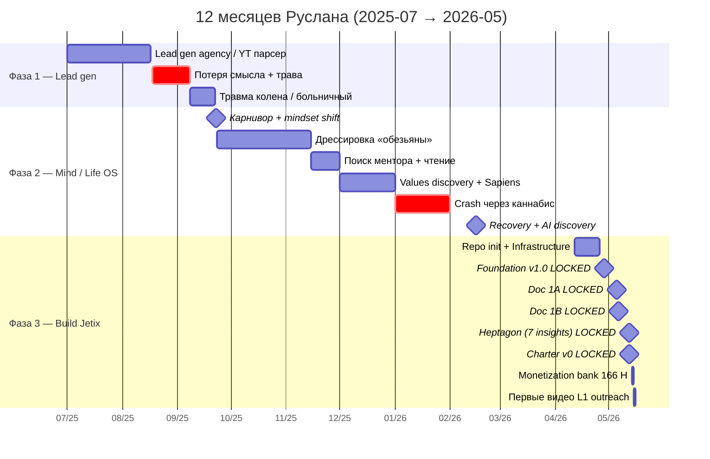
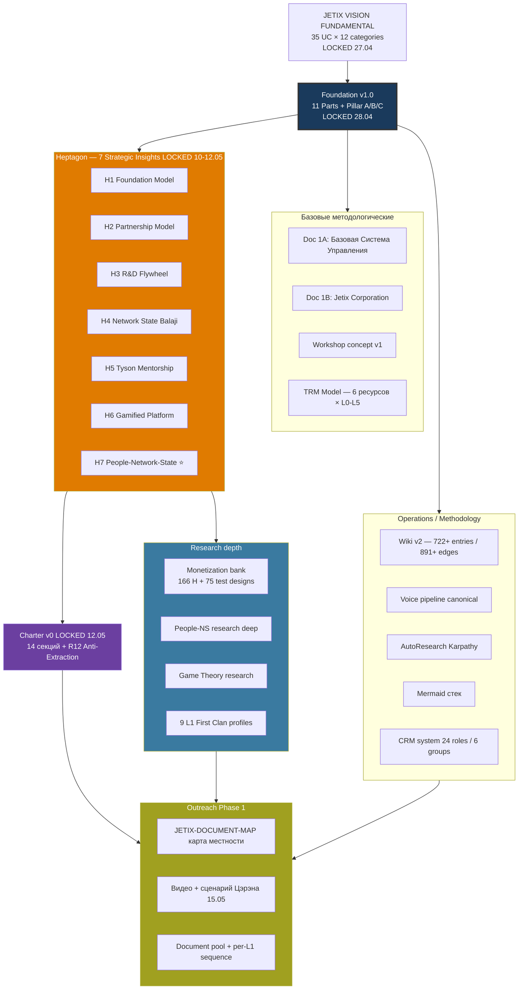

# 📞 Звонок с Дмитрием (Гуманитарщина) — call prep + краткий отчёт за 12 месяцев

> **Что это.** Документ для использования прямо во время звонка с Дмитрием. Цель / план / краткий narrative + статистика + 2 mermaid + open questions. Не verbatim — talking points + reference material.

---

## §1 ЦЕЛЬ ЗВОНКА — одна фраза

**Получить обратную связь от умного человека (Дмитрия) по всем моим мыслям и наработкам.** Калибровка снаружи.

---

## §2 ГЛАВНЫЙ ВОПРОС, на который хочу услышать ответ

> **«Что я должен сделать в ближайшие 12 месяцев, чтобы сделать что-то ТАКОЕ, что будет заметно?»**

Не abstract «развитие», не «расти». **Заметно** — конкретно. Метрика — внешняя видимость / impact / реакция мира.

---

## §3 ПЛАН ЗВОНКА — 6 блоков

| # | Блок | ~Доля | Кто ведёт | Цель |
|---|---|---|---|---|
| 1 | Приветствие + контекст «почему звоню» | 2-3 мин | Я | Setting + frame |
| 2 | Кто я / где был год назад (12-month narrative) | 5-7 мин | Я | Calibration + контекст |
| 3 | Где я сейчас + что построено | 5-7 мин | Я | Конкретика наработок |
| 4 | **Главный вопрос + диалог** | 15-25 мин | Дмитрий | **Core value звонка** |
| 5 | Asks от Дмитрия — что ему интересно / нужна помощь | 10-15 мин | Дмитрий | Cooperation surface |
| 6 | Next concrete step | 2-3 мин | Я | Closure |

**Принцип:** Я говорю ≤40% времени. Дмитрий ≥60%. Если перевернул — формат сломан.

---

## §4 КРАТКИЙ NARRATIVE 12 МЕСЯЦЕВ (для Блока 2)

### 3 фазы пути (2025-07 → 2026-05)

#### Фаза 1 — Lead gen / agency operations (июль-сентябрь 2025, ~3 мес)
- Работал над лидген отделом, YT-парсер, ICP analysis, voice outreach, видео для агентства
- **Peak:** 21.07-27.07 (Eff 4, DW 17.5h) — глубокая работа над лидгеном; **04-17.08** = золотая находка YT парсера (35h DW неделя)
- **Pivot point:** 18.08 — «потерял смысл жизни» mid-week → конец августа в курении травы
- 22.09 — **переход на карнивор**, начало нового витка
- Toggl peak: 297h июль / 292h август / 301h сентябрь

#### Фаза 2 — Mind discipline + Life OS / Values discovery (октябрь 2025 — февраль 2026, ~5 мес)
- Травма колена → больничный → переход на mindset work
- Метафора **«обезьяна»** для импульсов, правильное delegation внутренним state'ам
- Декабрь 2025 ⭐ — **peak inner work month.** «Понял что мне повезло жить, начал ценить жизнь и брать ответственность». Sapiens (книга) → расширение картины мира
- Январь 2026 — **5-week crash** через каннабис, loss of purpose (низшая точка 12.01-18.01)
- 26.01 — recovery начало
- **Mid-Feb 2026** — открытие **Claude Code** как «game changer» (AI = electricity, ценность смещается от ума к выбору)

#### Фаза 3 — Active build Jetix (март-май 2026, ~2.5 мес, ⭐ текущая)
- 11.03 — последний созвон с Антоном; ~12.04 — repo init Jetix OS
- **28.04 — Foundation v1.0 LOCKED** (11 Parts + Pillar C, tag `foundation-architecture-locked-2026-04-28`)
- 04-06.05 — Документ 1A (Базовая Система Управления) + Документ 1B (Jetix Corporation) LOCKED
- 10-12.05 — **Heptagon — 7 strategic insights LOCKED** (Foundation Model / Partnership / R&D Flywheel / Network State Balaji / Tyson Mentorship / Gamified Platform / People-Network-State)
- 12.05 — **Charter v0 LOCKED**, **R12 Anti-Extraction = 12-я Tier 2 rule**
- 14-15.05 — Monetization × Audience Cooperation methodology v0 + Wave 2 deeper mining (**166 H гипотез монетизации + 75 test designs + 15 книг deep + 25 industry numbers**)
- 15.05 — **первые съёмки видео-знакомств L1 для outreach**

---

## §5 ГДЕ Я СЕЙЧАС — наработки (для Блока 3)

### Архитектура (что построено)

- **Foundation v1.0** — конституциональная архитектура из 11 Parts + Pillar A/B/C + 12 hard rules
- **Heptagon** — 7 strategic insights LOCKED
- **Charter v0** — конституция first clan (14 секций)
- **Wiki KB** — 722+ entries + 891+ typed edges в graph
- **Voice pipeline canonical** + **AutoResearch (Karpathy pattern)** + **Mermaid стек**
- **CRM system** — multi-purpose contact network (24 roles в 6 группах)
- **9 L1 First Clan candidates** — deep profiles, готовы к outreach
- **Monetization hypothesis bank** — 166 H + 75 test designs (Phase 2+ ready)
- **Document MAP** — 3 mermaid карта местности всех LOCKED docs

### Стек

- **Claude Code** (Max sub headless via `claude -p`) — main workhorse
- **Antigravity environment** — local repo на сервере + Cloud Cowork orchestration
- 12 specialized agents, 6 departments
- Filesystem = source of truth; Notion = view; Toggl = time tracking

### Цель Phase 1

**$100K к концу лета 2026** (август-сентябрь). 0 клиентов сейчас. Главный диссонанс — ambitions vs реальная точка.

### Long-term

**$1T trajectory** (engineering-faith bet, не pyramid). 100-200 лет marathon (Charter §1.7) — generational ambition.

---

## §6 СТАТИСТИКА TOGGL — последние 6 месяцев (для перепроверки Дмитрию)

**Window:** 2025-11-04 → 2026-05-03 (180 days, период активной системной работы)

- **Entries:** 350 / **Total tracked:** 869.2h
- **Avg per day:** ~4.8h logged (реально ~10-14h, density ~50%)

### Project breakdown

| Hours | Project | % | Note |
|---|---|---|---|
| **355.2h** | 🌙 Сон | 41% | tracking ~25-30% nights max |
| **126.1h** | 🛒 Рутина | 14.5% | быт + еда + работа тупая |
| **118.4h** | 🧠 Deep Work | 13.6% | главный output driver |
| **109.5h** | ⚠️ Ебланил | 12.6% | honest — youtube / мобила / соц |
| 92.0h | Работа тупая (residual) | — | merging в Рутина |
| 24.7h | 😌 Отдых | 2.8% | |
| 16.8h | ⚡ Зарядка | 1.9% | |
| 15.4h | 💪 Спорт | 1.8% | |
| 11.2h | 🚶 Гулял | 1.3% | |

### Monthly trend

| Month | Tracked | Context |
|---|---|---|
| 2025-11 | **260.8h** | start system work (Foundation build начало) |
| 2025-12 | **251.8h** | peak month, Sapiens, values discovery |
| 2026-01 | 128.4h | crash + recovery |
| 2026-02 | 90.8h | AI discovery (mid-Feb) |
| 2026-03 | 53.9h | major dropoff — review pattern needed |
| 2026-04 | 339h (annual) | Foundation v1.0 LOCKED 28.04 |
| 2026-05 | partial | Heptagon + Charter + Monetization |

### Ключевые insights из stats

1. **Real "work" share = ~25%** (Deep Work 118h + Работа тупая residual 92h = 210h / 869h)
2. **DW Jetix-foundation + Jetix-workshop** = главные домены (последние месяцы по toggl tags)
3. **Ебланил 12.6% honestly logged** = ~36 мин/день (вероятно understated — большая часть unconscious)
4. **Sport + Зарядка + Гулял = ~5%** = 0.24h/день physical (low — нужно ≥1h/день)
5. **December 2025 = peak month** (337h Toggl) совпало с values discovery + Sapiens

---

## §7 MERMAID 1 — Timeline 12 месяцев (gantt)



---

## §8 MERMAID 2 — Что построено (структура наработок)



---

## §9 OPEN QUESTIONS Дмитрию (то что хочу услышать)

В дополнение к главному вопросу §2:

1. **Что в моём narrative звучит сильно** — а что слабо / неубедительно?
2. **Какой 1 шаг ты бы сделал** в моей ситуации сегодня — если у тебя был выбор только один?
3. **Где я скорее всего ошибаюсь** в текущей стратегии? Что — blind spot?
4. **Кого мне стоит послушать** из людей которых ты знаешь (помимо Левенчука / Цэрэна)?
5. **Что ты делал** в свой первый «заметный» год — как ты это организовал?

---

## §10 ANTICIPATED ВОПРОСЫ Дмитрия (что отвечать)

| Вопрос | Короткий ответ |
|---|---|
| «А кто за тобой стоит / финансирует?» | Один. Финансирую сам. Этап стройки до денежного притока |
| «А клиенты есть?» | 0 на сегодня. Стройка системы первым этапом, монетизация — выход в августе |
| «А не слишком ли сложно?» | Это вопрос темпа, не сложности. Foundation готов; теперь продвижение |
| «А кто твоя команда?» | Сейчас я + AI (Claude Code). L1 First Clan — выходим на 9 mentor/partner-candidates сейчас |
| «А зачем 100-200 лет marathon?» | Generational ambition. L0-L6 operational ladder (10-15 лет). Не для продажи — для качества решений сегодня |
| «А AI всё это построил?» | AI = scribe. Я = sole strategist. Constitutional discipline (R1) preserved |

**Если не знаю — честно скажу: «не знаю, нужно подумать / обсудим».**

---

## §11 NEXT CONCRETE STEP (для Блока 6)

После звонка — **один из четырёх**:

1. **Повторный созвон** через N дней после прорабатывания feedback
2. **Совместный мини-pilot** — конкретная small работа вместе (Дмитрий → predmet)
3. **Представить кому-то** из его круга — если он видит match
4. **Pause с reason** — «вернёмся через X мес по конкретной причине Y»

**НЕ:** «будем на связи» без даты / формата. Это failure mode.

---

## §12 ПИСЬМО ДО ЗВОНКА (если ещё не отправлено)

Готов draft на $150 + 2ч взаимная консультация:
```
Добрый день, Дмитрий!

Хочу предложить взаимовыгодный обмен — созвон на 2 часа.

С моей стороны: $150 за ваше время. Хочу рассказать свои идеи и получить от вас
обратную связь по ключевым вопросам, которые у меня сейчас открыты.

Со своей стороны взамен — 2 часа консультации по темам, в которых я разбираюсь:
— Внедрение AI в жизнь и в работу с информацией: кратно повысить производительность.
— Монетизация аудитории: способы превратить ваше сообщество в стабильный поток дохода.
— Платформа для сообщества: чтобы ваши люди могли взаимодействовать, запускать
  совместные бизнес-проекты, а вы получали % с активности.
— Сайт-воронка продаж. Найду команду которая будет работать под вашим руководством.

В целом — сделаю вас миллионером. Что скажете?
```

---

## §13 POST-CALL TODO (в течение 24 ч)

1. CRM update: `crm/people/dmitry-humanitarschina-l1.md` §11 history (что обсуждали, его asks, его offers)
2. Reflection notes — что сработало / что не сработало
3. Что говорил Дмитрий полезного → reflection inbox + Self-OS spec contributions (если applicable)
4. Next touchpoint в календарь
5. Append к этому файлу §14 «Что произошло» (append-only log)

---

## §14 LOG (append-only после звонка)

*(заполнится по итогу звонка)*

---

*Создано 2026-05-16. Sources: Anton report 11.05 + Timeline narrative 2025-07→2026-05 + Toggl 6-month report. Constitutional anchor: AI = scribe; Ruslan = sole strategist. F: F2 / G: dmitry-call-applied-now.*
