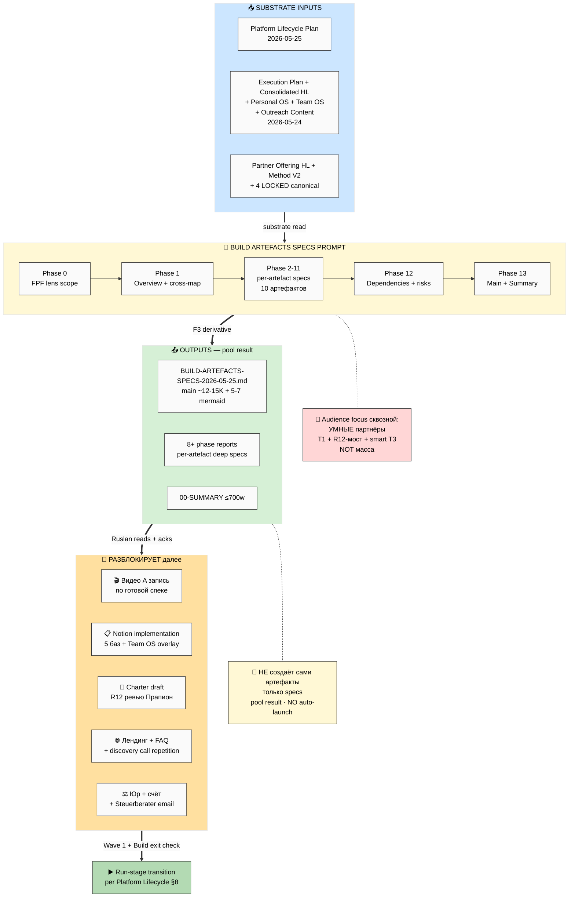

# 🏗️ EXPLAIN — Build Artefacts Specs (детальные спецификации артефактов перед сборкой)

> **Что это.** Документ объясняет ЧТО будет делать deep prompt на server CC ДО запуска. Ты читаешь — понимаешь — даёшь «погнали» или корректируешь.
>
> **Главная мысль:** Platform Lifecycle Plan дал общую карту 3 этапов. Сейчас на Build висят ~10-12 конкретных артефактов (видео A/B/C, Notion-шаблоны, Charter, лендинг, юр, бизнес-счёт и т.д.). Прежде чем начать их **делать руками** — нужны **спецификации**: что каждый артефакт делает / на кого нацелен / как структурно устроен / какая цель / какие зависимости / откуда substrate тянем. Сам prompt **НЕ создаёт сами артефакты** — он создаёт **карту спеков**, по которым ты потом сможешь их собрать целенаправленно (с substrate подтянутым из готовых документов).

---

## §1 Что у нас СЕЙЧАС (state до запуска)

### Substrate готов (без пересборки можно использовать)

- **Platform Lifecycle Stages Plan** (2026-05-25) — 3 режима + per-stage actors + 4-недельный Build план + 10 R1 решений
- **Execution Plan Fixation** (24.05) — 4 типа партнёров T1-T4 + 2 направления A/B + sequencing 3 недели
- **Consolidated Human-Language Plan** (24.05) — 7 ступеней Bloom + 7 принципов + 5+1 архетипов + что даём на каждой ступени
- **Personal OS Notion Template Plan** (24.05) — Layer 1+2 дизайн (НЕ implementation), 5 баз core
- **Team OS Notion Template Plan** (24.05) — Layer 3 multi-tenant + 10 ролей + marketplace + monetization
- **Outreach Content Outcomes CTAs** (24.05, 38K) — 13 CTA + 18 артефактов P0-P6 + 5+1 архетипов + 7+3 принципов + анти-паттерны
- **Research Education** (24.05) — 12 Jetix proposals
- **Partner Offering Human-Lang** (22.05) — style anchor + цены L1-L7 + 75/25 + Mondragón 5:1
- **Method V2 / Strategic Plan / Economic V10 / AI Market PLAN** — 4 LOCKED canonical
- **Foundation v1.0** — 11 Parts + Pillar A/C
- **17 ROY agents** + 62 wiki concepts + 80+ книг
- **CRM** — 180 контактов + 24 роли + 13 статусов + voice integration

### Что НЕ зафиксировано (gap который заполняет этот prompt)

❌ **Per-artefact deep spec** — для каждого Build-артефакта (видео A/B/C, Notion, Charter, лендинг, юр, счёт, supporting) НЕТ детальной спеки: цель / аудитория / структура / hook / CTA / длина / зависимости / substrate sources / R12 чек / acceptance criteria / анти-паттерны / варианты / R1 decisions.

❌ **Audience focus** — primary audience = **умные партнёры** (T1 методологи + R12-мост + smart T3 тестеры) — отдельно НЕ зафиксировано как guiding principle per artefact. Сейчас все документы говорят «все 5+1 архетипов», но Build стадия = узкий фокус на critical-thinking партнёрах.

❌ **Cross-artefact dependencies** — какой артефакт от какого зависит, что должно быть готово ДО чего (видео A → лендинг? Charter → discovery call? Notion → demo для Сева?).

❌ **Substrate-pull map** — какой готовый документ тянется в какой артефакт (Method V2 → Видео A; PARTNER-OFFERING → лендинг; Personal OS Plan → Notion implementation; etc.).

❌ **Build → Run handoff specs** — что каждый артефакт должен покрыть, чтобы **умный партнёр потом смог его использовать/продвинуть сам** (это focus per твой brief сейчас).

---

## §2 Что делает этот prompt (одним абзацем)

Берёт PLATFORM-LIFECYCLE-STAGES-PLAN §6 (documents matrix) + §8 (Build 4 weeks) + полный substrate (PARTNER-OFFERING / EXECUTION-PLAN / CONSOLIDATED-HL / PERSONAL-OS / TEAM-OS / OUTREACH-CONTENT / Method V2 / ed-paradigm O-176..O-185), и **per Build-артефакт** (~10-12 штук) производит детальную спеку: **что это / цель / аудитория / ключевые сообщения / структура / hook / CTA / длина-формат / зависимости / substrate sources / R12 paired-frame check / acceptance criteria / анти-паттерны / варианты / R1 decisions**. Audience-фокус сквозной — **умные партнёры (T1 методологи + R12-мост + smart T3 тестеры)**, не масса. Результат — один plain-Russian документ ≤12-15K слов + 5-7 mermaid + 00-SUMMARY ≤700w + 8 фазовых отчётов. **R1 surface only** — все варианты = options + facts, не «рекомендую X». **F3 derivative** — нового research не делается, только перерезка существующего substrate через per-artefact spec lens. **Сами артефакты не создаются** — только их спецификации. Pool result, no auto-launch consequent.

---

## §3 Вход / Pipeline / Выход

**Вход:**
- `decisions/strategic/PLATFORM-LIFECYCLE-STAGES-PLAN-2026-05-25.md` (parent — Build matrix §6 + 4 недели §8)
- `decisions/strategic/EXECUTION-PLAN-FIXATION-2026-05-24.md` (4 типа партнёров + sequencing baseline)
- `decisions/strategic/CONSOLIDATED-HUMAN-LANGUAGE-PLAN-2026-05-24.md` (7 ступеней Bloom + принципы)
- `decisions/strategic/PERSONAL-OS-NOTION-TEMPLATE-PLAN-2026-05-24.md` (Personal OS дизайн)
- `decisions/strategic/TEAM-OS-NOTION-TEMPLATE-PLAN-2026-05-24.md` (Team OS дизайн)
- `decisions/strategic/OUTREACH-CONTENT-OUTCOMES-CTAS-2026-05-24.md` (13 CTA + 18 P0-P6 + архетипы + принципы)
- `decisions/strategic/RUSLAN-NOTES-EDUCATION-PARADIGM-2026-05-24.md` (O-176..O-185 paradigm shift)
- `PARTNER-OFFERING-HUMAN-LANG-2026-05-22.md` (style anchor + цены L1-L7 + 75/25)
- `decisions/strategic/METHOD-LIFE-DEVELOPMENT-V2-2026-05-21.md` (методология canonical)
- 4 LOCKED canonical (reference only)

**Pipeline:** Phase 0 FPF lens scope → Phase 1 overview + кросс-карта артефактов → Phase 2-11 per-artefact deep specs → Phase 12 dependencies + sequencing + risk map → Phase 13 main consolidated + summary + per-artefact matrix + mermaid INDEX. Per-phase commit + push `[build-specs] Phase N`.

**Выход:**
- `decisions/strategic/BUILD-ARTEFACTS-SPECS-2026-05-25.md` — main consolidated ~12-15K plain Russian с emoji headers + per-artefact spec sheets
- `reports/build-artefacts-specs-2026-05-25/` — 8+ фазовых отчётов с deep specs per phase
- `reports/build-artefacts-specs-2026-05-25/diagrams/_INDEX.md` — 5-7 mermaid BS-1..BS-7 inline
- `reports/build-artefacts-specs-2026-05-25/00-SUMMARY-FOR-RUSLAN.md` — ≤700w

---

## §4 Шаги (per-phase breakdown)

| Фаза | Что делает | Output |
|---|---|---|
| **Phase 0** | FPF lens scope: определяем «Build артефакт = что в FPF terms» (artefact / spec / role / method?), per-artefact F-G-R triple framework, IP-1 separation (артефакт vs его создатель) | `01-fpf-lens-scope.md` |
| **Phase 1** | Overview + кросс-карта 10-12 Build артефактов (что есть / что нужно / связи между ними) + audience фокус на умных партнёрах + mermaid BS-1 | `02-overview-cross-map.md` |
| **Phase 2** | 🎬 Видео A spec — методология / прошивка / база (target: умные методологи + сам R12-чек метода) | `03-video-A-spec.md` |
| **Phase 3** | 🎬 Видео B spec — видение обучения / 7 ступеней / paradigm shift O-176..O-185 (target: умные тестеры + потенциальные cohort members) | `04-video-B-spec.md` |
| **Phase 4** | 🎬 Видео C spec — экосистема / Charter / R12 / 4 типа партнёров (target: умные партнёры T1 методологи + R12-мост) | `05-video-C-spec.md` |
| **Phase 5** | 📋 Notion Personal OS implementation spec (Layer 1+2 — 5 баз core: какие, что в них, fork-friendly, как партнёр использует) | `06-notion-personal-os-spec.md` |
| **Phase 6** | 📋 Notion Team OS implementation spec (Layer 3 — multi-tenant overlay, что добавляется поверх Personal OS, demo-ready scope для одного партнёра) | `07-notion-team-os-spec.md` |
| **Phase 7** | 📜 Charter spec — текст v1 структура + R12 проверка (Прапион) + анти-секта + fork-and-leave + 30-day + Mondragón 5:1 | `08-charter-spec.md` |
| **Phase 8** | 🌐 Лендинг + FAQ spec — sections / hook / CTAs из 13 / FAQ 10 вопросов из реальных разговоров (placeholder для пополнения) | `09-landing-faq-spec.md` |
| **Phase 9** | 🗣️ Discovery call script spec — структура звонка / открытие / 7-10 вопросов / closing / R12 чек / 5 раз отрепетировать критерий | `10-discovery-call-spec.md` |
| **Phase 10** | ⚖️ Юр + бизнес-счёт + invoice template spec (Steuerberater email шаблон / Einzel-vs-GmbH-vs-UG таблица / контракт template / счёт SEPA-ready) | `11-legal-finance-spec.md` |
| **Phase 11** | 📚 Supporting materials spec — course skeleton (НЕ end-to-end) / Telegram positioning / sales-minimum (one-pager / pitch deck-light) / brand-minimum | `12-supporting-materials-spec.md` |
| **Phase 12** | 🔗 Dependencies + sequencing + risk map — какой артефакт от какого зависит / critical path / параллельность / risks per артефакт / mitigation + mermaid BS-2 (зависимости) + BS-3 (timeline-flow) | `13-dependencies-risks.md` |
| **Phase 13** | Main consolidated + per-artefact matrix table + 00-SUMMARY ≤700w + mermaid INDEX + final push | `BUILD-ARTEFACTS-SPECS-2026-05-25.md` (main) + `00-SUMMARY-FOR-RUSLAN.md` |

---

## §5 Куда продвигает (что разблокирует после прогона)

### Immediate unblocks

1. **Видео A запись** — ты получаешь готовую спеку (цель / hook / структура / scenes / длина / CTA) → садишься записывать без «а что говорить?»
2. **Notion implementation** — ты понимаешь какие именно базы (Personal OS 5 + Team OS overlay) с какими полями + что demo-ready для Дмитрия → строишь в Notion целенаправленно
3. **Charter draft** — структура текста + R12 чек-лист готов → пишешь текст под структуру, потом Прапион ревьюит
4. **Лендинг + FAQ** — sections готовы, текст пишется под готовый каркас
5. **Discovery call** — скрипт готов, репетируешь под готовый текст
6. **Юр** — email Steuerberater'у готов + матрица Einzel/GmbH/UG для решения
7. **Supporting** — course skeleton + Telegram positioning + sales-minimum готовы как стартовые точки

### Strategic value

- **Каша в голове закрывается** — каждый Build-артефакт получает свой spec sheet → меньше «что-то надо делать» / больше «делаю X по spec'у Y»
- **Substrate pull → Targeted** — больше не «что взять из 100+ документов?» → spec говорит «возьми X.section A, Y.section B, Z.section C» для каждого артефакта
- **Умные партнёры primary** — все артефакты заточены под critical-thinking аудиторию (T1 + R12-мост), а не размытое «для всех». Это focus.
- **Build→Run handoff readiness** — каждый артефакт специфицирован так, чтобы **умный партнёр потом мог его взять и продвигать/использовать сам** (не «только Ruslan'у понятно»)

### Что разблокирует pipeline-wise

После этого spec'а → 1 неделя на создание самих артефактов (Видео A + Notion 5 баз + Charter draft) → Wave 1 первая отправка → Build exit checkpoint per Platform Lifecycle §8.

---

## §6 Mermaid общий flow



---

## §7 Audience focus (sweeping principle)

Каждый артефакт специфицируется с **primary audience = умные партнёры** (T1 методолог + T1 R12-мост + smart T3 тестер):

- **Кто это конкретно:** Maxim, Oleg, Левенчук, Прапион, Дмитрий, Сева, Ilshat, Ivan — все critical-thinking people, methodology-savvy, не «массовая аудитория»
- **Что они знают:** базовое системное мышление, AI/Claude как минимум поверхностно, fluent в одной-двух методологиях, могут отличить bullshit от substance
- **Что они НЕ знают:** Jetix-specific терминология (FPF / R12 / Pillar C / cohort target ontology), наша конкретная философия о развитии методологии, наши конкретные инструменты
- **Что они хотят:** проверить метод на substance (не на маркетинг), понять чем мы отличаемся от Левенчука/МИМ, попробовать сами (low-friction trial), увидеть anti-extraction (не очередная пирамида)
- **Что их отпугнёт:** манипулятивный язык, академический жаргон без перевода, обещания «жизнь изменится», отсутствие конкретики, lock-in намёки

**Secondary audience (mention only, не focus):** массовые архетипы 5+1 (Engineer / Researcher / YouTuber / Methodologist / Entrepreneur / Humanitarian) — упоминаем что артефакты их потом тоже зацепят, но Build → Run handoff требует чтобы **умные партнёры сначала прошли**.

---

## §8 Safety summary

- ✅ **R1 surface only** — все варианты артефактов = options + facts, не «рекомендую X». Финальные decisions (тон / акценты / визуальный стиль / приоритезация) = Ruslan.
- ✅ **R2 STRICT** — Foundation paths не трогаем; 4 LOCKED canonical только reference, не modify.
- ✅ **R6** — каждый claim per артефакт carries F-G-R + cross-cite к substrate source (footnote-style, не повторяем content).
- ✅ **R11 Default-Deny** — никаких auto-actions: не создаём сами артефакты, не отправляем письма, не пушим в Notion API, не записываем видео.
- ✅ **R12 paired-frame STRICT** — каждый артефакт проходит 8 вопросов (цена ≤ польза / конкретно / соразмерно / по ступени / канал уместен / не доим/не запираем / нет манипуляции / стоп-сигнал готов). Influence-ethics-expert AUTO-FIRE per Charter spec + лендинг spec + видео C spec + discovery call spec.
- ✅ **IP-1 STRICT** — артефакт-типы (роли) abstract; имена создателей/исполнителей = RUSLAN-LAYER examples.
- ✅ **Append-only** — новые файлы, не modify existing decisions/strategic/.
- ✅ **Pool result** — NO auto-launch consequent prompts (не триггерим запись видео / не запускаем Notion implementation prompt). Ruslan reads → picks → next prompt.
- ✅ **F3 derivative** — никакого нового external research; только перерезка substrate через per-artefact spec lens.
- ✅ **No LOCK modifications** — 4 LOCKED canonical + Foundation paths + principles/ + shared/schemas/ + .claude/config/ untouched.

---

## §9 Acceptance gate summary (что делает run PASSED)

✅ 10-12 артефактов get full deep spec (15-point template per artefact)
✅ Main doc ≤12-15K plain Russian + 5-7 mermaid BS-1..BS-7 inline
✅ 00-SUMMARY ≤700w
✅ 8+ phase reports каждый с substantive content (не bullets-only)
✅ Audience focus = умные партнёры сквозной
✅ Substrate-pull map — explicit per артефакт (откуда что тянем)
✅ Dependencies graph — explicit cross-artefact zависимости
✅ R12 8-Q chek применён per каждому артефакту с partner-facing surface
✅ 10-15 R1 decisions surfaced (variants + facts, не resolved)
✅ Per-phase commit + push `[build-specs] Phase N`
✅ Final push с Main + Summary + Mermaid INDEX + per-artefact matrix

⛔ FAIL if:
- Strategic prose `prose_authored_by` ≠ scribe role
- LOCK files modified
- New external research attempted
- Sample артефакт content written (мы пишем СПЕКИ, не сами артефакты — если в Видео A spec появляется сам текст сценария > 1 параграфа, fail)
- Auto-launch consequent prompts
- Auto-creation Notion pages / Notion API calls
- Bare facts без F-G-R triple per major claim
- Имена treated as bindings (Maxim/Дмитрий/Прапион = examples per IP-1)

---

## §10 Если согласен — launch

После твоего ack «погнали» — я (Cloud Cowork) запускаю:

```bash
ssh jetix
tmux new -s build-specs
cd ~/jetix-os && git pull --ff-only
claude --dangerously-skip-permissions -p "$(cat <<'EOF'
Autonomous execution: prompts/build-artefacts-specs-2026-05-25.md

14 phases (0-13) per-phase commit + push в format [build-specs] Phase N.

⚠️ PLAIN RUSSIAN — conversational, dense, no jargon без перевода.
Style anchors: PARTNER-OFFERING-HUMAN-LANG + EXECUTION-PLAN-FIXATION + PLATFORM-LIFECYCLE-STAGES-PLAN.

F3 derivative — NO new research. Только substrate перерезка.
R1 surface only — variants + facts, не "рекомендую X".
NO sample artefact content — specs only, не sample tekst видео / sample Notion fields content / sample Charter parts.
Pool result — NO auto-launch consequent.

Final push: Phase 13 Main + Summary + per-artefact matrix + mermaid INDEX.
EOF
)"
# Ctrl-B then D — detach
```

Ждать ~3-5h автономно (depending на per-phase density). После завершения я pull обратно + surface summary + 10-15 R1 decisions tебе.

---

*EXPLAIN closure 2026-05-25. Build Artefacts Specs prompt — F3 derivative per Platform Lifecycle Plan §6+§8. 10-12 артефактов get deep specs (15-point template). Audience focus = умные партнёры. NO sample artefact content. Pool result. Awaiting Ruslan ack для launch.*
