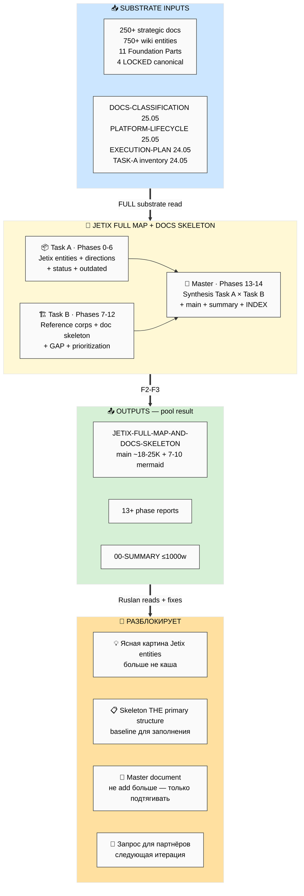

# 🗺️ EXPLAIN — Jetix Full Map (Task A) + Documents Skeleton (Task B)

> **Что это.** Объясняет за 2 минуты ЧТО будет делать deep prompt на server CC ДО запуска.

---

## §1 Что СЕЙЧАС (state до запуска)

Substrate saturation подтверждён (~250 strategic docs + 750 wiki entities + 80+ книг + 17 ROY + 11 Foundation Parts). Но **информация не упакована** — нельзя быстро донести до клиента «что такое Jetix» / «какие сущности» / «какие направления» / «как зарабатываем». Каша из docs.

**DOCS-CLASSIFICATION 25.05** дал 4 категории + GAP список, но **не дал** (a) единого верхне-уровневого «что Jetix есть на этот момент» (entities + directions) и (b) skeleton'а каких документов **должны** существовать у нормальной корпорации.

---

## §2 Что делает prompt (одним абзацем)

**Два задания combined в одном run'е:**

**Task A — Full Jetix extraction:** server CC проходит по ВСЕМ зафиксированным документам (decisions/strategic/ + decisions/ + wiki/concepts/ + canonical/ + 4 LOCKED + Foundation + AWAITING-APPROVAL) и выписывает **все основные entities + directions Jetix на 25.05**: метод / инструменты / корпорация (типы + уровни) / заработок (4+ модели — партнёры / фонды / % продвижения / автоматизация бизнеса) / платформа / образование / community / R12 защита / governance / research substrate. Плюс current status snapshot (где мы сейчас) + outdated/устаревшие docs to drop.

**Task B — Documents skeleton:** server CC проходит по reference corporations (Apple / Tesla / Mondragón / Berkshire / cooperative enterprises) + best practices enterprise documentation + наш накопленный substrate, и **проектирует skeleton всех документов которые ДОЛЖНЫ существовать** у «охуенной корпорации» Jetix (executive / methodology / platform / community / financial / legal / brand / research / governance / partner-facing). Per-doc one-liner + что в нём + кому. Plus mapping существующего vs missing (gap list).

Final: master skeleton — синтез Task A entities + Task B doc structure → один master документ который потом Ruslan заполнит / поправит / use как baseline.

---

## §3 Вход / Pipeline / Выход

**Вход:**
- ВСЕ существующие зафиксированные docs (250+ strategic + 750+ wiki + Foundation 11 Parts + Pillar A/C + 9 schemas + 14 AWAITING-APPROVAL + canonical/INDEX)
- DOCS-CLASSIFICATION-2026-05-25.md (baseline 4 категории + GAP list)
- PLATFORM-LIFECYCLE-STAGES-PLAN §6 + §4 (Build/Run/Scale документы matrix + actor types)
- EXECUTION-PLAN-FIXATION (4 типа партнёров + 2 направления + sequencing)
- TASK-A-EXISTING-DOCS-INVENTORY (~250 strategic + 750 wiki inventory)
- 4 LOCKED canonical (Method V2 / Strategic Plan / Economic V10 / AI Market PLAN)

**Pipeline:** 15 phases (0-14) — Task A (Phases 0-6) → Task B (Phases 7-12) → Master synthesis (Phases 13-14). Per-phase commit + push `[jetix-map] Phase N`.

**Выход:**
- `decisions/strategic/JETIX-FULL-MAP-AND-DOCS-SKELETON-2026-05-25.md` — main consolidated ~18-25K plain Russian + 7-10 mermaid JE-1..JE-10
- `reports/jetix-full-map-and-docs-skeleton-2026-05-25/` — 13+ phase reports
- `reports/.../00-SUMMARY-FOR-RUSLAN.md` — ≤1000w (этот run важнее обычного → SUMMARY длиннее)
- `reports/.../diagrams/_INDEX.md` — 7-10 mermaid

---

## §4 Шаги per-phase

| Фаза | Что | Output |
|---|---|---|
| **Phase 0** | FPF lens scope + full repo scan (verify substrate count vs Task A 24.05 inventory) | `01-fpf-lens-scope.md` |
| **Phase 1** | 🟦 **Jetix entities full extraction** (метод / инструменты / корпорация / заработок / платформа / образование / community / R12 / governance) — каждая сущность с definition + sub-entities + key docs refs | `02-entities-full.md` |
| **Phase 2** | 🎯 **Directions Jetix** — куда идём (4 направления / горизонты / приоритеты) | `03-directions.md` |
| **Phase 3** | 📊 **Status snapshot 25.05** — где мы по каждой сущности (готовность %) | `04-status-snapshot.md` |
| **Phase 4** | 🗑️ **Outdated / устаревшее** — surface что drop'аем из активного фокуса | `05-outdated.md` |
| **Phase 5** | 📐 **Task A mermaid** — JE-1..JE-3 (entity tree / directions / status overlay) | `06-task-a-mermaid.md` |
| **Phase 6** | ✅ **Task A consolidate** | `07-task-a-consolidated.md` |
| **Phase 7** | 🏛️ **Reference corporations doc-sets** — Apple / Tesla / Mondragón / Berkshire / cooperative-enterprises minimum doc set | `08-reference-corps.md` |
| **Phase 8** | 🏗️ **Jetix doc skeleton categories** — executive / methodology / platform / community / financial / legal / brand / research / governance / partner-facing | `09-doc-categories.md` |
| **Phase 9** | 📋 **Per-category doc list** — каждый документ с one-liner + что в нём + кому + audience | `10-per-category-docs.md` |
| **Phase 10** | 📊 **Mapping существующее vs missing** — GAP list per skeleton item | `11-gap-mapping.md` |
| **Phase 11** | 🎯 **Prioritization P0-P4** per Build/Run/Scale stage | `12-prioritization.md` |
| **Phase 12** | 📐 **Task B mermaid** — JE-4..JE-7 (doc taxonomy / category map / GAP overlay / Build-Run-Scale timeline) | `13-task-b-mermaid.md` |
| **Phase 13** | 🔗 **Master skeleton synthesis** — Task A entities × Task B doc structure → один master skeleton | `14-master-skeleton.md` |
| **Phase 14** | 📄 **Main consolidated + SUMMARY + INDEX** | `JETIX-FULL-MAP-AND-DOCS-SKELETON-2026-05-25.md` + `00-SUMMARY` + `diagrams/_INDEX.md` |

---

## §5 Куда продвигает (что разблокирует)

После прогона ты получаешь:

1. **Единый верхне-уровневый отчёт «Что Jetix есть на 25.05»** — entities / directions / status / outdated — больше не каша
2. **Skeleton документов которые должны быть** — baseline для следующей итерации (заполнение / правка / использование как master)
3. **GAP list** — что мы реально не написали (поверх DOCS-CLASSIFICATION § GAP)
4. **Master skeleton** — один документ который Ruslan потом фиксирует как **THE** primary structure, и больше не add'аем новое — только под этот skeleton подтягиваем существующее + заполняем missing
5. После этого → запрос для партнёров (на следующей итерации) — но base уже зафиксирован

**Это финальная organize итерация перед фиксацией baseline.**

---

## §6 Mermaid общий flow



---

## §7 Safety summary

- ✅ R1 surface only — variants + facts, Ruslan picks final skeleton structure
- ✅ R2 STRICT — Foundation paths не трогаем; 4 LOCKED canonical = reference only
- ✅ R6 — F-G-R triple + cross-cite к substrate source
- ✅ R11 — no auto-actions; не модифицируем existing docs; не создаём sample artefact content
- ✅ R12 paired-frame STRICT — sweep applied к partner-facing категориям skeleton
- ✅ IP-1 STRICT — entities = abstract types; instances (Maxim/Дмитрий/Прапион) = RUSLAN-LAYER examples
- ✅ Append-only — new files only
- ✅ Pool result — NO auto-launch consequent prompts
- ✅ F2-F3 — Task A = derivative (no new external research); Task B = reference best practices + our synthesis (NOT new methodology research)
- ⛔ NO sample doc content в Task B — только spec/skeleton (per Build Artefacts Specs anti-pattern lesson)

---

## §8 Launch command (после твоего ack «погнали»)

```bash
ssh jetix
tmux new -s jetix-map
cd ~/jetix-os && git pull --ff-only
claude --dangerously-skip-permissions -p "$(cat <<'EOF'
Autonomous execution: prompts/jetix-full-map-and-docs-skeleton-2026-05-25.md

15 phases (0-14) per-phase commit + push в format [jetix-map] Phase N.

§17.0 MAX-density mandate ACTIVE — ROY 500%, MAX tokens × 3, FULL substrate read (НЕ summaries).

⚠️ Plain Russian primary. Dense. No jargon без перевода.
Style anchors: PARTNER-OFFERING-HUMAN-LANG + EXECUTION-PLAN-FIXATION + PLATFORM-LIFECYCLE-STAGES-PLAN + DOCS-CLASSIFICATION.

F2-F3 derivative — NO new external research; Task A = repo scan + extraction; Task B = reference corps best practices + synthesis.
R1 surface only — variants + facts, не "рекомендую X".
NO sample doc content (Task B = skeleton/spec only, не filled documents).
NO modifications existing docs / 4 LOCKED / Foundation paths.
Pool result — NO auto-launch consequent.

Final push: Phase 14 Main + SUMMARY + per-category matrix + mermaid INDEX.
EOF
)"
# Ctrl-B then D — detach
```

Runtime expected: **4-6h autonomous** (major deliverable per §17.0 MAX-density).

---

*EXPLAIN closure 2026-05-25. Jetix Full Map (Task A) + Documents Skeleton (Task B) — combined run. F2-F3 derivative. ROY 500% per §17.0. Pool result. Awaiting Ruslan ack для launch.*
