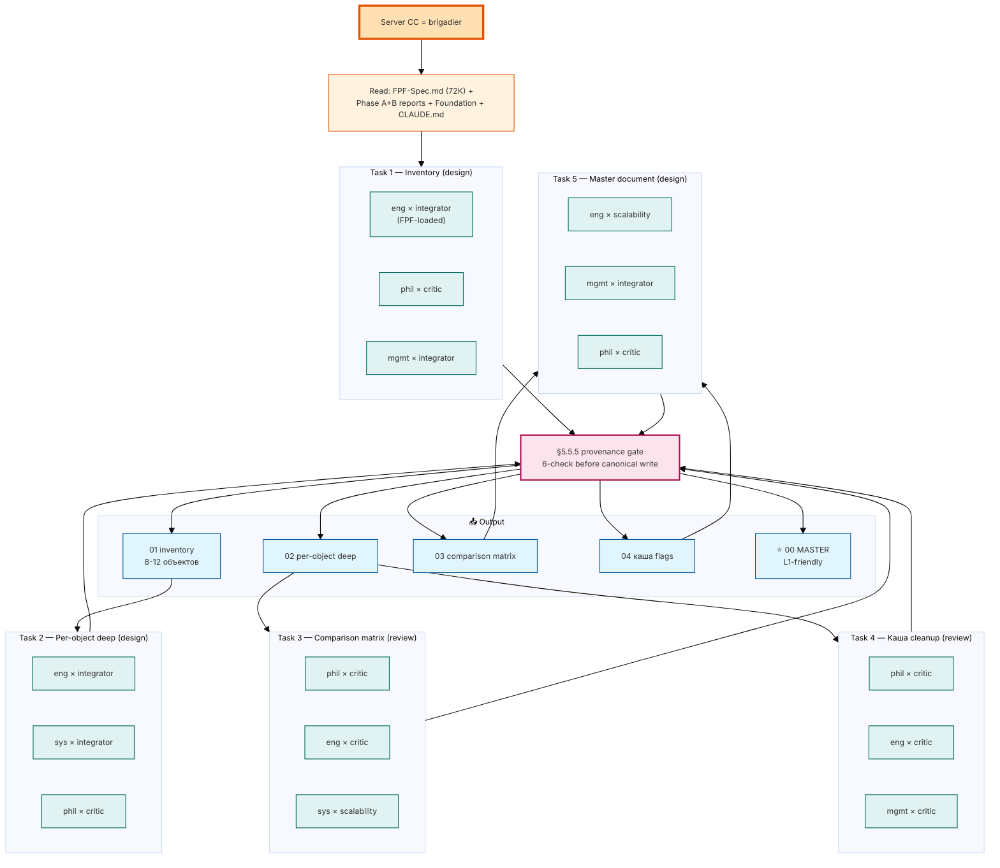

# 📖 Explanation — Phase 0 prompt (FPF scope definition)

> **Prompt:** [`prompts/phase-0-fpf-scope-definition-2026-05-17.md`](prompts/phase-0-fpf-scope-definition-2026-05-17.md)
>
> **Time:** 4-6 часов autonomous brigadier swarm
>
> **Cost cap:** €10/день baseline; halt + ask на €50

---

## §1 Что у нас СЕЙЧАС (state)

- Phase A complete (16.05, commit `b1cce0f`) — FPF base + IWE concept + self-audit vs FPF
- Phase B complete (17.05 afternoon, `9fc1123`) — FPF v2 + IWE template + Jetix vs IWE + working file + cooperation plan + letter bases
- **Проблема:** Phase B output = каша. Working file говорит «8 активных проектов», «12 агентов» как факт vs концепция. Сравнение Jetix vs IWE/FPF БЕЗ предварительного определения **что есть Jetix** (system / корпорация / задумка / рабочий продукт). Reference frame нестабилен.
- **Memory rule fixed (17.05):** перед любым research/анализ — **FPF lens FIRST**. Без этого = R1 violation замаскированная.

## §2 Что делает этот prompt (одним абзацем)

Server CC через **FPF lens** разбирает что есть Jetix СЕЙЧАС — **сам surface'ит inventory объектов** (минимум 8-12: system управления инфо / корпорация / задумка / рабочий продукт + ещё 4-8 которые ОН найдёт по FPF), описывает каждое **отдельно** через FPF terms (primitive / Part / applicable mechanisms / claims+FGR / bounded context), предлагает **на каком FPF-level** имеет смысл сравнивать каждый с Левенчуковскими/Цэрэновскими наработками, **флагает всю кашу** в existing docs (8 проектов / 12 агентов / устаревшее в Foundation / etc.), и собирает **L1-friendly master document** где L1 за 10 минут видит структурно что есть Jetix через FPF lens.

## §3 Что берёт на ВХОД

| Источник | Что |
|---|---|
| `raw/external/ailev-FPF/FPF-Spec.md` | **Свежий FPF 72K строк** (vendored с upstream 16.05) — primary FPF source |
| `inbox/levenchuk-tg-2026-05-17.md` | C1-C7 trigger claims |
| Phase A + B reports (8 файлов distillation) | Что мы знаем про FPF / IWE / Jetix-vs-FPF / Jetix-vs-IWE |
| `JETIX-WORKING-FILE-v0-2026-05-17.md` | Текущий working file (содержит кашу — Task 4 cleanup) |
| `CLAUDE.md` + Foundation Parts + Strategic Insights + Doc 1A/1B + Charter | Existing Jetix definitions across docs |
| `swarm/wiki/foundations/synthesis/foundation-master-overview-technical-2026-04-29.md` | Foundation technical overview |

## §4 Что обрабатывает (5 tasks через brigadier swarm)

| Task | Task_shape | Cells (3 параллельных) |
|---|---|---|
| **Task 1 — Inventory объектов Jetix через FPF lens** | design | eng × integrator (FPF-loaded) + phil × critic + mgmt × integrator |
| **Task 2 — Per-object FPF-typed описание (deep)** | design | eng × integrator + sys × integrator + phil × critic |
| **Task 3 — Comparison level matrix (× L1 analogues)** | review | phil × critic + eng × critic + sys × scalability |
| **Task 4 — Каша cleanup flags** | review | phil × critic + eng × critic + mgmt × critic |
| **Task 5 — Master document (Lakонично + L1-friendly)** | design | eng × scalability + mgmt × integrator + phil × critic |

Brigadier integrates с **dissent preservation per AP-6** → **§5.5.5 provenance gate** (6-check) → canonical writes.

## §5 Что получим на ВЫХОДЕ (конкретные файлы)

```
reports/phase-0-fpf-scope/
  00-JETIX-FPF-MASTER-2026-05-17.md      # L1-friendly final (≤2000 слов, 10 мин read)
  01-jetix-objects-inventory.md          # 8-12 объектов FPF-typed table
  02-objects-per-fpf-deep.md             # per-object 1-page descriptions
  03-comparison-matrix.md                # × L1 analogues × levels
  04-kasha-cleanup-flags.md              # stale items с suggested action
  diagrams/                               # 5+ mermaid
    01-objects-cluster.md
    02-comparison-matrix-visual.md
    03-fpf-layers-jetix-mapping.md
    04-kasha-heatmap.md
    05-master-tldr-mermaid.md
swarm/wiki/drafts/task-phase-0-*-*.md   # 15 cell drafts
```

**Total estimate output:** 7-10 новых файлов, 4-6К строк нового content, 5 mermaid.

## §6 Конкретные шаги (по порядку, brigadier dispatch)

| # | Task | Время | Output |
|---|---|---|---|
| 1 | Inventory объектов Jetix через FPF lens (server CC сам предлагает 8-12+) | ~1ч | `01-jetix-objects-inventory.md` |
| 2 | Per-object FPF-typed описание (deep, ≤1 page each) | ~1.5ч | `02-objects-per-fpf-deep.md` |
| 3 | Comparison level matrix (per object × FPF/IWE template/IWE paid/books/residency × level) | ~1ч | `03-comparison-matrix.md` |
| 4 | Каша cleanup flags (что устарело / противоречит) | ~1ч | `04-kasha-cleanup-flags.md` |
| 5 | Master document L1-friendly + 5 mermaid | ~1.5ч | `00-JETIX-FPF-MASTER-2026-05-17.md` + diagrams/ |

**Commits.** В конце каждой Task git commit `[phase-0-fpf-scope] Task N — <описание>`. Push origin main в самом конце.

## §7 К чему ведёт (где в roadmap)

```
Phase A (16.05) ✅ → Phase B (17.05) ✅ → [Phase 0 сегодня вечером]
→ Ruslan reads master + acks inventory/priority + decides cleanup actions
→ Phase C actual research/comparison (с stable FPF-lens reference frame)
→ Final L1 messaging (working file v1 NOT v0 каша)
→ Pack send к Левенчуку + Цэрэну
```

**Что Phase 0 решает:**
- Каша исчезает — у нас stable reference frame через FPF
- L1 могут общаться с нами на **одном FPF языке**
- Comparison meaningful (а не «сравнивает что-то с чем-то непонятно»)
- Working file v1 (replacing v0 каша) готов

**Что Phase 0 НЕ решает:**
- C4 benchmark execution (отдельная Phase C)
- IWE paid AI guide empirical (B2 blocker — paid subscription pending)
- Final letter text — Ruslan-authored
- AWAITING-APPROVAL packets для Foundation integration

## §8 Flow diagram



## §9 Что НЕ делает (anti-scope)

- НЕ trog'ает Foundation paths (R2)
- НЕ выбирает «важно/неважно» среди объектов — Ruslan решает priority после inventory готов
- НЕ удаляет existing docs — append-only, только flag устаревшее
- НЕ выполняет Phase C actual research/comparison — это сама scope definition
- НЕ пишет финальный текст ответа L1 — это Ruslan-authored (R1)
- НЕ обходит paywalls IWE paid AI guide
- НЕ writes «§РЕКОМЕНДАЦИИ» / «следует» — surface'инг only

## §10 Failure modes

| Если | Действие |
|---|---|
| Каша в existing docs масштабнее ожидаемого | Surface ALL без selection; Ruslan ack actions per item |
| Conflict между Foundation Parts и working file | Surface conflict, не resolve — Ruslan decision |
| Объектов больше 12 | Surface ALL — fine; consolidation optional |
| Cell returns contradicting inventories | Dissent preservation per AP-6; не average |
| Cost cap €50 | Halt + log + ask |

## §11 Ruslan: что делать перед launch

1. **Прочитай этот файл** (~5 минут)
2. **Опционально:** скан [`prompts/phase-0-fpf-scope-definition-2026-05-17.md`](prompts/phase-0-fpf-scope-definition-2026-05-17.md)
3. **Решение:**
   - ✅ «погнали» → launch команды ниже
   - ⚠️ «стой, change X» → меняю prompt + re-explain
   - ❌ «не сейчас» → ждём

### Launch команды

**Run 1 — Phase 0 (claude -p autonomous tmux, 4-6h):**

```
tmux new -s phase-0
```

```
cd ~/Desktop/jetix-os && git pull --ff-only && claude --dangerously-skip-permissions
```

После запуска Claude — paste:

```
ultrathink. Прочитай файл prompts/phase-0-fpf-scope-definition-2026-05-17.md полностью. Ты — brigadier Jetix swarm. Phase 0 = FPF lens scope definition. 5 tasks через cell dispatch (per §8 matrix). Ты сам предлагаешь inventory объектов Jetix (минимум 8-12), per-object FPF-typed описание, comparison levels matrix с L1 наработками, каша cleanup flags, master document для L1. R1 — Ruslan = sole strategist, ты surface'ишь варианты. R2 — Foundation read-only. Действуй автономно 4-6 часов, коммить per task, push в main в конце.
```

Detach: `Ctrl+B затем D`. Когда отработает — `git log` покажет commits + `reports/phase-0-fpf-scope/00-JETIX-FPF-MASTER-2026-05-17.md` готов.

**Run 2 (optional parallel) — `/ultrareview`:** в отдельной session — multi-agent cloud review of Phase B current state перед Phase 0.

```
/ultrareview
```
