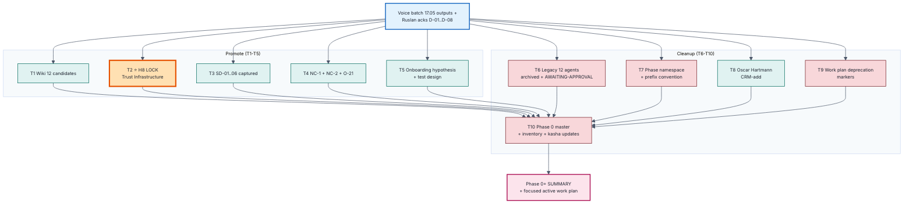

# 📖 Explanation — Phase 0+ Ruslan acks execution

> **Prompt:** [`prompts/phase-0-plus-ruslan-acks-2026-05-17.md`](prompts/phase-0-plus-ruslan-acks-2026-05-17.md)
> **Time:** 1-2 часа autonomous
> **Cost:** <€1

---

## §1 Состояние СЕЙЧАС

- Voice batch 17.05 завершён (commit `c7c142b`), 16 файлов, 4 commits
- Ruslan прочитал outputs, дал **acks** на decisions D-01..D-08 + work plan items
- Phase 0 reports + Phase 0+ batch reports готовы к **execution стадии** acks

## §2 Что делает prompt (одним абзацем)

Server CC выполняет **10 tasks** executing все Ruslan ack'и: (1) promote все 12 wiki candidates Tier A/B/C, (2) LOCK H8 Strategic Insight «Trust Infrastructure», (3) save 6 Strategic Directions в decisions/, (4) fix NC-1 Trust Infrastructure + NC-2 «Дорога», (5) create Onboarding-via-FPF hypothesis wiki claim с test design, (6) deprecate legacy 12 agents (AWAITING-APPROVAL packet + archive + CLAUDE.md update), (7) phase namespace cleanup с prefix convention LOCK, (8) Oscar Hartmann CRM-add, (9) remove deprecated items из work plan (ICP/EP-5/Council/Aisystant), (10) update Phase 0 master + inventory + kasha-flags.

## §3 Вход

- `reports/voice-pipeline-2026-05-17-batch/*` — все outputs voice batch
- `reports/phase-0-fpf-scope/*` — Phase 0 master + inventory + kasha-flags
- `decisions/STRATEGIC-INSIGHT-*` — pattern reference для H8 LOCK
- `CLAUDE.md` — Agent Roster section
- `.claude/agents/*` — files to triage
- `crm/_schema/` — CRM frontmatter format

## §4 Pipeline

10 tasks через brigadier swarm dispatch (cells per task — см. §1 prompt). Каждый task → cell drafts → brigadier integrate с AP-6 → §5.5.5 gate → canonical write. Git commit per task + final push.

## §5 Выход (15+ файлов)

```
wiki/ideas/ wiki/claims/ wiki/concepts/         # 12 promoted candidates
decisions/STRATEGIC-INSIGHT-JETIX-TRUST-INFRASTRUCTURE-2026-05-17.md  ⭐ H8 LOCK
decisions/STRATEGIC-DIRECTIONS-VOICE-17-2026-05-17.md                # 6 SDs preserved
decisions/PHASE-NAMESPACE-CONVENTION-2026-05-17.md                   # naming LOCK
swarm/awaiting-approval/legacy-12-agents-deprecation-2026-05-17.md   # packet
.claude/agents/_archived/                                            # 14 agents moved
CLAUDE.md                                                            # Agent Roster DEPRECATED markers
crm/people/oscar-hartmann.md                                         # new CRM entry
reports/voice-pipeline-2026-05-17-batch/04-detailed-work-plan.md     # deprecation markers
reports/phase-0-fpf-scope/00-MASTER + 01-inventory + 04-kasha        # updates
reports/phase-0-plus/00-SUMMARY-2026-05-17-evening.md                # ≤1000 слов
```

## §6 Шаги (10 tasks)

| # | Task | ETA |
|---|---|---|
| T1 | Wiki promotion 12 candidates | ~15 min |
| T2 | H8 LOCK Strategic Insight | ~15 min |
| T3 | Strategic Directions SD-01..06 → decisions/ | ~10 min |
| T4 | NC-1 + NC-2 wiki entries + O-21 candidate | ~10 min |
| T5 | Onboarding hypothesis wiki claim + test design | ~10 min |
| T6 | Legacy 12 agents deprecation + archive | ~15 min |
| T7 | Phase namespace cleanup + prefix convention | ~10 min |
| T8 | Oscar Hartmann CRM-add | ~5 min |
| T9 | Work plan cleanup (deprecated items markers) | ~5 min |
| T10 | Phase 0 master + reports updates | ~10 min |

**Total: ~1-2 часа**

## §7 К чему ведёт

После Phase 0+ execution:
- **Каша значительно cleared** — deprecated items больше не в active blockers
- **H8 Hexagon LOCKED** — 7 → 8 insights (или Hexagon → Octagon resolved)
- **2 new architecture candidates** captured (Trust Infrastructure + Road)
- **Legacy bloat removed** (12 agents archived)
- **Oscar Hartmann** в pipeline
- **Onboarding hypothesis** is testable claim — Phase C может execute test
- **Work plan focused** — только active items (ST-01 FPF doc, ST-02 plans→FPF, ST-03 onboarding, ST-06 human-readable)

## §8 Flow mermaid



## §9 Что НЕ делает (anti-scope)

- НЕ trog'ает Foundation Parts (требует separate packet)
- НЕ delete LOCKED docs (append-only, mark only)
- НЕ resurrect deprecated work items
- НЕ create new Strategic Insights помимо H8
- НЕ touch ROY swarm agents (only legacy 12)

## §10 Failure modes

| Если | Действие |
|---|---|
| H8 vs Hexagon naming не resolvable | Surface как escalation, не auto-decide |
| Legacy agents archive conflict с running session | Skip mv, mark file frontmatter only |
| AWAITING-APPROVAL packet rejection (rare) | Halt T6, continue others |
| Wiki candidate F-G-R missing | Use defaults from cell drafts |

## §11 Launch

```
tmux new -s phase-0-plus
```

```
cd ~/Desktop/jetix-os && git pull --rebase origin main && claude --dangerously-skip-permissions
```

Paste:

```
ultrathink. Прочитай prompts/phase-0-plus-ruslan-acks-2026-05-17.md полностью. Ты — brigadier. Все §0 RUSLAN ACKS = explicit operational instructions, не surface options. 10 tasks через cell dispatch (per §1 matrix). T1 wiki promotion / T2 H8 LOCK / T3 strategic directions / T4 NC-1+NC-2 / T5 onboarding hypothesis / T6 legacy 12 agents deprecation (CLAUDE.md + AWAITING-APPROVAL packet) / T7 phase namespace / T8 Oscar Hartmann CRM / T9 work plan cleanup / T10 Phase 0 master update. §5.5.5 provenance gate перед canonical writes. AP-6 dissent preservation если cells disagree. R1+R2+R6 preserved. Действуй автономно 1-2 часа, коммить per task, push origin main в конце.
```

Detach: `Ctrl+B затем D`.
