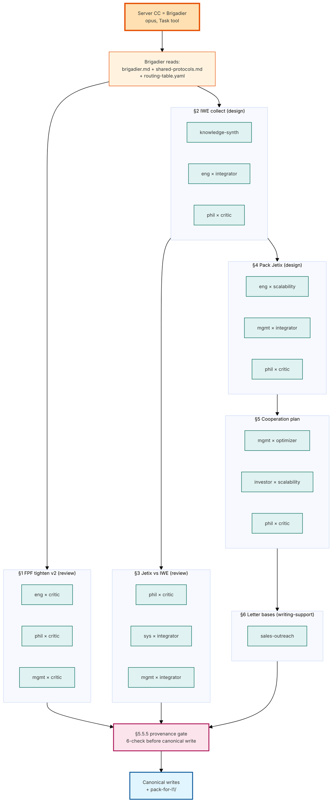
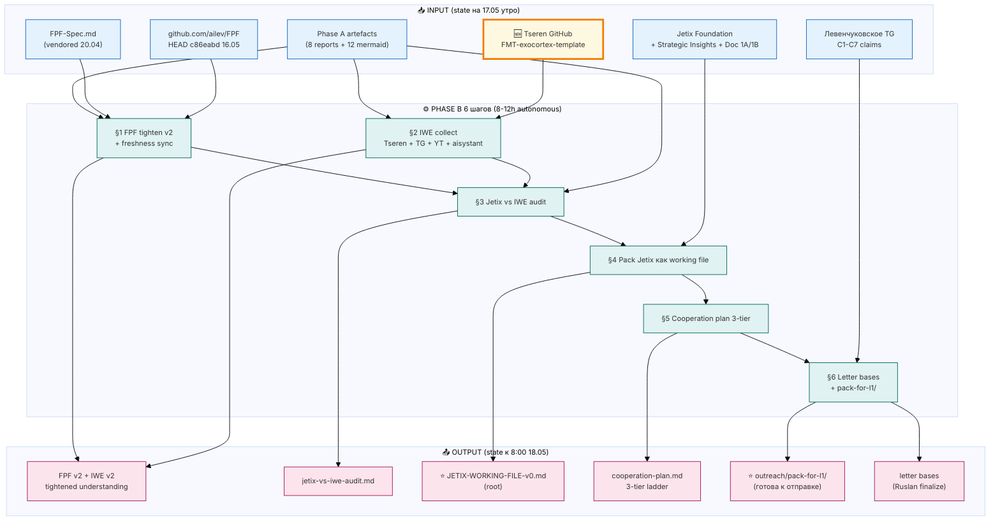

# 📖 Explanation — Phase B prompt

> **Prompt file:** [`prompts/fpf-iwe-phase-b-2026-05-17.md`](prompts/fpf-iwe-phase-b-2026-05-17.md) (341 строк, 13 секций)
>
> **Time estimate:** 8-12 часов autonomous server CC
>
> **Deadline:** 8:00 18.05 Berlin (16 часов от старта)
>
> **Cost cap:** €10/день baseline, €50 halt-and-ask

---

## §1 Что у нас есть СЕЙЧАС (state до запуска)

### Из Phase A (16.05, commit `b1cce0f`)

- **FPF понимание (база)** — `01-fpf-on-human-language.md` (462 строки, 5 primitives + 7 mechanisms + 10-step intelligence amplification)
- **IWE понимание (база, концептуальное)** — `02-u-episteme-and-iwe.md` (mapping IWE как FPF-applied, но БЕЗ Tseren github material)
- **Self-audit Jetix vs FPF** — `06-honest-self-audit.md` (27 memory/automation vs 12 intelligence/FPF-derivative компонентов)
- **12 mermaid diagrams**
- **FPF vendored 20.04** в `raw/external/ailev-FPF/FPF-Spec.md` (62K строк)
- **Левенчуковское TG 17.05** в `inbox/levenchuk-tg-2026-05-17.md` (C1-C7 claims)

### Новое (на 17.05)

- 🆕 **Tseren GitHub найден:** `github.com/TserenTserenov/FMT-exocortex-template` — это **IWE template** (Tseren's public artifact). До этого мы IWE знали только концептуально. Теперь есть РАБОЧИЙ файл.
- ✅ **Aisystant подписка** — ack'нута, можно тащить курсы (если Ruslan подключил доступ к моменту запуска)
- ✅ **Резидентура R0** — apply ждёт next cohort
- ⚠️ **FPF freshness gap** — upstream HEAD `c86eabd` 16.05 vs vendored 20.04 (26 дней delta)

---

## §1.A 🚀 SWARM MODE (новое 17.05)

**Phase B запускается через Brigadier**, не single claude -p session. У нас в repo полноценный multi-agent swarm:

- **Brigadier** (`.claude/agents/brigadier.md`, opus model) — canonical orchestrator с `Task` tool
- **5 domain experts** (sonnet) × **4 modes** = 20 invocation cells:
  - `engineering-expert` (code/FPF), `philosophy-expert` (epistemic), `systems-expert` (feedback), `mgmt-expert` (org), `investor-expert` (capital)
  - Modes: critic / optimizer / integrator / scalability / writing-support
- **Structured Task() packets** — каждый cell возвращает summary + proposed_writes + provenance + confidence + escalations + dissents
- **§5.5.5 provenance gate** — 6-check перед canonical write
- **§5 dissent preservation** — contradictory выводы СОХРАНЯЮТСЯ, не дропаются

**Per-шаг dispatch matrix:**

| Шаг | Cells |
|---|---|
| §1 FPF tighten (review shape) | engineering×critic + philosophy×critic + mgmt×critic |
| §2 IWE collect (design shape) | knowledge-synth + engineering×integrator + philosophy×critic |
| §3 Jetix vs IWE audit (review) | philosophy×critic + systems×integrator + mgmt×integrator |
| §4 Pack Jetix (design) | engineering×scalability + mgmt×integrator + philosophy×critic |
| §5 Cooperation plan (design+optimize) | mgmt×optimizer + investor×scalability + philosophy×critic |
| §6 Letter bases (writing-support) | sales-outreach writing-support |

**Triple-perspective per шаг** = multiple Claude instances независимо thinking → integration с dissent preservation. Это намного качественнее single-agent run.

**ultrathink триггер** в §0 prompt'a → extended thinking ON для всех cell invocations.

## §1.B Swarm flow (mermaid)



---

## §2 Что делает этот prompt (одним абзацем)

Server CC берёт всё что собрано Phase A + новые Tseren materials, **уплотняет FPF понимание** до читабельной v2, **собирает IWE corpus** включая Tseren FMT-exocortex-template, **сравнивает Jetix vs IWE** (mirror'я Phase A self-audit vs FPF), **упаковывает Jetix как single navigable working file** в стиле github.com/ailev/FPF или Tseren IWE template, **составляет 3-tier cooperation plan по FPF**, и **готовит content blocks для писем Левенчуку + Цэрэну** (но не финальный текст — это Ruslan-authored). Финал — `outreach/pack-for-l1-2026-05-17/` готов к отправке.

---

## §3 Что берёт на ВХОД

| Источник | Что |
|---|---|
| Phase A reports (8 файлов) | FPF + IWE + self-audit базы |
| `raw/external/ailev-FPF/FPF-Spec.md` | Канонический FPF (vendor 20.04) |
| `github.com/ailev/FPF` upstream | Freshness sync — HEAD `c86eabd` 16.05 |
| **`github.com/TserenTserenov/FMT-exocortex-template`** | **Новое:** IWE template, primary IWE source |
| `raw/research/2026-04-28-tseren-tg-export/` | Tseren TG 619 posts (фильтр по IWE) |
| `raw/research/2026-04-28-tseren-yt-export/` | Tseren YT 127 videos metadata |
| Aisystant (если подписан) | IWE course / spec / outline |
| Левенчуковский LJ (cross-refs IWE) | LJ posts упоминающие IWE / U.Episteme |
| `inbox/levenchuk-tg-2026-05-17.md` | C1-C7 claims (для letter base addressing) |
| Foundation Parts + Strategic Insights + Doc 1A/1B | Для wrapping в working file |

---

## §4 Что обрабатывает (pipeline / шаги внутри)

Sequential 6 шагов:

1. **§1 FPF tighten v2** — re-pass `01-fpf-on-human-language.md`, freshness sync upstream, tighten formulations, add inline mermaid + quick-reference card
2. **§2 IWE collect** — Tseren github mirror + Tseren TG/YT search (фильтр IWE) + aisystant scrape + LJ cross-refs → distillation в новый v2 файл
3. **§3 Jetix vs IWE audit** — mirror Phase A self-audit структура, но vs IWE (что у нас похоже / не похоже / unique)
4. **§4 Pack Jetix как working file** — top-level wrapper в стиле `github.com/ailev/FPF` или Tseren FMT-exocortex (TOC + plain English + mechanism map + unique mechanisms + top-level mermaid + provenance)
5. **§5 FPF cooperation plan** — 3-tier ladder: light (R0 + IWE) / medium (joint exercise) / deep (formal advisory + co-developed module)
6. **§6 Letter bases** — content blocks для писем Левенчуку (addressing C1-C7) + Цэрэну (post-видео update + IWE acknowledgment) + сборка `outreach/pack-for-l1-2026-05-17/`

---

## §5 Что получим на ВЫХОДЕ (конкретные файлы)

| Файл | Что в нём | Куда применяется |
|---|---|---|
| `reports/.../01-fpf-on-human-language-v2.md` | Tightened FPF understanding (~800-1200 строк) + inline mermaid + quick-ref card | Pack item 02 |
| `raw/external/ailev-FPF/CHANGELOG-2026-04-20-to-2026-05-16.md` | Diff vendored 20.04 vs upstream 16.05 | Freshness record |
| `raw/external/tseren-corpus-2026-05-17/` | Mirror Tseren FMT-exocortex-template + extracted TG/YT material | Source corpus |
| `reports/iwe-deep-collection-2026-05-17.md` | Full IWE corpus distilled на «человеческом языке» | Pack item 03 |
| `reports/jetix-vs-iwe-audit-2026-05-17.md` | Mirror Phase A self-audit, но vs IWE | Pack item 05 |
| `JETIX-WORKING-FILE-v0-2026-05-17.md` (root) | **Jetix как single navigable artifact** — то что мы шлём L1 | Pack item 01 |
| `outreach/JETIX-FPF-COOPERATION-PLAN-2026-05-17.md` | 3-tier cooperation ladder | Pack item 06 |
| `outreach/levenchuk-response-base-2026-05-17.md` | Content blocks ответа Левенчуку (Ruslan-authored final) | Pack cover |
| `outreach/tseren-response-base-2026-05-17.md` | Content blocks для Цэрэна | Pack cover |
| `outreach/pack-for-l1-2026-05-17/` | **Готовая папка для отправки** L1 (INDEX + 6 items + 2 cover letters) | Финал дня |
| 3+ новых mermaid в `diagrams/` | IWE mechanism map + Jetix-vs-IWE overlap + cooperation tier ladder | Visual aids |
| `reports/.../00-SUMMARY-PHASE-B.md` | Summary для Ruslan чтения за 10 минут | Quick scan |

**Total estimate output:** 15-20 новых файлов, 5K-8K строк нового content.

---

## §6 Конкретные шаги (по порядку)

| # | Шаг | Время | Output |
|---|---|---|---|
| 1 | FPF freshness sync upstream → diff → tighten v2 + inline mermaid | ~2ч | `01-...-v2.md` + `CHANGELOG.md` |
| 2 | Tseren github clone + extract → TG/YT/LJ IWE filter → distill IWE v2 | ~2-3ч | `iwe-deep-collection.md` + `tseren-corpus/` |
| 3 | Jetix vs IWE audit (mirror Phase A) | ~1-1.5ч | `jetix-vs-iwe-audit.md` |
| 4 | Pack Jetix as working file (in style of FPF-Spec.md or Tseren FMT-exocortex) | ~2-3ч | `JETIX-WORKING-FILE-v0.md` (root) |
| 5 | FPF cooperation plan 3-tier ladder | ~1-1.5ч | `JETIX-FPF-COOPERATION-PLAN.md` |
| 6 | Letter bases Левенчук + Цэрэн + сборка pack-for-l1/ | ~1ч | `levenchuk-response-base.md` + `tseren-response-base.md` + `pack-for-l1/` |

**Commits.** В конце каждого Шага git commit `[fpf-iwe-phase-b] §N — <описание>`. Push origin main в самом конце Phase B.

---

## §7 К чему ведёт (где в roadmap)

```
Phase A (16.05) ✅ → [Phase B сегодня] → 18.05 утро Ruslan letter finalization →
отправка Левенчуку + Цэрэну → ждём response → C4 benchmark execution (отдельная phase) →
R0 cohort start + IWE sessions → deepening cooperation
```

**Что Phase B решает:**
- Закрывает C1 (FPF derivative interpretation) — у нас будет clean working file vs наш archived 3762-line overreach
- Закрывает C5 (IWE = applied FPF) — у нас будет реальное Tseren FMT-exocortex material обработано
- Готовит C6 ответ (achievements ≠ часы) — Jetix working file = тангибальный achievement
- Готовит C7 — cooperation plan показывает что мы хотим взаимодействовать на их условиях

**Что Phase B НЕ решает:**
- C3 (intelligence > vanilla AI) — это **C4 benchmark execution**, отдельная Phase. Сегодня только commitment в letter.
- C4 benchmark — отдельный run после Phase B.

---

## §8 Flow diagram (mermaid)



---

## §9 Что НЕ делает Phase B (явно)

- НЕ trogат Foundation paths (R2) — Foundation Parts read-only, без AWAITING-APPROVAL
- НЕ пишет финальный текст ответа Левенчуку / Цэрэну — это Ruslan-authored (Tier 2 R1). Только content blocks.
- НЕ исполняет C4 benchmark (vanilla vs FPF vs Jetix-stack) — это отдельная Phase
- НЕ удаляет старые derivative docs — append-only
- НЕ оценивает «FPF лучше / Jetix лучше / IWE лучше» — surface факты
- НЕ обходит paywalls (если Ruslan не подключил aisystant к моменту запуска — degrade gracefully на public layer)

---

## §10 Failure modes + что делать

| Если | Действие |
|---|---|
| Tseren github пуст/закрыт | Log в `blockers-phase-b.md`, продолжать с TG + YT + aisystant + LJ |
| Aisystant login fail | Continue public layer, flag как residual blocker |
| Cost cap €50 hit | Halt + log + ask Ruslan |
| Time overrun (8:00 18.05) | Priority: §1+§2+§3 minimum, §4+§5+§6 follow. Если <50% done — honest surface в SUMMARY |
| Conflicting definitions IWE | Surface как «contradiction», не выбирать |

---

## §11 Ruslan: что делать перед launch

1. **Прочитай этот файл** (~10 минут) — понимаешь что Phase B делает
2. **Скан [`_PLAN-OF-DAY-2026-05-17.md`](_PLAN-OF-DAY-2026-05-17.md)** (~3 минуты) — overall план дня
3. **Опционально:** скан [`prompts/fpf-iwe-phase-b-2026-05-17.md`](prompts/fpf-iwe-phase-b-2026-05-17.md) — сам prompt в деталях (341 строк)
4. **Решение:**
   - ✅ «go» / «погнали» / «запускай» → launch команды ниже
   - ⚠️ «стой, change X» → я меняю prompt + re-explain, потом launch
   - ❌ «не сейчас» → ждём

### Параллельный run — `/ultrareview` (swarm)

Дополнительно к Phase B (claude -p, single agent) — Ruslan запускает `/ultrareview` в отдельной Claude Code сессии:
- Multi-agent cloud swarm review
- Retrospective sweep current state (Phase A артефакты, Phase B prompt, working files)
- ~10-30 минут в фоне
- Independent от Phase B — параллельно, не конфликтуют

**Кто запускает:** Ruslan сам. Cloud Cowork (я) НЕ может — это user-triggered + billed.

**Команда:** в любой Claude Code session / new chat → `/ultrareview` → enter (без аргументов = bundles local main branch)

---

### Launch команды (после ack)

```
tmux new -s fpf-iwe-B
```

```
cd ~/Desktop/jetix-os && git pull --ff-only && claude --dangerously-skip-permissions
```

После запуска Claude — paste:

```
Прочитай файл prompts/fpf-iwe-phase-b-2026-05-17.md и выполни всё что в нём написано последовательно. Phase B — 6 шагов: FPF tighten v2 → IWE deep collection (включая Tseren github.com/TserenTserenov/FMT-exocortex-template) → Jetix-vs-IWE audit → pack Jetix как working file → FPF cooperation plan → L1 letter bases. Все Ruslan ack в §0.0. Дедлайн 8:00 18.05 Berlin. Действуй автономно, коммить per шаг, push в main в конце.
```

Detach: `Ctrl+B затем D`. Когда отработает — `git log` покажет commits + `reports/.../00-SUMMARY-PHASE-B.md` готов.
