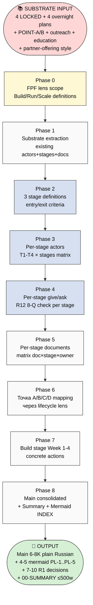

# 🧭 EXPLAIN — Platform Lifecycle Stages Plan (Build / Run / Scale separation)

> **Что это.** Этот документ объясняет ЧТО будет делать deep prompt на server CC ДО его запуска. Ты читаешь — понимаешь — даёшь «погнали» или корректируешь. Без твоего ack — никакой launch.

---

## §1 Что у нас есть СЕЙЧАС (state до запуска)

### Substrate already locked (Sprint 23-24.05)

- **4 LOCKED canonical** — Method V2 / Strategic Plan / Economic V10 / AI Market PLAN
- **POINT-A** Current State Deep Inventory (30K / 12 mermaid / 220+ sources)
- **POINT-B** Near Target (12K / 8 mermaid / 3 horizons)
- **POINT-B-FOCUSED-WEEK-1** (8 шагов sequence to Point B)
- **CONSOLIDATED-HUMAN-LANGUAGE-PLAN** (2716w / 11 sections / 5 mermaid — план обучения plain language)
- **EXECUTION-PLAN-FIXATION** (4188w / 11 sections / 6 mermaid — что делаю сам + 2 направления A/B + 4 типа партнёров T1-T4 + sequencing 3 недели)
- **PERSONAL-OS-NOTION-TEMPLATE-PLAN** (4166w / 15 sections / 7 mermaid — Layer 1+2 fork-friendly)
- **TEAM-OS-NOTION-TEMPLATE-PLAN** (5.5K / 14 sections / 7 mermaid — Layer 3 collaboration multi-tenant + roles + marketplace + monetization + daily CC pass)
- **OUTREACH-CONTENT-OUTCOMES-CTAS** (38K substrate — 7+3 принципов + 7 ступеней Bloom + 13 CTAs + 5+1 архетипов + 18 артефактов P0-P6)
- **RESEARCH-EDUCATION** (Phase 7 Jetix Lens 12 proposals)
- **PARTNER-OFFERING-HUMAN-LANG** — style anchor для всех plain-language deliverables
- **17 ROY agents** + 62 wiki concepts + 80+ книг MD'd

### Что НЕ зафиксировано (это и есть gap который заполняет новый ресёрч)

❌ **Разделение 3 этапов жизни платформы** не сделано как отдельный документ:
- Build stage (что МЫ делаем сейчас для построения платформы)
- Run stage (что делает САМА платформа когда довели до ума)
- Scale stage (когда циркулирует — блогеры / бизнесмены / кланы / мега-корпорация)

❌ **Per-stage actors** (кого зовём на каждом этапе) не разделены — в EXECUTION-PLAN-FIXATION 4 типа партнёров общие; нет разделения «T1 для Build vs T1 для Run vs T1 для Scale».

❌ **Per-stage что просим / что даём** не разнесено по этапам.

❌ **Per-stage documents needed** (какие документы пишем сейчас vs какие партнёр пишет vs какие появляются когда платформа работает) не картированы.

❌ **Точка А → Точка B → Точка C/D mapping** через Build/Run/Scale lens не сделано (POINT-B-FOCUSED-WEEK-1 — это 8 шагов внутри Build stage; не охватывает Run+Scale).

---

## §2 Что делает этот prompt (одним абзацем)

Берёт весь существующий substrate (4 LOCKED + 4 overnight plans + POINT-A/B + execution-plan + outreach-content + research-education) и **перерезает его через новый lens: Build → Run → Scale lifecycle**. Per stage: definition + actors + что просим / что даём + concrete documents + risks + R12 per stage + concrete next-2-4-weeks steps только для Build stage (Run+Scale = future-state мап с триггерами перехода). Результат — один plain-Russian документ ≤6-8K слов + 4-5 mermaid + 00-SUMMARY ≤500w. **R1 surface only** — все decisions = options + facts, не «рекомендую X». **F3 derivative** — новый research не делается, только перерезка существующего substrate через новый lens.

---

## §3 Что берёт на вход (input substrate)

### Mandatory read (всё read polностью)

- `decisions/strategic/EXECUTION-PLAN-FIXATION-2026-05-24.md` (4 типа партнёров + sequencing — главный substrate per-stage actors)
- `decisions/strategic/CONSOLIDATED-HUMAN-LANGUAGE-PLAN-2026-05-24.md` (план обучения — substrate для Run stage)
- `decisions/strategic/PERSONAL-OS-NOTION-TEMPLATE-PLAN-2026-05-24.md` (Layer 1+2 — substrate для what-we-build)
- `decisions/strategic/TEAM-OS-NOTION-TEMPLATE-PLAN-2026-05-24.md` (Layer 3 — substrate для Scale stage когорта/команда)
- `decisions/strategic/POINT-A-CURRENT-STATE-2026-05-23.md` (Точка А — substrate для what-we-have-now)
- `decisions/strategic/POINT-B-NEAR-TARGET-2026-05-23.md` (Точка B 3 horizons)
- `decisions/strategic/POINT-B-FOCUSED-WEEK-1-2026-05-23.md` (8 шагов Build stage)
- `decisions/strategic/OUTREACH-CONTENT-OUTCOMES-CTAS-2026-05-24.md` (7 ступеней Bloom + 13 CTAs — substrate для Run stage user journey)
- `decisions/strategic/RESEARCH-EDUCATION-2026-05-24.md` (Phase 7 Jetix Lens — substrate для Run stage learning flow)
- `decisions/strategic/RUSLAN-NOTES-EDUCATION-PARADIGM-2026-05-24.md` (O-176..O-185)
- `PARTNER-OFFERING-HUMAN-LANG-2026-05-22.md` (style anchor + L1-L7 levels — substrate для Scale stage)
- `decisions/strategic/JETIX-NAVIGATION-GUIDE-2026-05-22-DRAFT.md` (sanitized public)

### Foundation reference (read TL;DRs only — NO LOCK modifications)

- `decisions/strategic/METHOD-LIFE-DEVELOPMENT-V2-2026-05-21.md` (LOCKED — method substrate)
- `decisions/strategic/STRATEGIC-PLAN-NEAR-FUTURE-2026-05-21.md` (LOCKED — May-Jul roadmap)
- `decisions/strategic/ECONOMIC-MODEL-TOKENOMICS-2026-05-22.md` (LOCKED — V10 Hybrid)
- `decisions/strategic/AI-MARKET-ELECTRICITY-ANALOGY-PLAN-2026-05-22.md` (LOCKED — Stage 1)

### NO new research (defined explicitly)

- Нет деревенья новых books / online sources / external research
- Нет launch других prompts параллельно
- Нет touch'a Foundation paths (`swarm/wiki/foundations/`, `principles/`, `shared/schemas/`, `.claude/config/`)
- Нет creating новых wiki concepts (только cross-cites к существующим)

---

## §4 Что обрабатывает (pipeline / 8 phases)

### Phase 0 — FPF lens scope (определяем ЧТО research'им)

- Что такое «платформа Jetix» в FPF terms на каждом этапе:
  - Build stage = system-under-construction (Layer 1 Personal OS + Layer 3 Team OS being assembled)
  - Run stage = operating-system (cybernetic feedback loop активный — Method V2 §H meta-control работает)
  - Scale stage = self-propagating system (Mondragón cooperative + R12 anti-extraction + fork-and-leave + кланы)
- Какие FPF primitives применимы per stage
- Frame of Reference (FoR) — c какого angle смотрим (system / role / method / artefact)
- F-G-R per claim mandate

### Phase 1 — Substrate read full + extraction (что уже зафиксировано)

Прочитать всё из §3 mandatory. Extract:
- Все already-defined stages / phases / horizons (POINT-B 3 horizons / Strategic Plan May-Jul-Aug / lev-master 5 paths / Education 7 ступеней Bloom)
- Все already-defined actors (4 типа партнёров execution-plan / 6 архетипов outreach / 5 кандидатов Wave 1 / 14 contact pool)
- Все already-defined documents (existing 100+ strategic + 4 overnight plans + Personal/Team OS templates)

### Phase 2 — 3 stage definitions (core lens)

Per stage:
- **Definition** на FPF (что это технически как система-в-state-X)
- **Visual marker** (что я / партнёр / observer видит когда система в этом stage)
- **Entry criteria** (что должно быть зафиксировано чтобы войти в этот stage)
- **Exit criteria** (что должно быть достигнуто чтобы перейти в следующий stage)
- **Анти-паттерны** (что путать с этим stage)
- **Mermaid: stage transitions диаграмма** (Build → Run → Scale)

### Phase 3 — Per-stage actors & roles (кто на каком этапе)

Per stage:
- **Кого зовём** — конкретные роли (не имена! имена = examples per IP-1 STRICT)
- **Сколько людей** примерно на этом этапе (5-10? 50? 1000?)
- **Какие 4 типа партнёров (T1-T4 из execution-plan) активны на этом stage** (matrix)
- **Какие архетипы (5+1 из outreach-content) активны**
- **Какие L1-L7 levels (из partner-offering) активны**
- **Какие R12 risks per stage** (Build risk vs Run risk vs Scale risk — разные)
- **Mermaid: per-stage actor map**

### Phase 4 — Per-stage что просим / что даём

Per stage:
- Что мы просим у actors (concrete deliverables — feedback / capital / audience / methodology / consulting)
- Что мы даём actors (recognition / equity / revenue share / Charter / cohort access / substrate)
- Какие 8 вопросов R12 check применяются per stage
- Mermaid: per-stage exchange matrix

### Phase 5 — Per-stage documents needed (что пишем где когда)

Per stage:
- Что МЫ пишем сейчас (Build stage)
- Что партнёр пишет когда платформа в Run (course materials / discovery scripts / etc.)
- Что появляется органически когда платформа в Scale (cohort logs / clan governance / case studies)
- Какие из existing 100+ strategic docs принадлежат к какому stage
- Matrix: document × stage × owner × status (есть / нужно написать / появится позже)

### Phase 6 — Точка А / Точка B / Точка C/D mapping через Build/Run/Scale lens

- **Точка А (сейчас)** = early Build stage — what's done / what's missing для exit Build
- **Точка B (2-4 недели)** = late Build stage / early Run — exit criteria для перехода в Run
- **Точка C (3-6 месяцев)** = mid Run stage — что значит «платформа работает»
- **Точка D (12-24 месяца)** = early Scale stage — клан / blogger leverage / mass paradigm shift
- Mermaid: timeline progression A → B → C → D с per-stage zooms

### Phase 7 — Concrete next-2-4-weeks steps только для Build stage

(Run+Scale = future-state с триггерами перехода; concrete shaping только Build)

- Week 1 actions per actor type
- Week 2-3 actions per direction A/B (из execution-plan)
- Week 4 transition criteria check
- Какие из ABC execution prompts (Plan B Docs / Plan A Video / Plan C Notion templates) принадлежат Build stage
- Что отложено для Run / Scale stages

### Phase 8 — Main consolidated document + Summary + Mermaid INDEX

- Main consolidated `PLATFORM-LIFECYCLE-STAGES-PLAN-2026-05-25.md` ≤6-8K plain Russian + 4-5 mermaid + ~12-14 sections
- 00-SUMMARY-FOR-RUSLAN ≤500w
- diagrams/_INDEX.md
- Phase per-file outputs `reports/platform-lifecycle-stages-plan-2026-05-25/01-...md` etc.
- Push per-phase commits `[platform-lifecycle] Phase N`

---

## §5 Что получим на выходе (concrete artefacts)

### Main deliverable

- **`decisions/strategic/PLATFORM-LIFECYCLE-STAGES-PLAN-2026-05-25.md`** — ~6-8K plain Russian, 4-5 mermaid, 12-14 sections style PARTNER-OFFERING-HUMAN-LANG:
  - §0 TL;DR 90 секунд
  - §1 Главная мысль одной строкой
  - §2 3 stage definitions (Build / Run / Scale)
  - §3 Точка А / B / C/D progression
  - §4 Per-stage actors & roles
  - §5 Per-stage что просим / что даём
  - §6 Per-stage documents
  - §7 R12 per stage
  - §8 Concrete Build stage 2-4 weeks
  - §9 4-5 mermaid схем PL-1..PL-5
  - §10 7-10 R1 decisions surface
  - §11 Cross-refs к deep substrate
  - §12 К чему ведёт

### Supporting reports

- `reports/platform-lifecycle-stages-plan-2026-05-25/00-SUMMARY-FOR-RUSLAN.md` (≤500w)
- `reports/platform-lifecycle-stages-plan-2026-05-25/01-fpf-lens-scope.md`
- `reports/platform-lifecycle-stages-plan-2026-05-25/02-substrate-extraction.md`
- `reports/.../03-three-stages-definitions.md`
- `reports/.../04-per-stage-actors.md`
- `reports/.../05-per-stage-give-ask.md`
- `reports/.../06-per-stage-documents.md`
- `reports/.../07-points-mapping.md`
- `reports/.../08-build-stage-next-weeks.md`
- `reports/.../09-mermaid-schemes.md` + `diagrams/_INDEX.md` (4-5 schemes)

### NOT delivered (explicit exclusions)

- ❌ Никаких новых Foundation modifications
- ❌ Никаких новых wiki concepts (только cross-cites)
- ❌ Никакого auto-launch ABC execution prompts
- ❌ Никакого auto-send Wave 1 outreach
- ❌ Никакого video script writing — только что-видео-A/B/C-для-какого-stage cross-ref

---

## §6 Конкретные шаги (server CC autonomous run)

1. `ssh jetix` → `tmux new -s platform-lifecycle`
2. `cd ~/jetix-os && git pull --ff-only`
3. `claude --dangerously-skip-permissions -p "$(cat platform-lifecycle-launch.txt)"` (см. §11 launch command)
4. Phase 0-8 autonomous per-phase commit + push в format `[platform-lifecycle] Phase N`
5. Detach `Ctrl-B then D`
6. Estimated runtime 4-6h (per MAX-density mandate на 500% + max tokens × 3)
7. После finish — Cloud Cowork (я) pull обратно, surface 00-SUMMARY + Main TL;DR

---

## §7 К чему ведёт (где этот prompt в общей траектории)

После prompt complete:

1. Ты читаешь Main doc (~30 минут) + 00-SUMMARY (3 минуты)
2. Picks 7-10 R1 decisions §10 (final stage boundaries / 4 partner type allocation per stage / R12 per stage / Build stage Week-1 priorities)
3. → **На основе этого** идёт plan-of-day 26.05+ pivot:
   - Video Day A+B / C — какое видео для какого stage (Build vs Run vs Scale рассказывает)
   - Wave 1 outreach prep — кому из 4 партнёров пишем сначала per Build stage actors
   - Notion templates implementation — какой stage support
4. → **Партнёрам можно адекватно пояснять** что мы сейчас делаем (Build), что будет делать платформа потом (Run), что произойдёт когда разрастётся (Scale) — без каши в голове.

**Этот ресёрч = превращение твоего голосового brief'a в structured map**, по которой все следующие переговоры/документы/действия идут чище.

---

## §8 Mermaid схема процесса prompt'a



---

## §9 Constitutional posture (compliance check)

- ✅ **R1 surface only** — все decisions = facts + options, не «рекомендую X»
- ✅ **R2 STRICT** — NO Foundation modifications; Foundation read TL;DRs only
- ✅ **R6 provenance** — cross-cite per claim к source substrate documents
- ✅ **R11 Default-Deny** — NO auto-launch consequent prompts; NO outreach send; NO video recording
- ✅ **R12 paired-frame STRICT** — influence-ethics-expert auto-fires если касание partner messaging; 8-вопросов check per Run/Scale stage
- ✅ **IP-1 STRICT** — actor types abstract; names = examples (Maxim/Левенчук) per RUSLAN-LAYER
- ✅ **F3 derivative** — synthesis over substrate, NO new research
- ✅ **Pool result** — NO auto-promotion to LOCK status
- ✅ **Append-only** — new files, no overwrites

---

## §10 MAX-density mandate (§17.0 в самом prompt'е)

Этот документ = **major strategic deliverable** уровня execution-plan-fixation / consolidated-hl. Per memory `feedback_max_density_max_tokens.md`:

1. CRITICAL IMPORTANCE MANDATE — этот deliverable critical для partner readiness
2. **ROY swarm на 500%** — brigadier orchestrates entire 5-original ROY swarm (engineering + investor + mgmt + philosophy + systems) + 4 sub-brigadiers + relevant book-driven (recruitment-dynamics + methodology-engineer + influence-ethics auto-fire)
3. **Use MAX tokens × 3** — depth > brevity
4. **Максимально сырая substrate** — read entire 4 overnight plans + 4 LOCKED + POINT-A/B + outreach (no summaries)
5. **Quality explanation focus** — densest human-language explanations per stage
6. **Concrete human examples** per stage (multiple)
7. **Плотность всего** — each section substantive, each mermaid ≥10 nodes, each example concrete
8. **Не stopover at minimum**

---

## §11 PENDING — Launch command (готова, не запускаем без «погнали»)

```bash
ssh jetix
tmux new -s platform-lifecycle
cd ~/jetix-os && git pull --ff-only
claude --dangerously-skip-permissions -p "$(cat <<'EOF'
Autonomous execution: prompts/platform-lifecycle-stages-plan-2026-05-25.md

8 phases per-phase commit + push в format [platform-lifecycle] Phase N.

⚠️ HUMAN-LANGUAGE SYNTHESIS — plain Russian conversational tone.
Style anchor: PARTNER-OFFERING-HUMAN-LANG-2026-05-22.md + EXECUTION-PLAN-FIXATION-2026-05-24.md.
NO constitutional jargon без перевода. NO academic vocabulary.
F3 derivative — synthesis over existing substrate, NO new research.

§17.0 CRITICAL IMPORTANCE MANDATE applies (MAX tokens × 3 + ROY 500% + densest explanations).

Phases:
0. FPF lens scope — Build/Run/Scale в FPF terms, F-G-R mandate
1. Substrate read full (4 overnight + POINT-A/B + outreach + education + partner-offering)
2. 3 stage definitions (entry/exit criteria + анти-паттерны)
3. Per-stage actors (4 partner types × stages matrix + 5+1 архетипы × stages + L1-L7 × stages)
4. Per-stage give/ask + R12 8-Q check per stage
5. Per-stage documents matrix (doc × stage × owner × status)
6. Точка А / B / C / D mapping через Build/Run/Scale lens
7. Build stage Week 1-4 concrete actions (Run/Scale = future-state с триггерами)
8. Main consolidated ≤6-8K plain Russian + 4-5 mermaid PL-1..PL-5 + 12-14 sections + 00-SUMMARY ≤500w + diagrams/_INDEX.md + final push

R1 surface only. R6 cross-refs к deep substrate в footnotes only.
R2 STRICT Foundation untouched. R12 paired-frame STRICT (influence-ethics auto-fire on partner-touch language).
IP-1 STRICT (роли abstract, имена = examples per RUSLAN-LAYER).
NO new research. NO auto-launch consequent prompts. Pool result.

Final push: Phase 8 Main + Summary + Mermaid INDEX.
EOF
)"
# Ctrl-B then D to detach
```

---

## §12 Что я жду от тебя (decision points)

**Только 2 вопроса:**

1. **«Погнали» / «launch»** → я surface launch command, ты запускаешь на сервере. По умолчанию иду к Шагу 1 plan-of-day (Docs Classification) пока server CC крутится в background.
2. **Корректировки** — если есть anything что добавить / удалить / переформулировать в phases / output sections / acceptance — скажи, переписываю EXPLAIN + prompt.

Я не launch без ack.

---

*EXPLAIN closure 2026-05-25 morning. R1 surface only — content решает Руслан, я structurate request. Per `feedback_prompt_explanation_required.md`. AWAITING-RUSLAN-ACK.*
