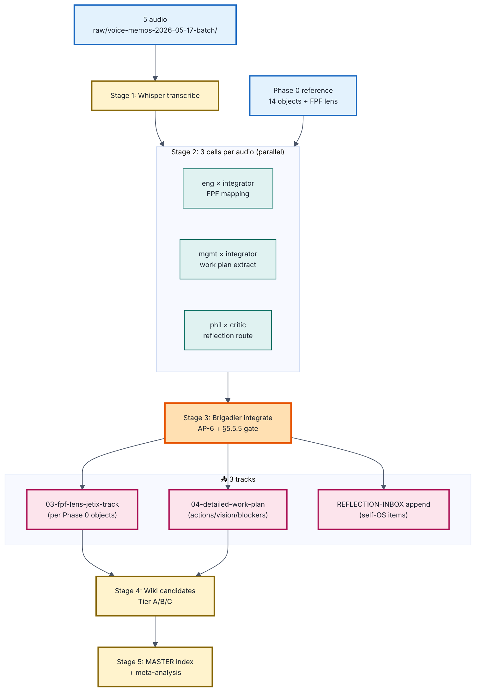

# 📖 Explanation — Voice pipeline 17.05 prompt

> **Prompt:** [`prompts/voice-pipeline-2026-05-17-fpf-filtered.md`](prompts/voice-pipeline-2026-05-17-fpf-filtered.md)
> **Time:** 30-60 min autonomous brigadier swarm
> **Cost:** <€1 (Groq Whisper ~€0.10 + Max subscription cells)

---

## §1 Что у нас СЕЙЧАС

- **5 новых voice memos** в `raw/voice-memos-2026-05-17-batch/`:
  - `audio_669@16-05-2026_13-46-17.ogg` (после Дмитрий call)
  - `audio_670@16-05-2026_15-00-42.ogg`
  - `audio_671@17-05-2026_01-07-28.ogg` (ночное)
  - `audio_672@17-05-2026_18-59-52.ogg` (после Phase 0 review)
  - `audio_673@17-05-2026_19-49-05.ogg` (последнее)
- **Last batch обработан** 16.05 (commit `2483e09`) — старый pipeline без FPF lens
- **Phase 0 завершён** — есть stable FPF-lens reference frame (`reports/phase-0-fpf-scope/00-JETIX-FPF-MASTER`)
- **Reflection inbox** активен (`decisions/REFLECTION-INBOX-2026-05-16.md`) — append-only target

## §2 Что делает prompt (одним абзацем)

Server CC transcribes 5 audio (Whisper), потом каждый transcript dispatch'ит в **3 параллельных cells** (eng-integrator для FPF mapping / mgmt-integrator для work plan / phil-critic для reflection), brigadier интегрирует через AP-6 + §5.5.5 gate, и routes findings в **3 параллельных output tracks**: (1) FPF-lens Jetix track — что mapping'ится к 14 объектам Phase 0, (2) detailed work plan — concrete actions / vision / blockers / decisions needed, (3) reflection inbox — личное / эмоции append-only.

## §3 Вход

- `raw/voice-memos-2026-05-17-batch/` (5 .ogg)
- `reports/phase-0-fpf-scope/01-jetix-objects-inventory.md` (14 objects = filter target)
- `reports/phase-0-fpf-scope/00-JETIX-FPF-MASTER-2026-05-17.md` (FPF lens reference)
- `decisions/REFLECTION-INBOX-2026-05-16.md` (existing reflection)
- `tools/run_pipeline.sh` (existing pipeline reference)

## §4 Pipeline (5 stages)

| Stage | Что | Cells |
|---|---|---|
| 1 Transcribe | Whisper → 5 transcripts | deterministic tool |
| 2 Extract | Per audio, 3 параллельных | eng×integrator + mgmt×integrator + phil×critic |
| 3 Integrate | Brigadier merge с AP-6 dissent | brigadier |
| 4 Wiki candidates | Tier A/B/C classification | brigadier |
| 5 Master + checkpoint | Index + meta-analysis | brigadier |

## §5 Выход (конкретные файлы)

```
raw/voice-transcripts/
  audio_669-673-2026-05-17.md      # 5 verbatim Whisper transcripts

reports/voice-pipeline-2026-05-17-batch/
  00-MASTER-INDEX.md               # TOC + summary
  01-per-note-breakdown.md         # per-audio detailed
  03-fpf-lens-jetix-track.md       # ⭐ что mapping'ится к 14 Phase 0 objects
  04-detailed-work-plan.md         # ⭐ concrete actions / vision / blockers
  05-wiki-candidates.md            # Tier A/B/C (Ruslan ack required)
  06-meta-analysis.md              # patterns / themes

decisions/REFLECTION-INBOX-2026-05-16.md  # APPEND new entries (личное)

swarm/wiki/drafts/                  # 15 cell drafts (3 cells × 5 audio)
```

## §6 Шаги (per Stage)

| # | Stage | ETA | Output |
|---|---|---|---|
| 1 | Transcribe Whisper | ~5 min | 5 transcripts |
| 2 | Extract 3 cells × 5 audio | ~10-15 min | 15 cell drafts |
| 3 | Brigadier integrate | ~5-10 min | 3 track files |
| 4 | Wiki candidates classify | ~5 min | wiki-candidates.md |
| 5 | Master + meta-analysis | ~5-10 min | INDEX + meta |

**Total: 30-60 min.**

## §7 Куда ведёт

После output → **Ruslan читает 00-MASTER (5 мин) + 04-work-plan (5 мин)** → ack tracks / makes decisions → реальные действия (immediate items / cleanup actions / next phase).

**Что Phase решает:**
- Свежий FPF-lens обзор того что озвучивалось 16-17.05
- Concrete work plan distilled из голоса
- Reflection inbox обновлён

**Что Phase НЕ решает:**
- Promote wiki candidates автономно (Ruslan ack required)
- Сделать сами action items (это твоя работа)
- Изменить Foundation (R2)

## §8 Flow



## §9 Что НЕ делает (anti-scope)

- НЕ trog'ает Foundation paths
- НЕ promote wiki candidates автономно
- НЕ редактирует verbatim transcripts
- НЕ создаёт новые strategic narratives — extract только
- НЕ обходит cost cap

## §10 Launch (когда git pull прошёл на сервере)

```
tmux new -s voice-17
```

```
cd ~/Desktop/jetix-os && git pull --ff-only && claude --dangerously-skip-permissions
```

Paste:

```
ultrathink. Прочитай prompts/voice-pipeline-2026-05-17-fpf-filtered.md полностью. Ты — brigadier Jetix swarm. Обработай 5 audio в raw/voice-memos-2026-05-17-batch/ через FPF lens (Phase 0 14 objects как target) + extract detailed work plan + route reflection items append-only. Three parallel cells per audio (eng-integrator FPF / mgmt-integrator work-plan / phil-critic reflection). §5.5.5 provenance gate перед canonical writes. Brigadier integrates с dissent preservation. R1 + R2 preserved. Действуй автономно 30-60 минут, коммить per stage, push origin main в конце.
```

Detach: `Ctrl+B затем D`.
