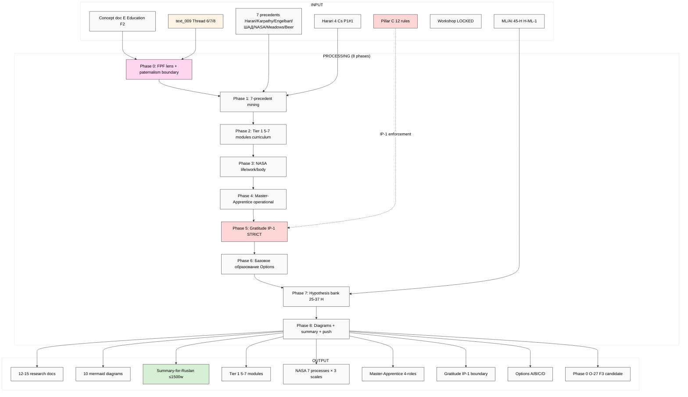

# EXPLAIN — Education Layer System Thinking Deep Research

> Sibling к Master Picture (cross-research integration). Promote concept doc E (acked F2) к F3+ через 7-precedent deep mining + Tier 1 5-7 module curriculum + NASA life/work/body-as-spaceship integration + Master-Apprentice operationalisation + gratitude prophecy IP-1 STRICT operationalisation.

> **PATERNALISM RISK FOREGROUND.** «Базовое образование» framing (text_009 Thread 6) = aspiration; NOT universalist mandate. Workshop curriculum MUST be opt-in voluntary throughout. R12 fork-and-leave preserved.

> **IP-1 STRICT IN PHASE 5.** «Gratitude → develop platform» (text_009 Thread 7) MUST be framed as human-driven contribution (PR/proposals/mentorship). NEVER autonomous runtime self-modification (Pillar C Tier 2 rule 9).

---

## §1 Что есть СЕЙЧАС

**Acked baseline:**
- `decisions/strategic/JETIX-EDUCATION-LAYER-SYSTEM-THINKING-2026-05-18.md` (F2 surface; Ruslan acked 18.05 evening; «базовое образование» Options A/B/C/D OPEN; paternalism mitigation foregrounded)
- `vision/12-education-layer-base.md` (Plain English + FPF formal companion)

**Research foundation (DONE):**
- `research/harari-jetix-lens-2026-05-18/03-21-lessons-jetix-lens.md` P1#1 (4 Cs school positioning — primary cross-link)
- `research/deepening-2026-05-18/05-success-alexander-cunningham-karpathy-lineage.md` (Pattern Language — Alexander → Cunningham → Karpathy)
- `research/deepening-2026-05-18/09-people-karpathy-eureka-llm101n.md` (Karpathy precedent)
- `research/deepening-2026-05-18/04-success-engelbart-h-lam-t-mapping.md` (H-LAM/T Training element)
- `research/deepening-2026-05-18/12-cross-domain-fpf-aerospace.md` (NASA SE life-as-spaceship Thread 8)
- `research/deepening-2026-05-18/14-tacit-explicit-tps-mechanism.md` (TPS Hansei + Kaizen pedagogy)
- `research/ml-ai-engineers-2026-05-18/09-hypotheses-bank-breadth.md` (45 H — H-ML-1 «under-served»)

**Voice anchor:**
- text_009 Thread 6 (системное мышление + базовое образование + специалисты крутыми ребятами) + Thread 7 (gratitude loop) + Thread 8 (NASA framework life-as-spaceship)

**Strategic Q open:**
- «Базовое уровень» Options A/B/C/D (concept doc E §4.3)? Ruslan picks.
- 5-7 module Tier 1 final composition? Surface candidates only.

**NOT yet existing:** 7-precedent deep cross-mining (Harari / Karpathy / Engelbart / ШАД / NASA APPEL / Meadows / Beer) + Tier 1 Foundation 5-7 module curriculum spec + NASA life/work/body-as-spaceship integration (7 processes × 3 scales) + Master-Apprentice 4-role typology operationalisation + Hackathon = Tier 3 activation vehicle spec + gratitude prophecy IP-1 STRICT operationalisation (pre-authorised vs Default-Deny boundary) + «Базовое образование» Options A/B/C/D + cohort progression sequencing + 25-37 H bank + 8+ mermaid.

---

## §2 Что делает (one paragraph)

Brigadier выполняет **breadth deep research** по Education Layer System Thinking concept через **FPF lens FIRST** (Phase 0) + **paternalism boundary foregrounded throughout**. Output: 7-precedent deep mining (Harari 4 Cs school / Karpathy LLM101n+Eureka Labs / Engelbart H-LAM/T Training / ШАД elite training / NASA APPEL training program / Donella Meadows pedagogy / Stafford Beer VSM education) + Tier 1 Foundation 5-7 modules curriculum (Meadows + Ashby + Beer + Senge + Kauffman + Conway + Cynefin) + NASA SE life/work/body-as-spaceship integration (7 processes × 3 nested scales) + Master-Apprentice 4-role typology (Apprentice / Journeyman / Master / Grandmaster) + Hackathon as Tier 3 activation vehicle + **gratitude prophecy IP-1 STRICT operationalisation** (pre-authorised human-driven contribution vs Default-Deny autonomous self-modification + self-fulfilling-prophecy mitigation) + «Базовое образование» Options A/B/C/D surface + cohort progression sequencing (Entry → Tier 4) + 4 Cs alignment matrix per Tier 1 module + 25-37 H bank + 10 mermaid diagrams + Phase 0 §APPEND O-27 to F3 candidate.

---

## §3 Что берёт на вход

**Primary inputs:**
- Concept doc E `JETIX-EDUCATION-LAYER-SYSTEM-THINKING-2026-05-18.md` (full read; paternalism mitigation explicit §4 + EL-T5 falsifier)
- `vision/12-education-layer-base.md` (companion)
- text_009 Thread 6/7/8 (voice anchors)
- `research/harari-jetix-lens-2026-05-18/03-21-lessons-jetix-lens.md` (4 Cs)
- `research/deepening-2026-05-18/05/09/04/12/14` (5 directions cross-link)
- `research/ml-ai-engineers-2026-05-18/09-hypotheses-bank-breadth.md` (45 H)

**Canonical baselines (READ-ONLY):**
- `decisions/JETIX-WORKSHOP-CONCEPT-2026-04-30.md` (Workshop LOCKED)
- `decisions/JETIX-FIRST-CLAN-CHARTER-2026-05-12.md` (Clan curriculum reference)
- `decisions/STRATEGIC-INSIGHT-JETIX-AS-GAMIFIED-PLATFORM-2026-05-11.md` (H6 LOCKED)
- `decisions/STRATEGIC-INSIGHT-JETIX-AS-PEOPLE-NETWORK-STATE-2026-05-12.md` (H7 LOCKED)
- `vision/03-jetix-as-masterskaya-platform.md` (Workshop platform)
- `swarm/wiki/foundations/principles/architecture.md` (Pillar C 12 rules — gratitude must respect rule 9)

**External (WebFetch budget):**
- Harari «21 Lessons for the 21st Century» Chapter 19 «Education»
- Karpathy LLM101n GitHub + Eureka Labs mission
- Engelbart «Augmenting Human Intellect» 1962 SRI report
- Yandex ШАД curriculum + ШСМ Anatoly Levenchuk teaching
- NASA APPEL Academy of Program/Project & Engineering Leadership
- Donella Meadows «Thinking in Systems» + Sustainability Institute
- Stafford Beer «Brain of the Firm» / «Heart of Enterprise» + Cybersyn pedagogy

---

## §4 Pipeline (8 phases)

### Phase 0 — FPF lens + paternalism boundary
4 candidate scopes: education-as-method / curriculum-as-artefact / Master-Apprentice-as-role-pair / U.Episteme transmission. Paternalism boundary explicit.

Output: `01-fpf-lens-scope-paternalism.md` (≤1500w)

### Phase 1 — 7-precedent deep mining
Per precedent (≤700w): Harari / Karpathy / Engelbart / ШАД / NASA / Meadows / Beer.

Output: `02-cross-precedent-deep-7.md` (~4500w)

### Phase 2 — Tier 1 Foundation 5-7 modules curriculum
Per module: source / duration / pedagogy / assessment / 4 Cs alignment.

Output: `03-tier-1-systems-thinking-curriculum.md` (~4000w)

### Phase 3 — NASA life/work/body-as-spaceship
7 NASA SE processes × 3 nested scales (life / work / body); pedagogy + paternalism mitigation.

Output: `04-nasa-life-work-body-spaceship.md` (~3500w)

### Phase 4 — Master-Apprentice operationalisation
4-role typology (Apprentice / Journeyman / Master / Grandmaster) + ШСМ + medieval guild precedents + Master Workshop of Engineers operationalisation.

Output: `05-master-apprentice-operationalisation.md` (~4000w)

### Phase 5 — Gratitude prophecy IP-1 STRICT
Pre-authorised (human-driven) vs Default-Deny (autonomous platform agency); self-fulfilling-prophecy mitigation; AP-6 dissent preservation; sustainability test.

Output: `06-gratitude-prophecy-operationalisation.md` (~3500w)

### Phase 6 — Базовое образование sequencing
Options A/B/C/D surface; cohort progression Entry → Tier 4; universalism mitigation.

Output: `07-bazovoe-obrazovanie-sequencing.md` (~3500w)

### Phase 7 — Hypothesis bank (25-37 H)
6 categories: curriculum / cross-precedent / Master-Apprentice / gratitude / paternalism / cross-stream integration.

Output: `08-hypotheses-bank-breadth.md` (~3500w)

### Phase 8 — Cross-cutting + Summary + diagrams
- `98-cross-cutting-synthesis.md` (~2000w)
- `99-SUMMARY-FOR-RUSLAN.md` (≤1500w)
- `diagrams/` (10 mermaid)
- Phase 0 §APPEND O-27 → F3 candidate

Per-phase commits + final push.

---

## §5 Что получим на выходе (Ruslan reviews)

**~12-15 NEW files:**
- 9 research docs (01-08 + 98 + 99)
- 10+ mermaid diagrams in `diagrams/`
- Phase 0 O-27 §APPEND промоция к F3 candidate

**NOT-modified (constitutional preservation):**
- Foundation v1.0 / Pillar C 12 rules / 8 Octagon LOCK content / shared/schemas / VISION-FUNDAMENTAL
- Workshop LOCKED concept doc (cross-link only)
- Existing canonical strategic docs (cross-link only)

---

## §6 Конкретные шаги

1. ✅ Cloud Cowork pre-launch (this file + prompt + push via meta-run)
2. Ruslan reviews this _EXPLAIN (5-10 min)
3. Ruslan ack → launch on server (via `_LAUNCH-5-DEEP-RESEARCH-2026-05-18.md` Run 5 block)
4. 8 phases execute (~120-180 min)
5. Cloud Cowork pulls → reads 99-SUMMARY → surface к Ruslan

---

## §7 К чему ведёт

### Immediate:
- **Concept doc E → F3 promotion candidate** (7-precedent triangulation + 4 operational specifications)
- **Tier 1 Foundation 5-7 module curriculum** specified
- **NASA life/work/body-as-spaceship** integration ready
- **Master-Apprentice 4-role typology** operational
- **Gratitude IP-1 STRICT boundary** catalogued (pre-authorised vs Default-Deny)
- **«Базовое образование» Options A/B/C/D** surfaced (Ruslan picks)

### Phase 1 unlock:
- Workshop curriculum **drafting activation** (90-day target per concept doc E EL-T1 falsifier)
- Master Workshop of Engineers **cohort assembly** (Q3-Q4 2026 50-cohort target)
- First hackathon **teaching component** specified (per EL-T2 falsifier)
- Outreach 100-trained cohort **curriculum reuse** (cross-link Outreach Phase 4)

### Phase 2+:
- Tier 2 Methodology + Tier 3 Specialization + Tier 4 Master activation
- Specialist trajectory observability (per EL-T4 18-month falsifier)
- ML/AI under-served gap (H-ML-1) refutation via Education Layer launch

### Constitutional:
- Foundation / Pillar C / Octagon LOCKs **preserved** (read-only)
- All hypotheses breadth (not selection)
- Paternalism mitigation foregrounded per phase
- IP-1 STRICT в gratitude operationalisation
- R12 anti-extraction + fork-and-leave per tier
- FPF lens FIRST applied throughout

---

## §8 Mermaid схема (visual flow)

---

## §9 Constitutional checklist

R1 + R6 + R11 + **R12 anti-extraction (CRITICAL)** + **IP-1 STRICT (Phase 5)** + EP-5 + breadth-NOT-selection + FPF-lens-FIRST + **paternalism-mitigation foregrounded** + append-only ✓

Paternalism mitigation:
- Per-phase paternalism check
- Workshop curriculum = opt-in voluntary
- Multiple pedagogical paths
- Fork-and-leave preserved
- Anonymous feedback channel
- Curriculum diversity quotas
- Phil critic seat in curriculum review

IP-1 enforcement (Phase 5):
- Pre-authorised vs Default-Deny boundary explicit
- Per-claim IP-1 compliance check
- Halt-Log-Alert on detected violation

---

## §10 Что НЕ делает (anti-list)

❌ Promote any H к LOCK
❌ Promote concept doc E к LOCK
❌ Pick «базовое образование» Option (surface A/B/C/D; Ruslan picks)
❌ Pick 5-7 module Tier 1 final composition (surface candidates only)
❌ Frame gratitude as autonomous platform agency (IP-1 violation)
❌ Use universalist «базовое образование» framing без paternalism mitigation
❌ Activate Workshop curriculum recruitment auto (Ruslan personal)
❌ Contact Master Workshop targets (Outreach cross-ref; Ruslan personal)
❌ Touch Foundation / Pillar C / Schemas / VISION-FUNDAMENTAL
❌ Strategic prose без voice anchor (R1)

---

*Cloud Cowork explanation document. AWAITING-RUSLAN-ACK ДО launch. Parallel-safe.*
