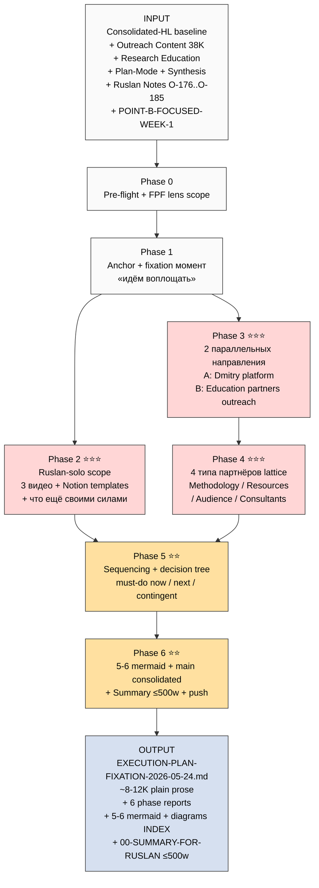

# 📋 EXPLAIN — Execution Plan Fixation prompt

> **Цель этого файла:** ты читаешь ДО launch'a server CC promtp'a. Знаешь что внутри / что получим / куда продвигает. Per memory rule **«каждый server CC prompt = сначала explanation, потом launch»**.

---

## §1 Что у нас СЕЙЧАС (state до launch)

### Substrate готов

- ✅ **Consolidated-HL Phase 1-4 уже pushed** (Кого / Чему / Инфо+порядок / Прошивка+варианты+деньги+этапы)
- 🔄 **Consolidated-HL Phase 5-6 in flight** (5 mermaid + Main consolidated ≤12K + Summary) — server CC autonomous закрывает
- ✅ **Outreach Content** (~38K / 7+3 принципов / 13 CTAs / 5+1 archetypes / 18 P0-P6 artifacts)
- ✅ **Research Education** (Phase 7 Jetix Lens 12 proposals + Phase 8 AWAITING packet)
- ✅ **RUSLAN-NOTES-EDUCATION-PARADIGM** (10 ideas O-176..O-185 + 4 compound themes)
- ✅ **Plan-Mode** (Plans B Docs + A Video + C Notion / 3-week Option 3 Mixed default)
- ✅ **Synthesis Execution Plans** (4 plans A/B/C/D / 47 ideas distilled)
- ✅ **POINT-A / POINT-B / POINT-B-FOCUSED-WEEK-1** + 4 LOCKED canonical
- ✅ **PARTNER-OFFERING-HUMAN-LANG** (style anchor)

### Что НЕ зафиксировано пока

- ❌ **«Что Ruslan делает сейчас сам своими силами на сервере»** — НЕТ canonical документа
- ❌ **«Что просим у партнёров / что не делаем сами»** — split не зафиксирован
- ❌ **2 параллельных направления (Dmitry platform / Education partner outreach)** — не описаны как execution tracks
- ❌ **4 типа партнёров (методология / ресурсы / аудитория / консультанты)** — не зафиксирована lattice
- ❌ **Sequencing + decision tree** — что обязательно сейчас / что потом / в каком порядке

---

## §2 Что делает prompt (одной строкой)

Берёт consolidated-hl курс как **зафиксированный baseline** («идём воплощать») → собирает в один документ **execution plan**: что Ruslan делает сам + 2 параллельных направления + 4 типа партнёров + sequencing + 5-6 mermaid схем → push.

---

## §3 Что берёт на вход

| Источник | Зачем |
|---|---|
| `decisions/strategic/CONSOLIDATED-HUMAN-LANGUAGE-PLAN-2026-05-24.md` (когда Phase 6 закроется) **+** `reports/consolidated-human-language-plan-2026-05-24/01..04` | Baseline — что воплощаем |
| `decisions/strategic/OUTREACH-CONTENT-OUTCOMES-CTAS-2026-05-24.md` | 5+1 archetypes + 13 CTAs + 18 P0-P6 artifacts (для 4-partner-types lattice) |
| `decisions/strategic/RESEARCH-EDUCATION-2026-05-24.md` Phase 7 | 12 Jetix Lens proposals (для Ruslan-solo + 2 directions split) |
| `decisions/strategic/PLAN-MODE-DOCS-VIDEO-NOTION-2026-05-24.md` | Plan B Docs / A Video / C Notion sequencing |
| `decisions/strategic/SYNTHESIS-EXECUTION-PLANS-2026-05-24.md` | 4 plans распределение работы |
| `decisions/strategic/POINT-B-FOCUSED-WEEK-1-2026-05-23.md` | Week 1 frame |
| `decisions/strategic/RUSLAN-NOTES-EDUCATION-PARADIGM-2026-05-24.md` | O-176..O-185 (что обучаем + adequate intellect) |
| `PARTNER-OFFERING-HUMAN-LANG-2026-05-22.md` | Style anchor (plain Russian conversational) |
| `crm/` 180 contacts inventory | Кандидаты per partner type |

---

## §4 Что обрабатывает (pipeline — 7 фаз)

```
Phase 0 (pre-flight)
  ↓ FPF lens scope + substrate inventory verification
Phase 1 (anchor + fixation)
  ↓ Что фиксируем = «идём воплощать consolidated-hl план»
Phase 2 (Ruslan solo)
  ↓ 2-3 видео + Notion templates + что ещё своими силами
Phase 3 (2 параллельных направления)
  ↓ Direction A: Dmitry → platform → audience → feedback
  ↓ Direction B: Outreach к education-partners (Maxim / Oleg / etc.)
Phase 4 (4 типа партнёров)
  ↓ Lattice: methodology / resources / audience / consultants
Phase 5 (sequencing + decision tree)
  ↓ Что обязательно сейчас / что потом / порядок / что-если
Phase 6 (mermaid + main consolidated + summary + push)
```

---

## §5 Что получим на выходе (концретные новые файлы)

| Файл | Что внутри |
|---|---|
| `reports/execution-plan-fixation-2026-05-24/phase-0-substrate.md` | Pre-flight + FPF lens scope verification |
| `reports/execution-plan-fixation-2026-05-24/01-anchor-fixation.md` | Что фиксируем + почему сейчас + watermark момента |
| `reports/execution-plan-fixation-2026-05-24/02-ruslan-solo-work.md` | 2-3 видео (содержание + sequencing + длина) + Notion templates + что ещё своими силами |
| `reports/execution-plan-fixation-2026-05-24/03-two-parallel-directions.md` | Dmitry platform side + Education partner outreach side |
| `reports/execution-plan-fixation-2026-05-24/04-four-partner-types.md` | Methodology / Resources / Audience / Consultants — per-type: что просим / что даём / примеры / CTA |
| `reports/execution-plan-fixation-2026-05-24/05-sequencing-decision-tree.md` | Must-do now / next / contingent + decision tree |
| `reports/execution-plan-fixation-2026-05-24/06-mermaid-schemes.md` + `diagrams/_INDEX.md` | 5-6 mermaid схем + index |
| `decisions/strategic/EXECUTION-PLAN-FIXATION-2026-05-24.md` ⭐ main | ~8-12K consolidated plain prose с emoji sections + 5-6 mermaid inline |
| `reports/execution-plan-fixation-2026-05-24/00-SUMMARY-FOR-RUSLAN.md` | ≤500 words quick read (3-4 min) для тебя |

---

## §6 Конкретные шаги (что server CC делает)

1. **Phase 0** — read substrate inventory, FPF lens scope, verify все parent docs доступны
2. **Phase 1** — формулирует **anchor**: «consolidated-hl курс = baseline, идём воплощать; этот документ = execution plan фиксация»
3. **Phase 2** — расписывает **Ruslan-solo scope**:
   - Видео A — методология как работает (база, прошивка)
   - Видео B — видение обучения людей + 7 ступеней + cross-skill
   - Видео C — видение работы в корпорации + sotrudnichestvo + платформа build / monetisation
   - Notion шаблоны (для Дмитрия trial + cohort onboarding)
   - Что ещё своими силами (1-pager / landing / FAQ)
4. **Phase 3** — расписывает **2 параллельных направления**:
   - **A (Dmitry / Platform side):** взять Дмитрия + начать collecting feedback + iterate platform MVP
   - **B (Education partners outreach):** отправить видео к Maxim (джедайские практики) / Oleg (trouble-shooters) / + 3-5 candidates → CTA: помогите курс сделать + развить систему
5. **Phase 4** — расписывает **4 типа партнёров lattice**:
   - **T1 Methodology partners** — описание создания курсов / методология / методическая помощь (Maxim / Oleg / Левенчук-tier)
   - **T2 Resource partners** — аудитория / capital / тех ресурсы / channels
   - **T3 Audience (testers)** — приходят / тестируют / дают feedback (cohort target О-161/162)
   - **T4 Consultants (delivery layer)** — проводят консультации другим / помогают настроить (revenue share L4-L6)
6. **Phase 5** — sequencing:
   - Must-do this week (Шаги 2-3-4 Plan-of-Day)
   - Must-do next week (Wave 1 first targets + first Dmitry session)
   - Contingent triggers (что-если consolidated-hl потребует rework / что-если first partner отказал)
   - Decision tree visual
7. **Phase 6** — 5-6 mermaid + main consolidated в стиле PARTNER-OFFERING-HUMAN-LANG + Summary ≤500w + push

---

## §7 К чему ведёт

После закрытия prompt'a:

1. Ты читаешь **00-SUMMARY-FOR-RUSLAN** (3-4 min) → high-level overview
2. Ты читаешь **EXECUTION-PLAN-FIXATION-2026-05-24.md** main (~30-40 min) → полная картина
3. **Decisions surface'нутые ты picks:**
   - Какие 2-3 видео точно записываем (одобренное содержание)
   - 5-10 первых target'ов для Wave 1 partner outreach (из 4 типа партнёров lattice)
   - Sequencing approval (что сначала / параллельно / contingent)
4. После этого → **execution starts:**
   - Запись видео (Ruslan solo)
   - First outreach to education partner (Maxim или Oleg первый)
   - Dmitry session #1 (platform feedback loop start)
   - Notion templates first draft
5. **edu-agent execution prompt** + **ABC execution prompts** запускаются после этого fixation step

---

## §8 Mermaid flow



---

## §9 Cost / Time / Constraints

- **Estimated runtime:** 3-5h autonomous (synthesis + plain prose + mermaid; NO new research)
- **Estimated cost:** <€2 Claude Max sub
- **ROY swarm:** brigadier + project-brigadier + mgmt-expert + engineering-expert + influence-ethics-expert (R12 paired для partner outreach Phase 3+4) + methodology-engineer cross-consult
- **Language:** russian primary + conversational plain prose
- **Style anchor:** `PARTNER-OFFERING-HUMAN-LANG-2026-05-22.md`
- **Density:** MAX-density mandate per memory `feedback_max_density_max_tokens` (это major strategic deliverable — execution plan для всего следующего цикла)

---

## §10 Зависимость от consolidated-hl

**Soft dependency:** Phase 1-4 consolidated-hl уже pushed = substrate достаточный. Phase 5-6 (5 mermaid + main consolidated) — желательно но не блокер. Если consolidated-hl Phase 6 закроется параллельно с этим prompt'ом — server CC re-reads main consolidated в Phase 0+1 substrate.

**Запуск можно:**
- Вариант A: **сейчас параллельно** consolidated-hl (separate tmux session) — обе работают одновременно ~3-5h
- Вариант B: **после** consolidated-hl Phase 6 закроется (sequential, чистее substrate)

Default recommendation: вариант B (sequential) — substrate чище, consolidated-hl main = clean anchor для этого Phase 1.

---

## §11 Constitutional posture

- ✅ R1 surface only — execution plan = sequencing scaffold; **Ruslan = strategist** для content of видео / partner targeting / monetisation
- ✅ R2 — NO Foundation modifications
- ✅ R6 — cross-refs к substrate per claim
- ✅ R11 — Default-Deny preserved (NO auto-execution of видео / outreach — только сurface'нуто как plan)
- ✅ R12 — paired-frame для partner outreach (influence-ethics-expert auto-fires в Phase 3+4)
- ✅ IP-1 STRICT — partner types = role-types, names (Maxim / Oleg / Dmitry) = examples not executor-binding
- ✅ Append-only

---

## §12 Acceptance criteria (refutation conditions)

Prompt refuted if:
- ❌ R1 strategic prose authored (видео content writing / partner offer authoring beyond skeleton)
- ❌ Foundation paths modified
- ❌ LOCKED canonical modified
- ❌ Auto-launch видео recording / outreach actions
- ❌ Partner-individual binding в Foundation paths (IP-1 violation)
- ❌ Jargon-heavy academic vocabulary без translation
- ❌ <5 mermaid schemes
- ❌ Main consolidated >12K words (concise mandate violated)

---

## §13 Launch command (готов после ack)

```bash
ssh jetix
tmux new -s execution-plan-fixation
cd ~/jetix-os && git pull --ff-only
claude --dangerously-skip-permissions -p "$(cat <<'EOF'
Autonomous execution: prompts/execution-plan-fixation-2026-05-24.md

7 phases (0-6) per-phase commit + push в format [exec-plan] Phase N.

⚠️ HUMAN-LANGUAGE SYNTHESIS — plain Russian conversational tone.
NO constitutional jargon without translation.
Style reference: PARTNER-OFFERING-HUMAN-LANG-2026-05-22.md.

Phases:
0. Pre-flight + FPF lens scope + substrate inventory
1. Anchor + fixation момент (consolidated-hl = baseline, идём воплощать)
2. ⭐⭐⭐ Ruslan-solo scope (2-3 видео + Notion templates + что ещё)
3. ⭐⭐⭐ 2 параллельных направления (Dmitry platform / Education partners outreach)
4. ⭐⭐⭐ 4 типа партнёров lattice (methodology / resources / audience / consultants)
5. ⭐⭐ Sequencing + decision tree (must-do now / next / contingent)
6. ⭐⭐ 5-6 mermaid + main consolidated ≤12K в стиле PARTNER-OFFERING-HUMAN-LANG (с emoji sections)
   + 00-SUMMARY-FOR-RUSLAN ≤500w + push

Substrate read:
- CONSOLIDATED-HUMAN-LANGUAGE-PLAN-2026-05-24.md (если закрыт) + reports/consolidated-hl/01-04
- OUTREACH-CONTENT-OUTCOMES-CTAS + RESEARCH-EDUCATION + PLAN-MODE + SYNTHESIS
- RUSLAN-NOTES-EDUCATION-PARADIGM + POINT-B-FOCUSED-WEEK-1 + TASK-A
- 4 LOCKED canonical + PARTNER-OFFERING-HUMAN-LANG (style anchor)
- CRM 180 contacts (для 4-partner-types candidate examples)

ROY swarm: brigadier + project-brigadier + mgmt-expert + engineering-expert
+ influence-ethics-expert (R12 paired Phase 3+4) + methodology-engineer cross-consult

R1 surface only. R6 cross-refs к deep substrate в footnotes only.
NO new research. NO R1 strategic prose. NO LOCK modifications. Pool result.

Final push: Phase 6 Main + Summary + 5-6 mermaid INDEX.
EOF
)"
# Ctrl-B then D to detach
```

---

*Explanation closure 2026-05-24 evening. Per Ruslan voice ack «делай prompts для клауд кода на сервере / новый план с несколькими mermaid / изучим и решим что делать далее». AWAITING-RUSLAN-ACK для launch (sequential after consolidated-hl Phase 6 рекомендовано).*
