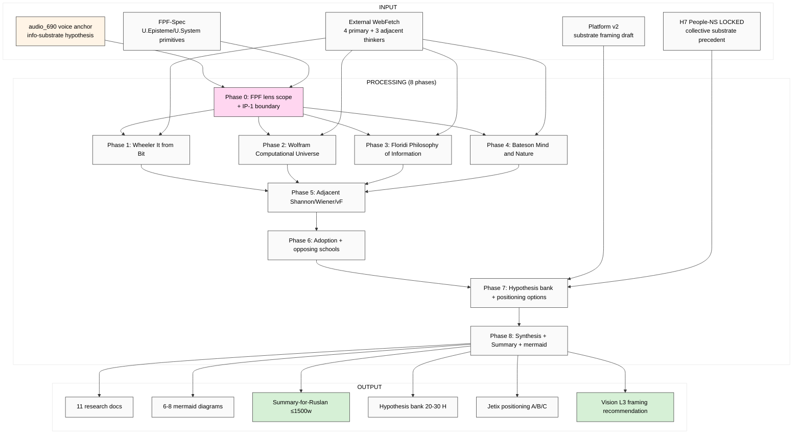

# EXPLAIN — K-1 Info-Substrate Philosophy Deep (Wheeler / Wolfram / Floridi / Bateson lineage)

> Plan-of-day discipline per `feedback_prompt_explanation_required.md`. Ruslan reviews ДО launch. Cross-link к batch-5 voice anchors + Platform v2 + Octagon LOCKs.

---

## §1 Что есть СЕЙЧАС

### Existing context (cross-link, NOT duplicate):
- ✅ `raw/voice-memos-2026-05-19-batch/audio_690@19-05-2026_04-05-57.md` — ⭐⭐ KEYSTONE voice anchor с info-substrate hypothesis articulated
- ✅ `reports/voice-pipeline-2026-05-19-batch-5/03-9-lenses-cross-analysis.md` — 27 datapoints; info-substrate emergence через 9 lenses
- ✅ `reports/voice-pipeline-2026-05-19-batch-5/00-SUMMARY-FOR-RUSLAN.md` — §7 K-1-5 candidate research roster
- ✅ `reports/voice-pipeline-2026-05-19-batch-5/05-candidates-3-buckets.md` — §3.3 K-1 specification
- ✅ `reports/jetix-platform-v2-2026-05-19/` — Platform v2 (9th lens; 11 docs + 7 mermaid; FPF 8-layer)
- ✅ `decisions/STRATEGIC-INSIGHT-JETIX-AS-PEOPLE-NETWORK-STATE-2026-05-12.md` (H7 People-NS LOCKED) — substrate-as-collective precedent

### NEW input (этот run):
- Voice anchor audio_690 ¶ info-substrate hypothesis: «AGI = коллективный субстрат NOT computer», substrate = люди + ML/AI + tools + protocols processing information at scale
- Adjacent voice anchors batch-5: audio_689 (society-as-code) + audio_691 (intellect 12-component) — research streams parallel but independent

### Strategic cross-refs (existing canonical context):
- `vision/00-MASTER-VISION-PLAN-2026-05-17.md` + companions 01-09 (read-only context)
- `reports/phase-0-fpf-scope/00-JETIX-FPF-MASTER-2026-05-17.md` + `01-jetix-objects-inventory.md`
- `raw/external/ailev-FPF/FPF-Spec.md` (FPF primitives canonical — особенно U.System / U.Episteme / B.5.1 Explore)
- 8 Octagon LOCKs (H1-H8) — read-only

---

## §2 Что делает этот prompt (one paragraph)

Brigadier (ROY swarm) выполняет **breadth deep research** info-substrate philosophical lineage через **FPF lens FIRST**. Output: deep mining 4 primary thinkers (Wheeler «It from Bit» / Wolfram «Computational Universe» / Floridi «Philosophy of Information» / Bateson «Mind and Nature») + 3-5 adjacent thinkers (Shannon / Wiener / von Foerster) + adoption assessment (где принято / где отвергнуто / opposing schools materialism/dualism/functionalism counterarguments) + Jetix positioning options (3 variants: commit lineage / discreet / adapt) + hypothesis bank 20-30 H с refutation conditions + Vision narrative L3 framing recommendation + 6-8 mermaid diagrams. Russian primary + English (FPF + verbatim source quotations).

---

## §3 Что берёт на вход

### Primary input:
- audio_690 ¶ info-substrate hypothesis (voice anchor verbatim)
- Cross-link к 27 datapoints в `03-9-lenses-cross-analysis.md`

### Cross-link scope (existing research — NOT re-do):
- Platform v2 reports/jetix-platform-v2-2026-05-19/ (substrate framing уже эскизирован)
- H7 People-NS LOCKED (substrate-as-collective precedent)
- Octagon LOCKs (info-flow + collective intelligence + trust infrastructure)

### Canonical baselines (read-only):
- vision/* (especially 03 Workshop)
- raw/external/ailev-FPF/FPF-Spec.md
- decisions/JETIX-VISION-FUNDAMENTAL-2026-04-27.md

### External (WebFetch / WebSearch budget):
- **Wheeler «It from Bit» (1989-1990)** — основополагающие papers, including «Information, Physics, Quantum: The Search for Links» (1989) Santa Fe Institute proceedings
- **Wolfram «A New Kind of Science» (2002)** + «Wolfram Physics Project» (2020-) — computational universe primary docs
- **Floridi «The Philosophy of Information» (2011)** + «The Ethics of Information» (2013) — Oxford University Press; PoI primary
- **Bateson «Mind and Nature: A Necessary Unity» (1979)** + «Steps to an Ecology of Mind» (1972) — cybernetic ecology
- **Adjacent thinkers:**
  - Shannon «A Mathematical Theory of Communication» (1948) — information theory foundation
  - Wiener «Cybernetics» (1948) + «The Human Use of Human Beings» (1950)
  - von Foerster Second-order cybernetics + Heinz von Foerster Society materials

---

## §4 Что обрабатывает (pipeline / 8 phases)

### Phase 0 — FPF lens scope + IP-1 boundary
Define через FPF: substrate-as-U.System holonic / information-as-U.MethodDescription / philosophy-of-X-as-U.Episteme. IP-1 boundary: substrate philosophy = abstract pattern (U.Episteme); Jetix instance = RUSLAN-LAYER. Acceptance predicate с refutation conditions.
**Output:** `01-fpf-lens-scope.md` (≤1000w)

### Phase 1 — Wheeler «It from Bit» deep mining
Verbatim claims from 1989 paper + Princeton lectures + adoption signal (quantum information physics community); F-G-R per claim. Cross-link к Jetix substrate framing.
**Output:** `02-wheeler-it-from-bit.md` (~2500w)

### Phase 2 — Wolfram «Computational Universe» deep mining
NKS (2002) + Wolfram Physics Project (2020-); computational equivalence principle; cellular automata as substrate primitive; adoption pattern (computer-science vs physics-community).
**Output:** `03-wolfram-computational-universe.md` (~2500w)

### Phase 3 — Floridi «Philosophy of Information» deep mining
PoI (2011) + Ethics of Information (2013); infosphere concept; ICTs as ontologically constitutive; Floridi's «Levels of Abstraction» (LoA) method.
**Output:** `04-floridi-philosophy-information.md` (~2500w)

### Phase 4 — Bateson «Mind and Nature» deep mining
Mind-as-system; «difference that makes a difference»; ecological mind; cybernetic causality; recursive epistemology; pattern-which-connects.
**Output:** `05-bateson-mind-nature.md` (~2500w)

### Phase 5 — Adjacent thinkers (Shannon / Wiener / von Foerster)
Shannon information-as-quantity; Wiener cybernetics 1.0 (control + communication); von Foerster cybernetics 2.0 (observer-included). Bridging foundation между info theory и philosophy.
**Output:** `06-adjacent-shannon-wiener-von-foerster.md` (~2000w)

### Phase 6 — Adoption assessment + opposing schools
Where info-substrate framing accepted (academic + technical + popular)? Where rejected? Opposing schools:
- **Materialism** (matter-first; info = derivative)
- **Dualism** (mind-matter distinct)
- **Functionalism** (computation-substrate-indifferent; info is just symbol manipulation)
- **Pansychism** (consciousness primitive)
Strongest critiques per school + counter-arguments inventory.
**Output:** `07-adoption-opposing-schools.md` (~3000w)

### Phase 7 — Hypothesis bank 20-30 H + Jetix positioning options
H-IS-1 .. H-IS-30 каждый F2-F3 + refutation_conditions + test design + cross-ref. 3 Jetix positioning options:
- **Option A (commit lineage)** — Jetix explicitly anchored to Wheeler/Floridi info-substrate philosophy
- **Option B (discreet)** — substrate framing internally but не cited externally
- **Option C (adapt)** — info-substrate как one of several frames (info + biological + ecological)
**Output:** `08-hypotheses-bank-jetix-positioning.md` (~3000w)

### Phase 8 — Cross-cutting synthesis + Summary-for-Ruslan + 6-8 mermaid
9-12 patterns across 4 thinkers + adjacent + adoption + Jetix positioning. Summary ≤1500w + Vision narrative L3 framing recommendation.
**Output:** `98-cross-cutting-synthesis.md` (~2000w) + `99-SUMMARY-FOR-RUSLAN.md` (≤1500w) + `diagrams/01-08-*.md`

---

## §5 Что получим на выходе (Ruslan reviews list)

### NEW files в `research/info-substrate-philosophy-deep-2026-05-19/`:

1. `00-MASTER-INDEX.md`
2. `01-fpf-lens-scope.md`
3. `02-wheeler-it-from-bit.md`
4. `03-wolfram-computational-universe.md`
5. `04-floridi-philosophy-information.md`
6. `05-bateson-mind-nature.md`
7. `06-adjacent-shannon-wiener-von-foerster.md`
8. `07-adoption-opposing-schools.md`
9. `08-hypotheses-bank-jetix-positioning.md`
10. `98-cross-cutting-synthesis.md`
11. `99-SUMMARY-FOR-RUSLAN.md`
12-19. `diagrams/01-08-*.md` (6-8 mermaid)

### MODIFIED (append-only):
- `reports/phase-0-fpf-scope/01-jetix-objects-inventory.md` §APPEND — possible O-52 candidate «info-substrate-philosophy-lineage» (F2 surface; Ruslan ack required)
- `wiki/log.md` append + index update

### NOT-modified (constitutional preservation):
- ❌ Foundation v1.0 / Pillar C / shared/schemas / VISION-FUNDAMENTAL
- ❌ 8 Octagon LOCK content
- ❌ Existing canonical strategic docs

---

## §6 Конкретные шаги

1. Brigadier reads §1 inputs (audio_690 + Platform v2 substrate framing + H7 + Octagon LOCKs)
2. Phase 0 → 8 sequential per-phase commits
3. Final push origin main
4. Ruslan reads `99-SUMMARY-FOR-RUSLAN.md` + surfaces top insights к C.1/C.2/Vision narrative

---

## §7 К чему ведёт

### Immediate:
- **Vision narrative L3 framing substrate ready** — Wheeler/Wolfram/Floridi/Bateson lineage citation-ready for pitch decks + investor memos
- **Counter-argument inventory** — anti-materialism / anti-functionalism rebuttals ready
- **Jetix positioning A/B/C options surface** — Ruslan choosing positioning becomes informed decision

### Phase 1+ unlock:
- C.1 one-pager substrate philosophical anchor (one of several anchors)
- C.2 pitch deck v1 «AGI = collective substrate» framing (cross-link с K-2)
- L3 investor narrative depth (institutional thesis fit)

### Phase 2+:
- Education Layer Tier 1 «Foundations of Information» module curriculum candidate
- Workshop curriculum philosophical foundation
- Research-publication substrate (academic papers if pursued)

### Constitutional:
- Foundation / Pillar C / Octagon LOCKs preserved (read-only)
- All hypotheses breadth (NOT selection)
- FPF lens FIRST applied throughout
- IP-1 boundary explicit (pattern vs instance)

---

## §8 Mermaid схема (visual flow)

---

## §9 Constitutional checklist

- [x] R1 surface-only: research run; brigadier-scribe
- [x] R6 provenance per claim (verbatim quote + retrieved_date)
- [x] R11 Default-Deny novel actions
- [x] R12 anti-extraction check section в hypothesis bank
- [x] IP-1 STRICT — pattern vs instance distinction explicit
- [x] EP-5 F-grade disclosed
- [x] Append-only (new namespace + 1 §APPEND к Phase 0 inventory)
- [x] Foundation/Pillar C/Octagon LOCK content preserved
- [x] FPF lens FIRST in Phase 0
- [x] Breadth NOT selection (per memory rule)
- [x] Word budgets enforced

---

## §10 Risk surface

| Risk | Mitigation |
|---|---|
| **Source unavailability** (Wheeler 1989 paper paywalled) | Multi-source corroboration; cite secondary peer-reviewed reviews; flag retrieval F-grade |
| **Selection slip** (Jetix-positioning becomes recommendation) | Phase 7 explicitly enforces breadth-NOT-selection format с 3 options surfaced parallel; refutation per H |
| **Anachronism** (modern reading-back into Wheeler 1989) | Verbatim quote + temporal context per claim |
| **Cherry-pick** (only pro-info-substrate selected) | Phase 6 explicitly enforces opposing schools deep mining |
| **External cost overrun** | Halt при cost >€4; WebFetch budget cap |

---

## §11 Что НЕ делает (anti-list)

- ❌ НЕ promote any H к LOCK (research surface only)
- ❌ НЕ commit Jetix к specific positioning option (Ruslan acks)
- ❌ НЕ contact academic gatekeepers / Wheeler estate / Wolfram team / Floridi
- ❌ НЕ touch Foundation / Pillar C / Schemas / VISION-FUNDAMENTAL
- ❌ НЕ overwrite existing canonical
- ❌ НЕ generate strategic prose без voice anchor (R1)
- ❌ НЕ skip opposing schools (Phase 6 mandatory)
- ❌ Pause за подтверждениями — Ruslan ack явный

---

*Cloud Cowork explanation document для K-1 Info-Substrate Philosophy deep research run. AWAITING-RUSLAN-LAUNCH через `_LAUNCH-5-K-RESEARCH-2026-05-19.md`. Parallel-safe со K-2/K-3/K-4/K-5 (different namespaces).*
