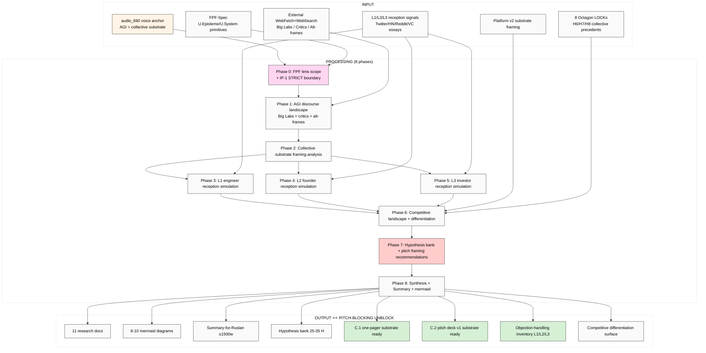

# EXPLAIN — K-2 AGI Reception Market Deep Research ⭐⭐ PITCH-BLOCKING

> Plan-of-day discipline per `feedback_prompt_explanation_required.md`. ⭐⭐ HIGHEST PRIORITY — этот run unblocks C.1 one-pager + C.2 pitch deck v1 drafting. Ruslan reviews ДО launch.

---

## §1 Что есть СЕЙЧАС

### Existing context (cross-link, NOT duplicate):
- ✅ `raw/voice-memos-2026-05-19-batch/audio_690@19-05-2026_04-05-57.md` — ⭐⭐ KEYSTONE voice anchor; AGI redefinition system-level NOT computer-level
- ✅ `reports/voice-pipeline-2026-05-19-batch-5/03-9-lenses-cross-analysis.md` — 27 datapoints; AGI framing surface
- ✅ `reports/voice-pipeline-2026-05-19-batch-5/05-candidates-3-buckets.md` — §3.3 K-2 specification
- ✅ `reports/jetix-platform-v2-2026-05-19/` — Platform v2 (substrate framing draft)
- ✅ `vision/00-MASTER-VISION-PLAN-2026-05-17.md` + companions 01-09

### NEW input (этот run):
- Voice anchor audio_690 «AGI = collective substrate» framing — system-level NOT computer-level
- Need L1 (engineers) / L2 (founders) / L3 (investors) reception mapping для pitch readiness
- Competitive landscape: кто ещё claims similar framing? Differentiation surface needed

### Strategic cross-refs (existing canonical — READ-ONLY):
- `decisions/STRATEGIC-INSIGHT-JETIX-AS-PEOPLE-NETWORK-STATE-2026-05-12.md` (H7 LOCKED)
- `decisions/STRATEGIC-INSIGHT-JETIX-AS-GAMIFIED-PLATFORM-2026-05-11.md` (H6)
- `decisions/STRATEGIC-INSIGHT-JETIX-TRUST-INFRASTRUCTURE-2026-05-17.md` (H8)
- vision/* (especially 03 Workshop, 04 Clan, 08 L1 collaboration)

---

## §2 Что делает этот prompt (one paragraph)

Brigadier (ROY swarm) выполняет **breadth deep research** AGI reception market через **FPF lens FIRST**. Output: current AGI discourse landscape mapping (Big Lab statements OpenAI/Anthropic/DeepMind/SSI + critics LeCun/Ng/Hutter/Sutton + alternative frames Wolfram/Plurality/Sapienship; 2024-2026 timeframe) + L1 engineer reception simulation (ML/AI Twitter / HN / Reddit sentiment patterns + expected critiques) + L2 founder reception simulation (a16z/Sequoia/Founders portfolios + pitch reception patterns + expected friction) + L3 investor reception simulation (institutional thesis fit + due diligence concerns) + competitive landscape (≥5 competitors / adjacent positioning + differentiation surface) + hypothesis bank 25-35 H + pitch framing recommendations (anchor / hook / objection-handling) + C.1/C.2 drafting substrate ready + 8-10 mermaid diagrams. Russian primary + English (FPF + AGI discourse verbatim).

---

## §3 Что берёт на вход

### Primary input:
- audio_690 ¶ AGI redefinition (voice anchor verbatim)
- Cross-link к 27 datapoints в `03-9-lenses-cross-analysis.md`

### Cross-link scope (existing — NOT re-do):
- Platform v2 reports/jetix-platform-v2-2026-05-19/ (substrate framing draft + monetization layer)
- 8 Octagon LOCKs (H1-H8 — collective framing precedents)

### Canonical baselines (READ-ONLY):
- vision/* (positioning context)
- decisions/JETIX-VISION-FUNDAMENTAL-2026-04-27.md (35 UC × 12 categories)
- raw/external/ailev-FPF/FPF-Spec.md (FPF primitives)

### External (WebFetch + WebSearch budget):
- **Big Lab AGI statements 2024-2026:**
  - OpenAI «Planning for AGI and beyond» (Altman 2023) + later updates
  - Anthropic «Core Views on AI Safety» + Dario Amodei essays
  - Google DeepMind AGI manifesto (Hassabis interviews + Demis Hassabis press)
  - Sutskever SSI (Safe Superintelligence Inc.) press + statements
  - xAI mission statements
- **Critics:**
  - Andrew Ng «AI doesn't have AGI» commentary
  - Yann LeCun (JEPA + world models + AGI skepticism Twitter/X threads)
  - Marcus Hutter (AIXI + theoretical AGI framework)
  - Richard Sutton («Bitter Lesson»; AGI/ASI views)
  - Gary Marcus (AGI skepticism columns)
- **Alternative AGI frames:**
  - Wolfram «Computational Universe» framing
  - Tang + Weyl «Plurality» (collective intelligence framing)
  - Sapienship «AI Agents» framing (Yuval Noah Harari directional)
  - Stuart Russell «Human Compatible» (control framing)
- **L1 engineer discourse:**
  - ML/AI Twitter/X discourse 2024-2026
  - Hacker News AI threads
  - r/MachineLearning + r/singularity sentiments
  - LessWrong / Alignment Forum discourse
- **L2 founder reception:**
  - a16z AI portfolio thesis essays
  - Sequoia AI investments 2024-2026
  - Founders Fund AI stance
  - Y Combinator AI batch trajectories
- **L3 investor reception:**
  - Institutional perspective: Sequoia / a16z / Founders / Khosla AI thesis pieces
  - Tier-1 VC AI thesis 2024-2026
  - Limited Partner sentiment (foundation + endowment AI exposure)

---

## §4 Что обрабатывает (pipeline / 8 phases)

### Phase 0 — FPF lens scope + IP-1 boundary
Define через FPF: AGI-as-concept (U.Episteme + U.System abstract) / AGI-claim-as-positioning-tactic (U.MethodDescription) / market-reception-as-U.System (audience holonic). IP-1 STRICT: «AGI = collective substrate» = abstract claim (U.Episteme); Jetix instance = RUSLAN-LAYER binding; reception research = audience-perception study NOT product feature claim. Acceptance predicate.
**Output:** `01-fpf-lens-scope.md` (≤1000w)

### Phase 1 — Current AGI discourse landscape mapping (2024-2026)
Big Labs (OpenAI / Anthropic / DeepMind / SSI / xAI) AGI definition + roadmap statements. Critics inventory. Alternative frames inventory.
**Output:** `02-agi-discourse-landscape.md` (~3000w)

### Phase 2 — «AGI = collective substrate» framing analysis
Who else uses this framing? Adjacent frames (Plurality / collective intelligence / Sapienship / Decentralized AI). Differentiation surface vs precedents.
**Output:** `03-collective-substrate-framing-analysis.md` (~2500w)

### Phase 3 — L1 engineer reception simulation
ML/AI Twitter/X sentiment patterns; HN reception patterns; Reddit signals; LessWrong/Alignment Forum reception. Expected critiques from L1 audience. Common L1 objections inventory. Engineering credibility signals required.
**Output:** `04-l1-engineer-reception.md` (~2500w)

### Phase 4 — L2 founder reception simulation
Founder pitch reception patterns в AI vertical. Common L2 objections. Pitch differentiation strategies. Demo / proof-of-concept requirements per L2 expectations.
**Output:** `05-l2-founder-reception.md` (~2500w)

### Phase 5 — L3 investor reception simulation
Institutional thesis fit (a16z / Sequoia / Founders / Khosla). Due diligence concerns. Technical proof requirements. Market sizing expected. LP sentiment.
**Output:** `06-l3-investor-reception.md` (~2500w)

### Phase 6 — Competitive landscape + differentiation
≥5 competitors / adjacent positioning (Plurality / Sapienship / SSI / DeepMind / OpenAI / specific AGI claimants). Per-competitor differentiation surface. Jetix unique angle inventory. White-space mapping.
**Output:** `07-competitive-landscape-differentiation.md` (~3000w + competitor matrix table)

### Phase 7 — Hypothesis bank 25-35 H + reception mitigation + pitch framing recommendations
H-AR-1 .. H-AR-35 каждый F2-F3 + refutation_conditions + test design + cross-ref. Reception mitigation strategies per audience tier. Pitch framing recommendations (anchor / hook / objection-handling per L1/L2/L3).
**Output:** `08-hypotheses-bank-pitch-framing.md` (~3500w)

### Phase 8 — Cross-cutting synthesis + Summary-for-Ruslan + 8-10 mermaid
12-15 patterns across phases. Summary ≤1500w + C.1/C.2 drafting substrate explicit. Mermaid diagrams (8-10).
**Output:** `98-cross-cutting-synthesis.md` (~2500w) + `99-SUMMARY-FOR-RUSLAN.md` (≤1500w) + `diagrams/01-10-*.md`

---

## §5 Что получим на выходе (Ruslan reviews list)

### NEW files в `research/agi-reception-market-deep-2026-05-19/`:

1. `00-MASTER-INDEX.md`
2. `01-fpf-lens-scope.md`
3. `02-agi-discourse-landscape.md`
4. `03-collective-substrate-framing-analysis.md`
5. `04-l1-engineer-reception.md`
6. `05-l2-founder-reception.md`
7. `06-l3-investor-reception.md`
8. `07-competitive-landscape-differentiation.md`
9. `08-hypotheses-bank-pitch-framing.md`
10. `98-cross-cutting-synthesis.md`
11. `99-SUMMARY-FOR-RUSLAN.md`
12-21. `diagrams/01-10-*.md` (8-10 mermaid)

### MODIFIED (append-only):
- `reports/phase-0-fpf-scope/01-jetix-objects-inventory.md` §APPEND — O-53 candidate «agi-reception-market-mapping» (F2 surface)
- `wiki/log.md` append + index update

### NOT-modified:
- ❌ Foundation v1.0 / Pillar C / shared/schemas / VISION-FUNDAMENTAL
- ❌ 8 Octagon LOCK content
- ❌ Existing canonical strategic docs

---

## §6 Конкретные шаги

1. Brigadier reads §1 inputs (audio_690 + Platform v2 + 8 Octagon LOCKs + Vision-Fundamental)
2. Phase 0 → 8 sequential per-phase commits
3. Final push origin main
4. Ruslan reads `99-SUMMARY-FOR-RUSLAN.md` → drafts C.1 one-pager + C.2 pitch deck v1

---

## §7 К чему ведёт

### Immediate ⭐⭐ PITCH-BLOCKING UNBLOCK:
- **C.1 one-pager substrate ready** — anchor / hook / objection-handling specific per L1/L2/L3 audience
- **C.2 pitch deck v1 substrate ready** — slide-by-slide framing decisions informed by reception simulation
- **Competitive differentiation surface** — Jetix unique angle vs Plurality/Sapienship/SSI explicit
- **Objection-handling inventory** — top 5 objections per L1/L2/L3 с counter-arguments

### Phase 1+ unlock:
- L1 outreach script substrate (per K-2 reception findings)
- L2 founder pitch substrate
- L3 investor narrative substrate (cross-link К-1 Vision narrative L3 framing)

### Phase 2+:
- Master Workshop of Engineers L1 outreach с reception-informed messaging
- Founder cohort partnership conversations с L2-informed approach
- Institutional capital conversations с L3-informed narrative

### Constitutional:
- Foundation / Pillar C / Octagon LOCKs preserved
- All hypotheses breadth (NOT selection)
- FPF lens FIRST applied throughout
- IP-1 STRICT — abstract claim vs Jetix instance distinction explicit

---

## §8 Mermaid схема (visual flow)

---

## §9 Constitutional checklist

- [x] R1 surface-only: research run; brigadier-scribe
- [x] R6 provenance per claim (URL + retrieved_date for discourse references)
- [x] R11 Default-Deny novel actions
- [x] R12 anti-extraction check (AGI framing does NOT enable extraction-beyond-share)
- [x] IP-1 STRICT — «AGI = collective substrate» abstract claim vs Jetix instance distinction explicit
- [x] EP-5 F-grade disclosed
- [x] Append-only (new namespace + 1 §APPEND к Phase 0 inventory)
- [x] Foundation/Pillar C/Octagon LOCK content preserved
- [x] FPF lens FIRST in Phase 0
- [x] Breadth NOT selection — все pitch recommendations = hypotheses to test, NOT decisions
- [x] Word budgets enforced

---

## §10 Risk surface

| Risk | Mitigation |
|---|---|
| **Discourse drift** (2024-2026 AGI statements rapidly outdated) | Retrieved_date per source; F-grade reflects temporal stability; primary sources preferred over secondary commentary |
| **L1 reception simulation = guess** (no direct survey data) | Multiple signal sources (Twitter / HN / Reddit / Alignment Forum); explicit «simulation» framing — F2 grade |
| **L3 thesis fit = aspirational** (institutional access limited) | Public VC essays + LP sentiment signals; explicit «thesis fit hypothesis» — F2 grade |
| **Competitive landscape blind spots** | ≥5 competitors minimum + adjacent positioning; cross-reference Wolfram/Plurality/Sapienship verified |
| **Pitch framing selection slip** | Phase 7 enforces breadth — multiple anchor/hook/objection options surfaced parallel; NO single recommendation |
| **External cost overrun** | Halt при cost >€4; WebFetch + WebSearch budget cap |

---

## §11 Что НЕ делает (anti-list)

- ❌ НЕ promote any H к LOCK
- ❌ НЕ commit Jetix к specific pitch framing (Ruslan acks)
- ❌ НЕ contact Big Labs / VCs / critics (Ruslan personal action)
- ❌ НЕ touch Foundation / Pillar C / Schemas / VISION-FUNDAMENTAL / 8 Octagon LOCK content
- ❌ НЕ overwrite existing canonical
- ❌ НЕ generate strategic prose без voice anchor (R1)
- ❌ НЕ collapse L1/L2/L3 distinctions (separate reception simulations required)
- ❌ НЕ skip competitive landscape (Phase 6 mandatory; ≥5 competitors)
- ❌ НЕ violate IP-1 («AGI = collective substrate» = abstract pattern; Jetix instance = RUSLAN-LAYER)
- ❌ Pause за подтверждениями — Ruslan ack явный

---

*Cloud Cowork explanation document для K-2 AGI Reception Market deep research run. ⭐⭐ PITCH-BLOCKING — Ruslan unblocks C.1 + C.2 drafting upon completion. AWAITING-RUSLAN-LAUNCH через `_LAUNCH-5-K-RESEARCH-2026-05-19.md`. Parallel-safe с K-1/K-3/K-4/K-5.*
