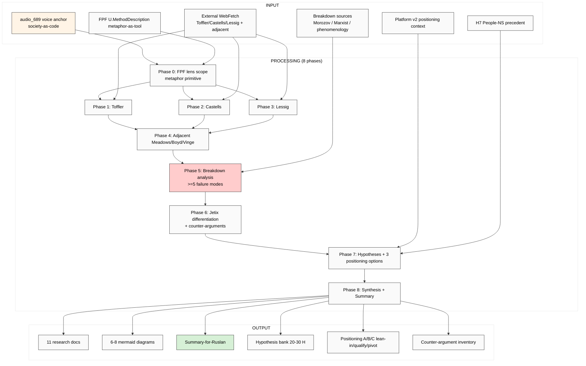

# EXPLAIN — K-3 Society-as-Code Metaphor Stress Test

> Plan-of-day discipline per `feedback_prompt_explanation_required.md`. Этот run проверяет «society-as-code» metaphor на прочность: где precedent + где metaphor ломается + counter-argument inventory + 3 Jetix positioning options.

---

## §1 Что есть СЕЙЧАС

### Existing context (cross-link, NOT duplicate):
- ✅ `raw/voice-memos-2026-05-19-batch/audio_689@19-05-2026_03-35-50.md` — voice anchor с «society-as-code» framing + Jetix-as-debugger metaphor
- ✅ `reports/voice-pipeline-2026-05-19-batch-5/05-candidates-3-buckets.md` — §3.3 K-3 specification
- ✅ `reports/voice-pipeline-2026-05-19-batch-5/03-9-lenses-cross-analysis.md` — 27 datapoints
- ✅ `reports/jetix-platform-v2-2026-05-19/` — Platform v2 (positioning context)

### NEW input (этот run):
- audio_689 ¶ society-as-code + Jetix-as-debugger metaphor
- Need stress-test: where does metaphor break? counter-argument inventory mandatory

### Strategic cross-refs (existing canonical — READ-ONLY):
- 8 Octagon LOCKs (H1-H8)
- `decisions/JETIX-VISION-FUNDAMENTAL-2026-04-27.md`
- vision/* (especially 03 Workshop)

---

## §2 Что делает этот prompt (one paragraph)

Brigadier (ROY swarm) выполняет **breadth deep research** «society-as-code» metaphor через **FPF lens FIRST**. Output: deep mining 3 primary thinkers (Toffler «Third Wave» / Castells «Network Society» / Lessig «Code is Law») + 3 adjacent (Meadows / Boyd / Vinge) + **breakdown analysis** (≥5 failure modes — где metaphor ломается: humans-as-bugs caveat / determinism / agency / cultural diversity / Marxist counter / phenomenological critique) + counter-argument inventory + Jetix differentiation (что NEW vs precedent) + hypothesis bank 20-30 H + 3 Jetix positioning options (lean-in / qualify / pivot) + 6-8 mermaid diagrams. Russian primary + English (verbatim source quotes).

---

## §3 Что берёт на вход

### Primary input:
- audio_689 voice anchor

### Cross-link scope:
- Platform v2 positioning context
- 8 Octagon LOCKs (especially H7 People-NS — network state precedent)

### Canonical baselines (READ-ONLY):
- vision/*
- raw/external/ailev-FPF/FPF-Spec.md (U.MethodDescription metaphor-as-tool primitive)

### External (WebFetch budget):
- **Alvin Toffler «The Third Wave» (1980)** + «Powershift» (1990) — society-as-information-system precedent
- **Manuel Castells «The Rise of Network Society» (1996)** + «Communication Power» (2009) — networked society code-like analysis
- **Lawrence Lessig «Code and Other Laws of Cyberspace» (1999) / «Code v2» (2006)** — code-is-law legal precedent
- **Adjacent:**
  - Donella Meadows «Thinking in Systems» (2008) — systems thinking
  - John Boyd OODA loop — military decision cycle
  - Vernor Vinge «The Coming Technological Singularity» (1993)
- **Breakdown analysis sources:**
  - Marxist counter-positions (e.g. Evgeny Morozov «To Save Everything, Click Here» 2013 — solutionism critique)
  - Phenomenological counter (embodied experience missing)
  - Cultural diversity counter (universalism critique)
  - Agency-as-irreducible counter (humans-as-bugs trap)

---

## §4 Что обрабатывает (pipeline / 8 phases)

### Phase 0 — FPF lens scope + metaphor primitive
Define через FPF: «society-as-code» = U.MethodDescription metaphor-as-tool primitive; «Jetix-as-debugger» = method tactic. Acceptance predicate с refutation conditions.
**Output:** `01-fpf-lens-scope.md` (≤1000w)

### Phase 1 — Toffler deep mining
«Third Wave» (1980) + «Powershift» (1990) verbatim claims. Information-society precedent. Adoption trajectory.
**Output:** `02-toffler-third-wave-powershift.md` (~2500w)

### Phase 2 — Castells deep mining
«Network Society» (1996) + «Communication Power» (2009) verbatim. Networked society analytic frame. Adoption.
**Output:** `03-castells-network-society.md` (~2500w)

### Phase 3 — Lessig deep mining
«Code is Law» (1999) + «Code v2» (2006) verbatim. Code-as-architecture-as-regulator. Legal-tech adoption.
**Output:** `04-lessig-code-is-law.md` (~2500w)

### Phase 4 — Adjacent thinkers
Meadows systems thinking / Boyd OODA loop / Vinge Singularity. Bridge analysis.
**Output:** `05-adjacent-meadows-boyd-vinge.md` (~2000w)

### Phase 5 — Breakdown analysis (where metaphor fails) ⭐⭐
≥5 failure modes deep:
- **humans-as-bugs caveat** — debug metaphor implies humans = errors to fix (politically loaded)
- **Determinism trap** — society-as-code suggests deterministic execution; ignores emergence + agency
- **Agency-as-irreducible** — moral / political agency cannot be «coded»
- **Cultural diversity** — universalist code framing ignores plural cultural ontologies
- **Marxist counter** — code-society ignores power relations + material conditions (capital)
- **Phenomenological counter** — embodied experience missing from code abstraction
- **Solutionism critique** — Morozov 2013 — «every social problem becomes a coding problem» trap
**Output:** `06-breakdown-analysis-where-metaphor-fails.md` (~3000w)

### Phase 6 — Jetix differentiation + counter-argument inventory
What's NEW vs precedent? Counter-arguments inventory ready (for each breakdown mode, what Jetix says).
**Output:** `07-jetix-differentiation-counter-arguments.md` (~2500w)

### Phase 7 — Hypothesis bank 20-30 H + 3 Jetix positioning options
H-SC-1 .. H-SC-30 каждый F2-F3 + refutation conditions. 3 positioning options (lean-in / qualify / pivot).
**Output:** `08-hypotheses-bank-jetix-positioning.md` (~3000w)

### Phase 8 — Cross-cutting synthesis + Summary + 6-8 mermaid
**Output:** `98-cross-cutting-synthesis.md` (~2000w) + `99-SUMMARY-FOR-RUSLAN.md` (≤1500w) + `diagrams/01-08-*.md`

---

## §5 Что получим на выходе

### NEW files в `research/society-as-code-stress-test-2026-05-19/`:

1. `00-MASTER-INDEX.md`
2. `01-fpf-lens-scope.md`
3. `02-toffler-third-wave-powershift.md`
4. `03-castells-network-society.md`
5. `04-lessig-code-is-law.md`
6. `05-adjacent-meadows-boyd-vinge.md`
7. `06-breakdown-analysis-where-metaphor-fails.md`
8. `07-jetix-differentiation-counter-arguments.md`
9. `08-hypotheses-bank-jetix-positioning.md`
10. `98-cross-cutting-synthesis.md`
11. `99-SUMMARY-FOR-RUSLAN.md`
12-19. `diagrams/01-08-*.md`

### MODIFIED (append-only):
- `reports/phase-0-fpf-scope/01-jetix-objects-inventory.md` §APPEND — O-54 candidate
- `wiki/log.md`

### NOT-modified:
- ❌ Foundation v1.0 / Pillar C / shared/schemas / VISION-FUNDAMENTAL / 8 Octagon LOCK content

---

## §6 Конкретные шаги

1. Brigadier reads §1 inputs
2. Phase 0 → 8 sequential per-phase commits
3. Final push origin main
4. Ruslan reads Summary + decides positioning A/B/C

---

## §7 К чему ведёт

### Immediate:
- **Positioning stress-tested** — где metaphor работает / где ломается
- **Counter-argument inventory ready** — против humans-as-bugs / determinism / Marxist / phenomenological critiques
- **Jetix differentiation surface** — что NEW vs Toffler/Castells/Lessig precedents

### Phase 1+ unlock:
- C.1/C.2 pitch resilience (cross-link К-2)
- Vision narrative L3 framing depth (cross-link К-1)

### Phase 2+:
- Education Layer ethical-surface (humans-as-bugs trap explicitly addressed)
- Workshop methodology counter-argument readiness

### Constitutional:
- Foundation / Pillar C / Octagon LOCKs preserved
- All hypotheses breadth (NOT selection)
- FPF lens FIRST applied throughout
- IP-1 explicit (metaphor = abstract method; Jetix instance = RUSLAN-LAYER)

---

## §8 Mermaid схема

---

## §9 Constitutional checklist

- [x] R1 surface-only
- [x] R6 provenance per claim + verbatim primary quotes
- [x] R11 Default-Deny
- [x] R12 anti-extraction check section
- [x] IP-1 — metaphor = abstract; Jetix instance = RUSLAN-LAYER
- [x] EP-5 F-grade disclosed
- [x] Append-only
- [x] FPF lens FIRST in Phase 0
- [x] Breadth NOT selection
- [x] Word budgets enforced

---

## §10 Risk surface

| Risk | Mitigation |
|---|---|
| **Cherry-pick** (pro-metaphor sources selected) | Phase 5 explicitly enforces ≥5 failure modes deep mined |
| **«Society-as-code» = collapse to Lessig** (narrow framing) | Phase 1 + Phase 2 mandatory deep mining Toffler + Castells как parallel framings |
| **Marxist counter dismissed too quickly** | Phase 5 explicitly includes Marxist counter; counter-argument inventory mandatory |
| **Humans-as-bugs trap unaddressed** | Phase 5 + Phase 6 explicit addressing |
| **Selection slip** (positioning becomes recommendation) | Phase 7 enforces 3 options parallel; NO recommendation |

---

## §11 Что НЕ делает (anti-list)

- ❌ Promote H к LOCK
- ❌ Commit Jetix к positioning A/B/C
- ❌ Touch Foundation / Pillar C / Schemas / VISION-FUNDAMENTAL / 8 Octagon LOCK content
- ❌ Cherry-pick pro-metaphor sources
- ❌ Dismiss breakdown analysis (Phase 5 mandatory)
- ❌ Generate strategic prose без voice anchor
- ❌ Pause за подтверждениями

---

*Cloud Cowork explanation document для K-3 Society-as-Code Stress Test deep research. AWAITING-RUSLAN-LAUNCH через `_LAUNCH-5-K-RESEARCH-2026-05-19.md`. Parallel-safe с K-1/K-2/K-4/K-5.*
