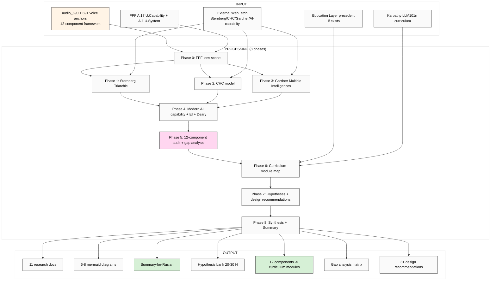

# EXPLAIN — K-4 Intellect 12-Component Exhaustiveness Audit

> Plan-of-day discipline. Этот run проверяет 12-component framework на exhaustiveness vs Sternberg / CHC / Gardner / EI + curriculum implications.

---

## §1 Что есть СЕЙЧАС

### Existing context (cross-link, NOT duplicate):
- ✅ `raw/voice-memos-2026-05-19-batch/audio_690@19-05-2026_04-05-57.md` — intellect components (questions / proportion / goals)
- ✅ `raw/voice-memos-2026-05-19-batch/audio_691@19-05-2026_04-17-11.md` — addendum к 12-component framework
- ✅ `reports/voice-pipeline-2026-05-19-batch-5/05-candidates-3-buckets.md` — §3.3 K-4 specification
- ✅ `reports/voice-pipeline-2026-05-19-batch-5/03-9-lenses-cross-analysis.md` — 27 datapoints
- ✅ `research/education-layer-deep-2026-05-18/` (Tier 1 curriculum precedent if completed by batch-4 run)
- ✅ `research/deepening-2026-05-18/09-people-karpathy-eureka-llm101n.md` (Karpathy curriculum lineage)

### NEW input:
- Voice anchors audio_690 + audio_691 — 12 intellect components articulated
- Need: exhaustiveness audit + missing components + curriculum module map

### Strategic cross-refs (READ-ONLY):
- 8 Octagon LOCKs
- vision/* (especially 03 Workshop)
- `decisions/STRATEGIC-INSIGHT-JETIX-EDUCATION-LAYER-SYSTEM-THINKING-2026-05-18.md` (if exists)

---

## §2 Что делает этот prompt (one paragraph)

Brigadier (ROY swarm) выполняет **breadth deep research** intellect 12-component framework через **FPF lens FIRST**. Output: deep mining 4 primary intelligence frameworks (Sternberg Triarchic / Cattell-Horn-Carroll CHC / Gardner Multiple Intelligences / Sternberg Successful Intelligence) + 2-3 adjacent (Goleman EI / Deary individual differences / modern AI capability frameworks ARC-AGI/HELM/MMLU) + gap analysis (что 12 components missing vs each precedent) + curriculum implications (Education Layer Tier 1 module map per 12 components) + hypothesis bank 20-30 H + curriculum design recommendations (surface, NOT decision) + 6-8 mermaid diagrams. Russian primary + English (FPF + framework terminology).

---

## §3 Что берёт на вход

### Primary input:
- audio_690 + audio_691 (12-component voice anchors)
- Cross-link к existing curriculum precedents

### Cross-link scope:
- Karpathy LLM101n (existing research-deepening direction 09)
- Education Layer concept (if exists)

### Canonical baselines (READ-ONLY):
- vision/* (Workshop curriculum surface)
- FPF-Spec.md (A.17 U.Capability + A.1 U.System)

### External (WebFetch / WebSearch):
- **Sternberg Triarchic Theory of Intelligence** (1985) + «Successful Intelligence» (1996)
- **Cattell-Horn-Carroll (CHC) model** (Cattell-Horn 1966 → Carroll 1993 → integrated CHC 2000s)
- **Gardner Multiple Intelligences** «Frames of Mind» (1983) + «Intelligence Reframed» (1999)
- **Goleman Emotional Intelligence** (1995)
- **Modern AI capability frameworks:**
  - ARC-AGI benchmark (Chollet 2019 + 2024 update)
  - HELM (Stanford Holistic Evaluation of Language Models)
  - MMLU (Massive Multitask Language Understanding)
  - BIG-Bench
- **Deary individual differences research** (Edinburgh group)

---

## §4 Что обрабатывает (pipeline / 8 phases)

### Phase 0 — FPF lens scope (intellect-as-system + capability)
Define через FPF: intellect = U.System (holonic; components = sub-systems) + U.Capability (A.17 acquisition). Acceptance predicate.
**Output:** `01-fpf-lens-scope.md` (≤1000w)

### Phase 1 — Sternberg Triarchic deep mining
Analytical / Creative / Practical components; «Successful Intelligence» framing. Adoption + critique.
**Output:** `02-sternberg-triarchic.md` (~2500w)

### Phase 2 — Cattell-Horn-Carroll (CHC) deep mining
Fluid (Gf) / Crystallised (Gc) / 9-broad / 70+ narrow abilities. Most-empirically-grounded modern model.
**Output:** `03-chc-model.md` (~2500w)

### Phase 3 — Gardner Multiple Intelligences deep mining
8 intelligences (linguistic / logical-math / spatial / musical / bodily-kinesthetic / interpersonal / intrapersonal / naturalist). Critique inventory (low empirical support).
**Output:** `04-gardner-multiple-intelligences.md` (~2500w)

### Phase 4 — Modern AI capability + EI + Deary
AI capability frameworks (ARC-AGI / HELM / MMLU / BIG-Bench) — что они measure / что missing. Goleman EI. Deary individual differences IQ-tradition rigour.
**Output:** `05-modern-ai-capability-ei-deary.md` (~2500w)

### Phase 5 — 12-Component audit (gap analysis vs each precedent)
For each of 12 voice-anchor components: which precedent covers it / which precedents miss it / what's NEW в 12-component framework / what's MISSING from 12-component framework (e.g. emotional regulation? spatial reasoning? motor intelligence? metacognition?). Gap analysis matrix.
**Output:** `06-12-component-audit-gap-analysis.md` (~3000w + gap matrix table)

### Phase 6 — Curriculum implications (Education Layer Tier 1 module map)
For each of 12 components: candidate curriculum module (objectives / methods / measures / cohort progression). Cross-link к Karpathy LLM101n + Workshop methodology.
**Output:** `07-curriculum-module-map.md` (~2500w + module map table)

### Phase 7 — Hypothesis bank 20-30 H + curriculum design recommendations
H-IC-1 .. H-IC-30. Curriculum design recommendations (surface ≥3 options).
**Output:** `08-hypotheses-bank-curriculum-design.md` (~2500w)

### Phase 8 — Cross-cutting synthesis + Summary + 6-8 mermaid
**Output:** `98-cross-cutting-synthesis.md` (~2000w) + `99-SUMMARY-FOR-RUSLAN.md` (≤1500w) + `diagrams/01-08-*.md`

---

## §5 Что получим на выходе

### NEW files в `research/intellect-12-component-audit-2026-05-19/`:

1. `00-MASTER-INDEX.md`
2. `01-fpf-lens-scope.md`
3. `02-sternberg-triarchic.md`
4. `03-chc-model.md`
5. `04-gardner-multiple-intelligences.md`
6. `05-modern-ai-capability-ei-deary.md`
7. `06-12-component-audit-gap-analysis.md`
8. `07-curriculum-module-map.md`
9. `08-hypotheses-bank-curriculum-design.md`
10. `98-cross-cutting-synthesis.md`
11. `99-SUMMARY-FOR-RUSLAN.md`
12-19. `diagrams/01-08-*.md`

### MODIFIED (append-only):
- `reports/phase-0-fpf-scope/01-jetix-objects-inventory.md` §APPEND — O-55 candidate
- `wiki/log.md`

### NOT-modified:
- ❌ Foundation / Pillar C / shared/schemas / VISION-FUNDAMENTAL / 8 Octagon LOCK content

---

## §6 Конкретные шаги

1. Brigadier reads §1 inputs
2. Phase 0 → 8 sequential per-phase commits
3. Final push origin main
4. Ruslan reads Summary + uses curriculum module map для Education Layer Tier 1 design

---

## §7 К чему ведёт

### Immediate:
- **Education Layer Tier 1 curriculum module map ready** — 12 components → curriculum modules
- **Gap analysis surface** — what 12-component missing vs Sternberg/CHC/Gardner/AI capability
- **Curriculum design recommendations** — 3+ options для Ruslan ack

### Phase 1+ unlock:
- Workshop curriculum substantive content (per 12 components)
- Karpathy-lineage cross-link (LLM101n model для curriculum design)
- Master Workshop of Engineers curriculum draft substrate

### Phase 2+:
- Hackathon mode integration с curriculum tier
- Apprenticeship cohort progression design

### Constitutional:
- Foundation preserved
- Breadth NOT selection
- FPF lens FIRST
- IP-1: 12-component = abstract pattern; Jetix curriculum = RUSLAN-LAYER instance

---

## §8 Mermaid схема

---

## §9 Constitutional checklist

- [x] R1 surface-only
- [x] R6 provenance per claim
- [x] R11 Default-Deny
- [x] R12 anti-extraction check (curriculum framework does not enable extraction)
- [x] IP-1 — 12-component pattern abstract; Jetix curriculum = RUSLAN-LAYER instance
- [x] EP-5 F-grade disclosed
- [x] Append-only
- [x] FPF lens FIRST
- [x] Breadth NOT selection — curriculum design recommendations surfaced parallel
- [x] Word budgets

---

## §10 Risk surface

| Risk | Mitigation |
|---|---|
| **Sternberg + CHC + Gardner conflict** (frameworks have different ontologies) | Phase 5 audit explicit per-component mapping vs each precedent separately |
| **Empirical rigour gap** (Gardner low support; CHC strong) | Per-framework empirical-support F-grade explicit |
| **Selection slip** (curriculum design becomes recommendation) | Phase 7 surfaces ≥3 design options parallel |
| **Cultural bias in IQ tradition** | Phase 4 includes critique surface; Deary group cultural-bias discourse referenced |
| **Cost overrun** | Halt at €3 |

---

## §11 Что НЕ делает (anti-list)

- ❌ Promote H к LOCK
- ❌ Commit Jetix к specific curriculum design
- ❌ Touch Foundation / Pillar C / Schemas / VISION-FUNDAMENTAL / 8 Octagon LOCK content
- ❌ Cherry-pick pro-12-component sources
- ❌ Skip Phase 5 gap analysis (mandatory)
- ❌ Generate strategic prose без voice anchor
- ❌ Pause за подтверждениями

---

*Cloud Cowork explanation document для K-4 Intellect 12-Component Audit deep research. AWAITING-RUSLAN-LAUNCH через `_LAUNCH-5-K-RESEARCH-2026-05-19.md`. Parallel-safe с K-1/K-2/K-3/K-5.*
