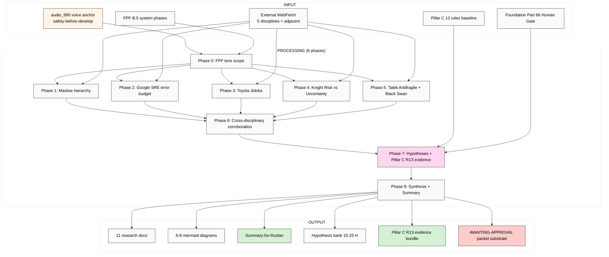

# EXPLAIN — K-5 Safety→Develop Ordering Cross-Disciplinary Validation

> Plan-of-day discipline. Cross-disciplinary corroboration «safety before develop» principle через 5 disciplines (Maslow / SRE / Toyota / Knight / Taleb) → Pillar C extension candidate evidence + AWAITING-APPROVAL packet substrate.

---

## §1 Что есть СЕЙЧАС

### Existing context (cross-link, NOT duplicate):
- ✅ `raw/voice-memos-2026-05-19-batch/audio_690@19-05-2026_04-05-57.md` — safety-before-develop principle voice anchor
- ✅ `reports/voice-pipeline-2026-05-19-batch-5/05-candidates-3-buckets.md` — §3.3 K-5 specification
- ✅ `reports/voice-pipeline-2026-05-19-batch-5/03-9-lenses-cross-analysis.md`
- ✅ Pillar C 12 rules (CLAUDE.md §4.1) — candidate rule 13 «Safety→Develop» analysis

### NEW input:
- Voice anchor audio_690 ¶ safety-before-develop principle
- Need: cross-disciplinary validation evidence + AWAITING-APPROVAL packet substrate

### Strategic cross-refs (READ-ONLY):
- CLAUDE.md Pillar C 12 hard rules
- Foundation v1.0 (Part 6b Human Gate + §I.2 constitutional_never_list)
- `decisions/RUSLAN-ACK-STRATEGIC-LAYER-BUNDLE-5-2026-04-28.md` (Pillar C constitutional pattern)

---

## §2 Что делает этот prompt (one paragraph)

Brigadier (ROY swarm) выполняет **breadth deep research** «safety before develop» principle через **5 cross-disciplinary precedents** + FPF lens FIRST. Output: deep mining 5 disciplines (Maslow «Motivation and Personality» / Google SRE Book error budget + reliability / Toyota Jidoka stop-the-line / Knight «Risk Uncertainty Profit» risk-vs-uncertainty / Taleb «Antifragile» + «Black Swan» fragility-before-growth) + adjacent (NASA safety-first ethos / nuclear plant safety hierarchies / aviation accident discipline) + cross-disciplinary corroboration synthesis (common pattern) + hypothesis bank 15-25 H + Pillar C extension candidate evidence (rule 13 «Safety→Develop» substrate) + AWAITING-APPROVAL packet substrate ready + 6-8 mermaid diagrams. Russian primary + English (FPF + verbatim discipline-specific terminology).

---

## §3 Что берёт на вход

### Primary input:
- audio_690 voice anchor

### Cross-link scope:
- CLAUDE.md Pillar C 12 rules
- Foundation v1.0 Part 6b
- Existing constitutional ack records (Bundle 1-5 RUSLAN-ACK)

### Canonical baselines (READ-ONLY):
- vision/*
- FPF-Spec (B.5 system development phases)
- decisions/JETIX-VISION-FUNDAMENTAL

### External (WebFetch):
- **Abraham Maslow «Motivation and Personality» (1954)** — hierarchy of needs (safety as foundational)
- **Google SRE Book** (Betsy Beyer ed. 2016) + «The Site Reliability Workbook» (2018) — error budget + reliability principle
- **Toyota Production System / Jidoka** — Ohno «Toyota Production System» (1988) + Liker «The Toyota Way» (2003)
- **Frank Knight «Risk, Uncertainty, and Profit» (1921)** — risk vs uncertainty distinction
- **Nassim Taleb «Antifragile» (2012) + «The Black Swan» (2007)** — fragility-before-growth + barbell strategy
- **Adjacent:**
  - NASA safety-first ethos (System Safety Handbook / human spaceflight discipline)
  - Nuclear plant safety hierarchies (defense-in-depth / IAEA principles)
  - Aviation accident investigation (NTSB / ICAO discipline)
  - HRO (High-Reliability Organisations) research (Weick + Sutcliffe)

---

## §4 Что обрабатывает (pipeline / 8 phases)

### Phase 0 — FPF lens scope + IP-1 boundary
Define через FPF: safety-as-state-precondition (U.System; safety = B.5.1 explore-precondition); develop-as-method-tactic (U.MethodDescription); ordering-as-principle (B.5 system development phase invariant). Acceptance predicate.
**Output:** `01-fpf-lens-scope.md` (≤1000w)

### Phase 1 — Maslow hierarchy of needs deep mining
Safety as second-tier needs (physiological + safety before social/esteem/self-actualisation). Verbatim. Adoption + critique.
**Output:** `02-maslow-hierarchy.md` (~2000w)

### Phase 2 — Google SRE error budget + reliability deep mining
SLO/SLI/SLA structure; error budget mechanism; reliability vs feature velocity tradeoff.
**Output:** `03-sre-error-budget.md` (~2000w)

### Phase 3 — Toyota Jidoka deep mining
Stop-the-line discipline; Andon cord; built-in-quality principle.
**Output:** `04-toyota-jidoka.md` (~2000w)

### Phase 4 — Knight Risk vs Uncertainty deep mining
Knight 1921 distinction: risk (probabilistically known) vs uncertainty (probabilities unknown); profit as compensation for bearing uncertainty.
**Output:** `05-knight-risk-uncertainty.md` (~2000w)

### Phase 5 — Taleb Antifragile + Black Swan deep mining
Fragility / robust / antifragile gradient; barbell strategy; via negativa; tail risk first.
**Output:** `06-taleb-antifragile-black-swan.md` (~2000w)

### Phase 6 — Cross-disciplinary corroboration synthesis
Common pattern across all 5 disciplines: «secure base before expansion». Per-discipline verbatim claim → common pattern mapping. Adjacent disciplines (NASA / nuclear / aviation / HRO) bridging analysis.
**Output:** `07-cross-disciplinary-synthesis.md` (~3000w + corroboration matrix)

### Phase 7 — Hypothesis bank 15-25 H + Pillar C extension candidate evidence
H-SD-1 .. H-SD-25. Pillar C rule 13 candidate «Safety→Develop» evidence assembly. AWAITING-APPROVAL packet substrate ready.
**Output:** `08-hypotheses-bank-pillar-c-extension.md` (~2500w)

### Phase 8 — Synthesis + Summary + 6-8 mermaid
**Output:** `98-cross-cutting-synthesis.md` (~2000w) + `99-SUMMARY-FOR-RUSLAN.md` (≤1500w) + `diagrams/01-08-*.md`

---

## §5 Что получим на выходе

### NEW files в `research/safety-develop-validation-2026-05-19/`:

1. `00-MASTER-INDEX.md`
2. `01-fpf-lens-scope.md`
3. `02-maslow-hierarchy.md`
4. `03-sre-error-budget.md`
5. `04-toyota-jidoka.md`
6. `05-knight-risk-uncertainty.md`
7. `06-taleb-antifragile-black-swan.md`
8. `07-cross-disciplinary-synthesis.md`
9. `08-hypotheses-bank-pillar-c-extension.md`
10. `98-cross-cutting-synthesis.md`
11. `99-SUMMARY-FOR-RUSLAN.md`
12-19. `diagrams/01-08-*.md`

### NEW (AWAITING-APPROVAL packet substrate):
- `swarm/awaiting-approval/r13-safety-develop-2026-05-XX.md` (DRAFT — Ruslan ack required для actual packet creation)

### MODIFIED (append-only):
- `reports/phase-0-fpf-scope/01-jetix-objects-inventory.md` §APPEND — O-56 candidate

### NOT-modified:
- ❌ Foundation v1.0 / Pillar C constitutional_never_list / shared/schemas / VISION-FUNDAMENTAL / 8 Octagon LOCK content
- ❌ NO autonomous LOCK promotion (research surface only; Ruslan acks promotion to Pillar C rule 13)

---

## §6 Конкретные шаги

1. Brigadier reads §1 inputs
2. Phase 0 → 8 sequential per-phase commits
3. Final push origin main
4. Ruslan reads Summary + decides if R13 evidence sufficient для AWAITING-APPROVAL packet promotion

---

## §7 К чему ведёт

### Immediate:
- **Cross-disciplinary evidence corroborated** — 5 disciplines confirm «safety before develop» pattern
- **AWAITING-APPROVAL packet substrate** — ready для Ruslan ack as R13 candidate
- **Pillar C extension surface** — evidence bundle for constitutional rule 13 candidate

### Phase 1+ unlock:
- If Ruslan acks R13 promotion → Pillar C count 12 → 13 (foundation_generic)
- Updates к `.claude/config/default-deny-table.yaml` constitutional_never_list
- Cross-link к engineering discipline (СRE adoption pattern для Jetix tooling)

### Phase 2+:
- Constitutional-grade validation для Jetix-built systems
- Engineering culture Workshop curriculum integration
- HRO research integration к Jetix institutional design

### Constitutional:
- Foundation preserved (research surface only; NO autonomous LOCK)
- Breadth NOT selection
- FPF lens FIRST
- IP-1 STRICT — principle abstract; Jetix application = RUSLAN-LAYER

---

## §8 Mermaid схема

---

## §9 Constitutional checklist

- [x] R1 surface-only (research surface; Ruslan acks R13 promotion separately)
- [x] R6 provenance per claim + verbatim discipline quotes
- [x] R11 Default-Deny
- [x] R12 anti-extraction check
- [x] IP-1 — Safety→Develop principle abstract; Jetix application = RUSLAN-LAYER
- [x] EP-5 F-grade disclosed
- [x] Append-only
- [x] FPF lens FIRST
- [x] Breadth NOT selection
- [x] Word budgets

---

## §10 Risk surface

| Risk | Mitigation |
|---|---|
| **Discipline misreading** (e.g. Taleb politically loaded) | Verbatim quote + retrieved_date per claim; cross-validate с peer-reviewed sources |
| **Universalism trap** (safety→develop = always optimal?) | Phase 6 includes counter-cases (where develop-first applies; e.g. crisis innovation) |
| **R13 promotion premature** | Research SURFACE only; Ruslan acks promotion separately в AWAITING-APPROVAL packet |
| **Selection slip** (one discipline favoured) | Phase 6 enforces all 5 disciplines equally |
| **Cost overrun** | Halt at €2.50 |

---

## §11 Что НЕ делает (anti-list)

- ❌ Autonomous LOCK promotion (R1 + R2 STRICT)
- ❌ Create actual AWAITING-APPROVAL packet (only substrate; Ruslan acks for actual packet)
- ❌ Modify Pillar C constitutional_never_list
- ❌ Touch Foundation / shared/schemas / VISION-FUNDAMENTAL / 8 Octagon LOCK content
- ❌ Cherry-pick pro-«safety-first» sources (Phase 6 includes counter-cases)
- ❌ Universalism overreach (Phase 6 + counter-cases mandatory)
- ❌ Generate strategic prose без voice anchor
- ❌ Pause за подтверждениями

---

*Cloud Cowork explanation document для K-5 Safety→Develop Cross-Disciplinary Validation. AWAITING-RUSLAN-LAUNCH через `_LAUNCH-5-K-RESEARCH-2026-05-19.md`. Parallel-safe с K-1/K-2/K-3/K-4.*
