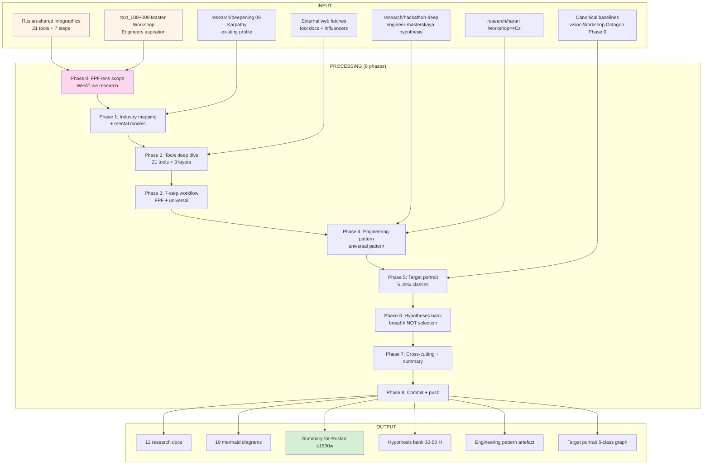

# EXPLAIN — ML/AI engineers deep research через призму Jetix

> Plan-of-day discipline per `feedback_prompt_explanation_required.md`. Ruslan reviews ДО launch.

---

## §1 Что есть СЕЙЧАС

### Existing research streams (cross-link, NOT duplicate):
- ✅ `research/deepening-2026-05-18/09-people-karpathy-eureka-llm101n.md` — Karpathy single-person profile (Eureka Labs / LLM101n / LLM Wiki lineage). **Сохраняем как baseline; этот run extends к industry-wide breadth.**
- ✅ `research/deepening-2026-05-18/12-cross-domain-fpf-aerospace.md` — NASA SE 15/17 processes mapped к FPF. **Cross-applicable pattern.**
- ✅ `research/hackathon-deep-2026-05-18/` — 4 hypotheses (bloggers cohort / sponsor / self-bootstrap / engineer-masterskaya). **Engineer-masterskaya hypothesis = direct link.**
- ✅ `research/harari-jetix-lens-2026-05-18/` — Workshop = 4 Cs school positioning.
- ✅ `research/adjacent-ideas-2026-05-17/` — 10 cluster docs (universal language / intelligence amplification).
- ✅ `raw/voice-memos-2026-05-17-batch/text_008+009@2026-05-18_evening.md` — Master Workshop of Engineers = primary aspiration (text_009 Thread 14).

### NEW input (этот run):
- 2 Ruslan-shared infographics 2026-05-18 evening (saved as content references в prompt §0.1):
  - **Image 1 «Стек в ML» (3 layers):**
    - L1 База: Python / Math / NumPy / pandas / matplotlib / Polars
    - L2 Разработка ML: Jupyter / scikit-learn / PyTorch / HuggingFace / CatBoost / XGBoost / LightGBM / Optuna
    - L3 Продуктовая: Docker / Airflow / PySpark / W&B / MLflow / Grafana / FastAPI / Git / GitHub / GitLab / Kubernetes
  - **Image 2 «Чем занимается ML-инженер» (7 steps):**
    1. Постановка задачи + metrics + общение с заказчиком
    2. Сбор данных + аналитика + выборка + валидация
    3. Обучение модели (baseline → advanced)
    4. Улучшение качества + гипотезы + feature generation
    5. Тестирование + A/B tests
    6. Развертывание модели
    7. Дообучение + поддержка + improvements

### Strategic cross-refs (existing canonical context):
- vision/00-MASTER + companions 01-09
- vision/03 (Workshop) + vision/04 (First Clan) + vision/08 (L1 collaboration)
- text_008-009 «Master Workshop of Engineers до достичь» + «3000 миллиардеров / разработчиков / инженеров / платформ»
- 8 Octagon LOCKs (H1-H8) — especially H6 Gamified Platform + H7 People-NS + H8 Trust
- decisions/strategic/JETIX-ETHEREUM-ARCHITECTURE — ML/AI engineers как builders на Ethereum

---

## §2 Что делает этот prompt (one paragraph)

Brigadier (ROY swarm) выполняет **breadth deep research** по ML/AI engineering industry через **FPF lens FIRST** (per `feedback_fpf_lens_first.md` — scope definition ДО research). Output: industry mapping (mental models / culture / influencers) + per-tool deep dive (21 tools из image 1 — each: что делает / mental model / when to use / Jetix applicability) + 7-step workflow analysis (image 2; каждый step через FPF + Jetix-universal-pattern overlay) + engineering approach как **universal pattern** для решения любых information-processing задач (не только ML) + target portrait через Jetix lens (worker / partner / hackathon participant / mentor / customer) + hypotheses bank (breadth NOT selection per `feedback_breadth_not_selection.md`) + 10+ mermaid diagrams. Plain English + FPF formal dual versions для каждого document.

---

## §3 Что берёт на вход

### Primary input:
- Ruslan-shared infographics content (encoded in prompt §0.1 — 21 tools + 7 workflow steps)
- text_008@2026-05-18_evening.md + text_009@2026-05-18_evening.md (Master Workshop Engineers aspiration anchor)

### Cross-link scope (existing research — NOT re-do):
- research/deepening-2026-05-18/09-people-karpathy-eureka-llm101n.md (extend, NOT duplicate)
- research/deepening-2026-05-18/12-cross-domain-fpf-aerospace.md (NASA SE pattern для engineering universality)
- research/deepening-2026-05-18/05-success-alexander-cunningham-karpathy-lineage.md (Pattern Language для teaching ML)
- research/hackathon-deep-2026-05-18/* (engineer-masterskaya hypothesis)
- research/harari-jetix-lens-2026-05-18/* (Workshop = 4 Cs school)

### Canonical baselines (read-only context):
- vision/* (especially 03 Workshop, 04 Clan, 08 L1 collaboration)
- reports/phase-0-fpf-scope/00-JETIX-FPF-MASTER (14 objects context)
- decisions/JETIX-WORKSHOP-CONCEPT-2026-04-30 (Workshop = master of information processing)
- decisions/STRATEGIC-INSIGHT-* (especially H6 Gamified + H7 People-NS + H8 Trust)
- raw/external/ailev-FPF/FPF-Spec.md (FPF primitives)

### External (WebFetch / WebSearch budget allocated):
- Tool documentation per per-tool deep dive (21 tools)
- ML/AI influencer profiles (Goodfellow / LeCun / Bengio / Hinton / Ng / Sutskever / Sutton / Schmidhuber + Russian-language: Котенков / Voronova / Lapan если applicable)
- Mental model frameworks (Karpathy «Software 2.0», LeCun «World Models», Sutton «Bitter Lesson»)
- Kaggle / NeurIPS / ICML / ArXiv community structure
- ML engineer career paths + salary maps (PII-free)

---

## §4 Что обрабатывает (pipeline / шаги)

### Phase 0 — FPF lens scope (per `feedback_fpf_lens_first.md`)

ДО research — define ЧТО research'им через FPF:
- **Industry-as-object** (U.System holonic) OR **role-as-object** (U.Role A.2) OR **methodology-as-object** (U.MethodDescription) OR **tools-as-objects** (multiple U.System) — все 4 different scopes
- **FPF layer:** B.5.1 explore (industry mapping) / A.2 Role taxonomy (engineer-as-role) / U.MethodDescription (ML methodology) / A.15 Work (per-tool workflow)
- **Сравнение scale-match:** ML engineering methodology × Jetix Workshop methodology (both U.MethodDescription) / ML role × Jetix Engineer role (A.2 type-level)
- **Acceptance predicate:** refuted_if_(industry mapping miss core role / per-tool analysis miss Jetix-applicability / engineering-as-universal claim не testable)

Output: `01-fpf-lens-scope.md` (≤1000w)

### Phase 1 — Industry mapping + mental models

ML/AI engineering industry through FPF:
- **Role taxonomy A.2:** ML engineer / ML researcher / data scientist / MLOps engineer / data engineer — differences + overlaps
- **Mental models** (key thinkers): Karpathy «Software 2.0» / LeCun «World Models» / Sutton «Bitter Lesson» / Goodfellow «GANs» / Schmidhuber «Compression» / Ng «AI for Everyone»
- **Culture touchpoints:** Kaggle / ArXiv / GitHub / Twitter-X / Hugging Face hub / Papers with Code
- **Conferences:** NeurIPS / ICML / ICLR / CVPR / EMNLP / AAAI
- **Career paths:** PhD route / bootcamp route / self-taught route / industry-veteran route
- **Russian-speaking landscape:** ШАД (Yandex) / ODS / RSWeek / DataFest / ML-community telegram channels

Output: `02-industry-mapping-mental-models.md` (≤2000w)

### Phase 2 — Tools deep dive (21 tools per image 1)

**Per-tool template** (≤500w each):
- Что делает (plain Russian)
- Mental model behind it
- When to use / when NOT to use
- FPF primitive mapping (которую primitive это операционализирует)
- Jetix applicability (как Jetix может использовать NOW + Phase 2+)
- Mermaid mini-diagram (где flow ясен)

**3 layer docs:**
- `03-tools-layer-1-foundation.md` — Python / Math / NumPy / pandas / matplotlib / Polars (6 tools)
- `04-tools-layer-2-ml-dev.md` — Jupyter / scikit-learn / PyTorch / HuggingFace / CatBoost / XGBoost / LightGBM / Optuna (8 tools)
- `05-tools-layer-3-production.md` — Docker / Airflow / PySpark / W&B / MLflow / Grafana / FastAPI / Git / GitHub / GitLab / Kubernetes (11 tools)

Word budget: ~3000w each layer doc.

### Phase 3 — 7-step workflow analysis (image 2)

Per-step analysis (≤700w each):
- ML engineer activity description
- FPF primitive mapping (per step → which FPF primitive)
- **Jetix-universal-pattern overlay** — как этот step применяется к ЛЮБОЙ information-processing задаче (не только ML)
- Cross-link к existing Jetix artefacts (Workshop curriculum / Phase 0 inventory / vision/* / hackathon-deep)
- Mermaid step flow diagram

Output: `06-workflow-7-steps.md` (~5000w; 7 steps × 700w + mermaid)

### Phase 4 — Engineering approach как universal pattern

Core thesis: ML engineering methodology = **specific instance of universal information-processing pattern**. Generalize:
- Pattern shape: задача → данные → модель → improve → test → deploy → maintain
- Universal applicable к: any business problem / personal life optimization / Jetix project (любой) / hackathon problem-solving
- Cross-precedent triangulation:
  - NASA SE (research-deepening direction 12) — 7-step matches 15/17 NASA processes
  - TPS (research-deepening direction 14) — Hansei + Kaizen rituals
  - Engelbart H-LAM/T (research-deepening direction 4) — augmentation framework
  - FPF Workshop pattern — master apprenticeship
- **«Approach к проектам по Jetix» = Engineering approach universalised** — Ruslan personal toolkit + Jetix institutional pattern
- IP-1 caveat: pattern = abstract method (U.MethodDescription); instances = bound к executors (RUSLAN-LAYER)

Output: `07-engineering-approach-universal-pattern.md` (~3000w + mermaid pattern flow)

### Phase 5 — Target portrait + Jetix integration

ML/AI engineer как 5 potential Jetix-relationship classes:

| Class | Pattern | Activation mode | Outreach script element |
|---|---|---|---|
| **Worker / employee** | Workshop apprenticeship + hackathon performer | Phase 1 (Master Workshop bootstrap) | «Jetix Workshop = best ML/AI engineering practice + FPF + autonomy» |
| **Partner / co-founder** | L1 collaboration model (Workshop activation) | Phase 1 critical path | «Jetix vision + ML-engineering substrate + 100× scope» |
| **Hackathon participant** | Clan-wars hackathon multi-rhythm (день/месяц/год) | Phase 1 first events | «Jetix hackathon platform + connect + tools + AI-agents + 2-hour-to-project» |
| **Hackathon mentor** | Engineering-expert × integrator (ROY swarm pattern) | Phase 1-2 | «Mentor cohort; gratitude loop + influence» |
| **Customer (ML services)** | quick-money P1 project | Active (Phase 1) | «AI consulting Jetix-stack: FPF + Workshop + Best practices» |

Plus:
- Karpathy specifically (existing profile direction 09)
- Musk / Anthropic / OpenAI / Google DeepMind / xAI — corporate-level partners
- Russian-speaking ML community (ШАД / ODS / Yandex / Sber / VK)

Output: `08-target-portrait-jetix-integration.md` (~2500w + mermaid relationship graph)

### Phase 6 — Hypotheses bank (breadth NOT selection)

Per `feedback_breadth_not_selection.md` — на стадии research все Q = гипотезы для тестирования, НЕ decisions для ack. List all surfaced hypotheses:

**Format:** ID / claim / F-grade / test design / acceptance / refutation_conditions / cross-ref

Expected H-ML-1 .. H-ML-N (~30-50 hypotheses):
- H-ML-1: «ML engineers under-served by current education» — testable via Karpathy LLM101n adoption (>36K stars)
- H-ML-2: «Jetix Workshop = ML engineer career destination» — testable via cohort interviews
- H-ML-3: «FPF accelerates ML engineer onboarding 5×» — testable benchmark
- H-ML-4: «Hackathon mode optimal для ML talent surfacing» — testable via first event
- ...
- H-ML-N: ...

Output: `09-hypotheses-bank-breadth.md` (~3000w + cross-ref table)

### Phase 7 — Cross-cutting synthesis + Summary

- `98-cross-cutting-synthesis.md` (~2000w) — 9-12 patterns cross-section всех phases; cross-link к existing research streams; integration с text_008-009 hackathon model
- `99-SUMMARY-FOR-RUSLAN.md` (~1500w) — TL;DR + top-10 actionable insights + reading order + open questions

Plus diagrams:
- `diagrams/01-ml-stack-3-layers.md` — image 1 reproduced как mermaid (3 layers, 21 tools)
- `diagrams/02-ml-workflow-7-steps.md` — image 2 reproduced как mermaid
- `diagrams/03-fpf-mapping-per-tool.md` — 21 tools × FPF primitives
- `diagrams/04-engineering-pattern-universal.md` — universal pattern flow
- `diagrams/05-ml-engineer-jetix-relationship-classes.md` — 5 classes graph
- `diagrams/06-mental-models-influencers.md` — key thinkers mapping
- `diagrams/07-cross-stream-integration.md` — этот research × text_008-009 × research-deepening × hackathon-deep × harari
- `diagrams/08-hypothesis-test-design.md` — 30-50 H bank visualisation
- `diagrams/09-jetix-vs-ml-industry-positioning.md` — Workshop / Hackathon / Education positioning
- `diagrams/10-master-tldr-mermaid.md` — full research at-a-glance

### Phase 8 — Commit + push

Per-phase commits + final `git push origin main`.

---

## §5 Что получим на выходе (Ruslan reviews this list)

### NEW files в `research/ml-ai-engineers-2026-05-18/`:

1. `00-MASTER-INDEX.md`
2. `01-fpf-lens-scope.md` (FPF lens FIRST discipline output)
3. `02-industry-mapping-mental-models.md`
4. `03-tools-layer-1-foundation.md` (6 tools)
5. `04-tools-layer-2-ml-dev.md` (8 tools)
6. `05-tools-layer-3-production.md` (11 tools)
7. `06-workflow-7-steps.md`
8. `07-engineering-approach-universal-pattern.md`
9. `08-target-portrait-jetix-integration.md`
10. `09-hypotheses-bank-breadth.md` (30-50 H)
11. `98-cross-cutting-synthesis.md`
12. `99-SUMMARY-FOR-RUSLAN.md`
13-22. `diagrams/01-10-*.md` (10 mermaid diagrams)

### MODIFIED (append-only):

- `reports/phase-0-fpf-scope/01-jetix-objects-inventory.md` §APPEND — possible O-29 candidate «ML/AI engineering substrate»
- `wiki/log.md` append + index update

### NOT-modified (constitutional preservation):

- ❌ Foundation v1.0 / Pillar C / shared/schemas / VISION-FUNDAMENTAL
- ❌ 8 Octagon LOCK files content
- ❌ Existing canonical strategic docs (cross-link только)

---

## §6 Конкретные шаги

1. **Cloud Cowork pre-launch** (done by me before Ruslan reads this):
   - ✅ Save this _EXPLAIN file
   - ✅ Write deep prompt file
   - ✅ git commit + push
   - ✅ Notion sub-page

2. **Ruslan reviews this _EXPLAIN** (~5-10 min): output OK? scope OK?

3. **Ruslan ack** → даёт мне ack → я даю launch command для server (короткий)

4. **Ruslan launches на server** (parallel с batch-3 если ещё бежит)

5. **Post-run:** я git pull → читаю 99-SUMMARY → surface'аю Ruslan top-10 insights + open questions

---

## §7 К чему ведёт

### Immediate:
- **Industry expertise asset** — Jetix имеет comprehensive understanding ML/AI industry (positioning + outreach scripts ready)
- **Tool literacy** — Ruslan + Jetix swarm видит per-tool applicability в Jetix workflow
- **Universal pattern artefact** — engineering approach formalised как methodology для любых проектов (cross-link Jetix Recursive Engine concept)

### Phase 1 unlock:
- Master Workshop of Engineers outreach **substance ready** — pitch script + curriculum hooks + tooling roadmap
- Hackathon platform Phase 1 first event **scope ready** — ML hackathon = primary first cohort hypothesis ready to test
- Karpathy / Musk / Anthropic outreach **augmented** — substantive industry-language frame

### Phase 2+:
- Workshop curriculum «ML engineering through FPF» candidate (Education layer concept doc cross-link)
- Jetix-stack offering для ML consulting (quick-money P1 product hypothesis)
- ML influencer L2 cohort identification

### Constitutional:
- Foundation / Pillar C / Octagon LOCKs **preserved** (read-only research)
- All hypotheses breadth (not selection)
- FPF lens FIRST applied throughout

---

## §8 Mermaid схема (visual flow)

---

## §9 Constitutional checklist

- [x] R1 surface-only: research run, no autonomous strategic prose
- [x] R6 provenance per claim
- [x] R11 Default-Deny novel actions
- [x] EP-5 F-grade disclosed (F2-F3 surface for hypotheses)
- [x] Append-only (new namespace + 1 §APPEND к Phase 0 inventory)
- [x] Foundation/Pillar C/Octagon LOCK content preserved (read-only)
- [x] FPF lens FIRST in Phase 0 (per `feedback_fpf_lens_first.md`)
- [x] Breadth NOT selection (per `feedback_breadth_not_selection.md`) — все hypotheses surfaced for testing
- [x] AP-6 dissent preservation (если cells disagree)
- [x] Word budgets enforced

---

## §10 Risk surface

| Risk | Mitigation |
|---|---|
| **Scope creep** (21 tools × deep = много) | Per-tool budget ≤500w; per-layer budget ~3000w; phase boundaries enforce |
| **Selection slip** (hypotheses turn into recommendations) | Phase 6 enforces breadth-NOT-selection format with F-grade + refutation per H |
| **Ipsen drift** (Karpathy-centric vs industry-breadth) | Phase 1 explicitly maps role taxonomy + 5+ mental models; Karpathy = one anchor among many |
| **Tool docs out-of-date** (WebFetch fails) | Cross-validate с multiple sources; flag stale-date in any single-source tool |
| **External cost overrun** | Halt при cost >€5; WebFetch budget cap |

---

## §11 Что НЕ делает (anti-list)

- ❌ НЕ promote any hypothesis к LOCK
- ❌ НЕ commit specific ML tooling choice для Jetix
- ❌ НЕ contact ML influencers
- ❌ НЕ touch Foundation / Pillar C / Schemas / VISION-FUNDAMENTAL
- ❌ НЕ overwrite existing canonical
- ❌ НЕ duplicate research-deepening direction 09 (Karpathy) — extend, cross-link
- ❌ НЕ generate strategic decisions без Ruslan voice anchor

---

*Cloud Cowork explanation document для ML/AI engineers deep research run. AWAITING-RUSLAN-ACK ДО launch. Parallel с batch-3 OK (different namespace).*
