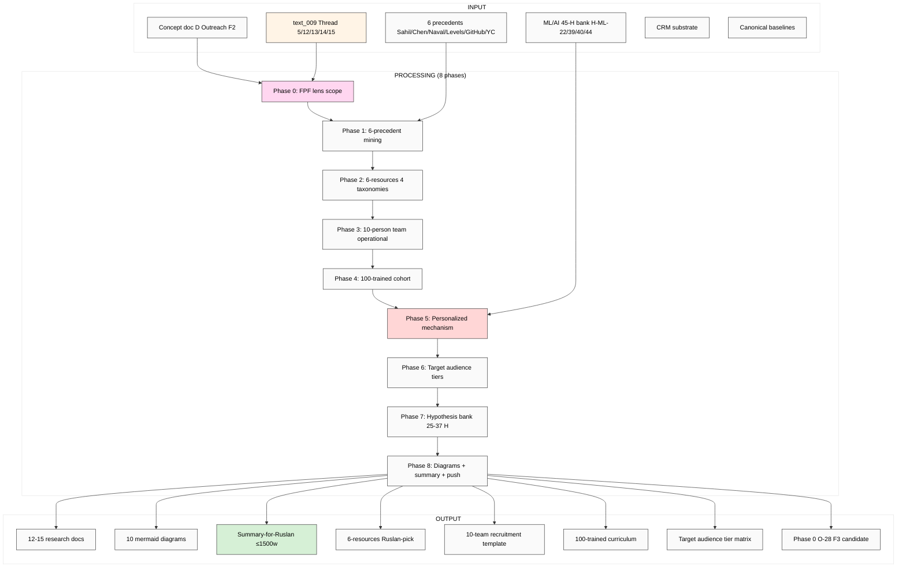

# EXPLAIN — Outreach System Scalable Deep Research

> Sibling к Master Picture §2 / §6 (cross-research integration). Promote concept doc D (acked F2) к F3+ через 6-precedent deep mining + 6-resources operationalisation + 10-team + 100-trained + personalized mechanism formalisation.

> **R12 anti-extraction foregrounded.** Outreach = highest extraction risk surface; per-stage R12 check explicit.

---

## §1 Что есть СЕЙЧАС

**Acked baseline:**
- `decisions/strategic/JETIX-OUTREACH-SYSTEM-SCALABLE-2026-05-18.md` (F2 surface; Ruslan acked 18.05 evening; 6-resources taxonomy OPEN; outreach script semantics OPEN)
- `vision/11-outreach-system-scalable.md` (Plain English + FPF formal companion)

**Research foundation (DONE):**
- `research/ml-ai-engineers-2026-05-18/09-hypotheses-bank-breadth.md` (45 H — H-ML-22/39/40/44 applicable: Sovereign-AI offer / Karpathy outreach / RU L2 community / RU community hackathon)
- `research/deepening-2026-05-18/14-tacit-explicit-tps-mechanism.md` (TPS mentor-pairing pattern для 100-trained cohort)
- `research/deepening-2026-05-18/05-success-alexander-cunningham-karpathy-lineage.md` (Pattern Language — outreach scripts как patterns)
- `research/hackathon-deep-2026-05-18/*` (bloggers cohort outreach mechanism)

**Voice anchor:**
- text_008 (meta + 100× multiplier + «откинь все свои проекты, считай Jetix»)
- text_009 Thread 5 (10-person team → 100 trained → personalized) + Thread 12 (L1 «снежный ком» exponential) + Thread 13 (operationalization «чтобы не я это делал») + Thread 14 (Master Workshop «не ступеньки ниже») + Thread 15 (target audience taxonomy)

**Strategic Q open:**
- 6-resources taxonomy: какая из 4 candidate lists (concept doc D §4)? Ruslan picks.
- Outreach script semantics: «откинь все свои проекты, считай Jetix» = urgency multiplier OR literal filter criterion? Ruslan picks.

**NOT yet existing:** 6-precedent deep cross-mining (Sahil / Andrew Chen / Naval / Pieter Levels / GitHub DevRel / YC) + 6-resources framework operationalisation (4 candidate taxonomies surfaced) + 10-person video team deep operationalisation (5 role-types × spec) + 100-trained cohort deep operationalisation (4-tier training + dispatch + quality control) + personalized outreach mechanism (LLM-assist + human craft hybrid spec) + target audience tier prioritisation matrix + first hackathon recruitment script template + 25-35 H bank + 8+ mermaid diagrams.

---

## §2 Что делает (one paragraph)

Brigadier (ROY swarm) выполняет **breadth deep research** по Outreach System Scalable concept через **FPF lens FIRST** (Phase 0). Output: 6-precedent deep mining (Sahil Lavingia Gumroad solo / Andrew Chen a16z network playbook / Naval Ravikant asymmetric leverage / Pieter Levels NomadList build-in-public / GitHub DevRel community / Y Combinator outreach mechanism) + 6-resources framework 4 candidate taxonomies surface + 10-person video team operationalisation (5 role-types × deep spec; recruitment pipeline; 60-day Gantt) + 100-trained cohort operationalisation (4-tier training curriculum + dispatch mechanism + quality control; 12-month Gantt) + personalized outreach mechanism (LLM-assist + human craft hybrid; R12 anti-extraction discipline per stage; cross-fertilise ML/AI 45-H bank H-ML-22/39/40/44) + 6 target audience classes × tier prioritisation matrix (L1 / Master Workshop / миллиардеры / миллионеры / разрабы / платформы) + 25-37 H bank + 10 mermaid diagrams + Phase 0 §APPEND O-28 to F3 candidate.

---

## §3 Что берёт на вход

**Primary inputs:**
- Concept doc D `JETIX-OUTREACH-SYSTEM-SCALABLE-2026-05-18.md` (full read)
- `vision/11-outreach-system-scalable.md` (companion)
- text_008 + text_009 Thread 5/12/13/14/15 (voice anchors)
- `research/ml-ai-engineers-2026-05-18/09-hypotheses-bank-breadth.md` (45 H cross-fertilise)
- `research/deepening-2026-05-18/14-tacit-explicit-tps-mechanism.md` (TPS pattern)

**Canonical baselines (READ-ONLY):**
- `decisions/JETIX-FIRST-CLAN-CHARTER-2026-05-12.md` (clan recruitment)
- `decisions/JETIX-WORKSHOP-CONCEPT-2026-04-30.md` (Workshop apprenticeship)
- `decisions/STRATEGIC-INSIGHT-JETIX-AS-PEOPLE-NETWORK-STATE-2026-05-12.md` (H7 LOCKED)
- `decisions/STRATEGIC-INSIGHT-JETIX-TRUST-INFRASTRUCTURE-2026-05-17.md` (H8 LOCKED)
- `vision/08-l1-collaboration-roadmap.md` (L1 priority)
- `crm/README.md` + `crm/PLAN.md` + `crm/_schema/strategy-hooks.yaml` (CRM substrate)
- `reports/phase-0-fpf-scope/00-JETIX-FPF-MASTER-2026-05-17.md` (FPF lens baseline)

**External (WebFetch budget):**
- Sahil Lavingia blog / Gumroad public history / «Minimalist Entrepreneur» framework
- Andrew Chen blog «Cold Start Problem» / a16z network effects content
- Naval Ravikant blog/tweets «How to Get Rich» / AngelList founding patterns
- Pieter Levels «Make Book» / NomadList community / indie-hackers profile
- GitHub DevRel team practices / Octoverse reports
- Y Combinator playbook / Paul Graham essays / Sam Altman blog (YC era)
- Reach.io / Outreach.io product docs (sales pipeline patterns reference)
- RU L2 telegram community profiles (Котенков / Лапань / Voronova если applicable)

---

## §4 Pipeline (8 phases)

### Phase 0 — FPF lens scope
Define через FPF: **Outreach-as-system** (U.System) OR **Outreach-as-method** (U.MethodDescription) OR **Outreach-as-cohort-mechanism** (A.2 Role + U.SpeechAct) OR **Outreach-as-process** (A.16 Work-as-process). Surface ALL 4.

Output: `01-fpf-lens-scope.md` (≤1000w)

### Phase 1 — 6-precedent deep mining
Per precedent (≤700w): Sahil / Chen / Naval / Levels / GitHub DevRel / YC.

Output: `02-cross-precedent-deep-6.md` (~4000w)

### Phase 2 — 6-resources framework
4 candidate taxonomies surface (concept doc D §4); 3-resource baseline (Information + Team + Time per text_009 ¶3 verbatim).

Output: `03-6-resources-framework.md` (~2500w)

### Phase 3 — 10-person video team operationalised
5 role-types × deep spec (video producer / copywriter / on-screen talent / researcher / CRM operator) + recruitment + 60-day Gantt.

Output: `04-10-person-video-team.md` (~3500w)

### Phase 4 — 100-trained cohort operationalised
4-tier training curriculum + dispatch mechanism + quality control + 12-month Gantt + R12 enforcement.

Output: `05-100-trained-cohort.md` (~3500w)

### Phase 5 — Personalized outreach mechanism
LLM-assist + human craft hybrid; R12 anti-extraction per stage; cross-fertilise ML/AI 45-H bank.

Output: `06-personalized-outreach-mechanism.md` (~3500w)

### Phase 6 — Target audience taxonomy + tier prioritisation
6 classes × tier prioritisation matrix (L1 / Master Workshop / миллиардеры / миллионеры / разрабы / платформы).

Output: `07-target-audience-taxonomy.md` (~3500w)

### Phase 7 — Hypothesis bank (25-37 H)
6 categories: recruitment / 6-resources / training / personalization / target audience / cross-precedent.

Output: `08-hypotheses-bank-breadth.md` (~3500w)

### Phase 8 — Cross-cutting + Summary + diagrams
- `98-cross-cutting-synthesis.md` (~2000w)
- `99-SUMMARY-FOR-RUSLAN.md` (≤1500w)
- `diagrams/` (10 mermaid)
- Phase 0 §APPEND O-28 → F3 candidate

Per-phase commits + final push.

---

## §5 Что получим на выходе (Ruslan reviews)

**~12-15 NEW files:**
- 9 research docs (01-08 + 98 + 99)
- 10+ mermaid diagrams in `diagrams/`
- Phase 0 O-28 §APPEND промоция к F3 candidate

**NOT-modified (constitutional preservation):**
- Foundation v1.0 / Pillar C 12 rules / 8 Octagon LOCK content / shared/schemas / VISION-FUNDAMENTAL
- Existing canonical concept docs (cross-link only)
- CRM live records (cross-reference only; voice-pipeline DRAFT discipline preserved)

---

## §6 Конкретные шаги

1. ✅ Cloud Cowork pre-launch (this file + prompt + push via meta-run)
2. Ruslan reviews this _EXPLAIN (5-10 min)
3. Ruslan ack → launch on server (via `_LAUNCH-5-DEEP-RESEARCH-2026-05-18.md` Run 4 block)
4. 8 phases execute (~120-180 min)
5. Cloud Cowork pulls → reads 99-SUMMARY → surface к Ruslan

---

## §7 К чему ведёт

### Immediate:
- **Concept doc D → F3 promotion candidate** (6-precedent triangulation + 4 operational specifications)
- **6-resources framework taxonomy decided** (Ruslan picks among 4 candidates)
- **10-team recruitment script template** ready
- **100-trained training curriculum** specified
- **Personalized outreach mechanism** operational (LLM-assist + human craft)
- **6 target audience classes × tier prioritisation** actionable

### Phase 1 unlock:
- 10-person video team **recruitment activation** (Q3 2026 60-day)
- L1 outreach (Karpathy / Musk / Anthropic) **substance ready** (deep research backed)
- First hackathon recruitment **substrate ready** (Tier 3 cross-link)
- RU L2 community outreach **mechanism operational** (Sovereign-AI hypothesis H-ML-22)

### Phase 2+:
- 100-trained cohort **activation** (Q4 2026)
- Personalized scale к 3000+ targets (Q1 2027)
- System Merger Protocol B2B outreach (cross-link Concept doc C)

### Constitutional:
- Foundation / Pillar C / Octagon LOCKs **preserved** (read-only)
- All hypotheses breadth (not selection)
- R12 anti-extraction discipline per stage
- FPF lens FIRST applied throughout

---

## §8 Mermaid схема (visual flow)

---

## §9 Constitutional checklist

R1 + R6 + R11 + **R12 anti-extraction (CRITICAL)** + EP-5 + breadth-NOT-selection + FPF-lens-FIRST + append-only ✓

R12 anti-extraction discipline foregrounded:
- Per-stage R12 check explicit
- Data minimisation в personalization
- Opt-out respected (permanent suppression list)
- Fork-and-leave preserved (cohort exit без penalty)
- Mondragón ratio compensation cap для operators

---

## §10 Что НЕ делает (anti-list)

❌ Send any outreach (Ruslan personal action)
❌ Contact L1 / Master Workshop / миллиардеры / external persons
❌ Promote concept doc D к LOCK
❌ Pick 6-resources taxonomy (surface 4 candidates only)
❌ Touch CRM live records (voice-pipeline DRAFT discipline preserved)
❌ Touch Foundation / Pillar C / Schemas / VISION-FUNDAMENTAL
❌ Strategic prose без voice anchor (R1)
❌ Aggressive close / paternalism / extraction language (R12)

---

*Cloud Cowork explanation document. AWAITING-RUSLAN-ACK ДО launch. Parallel-safe.*
