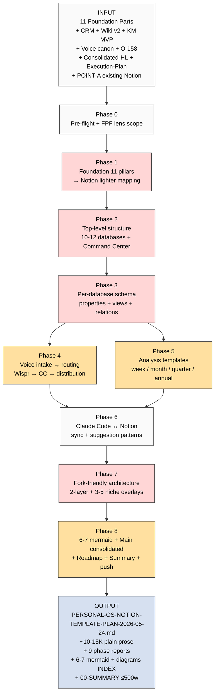

# 📋 EXPLAIN — Personal OS Notion Template Design Plan

> **Цель:** ты читаешь ДО launch'a. Знаешь что внутри / что получим / куда продвигает. Per memory rule «каждый server CC prompt = сначала explanation, потом launch».

---

## §1 Что у нас СЕЙЧАС

### Substrate complete (после сегодняшних 2 launches)

- ✅ **CONSOLIDATED-HUMAN-LANGUAGE-PLAN** (2716w plain prose / 11 sections / 5 mermaid)
- ✅ **EXECUTION-PLAN-FIXATION** (4188w / 11 sections / 6 mermaid — что Ruslan делает сам, 2 направления, 4 типа партнёров)
- ✅ **Foundation v1.0 LOCKED** (11 Parts F5 architecture) — basis для lighter Notion version
- ✅ **O-158 Notion-MVP-bypass pattern** (Tier A wiki) — операционный принцип «лёгкий Notion + Claude Code»
- ✅ **CRM system** (multi-purpose contacts / 24 roles / 13 statuses / voice integration)
- ✅ **Wiki Architecture v2** (9 entity types / niches / per-agent memory layers)
- ✅ **KM MVP design records** (4 project types + Stage Gates + de-morph/promote/archive)
- ✅ **Voice pipeline canon** (Wispr Flow → CC → routing)
- ✅ **Plan-Mode Plan C** (Notion templates section)
- ✅ **POINT-A current state** (existing Notion structure inventory)

### Что НЕТ пока

- ❌ **Universal Personal OS Notion template** design plan — celebrated fork-friendly + Foundation lighter + voice-first + Claude Code integration
- ❌ Per-database schema design (properties + views + relations)
- ❌ Voice → distribution routing schema
- ❌ Analysis templates (weekly / monthly / quarterly / annual review)
- ❌ Fork-friendly architecture (universal Foundation layer + niche overlay)
- ❌ Implementation roadmap (что сначала / что потом)

---

## §2 Что делает prompt (one-liner)

Берёт всё substrate (Foundation 11 pillars + CRM + Wiki + KM MVP + Voice canon + Consolidated-HL + Execution-Plan) → проектирует **universal Personal OS Notion template** который:
- **Облегчённая версия** Foundation 11 pillars для повседневной personal usage
- **Fork-friendly** — любой человек может duplicate + кастомизировать под свою нишу за 30-60 min
- **Voice-first** — Wispr Flow / voice memo → CC → distributed entries automatically
- **Claude Code integration** — CC reads / suggests / processes Notion content (sync pattern)
- **Reviews built-in** — weekly / monthly / quarterly / annual analysis templates
- **Hypothesis tracking** — «что хочу узнать» → research / verify / consolidate cycle
- **Plain-language, без jargon, conversational**

Результат = **PLAN (design doc)**, не сам template. Implementation = potом manual или separate prompt.

---

## §3 Что берёт на вход

| Источник | Зачем |
|---|---|
| 11 Foundation Parts `swarm/wiki/foundations/part-1..11/architecture.md` | Lighter mapping basis — каждый Pillar → Notion analog |
| `swarm/wiki/foundations/principles/architecture.md` (Pillar C Tier 2) | 12 constitutional rules → Notion guardrails layer |
| `swarm/wiki/concepts/notion-mvp-bypass-pattern.md` (O-158 Tier A) | Operational principle для «лёгкий Notion + CC» |
| `crm/README.md` + `crm/PLAN.md` | CRM template structure (people + orgs / 24 roles / 13 statuses / voice draft pattern) |
| `swarm/wiki/operations/voice-pipeline-canonical-2026-05-10.md` | Voice → CC → routing canon |
| KM MVP design records `swarm/wiki/designs/T-km-materialization-mvp-2026-04-24/` | Project taxonomy (4 types) + Stage Gates + lifecycle |
| `decisions/strategic/PLAN-MODE-DOCS-VIDEO-NOTION-2026-05-24.md` Plan C | Plan C Notion section synthesis |
| `decisions/strategic/POINT-A-CURRENT-STATE-2026-05-23.md` | Existing Notion structure inventory (Command Center / Daily Log / Projects DB / etc.) |
| `decisions/strategic/CONSOLIDATED-HUMAN-LANGUAGE-PLAN-2026-05-24.md` (just closed) | Plain-language style + 7 принципов + 7 ступеней content basis |
| `decisions/strategic/EXECUTION-PLAN-FIXATION-2026-05-24.md` (just closed) | Что в Ruslan-solo scope (5 templates trigger order) |
| `decisions/strategic/RUSLAN-NOTES-EDUCATION-PARADIGM-2026-05-24.md` | O-176..O-185 — что обучаем + adequate intellect + question-first |
| `CLAUDE.md` Key Notion IDs | Existing Notion pages (Command Center / Daily Log DB / Projects DB / Banks ideas / ICP / Research Hub / Life OS / etc.) |
| 4 LOCKED canonical + `PARTNER-OFFERING-HUMAN-LANG-2026-05-22.md` | Style anchor (plain Russian conversational) |

---

## §4 Что обрабатывает (pipeline — 9 phases)

```
Phase 0 (pre-flight)
  ↓ FPF lens scope + substrate inventory + existing Notion inventory
Phase 1 (Foundation 11 pillars → Notion lighter mapping)
  ↓ Per-pillar: что survives / упрощается / drop'ается для personal use
Phase 2 (Top-level structure)
  ↓ 10-12 databases + page hierarchy + Command Center как hub
Phase 3 (Per-database schema)
  ↓ Properties + views + relations + frontmatter mirror
Phase 4 (Voice intake → distribution)
  ↓ Wispr Flow → CC → routing matrix (CRM / ideas / hypotheses / projects / daily log)
Phase 5 (Analysis templates inside Notion)
  ↓ Weekly / monthly / quarterly / annual / project review / hypothesis test / discovery call
Phase 6 (Claude Code ↔ Notion integration)
  ↓ Sync patterns / source-of-truth discipline / what CC suggests vs what user picks
Phase 7 (Fork-friendly architecture)
  ↓ 2-layer: universal Foundation + niche-specific overlay + fork instructions + niche examples
Phase 8 (Main consolidated + Roadmap + Summary + push)
  ↓ 6-7 mermaid + decision queue + implementation order
```

---

## §5 Что получим на выходе (концретные файлы)

| Файл | Что внутри |
|---|---|
| `reports/personal-os-notion-template-plan-2026-05-24/phase-0-substrate.md` | Pre-flight + FPF lens scope + substrate inventory verification |
| `reports/personal-os-notion-template-plan-2026-05-24/01-foundation-lighter-mapping.md` | Per Foundation Part → Notion lighter mapping (что survives / drop / упрощается) |
| `reports/personal-os-notion-template-plan-2026-05-24/02-top-level-structure.md` | 10-12 databases + page hierarchy + relations graph |
| `reports/personal-os-notion-template-plan-2026-05-24/03-per-database-schema.md` | Properties + views + relations per database (full spec) |
| `reports/personal-os-notion-template-plan-2026-05-24/04-voice-intake-routing.md` | Voice → distribution matrix + routing rules + draft discipline |
| `reports/personal-os-notion-template-plan-2026-05-24/05-analysis-templates.md` | Week / month / quarter / annual / project / hypothesis / discovery-call templates |
| `reports/personal-os-notion-template-plan-2026-05-24/06-claude-code-integration.md` | CC ↔ Notion sync patterns + source-of-truth + suggestion flow |
| `reports/personal-os-notion-template-plan-2026-05-24/07-fork-friendly-architecture.md` | 2-layer architecture + fork instructions + 3-5 niche overlay examples |
| `reports/personal-os-notion-template-plan-2026-05-24/08-mermaid-schemes.md` + `diagrams/_INDEX.md` | 6-7 mermaid diagrams + index |
| `decisions/strategic/PERSONAL-OS-NOTION-TEMPLATE-PLAN-2026-05-24.md` ⭐ main | ~10-15K consolidated plain prose 12-13 sections с emoji + 6-7 mermaid inline |
| `reports/personal-os-notion-template-plan-2026-05-24/00-SUMMARY-FOR-RUSLAN.md` | ≤500w quick read |

---

## §6 Конкретные шаги (что server CC делает)

1. **Phase 0** — substrate inventory verification + FPF lens scope («что = Personal OS» в FPF terms = lighter instance of Foundation 11 pillars + voice-first + CC integration; sufficient for daily use, not full system management).
2. **Phase 1** — per-Pillar lighter mapping:
   - Part 1 System State Persistence → Notion как файловая система с frontmatter
   - Part 2 Signal Ingestion → Voice intake + email triage
   - Part 3 Knowledge Base → Wiki databases (concepts / sources / claims)
   - Part 4 Role Taxonomy → Personal-OS lighter без agents (user-driven)
   - Part 5 Compound Learning → Reviews + hypothesis tracking
   - Part 6a/6b Provenance + Human Gate → Daily review + decision queue
   - Part 7 Project Lifecycle → Projects DB с Stage Gates lighter
   - Part 8 Health Monitoring → Life pulse (energy / health / relationships)
   - Part 9 Owner Interaction Scaffold → Command Center hub page
   - Part 10 External Touchpoints → CRM (people + orgs)
   - Part 11 Strategic Direction → POINT A / POINT B / annual plan
3. **Phase 2** — 10-12 databases topology:
   - Daily Log (entries DB)
   - Projects (with Stage Gates / 4 project types)
   - Knowledge (concepts / sources / claims / hypotheses)
   - CRM People + Orgs (separate DBs или unified)
   - Ideas Bank (Tier A/B/C surface → wiki promotion)
   - Hypotheses Bank («что хочу узнать» tracking)
   - Reviews (week / month / quarter / annual)
   - Strategic (POINT A / POINT B / annual plan / quarter / decision queue)
   - Life Pulse (energy / health / relationships / finance)
   - Reference (templates / scripts / configs / personal canon)
   - **Command Center** = single dashboard page connecting всё
4. **Phase 3** — per-database full schema (properties + views + relations):
   - Frontmatter mirror discipline (filesystem ↔ Notion sync per Global Rule 4)
   - Views per use case (daily / weekly / project-specific / status-based)
   - Cross-database relations (project → tasks / project → people / hypothesis → projects)
5. **Phase 4** — Voice intake → distribution matrix:
   - Voice mentions person → CRM draft
   - Voice mentions idea → Ideas Bank draft
   - Voice mentions hypothesis → Hypotheses Bank draft
   - Voice mentions decision → Decision queue
   - Voice mentions reflection → Daily Log entry
   - Voice mentions project update → Project last-touched
   - DRAFT-only discipline (no auto-overwrite prod) — voice-pipeline-canonical pattern
6. **Phase 5** — Analysis templates (Notion pages с pre-filled structure):
   - **Week review:** что сделано / hypotheses tested / next week prep / energy/health/relationships pulse / 3 wins + 3 friction
   - **Month review:** project velocity / strategic alignment / financial / community contribution / health trends / hypothesis closure rate
   - **Quarter review:** roadmap revision / relationships review / values alignment / vector adjustment
   - **Annual review:** vision revision / values reflection / life-direction / next year POINT B
   - **Project review:** Stage Gate status / blockers / next moves / archive criteria
   - **Hypothesis test design:** acceptance predicate / how-to-test / falsification / next-iteration
   - **Discovery call template:** R12 paired-frame 8-item check / questions / pre-call prep / post-call action items
7. **Phase 6** — Claude Code ↔ Notion integration:
   - Filesystem = source of truth; Notion = view (Global Rule 4)
   - CC reads Notion via Notion API
   - CC suggests entries / updates → user picks/edits в Notion
   - Periodic sync: CC export markdown ↔ Notion (alpha workflow per O-158)
   - What CC NEVER does: auto-overwrite Notion prod records (DRAFT-only discipline)
   - Voice intake script triggers
8. **Phase 7** — Fork-friendly architecture (KEY innovation):
   - **Layer 1: Universal Foundation** — generic database names + properties + relations (per Pillar C foundation_generic)
   - **Layer 2: Niche overlay** — instance-specific (projects taxonomy / CRM roles / hypothesis themes — per ruslan_layer_overrides analog)
   - **Fork instructions:** Notion duplicate workspace → rename overlay → customize Layer 2 → 30-60 min setup
   - **3-5 niche overlay examples:**
     - Engineer / IC contributor (Karpathy-tier)
     - Researcher / PhD-track
     - Entrepreneur / solo-founder
     - Educator / methodologist
     - Humanitarian / life-management (Дмитрий-style)
   - **Anti-patterns:** что НЕ делать при fork (over-customize Layer 1 / strip provenance / break frontmatter discipline)
9. **Phase 8** — 6-7 mermaid + Main consolidated + roadmap + Summary + push

---

## §7 К чему ведёт

После закрытия:

1. Ты читаешь **00-SUMMARY** (3-4 min)
2. Ты читаешь **PERSONAL-OS-NOTION-TEMPLATE-PLAN-2026-05-24.md** main (~45-60 min)
3. **R1 decisions surface'нутые ты picks:**
   - Финальная database topology (10? 12? сколько consolidate)
   - Voice intake intensity (auto-DRAFT vs manual review)
   - Fork niche overlay examples — какие 3-5 включить
   - Implementation order (что первое строим — Daily Log / Projects / CRM?)
   - Notion API vs manual setup для baseline
4. **Implementation starts** (Ruslan picks):
   - **Вариант A:** Ruslan сам строит в Notion (по plan) — ~10-20h calendar work
   - **Вариант B:** Server CC написать helper scripts для Notion API setup — separate prompt
   - **Вариант C:** Hybrid — CC создаёт scaffolding via API, Ruslan polishes manually
5. **После Personal OS template ready** → возвращаемся к execution-plan:
   - Видео decisions (какие docs / что rассказать)
   - Landing
   - Wave 1 outreach (per execution-plan Phase 5 sequencing)

---

## §8 Mermaid flow



---

## §9 Cost / Time / Constraints

- **Estimated runtime:** 4-6h autonomous (design synthesis + per-DB schema + mermaid + plain prose)
- **Estimated cost:** <€3 Claude Max sub
- **ROY swarm:** brigadier + engineering-expert (system architecture + DB schema) + systems-expert (cybernetic feedback loops в reviews) + mgmt-expert (workflow + cadence) + methodology-engineer (method composition + Foundation translation) + influence-ethics-expert cross-consult (R12 fork-and-leave embedded design)
- **Language:** russian primary + plain conversational
- **Style anchor:** `PARTNER-OFFERING-HUMAN-LANG-2026-05-22.md` + `CONSOLIDATED-HUMAN-LANGUAGE-PLAN-2026-05-24.md`
- **Density:** MAX-density mandate per memory `feedback_max_density_max_tokens` (universal Personal OS template = major strategic deliverable)

---

## §10 Constitutional posture

- ✅ R1 surface only — plan = design scaffold; Ruslan = strategist для final database list / niche overlay choices / implementation order
- ✅ R2 STRICT — NO Foundation modifications (lighter mapping ≠ modification; reads Foundation as substrate)
- ✅ R6 — cross-refs к Foundation Parts + existing wikis per design claim
- ✅ R11 — Default-Deny preserved (no auto-creation of Notion pages / no API calls / pool result only)
- ✅ R12 — paired-frame embedded в Layer 1 design (no lock-in / fork-anytime / data-portability mandate)
- ✅ IP-1 STRICT — Foundation roles abstract; ниши-specific projects + contacts = Layer 2 RUSLAN-LAYER overlay
- ✅ EP-5 — F2 substrate (Foundation) + F3 derivative synthesis (Notion mapping)
- ✅ AP-6 — dissent preservation (3-5 niche overlay examples preserve options)
- ✅ Append-only — new prompt + new design doc

---

## §11 Acceptance criteria (refutation conditions)

Prompt refuted if:
- ❌ R1 strategic prose authored (specific «Ruslan's projects» named beyond examples)
- ❌ Foundation paths modified
- ❌ LOCKED canonical modified
- ❌ Auto-creation of Notion pages / API calls / template instantiation (plan only)
- ❌ <6 mermaid schemes
- ❌ Main consolidated >15K words (concise dense mandate violated)
- ❌ Jargon-heavy без translation
- ❌ Fork-friendly architecture missing OR <3 niche overlay examples
- ❌ Filesystem = source of truth principle violated (Notion = view, not authoritative)
- ❌ DRAFT-only voice discipline missing (R12 + Voice canon)

---

## §12 Launch command (готов после ack)

```bash
ssh jetix
tmux new -s notion-os-plan
cd ~/jetix-os && git pull --ff-only
claude --dangerously-skip-permissions -p "$(cat <<'EOF'
Autonomous execution: prompts/personal-os-notion-template-plan-2026-05-24.md

9 phases (0-8) per-phase commit + push в format [notion-os-plan] Phase N.

⚠️ HUMAN-LANGUAGE SYNTHESIS — plain Russian conversational tone.
NO constitutional jargon without translation.
Style reference: PARTNER-OFFERING-HUMAN-LANG-2026-05-22.md +
CONSOLIDATED-HUMAN-LANGUAGE-PLAN-2026-05-24.md.

Phases:
0. Pre-flight + FPF lens scope + substrate inventory + existing Notion inventory
1. ⭐⭐⭐ Foundation 11 pillars → Notion lighter mapping (per-Part: что survives / drop / упрощается)
2. ⭐⭐⭐ Top-level structure (10-12 databases + Command Center hub + page hierarchy)
3. ⭐⭐⭐ Per-database schema (properties + views + relations + frontmatter mirror)
4. ⭐⭐ Voice intake → distribution (Wispr Flow → CC → routing matrix + DRAFT discipline)
5. ⭐⭐ Analysis templates (week / month / quarter / annual / project / hypothesis / discovery-call)
6. ⭐⭐ Claude Code ↔ Notion integration (sync + suggestion + source-of-truth discipline)
7. ⭐⭐⭐ Fork-friendly architecture (Layer 1 Universal Foundation + Layer 2 niche overlay + fork instructions + 3-5 niche examples)
8. ⭐⭐ 6-7 mermaid + Main consolidated ~10-15K в стиле PARTNER-OFFERING-HUMAN-LANG (12-13 sections с emoji)
   + 00-SUMMARY-FOR-RUSLAN ≤500w + push

Substrate read (FULL):
- 11 Foundation Parts (swarm/wiki/foundations/part-1..11/architecture.md)
- Pillar C principles/ (Tier 2 12 constitutional rules)
- O-158 notion-mvp-bypass wiki + Voice pipeline canonical
- crm/ (README.md + PLAN.md + 24 roles + 13 statuses)
- Wiki Architecture v2 (9 entity types / niches)
- KM MVP design records (4 project types + Stage Gates)
- PLAN-MODE-DOCS-VIDEO-NOTION Plan C section
- POINT-A current state Phase 5 (existing Notion structure)
- CONSOLIDATED-HUMAN-LANGUAGE-PLAN-2026-05-24 (plain-language style + 7 принципов content)
- EXECUTION-PLAN-FIXATION-2026-05-24 (Ruslan-solo 5 templates trigger order)
- RUSLAN-NOTES-EDUCATION-PARADIGM (O-176..O-185 question-first + adequate intellect)
- CLAUDE.md Key Notion IDs (existing pages inventory)
- 4 LOCKED canonical + PARTNER-OFFERING-HUMAN-LANG (style anchor)

ROY swarm dispatch: brigadier + engineering-expert (DB schema + system architecture)
+ systems-expert (cybernetic feedback в reviews) + mgmt-expert (workflow + cadence)
+ methodology-engineer (Foundation translation + method composition)
+ influence-ethics-expert cross-consult (R12 fork-and-leave embedded design)

MAX-density mandate per memory feedback_max_density_max_tokens.
Density через concreteness (per-DB schema spec + niche overlay examples), не через jargon.

R1 surface only. R2 STRICT (no Foundation mods). R6 cross-refs per design claim.
R12 paired-frame embedded в Layer 1 (no lock-in / fork-anytime / data-portability).
IP-1 STRICT — Foundation roles abstract; instance specifics = Layer 2 overlay separate.
Filesystem = source of truth; Notion = view (Global Rule 4 preserved).
DRAFT-only voice discipline (R12 + Voice canon).
NO new research. NO R1 strategic prose. NO LOCK modifications. NO auto-create Notion pages / API calls.
Plan only — pool result.

Final push: Phase 8 Main + Summary + 6-7 mermaid INDEX в одном [notion-os-plan] Phase 8 commit.
EOF
)"
```

---

## §13 К чему ведёт (recap)

После закрытия и твоего read:
1. Picks (R1 surface)
2. Implementation start (Ruslan-led; CC помогает по запросу)
3. Personal OS Notion template ready → ты используешь daily
4. Fork-friendly готов → передаёшь partner кандидатам как «вот тебе template, начни так же»
5. Возвращаемся к execution-plan Phase 5 sequencing (видео / Wave 1 / Dmitry)

---

*Explanation closure 2026-05-24 evening. Per Ruslan voice ack «сейчас делаем шаблон в Notion / на фундаменте 11 pillars / lighter / fork-friendly / Claude Code integration / voice-first / weekly+monthly analysis / красиво удобно / прям плотнейший». AWAITING-RUSLAN-ACK для launch.*
