# 📋 EXPLAIN — Team OS Notion Template Design Plan

> Per memory rule «каждый server CC prompt = сначала explanation, потом launch». Ты читаешь ДО launch'a.

---

## §1 Что у нас СЕЙЧАС

### Substrate ready

- ✅ **PERSONAL-OS-NOTION-TEMPLATE-PLAN prompt** queued (Layer 1 Universal + Layer 2 niche overlay — individual personal use)
- ✅ **EXECUTION-PLAN-FIXATION** closed (4 типа партнёров lattice T1-T4 — substrate для roles taxonomy)
- ✅ **CONSOLIDATED-HUMAN-LANGUAGE-PLAN** closed (7 ступеней Stage 6-7 partnership content)
- ✅ **Foundation Part 4 Role Taxonomy** (canonical roles substrate)
- ✅ **Foundation Part 10 External Touchpoints** (CRM integration)
- ✅ **Foundation Part 11 Strategic Direction** (joint projects strategy)
- ✅ **Economic Model V10** (revenue share + investor mechanics + Mondragón 5:1 cap)
- ✅ **R12 anti-extraction packet + Programmable Ethereum overlay** (acked 2026-05-12 + 2026-05-18)
- ✅ **KM MVP project types** (consulting / research / product / bets — все могут быть joint)
- ✅ **Strategic Insights:** Partnership Model + R&D Flywheel + Tyson Mentorship Pattern + Gamified Platform ⭐
- ✅ **Joel Barker Paradigms stub** (paradigm pioneers profile — cohort screening)

### Что НЕТ пока

- ❌ **Team OS Notion template** — multi-tenant collaboration layer
- ❌ Multi-tenant workspace architecture (как personal workspaces соединяются с shared team workspace)
- ❌ Roles + permissions taxonomy (project manager / investors / contributors / advisors / facilitators / mentors)
- ❌ **Project marketplace** (catalog для browse / join / propose)
- ❌ **Skills/needs marketplace** («что могу дать / что мне надо» matching system)
- ❌ **Monetization templates** (revenue share / investor stakes / contribution accounting / R12 paired)
- ❌ **Governance templates** (Charter для joint projects / Stage Gates / decision-queue)
- ❌ **Daily CC pass per user** (networking opportunities + skills gaps + marketplace matching + project opportunities)
- ❌ Onboarding + instructions для new team members

---

## §2 Что делает prompt (one-liner)

Берёт Personal OS plan (только что queued) → **расширяет Layer 3 collaboration** на нём → проектирует Team OS Notion template:
- **Multi-tenant** — N Personal OS workspaces соединяются в shared Team workspace
- **Roles taxonomy** — project manager / N investors / contributors / advisors / facilitators / mentors (baseline ready-to-use)
- **Project marketplace** — catalog joint projects (browse / filter / join / propose new)
- **Skills/needs marketplace** — каждый пишет что может дать + что ему надо → matching
- **Daily CC pass per user** — CC раз в день surface для каждого: networking + skills gaps + marketplace matches + new project opportunities + internet articles
- **Monetization templates** — revenue share / multi-investor stakes / contribution accounting / R12 paired-frame STRICT
- **Governance** — Charter draft / Stage Gates lighter / decision-queue per project
- **Onboarding + instructions** — как новый член входит в систему

Результат = **PLAN (design doc)** — НЕ сама implementation.

---

## §3 Что берёт на вход

| Источник | Зачем |
|---|---|
| `prompts/personal-os-notion-template-plan-2026-05-24.md` | Layer 1+2 baseline (Team OS = Layer 3 поверх) |
| `swarm/wiki/foundations/part-4-role-taxonomy-coordination-protocol/architecture.md` | Canonical roles substrate |
| `swarm/wiki/foundations/part-10-external-touchpoints-network-interface/architecture.md` | CRM integration patterns |
| `swarm/wiki/foundations/part-11-strategic-direction-substrate/architecture.md` | Joint projects strategy |
| `decisions/strategic/ECONOMIC-MODEL-TOKENOMICS-2026-05-22.md` | Revenue share + investor mechanics + Mondragón 5:1 |
| `swarm/awaiting-approval/r12-anti-extraction-2026-05-12.md` | R12 4 RUSLAN-LAYER action classes |
| `swarm/awaiting-approval/r12-programmable-ethereum-2026-05-18.md` | Phase 2+ programmable enforcement |
| `decisions/strategic/EXECUTION-PLAN-FIXATION-2026-05-24.md` | 4 partner types T1-T4 (roles substrate) |
| `decisions/strategic/CONSOLIDATED-HUMAN-LANGUAGE-PLAN-2026-05-24.md` | Stage 6-7 partnership content |
| `decisions/STRATEGIC-INSIGHT-PARTNERSHIP-MODEL-2026-05-10.md` | Partnership mechanics canonical |
| `decisions/STRATEGIC-INSIGHT-TYSON-MENTORSHIP-PATTERN-2026-05-10.md` | Mentorship role design |
| `decisions/STRATEGIC-INSIGHT-GAMIFIED-PLATFORM-2026-05-11.md` ⭐ | Gamification mechanics (Schelling coordination) |
| `decisions/strategic/LEVENCHUK-MASTER-QUALIFICATION-RESEARCH-2026-05-23.md` Phase 6 | МИМ 8-level qualification ladder analog |
| `crm/README.md` + 24 roles | Roles vocabulary baseline |
| `decisions/JETIX-WORKSHOP-CONCEPT-2026-04-30.md` | Workshop format substrate (joint cohort sessions) |
| `swarm/wiki/foundations/principles/architecture.md` | Pillar C R12 STRICT mandate |
| `decisions/strategic/POINT-B-NEAR-TARGET-2026-05-23.md` | 3 horizons cohort growth trajectory |
| `wiki/sources/2026-05-24-barker-paradigms-1992.md` | Paradigm pioneers profile (member screening) |
| `PARTNER-OFFERING-HUMAN-LANG-2026-05-22.md` + `CONSOLIDATED-HUMAN-LANGUAGE-PLAN-2026-05-24.md` | Style anchor |

---

## §4 Что обрабатывает (pipeline — 9 phases)

```
Phase 0 (pre-flight)
  ↓ FPF lens scope + substrate inventory (including personal-os plan)
Phase 1 (Team OS overview)
  ↓ Layer 3 collaboration на Layer 1+2 baseline — что Team OS делает
Phase 2 (Multi-tenant architecture)
  ↓ N Personal OS ↔ shared Team workspace — permissions / sync / data isolation
Phase 3 (Roles + permissions taxonomy)
  ↓ Project manager / investors / contributors / advisors / facilitators / mentors / observers — baseline ready-to-use
Phase 4 (Project + Skills/needs marketplace)
  ↓ Project catalog DB + Skills offer/need DB + matching mechanism
Phase 5 (Monetization + governance)
  ↓ Revenue share / contribution accounting / Charter / Stage Gates / R12 paired STRICT
Phase 6 (Daily CC pass per user)
  ↓ Networking + skills gaps + marketplace matches + project opportunities + internet articles
Phase 7 (Onboarding + per-role instructions)
  ↓ User guide per role + first-week sequence + R12 ethics doc per member
Phase 8 (6-7 mermaid + main consolidated + roadmap + summary + push)
```

---

## §5 Что получим на выходе

| Файл | Что внутри |
|---|---|
| `reports/team-os-notion-template-plan-2026-05-24/phase-0-substrate.md` | Pre-flight + FPF lens scope + substrate inventory |
| `reports/team-os-notion-template-plan-2026-05-24/01-team-os-overview.md` | Layer 3 collaboration definition + scope + что survives / drops |
| `reports/team-os-notion-template-plan-2026-05-24/02-multi-tenant-architecture.md` | N Personal OS ↔ Shared workspace topology + permissions matrix + sync patterns |
| `reports/team-os-notion-template-plan-2026-05-24/03-roles-permissions-taxonomy.md` | 7-10 roles baseline + permissions per role + role transitions |
| `reports/team-os-notion-template-plan-2026-05-24/04-marketplace-design.md` | Project catalog + Skills/needs marketplace + matching mechanism |
| `reports/team-os-notion-template-plan-2026-05-24/05-monetization-governance.md` | Revenue share / contribution accounting / Charter / Stage Gates / R12 paired STRICT 8-item per template |
| `reports/team-os-notion-template-plan-2026-05-24/06-daily-cc-pass.md` | Per-user daily brief: networking + skills + marketplace + projects + internet |
| `reports/team-os-notion-template-plan-2026-05-24/07-onboarding-instructions.md` | Per-role onboarding + user guide + first-week sequence + R12 ethics doc |
| `reports/team-os-notion-template-plan-2026-05-24/08-mermaid-schemes.md` + `diagrams/_INDEX.md` | 6-7 mermaid + index |
| `decisions/strategic/TEAM-OS-NOTION-TEMPLATE-PLAN-2026-05-24.md` ⭐ main | ~12-18K consolidated plain prose 13-15 sections с emoji + 6-7 mermaid inline |
| `reports/team-os-notion-template-plan-2026-05-24/00-SUMMARY-FOR-RUSLAN.md` | ≤500w quick read |

---

## §6 Конкретные шаги (что server CC делает)

1. **Phase 0** — substrate inventory + FPF lens scope («Team OS» = Layer 3 collaboration overlay поверх Personal OS Layer 1+2; multi-tenant с shared workspace; marketplace + governance + daily brief)
2. **Phase 1** — Team OS overview:
   - Что survives из Personal OS (DBs / property types / voice / Claude Code integration)
   - Что NEW в Team OS layer (shared workspace / roles / marketplace / governance / daily brief)
   - Когда single Personal OS достаточно vs когда Team OS оправдан
3. **Phase 2** — Multi-tenant architecture:
   - **Topology:** N Personal OS workspaces + 1 Shared Team workspace
   - **Sync patterns:** что copy'ится / что reference'ится / что remains private
   - **Permissions:** per-DB / per-property / per-row access matrix
   - **Data isolation:** personal data НЕ leaks в team workspace без consent
   - **Notion native features:** guest access / team plan / linked databases / sync via Claude Code helper
4. **Phase 3** — Roles + permissions taxonomy (7-10 roles baseline ready-to-use):
   - **Project Manager** — coordinator (1 per project)
   - **Investor (capital)** — money in / revenue share (N per project)
   - **Investor (time/skills)** — time contribution / contribution share (N per project)
   - **Investor (network/audience)** — network access / pre-agreed share
   - **Contributor** — active worker (N per project)
   - **Advisor** — mentor / consultant (light involvement)
   - **Facilitator** — meeting / cohort session host
   - **Mentor** — long-term guidance role
   - **Observer** — view-only (potential member / curious)
   - **Steward** — ethical/R12 enforcement role (per influence-ethics-expert analog)
   - Per role: scope / permissions / expected output / contribution units / revenue share default
5. **Phase 4** — Marketplace design:
   - **Project Catalog DB:** title / type (consulting/research/product/bets) / stage / open roles needed / current team / monetization terms / R12 audit status / call-to-join CTA
   - **Skills Offer/Need DB:** per user — что могу дать (skills / capital / time / audience / mentorship / specific expertise) + что мне надо
   - **Matching mechanism:** daily CC scans → surfaces matches (skill X needed by Project Y matches user Z offer) → DRAFT notifications
   - **Browse views:** by type / by stage / by skills needed / by monetization terms
   - **Proposal flow:** new project proposal → Stage Gate review → activation
6. **Phase 5** — Monetization + governance:
   - **Revenue share templates:**
     - 75-90% reverse split (per Economic Model V10)
     - Mondragón 5:1 max ratio (highest:lowest in same project)
     - Contribution accounting (hours / capital / network access / IP)
     - Pre-agreed share + transparent ledger
   - **Investor types templates:**
     - Capital investor (money → equity-like share)
     - Time investor (hours tracked → share proportional)
     - Network investor (intro / audience access → flat negotiated)
     - Knowledge/IP investor (mentorship / framework contribution → share)
   - **Charter draft template:** values / governance / R12 compliance / fork-and-leave clause / 30-day opt-out / wage-ratio cap / dispute resolution
   - **Stage Gates lighter:** SG-1 propose / SG-2 active / SG-3 deliver / SG-4 promote (close-or-pivot decision)
   - **R12 paired-frame STRICT 8-item:** mandatory per project + per monetization decision (Halt-Log-Alert F4 ≤5s if violation)
   - **Programmable Ethereum overlay placeholder:** Phase 2+ smart-contract mapping notes
7. **Phase 6** — Daily CC pass per user (this is the COOL feature):
   - **Per user, once a day, CC reads:**
     - Their Personal OS state (active projects / hypotheses / skills / goals)
     - Their Skills Offer/Need entries
     - Team workspace state (open projects / new roles needed / others' offers/needs)
     - (Optional) internet sources (per their hypothesis themes — surfaces articles / new books / events)
   - **CC produces daily brief (DRAFT):**
     - 3-5 networking opportunities (peers with complementary skills/projects)
     - 2-3 skills gaps detected (what to learn next based on active projects + market gaps)
     - 3-5 marketplace matches (their offer/need × others)
     - 1-3 new project opportunities (Project Catalog filtered to their profile)
     - 1-3 internet finds (paradigm-aligned articles / books / events)
   - **DRAFT-only** — user reviews next morning + cherry-picks actions (R12: no auto-actions)
   - **Implementation:** `tools/daily_brief.py` script + Notion API + RSS/search APIs
8. **Phase 7** — Onboarding + per-role instructions:
   - **First-week sequence** per role (Day 1: Personal OS bootstrap / Day 2: Team workspace tour / Day 3: first project shadow / Day 4: skills offer/need fill / Day 5: first marketplace match / Day 6: Charter read / Day 7: first contribution)
   - **Per-role user guide** (Project Manager / Investor / Contributor / Advisor / Facilitator / Mentor)
   - **R12 ethics doc** per member (must-read before joining — fork-and-leave / extraction limits / Mondragón / dispute)
   - **Onboarding ritual** for cohort cohesion (joint session optional)
9. **Phase 8** — 6-7 mermaid + Main consolidated + Roadmap + Summary + push

---

## §7 К чему ведёт

После закрытия:

1. Ты читаешь **00-SUMMARY** (3-4 min) → high-level overview
2. Ты читаешь **TEAM-OS-NOTION-TEMPLATE-PLAN-2026-05-24.md** main (~60-90 min) → полная картина
3. **R1 decisions surface'нутые ты picks:**
   - Finalize roles count (7? 10? больше?)
   - Monetization defaults (revenue share % / Mondragón ratio / contribution accounting modes)
   - Daily CC pass intensity (full vs lighter)
   - Project Catalog visibility (open / invite-only / hybrid)
   - Charter template — sign-on hard requirement OR optional
   - Programmable Ethereum overlay — mention as Phase 2+ OR skip in baseline
   - Onboarding ritual — joint session mandatory OR optional
4. **Implementation:**
   - Сначала Personal OS template ready (Week 1-4 per personal-os plan)
   - Then Team OS adds Layer 3 (Week 5-8) — extends existing Personal OS workspaces
   - First trial cohort (5-10 members per Strategic Plan Май-Июнь 2026)
5. **После Team OS template ready:**
   - **Dmitry side (execution-plan Direction A):** invite Dmitry + Сева + 3-5 peripheral testers как first Team OS cohort
   - **Education partners side (Direction B):** offer Team OS as «вот наш workspace» к Maxim / Oleg / Левенчук / etc.
   - **Charter signing** Stage 6 partnership formation activates

---

## §8 Mermaid flow

```mermaid
%%{init: {'theme':'base','themeVariables':{'primaryTextColor':'#000','textColor':'#000','lineColor':'#333','primaryBorderColor':'#333','primaryColor':'#fafafa'}}}%%
graph TD
    Input[INPUT<br/>Personal OS plan Layer 1+2<br/>+ Foundation Part 4/10/11<br/>+ Economic V10 + R12 packets<br/>+ Strategic Insights Partnership/Tyson/Gamified<br/>+ Execution-plan T1-T4 partner types<br/>+ Workshop + Levenchuk Phase 6<br/>+ Barker paradigm pioneers]
    Input --> P0[Phase 0<br/>Pre-flight + FPF lens scope]
    P0 --> P1[Phase 1<br/>Team OS overview<br/>Layer 3 collaboration]
    P1 --> P2[Phase 2 ⭐⭐⭐<br/>Multi-tenant architecture<br/>N Personal OS ↔ Shared workspace]
    P2 --> P3[Phase 3 ⭐⭐⭐<br/>Roles + permissions<br/>7-10 baseline ready-to-use]
    P3 --> P4[Phase 4 ⭐⭐⭐<br/>Marketplace<br/>Project Catalog + Skills/Needs + matching]
    P4 --> P5[Phase 5 ⭐⭐⭐<br/>Monetization + governance<br/>revenue share + Charter + R12 STRICT]
    P5 --> P6[Phase 6 ⭐⭐<br/>Daily CC pass per user<br/>networking + skills + matches + opportunities]
    P6 --> P7[Phase 7 ⭐⭐<br/>Onboarding + per-role instructions<br/>+ Charter + R12 ethics doc]
    P7 --> P8[Phase 8 ⭐⭐<br/>6-7 mermaid + Main consolidated<br/>+ Roadmap + Summary + push]
    P8 --> Output[OUTPUT<br/>TEAM-OS-NOTION-TEMPLATE-PLAN-2026-05-24.md<br/>~12-18K plain prose<br/>+ 9 phase reports<br/>+ 6-7 mermaid + diagrams INDEX<br/>+ 00-SUMMARY ≤500w]

    style P2 fill:#ffd6d6
    style P3 fill:#ffd6d6
    style P4 fill:#ffd6d6
    style P5 fill:#ffd6d6
    style P6 fill:#ffe0a0
    style P7 fill:#ffe0a0
    style P8 fill:#ffe0a0
    style Output fill:#d6e0f0
```



---

## §9 Cost / Time / Constraints

- **Estimated runtime:** 5-7h autonomous (heavier than personal-os: more substrate + multi-tenant + monetization complexity + R12 STRICT per template)
- **Estimated cost:** <€4 Claude Max sub
- **ROY swarm:** brigadier + engineering-expert (multi-tenant architecture) + systems-expert (cybernetic loops в daily brief) + mgmt-expert (governance + Stage Gates) + methodology-engineer (roles taxonomy) + **influence-ethics-expert AUTO-FIRE Phase 5 (monetization R12 STRICT)** + **recruitment-dynamics-expert AUTO-FIRE Phase 7 (cohort onboarding ritual)** + gamification-engagement-expert cross-consult Phase 6 (Schelling coordination в daily brief)
- **Language:** russian primary + plain conversational
- **Style:** PARTNER-OFFERING-HUMAN-LANG + CONSOLIDATED-HUMAN-LANGUAGE-PLAN
- **Density:** MAX-density mandate per memory

---

## §10 Constitutional posture (R12 STRICT critical here)

- ✅ R1 surface only — design scaffold; Ruslan picks final roles count / monetization defaults / Charter terms
- ✅ R2 STRICT — NO Foundation modifications
- ✅ R6 — cross-refs к Foundation Parts + Economic V10 + R12 packets per claim
- ✅ R11 — Default-Deny preserved (no auto-creation / no API calls / pool result only)
- ✅ **R12 paired-frame STRICT** — Phase 5 + 7 require influence-ethics-expert AUTO-FIRE receiver; Phase 7 recruitment-dynamics-expert AUTO-FIRE; 8-item check per monetization template; Mondragón 5:1 cap embedded; fork-and-leave at every role / every project / every payment
- ✅ IP-1 STRICT — roles abstract в Layer 3; specific people = Layer 2 instance overlay
- ✅ EP-5 — F2 substrate + F3 derivative
- ✅ AP-6 — dissent preservation (Option «Single Personal OS without Team OS» preserved as valid path)
- ✅ Append-only

---

## §11 Acceptance criteria (refutation conditions)

Prompt refuted if:
- ❌ R1 strategic prose authored (specific cohort member names beyond examples)
- ❌ Foundation paths modified
- ❌ LOCKED canonical modified
- ❌ Auto-creation of Notion pages / API calls / template instantiation
- ❌ <6 mermaid schemes
- ❌ Main consolidated >18K words (concise dense mandate)
- ❌ Jargon-heavy без translation
- ❌ Multi-tenant architecture missing OR data-isolation discipline weak
- ❌ **R12 paired-frame missing per monetization template** (CRITICAL)
- ❌ Mondragón 5:1 cap missing OR weakly applied
- ❌ Fork-and-leave clause missing в Charter
- ❌ Filesystem = source of truth principle violated
- ❌ Daily CC pass auto-actions instead of DRAFT-only
- ❌ Roles < 7 OR > 12 (concrete baseline range)
- ❌ Monetization templates < 4 (capital / time / network / knowledge)

---

## §12 Launch command (готов после ack)

```bash
ssh jetix
tmux new -s team-os-plan
cd ~/jetix-os && git pull --ff-only
claude --dangerously-skip-permissions -p "$(cat <<'EOF'
Autonomous execution: prompts/team-os-notion-template-plan-2026-05-24.md

9 phases (0-8) per-phase commit + push в format [team-os-plan] Phase N.

⚠️ HUMAN-LANGUAGE SYNTHESIS — plain Russian conversational tone.
NO constitutional jargon without translation.
Style: PARTNER-OFFERING-HUMAN-LANG-2026-05-22.md + CONSOLIDATED-HUMAN-LANGUAGE-PLAN-2026-05-24.md.

Phases:
0. Pre-flight + FPF lens scope + substrate inventory
1. Team OS overview (Layer 3 collaboration на Personal OS Layer 1+2)
2. ⭐⭐⭐ Multi-tenant architecture (N Personal OS ↔ Shared workspace + permissions + sync + data isolation)
3. ⭐⭐⭐ Roles + permissions taxonomy (7-10 baseline ready-to-use: PM / Investor capital / Investor time / Investor network / Contributor / Advisor / Facilitator / Mentor / Observer / Steward)
4. ⭐⭐⭐ Marketplace design (Project Catalog DB + Skills Offer/Need DB + matching mechanism + 4 monetization investor types)
5. ⭐⭐⭐ Monetization + governance (revenue share 75-90% + Mondragón 5:1 + contribution accounting + Charter draft + Stage Gates lighter + R12 paired STRICT 8-item per template + Programmable Ethereum overlay placeholder)
6. ⭐⭐ Daily CC pass per user (CC раз в день surface: 3-5 networking + 2-3 skills gaps + 3-5 marketplace matches + 1-3 new projects + 1-3 internet finds = DRAFT only)
7. ⭐⭐ Onboarding + per-role instructions (first-week sequence + per-role user guide + R12 ethics doc + onboarding ritual)
8. ⭐⭐ 6-7 mermaid + Main consolidated ~12-18K в стиле PARTNER-OFFERING-HUMAN-LANG (13-15 sections с emoji)
   + 00-SUMMARY-FOR-RUSLAN ≤500w + push

Substrate read FULL:
- prompts/personal-os-notion-template-plan-2026-05-24.md (Layer 1+2 baseline)
- swarm/wiki/foundations/part-4 + part-10 + part-11 architecture.md
- swarm/wiki/foundations/principles/architecture.md (R12 STRICT)
- decisions/strategic/ECONOMIC-MODEL-TOKENOMICS-2026-05-22.md (revenue / Mondragón)
- swarm/awaiting-approval/r12-anti-extraction-2026-05-12.md (4 RUSLAN-LAYER classes)
- swarm/awaiting-approval/r12-programmable-ethereum-2026-05-18.md (Phase 2+ overlay)
- decisions/strategic/EXECUTION-PLAN-FIXATION-2026-05-24.md (T1-T4 partner types substrate)
- decisions/strategic/CONSOLIDATED-HUMAN-LANGUAGE-PLAN-2026-05-24.md (Stage 6-7 content)
- decisions/STRATEGIC-INSIGHT-PARTNERSHIP-MODEL-2026-05-10.md
- decisions/STRATEGIC-INSIGHT-TYSON-MENTORSHIP-PATTERN-2026-05-10.md
- decisions/STRATEGIC-INSIGHT-GAMIFIED-PLATFORM-2026-05-11.md (Schelling coordination)
- decisions/strategic/LEVENCHUK-MASTER-QUALIFICATION-RESEARCH-2026-05-23.md Phase 6 (МИМ 8-level analog)
- decisions/JETIX-WORKSHOP-CONCEPT-2026-04-30.md
- crm/README.md + 24 roles vocabulary
- wiki/sources/2026-05-24-barker-paradigms-1992.md (pioneers profile)
- 4 LOCKED canonical + PARTNER-OFFERING-HUMAN-LANG + CONSOLIDATED-HL (style anchor)

ROY swarm dispatch:
- brigadier (orchestrator)
- engineering-expert (multi-tenant architecture + permissions)
- systems-expert (cybernetic loops в daily brief)
- mgmt-expert (governance + Stage Gates)
- methodology-engineer (roles taxonomy)
- ⭐ influence-ethics-expert AUTO-FIRE Phase 5 (monetization R12 STRICT 8-item)
- ⭐ recruitment-dynamics-expert AUTO-FIRE Phase 7 (cohort onboarding ritual)
- gamification-engagement-expert cross-consult Phase 6 (Schelling coordination daily brief)
- nlp-expert cross-consult Phase 4 (marketplace framing language)

MAX-density mandate per memory feedback_max_density_max_tokens.
Density через concreteness (per-role spec + per-monetization-template R12 audit + per-DB schema), не через jargon.

R1 surface only. R2 STRICT. R6 cross-refs per design claim.
R12 paired-frame STRICT — Phase 5+7 auto-fire receivers; 8-item check per monetization template;
Mondragón 5:1 embedded; fork-and-leave clause Charter mandatory; 30-day opt-out.
IP-1 STRICT — roles abstract Layer 3; specific people = Layer 2 instance overlay separate.
Filesystem = source of truth; Notion = view (Global Rule 4 preserved).
DRAFT-only daily brief (R12 + Voice canon analog).
NO new research. NO R1 strategic prose. NO LOCK modifications. NO Notion API calls / plan only.

Final push: Phase 8 Main + Summary + 6-7 mermaid INDEX в одном [team-os-plan] Phase 8 commit.
EOF
)"
```

---

## §13 Связь с уже существующими prompts

- **Personal OS plan** (queued) — Layer 1+2 baseline. **MUST run first**, чтобы Team OS читал substrate.
- **Team OS plan** (этот) — Layer 3 collaboration. **Run AFTER Personal OS closes.**
- **Execution-plan-fixation** (closed) — 4 partner types T1-T4 = substrate для Team OS roles taxonomy
- **Consolidated-HL** (closed) — Stage 6-7 partnership content = substrate

**Sequencing options:**
- **A (sequential clean):** Personal OS plan launch → close (~4-6h) → THEN Team OS plan launch → close (~5-7h)
- **B (parallel):** оба одновременно в separate tmux sessions (Personal OS plan + Team OS plan) — substrate уже complete для обоих, конфликтов нет
- **C (defer Team OS):** только Personal OS сейчас, Team OS прoце ack после Personal OS read

Recommend: **B (parallel)** — substrate уже complete, экономит ~6h calendar time. Server CC handles обе параллельно.

---

## §14 К чему ведёт (recap)

После закрытия:
- Personal OS template plan + Team OS template plan = **полная Notion архитектура** готова на дизайн-уровне
- Implementation 4-8 weeks (Personal OS Week 1-4 + Team OS Week 5-8)
- First trial cohort 5-10 members (Stage 6 cohort per Strategic Plan Май-Июнь)
- Charter signing + R12 paired-frame activated
- Fork-friendly distribution к Wave 1 partners (Maxim / Oleg / Левенчук / Прапион / Цэрэн / Ilshat / Ivan)
- Возвращаемся к execution-plan Phase 5 sequencing (видео / Wave 1 send)

---

*Explanation closure 2026-05-24 evening. Per Ruslan voice ack «шаблон в Notion для совместных проектов / люди объединяются в команды / templates монетизации / роли управляющий + N инвесторов / Claude Code daily pass за каждого человека (networking + skills + marketplace) / проекты catalog / инструкции / добавим к существующим Notion templates». AWAITING-RUSLAN-ACK для launch.*
