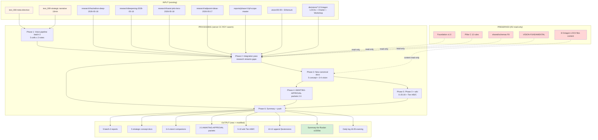

# EXPLAIN — text_008 + text_009 hackathon integration run

> **Цель этого документа.** Описать ЧТО именно server CC будет делать ДО того как мы его запустим. Per `feedback_prompt_explanation_required.md` Ruslan = sole strategist (R1) — должен видеть что внутри prompt'а, а не подтверждать «непонятную хуйню».

---

## §1 Что у нас есть СЕЙЧАС (state до запуска)

### Already-saved (этим Cloud Cowork pre-launch):

- ✅ `raw/voice-memos-2026-05-17-batch/text_008@2026-05-18_evening.md` — meta-directive + hackathon model push (verbatim)
- ✅ `raw/voice-memos-2026-05-17-batch/text_009@2026-05-18_evening.md` — 13-min strategic narrative (verbatim, 15 threads)

### Existing research outputs (готовы к integration pass):

- ✅ `research/hackathon-deep-2026-05-18/` — 5 phases, 4 hypotheses ranked, Harari info-flow lens, 3 people profiles (Karpathy/Buterin/Tang+Weyl), Phase 5 wiki + 5 mermaid + master summary + O-24 candidate appended. **COMPLETED (commit `a34cab8`).**
- ✅ `research/deepening-2026-05-18/` — 14 directions + 98 cross-synthesis + 99 summary. **COMPLETED.**
- ✅ `research/harari-jetix-lens-2026-05-18/` — 5 books + 98 cross-synthesis + 99 summary. **COMPLETED.**
- ✅ `research/adjacent-ideas-2026-05-17/` — 10 cluster docs (universal language / intelligence / etc.). **COMPLETED.**
- ✅ `reports/phase-0-fpf-scope/00-JETIX-FPF-MASTER-2026-05-17.md` — 14 objects baseline + O-21 + O-22 + O-23 appends.
- ✅ `decisions/strategic/JETIX-ETHEREUM-ARCHITECTURE-2026-05-18/` — 12 docs + 5 mermaid + 2 AWAITING-APPROVAL acked.
- ✅ All 8 Octagon LOCKs (H1-H8) — including H8 Trust Infrastructure (17.05).
- ✅ Vision Strategy Plan (10 docs + 5 mermaid) — vision/00-09.
- ✅ Foundation v1.0 LOCKED 2026-04-28 (11 Parts + Pillar A/C).

### NOT yet existing (что появится после server CC run):

- ❌ Voice-pipeline-batch-3 reports (5 файлов mirror batch-2 pattern)
- ❌ Integration pass — hackathon-deep + research-deepening + harari + adjacent-ideas insights **которые ещё не integrated** в canonical narrative
- ❌ Concept doc «Jetix as hackathon platform»
- ❌ Concept doc «System merger protocol (FPF-based M&A для info systems)»
- ❌ Concept doc «Recursive self-developing engine» (plan-mode / execute-mode auto-toggle)
- ❌ Concept doc «Outreach system scalable» (10-people video → 100 trained → personalized pattern)
- ❌ Concept doc «Education layer (системное мышление base)»
- ❌ Vision/ companion docs (10-13) — hackathon platform / outreach / education / system merger
- ❌ AWAITING-APPROVAL packets для Foundation/Pillar A/C touches
- ❌ Phase 0 inventory updates: O-25 / O-26 / O-27 / O-28 candidates
- ❌ Wiki Tier A/B/C concept promotions (~5-10)
- ❌ Daily log 18.05 evening summary

---

## §2 Что делает этот prompt (one paragraph)

Brigadier (ROY swarm: brigadier + 5 experts × 4 modes) обрабатывает text_008 + text_009 как **batch-3 voice pipeline** (mirror text-005-007-blockchain-integration pattern, 5 phases), **PLUS integration pass всех research outputs** (hackathon-deep + research-deepening + harari + adjacent-ideas) — finds gaps где insights ещё не integrated в canonical narrative, surfaces в existing docs append-only, creates NEW concept docs для крупных threads (hackathon platform / system merger / recursive engine / outreach system / education layer), AWAITING-APPROVAL packets для anything Foundation/Pillar-touching, и delivers summary-for-Ruslan ≤1500 words. Constitutional discipline R1+R2+R6+R11+EP-5+append-only preserved throughout.

---

## §3 Что берёт на вход

### Primary input (NEW notes):
- `raw/voice-memos-2026-05-17-batch/text_008@2026-05-18_evening.md`
- `raw/voice-memos-2026-05-17-batch/text_009@2026-05-18_evening.md`

### Integration scope (NOT-yet-integrated insights from):
- `research/hackathon-deep-2026-05-18/` (especially 4 hypotheses + Harari info-flow + 3 profiles + O-24 candidate + 5 mermaid)
- `research/deepening-2026-05-18/` (14 directions — especially #4 Engelbart anchor / #5 Pattern Language / #6 Mondragón / #7 substrate matrix / #11 Tang+Weyl / #12 NASA SE / #14 TPS)
- `research/harari-jetix-lens-2026-05-18/` (Workshop = 4 Cs school positioning / Mythology layer / First Clan elite-belief onboarding / Meta-institution H9 candidate)
- `research/adjacent-ideas-2026-05-17/` (10 cluster docs)

### Canonical baselines (read-only context):
- `reports/phase-0-fpf-scope/00-JETIX-FPF-MASTER-2026-05-17.md` (14 objects)
- `vision/00-MASTER-VISION-PLAN-2026-05-17.md` + companions 01-09
- `decisions/strategic/JETIX-ETHEREUM-ARCHITECTURE-2026-05-18/*` (Ethereum substrate)
- All `decisions/STRATEGIC-INSIGHT-*.md` (8 Octagon)
- `decisions/JETIX-FIRST-CLAN-CHARTER-2026-05-12.md` + `JETIX-WORKSHOP-CONCEPT-2026-04-30.md`
- `swarm/wiki/foundations/` (Foundation v1.0 — R2 READ-ONLY)
- `principles/` (Pillar C — R2 READ-ONLY)

### Constitutional context:
- Pillar C Tier 2 (12 rules)
- Tier 1 Default-Deny table
- `.claude/agents/` (ROY swarm definitions)
- All memory rules в `~/.claude/projects/C--Users-49152/memory/`

---

## §4 Что обрабатывает (pipeline / шаги внутри)

### Phase 1 — Voice pipeline batch-3 (mirror batch-2 pattern)

Brigadier dispatches 5 cells (eng × scalability + mgmt × integrator + phil × critic + sys × cybernetics + investor × roi-frame) для разбора 2 notes. Output: 5 файлов в `reports/voice-pipeline-2026-05-18-batch-3/`:
- `00-MASTER-INDEX.md` — orchestration + constitutional posture
- `01-per-note-breakdown.md` — 5 cells × 2 notes = 10 cell analyses
- `03-fpf-lens-jetix-track.md` — FPF lens × 14 Phase 0 objects + 4-5 NC candidates
- `04-detailed-work-plan.md` — IA / ST / SD / BL / D / K items
- `05-wiki-candidates.md` — Tier A / B / C

### Phase 2 — Integration pass всех research streams

Cells **scan** existing canonical docs (vision/03-08, decisions/JETIX-*, vision/00-MASTER, Phase 0 master) **vs research outputs** (hackathon-deep / research-deepening / harari / adjacent-ideas) — identify **integration gaps**:
- Какие insights research streams произвели но НЕ surface'нуты в canonical?
- Какие text_008/009 threads уже частично covered в research → cross-link;
- Какие НОВЫЕ требуют new docs?

Output: **§extensions** к existing canonical docs (append-only, NO overwrites):
- `vision/03-jetix-as-masterskaya-platform.md` §APPEND-2026-05-18-evening
- `vision/04-first-clan-10-people.md` §APPEND-2026-05-18-evening (clan-wars = hackathons)
- `vision/05-testing-strategy-blogerov-clubs.md` §APPEND-2026-05-18-evening (Thread 11 bloggers + sponsor)
- `vision/06-layered-architecture-L0-L4.md` §APPEND-2026-05-18-evening (L1 = hackathon MVP)
- `vision/07-prototype-platform-2-days-cc.md` §APPEND-2026-05-18-evening (prototype = hackathon engine)
- `vision/08-l1-collaboration-roadmap.md` §APPEND-2026-05-18-evening (Karpathy + Musk + Anthropic priority)
- `decisions/JETIX-FIRST-CLAN-CHARTER-2026-05-12.md` §APPEND-2026-05-18-evening (clan-wars = hackathons)
- `decisions/STRATEGIC-INSIGHT-JETIX-AS-GAMIFIED-PLATFORM-2026-05-11.md` §APPEND-2026-05-18-evening (H6 pre-eminent confirmed)
- `decisions/STRATEGIC-INSIGHT-JETIX-TRUST-INFRASTRUCTURE-2026-05-17.md` §APPEND-2026-05-18-evening (gratitude loop extension)
- `reports/phase-0-fpf-scope/01-jetix-objects-inventory.md` §APPEND-2026-05-18-evening (O-25-28 candidates)

### Phase 3 — New canonical docs (concept-doc + vision/ companions)

5 NEW concept docs в `decisions/strategic/`:
- `JETIX-AS-HACKATHON-PLATFORM-2026-05-18.md` — primary operational pattern (mirror Man-as-Army doc structure)
- `JETIX-RECURSIVE-SELF-DEVELOPMENT-ENGINE-2026-05-18.md` — plan-mode/execute-mode auto-toggle (IP-1 caveat surfaced)
- `JETIX-SYSTEM-MERGER-PROTOCOL-FPF-2026-05-18.md` — M&A для info systems (USB-C metaphor + namordник)
- `JETIX-OUTREACH-SYSTEM-SCALABLE-2026-05-18.md` — 10-people video → 100 trained → personalized pattern
- `JETIX-EDUCATION-LAYER-SYSTEM-THINKING-2026-05-18.md` — base education через Workshop (Harari 4 Cs cross-ref)

3-4 NEW vision/ companion docs:
- `vision/10-hackathon-platform-recursive-engine.md`
- `vision/11-outreach-system-scalable.md`
- `vision/12-education-layer-base.md`
- `vision/13-system-merger-protocol.md` (optional если threads enough)

### Phase 4 — AWAITING-APPROVAL packets (Foundation-touching items)

Анализ: какие threads требуют Foundation/Pillar A/C изменения? Кандидаты:
- **H6 «Gamified Platform» promotion к pre-eminent operational** — overlay packet (Tier 2 H6 LOCK preserved; operational pre-eminence добавлен)
- **Pillar A Strategic Direction Substrate extension** — Hackathon-mode as canonical Workshop activation pattern
- **NEW Strategic Insight H9 candidate** — «Jetix as Hackathon Platform» OR «System Merger Protocol»? Surface options A/B/C
- **Outreach Pillar / Strategic Direction** addition

Output: 2-3 AWAITING-APPROVAL packets в `swarm/awaiting-approval/` — options A/B/C/D surfaced, NO autonomous LOCK.

### Phase 5 — Phase 0 inventory updates + wiki promotions

Phase 0 inventory append §10 (O-25-O-28):
- O-25 «Jetix as hackathon platform»
- O-26 «System merger protocol»
- O-27 «Education layer (системное мышление)»
- O-28 «Outreach system scalable»

Wiki Tier A/B/C promotion (~5-10 concepts):
- `wiki/concepts/jetix-as-hackathon-platform.md` (Tier A)
- `wiki/concepts/recursive-self-development-engine.md` (Tier A)
- `wiki/concepts/system-merger-protocol-fpf.md` (Tier A)
- `wiki/concepts/outreach-system-scalable.md` (Tier B)
- `wiki/concepts/education-layer-systems-thinking.md` (Tier B)
- `wiki/concepts/gratitude-loop-trust-mechanism.md` (Tier B; H8 extension)
- `wiki/concepts/nasa-framework-life-as-spaceship.md` (Tier C)
- `wiki/concepts/100x-multiplier-discipline.md` (Tier C)

### Phase 6 — Summary-for-Ruslan + commit/push

- `reports/voice-pipeline-2026-05-18-batch-3/00-SUMMARY-FOR-RUSLAN.md` ≤1500 words
- Per-phase commit + final push `origin main`
- Daily log 18.05 evening summary в `_DAILY-LOG-2026-05-18.md`

---

## §5 Что получим на выходе (Ruslan reviews this list ДО launch)

### NEW files (~25-35 total):

**5 voice-pipeline batch-3 reports** (`reports/voice-pipeline-2026-05-18-batch-3/`):
1. `00-MASTER-INDEX.md`
2. `01-per-note-breakdown.md` (10 cell analyses)
3. `03-fpf-lens-jetix-track.md` (FPF lens × 14 + 4-5 NC)
4. `04-detailed-work-plan.md` (IA/ST/SD/BL/D/K items)
5. `05-wiki-candidates.md` (Tier A/B/C)
6. `00-SUMMARY-FOR-RUSLAN.md` (≤1500 words; reviewed first)

**5 new strategic concept docs** (`decisions/strategic/`):
7. `JETIX-AS-HACKATHON-PLATFORM-2026-05-18.md`
8. `JETIX-RECURSIVE-SELF-DEVELOPMENT-ENGINE-2026-05-18.md`
9. `JETIX-SYSTEM-MERGER-PROTOCOL-FPF-2026-05-18.md`
10. `JETIX-OUTREACH-SYSTEM-SCALABLE-2026-05-18.md`
11. `JETIX-EDUCATION-LAYER-SYSTEM-THINKING-2026-05-18.md`

**3-4 new vision/ companions:**
12. `vision/10-hackathon-platform-recursive-engine.md`
13. `vision/11-outreach-system-scalable.md`
14. `vision/12-education-layer-base.md`
15. `vision/13-system-merger-protocol.md` (optional)

**2-3 AWAITING-APPROVAL packets** (`swarm/awaiting-approval/`):
16. `h6-hackathon-platform-pre-eminent-2026-05-18.md`
17. `pillar-a-hackathon-mode-extension-2026-05-18.md`
18. (optional) `h9-strategic-insight-candidate-hackathon-OR-merger-2026-05-18.md`

**5-10 wiki Tier A/B/C concept promotions:**
19-28. wiki/concepts/* (listed above)

**Daily log:**
29. `_DAILY-LOG-2026-05-18.md` evening summary

### MODIFIED files (append-only §extensions, ~10-12):

- `vision/03/04/05/06/07/08` §APPEND-2026-05-18-evening
- `decisions/JETIX-FIRST-CLAN-CHARTER-2026-05-12.md` §APPEND
- `decisions/STRATEGIC-INSIGHT-JETIX-AS-GAMIFIED-PLATFORM-2026-05-11.md` §APPEND (H6 confirm)
- `decisions/STRATEGIC-INSIGHT-JETIX-TRUST-INFRASTRUCTURE-2026-05-17.md` §APPEND (gratitude loop)
- `reports/phase-0-fpf-scope/01-jetix-objects-inventory.md` §APPEND §10 (O-25-28)
- `decisions/REFLECTION-INBOX-2026-05-16.md` §APPEND-2026-05-18-evening

### NOT-modified (constitutional preservation):

- ❌ `swarm/wiki/foundations/` (Foundation v1.0 LOCKED — R2 read-only)
- ❌ `principles/tier-2-system/foundation-generic/` (12 rules LOCKED — R2)
- ❌ `shared/schemas/` (F8 schemas — R2)
- ❌ `decisions/JETIX-VISION-FUNDAMENTAL-2026-04-27.md` (constitutional parent — R2 без packet)
- ❌ All 8 Octagon LOCK files (substantive content — packets only для overlays)

---

## §6 Конкретные шаги (за порядком)

1. **Cloud Cowork pre-launch** (done by me before sending this к Ruslan):
   - ✅ Save text_008 + text_009 verbatim
   - ✅ Write this _EXPLAIN file
   - ✅ Write `prompts/text-008-009-hackathon-integration-2026-05-18.md`
   - ✅ Git commit + push (per `feedback_cowork_can_push.md` ack «push ебашь»)
   - ✅ Notion brief plan entry (sub-page Daily Log 17.05)
   - ✅ Reply к Ruslan со списком + что на выходе

2. **Ruslan reviews** этот _EXPLAIN (~10-15 min):
   - Output list §5 OK?
   - Phase scope OK?
   - Constitutional preservation §5 «NOT-modified» OK?
   - Possible scope adjustments / additions / removals?

3. **Ruslan ack** → Cloud Cowork launches server CC:
   - SSH к серверу (Ruslan)
   - `cd ~/jetix-os && git pull --ff-only`
   - `claude -p` headless с `prompts/text-008-009-hackathon-integration-2026-05-18.md`
   - 6 phases execute (~75-100 min)
   - Per-phase commit
   - Final push `origin main`

4. **Cloud Cowork verification post-run**:
   - `git pull --rebase`
   - Read `00-SUMMARY-FOR-RUSLAN.md`
   - Spot-check 3-5 critical artefacts (5 concept docs key ones)
   - Surface to Ruslan: что готово, что для ack, что AWAITING-APPROVAL pending

5. **Ruslan post-run review** (~30-60 min):
   - Read summary
   - Read 2-3 critical docs
   - Ack AWAITING-APPROVAL packets (Option A/B/C/D selection)

---

## §7 К чему ведёт (куда продвигает в roadmap)

### Immediate (Phase 2 unlock):
- **Hackathon model** = documented operational pattern (vs vapor) → ready для first event spec
- **Outreach system scalable** = documented pattern → ready для 10-people video team build
- **Karpathy/Musk/Anthropic outreach** = Phase 1 accelerated с canonical positioning
- **System merger protocol** = framework для negotiations с peer systems

### Phase 1 commercial path repositioning:
- ACTION-PLAN $100K target = floor; hackathon scale = stretch (десятки миллионов человек)
- Master Workshop of Engineers L1 outreach = primary near-term target (per text_009 Thread 14)
- Bloggers + sponsor projects = первый старт mode (Thread 11)

### Phase 2-2+ unlocked:
- H6 Gamified Platform pre-eminence — ack'нут или surfaced как ambiguity для resolution
- H9 Strategic Insight candidate (hackathon-platform OR system-merger) — surface для future LOCK ceremony
- Pillar A Strategic Direction Substrate extension — Workshop-Phase + Hackathon-Phase canonical namespace
- Recursive self-development engine — IP-1 caveat carefully surfaced (R1 compliance preserved)

### Phase 0 inventory completion:
- 14 → 18 objects (O-25-28 candidates added)
- ALL 4 candidates carry F2 surface status — Ruslan ack'ает promotion к F3+

### Constitutional integrity:
- Foundation v1.0 + Pillar C R12 + IP-1 + 8 Octagon LOCKs = **PRESERVED**
- AWAITING-APPROVAL discipline = maintained throughout
- Append-only = maintained throughout
- F-G-R per claim = maintained throughout

---

## §8 Mermaid схема (visual flow input → processing → output)

---

## §9 Constitutional compliance checklist (server CC ack required)

- [x] R1 surface-only: prose_authored_by: ruslan OR ruslan-via-voice-dictation+brigadier-structured; NO autonomous strategic prose
- [x] R2 Foundation read-only: NO writes to Foundation Parts / Pillar C foundation_generic / shared/schemas/ / VISION-FUNDAMENTAL без AWAITING-APPROVAL packet
- [x] R6 provenance per claim: каждый insight carries src link (file:line или url:retrieved_date)
- [x] R11 Default-Deny: NO novel action class autonomous; uncategorized = deny-and-escalate
- [x] EP-5 disclosed: F2-F3 strategic surface; Jetix F8 ≠ FPF B.3 F8 explicit
- [x] Append-only: §extensions NEVER overwrite; new files OK
- [x] H8 substrate-agnostic preserved (Ethereum = overlay option, не replace)
- [x] R12 Tier 2 text LOCKED preserved
- [x] IP-1 Role≠Executor preserved (recursive self-development engine carefully framed)
- [x] 8 Octagon LOCK content preserved (§extensions only)
- [x] Word budgets enforced (concept docs ≤2500w; summary ≤1500w)
- [x] Cost cap €10/day; expected <€2.50

---

## §10 Risk surface (4)

| Risk | Mitigation |
|---|---|
| **Scope creep** (35+ files = много) | Phase budgeted; per-phase commit; STOP if exceeds 100 min server CC time |
| **R1 violation** (autonomous strategic prose) | Cells use ruslan-via-voice-dictation+brigadier-structured ONLY для strategic-content; brigadier-scribe для analysis |
| **AWAITING-APPROVAL packets too aggressive** (auto-LOCK Foundation) | Packets surface options A/B/C/D ONLY; NO ack autonomous |
| **Integration pass produces caша** | FPF lens FIRST (per `feedback_fpf_lens_first.md`) — Phase 2 starts с FPF scope of each research stream |

---

## §11 Что НЕ сделает server CC (explicit anti-list)

- ❌ НЕ overwrite existing canonical content (append-only)
- ❌ НЕ promote H6 / H9 к LOCK автономно (packets only)
- ❌ НЕ Buterin / Karpathy / Musk cold outreach auto-execute (Ruslan personal action)
- ❌ НЕ launch hackathon first event auto (Ruslan operational decision)
- ❌ НЕ pick specific blockchain L2 (Base remains default surface, NOT committed)
- ❌ НЕ commit token economics (SBT-only Phase 2+ surface, NOT committed)
- ❌ НЕ touch Foundation/Pillar C/Schemas/VISION-FUNDAMENTAL files
- ❌ НЕ generate strategic prose without Ruslan voice anchor
- ❌ НЕ skip phases without explicit reason logged

---

*Cloud Cowork explanation document per `feedback_prompt_explanation_required.md`. AWAITING-RUSLAN-ACK ДО launch server CC. After ack: I (Cloud Cowork) launch run via SSH + claude headless + this prompt.*
