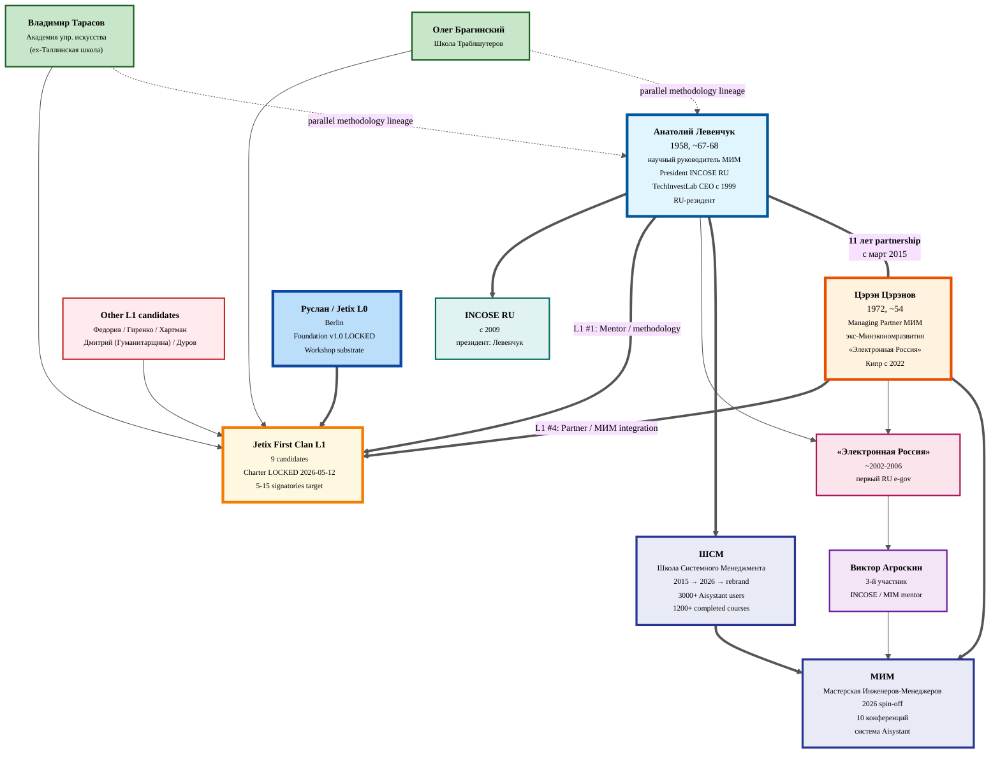

# 👥 L1 profiles — Цэрэн Цэрэнов + Анатолий Левенчук

> **Что это.** Quick-glance prep для звонков. Все факты — synthesis из существующих deep profiles + CRM + TG/YT analysis reports. Не verbatim copy — компактный layer с фокусом на «что мне нужно знать перед разговором».
>
> **Constitutional anchor.** AI = scribe. Только descriptive surfacing, без рекомендаций / стратегии. Provenance per claim — citation source file.

---

## 🌟 TL;DR (одна страница)

**Цэрэн Цэрэнов** — Managing Partner МИМ (Мастерская инженеров-менеджеров — новая 2026 структура, spin-off ШСМ). Полное имя: Церен Валерьевич Церенов, 1972 г.р. (~54), мехмат МГУ + ВШЭ; экс-Минэкономразвития / автор «Электронной России» (2002-2010); живёт на Кипре с сентября 2022 (выехал из РФ в день мобилизации), женат, дед с 02.09.2025. Со-основатель ШСМ с марта 2015 — **11-летний партнёр Левенчука**. К 2026 — главный operator МИМ + active builder AI-стэка (Claude Code, MCP, n8n; «claude» = #1 значимое слово 2026 в его постах). [src: profiles/l1-first-clan/tseren-tserenov.md §1-§2; raw/research/2026-04-28-tseren-tg-export/analysis-report.md §1, §2.3]

**Анатолий Левенчук** — научный руководитель МИМ / co-партнёр Цэрэна. Полное имя: Анатолий Игоревич Левенчук, 1958 г.р. (~67-68), Ростов-на-Дону, химфак РГУ. Кофаундер TechInvestLab (с авг 1999); президент Российского отделения INCOSE (с 2009); автор учебников «Системное мышление» (2022/2024), «Методология 2025», «Интеллект-стек I-III», «Системная инженерия — 2022», «Инженерия личности». Ведёт `ailev.livejournal.com` с начала 2000-х (один из старейших активных блогов рунета). RU-резидент. [src: profiles/l1-first-clan/anatoliy-levenchuk.md §1-§2]

**Ключевая связка.** 11-летнее партнёрство (с март 2015) — самый длительный деловой союз обоих. ШСМ → МИМ rebrand 2026: Левенчук остался научным руководителем ШСМ, Цэрэн стал Managing Partner МИМ (новая операционная структура). До этого работали вместе ещё в «Электронной России» (~2002-2006) с Виктором Агроскиным. [src: profiles/tseren-tserenov.md §2; raw/research/2026-04-28-tseren-tg-export/analysis-report.md id=213 цитата, id=665]

**Jetix-relevance.** Цэрэн — Critical path A1.1 в Action Plan (closest existing operator аналог Jetix Workshop substrate). Левенчук — Critical path A1.2 + Tyson-mentor candidate (depth-mentorship pattern). [src: profiles/*.md §6 + crm/people/*-l1.md §3]

---

## 1️⃣ ЦЭРЭН ЦЭРЭНОВ — Managing Partner МИМ

### §1 Identity

- **ФИО:** Церен Валерьевич Церенов (официально); в МИМ-материалах часто «Цэрэн Цэрэнов» (этническая транслитерация калмыцкого имени)
- **Год рождения / возраст:** 1972 (~54 в 2026) [src: viperson.ru via profiles/tseren-tserenov.md §1]
- **Гражданство / locale:** РФ; **резиденция Кипр с сентября 2022** («Прошел год после переезда на Кипр. Как раз в день мобилизации 2022 года мы с женой прилетели на остров» — TG id=259 2023-09-22) [src: raw/research/2026-04-28-tseren-tg-export/analysis-report.md §2.1]
- **Семейный статус:** женат, есть взрослые дети + зять; **дед с 02.09.2025** («Вчера в День знаний я стал дедушкой» — TG id=563) [src: TG analysis §2.1]
- **Языки:** русский (основной); английский — рабочий (Medium-блог на английском); калмыцкий — этническое происхождение
- **Текущая роль:** Managing Partner МИМ (Мастерская Инженеров-Менеджеров — новая 2026 structure spin-off ШСМ)
- **TG handle:** `@TserenTserenov` (личный)

### §2 Карьерный путь

- **1994** — мехмат МГУ им. Ломоносова, специализация: механика и прикладная математика (с отличием) [src: viperson.ru via profiles/tseren-tserenov.md §1]
- **1997** — ГУ-ВШЭ (Высшая школа экономики), экономика [src: viperson.ru via profiles §1]
- **1997-2006** — Минэкономики / Минэкономразвития РФ: ведущий специалист → Глава Департамента корпоративного управления и новой экономики. Цитата: «Когда-то я среди своих ровесников выглядел не очень адекватным, когда пошел работать в Минэкономики на копейки, и также в числе первых принял решение больше никогда не связываться [с] госсектором» (TG id=213) [src: TG analysis §2.3]
- **2000** — участие в разработке «Стратегии социально-экономического развития России до 2010 года» (Центр стратегических разработок) [src: profiles §2]
- **2002-2006** — «Электронная Россия» (соавтор + один из инициаторов федеральной целевой программы, первый российский e-government project) — вместе с Левенчуком и Виктором Агроскиным [src: TG id=665 цитата 2026-04-09]
- **~2000-е / начало 2010-х** — Глава Департамента транспорта и связи Тверской области (последний госпост по viperson)
- **Март 2015** — со-основатель ШСМ (Школа системного менеджмента) вместе с Левенчуком («Толя в конце марта 2015 года проводил семинар для инженеров и менеджеров, а я во время подготовки этого семинара писал концепцию школы. Я понял, что буду этим заниматься несмотря ни на что как раз в день своего 43 летнего дня рождения» — TG id=213) [src: TG analysis §2.3]
- **2026** — Managing Partner МИМ (structural rebrand / spin-off ШСМ; Левенчук остался научным руководителем ШСМ-крыла, Цэрэн возглавляет операционное МИМ-крыло) [src: YT analysis report §1 пункт 10]
- **Награды:** Почётная грамота Правительства РФ [src: profiles §2]

### §3 Послужной список / key projects / артефакты

- **«Электронная Россия» (2002-2010)** — флагманский e-gov проект 2000-х [src: profiles §2]
- **ШСМ → МИМ (2015→2026)** — учебная программа, IT-платформа Aisystant. По состоянию на 2023 г. (TG id=213): «3006 человек совершили хотя бы 1 активное действие на нашей IT-платформе Aisystant, а 1200 человек окончили хотя бы 1 курс» [src: TG analysis §3.2]
- **Книга «Мысли системно»** — соавтор (изд. Bombora) — научпоп-вход в системное мышление [src: system-school.ru/team/tserenov via profiles §2]
- **Руководства МИМ** (Цэрэн с 2024-2025 формально переименовал «курсы» в «руководства» — «оно точнее отражает суть — мы формируем мастерство (моделирования, описания систем, изменения себя и среды), а текст — это инструкция и норматив», TG id=626): «Системное саморазвитие», «Мысли системно», «Практики саморазвития», «Введение в системное мышление» [src: TG analysis §3.2]
- **Программа «Personal Development»** в МИМ — создатель [src: profiles §2]
- **AI-проекты (2024-2026)** — освоил GitHub, Claude Code, Codex, n8n, MCP-сервера; построил первую IT-систему (LLM-чекер ДЗ) к январю 2026 [src: TG analysis §1 пункт 4]
- **Конференция МИМ** — 10-я конференция 18-19 апреля 2026 (regular annual event) [src: TG id=669]
- **YouTube канал** `@tserentserenov77` — 127 видео за ~26 месяцев (с 2024-01-31), 114 часов контента, total 19,742 просмотра (mean 155 / median 113) [src: YT analysis §2.1]
- **Medium-блог** `medium.com/@tserentserenov` (англоязычный) [src: profiles §3]

### §4 Сферы экспертизы

- **Core:** системное мышление, системное саморазвитие («Personal Development»), системная инженерия применённая к самому человеку
- **Vector 2026:** AI-augmented systems thinking — мультиагентные ИИ-системы, экзокортекс, IWE (Intellectual Work Environment), AI-репетитор, нетворкинг-бот [src: YT analysis §1 пункт 7]
- **Methodology lineage:** ШСМ/МИМ-школа (которую сам и сооснователь сформировал с Левенчуком); bridge между чистой методологией Левенчука и practitioner / mass-market подачей [src: profiles §3]
- **Signature concepts:**
  - Personal Development через системную инженерию
  - AI-guided personal development pathways
  - Meaning engineering / инженерия смыслов
  - Community economics development
- **Не-doominating но устойчивые темы:** стои[цизм] / медита[ция] (168 hits в TG корпусе), стратегирование (≠ планированию, core concept), мышление письмом, экзокортекс [src: TG analysis §3.1]
- **Self-frame** (НЕ «гуру», НЕ «коуч»): «сооснователь / управляющий партнёр / фаундер / инженер-менеджер / инициатор сообщества» (TG id=2 pinned). Цитата id=256: «Я пошел в фаундеры от безысходности, мне просто больше нечем было заниматься» — сухая self-honest рамка без героизации [src: TG analysis §2.4]

### §5 Публичные позиции (с ссылками)

| Channel | URL | Notes |
|---|---|---|
| YouTube (личный) | https://www.youtube.com/@tserentserenov77 | 127 видео; bimodal — короткие концептуальные (5-10 мин) + длинные вебинары (60-160 мин); top-3 по views: «Фундаментальная причина беспокойств» (1205), «В сложной ситуации — пиши» (1195), «Что такое умение учиться» (721) [src: YT analysis §2.4] |
| Telegram канал | https://t.me/systemsthinkinglife | «Системное мышление для жизни»; long-form (85% постов >1000 chars); 618 постов (2021-03 → 2026-04); mean 13.5 реакций/пост; top emojis 👍🔥❤ = 92% [src: TG analysis §0, §1] |
| Telegram personal | `@TserenTserenov` | direct DM (использован 04.05.2026 — video proposal, ответа пока нет) |
| Email | tseren@system-school.ru | официальный personal MIM email |
| Medium | https://medium.com/@tserentserenov | англоязычный блог |
| Instagram | https://www.instagram.com/tseren.tserenov/ | |
| Facebook | https://www.facebook.com/tseren.tserenov | |
| Tenchat | (link в team-странице) | российская профессиональная соцсеть |
| LiveLib (как автор) | https://www.livelib.ru/author/1879306-tseren-tserenov | книжный профиль |
| MIM bio | https://system-school.ru/team/tserenov | официальная team-страница |

**Topic drift по годам (TG корпус):**
| Год | Топ значимых слов |
|---|---|
| 2021 | человек, время, системы, системное, мышление |
| 2022 | которые, нужно, людей, жизни, человек |
| 2023 | практики, жизни, саморазвития, мышление, человек |
| 2024 | жизни, например, время, мышление, времени |
| 2025 | жизни, развития, человек, системное, системы |
| **2026** | **claude, знаний, работы, работает, знания** |

→ К 2026 году **«claude»** — #1 значимое слово. Operational shift от «системное мышление как теория» к «системное мышление как практика с AI-агентами». [src: TG analysis §3.3]

### §6 Network / окружение

- **11-летнее партнёрство с Левенчуком** (с март 2015 — основание ШСМ; до этого совместная работа в «Электронной России» ~2002-2006) — самый длительный деловой союз в карьере обоих [src: profiles §2, TG id=665]
- **Виктор Агроскин** — третий участник «Электронной России»; ассоциирован с INCOSE-сообществом РФ [src: TG id=665 цитата 2026-04-09 + profiles/anatoliy-levenchuk.md §5]
- **МИМ team** — Цэрэн как Managing Partner; ШСМ team-страница: https://system-school.ru/team/tserenov
- **Сообщество ШСМ/МИМ** — ~7 тыс. человек в сообществе ШСМ (2023 цифра); 3000+ Aisystant users; 1200+ completed at least one course [src: TG analysis §1 пункт 6, §3.2]
- **Cross-Clan L1 связи:** в Jetix L1 — со-listed с Левенчуком, Брагинским (Школа Траблшутеров), Тарасовым (Академия управленческого искусства) — все трое methodology-lineage anchors [src: decisions/JETIX-FIRST-CLAN-CHARTER-2026-05-12.md §3.2]
- **NOT-Levenchuk anomaly:** YT analysis обнаружил — Левенчук **0 раз mentioned** в descriptions/titles tseren-канала (из 85 enriched). Tseren строит **отдельный voice/brand** от Levenchuk, не «Levenchuk-follower»; при этом на @system_school канале они co-presented (8-я / 9-я конференции ШСМ). Separation operational, не идеологическое. [src: YT analysis §1 пункт 5]

### §7 Стиль работы / методология

- **Disciplined steady cadence**, НЕ explosive creator: ~5-6 видео/месяц без провалов; sustained 5-year long-form TG (85% постов >1000 chars) [src: YT analysis §2.3, TG analysis §0]
- **Partnership-language родной** — 5 лет регулярных упоминаний партнёров и команды; НЕ broadcast'ит «ищу инвестора/ментора» [src: TG analysis §1 пункт 7]
- **Self-honest, без heroic framing** (см. §4 цитата id=256)
- **Audience supportive, niche** — engagement по реакциям умеренный; top emojis 👍🔥❤ = 92% (NOT trolly/critical) [src: TG analysis §1 пункт 6]
- **Платформенный production:** events.system-school.ru (events platform); paid event materials sold via Tinkoff TPRODUCT widget [src: YT analysis §1 пункт 11]
- **Шаги мастерства, не курсы** — формальная rename «курсы» → «руководства» (см. §3) показывает методологический формальный подход к продукту [src: TG analysis §3.2]
- **Anti-patterns / что точно не любит:** в pitchy / vague messages — низкая толерантность (характерно для всей ШСМ/МИМ методологической культуры); требует методологический rigor

### §8 Точки пересечения с Jetix + outreach hooks

- **МИМ-pattern direct = closest existing operational analog Jetix Workshop substrate** — Цэрэн = operational owner этого аналога [src: profiles §6 + decisions/JETIX-DOCUMENT-MAP-2026-05-15.md]
- **H7 People-Network-State overlap:** МИМ — рабочий пример «people-first network state substrate» (выпускники = members, методология = constitution); 11-летняя operational track record [src: profiles §6, decisions/JETIX-FIRST-CLAN-CHARTER-2026-05-12.md §3.2]
- **H6 Gamified Platform — потенциальный entry point** — Цэрэн listed в outreach pool: «Stage 2: Charter + H7 + специфика — H6 Gamified Platform (МИМ overlap)» [src: outreach/jetix-document-pool-2026-05-12.md §«Цэрэн»]
- **Mass-market methodology bridge** — Цэрэн делает то, что Jetix хочет: методологию доступной без потери rigor («руководства» вместо «курсы»)
- **AI-stack резонанс 2026** — Цэрэн = active builder Claude Code / MCP / n8n; «claude» = #1 значимое слово 2026 года; direct overlap с Jetix substrate (AI / LLM / графы знаний / автоматизация per Charter §1.0a) [src: TG analysis §3.3]
- **Community economics development ↔ Jetix R12 anti-extraction** — Цэрэн's «community economics» framing совпадает с R12 принципом (community sustainable, not extractive)
- **Geographic compatibility** — Кипр (EU) vs Berlin (EU); НЕ Москва-RU; снимает часть geopolitical filter
- **Critical path A1.1** в Action Plan — Цэрэн первый по importance в L1 после Левенчука
- **Bridge governmental + private + methodological** — уникальная триада опыта (e-gov «Электронная Россия» + методология + practitioner education); никто другой в L1 не имеет такого backgrounds [src: profiles §6]
- **Outreach state (2026-05-16):**
  - 2026-05-04 — video proposal sent через TG `@TserenTserenov`
  - 2026-05-11 — Daily Log update: video отложен на ПОСЛЕ gamification + People-NS spec ready
  - 2026-05-12 — added to First Clan L1 (Ruslan ack), CRM consolidated
  - **Next action:** видео после готовности gamification + People-NS spec (per CRM next_action) [src: crm/people/tseren-tserenov-l1.md pipeline.next_action]

---

## 2️⃣ АНАТОЛИЙ ЛЕВЕНЧУК — научный руководитель МИМ

### §1 Identity

- **ФИО:** Анатолий Игоревич Левенчук
- **Aliases:** Anatoly/Anatoliy Levenchuk, `ailev`
- **Год рождения / возраст:** 1958 (~67-68 в 2026) [src: gtmarket.ru via profiles/anatoliy-levenchuk.md §1]
- **Место рождения:** Ростов-на-Дону, СССР [src: profiles §1]
- **Гражданство / locale:** РФ (по публичной активности — Москва; точная резиденция 2026 не подтверждена; LiveJournal активен) [src: profiles §1]
- **Языки:** русский (основной), английский (рабочий — переводы стандартов INCOSE, OMG)
- **Текущая роль:** со-основатель и научный руководитель МИМ (Мастерская инженеров-менеджеров, ранее ШСМ — Школа системного менеджмента)
- **Также:** президент ООО «TechInvestLab» (с авг 1999) [src: techinvestlab.ru/ailev via profiles §2]

### §2 Карьерный путь

- **Education** — химический факультет Ростовского государственного университета [src: gtmarket.ru via profiles §1]
- **1990-1991** — Глава Ассоциации участников рынка ценных бумаг (один из пионеров российского фондового рынка позднего СССР) [src: profiles §2]
- **1991-1996** — Директор Института коммерческой инженерии [src: profiles §2]
- **1996-1999** — Директор проекта Института развития правовой экономики; консультировал ФКЦБ России [src: profiles §2]
- **С августа 1999** — Президент ООО «TechInvestLab» (частная консалтинговая фирма; до сих пор active) [src: techinvestlab.ru/ailev]
- **~2002-2006** — «Электронная Россия» (с Цэрэном Цэрэновым и Виктором Агроскиным) [src: TG id=665 цитата]
- **С 2000-х** — сдвиг фокуса на системное мышление, методологию, системную инженерию
- **С 2009** — Президент Российского отделения INCOSE (Международный совет по системной инженерии) [src: profiles §2]
- **Март 2015** — основание ШСМ (Школа системного менеджмента) вместе с Цэрэном [src: TG id=213]
- **2026** — после rebrand: научный руководитель МИМ (Мастерская инженеров-менеджеров) [src: profiles §2]
- **Раннее:** создатель libertarium.ru — один из первых политических проектов рунета (1990-е); либертарианская традиция (Мизес, Хайек) [src: profiles §2, §3]
- **35+ лет** стратегического и методологического консалтинга для Банка России, ФКЦБ, Минэкономразвития, РАО ЕЭС [src: system-school.ru/team/levenchuk via profiles §2]

### §3 Послужной список / key projects / артефакты

**Книги/учебники (yearly-updated):**
- «Системное мышление 2024» (Тома 1-2) — рекомендован Русским отделением INCOSE [src: livelib.ru via profiles §2]
- «Методология 2025»
- «Системный менеджмент — 2023»
- «Интеллект-стек 2023» (части I, II, III)
- «Системная инженерия — 2022»
- «Инженерия личности»

**LiveJournal `ailev.livejournal.com`** — ведёт с ранних 2000-х (один из старейших активных блогов рунета); daily activity [src: profiles §4]

**Курсы для академических институтов** — МФТИ, МИФИ, УрФУ, СФУ, РАНХиГС, НИУ ВШЭ, Корпоративный университет Росатома [src: system-school.ru/team/levenchuk via profiles §2]

**Cross-presence на @system_school YT канале** — co-presented с Цэрэном на 8-й, 9-й, 10-й конференциях ШСМ/МИМ; 452 видео всего на канале; 37 c упоминанием Цэрэна (т.е. co-speaker pattern documented) [src: YT analysis §0, §1 пункт 5]

### §4 Сферы экспертизы

- **Core:** системное мышление, системная инженерия, системный менеджмент, методология
- **Signature concept — «Интеллект-стек»** — стек из 14 трансдисциплин (от концептуализации до системной инженерии), который усиливает естественный и искусственный интеллект [src: profiles §3]
- **Inженерия личности** — применение системной инженерии к самому человеку
- **Эволюционное системное мышление** — совмещение SE с теорией эволюции
- **Methodology as moat** (косвенно) — методология как защитимый актив в info-work
- **Methodology lineage:** INCOSE / ISO 42010 / OMG Essence → переплавлено в собственную онтологию ШСМ/МИМ
- **Раннее влияние** — австрийская школа экономики (Мизес, Хайек) → libertarium.ru [src: profiles §3]
- **Influences / mentors:** Мизес/Хайек (либертарианство); INCOSE-сообщество (системная инженерия); Bertalanffy/Meadows (системное мышление); современная программа OMG Essence

### §5 Публичные позиции (с ссылками)

| Channel | URL | Notes |
|---|---|---|
| LiveJournal personal | https://ailev.livejournal.com/ | один из старейших активных блогов рунета; daily, methodological |
| Telegram personal | https://t.me/ailevenchuk | личный TG; не в первоначальном CRM stub |
| Telegram broadcast блога | https://t.me/ailev_blog | broadcast LiveJournal в TG |
| Telegram МИМ канал | https://t.me/system_school | организационный (общий с Цэрэном) |
| YouTube МИМ | https://www.youtube.com/@system_school | организационный канал ШСМ/МИМ; 452 видео |
| SystemsWorld Club | https://systemsworld.club/u/ailev/ | community profile МИМ |
| VKontakte | (ссылка на team/levenchuk) | active per профиль team |
| Personal corp page | https://techinvestlab.ru/ailev | corporate-bio страница |
| MIM bio | https://system-school.ru/team/levenchuk | официальная team-страница |

**Тон/стиль blog:** методолог-практик; славится **низкой толерантностью к воде** в текстах; критика встречается за «слишком абстрактный» / «недоступный» стиль текстов — но это feature, не bug. [src: profiles §7 + §9]

### §6 Network / окружение

- **11-летнее партнёрство с Цэрэном Цэрэновым** (с март 2015) — equal-partner relationship; самый длительный деловой союз
- **Виктор Агроскин** — третий участник «Электронной России»; mentor МИМ [src: profiles §5 + TG id=665]
- **Вячеслав Мизгулин** — mentor МИМ; INCOSE-сообщество [src: profiles §5]
- **INCOSE community** — Левенчук = президент российского отделения с 2009; bridge к international systems engineering community [src: profiles §2]
- **TechInvestLab clients (исторически)** — Банк России, ФКЦБ, Минэкономразвития, РАО ЕЭС [src: profiles §2]
- **Студенты ШСМ/МИМ** — 3000+ Aisystant users, 1200+ completed; reading audience учебников значительно больше
- **Cross-Clan L1 связи:** Брагинский / Тарасов — параллельные methodology-lineage anchors; не direct collaboration, но parallel scene в RU-пространстве методологического образования

### §7 Стиль работы / методология

- **Yearly-updated учебники** — disciplined annual revision (Системное мышление 2024, Методология 2025, Системный менеджмент — 2023) — system thinker который сам apply'ит итеративное обновление
- **Daily LiveJournal cadence** с начала 2000-х (>20 years sustained) — один из старейших активных блогов рунета [src: profiles §4]
- **High content density / low tolerance к pitchy сообщениям** — pitchy / vague messages игнорируются; требует методологический хук + содержательный вопрос [src: profiles §7]
- **Depth-mentorship pattern** — традиция ученичества через ШСМ/МИМ; не broadcast / не masclass-broadcast (см. также H5 Tyson mentorship pattern в Charter) [src: profiles §6 + decisions/STRATEGIC-INSIGHT-TYSON-MENTORSHIP-PATTERN-2026-05-10.md]
- **Anti-patterns / что точно не любит:**
  - Pitchy / vague messages без методологического хука
  - Startup-flavored инициативы без проверенной методологии
  - Общие слова без артефактов

### §8 Точки пересечения с Jetix + outreach hooks

- **Methodology specialist** — основной anchor для принципа «methodology as moat» в Jetix Hexagon stack; никто другой в RU-пространстве не делает методологию как ремесло настолько систематично [src: profiles §6]
- **Tyson-mentor candidate** — depth-mentorship pattern (Cus D'Amato analog для Руслана); 35+ лет консалтинга + традиция ученичества через ШСМ/МИМ [src: profiles §6, decisions/STRATEGIC-INSIGHT-TYSON-MENTORSHIP-PATTERN-2026-05-10.md]
- **Critical path A1.2** — без Левенчука Workshop-формат Jetix теряет связь с проверенной 11-летней MIM-партнёрской традицией [src: profiles §6]
- **H7 People-NS overlap** — МИМ как working example (выпускники = members, методология = constitution)
- **Интеллект-стек ↔ Jetix Hexagon** — обе модели стекируют когнитивные практики; возможна интероперабельность [src: profiles §6]
- **Charter humanities/methodology review** — потенциальная роль (Stage 2 в outreach pool: H5 Tyson Mentorship + Charter methodology review) [src: outreach/jetix-document-pool-2026-05-12.md §«Левенчук»]
- **R12 anti-extraction** compatible — МИМ модель сама non-extractive (членство добровольное, fork-and-leave возможен) [src: profiles §9]
- **Outreach state (2026-05-16):**
  - Status: **cold** (нет direct contact; CRM relationship_strength: 1)
  - Recommended approach: через Цэрэна (после resolution А1.1), параллельно — Руслан читает «Системное мышление» том 1 для общего языка
  - Direct timeline — не ранее июня 2026 (после Цэрэна) [src: profiles §11, crm/people/anatoliy-levenchuk-l1.md pipeline.next_action]

---

## 3️⃣ MERMAID — Network diagram

---

## 4️⃣ Quick-glance comparison Цэрэн vs Левенчук

| Dimension | **Цэрэн Цэрэнов** | **Анатолий Левенчук** |
|---|---|---|
| **Возраст** | 1972 (~54) | 1958 (~67-68) |
| **Locale** | Кипр (с сентября 2022) | РФ (Москва, по публичной активности) |
| **Education** | мехмат МГУ (1994) + ВШЭ экономика (1997) | химфак Ростовского ГУ |
| **Основная роль** | Managing Partner МИМ (operational) | научный руководитель МИМ (methodological) |
| **Госкарьера** | 1997-2006 Минэкономразвития; «Электронная Россия» автор | TechInvestLab консалтинг для гос-структур (с 1999) |
| **Парный год** | 2015 (со-основатель ШСМ) | 2015 (со-основатель ШСМ) |
| **Книги** | «Мысли системно» (соавтор) + руководства МИМ | «Системное мышление 2024», «Методология 2025», «Интеллект-стек I-III», «Инженерия личности» + ~5 учебников |
| **Главный TG канал** | `@systemsthinkinglife` (618 постов с 2021) | `@ailev_blog` (broadcast LJ) + `@ailevenchuk` (personal) |
| **TG personal** | `@TserenTserenov` | `@ailevenchuk` |
| **YT канал** | `@tserentserenov77` (127 видео, 114 ч контента) | через `@system_school` (организационный) |
| **Blog** | `medium.com/@tserentserenov` (EN) | `ailev.livejournal.com` (RU, daily, с начала 2000-х) |
| **Стиль методологии** | bridge практик → mass-market; «руководства» вместо «курсов» | systems thinking SOTA; yearly-updated учебники; интеллект-стек |
| **Influences** | системное мышление + AI-практика 2026 (Claude / MCP / экзокортекс) | INCOSE / OMG Essence + Мизес/Хайек (libertarium.ru) |
| **AI-stack 2026** | active builder (Claude Code / n8n / MCP) | методологический наблюдатель / интеллект-стек как usage frame |
| **11-летнее partnership** | ✓ (equal-partner) | ✓ (equal-partner) |
| **Outreach status (2026-05-16)** | warm; video sent 04.05 (no response, отложен per Daily Log 11.05) | cold; не контактирован напрямую |
| **Pipeline status (CRM)** | warm | cold |
| **Relationship strength (CRM)** | 2/10 | 1/10 |
| **Value to Jetix (CRM)** | 9/10 | 10/10 |
| **Best entry point** | МИМ-Workshop overlap (operational); H6 Gamified | методологический фреймворк (Charter review); H5 Tyson |
| **Critical path role** | A1.1 (first contact target) | A1.2 (через Цэрэна или direct после resolution А1.1) |
| **L1 ladder role** | Partner — МИМ integration (Q4 ack) | Mentor — methodology validation (Q4 ack) |
| **Anti-patterns (что не любит)** | pitchy / vague — общая ШСМ-МИМ культура | то же + skeptical к startup-flavored без проверенной методологии |
| **Self-frame** | «фаундер / managing partner / инженер-менеджер» (НЕ гуру) | «методолог / научный руководитель / системный мыслитель» |

---

## 5️⃣ Что surface-нуто в outreach pool (per `outreach/jetix-document-pool-2026-05-12.md`)

> Per §4 constitutional discipline — это **descriptive surfacing** того что уже зафиксировано в outreach pool, не новые рекомендации.

### Цэрэн (МИМ Managing Partner) — per pool
- **Stage 1:** Video + Pitch Doc
- **Stage 2:** Charter + H7 + специфика — **H6 Gamified Platform (МИМ overlap)**
- **Stage 3:** Workshop concept (мастерская analog)

### Левенчук (научный руководитель ШСМ) — per pool
- **Stage 1:** Video + Pitch Doc
- **Stage 2:** Charter + H7 + **H5 Tyson Mentorship (depth-mentorship pattern)**
- **Stage 3:** Anton report (методология path) + TRM model

### Video script (для Цэрэна) — talking-points уже зафиксированные
- 0:30-2:00 — Что я строю (90 sec, core sell)
- 2:00-3:30 — Почему я к тебе с этим: «Концепция перекликается с МИМ — мастерская инженеров-менеджеров — которую вы с Левенчуком строите 11 лет» (verbatim из video script line 59)
- 3:30-5:00 — Наработки + ambitions (90 sec)
- 5:00-6:00 — Конкретный ask: «И 30-60 минут созвон на этой неделе или следующей — обсудить, есть ли резонанс» (verbatim line 88)

[src: outreach/jetix-document-pool-2026-05-12.md §«Per-L1-Candidate» + outreach/video-script-tseren-2026-05-12.md]

---

## 6️⃣ OPEN QUESTIONS (что не известно — нужно узнать в созвоне)

Из source profiles + analysis reports surface'нулись следующие gaps (descriptive surfacing — НЕ recommendation к conversation strategy):

**Per Цэрэн:**
1. Текущая резиденция precise — Кипр (verified 2023) → 2026 актуально? Поездки в Куала-Лумпур (5× mentions) — что это? [src: TG analysis §2.1]
2. Net worth / income bucket — unknown (не приоритет для outreach) [src: profiles §2]
3. МИМ structural details — точное распределение equity / authority между Цэрэном и Левенчуком после 2026 rebrand [profiles §2 surface'ит rebrand но не cap-table]
4. Reaction на video proposal от 04.05 — read confirmation? Активный ignore? Bandwidth issue? [crm History 2026-05-04]
5. Cross-channel ICP — overlap с Berlin / EU англоязычной аудиторией: 0% или есть seed? [profiles §6 ставит вопрос но не отвечает]
6. AI-stack 2026 — Tseren видит ИИ как augmentation (экзокортекс) или как substrate (Jetix angle)? Разница принципиальная. [TG §1 пункт 4 + 2026 word drift]

**Per Левенчук:**
1. Резиденция precise 2026 — Москва или иная? [profiles §1 ставит вопрос]
2. Family status — не публичен (не запрашивался) [profiles §1]
3. Текущий bandwidth — МИМ + ~5 yearly учебников + LiveJournal daily + YouTube → насколько перегружен в реальности? [profiles §9]
4. Personal interest в AI-augmented mentorship vs traditional ШСМ pattern — открытый вопрос (выясняется через первое содержательное письмо) [profiles §6]
5. Position относительно МИМ rebrand — Левенчук voluntarily ушёл в «научный руководитель» или это negotiated split? [profiles §2 surface'ит rebrand, не surface'ит motivations]
6. INCOSE international ties — насколько активны 2026? [profiles §2 фиксирует с 2009, не surface'ит current state]
7. Net worth / income bucket — unknown; TechInvestLab не публикует [profiles §2]

**Per relationship Цэрэн ↔ Левенчук:**
1. Operational separation МИМ-ШСМ — какие практические границы? [YT analysis §1 пункт 10 surface'ит structural separation, но не operational]
2. NOT-Levenchuk anomaly на YT канале Цэрэна — separation operational или это feature/preference? [YT analysis §1 пункт 5]
3. Equity-разделение МИМ — каждый partner equal или asymmetric? [не surface'нуто ни в одном source]

---

## 7️⃣ Provenance / Sources summary

**Главные source files** (все verified existence 2026-05-16):
- `profiles/l1-first-clan/tseren-tserenov.md` — 184 lines, 11 sections, F:F2 deep profile
- `profiles/l1-first-clan/anatoliy-levenchuk.md` — 180 lines, 11 sections, F:F2 deep profile
- `crm/people/tseren-tserenov-l1.md` — current pipeline state (warm; last_touch 2026-05-04)
- `crm/people/anatoliy-levenchuk-l1.md` — current pipeline state (cold)
- `raw/research/2026-04-28-tseren-tg-export/analysis-report.md` — 618 TG posts analyzed (2021-03 → 2026-04)
- `raw/research/2026-04-28-tseren-yt-export/analysis-report.md` — 127 видео @tserentserenov77 + 452 @system_school
- `outreach/jetix-document-pool-2026-05-12.md` — per-L1 outreach sequence
- `outreach/video-script-tseren-2026-05-12.md` — Tseren video script (talking-points)
- `decisions/JETIX-FIRST-CLAN-CHARTER-2026-05-12.md` — Charter v0 LOCKED (§3.2 L1 9 candidates)

**Information cutoff per profile:** 2026-05-12 (web search round). Любые updates после 2026-05-12 НЕ surface'нуты.

**Coverage gaps в этом synthesis:**
- Drafts `crm/people/*-draft*.md` (10+ файлов) — НЕ читались; могут содержать additional info, рекомендуется отдельный proof-pass перед финальным звонком
- Web fetch (Левенчук LiveJournal recent posts, Tseren Medium recent posts) — НЕ выполнен per §2.6 «опционально, если repo даёт достаточно» — repo дал достаточно для prep документа
- Newer Tseren conferences / events после 2026-04-28 (последний YT data point) — НЕ surface'нуто

---

*Создано 2026-05-16. Synthesis из existing repo materials. Constitutional anchor: AI = scribe; Ruslan = sole strategist. Tier 2 R1 / R6 / R12 preserved. Update после каждого звонка (append §«From-call observations» в соответствующий profile).*
