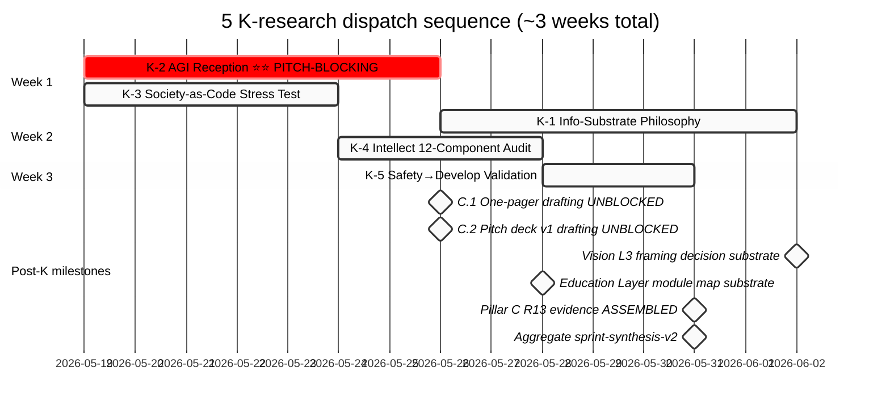

# LAUNCHER — 5 K-Research Runs

> **Что это.** Copy-paste launcher для 5 K-research deep runs (K-1 Info-Substrate Philosophy / K-2 AGI Reception Market ⭐⭐ PITCH-BLOCKING / K-3 Society-as-Code Stress Test / K-4 Intellect 12-Component Audit / K-5 Safety→Develop Validation). Все 5 prompts + EXPLAIN siblings ready. Ruslan executes commands.

> **Sequence:** K-2+K-3 Week 1 (K-2 = pitch-blocking critical path) → K-1+K-4 Week 2 → K-5 Week 3. Все parallel-safe (different namespaces; no interdependencies).

> **Constitutional posture.** R1 + R6 + R11 + R12 + IP-1 (STRICT для K-2 + К-5) + EP-5 + append-only + FPF-lens-FIRST + breadth-NOT-selection preserved across all 5. Foundation / Pillar C / Schemas / VISION-FUNDAMENTAL / 8 Octagon LOCK content READ-ONLY across all 5.

---

## §0 Pre-flight checks (run ONCE before each launch wave)

```bash
cd ~/jetix-os && \
git pull --rebase --autostash && \
git log --oneline -7 && \
tmux ls 2>/dev/null || echo "(no existing sessions)" && \
mkdir -p logs && \
echo "Ready"
```

**Expected output:**
- `git pull` returns Already up to date OR pulls latest
- Last 7 commits include meta-prompt + 5 K-research prompts + EXPLAIN
- tmux session list (empty OK at start)
- `logs/` directory ready

---

## §1 Week 1 — Launch K-2 + K-3 NOW (parallel)

### Run K-2 — AGI Reception Market ⭐⭐ PITCH-BLOCKING (1 week)

```bash
tmux new -s k2-agi "claude --dangerously-skip-permissions"
```

Attach + paste prompt:
```bash
tmux attach -t k2-agi
```

```
ultrathink. Прочитай _EXPLAIN-k-2-agi-reception-market-deep-2026-05-19.md и prompts/k-2-agi-reception-market-deep-2026-05-19.md. IP-1 STRICT throughout — «AGI = collective substrate» = abstract pattern; Jetix instance = RUSLAN-LAYER. Выполни все автономно, 8 phases, per-phase commit, final push origin main. Ruslan acked. Не пауза.
```

Detach: `Ctrl-b` → `d`

**Scope:** Big Labs (OpenAI/Anthropic/DeepMind/SSI/xAI) AGI statements + critics (Ng/LeCun/Hutter/Sutton/Marcus/Chollet) + alt-frames (Wolfram/Plurality/Sapienship) + L1/L2/L3 reception simulation + ≥5 competitors + 25-35 H bank + 3-tier pitch framing recommendations + C.1/C.2 substrate ready.
**Namespace:** `research/agi-reception-market-deep-2026-05-19/`
**Duration:** ~1 week wall / <€3.50
**Critical caveats:** IP-1 STRICT; PITCH-BLOCKING (unblocks C.1 + C.2)

---

### Run K-3 — Society-as-Code Stress Test (4-5 days; parallel)

```bash
tmux new -s k3-society "claude --dangerously-skip-permissions"
```

Attach + paste prompt:
```bash
tmux attach -t k3-society
```

```
ultrathink. Прочитай _EXPLAIN-k-3-society-as-code-stress-test-2026-05-19.md и prompts/k-3-society-as-code-stress-test-2026-05-19.md. Phase 5 breakdown analysis ≥5 failure modes критично; counter-argument inventory обязателен. Выполни все автономно, 8 phases, per-phase commit, final push origin main. Ruslan acked. Не пауза.
```

Detach: `Ctrl-b` → `d`

**Scope:** Toffler/Castells/Lessig deep mining + adjacent Meadows/Boyd/Vinge + breakdown analysis ≥5 failure modes + counter-argument inventory + Jetix differentiation + 3 positioning options A/B/C (lean-in/qualify/pivot) + 20-30 H bank.
**Namespace:** `research/society-as-code-stress-test-2026-05-19/`
**Duration:** 4-5 days wall / <€3

---

### Verify both running:
```bash
tmux ls
# Expected: k2-agi + k3-society sessions
```

---

## §2 Week 2 — Launch K-1 + K-4 (parallel; after K-2 + K-3 complete)

### Pre-Week-2 checks
```bash
cd ~/jetix-os && \
git pull --ff-only && \
ls research/agi-reception-market-deep-2026-05-19/99-SUMMARY-FOR-RUSLAN.md 2>/dev/null && \
ls research/society-as-code-stress-test-2026-05-19/99-SUMMARY-FOR-RUSLAN.md 2>/dev/null && \
echo "K-2 + K-3 outputs present; ready for Week 2"
```

### Run K-1 — Info-Substrate Philosophy Deep (~1 week)

```bash
tmux new -s k1-substrate "claude --dangerously-skip-permissions"
```

Внутри:
```
ultrathink. Прочитай _EXPLAIN-k-1-info-substrate-philosophy-deep-2026-05-19.md и prompts/k-1-info-substrate-philosophy-deep-2026-05-19.md. Phase 6 opposing schools (materialism/dualism/functionalism/pansychism/phenomenology) обязательны. Выполни все автономно, 8 phases, per-phase commit, final push origin main. Ruslan acked. Не пауза.
```

Detach: `Ctrl-b` → `d`

**Scope:** Wheeler «It from Bit» + Wolfram «Computational Universe» + Floridi «Philosophy of Information» + Bateson «Mind and Nature» + adjacent Shannon/Wiener/von Foerster + ≥4 opposing schools + 3 Jetix positioning options + 20-30 H bank + Vision narrative L3 framing substrate.
**Namespace:** `research/info-substrate-philosophy-deep-2026-05-19/`
**Duration:** ~1 week wall / <€3.50

---

### Run K-4 — Intellect 12-Component Audit (3-4 days; parallel)

```bash
tmux new -s k4-intellect "claude --dangerously-skip-permissions"
```

Внутри:
```
ultrathink. Прочитай _EXPLAIN-k-4-intellect-12-component-audit-2026-05-19.md и prompts/k-4-intellect-12-component-audit-2026-05-19.md. Phase 5 gap analysis ≥3 missing components обязателен. Выполни все автономно, 8 phases, per-phase commit, final push origin main. Ruslan acked. Не пауза.
```

Detach: `Ctrl-b` → `d`

**Scope:** Sternberg Triarchic + CHC + Gardner + AI capability frameworks (ARC-AGI/HELM/MMLU) + EI + Deary + gap analysis ≥3 missing components + curriculum module map (12 components → modules) + 3 design options + 20-30 H bank.
**Namespace:** `research/intellect-12-component-audit-2026-05-19/`
**Duration:** 3-4 days wall / <€2.50

---

### Verify Week 2 running:
```bash
tmux ls
# Expected: k1-substrate + k4-intellect sessions (k2-agi + k3-society should be DONE)
```

---

## §3 Week 3 — Launch K-5 (single; after K-1 + K-4 complete)

### Pre-Week-3 checks
```bash
cd ~/jetix-os && \
git pull --ff-only && \
ls research/info-substrate-philosophy-deep-2026-05-19/99-SUMMARY-FOR-RUSLAN.md 2>/dev/null && \
ls research/intellect-12-component-audit-2026-05-19/99-SUMMARY-FOR-RUSLAN.md 2>/dev/null && \
echo "K-1 + K-4 outputs present; ready for Week 3"
```

### Run K-5 — Safety→Develop Cross-Disciplinary Validation (3 days)

```bash
tmux new -s k5-safety "claude --dangerously-skip-permissions"
```

Внутри:
```
ultrathink. Прочитай _EXPLAIN-k-5-safety-develop-validation-2026-05-19.md и prompts/k-5-safety-develop-validation-2026-05-19.md. R1 STRICT + R2 STRICT — NO autonomous Pillar C R13 LOCK promotion. AWAITING-APPROVAL packet substrate = DRAFT в research/ только; NOT placed в swarm/awaiting-approval/. Phase 6 counter-cases ≥3 обязательно. Выполни все автономно, 8 phases, per-phase commit, final push origin main. Ruslan acked. Не пауза.
```

Detach: `Ctrl-b` → `d`

**Scope:** Maslow hierarchy + Google SRE error budget + Toyota Jidoka + Knight Risk-vs-Uncertainty + Taleb Antifragile/Black Swan + adjacent NASA/nuclear/aviation/HRO + cross-corroboration + counter-cases ≥3 + Pillar C R13 candidate evidence bundle + AWAITING-APPROVAL packet substrate DRAFT.
**Namespace:** `research/safety-develop-validation-2026-05-19/`
**Duration:** 3 days wall / <€2
**Critical caveats:** R1 STRICT + R2 STRICT (no autonomous LOCK promotion)

---

## §4 Watch progress / Halt / Diagnostic

### Attach к specific run
```bash
tmux attach -t k2-agi          # K-2 (Week 1, PITCH-BLOCKING)
tmux attach -t k3-society      # K-3 (Week 1)
tmux attach -t k1-substrate    # K-1 (Week 2)
tmux attach -t k4-intellect    # K-4 (Week 2)
tmux attach -t k5-safety       # K-5 (Week 3)

# Detach: Ctrl-b → d (session continues)
```

### Tail без attach
```bash
tail -f logs/k2-agi-*.log
tail -f logs/k3-society-*.log
tail -f logs/k1-substrate-*.log
tail -f logs/k4-intellect-*.log
tail -f logs/k5-safety-*.log
```

### Halt session (emergency only)
```bash
# Single session
tmux kill-session -t k2-agi      # replace name as needed

# All current K-research sessions
for sess in k1-substrate k2-agi k3-society k4-intellect k5-safety; do
  tmux kill-session -t $sess 2>/dev/null && echo "killed: $sess" || echo "not running: $sess"
done
```

**When to halt:**
- Constitutional violation (R1/R2/R6/R11/R12/IP-1) reported → halt corresponding run + investigate
- K-5 attempts autonomous R13 LOCK promotion → IMMEDIATE halt + escalate
- K-5 places actual file в `swarm/awaiting-approval/` → IMMEDIATE halt (DRAFT substrate only)
- Cost approaching €5 per run → halt + escalate
- Network issues / API errors >50% → halt + retry later

### Diagnostic
```bash
# Git activity (per-phase commits expected)
git log --oneline -50

# Per-run output verification
ls -la research/agi-reception-market-deep-2026-05-19/
ls -la research/society-as-code-stress-test-2026-05-19/
ls -la research/info-substrate-philosophy-deep-2026-05-19/
ls -la research/intellect-12-component-audit-2026-05-19/
ls -la research/safety-develop-validation-2026-05-19/

# Pull updates from all runs
git pull --ff-only
```

---

## §5 Expected completion

| Run | Duration | Cost | Critical-path |
|---|---|---|---|
| K-2 AGI Reception ⭐⭐ | ~1 week | <€3.50 | PITCH-BLOCKING (C.1 + C.2) |
| K-3 Society-as-Code Stress Test | 4-5 days | <€3 | Positioning stress-test |
| K-1 Info-Substrate Philosophy | ~1 week | <€3.50 | Vision narrative L3 framing |
| K-4 Intellect 12-Component Audit | 3-4 days | <€2.50 | Education Layer curriculum |
| K-5 Safety→Develop Validation | 3 days | <€2 | Pillar C R13 candidate evidence |
| **Total** | **~3 weeks wall** | **<€14.50** | — |

---

## §6 Post-completion

### After K-2 + K-3 (end of Week 1):
1. Pull updates: `cd ~/jetix-os && git pull --ff-only`
2. Read K-2 Summary: `cat research/agi-reception-market-deep-2026-05-19/99-SUMMARY-FOR-RUSLAN.md`
3. Read K-3 Summary: `cat research/society-as-code-stress-test-2026-05-19/99-SUMMARY-FOR-RUSLAN.md`
4. **C.1 one-pager + C.2 pitch deck v1 drafting NOW UNBLOCKED** (per batch-5 §8)
5. Ruslan-authored Direction Card monetization (D-1 from Platform v2)
6. Optional: review K-3 positioning A/B/C tradeoffs + decide positioning ack

### After K-1 + K-4 (end of Week 2):
1. Pull updates
2. Read K-1 Summary (Vision narrative L3 framing options A/B/C)
3. Read K-4 Summary (curriculum module map + 3 design options)
4. Vision narrative L3 framing decision substrate ready
5. Education Layer Tier 1 module map substrate ready

### After K-5 (end of Week 3):
1. Pull updates
2. Read K-5 Summary
3. Review R13 candidate evidence bundle + AWAITING-APPROVAL packet substrate DRAFT
4. Decide: promote R13 к actual AWAITING-APPROVAL packet? (Ruslan acks)
5. If promoted: create actual `swarm/awaiting-approval/r13-safety-develop-2026-XX-XX.md`

### After all 5 K-research complete (post-Week 3):
1. Aggregate: новый `sprint-synthesis-v2` (mirror sprint-synthesis-2026-05-19 pattern)
2. All 6 promotion package docs drafting unlocked
3. Step 6 Master Packaging closure
4. Cleanup tmux sessions

```bash
for sess in k1-substrate k2-agi k3-society k4-intellect k5-safety; do
  tmux kill-session -t $sess 2>/dev/null && echo "cleaned: $sess"
done
```

---

## §7 Sequence map



---

## §8 Constitutional preservation check

Per-run halt conditions enforced (per prompts §11):
- R1 violation → halt + escalate
- R2 Foundation read-only violation → halt + escalate (especially K-5: NO autonomous R13 LOCK)
- R6 provenance gap → halt + diagnose
- R11 Default-Deny violation → halt + escalate
- R12 anti-extraction violation → halt + escalate
- IP-1 violation (K-2 STRICT especially) → halt + escalate
- Phase 5/6 cherry-pick (K-1 opposing schools / K-3 breakdown / K-4 gap analysis / K-5 counter-cases) → halt

NOT-modified across all 5 runs:
- Foundation v1.0 / Pillar C 12 rules / shared/schemas / VISION-FUNDAMENTAL
- 8 Octagon LOCK content
- AWAITING-APPROVAL packets content (К-5 substrate DRAFT в research/ only)
- CRM live records (voice-pipeline DRAFT discipline)

---

## §9 Reference index

### Prompts (5 K-research):
- [prompts/k-1-info-substrate-philosophy-deep-2026-05-19.md](prompts/k-1-info-substrate-philosophy-deep-2026-05-19.md)
- [prompts/k-2-agi-reception-market-deep-2026-05-19.md](prompts/k-2-agi-reception-market-deep-2026-05-19.md) ⭐⭐
- [prompts/k-3-society-as-code-stress-test-2026-05-19.md](prompts/k-3-society-as-code-stress-test-2026-05-19.md)
- [prompts/k-4-intellect-12-component-audit-2026-05-19.md](prompts/k-4-intellect-12-component-audit-2026-05-19.md)
- [prompts/k-5-safety-develop-validation-2026-05-19.md](prompts/k-5-safety-develop-validation-2026-05-19.md)

### EXPLAIN siblings (5):
- [_EXPLAIN-k-1-info-substrate-philosophy-deep-2026-05-19.md](_EXPLAIN-k-1-info-substrate-philosophy-deep-2026-05-19.md)
- [_EXPLAIN-k-2-agi-reception-market-deep-2026-05-19.md](_EXPLAIN-k-2-agi-reception-market-deep-2026-05-19.md) ⭐⭐
- [_EXPLAIN-k-3-society-as-code-stress-test-2026-05-19.md](_EXPLAIN-k-3-society-as-code-stress-test-2026-05-19.md)
- [_EXPLAIN-k-4-intellect-12-component-audit-2026-05-19.md](_EXPLAIN-k-4-intellect-12-component-audit-2026-05-19.md)
- [_EXPLAIN-k-5-safety-develop-validation-2026-05-19.md](_EXPLAIN-k-5-safety-develop-validation-2026-05-19.md)

### Meta + parent pattern:
- [prompts/meta-generate-5-k-research-prompts-2026-05-19.md](prompts/meta-generate-5-k-research-prompts-2026-05-19.md) (this meta-run parent)
- [prompts/ml-ai-engineers-deep-research-2026-05-18.md](prompts/ml-ai-engineers-deep-research-2026-05-18.md) (gold standard pattern)
- [_EXPLAIN-ml-ai-engineers-deep-research-2026-05-18.md](_EXPLAIN-ml-ai-engineers-deep-research-2026-05-18.md) (gold standard EXPLAIN)

### Voice anchors (batch-5):
- [raw/voice-memos-2026-05-19-batch/audio_689@19-05-2026_03-35-50.md](raw/voice-memos-2026-05-19-batch/audio_689@19-05-2026_03-35-50.md) (society-as-code)
- [raw/voice-memos-2026-05-19-batch/audio_690@19-05-2026_04-05-57.md](raw/voice-memos-2026-05-19-batch/audio_690@19-05-2026_04-05-57.md) ⭐⭐ KEYSTONE (info-substrate / AGI / safety-develop)
- [raw/voice-memos-2026-05-19-batch/audio_691@19-05-2026_04-17-11.md](raw/voice-memos-2026-05-19-batch/audio_691@19-05-2026_04-17-11.md) (intellect 12-component addendum)

### Batch-5 outputs (parent context):
- [reports/voice-pipeline-2026-05-19-batch-5/00-SUMMARY-FOR-RUSLAN.md](reports/voice-pipeline-2026-05-19-batch-5/00-SUMMARY-FOR-RUSLAN.md)
- [reports/voice-pipeline-2026-05-19-batch-5/05-candidates-3-buckets.md](reports/voice-pipeline-2026-05-19-batch-5/05-candidates-3-buckets.md)
- [reports/voice-pipeline-2026-05-19-batch-5/03-9-lenses-cross-analysis.md](reports/voice-pipeline-2026-05-19-batch-5/03-9-lenses-cross-analysis.md)

---

## §10 Acceptance test (self-check before launching)

Ruslan verifies:
- [ ] Cloud Cowork: `cat _LAUNCH-5-K-RESEARCH-2026-05-19.md` opens fine
- [ ] All 5 prompt files exist в `prompts/k-*-deep-2026-05-19.md`
- [ ] All 5 EXPLAIN siblings exist в repo root
- [ ] `tmux` available (`which tmux`)
- [ ] `claude` CLI available (`which claude`)
- [ ] `mkdir -p logs/` succeeds
- [ ] `git pull --rebase --autostash` clean
- [ ] Disk space sufficient (>5GB for all 5 K-runs output + logs)
- [ ] Anthropic API key configured (Max subscription per memory; per `feedback_no_api_keys.md` use built-in WebFetch+WebSearch only)

---

## §11 Жми

**Week 1:** §0 pre-flight, потом §1 K-2 + K-3 launch blocks. Watch progress §4. Wait ~1 week (K-2 dominates).

**Week 2:** §0 pre-flight again, потом §2 K-1 + K-4 launch blocks. Wait ~1 week.

**Week 3:** §0 pre-flight, потом §3 K-5 launch block. Wait 3 days.

**Post-completion:** §6 instructions per wave.

**If problem:** §4 halt commands. Diagnostic via §4. Single-run retry: re-launch corresponding §1-3 block.

**Constitutional posture preserved across all 5 runs:** R1 + R6 + R11 + R12 + IP-1 (STRICT for K-2 + K-5) + EP-5 + breadth-NOT-selection + FPF-lens-FIRST + append-only.

**Ruslan acked.** Brigadier-scribe (R1 surface). 5 K-research runs ready.

---

*Launcher document 2026-05-19 afternoon. brigadier-scribe (R1 surface). Ruslan launches 5 K-runs в 3 waves → reads 5 summaries → C.1+C.2 unblocked + Vision narrative + Education Layer + Pillar C R13 candidate evidence ready.*
