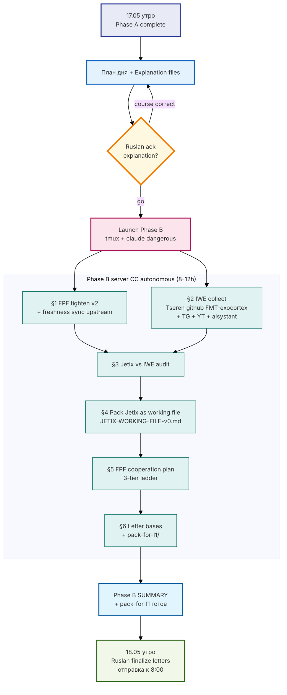

# 📋 План дня — 17.05.2026 (Вс)

## 🎯 Главная цель дня

**Изучить досконально FPF и IWE, сравнить с моей системой, упаковать Jetix как working file, составить план сотрудничества по FPF — и к 8:00 18.05 финальные ответы Левенчуку + Цэрэну готовы к отправке.**

> Тон: «ебало поотваливались» — максимальная плотность качественной проработанной информации. Без дуэма.

---

## 📦 Что у нас есть СЕЙЧАС (state на 17.05 утро)

| Артефакт | Где | Что это |
|---|---|---|
| ✅ Phase A SUMMARY | [`reports/.../00-SUMMARY-FOR-RUSLAN.md`](reports/fpf-iwe-distillation-2026-05-17/00-SUMMARY-FOR-RUSLAN.md) | 2048 слов, top-line что есть FPF + честный self-audit Jetix vs Левенчуковский bar |
| ✅ FPF understanding base | [`reports/.../01-fpf-on-human-language.md`](reports/fpf-iwe-distillation-2026-05-17/01-fpf-on-human-language.md) | 462 строки, FPF на человеческом языке (5 primitives + 7 mechanisms + 10-step intelligence amplification) |
| ✅ IWE understanding base | [`reports/.../02-u-episteme-and-iwe.md`](reports/fpf-iwe-distillation-2026-05-17/02-u-episteme-and-iwe.md) | Conceptual mapping IWE как FPF-applied |
| ✅ Honest self-audit Jetix vs FPF | [`reports/.../06-honest-self-audit.md`](reports/fpf-iwe-distillation-2026-05-17/06-honest-self-audit.md) | ~27 memory/automation vs ~12 intelligence/FPF-derivative компонентов |
| ✅ 12 mermaid diagrams | [`reports/.../diagrams/`](reports/fpf-iwe-distillation-2026-05-17/diagrams/) | FPF architecture / IWE / intellect-stack / etc. |
| ✅ Левенчуковское TG message | [`inbox/levenchuk-tg-2026-05-17.md`](inbox/levenchuk-tg-2026-05-17.md) | Verbatim + C1-C7 surface'нутые claims |
| ✅ Канонический FPF source | [`raw/external/ailev-FPF/FPF-Spec.md`](raw/external/ailev-FPF/FPF-Spec.md) | 62K строк, vendored 20.04 |
| 🆕 **Tseren GitHub** | `github.com/TserenTserenov/FMT-exocortex-template` | **IWE template — Tseren's public artifact** (нашли только что, ещё не обработано) |

---

## 🎯 Что получим к 8:00 18.05 (целевое состояние)

| Артефакт | Где будет | Назначение |
|---|---|---|
| FPF tighten v2 | `reports/.../01-fpf-on-human-language-v2.md` | Refined FPF understanding на «человеческом языке», ready для L1 |
| IWE deep collection | `reports/iwe-deep-collection-2026-05-17.md` | Все материалы IWE (Tseren github + TG + YT + LJ + aisystant) выжаты |
| Jetix vs IWE audit | `reports/jetix-vs-iwe-audit-2026-05-17.md` | Mirror self-audit Phase A, но vs IWE |
| **Jetix как working file** | `JETIX-WORKING-FILE-v0-2026-05-17.md` (root) | Single navigable artifact в стиле `github.com/ailev/FPF` или Tseren IWE template |
| FPF cooperation plan | `outreach/JETIX-FPF-COOPERATION-PLAN-2026-05-17.md` | 3-tier ladder сотрудничества (light/medium/deep) |
| Letter base Левенчуку | `outreach/levenchuk-response-base-2026-05-17.md` | Content blocks для финального ответа (Ruslan-authored) |
| Letter base Цэрэну | `outreach/tseren-response-base-2026-05-17.md` | Content blocks для финального ответа (Ruslan-authored) |
| **Pack for L1** | `outreach/pack-for-l1-2026-05-17/` | Готовая папка артефактов которые Ruslan скидывает |

---

## 🛠️ Какие prompts сегодня запускаем

### Сегодня — **ОДИН** prompt: **Phase B**

- **Prompt file:** [`prompts/fpf-iwe-phase-b-2026-05-17.md`](prompts/fpf-iwe-phase-b-2026-05-17.md)
- **Explanation file (ОБЯЗАТЕЛЬНО ЧИТАТЬ ПЕРВЫМ):** [`_EXPLAIN-PHASE-B-PROMPT-2026-05-17.md`](_EXPLAIN-PHASE-B-PROMPT-2026-05-17.md)
- **Time estimate:** 8-12 часов autonomous server CC
- **Inside:** 6 sequential шагов (FPF tighten → IWE collect → vs IWE audit → pack Jetix → cooperation plan → letter bases)

**Почему ОДИН prompt а не 6 разных:** шаги имеют чёткие зависимости (§2 → §3 → §4 → §5 → §6), splitting на 6 promptov добавит overhead context loading × 6 без выгоды. Один autonomous run = эффективнее. Если в середине Ruslan хочет course correct — interrupt + relaunch с new prompt.

### Завтра утром (после Phase B finish):
- **Letter finalization** — Ruslan-authored, не отдельный server CC prompt (это его работа)
- **Pack отправка** — Ruslan-authored

---

## 🗺️ Flow дня (mermaid)

---

## 📂 Файлы дня в repo (Antigravity-friendly)

- 📋 **[`_PLAN-OF-DAY-2026-05-17.md`](_PLAN-OF-DAY-2026-05-17.md)** ← этот файл, общий план
- 📖 **[`_EXPLAIN-PHASE-B-PROMPT-2026-05-17.md`](_EXPLAIN-PHASE-B-PROMPT-2026-05-17.md)** — explanation Phase B prompt'a (ОБЯЗАТЕЛЬНО)
- 📅 **[`_DAILY-LOG-2026-05-17.md`](_DAILY-LOG-2026-05-17.md)** — Antigravity-friendly copy of Notion daily log
- 🛠️ **[`prompts/fpf-iwe-phase-b-2026-05-17.md`](prompts/fpf-iwe-phase-b-2026-05-17.md)** — сам prompt

Notion mirror: [🎯 17.05.2026 — Вс](https://www.notion.so/3632496333bf81328397dc98e0451f3c) (sandbox view; primary working layer — здесь в repo)

---

## ⚠️ Что НЕ делаем сегодня

- НЕ запускаем prompt пока Ruslan не прочитал `_EXPLAIN-PHASE-B-PROMPT-2026-05-17.md` и не дал go
- НЕ trogат Foundation paths (R2)
- НЕ отвечаем Левенчуку / Цэрэну ДО finishing §1-§5
- НЕ начинаем новые направления вне §1-§6 Phase B
- НЕ перфекционим — beta-первый
