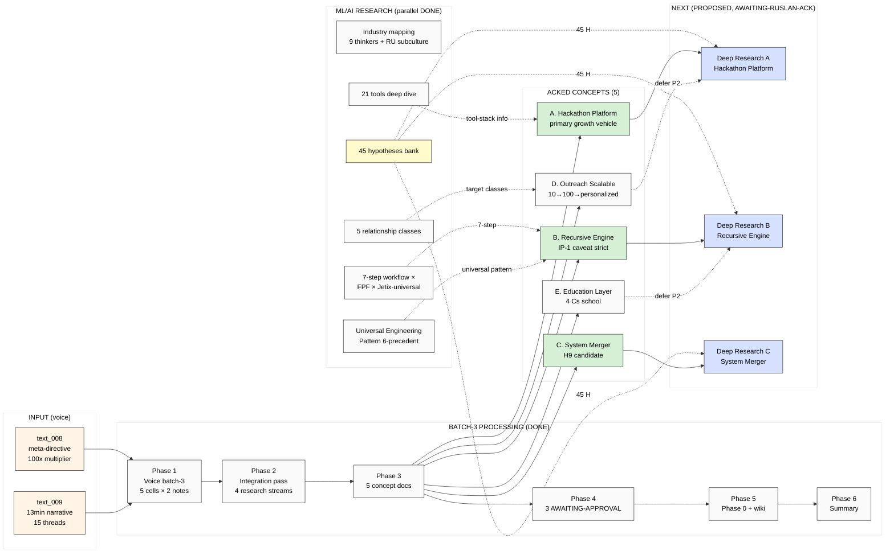
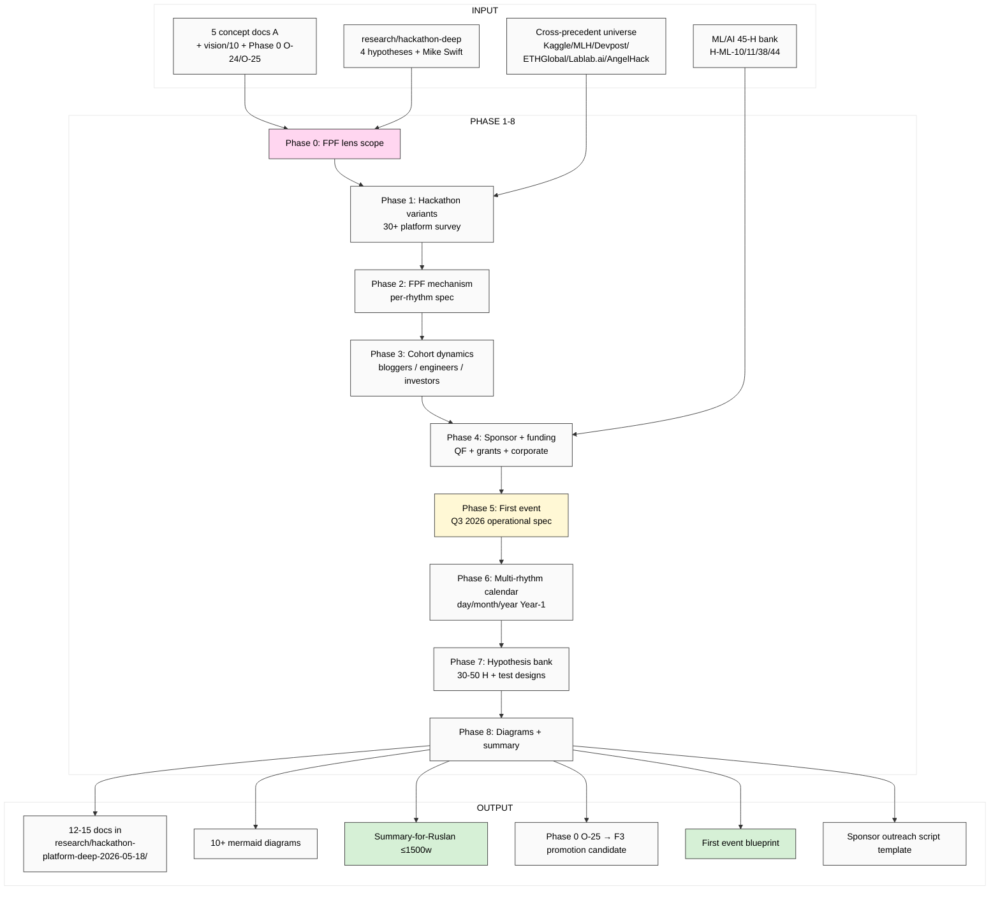
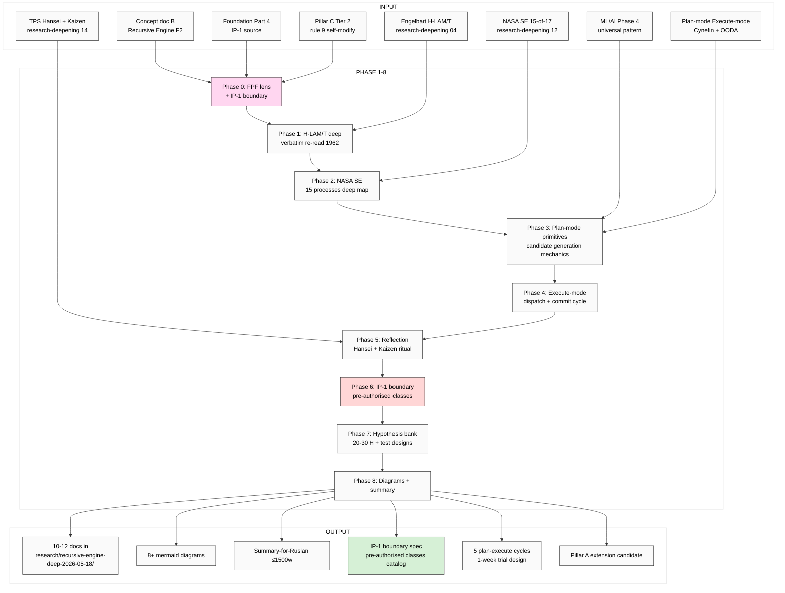
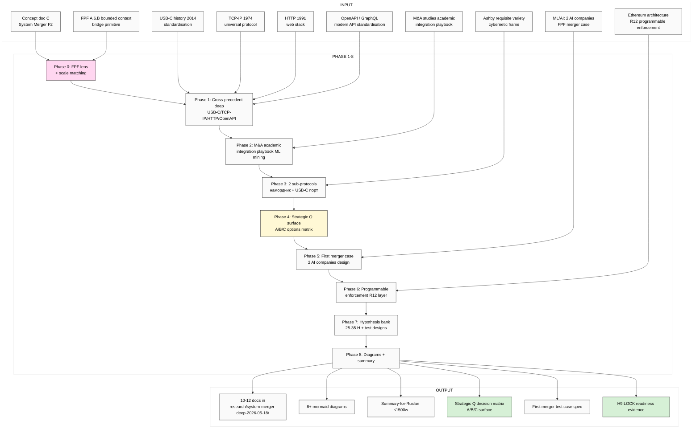
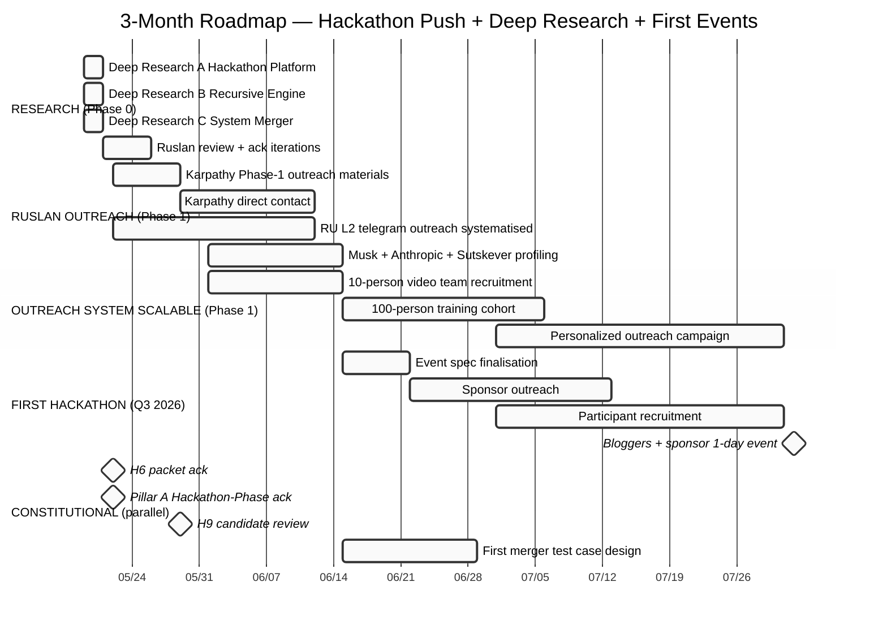

# MASTER PICTURE — Next Steps after batch-3 + ML/AI research

> **Что это.** Полная картина после двух завершённых server CC runs (batch-3 hackathon integration + ML/AI engineers deep research). Carefully orchestrated synthesis: current state landscape → causation flow → 3 deep research runs план. **7 mermaid диаграмм** для visual scan.

> **Не decisions.** R1 surface only — все strategic картинки = brigadier-organised от Ruslan voice + LOCKED canonical. Ruslan ack для launch deep research runs.

---

## §0 TL;DR (≤300 слов)

После двух completed runs Jetix landscape выглядит так: **5 acked-by-Ruslan strategic concept docs (Hackathon Platform / Recursive Engine / System Merger / Outreach Scalable / Education Layer)** + **45 testable hypotheses** в ML research bank + **3 AWAITING-APPROVAL packets** (H6 / Pillar A Hackathon-Phase / H9 candidate) + **Phase 0 inventory расширен** до 18 objects (14 baseline + 4 candidates O-25-28; O-29 ML substrate surface).

**Что вытекает критически:** все 3 acked concept docs = **F2 surface** (single-voice Ruslan verbatim + brigadier-structured + 5-cell). Для promotion к F3+ нужны:
- **Deep research per concept** (variants / cross-precedents / mechanism formalisation / FPF lens depth / hypotheses bank per concept)
- **Operational specifications** (что именно делаем в Q3 2026 first event / IP-1 boundary cases / first merger test case)
- **Integration с ML/AI 45-H bank** (45 hypotheses ML research cross-fertilise все 3 concepts)

**Что предлагаю:** 3 parallel deep research runs (mirror pattern ml-ai-engineers research):
1. **Hackathon Platform Deep Research** — все variants + cross-precedent triangulation + FPF Workshop integration spec
2. **Recursive Self-Development Engine Deep Research** — IP-1 mechanics + Engelbart H-LAM/T + NASA SE + plan/execute primitives formalised
3. **System Merger Protocol Deep Research** — FPF M&A spec + USB-C/TCP-IP/HTTP cross-precedent + first merger test case design

**Constitutional preserved:** Foundation v1.0 + Pillar C 12 rules + 8 Octagon LOCK content + shared/schemas + VISION-FUNDAMENTAL = NOT modified ни в одном run. R1 + R2 + R6 + R11 + EP-5 + append-only enforced.

**Timeline предложение:** 3 runs parallel (different namespaces no conflict); 120-180 min each; combined cost <€10; ETA сегодня evening Berlin если запустить сейчас.

---

## §1 Current State Landscape (Diagram 1)

```mermaid
%%{init: {'theme':'base', 'themeVariables': {'primaryTextColor':'#000000','textColor':'#000000','lineColor':'#333333','primaryBorderColor':'#333333','primaryColor':'#fafafa','noteTextColor':'#000000','noteBkgColor':'#fff8d5','edgeLabelBackground':'#ffffff'}}}%%
graph TB
    subgraph "FOUNDATION (LOCKED 2026-04-28)"
        F1[Foundation v1.0<br/>11 Parts + Pillar A/C]
        F2[Pillar C Tier 2<br/>12 rules]
        F3[shared/schemas<br/>F8 contracts]
        F4[VISION-FUNDAMENTAL<br/>constitutional parent]
    end

    subgraph "STRATEGIC INSIGHTS — OCTAGON LOCKED"
        H1[H1 Foundation Model]
        H2[H2 Partnership Model]
        H4[H4 Balaji Network State]
        H5[H5 Tyson Mentorship]
        H6[H6 Gamified Platform]
        H7[H7 People-NS]
        H8[H8 Trust Infrastructure 17.05]
    end

    subgraph "CANONICAL DOCS LOCKED"
        D1[Doc 1A Base Management]
        D2[Doc 1B Jetix Corporation]
        DW[JETIX-WORKSHOP-CONCEPT]
        DC[JETIX-FIRST-CLAN-CHARTER]
        DA[ACTION-PLAN-PHASE-1]
        DE[JETIX-ETHEREUM-ARCHITECTURE 18.05]
    end

    subgraph "VOICE ANCHORS (May 2026)"
        T1[text_001-004 17.05 evening]
        T5[text_005-007 18.05 morning]
        T8[text_008-009 18.05 evening<br/>HACKATHON PUSH]
    end

    subgraph "BATCH-3 OUTPUT (acked)"
        C1[JETIX-AS-HACKATHON-PLATFORM ✓]
        C2[JETIX-RECURSIVE-ENGINE ✓]
        C3[JETIX-SYSTEM-MERGER-PROTOCOL ✓]
        C4[JETIX-OUTREACH-SYSTEM-SCALABLE]
        C5[JETIX-EDUCATION-LAYER]
        V[vision/10-13 companions]
    end

    subgraph "ML/AI RESEARCH OUTPUT"
        ML1[12 docs + 10 mermaid]
        ML2[45 hypotheses bank]
        ML3[Universal Engineering Pattern]
        ML4[5 Jetix-relationship classes]
    end

    subgraph "AWAITING-APPROVAL PACKETS"
        P1[H6 operational pre-eminence]
        P2[Pillar A Hackathon-Phase]
        P3[H9 candidate Strategic Insight]
    end

    subgraph "PHASE 0 INVENTORY"
        I1[14 baseline objects]
        I2[O-21-23 acked Phase 0+]
        I3[O-24 Hackathon hypothesis]
        I4[O-25 Hackathon Platform candidate]
        I5[O-26 System Merger candidate]
        I6[O-27 Education Layer candidate]
        I7[O-28 Outreach System candidate]
        I8[O-29 ML substrate candidate]
    end

    F1 -.->|substrate| H1
    F1 -.->|substrate| H6
    H6 -.->|operational| C1
    H7 -.->|clan-wars| C1
    H8 -.->|trust| C2
    T8 -->|verbatim| C1
    T8 -->|verbatim| C2
    T8 -->|verbatim| C3
    T8 -->|verbatim| C4
    T8 -->|verbatim| C5
    C1 -.->|extends| I4
    C3 -.->|extends| I5
    C5 -.->|extends| I6
    C4 -.->|extends| I7
    ML1 -.->|extends| I8
    C1 -.->|requires| P1
    C1 -.->|requires| P2
    C3 -.->|H9 candidate| P3
    ML2 -.->|cross-fertilise| C1
    ML2 -.->|cross-fertilise| C2
    ML2 -.->|cross-fertilise| C3
    DE -.->|substrate overlay| C1

    style F1 fill:#ffd6d6,color:#000
    style F2 fill:#ffd6d6,color:#000
    style F3 fill:#ffd6d6,color:#000
    style F4 fill:#ffd6d6,color:#000
    style C1 fill:#d6f0d6,color:#000
    style C2 fill:#d6f0d6,color:#000
    style C3 fill:#d6f0d6,color:#000
    style T8 fill:#fff4e6,color:#000
    style P1 fill:#fff8d5,color:#000
    style P2 fill:#fff8d5,color:#000
    style P3 fill:#fff8d5,color:#000
```

**Legend:**
- 🔴 Red = Foundation LOCKED (R2 read-only)
- 🟢 Green = Acked by Ruslan (ready для deep research)
- 🟡 Yellow = Awaiting Ruslan ack
- 🟠 Orange = Voice anchors (Ruslan strategic source)

---

## §2 Causation Flow (Diagram 2) — text_008-009 → концепты → deep research

---

## §3 Deep Research A — Hackathon Platform (Diagram 3)

### §3.1 Scope FPF lens

ЧТО research'им через FPF:
- **Hackathon-as-system** (U.System holonic; A.1 supersystem = Jetix platform)
- **Hackathon-as-method** (U.Method + A.3.1 multi-rhythm cycles)
- **Hackathon-as-event-class** (A.15 Work × A.16 Process per event)
- **Hackathon-as-cohort-mechanism** (A.2 Role assignment / U.SpeechAct outreach)

### §3.2 Research scope (8 phases mirror ml-ai-engineers pattern)

### §3.3 Key deep questions

1. Какие 3-5 рhythm-variants (day/weekend/week/month/quarter/year) под Jetix?
2. Per-rhythm: typical participants count / mentor count / output type / FPF primitive load?
3. Cross-precedent: что Kaggle/MLH/Devpost/ETHGlobal делают хорошо vs gap?
4. First event operational spec: Q3 2026 / bloggers + sponsor / 1-day rhythm / 20-50 participants?
5. Sponsor funding mechanism: QF / grants / corporate / hybrid?
6. Participant recruitment: 10-people video team → 100 trained → personalized (concept D)?
7. Mentor recruitment: ROY swarm + RU L2 telegram leaders + Master Workshop candidates?
8. Output ownership: participant IP retained? R12 anti-extraction enforced via fork-and-leave?
9. Multi-clan integration: clan-wars hackathons mode (charter §APPEND)?
10. Phase 0 O-25 mechanism formalisation: vapor → operational spec criteria?

### §3.4 Estimated output
- 12-15 docs / 10+ mermaid / 30-50 hypotheses
- Duration: 120-180 min
- Cost: <€3.50
- Namespace: `research/hackathon-platform-deep-2026-05-18/`

**See sibling:** `_EXPLAIN-hackathon-platform-deep-research-2026-05-18.md` для phase-by-phase detail.

---

## §4 Deep Research B — Recursive Self-Development Engine (Diagram 4)

### §4.1 IP-1 frame (CRITICAL)

«System develops itself» (Ruslan text_009 ¶1) **MUST** be carefully framed throughout:
- **NOT** autonomous runtime self-modification (Pillar C Tier 2 rule 9 violation)
- **YES** brigadier surfaces direction candidates → Ruslan acks → execution proceeds
- Engine = pattern of recursion; Owner = Ruslan = sole strategist

### §4.2 Research scope

### §4.3 Key deep questions

1. Engelbart H-LAM/T verbatim 1962: 4-tuple (Human / Language / Artefacts / Methodology / Training); как именно операционализируется?
2. NASA SE 15-of-17 processes: какие именно map к Jetix plan-mode vs execute-mode?
3. Plan-mode primitive operations: surface candidate / dissent preserve / F-G-R per claim / AWAITING-APPROVAL escalation?
4. Execute-mode primitive operations: dispatch / commit / log / push?
5. IP-1 boundary catalog: какие action classes pre-authorised (autonomous) vs Default-Deny (escalate)?
6. 5 plan-execute cycles 1-week trial: design + acceptance criteria + falsifiability?
7. Hansei + Kaizen ritual operationalisation: weekly retrospective format + improvement queue?
8. Snowball effect mechanism: alignment threshold → spontaneous acceleration (Ruslan text_009 «как ракета запустится»)?
9. NASA framework integration: life-as-spaceship (Thread 8) operational?
10. Pillar A Strategic Direction Substrate: какой extension candidate (если applicable)?

### §4.4 Estimated output
- 10-12 docs / 8+ mermaid / 20-30 hypotheses
- Duration: 100-150 min
- Cost: <€3
- Namespace: `research/recursive-engine-deep-2026-05-18/`

**See sibling:** `_EXPLAIN-recursive-self-development-engine-deep-research-2026-05-18.md`

---

## §5 Deep Research C — System Merger Protocol (Diagram 5)

### §5.1 Strategic Q surface

Open Q из concept doc C: **Jetix как outsource OR Jetix как platform-companies-come-to OR Hybrid?** Deep research surface options, Ruslan picks.

### §5.2 Research scope

### §5.3 Key deep questions

1. USB-C history 2014: какой именно протокол / mechanism / governance дал adoption velocity?
2. TCP-IP 1974: universal protocol survival 50+ лет — что урок?
3. HTTP 1991: web stack network effect mechanism?
4. OpenAPI / GraphQL: modern API standardisation pattern?
5. M&A academic literature: top 5 integration failure modes? top 5 success patterns?
6. «Намордник» process formalisation: constraint set / commitment / enforcement / audit?
7. «USB-C порт переделка» formalisation: bridge layer specification / FPF translation rules?
8. Strategic Q decision matrix: outsource vs platform vs hybrid — criteria для выбора?
9. First merger case design: 2 hypothetical AI companies, FPF mediation, success metrics?
10. R12 anti-extraction across merger boundary: programmable enforcement spec?
11. H9 candidate LOCK readiness: какое evidence threshold для promotion?
12. FPF primitive U.System merger candidate: surface для FPF-Steward review (направить Левенчуку?)?

### §5.4 Estimated output
- 10-12 docs / 8+ mermaid / 25-35 hypotheses
- Duration: 120-180 min
- Cost: <€3.50
- Namespace: `research/system-merger-deep-2026-05-18/`

**See sibling:** `_EXPLAIN-system-merger-protocol-deep-research-2026-05-18.md`

---

## §6 Cross-Research Integration (Diagram 6) — ML/AI 45-H weaving

ML/AI research 45 hypotheses bank cross-fertilises все 3 deep research runs:

```mermaid
%%{init: {'theme':'base', 'themeVariables': {'primaryTextColor':'#000000','textColor':'#000000','lineColor':'#333333','primaryBorderColor':'#333333','primaryColor':'#fafafa','noteTextColor':'#000000','noteBkgColor':'#fff8d5','edgeLabelBackground':'#ffffff'}}}%%
graph TB
    subgraph "ML/AI 45 HYPOTHESES BANK"
        MH1[H-ML-1-10<br/>Industry hypotheses]
        MH2[H-ML-11-25<br/>Tool hypotheses]
        MH3[H-ML-26-35<br/>Methodology hypotheses]
        MH4[H-ML-36-45<br/>Jetix integration]
    end

    subgraph "HACKATHON DEEP RESEARCH"
        HA1[H-ML-10 hackathon platform fit]
        HA2[H-ML-38 ML talent surfacing]
        HA3[H-ML-44 RU community hackathon]
        HA4[H-ML-39 Karpathy outreach<br/>via hackathon framing]
    end

    subgraph "RECURSIVE ENGINE DEEP RESEARCH"
        RE1[H-ML-13 Optuna HPO<br/>parallels brigadier dispatch]
        RE2[H-ML-26 ML 7-step<br/>= universal pattern]
        RE3[H-ML-27 NASA SE + ML<br/>+ FPF same root]
        RE4[H-ML-29 Hansei+Kaizen<br/>ritual operationalisation]
    end

    subgraph "SYSTEM MERGER DEEP RESEARCH"
        SM1[H-ML-12 HuggingFace hub<br/>= role-attestation primitive]
        SM2[H-ML-22 Sovereign-AI<br/>geo-bias offer]
        SM3[H-ML-37 FPF 5×<br/>onboarding hypothesis]
        SM4[H-ML-43 2 AI companies<br/>FPF merger case]
    end

    MH1 -->|relevant| HA3
    MH1 -->|relevant| SM2
    MH2 -->|relevant| HA1
    MH2 -->|relevant| RE1
    MH2 -->|relevant| SM1
    MH3 -->|relevant| RE2
    MH3 -->|relevant| RE3
    MH3 -->|relevant| RE4
    MH4 -->|relevant| HA2
    MH4 -->|relevant| HA4
    MH4 -->|relevant| SM3
    MH4 -->|relevant| SM4

    style MH1 fill:#fffbcc,color:#000
    style MH2 fill:#fffbcc,color:#000
    style MH3 fill:#fffbcc,color:#000
    style MH4 fill:#fffbcc,color:#000
```

**Integration discipline:** каждый deep research run обязательно cross-references applicable ML/AI hypotheses (per `feedback_breadth_not_selection.md` — preserve breadth NOT collapse к selection).

---

## §7 3-Month Roadmap (Diagram 7)

---

## §8 Constitutional Checklist

| Element | Pre-existing | Will-preserve | Risk in deep runs |
|---|---|---|---|
| Foundation v1.0 LOCKED | ✓ | READ-ONLY enforced | Low (R2 enforced) |
| Pillar C 12 rules | ✓ | READ-ONLY enforced | Low (R2 enforced) |
| 8 Octagon LOCK content | ✓ | §extensions only | Low (append-only) |
| shared/schemas F8 | ✓ | READ-ONLY | Low |
| VISION-FUNDAMENTAL | ✓ | READ-ONLY | Low |
| R1 (Ruslan sole strategist) | ✓ | brigadier-scribe authoring | Critical preserve |
| R6 provenance per claim | ✓ | enforced | Standard |
| R11 Default-Deny | ✓ | enforced | Standard |
| R12 anti-extraction | ✓ | preserved via QF + fork-and-leave | Standard |
| IP-1 Role≠Executor | ✓ | STRICT (recursive engine concern) | Critical preserve |
| EP-5 F-grade disclosure | ✓ | F2 surface predominant | Standard |
| AP-6 dissent preservation | ✓ | preserve, NOT average | Standard |
| Append-only | ✓ | new namespaces only | Standard |
| Breadth NOT selection | ✓ | hypothesis banks 25-50 H each | Critical preserve |
| FPF lens FIRST | ✓ | Phase 0 in each deep run | Critical preserve |

---

## §9 Open Questions для Ruslan (декомпозированные)

### A. Sequencing (4):
1. 3 deep research runs **параллельно** (рекомендация) или **sequentially** (Hackathon first, потом Recursive, потом Merger)?
2. **All 3 сейчас вечером 18.05** OR **разнесём по дням** (19/20/21.05)?
3. Должны ли **Outreach Scalable + Education Layer** тоже получить deep research runs (Phase 2 batch)?
4. Priority: что первое после deep research — packet acks / first hackathon spec / outreach пilot?

### B. Constitutional packets (3):
5. **H6 operational pre-eminence** — ack Option A (recommended)?
6. **Pillar A Hackathon-Phase namespace** — ack Option A (recommended)?
7. **H9 candidate surface** — ack Option A (surface 3 кандидата, no LOCK) или начать LOCK ceremony preparation?

### C. Strategic Q (1 critical):
8. **System Merger** — Jetix как outsource / platform / hybrid? (Strategic Q surface only deep research, или Ruslan picks ahead для focus deep research?)

### D. Operational picks (3):
9. **First hackathon** Q3 2026 — bloggers + sponsor 1-day (per concept A Activation Gantt)?
10. **6 ресурсов** taxonomy — pick из 4 candidate lists (concept D §4) или wait deep research?
11. **Karpathy outreach** timing — после deep research B или параллельно?

---

## §10 Reference Index

### Acked concept docs (3 priority for deep research):
- [JETIX-AS-HACKATHON-PLATFORM-2026-05-18.md](decisions/strategic/JETIX-AS-HACKATHON-PLATFORM-2026-05-18.md) ⭐ acked
- [JETIX-RECURSIVE-SELF-DEVELOPMENT-ENGINE-2026-05-18.md](decisions/strategic/JETIX-RECURSIVE-SELF-DEVELOPMENT-ENGINE-2026-05-18.md) ⭐ acked (IP-1 caveat)
- [JETIX-SYSTEM-MERGER-PROTOCOL-FPF-2026-05-18.md](decisions/strategic/JETIX-SYSTEM-MERGER-PROTOCOL-FPF-2026-05-18.md) ⭐ acked (H9 candidate)

### Surface-only concept docs (Phase 2 batch):
- [JETIX-OUTREACH-SYSTEM-SCALABLE-2026-05-18.md](decisions/strategic/JETIX-OUTREACH-SYSTEM-SCALABLE-2026-05-18.md)
- [JETIX-EDUCATION-LAYER-SYSTEM-THINKING-2026-05-18.md](decisions/strategic/JETIX-EDUCATION-LAYER-SYSTEM-THINKING-2026-05-18.md)

### vision/ companions (4):
- [vision/10-hackathon-platform-recursive-engine.md](vision/10-hackathon-platform-recursive-engine.md)
- [vision/11-outreach-system-scalable.md](vision/11-outreach-system-scalable.md)
- [vision/12-education-layer-base.md](vision/12-education-layer-base.md)
- [vision/13-system-merger-protocol.md](vision/13-system-merger-protocol.md)

### AWAITING-APPROVAL packets (3 packets):
- [h6-hackathon-platform-pre-eminent-2026-05-18.md](swarm/awaiting-approval/h6-hackathon-platform-pre-eminent-2026-05-18.md)
- [pillar-a-hackathon-mode-extension-2026-05-18.md](swarm/awaiting-approval/pillar-a-hackathon-mode-extension-2026-05-18.md)
- [h9-strategic-insight-candidate-2026-05-18.md](swarm/awaiting-approval/h9-strategic-insight-candidate-2026-05-18.md)

### Research streams (DONE — input для deep runs):
- [reports/voice-pipeline-2026-05-18-batch-3/00-SUMMARY-FOR-RUSLAN.md](reports/voice-pipeline-2026-05-18-batch-3/00-SUMMARY-FOR-RUSLAN.md)
- [research/ml-ai-engineers-2026-05-18/99-SUMMARY-FOR-RUSLAN.md](research/ml-ai-engineers-2026-05-18/99-SUMMARY-FOR-RUSLAN.md)
- [research/hackathon-deep-2026-05-18/00-SUMMARY-FOR-RUSLAN.md](research/hackathon-deep-2026-05-18/00-SUMMARY-FOR-RUSLAN.md)
- [research/deepening-2026-05-18/99-SUMMARY-FOR-RUSLAN.md](research/deepening-2026-05-18/99-SUMMARY-FOR-RUSLAN.md)
- [research/harari-jetix-lens-2026-05-18/99-SUMMARY-FOR-RUSLAN.md](research/harari-jetix-lens-2026-05-18/99-SUMMARY-FOR-RUSLAN.md)

### Voice anchors:
- [text_008@2026-05-18_evening.md](raw/voice-memos-2026-05-17-batch/text_008@2026-05-18_evening.md)
- [text_009@2026-05-18_evening.md](raw/voice-memos-2026-05-17-batch/text_009@2026-05-18_evening.md)

### Sibling _EXPLAIN files (3 deep research plans):
- `_EXPLAIN-hackathon-platform-deep-research-2026-05-18.md`
- `_EXPLAIN-recursive-self-development-engine-deep-research-2026-05-18.md`
- `_EXPLAIN-system-merger-protocol-deep-research-2026-05-18.md`

### Prompts (3 deep research):
- `prompts/hackathon-platform-deep-research-2026-05-18.md`
- `prompts/recursive-self-development-engine-deep-research-2026-05-18.md`
- `prompts/system-merger-protocol-deep-research-2026-05-18.md`

---

*Master Picture report 2026-05-18 evening. brigadier-scribe (R1 surface). Ruslan ack required для launch 3 deep research runs.*
