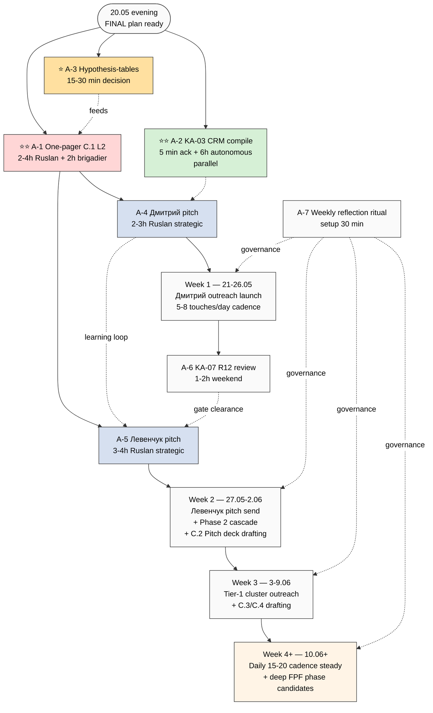
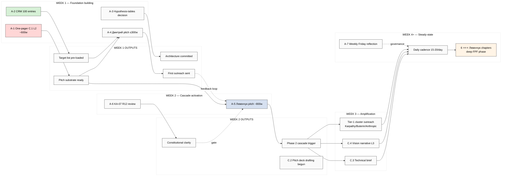
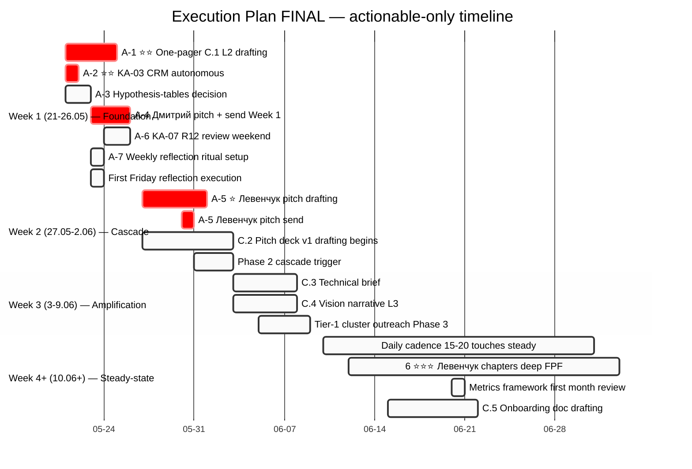
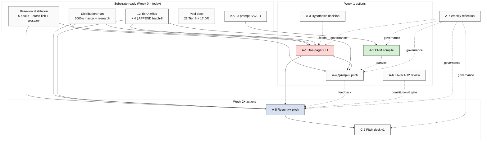

# 🎯 Execution Plan FINAL — actionable-only roadmap

> **Что это:** v2 execution plan **после** Ruslan acks (D8-1..D8-10 admin acks executed; §APPEND wikis done; pool docs Ruslan-acked status). **Только concrete actionable items остались** — нет ack queue. Per item: что есть / что конкретно делать / что получить. **4 mermaid диаграммы** (2 новых: critical path + deliverables funnel).
>
> **Post-acks fixation state (DONE):**
> - ✅ Tier B pool 22 candidates (14 batch-7 + 8 batch-8 O-97..O-104) — Ruslan-acked в pool
> - ✅ Research pool 17 DR candidates (10 batch-7 + 7 batch-8 DR-18..DR-24) — Ruslan-acked в pool
> - ✅ 4 §APPEND wikis (method-systems-thinking + mastery-formula + project-of-humanity + persistence-beats-talent) — voice substrate batch-8 fixated
> - ✅ Constitutional flags HR-1/HR-2/HR-3 — recorded в Daily Log + REFLECTION-INBOX (Ruslan reflection IA-8 scheduled separately)

---

## §0 TL;DR (≤200w)

**7 actionable items** остались после fixation acks:

| # | Action | Type | Time | Priority |
|---|---|---|---|---|
| **A-1** ⭐⭐ | One-pager C.1 L2 drafting | Ruslan strategic prose | 2-4h Ruslan + 2h brigadier | P1 immediate |
| **A-2** ⭐⭐ | KA-03 CRM compile launch (server CC autonomous) | brigadier autonomous | 5 min ack + 6h auto + <€2 | P1 parallel |
| **A-3** ⭐ | Hypothesis-tables architecture decision (5 options) | Ruslan strategic | 15-30 min reflection | P1 decision |
| **A-4** | KA-02 Дмитрий pitch drafting | Ruslan strategic + brigadier | 2-3h Ruslan + 1h brigadier | P1 Week 1 |
| **A-5** | KA-01 Левенчук pitch drafting | Ruslan strategic + brigadier | 3-4h Ruslan + 1h brigadier | P1 Week 2 |
| **A-6** | KA-07 R12 ethical-surface review O-83 | Ruslan reflection | 1-2h | P2 weekend |
| **A-7** | Weekly Friday reflection ritual setup | Ruslan habit | 30 min setup | P2 ongoing |

**Critical path:** A-1 (one-pager) → A-4 (Дмитрий pitch) → Week 1 outreach → A-5 (Левенчук pitch) → Week 2 cascade. A-2 (CRM) parallel autonomous.

**Что у нас есть для execution (substrate ready):**
- 5 Левенчук books distilled (cross-link matrix + 40-term glossary + 5 pitch hooks)
- Distribution Plan ~5000w + 5 research docs + sequence Дмитрий→Левенчук→cascade
- 12 Tier A wikis (3 NEW batch-7 + 4 §APPEND batch-8 voice substrate)
- 22 Tier B + 17 DR pools (cherry-pick готов)
- KA-03 CRM prompt SAVED → ready к launch
- R12 paired-frame discipline + 8-item pre-send checklist (Distribution Plan §6)

---

## §1 Mermaid #1 — Critical path (NEW)



---

## §2 A-1 ⭐⭐ One-pager C.1 L2 drafting

### Что есть (substrate ready)
- **Master Packaging Step 6 spec** (`reports/sprint-synthesis-v2-2026-05-19-evening/04-master-packaging-step6-roadmap.md`) — C.1 L1/L2/L3 audience variants defined
- **Distribution Plan §1** — 6 promotion docs gap analysis (C.1 P1 critical path)
- **5 pitch hooks из Левенчук distillation §4** — verbatim citations ready для L2 audience
- **O-75 Pre-existing Partnership wiki** (canonical positioning baseline)
- **O-86 Project-of-Humanity wiki** + 3-tier funnel §APPEND batch-8 (humanitarian framing)
- **Method-systems-thinking wiki** + meta-method §APPEND batch-8
- **DE-RU terminology glossary 40 entries** (Левенчук bridge terms)
- **R12 paired-frame discipline** (offer + ask mandatory)

### Что конкретно делать (steps)

1. **Brigadier substrate prep (~2h cloud cowork):**
   - Compile evidence pack: 5 pitch hooks + 3 canonical frames + Левенчук cross-cite + Platform v2 §20 templates
   - Output file: `decisions/strategic/ONE-PAGER-C.1-L2-SUBSTRATE-2026-05-20.md`
2. **Ruslan strategic prose drafting (~2-4h):**
   - Read substrate file (~15 min)
   - Draft one-pager L2 variant ~600 words:
     - Hook: «we are working on humanity-level project together» (O-86 frame)
     - Problem: information overload + method gap (Левенчук + Method-Systems-Thinking)
     - Solution: 3-tier education funnel + community (O-75 + 3-tier funnel)
     - Differentiation: 4 Левенчук-cited concepts + K-6 31 components
     - Offer (R12 paired): free учебник + Claude Code access + community
     - Ask (R12 paired): voluntary engagement + feedback
   - 1-2 revision passes
3. **R12 audit pre-publish:**
   - Use Distribution Plan §6 8-item pre-send checklist
   - Verify offer + ask explicit, balanced, voluntary

### Что получить (deliverables)
- `decisions/strategic/ONE-PAGER-C.1-L2-2026-05-20.md` — final one-pager ~600w
- Audience-specific framing tested (L2 amplifier — engineer / methodology community)
- Foundation для A-4 Дмитрий pitch (adapt L2 → L3 humanitarian)
- Foundation для A-5 Левенчук pitch (extend L2 → custom Левенчук-direct)

### Acceptance criteria
- ✅ R12 paired-frame (offer + ask explicit + voluntary)
- ✅ ≥3 Левенчук cross-cites (verbatim quotes / book references)
- ✅ Both Pre-existing Partnership (O-75) frame AND Project-of-Humanity (O-86) frame integrated
- ✅ 3-tier funnel mentioned + R12-compliant per tier
- ✅ ≤600 words (one-pager constraint)
- ✅ Russian primary + English technical terms preserved

### Owner / Time / Dependency
- **Owner:** Ruslan strategic prose (R1 sole strategist) + brigadier substrate compile
- **Time:** 2h brigadier prep + 2-4h Ruslan drafting + 30 min R12 audit = ~5-7h total
- **Dependency:** None (substrate уже ready)
- **Priority:** P1 ⭐⭐ — most immediate

### Cross-link к substrate
- Master Packaging Step 6 §1
- Левенчук distillation §4 5 pitch hooks
- O-75 / O-86 wikis + §APPEND batch-8
- Distribution Plan §1 + §6 R12 checklist

---

## §3 A-2 ⭐⭐ KA-03 CRM compile launch (parallel autonomous)

### Что есть
- **Saved prompt:** `prompts/ka-03-crm-first-pass-100-2026-05-20.md` (batch-7 saved, ready к launch)
- **EXPLAIN:** `prompts/explanations/_EXPLAIN-ka-03-crm-first-pass-100-2026-05-20.md`
- **Platform v2 §6** — 22 Tier-1 baseline (мигрируется в CRM)
- **CRM schema** — `crm/_schema/` + `crm/_templates/`
- **Existing crm/ structure** — minimal current entries (mostly ICP)

### Что конкретно делать (steps)

1. **Ruslan: paste launch команду в Claude Code на server (5 min):**

Запустить новый tmux session:
```bash
tmux new -s ka03 "claude --dangerously-skip-permissions"
```

Paste:
```
ultrathink. Прочитай prompts/ka-03-crm-first-pass-100-2026-05-20.md и prompts/explanations/_EXPLAIN-ka-03-crm-first-pass-100-2026-05-20.md. Выполни все 5 phases автономно, per-phase commit + push origin main, final push в конце. Discovered status only — NO automated outreach. Russian primary descriptions. R12 anti-extraction discipline. Не пауза, не вопросы.
```

Detach `Ctrl+B D`.

2. **Server CC autonomous (~6h):**
   - Phase 1: Platform v2 §6 baseline 22 entries → CRM
   - Phase 2: Левенчук ecosystem 15-20 entries (МИМ + Цэрэн + circle)
   - Phase 3: Karpathy + Buterin + Anthropic + L1 engineer slots 10-15 entries
   - Phase 4: L2 amplifiers + RU community 30-40 entries
   - Phase 5: /crm-rebuild-index + execution log + final push

3. **Ruslan: после ~6h reattach** (`tmux a -t ka03`) — check output:
   - `crm/people/` ~80-90 entries
   - `crm/orgs/` ~10-20 entries
   - `crm/index.md` rebuilt
   - Execution log doc

### Что получить
- ~100 CRM entries (discovered status, no automated outreach)
- All Platform v2 §6 baseline migrated
- Left ecosystem (МИМ + Цэрэн + circle) mapped
- Tier-1 partners pre-loaded (Karpathy / Buterin / Anthropic)
- L2 amplifiers sample (~30-40)
- **Per-entry metadata ready:** tier, segmentation, priority, status, roles, source, strategy_hooks
- Ruslan ack queue для Tier-1 per-entry (≤22 entries, ~0.5h each)

### Acceptance criteria
- ✅ ≥100 entries (target 100; OK 80-120 range)
- ✅ Discovered status only (no outreach launched)
- ✅ Per-entry provenance (`source:` Platform v2 §6 / Левенчук inv v2 / etc)
- ✅ R12 anti-extraction preserved (no private data scraping)
- ✅ `/crm-rebuild-index` succeeded → `crm/index.md` rebuilt

### Owner / Time / Dependency
- **Owner:** brigadier autonomous server CC (Ruslan acks Tier-1 batch post-completion)
- **Time:** 5 min Ruslan ack → ~6h autonomous → ~11h Ruslan ack Tier-1 spread across days
- **Cost:** <€2 (Groq + built-in tools)
- **Dependency:** None (prompt already saved)
- **Priority:** P1 ⭐⭐ — parallel autonomous

### Cross-link к substrate
- Platform v2 §6 baseline
- Distribution Plan §3 sequence (Дмитрий → Левенчук → cascade)
- Левенчук inventory v2 ecosystem map
- `crm/_schema/` + `crm/_templates/`

---

## §4 A-3 ⭐ Hypothesis-tables architecture decision (5 options)

### Что есть
- **Voice anchor** (audio_704): explicit Ruslan request «hypothesis-tables в Jetix substrate»
- **5 options surfaced** в batch-8 Phase 4 candidates §B.1 (5 architecture variants)
- **Method-systems-thinking §APPEND batch-8** — meta-method + hypothesis cycle conceptual basis
- **Foundation Part 5** — compound learning substrate (existing)
- **CRM schema** existing — possible extension venue

### 5 Options (per batch-8 surfacing)

| Op | Architecture | Pros | Cons |
|---|---|---|---|
| Op-1 | Extension к CRM schema (hypothesis-as-contact-strategy-hook) | Reuse existing CRM tooling | Domain-specific narrow |
| Op-2 | New top-level `hypotheses/` dir с YAML schema | Clean separation | Дублирует Foundation Part 5 partially |
| Op-3 | Integration в `swarm/wiki/cycles/` (cycles include hypothesis-tables) | Aligned с cycle pattern | Coupling к cycle lifecycle |
| Op-4 | OMG Essence alpha-machinery overlay (Левенчук-direct) | Conceptually rigorous | Big lift (alpha-machinery нужно imported) |
| Op-5 | Hybrid — start Op-1 simple + migrate Op-2 если outgrow | Pragmatic | Migration cost later |

### Что конкретно делать (steps)

1. **Ruslan reads 5 options** (~5 min)
2. **Reflection** (~15-25 min):
   - Question 1: how often hypothesis-tables update'аются? (daily / per-week / per-cycle)
   - Question 2: who reads them? (Ruslan only / brigadier agents / public via outreach docs)
   - Question 3: dependency на OMG Essence alpha-machinery (Op-4)? Готов import?
   - Question 4: какая stake-holder visibility needed?
3. **Decision recorded:**
   - In REFLECTION-INBOX §APPEND OR
   - Direct в `decisions/strategic/HYPOTHESIS-TABLES-ARCHITECTURE-2026-05-XX.md`
4. **Если Op-4** (OMG Essence): triggers DR-23 (research candidate pool item, currently P3) → considere promote к P2 launch

### Что получить
- Decision artifact в REFLECTION-INBOX OR strategic doc
- Architecture commitment → unblocks A-1 one-pager (если hypothesis-tables referenced) + future Tier B promotion (O-99 Hypothesis cycle as system-life signature)

### Acceptance criteria
- ✅ Decision recorded (Op-1..5 or hybrid)
- ✅ Triggers next action (если any — implementation prompt OR pool extension)
- ✅ Cross-link к method-systems-thinking §APPEND batch-8

### Owner / Time / Dependency
- **Owner:** Ruslan strategic decision (R1 — architecture choice = Ruslan-only)
- **Time:** 15-30 min reflection + 5 min record
- **Dependency:** None
- **Priority:** P1 — blocks one-pager если hypothesis-tables in pitch + Recursive Engine concept doc evolution

### Cross-link к substrate
- audio_704 verbatim
- method-systems-thinking §APPEND batch-8
- Foundation Part 5 (compound learning)
- DR-23 research pool item

---

## §5 A-4 Дмитрий pitch drafting (Week 1)

### Что есть
- **Distribution Plan §3 sequence** — Дмитрий FIRST per audio_697 C25
- **O-86 Project-of-Humanity wiki** + 3-tier funnel §APPEND batch-8 (humanitarian frame)
- **O-94 Custom pitch per audience** principle (Tier B pool)
- **5 Левенчук pitch hooks** distillation §4 (выбрать humanitarian-resonant subset)
- **Outreach Scalable concept doc** — operational scaffolding
- **R12 paired-frame discipline + 8-item checklist** (Distribution Plan §6)

### Что конкретно делать (steps)

1. **Brigadier substrate prep** (~1h):
   - Extract humanitarian-resonant frames из Project-of-Humanity wiki §APPEND batch-8 3-tier funnel
   - Compile evidence pack: Левенчук Инженерия личности Гл. 1 (учительская команда 6 ролей) + Education Layer concept doc
   - Output: `decisions/strategic/DMITRIY-PITCH-SUBSTRATE-2026-05-20.md`
2. **Ruslan strategic prose** (~2-3h):
   - Audience-specific framing — NO engineering jargon, NO Левенчук-RUS-specific terms
   - Emphasis на «развитие человечества» frame (O-86) + воспитание + образование dimensions
   - Custom pitch per audio_697 C13 — не reuse one-pager
   - Format: Telegram DM или короткий email (≤300 words)
   - R12 paired offer-ask: offer = invitation to humanity-project conversation; ask = 30-min chat
3. **R12 8-item pre-send checklist verify:**
   - offer explicit? ✓/✗
   - ask explicit? ✓/✗
   - voluntary opt-in? ✓/✗
   - no extraction without paired offer? ✓/✗
   - no manipulation tactics (cheat-code O-83)? ✓/✗
   - personalized к Дмитрий? ✓/✗
   - relevant к его work? ✓/✗
   - no urgency pressure? ✓/✗
4. **Send via Telegram OR email** Week 1 (21-26.05)

### Что получить
- `decisions/strategic/DMITRIY-PITCH-2026-05-20.md` — final pitch ≤300w
- First Phase 1 outreach launched (Distribution Plan §3 step 1)
- Empirical data: response time + tone + interest signal
- Learning loop input для A-5 Левенчук pitch refinement

### Acceptance criteria
- ✅ Humanitarian frame primary (O-86)
- ✅ Pre-existing Partnership baseline (O-75 «мы уже партнёры на humanity project»)
- ✅ Custom (NOT one-pager copy-paste)
- ✅ R12 paired-frame mandatory
- ✅ ≤300 words
- ✅ Sent Week 1

### Owner / Time / Dependency
- **Owner:** Ruslan strategic prose + brigadier substrate
- **Time:** 1h brigadier + 2-3h Ruslan + 30 min audit = ~4h
- **Dependency:** A-1 one-pager preferred (adapt L2 → L3 humanitarian); KA-07 R12 review preferred но not strictly blocking (Дмитрий audience low cheat-code risk)
- **Priority:** P1 — Week 1 critical path

### Cross-link к substrate
- Distribution Plan §3 sequence + §6 cadence
- O-86 wiki + 3-tier funnel §APPEND batch-8
- Левенчук Инженерия личности Гл. 1
- audio_697 C13 custom pitch + C25 sequence

---

## §6 A-5 Левенчук pitch drafting (Week 2)

### Что есть
- **5 pitch hooks distillation §4** (готовы verbatim — IP-1 + 5 регионов + 16 транс-дисциплин + Education Layer + R12/системная этика)
- **audio_703 independent re-articulation** Левенчук Методология Гл. 4 → ⭐⭐⭐ TOP hook
- **DE-RU terminology glossary 40 entries** — Левенчук-direct vocabulary
- **6 ⭐⭐⭐ chapters identified** — depth signal Ruslan reads Левенчук deeply
- **5 GAPS detected** — opportunity для collaboration framing
- **Method-systems-thinking §APPEND batch-8** — meta-method substrate (KA-17 done)

### Что конкретно делать (steps)

1. **Wait for A-4 Дмитрий launch + initial response** (~3-5 days)
   - Learn from Дмитрий feedback
2. **Brigadier substrate prep** (~1h):
   - Read distillation cross-link matrix §4 (5 hooks)
   - Extract audio_703 independent re-articulation full verbatim
   - Build 5 conversation hooks pack ready к Ruslan strategic prose drafting
   - Output: `decisions/strategic/LEVENCHUK-PITCH-SUBSTRATE-2026-05-20.md`
3. **Ruslan strategic prose** (~3-4h):
   - Video script OR long-form letter format (~600-1000w)
   - Hook: «мы пришли независимо к твоему IP-1 + метод-как-объект» (audio_703 evidence)
   - Frame: Pre-existing Partnership (O-75) + Project-of-Humanity (O-86)
   - 5 conversation hooks (Левенчук distillation §4 verbatim)
   - 6 ⭐⭐⭐ chapters mentions = «мы изучили твою работу глубоко»
   - 5 GAPS framing: «вот где we want collaborate с тобой to extend Jetix»
   - R12 paired offer-ask: offer = Jetix substrate access + 5 GAPS collaboration; ask = 30-min или ongoing conversation
4. **Optional video record** (3-15 min) — substrate dictation OR formal recording
5. **R12 audit + send** Week 2 (27.05+)

### Что получить
- `decisions/strategic/LEVENCHUK-PITCH-2026-05-20.md` — final pitch ~800w + optional video
- Phase 2 cascade trigger (audio_697 C25 sequence step 2)
- Если response positive: collaboration opportunity (5 GAPS deep research with Левенчук substrate)
- Foundation для Phase 3 Tier-1 cluster (Karpathy / Buterin / Anthropic) — pitch refined post-Левенчук-feedback

### Acceptance criteria
- ✅ audio_703 independent re-articulation hook used verbatim
- ✅ ≥3 из 5 pitch hooks integrated
- ✅ 5 GAPS framed as collaboration opportunities (not gaps in his work)
- ✅ R12 paired-frame mandatory
- ✅ Reference to ≥2 из 6 ⭐⭐⭐ chapters (signals depth)
- ✅ KA-07 R12 review O-83 done OR cheat-code framing NOT used

### Owner / Time / Dependency
- **Owner:** Ruslan strategic prose + brigadier substrate
- **Time:** 1h brigadier + 3-4h Ruslan + 30 min audit + optional 1-2h video = ~5-7h
- **Dependency:** A-1 one-pager (template base) + A-4 Дмитрий outreach launched (learning loop) + A-6 KA-07 R12 review (gate если cheat-code in pitch)
- **Priority:** P1 Week 2

### Cross-link к substrate
- research/levenchuk-books-distillation-2026-05-20/06-cross-link §4 — 5 hooks
- audio_703 + audio_704 verbatim
- method-systems-thinking §APPEND batch-8 KA-17
- 6 ⭐⭐⭐ chapters: MG4 / MG6 / T2G8 / T1G5 / IPG1 / ISG1

---

## §7 A-6 KA-07 R12 ethical-surface review O-83 cheat-code

### Что есть
- **wiki/ideas/cheat-code-positioning.md** (Tier B template form)
- **R12 Charter ack 2026-05-12** + Pillar C Tier 2 rule 12 (anti-extraction)
- **Левенчук inventory v2 GAP-3** — ethical-surface gap identified
- **5 GAPS detected batch-8 Phase 7** — HR-1 SSSR-pattern R12 connotation + HR-2 «всем по бизнесу» extraction reading

### Что конкретно делать (steps)

1. **Ruslan reflection** (1-2h weekend mode):
   - Re-read `wiki/ideas/cheat-code-positioning.md`
   - Re-read R12 Charter (Pillar C Tier 2 rule 12)
   - Re-read Левенчук Инженерия личности Гл. 2 (культуртрегерство — soft inverse of cheat-code)
   - Consider 3 outcomes:
     - **Clear** — O-83 promote к Tier A (cheat-code OK с R12 paired-frame discipline)
     - **Reframe** — modify template language (softer tone, no manipulation surface)
     - **Drop** — Tier C archive (manipulation risk too high; rely on O-75 + O-86 only)
2. **Decision recorded** в `decisions/REFLECTION-INBOX-2026-05-16.md` §APPEND
3. **If Clear OR Reframe:** O-83 usable в A-5 Левенчук pitch + future engineer audience pitches
4. **If Drop:** A-5 Левенчук pitch use only O-75 + O-86 frames + Левенчук-specific hooks

### Что получить
- Decision artifact (clear / reframe / drop)
- Unblocks pre-pitch template decisions для A-5 Левенчук + future engineer cohort
- Constitutional clarity для R12 paired-frame enforcement

### Acceptance criteria
- ✅ Decision recorded explicitly
- ✅ Rationale documented
- ✅ Cross-link к R12 Charter + Левенчук systemic ethics (СМ Т2 Гл. 8)
- ✅ Trigger next action (if reframe → wiki edit; if drop → archive)

### Owner / Time / Dependency
- **Owner:** Ruslan reflection (R1 — constitutional decision)
- **Time:** 1-2h weekend mode
- **Dependency:** None (DR-13 research nice but not required per Ruslan ack «save as template, не еби голову»)
- **Priority:** P2 — Week 1 weekend, before A-5 Левенчук pitch send

### Cross-link к substrate
- wiki/ideas/cheat-code-positioning.md
- R12 Charter + Pillar C Tier 2 rule 12
- Левенчук systemic ethics (cross-link matrix §2.7)
- HR-1 / HR-2 constitutional flags batch-8

---

## §8 A-7 Weekly Friday reflection ritual setup

### Что есть
- **`/crm-weekly` skill** existing (Foundation skill set)
- **Distribution Plan §6 cadence** — weekly review specified
- **Distribution Plan §7 metrics framework** — 5-layer KPI dashboard
- **audio_706 daily anchor «я тигр»** — daily ritual precedent
- **Pillar C §4.2 Manager attention budget max 20 active tasks** — burnout discipline

### Что конкретно делать (steps)

1. **Setup `/crm-weekly` Friday automation** (15 min):
   - Add cron / scheduled trigger Friday 17:00 Berlin time
   - Output → Daily Log §APPEND OR dedicated weekly digest file
2. **Define reflection template** (15 min):
   ```markdown
   ## Weekly Reflection — YYYY-MM-DD (Friday)

   ### Metrics this week (Distribution Plan §7)
   - Outreach touches: N
   - Response rate: N%
   - Conversion rate: N%
   - Amplification factor: N (L2 contacts начавших говорить о Jetix)
   - Pipeline velocity: avg days per status transition

   ### Pipeline movement
   - New entries CRM: N
   - Status transitions: discovered→cold N / cold→warm N / warm→contacted N / etc

   ### Active KAs status
   - [ KA-NN status ]

   ### Burnout signals audit
   - Manager attention budget: N/20 active tasks
   - Energy level (subjective 1-10)
   - Daily anchor consistency
   - Weekend тишина preserved?

   ### Next week focus
   - 1-2 strategic priorities
   ```
3. **First Friday execution** (~30 min Week 1 end):
   - Run `/crm-weekly`
   - Fill template
   - Save to `daily-logs/_WEEKLY-REFLECTION-2026-05-23.md` (first Friday post-launch)
4. **Iterate template based на learning**

### Что получить
- Weekly cadence governance artifact
- Burnout early-warning detection
- KPI dashboard data accumulation
- Substrate для monthly cohort analysis (Distribution Plan §7)

### Acceptance criteria
- ✅ Friday 17:00 trigger set
- ✅ Template defined
- ✅ First execution Friday 23.05
- ✅ Burnout signals section included
- ✅ Cross-link к Manager attention budget Pillar C §4.2

### Owner / Time / Dependency
- **Owner:** Ruslan habit setup
- **Time:** 30 min setup + 30 min weekly ongoing
- **Dependency:** None
- **Priority:** P2 — governance ritual, important но не immediate critical

### Cross-link к substrate
- /crm-weekly skill canonical
- Distribution Plan §6 + §7
- audio_706 daily anchor + small-cohort sufficiency
- Pillar C §4.2 attention budget

---

## §9 Mermaid #2 — Deliverables funnel (NEW)



**Что mermaid показывает:** Week 1 = 4 actions → 4 outputs → Week 2 cascade trigger → Week 3 amplification → Week 4+ steady-state. Foundation building → cascade activation → amplification → steady-state. A-7 weekly reflection = governance overlay через всё.

---

## §10 Mermaid #3 — Updated gantt timeline



---

## §11 Mermaid #4 — Dependency graph (updated)



---

## §12 Constitutional check + risk monitoring

### Pre-execution check

- ✅ **R1 sole strategist** — все strategic prose (one-pager / pitches / decisions) = Ruslan; brigadier = substrate compile only
- ✅ **R2 Foundation read-only** — no Foundation modifications planned; §APPEND only к Tier A wikis
- ✅ **R6 provenance** — per-action cross-link к substrate sources explicit
- ✅ **R11 Default-Deny** — A-2 KA-03 CRM compile = approved skill; no novel actions
- ✅ **R12 paired-frame** — mandatory все outreach actions (A-4 / A-5 / Distribution Plan §6 8-item checklist)
- ✅ **IP-1 STRICT** — roles abstract; Ruslan = instance executor
- ✅ **EP-5 F-grade** — F2 surface predominant in derivative docs
- ✅ **AP-6 dissent preservation** — O-88 anti-tiered universalism, aggressive tone preserved
- ✅ **SKIP-list integrity** — O-62/O-66/O-67/O-68 NOT в plan
- ✅ **Research pool pattern** — DR-launches только Ruslan-acked (currently 17 in pool, none auto-launched)
- ✅ **Pillar C §4.2 attention budget** — 7 active items ≤ 20 max

### Risks active (per Distribution Plan §8 + batch-8)

| ID | Risk | Mitigation in this plan |
|---|---|---|
| R-1 | R12 paired-frame slippage | A-4 / A-5 pre-send 8-item checklist mandatory |
| R-2 | Burnout срочность | A-7 weekly reflection + audio_706 daily anchor + small-cohort principle |
| R-3 | Aggressive tone backfire | A-6 R12 review O-83 + per-audience softening |
| R-5 | O-83 cheat-code backfire | A-6 gate before A-5 |
| HR-1 | SSSR-pattern R12 connotation | constitutional review IA-8 (separate from Execution Plan; Ruslan reflection) |
| HR-2 | «Всем по бизнесу» extraction reading | constitutional review IA-8 |
| HR-3 | Self-creating system boundary | AP-6 preserve; meta-system level confirmed |
| R-11 | Hypothesis-tables premature commit | A-3 5-option decision before any implementation |

---

## §13 Closure

**State post-Ruslan-acks 2026-05-20 evening:**
- 22 Tier B + 17 DR pools = Ruslan-acked status fixated
- 4 wikis §APPEND batch-8 voice substrate = done
- 7 actionable items remain (A-1 to A-7)
- No ack queue — pure execution roadmap
- 4 mermaid diagrams (2 new: critical path + deliverables funnel; 2 updated: gantt + dependency)

**Critical path:** A-1 one-pager → A-4 Дмитрий pitch → Week 1 outreach launch → A-5 Левенчук pitch → Week 2 cascade. A-2 KA-03 CRM parallel autonomous. A-3 / A-6 / A-7 governance + decisions support.

**Next concrete operation:**
1. Ruslan reads §0 TL;DR + picks 1-2 actions to start tonight / tomorrow
2. Most likely starter: **A-2 KA-03 CRM compile launch** (5 min ack → autonomous overnight) OR **A-3 Hypothesis-tables decision** (15-30 min)
3. Then: **A-1 one-pager** strategic prose drafting (~2-4h Ruslan, can spread across days)

**Per Ruslan voice ack evening 20.05:** «уже потом будем думать чё и как работать». Plan ready — Ruslan picks first concrete step.

---

*Execution Plan FINAL v2 closure 2026-05-20 evening. Post-Ruslan-ack pure-actionable. R1 + R2 + R6 + R11 + R12 + IP-1 + EP-5 + AP-6 + research-pool-pattern preserved.*
