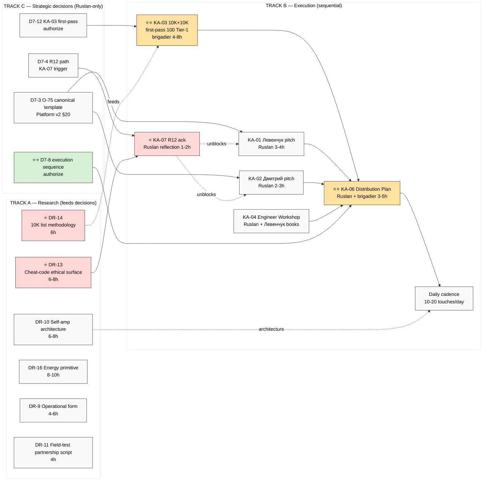
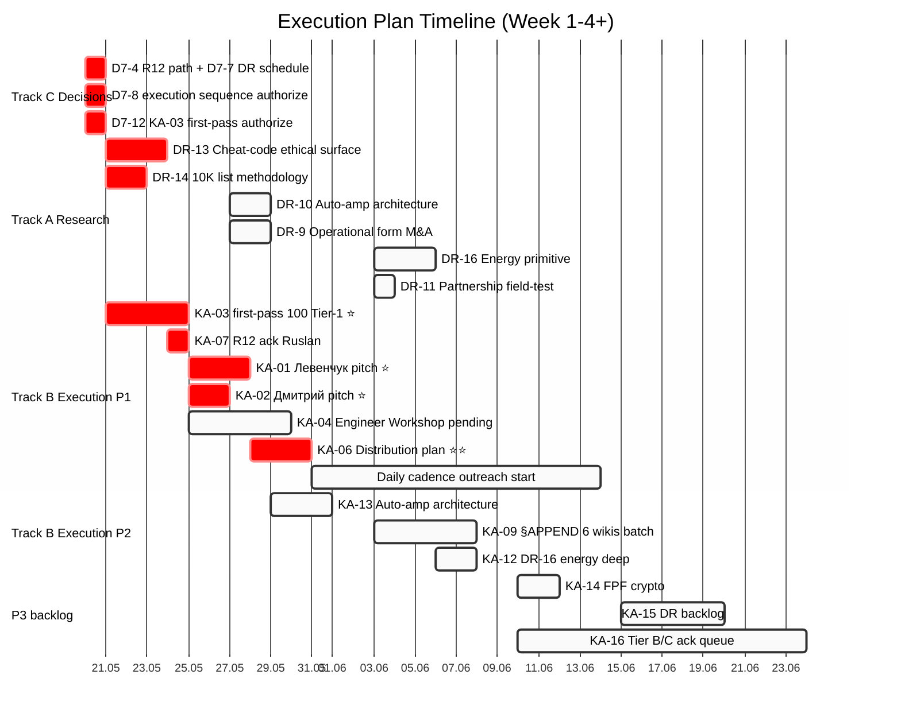
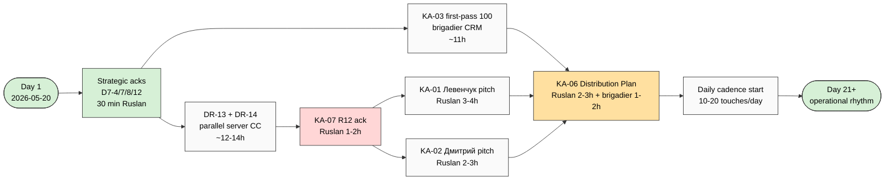

# 🎯 Execution Plan — batch-7 sequenced roadmap

> **Что:** конкретный пошаговый план на основе FULL DIGEST batch-7.
> **Зачем:** ты смотришь → ack sequence → потом идём по шагам.
> **Структура:** 3 parallel tracks (Research / Execution / Strategic) × 3 weeks timeline.

---

## §0 Executive summary

**16 Key Actions + 9 NEW DR = 25 items.** После dependency analysis:
- **8 P1 actions** (≤7 days target)
- **5 P2 actions** (2-4 weeks)
- **3 P3 actions** (backlog)

**Critical gate:** **KA-07 R12 review O-83 Cheat-code** блокирует KA-01 (Левенчук pitch) + KA-02 (Дмитрий pitch). DR-13 feeds KA-07.

**Critical substrate:** **DR-14 list methodology** feeds KA-03 (10K target list expansion). Без DR-14 = first-pass 100 manually.

**3 tracks (lanes) parallel:**
- **Track A — Research** (DR-13 / DR-14 / DR-10 / DR-16 / others) — feeds decisions + Tier A promotions
- **Track B — Execution** (KA-01/02/03/04 → KA-06 distribution → daily cadence) — sequential chain
- **Track C — Strategic decisions** (D7-3 / D7-4 / D7-8 / D7-12) — Ruslan-only, gates everything

**Recommended sequence (derived from constraint graph, NOT my opinion):**
1. **Day 1-2:** Strategic decisions D7-4 (R12 path) + D7-8 (authorize execution sequence) + D7-12 (KA-03 first-pass 100 authorize)
2. **Week 1:** DR-13 + DR-14 parallel research; KA-03 first-pass 100 brigadier; KA-07 Ruslan reflection
3. **Week 2:** KA-07 decision → unblock KA-01 + KA-02 templates (Ruslan strategic prose); KA-04 Engineer Workshop pending Левенчук books
4. **Week 3:** KA-06 distribution plan formalize; daily cadence запуск; KA-13 auto-amp architecture
5. **Week 4+:** P2 §APPEND queue + remaining DRs

---

## §1 Mermaid #1 — Overall execution flow (3 tracks parallel)

**Чтение mermaid:**
- 🔴 Красный = R12 gate / blocker
- 🟠 Оранжевый = high-value major project
- 🟢 Зелёный = critical strategic decision
- Pointed arrows = direct dependency
- Dashed arrows = feeds / unblocks

---

## §2 TRACK A — Research lanes (parallel; what to research)

### A.1 P1 research (start этой неделей — feeds decisions)

| DR | Topic | Why deep | Sources | Time | Owner |
|---|---|---|---|---|---|
| **DR-13** ⭐ | Cheat-code positioning ethical surface | **Blocks KA-07** (R12 review O-83 promotion) AND **blocks KA-01/KA-02** template ratification | Левенчук ethical-frame + R12 Charter ack 2026-05-12 + manipulation ethics literature (Cialdini / Schein / Stark) + Левенчук inventory v2 GAP-3 | **6-8h** | brigadier substrate research compile + Ruslan strategic interpretation |
| **DR-14** ⭐ | 10K outreach target list compilation methodology | **Feeds KA-03** expansion beyond first-pass 100 (without methodology = manual heroism) | Network science + influence mapping (Christakis/Fowler) + CRM literature + outreach playbooks (DARPA programs / community-led growth) | **6h** | brigadier substrate research compile |

### A.2 P2 research (Week 2-4)

| DR | Topic | Why | Time |
|---|---|---|---|
| DR-10 | Self-amplifying outreach system architecture | Bottleneck removal — «чтобы не я это делал» (audio_681 C19); KA-13 substrate | 6-8h |
| DR-9 | Operational form: outsource vs platform vs hybrid M&A | Strategic open Q (audio_681 C15); affects monetization | 4-6h |
| DR-16 | Energy primitive in info-processing systems | NEW primitive grounding; Tier A blocker для O-80/O-96 | 8-10h |
| DR-11 | Pre-existing-partnership outreach script field-test | Empirical A/B vs Platform v2 §20 templates | 4h |

### A.3 P3 research (backlog)

| DR | Topic | Time |
|---|---|---|
| DR-12 | Cognitive bias inventory + system-thinking debug protocol | 4h |
| DR-15 | Mental Simulation Method literature corroboration | 4h |
| DR-17 | Reductionist layering literature deep | 6h |

### A.4 Track A operational pattern

Каждая DR = autonomous server CC run analogous K-research pattern (8-12 phases). Total Track A P1 commitment: ~12-14h server CC autonomous + ~1-2h Ruslan strategic interpretation per major output.

**Recommended sequence Track A (parallel-capable):**
1. DR-13 + DR-14 запускаются вместе Day 2-3 (parallel tmux sessions)
2. DR-10 + DR-9 Week 2 sequential или parallel
3. DR-11 + DR-16 Week 3
4. DR-12 + DR-15 + DR-17 backlog (per attention budget)

---

## §3 TRACK B — Execution chain (sequential)

### B.1 Critical path (P1 chain)

#### Step B.1.1 — KA-07 R12 review O-83 Cheat-code [P1, gate ⭐]

- **Status:** WAITING для DR-13 output + Ruslan strategic ack
- **Owner:** Ruslan reflection 1-2h + DR-13 substrate (Track A)
- **Acceptance:** decision recorded в REFLECTION-INBOX:
  - (a) O-83 cleared → promote Tier A → KA-01/KA-02 templates can use cheat-code framing
  - (b) reframed → modified template language + softened tone
  - (c) demoted permanent → Tier C / RUSLAN-LAYER only / templates need substantial revision
- **Output:** decision artifact в `decisions/REFLECTION-INBOX-2026-05-16.md` §APPEND-D7-4-resolution
- **Time:** Ruslan 1-2h reflection после DR-13 ready (Day 5-7)
- **Blocks:** KA-01, KA-02
- **Cross-link:** [_FULL-DIGEST §10 D7-4](../reports/voice-pipeline-2026-05-20-batch-7/_FULL-DIGEST-batch-7-2026-05-20.md)

#### Step B.1.2 — KA-01 Левенчук pitch video [P1]

- **Status:** WAITING для KA-07 unblock
- **Owner:** Ruslan strategic prose (video script + outline 2-3h) + brigadier substrate compile 1h
- **Substrate inputs:**
  - audio_697 verbatim claims C1/C6/C11/C22/C25
  - Левенчук inventory v2 (cross-link к 3 K-6 Tier A wikis)
  - O-75 Pre-existing Partnership wiki canonical template
  - Platform v2 §6 + §20
- **Acceptance:** Video script 5-15 min ready + outline includes (a) «всё информация и методы переработки» hook (b) grand plan articulation (c) pre-existing partnership positioning (d) Левенчук universal-people alignment
- **Output:** `decisions/strategic/JETIX-LEVENCHUK-PITCH-2026-05-20.md` или video recording
- **Time:** Day 8-10 (после KA-07 unblock)

#### Step B.1.3 — KA-02 Дмитрий outreach pitch [P1]

- **Status:** WAITING для KA-07 unblock
- **Owner:** Ruslan strategic prose 1-2h + brigadier substrate 1h
- **Substrate inputs:**
  - audio_697 C13 custom-pitch-per-audience principle
  - O-75 partnership template (paired offer+ask discipline)
  - Outreach Scalable concept doc
  - Platform v2 §20 templates
- **Acceptance:** Pitch script / video draft ready для гуманитарной audience (no engineering jargon; emphasis на «развитие человечества» frame)
- **Output:** `decisions/strategic/JETIX-DMITRIY-PITCH-2026-05-20.md`
- **Time:** Day 8-10 (parallel with KA-01)

#### Step B.1.4 — KA-03 10K + 10K target list first-pass 100 ⭐⭐ [P1]

- **Status:** WAITING для D7-12 authorize (Ruslan ack) + DR-14 methodology (optional для scaling)
- **Owner:** brigadier substrate (CRM ops `/crm-add` per candidate; `/crm-rebuild-index`) + Ruslan ack on Tier-1 shortlist 0.5h per Tier-1 contact
- **Substrate inputs:**
  - Platform v2 §6 22 people Tier-1 baseline (existing)
  - audio_697 C16 «10K + 10K» sizing target
  - O-75 canonical template для outreach
- **Acceptance:** First-pass ≥100 contacts surfaced + Platform v2 §6 baseline migrated to `crm/people/` + `crm/orgs/` + Tier-1/L2/L3 segmentation preserved
- **Output:** `crm/people/*.md` (~100 entries) + `crm/index.md` rebuilt
- **Time:** brigadier 4-8h initial pass + Ruslan ack 0.5h × 22 Tier-1 entries = ~11h total
- **NB:** DR-14 methodology blocks scaling beyond ~100 (manual heroism limit)

#### Step B.1.5 — KA-04 Engineer Workshop запуск [P1, BL-1]

- **Status:** PENDING Левенчук books material handoff (PLAN-OF-DAY Шаг 3)
- **Owner:** Ruslan strategic design + brigadier substrate
- **Dependency:** Левенчук books overlap (СМ-2024 Т1+Т2 / Методология 2025 / Интеллект-стек 2023)
- **Acceptance:** Engineer Workshop запуск plan with cohort sizing (5-15) + Левенчук material integration plan + iteration cadence
- **Output:** `decisions/strategic/ENGINEER-WORKSHOP-LAUNCH-2026-05-XX.md`
- **Time:** 4-6h Ruslan design + ongoing execution
- **Block:** Левенчук books handoff (Ruslan action)

#### Step B.1.6 — KA-06 Distribution Plan formalize ⭐⭐ [P1]

- **Status:** WAITING для KA-01/02/03/04 substrate ready + D7-8 authorize
- **Owner:** Ruslan strategic prose 2-3h + brigadier substrate compile 1-2h
- **Substrate inputs:**
  - Sprint-Synthesis-v2 Doc 4 Master Packaging Step 6 spec (6 promotion docs roadmap)
  - KA-01 + KA-02 pitch scripts ready
  - KA-03 first-pass 100 Tier-1 list ready
  - 11 step-4-input actions from batch-7
  - O-75 canonical template + paired-frame discipline (R12)
- **Acceptance:** Distribution plan covers:
  - 6 promotion docs status (C.1 one-pager / C.2 pitch deck v1 / C.3 technical / C.4 vision narrative / C.5 onboarding / C.6 case study deferred)
  - Audience × channel matrix (L1 engineers / L2 amplifiers / L3 institutional × Tier-1 + email + Twitter + Telegram + IRL)
  - Phase 1 outreach cadence: daily 10-20 touches start date + script templates
  - Sequence per audio_697 C25: Дмитрий → Левенчук → плотнейшая outreach
- **Output:** `decisions/strategic/DISTRIBUTION-PLAN-2026-05-20-batch-7.md` (or appropriate date)
- **Time:** Week 3 (Day 14-18)

### B.2 P2 execution items (Week 2-4)

| KA | Action | Dep | Time |
|---|---|---|---|
| KA-13 | Auto-amplification outreach system architecture (DR-10 impl) | DR-10 + KA-06 baseline | 6-8h |
| KA-09 | §APPEND 6 existing Tier A wikis с batch-7 voice substrate | Phase 6 substrate | 2-3h per batch |
| KA-10 | DR-14 10K outreach target list methodology output | (already in Track A) | 6h |
| KA-11 | DR-13 Cheat-code positioning ethical surface deep | (already in Track A) | 6-8h |
| KA-12 | DR-16 energy primitive deep | (already in Track A) | 8-10h |

### B.3 P3 backlog

| KA | Action |
|---|---|
| KA-14 | NEW-doc-4: FPF + Decentralization + Crypto integration architecture |
| KA-15 | DR-12 + DR-15 + DR-17 backlog research |
| KA-16 | Tier B/C 14 candidates Ruslan ack queue per Pillar C §4.2 max 20 attention budget |

---

## §4 TRACK C — Strategic decisions (Ruslan-only; gates everything)

### C.1 Day 1-2 decisions (unblock execution)

| ID | Decision | Why P1 | Time |
|---|---|---|---|
| **D7-4** ⭐ | O-83 Cheat-code R12 path — trigger DR-13? Schedule? | Gates KA-07 + KA-01/02 templates | Ruslan 10 min ack |
| **D7-8** ⭐⭐ | 16 Key Actions priority + Step 4 distribution plan execution sequence | Authorizes entire Track B | Ruslan 30 min review этого doc |
| **D7-12** | KA-03 first-pass 100 Tier-1 compile | Authorizes brigadier CRM ops start | Ruslan 5 min ack |
| **D7-7** | DR-13 + DR-14 P1 schedule | Authorizes Track A launches | Ruslan 5 min ack |

### C.2 Week 1 decisions

| ID | Decision | Trigger |
|---|---|---|
| **D7-3** | O-75 Pre-existing Partnership canonical template integration в Platform v2 §20 | После KA-01/02 first templates use the wiki |
| D7-1 | O-73 Ethereum §APPEND review | review existing §APPEND |
| D7-2 | O-74 Hackathons-clan-wars §APPEND review | review existing §APPEND |

### C.3 Week 2 decisions

| ID | Decision | Trigger |
|---|---|---|
| D7-4 resolution | O-83 promote/reframe/drop | После DR-13 output |
| D7-5 | O-86 Project-of-Humanity boundary confirm (frame ≠ ops form) | После Левенчук pitch (KA-01) framing tested |
| D7-11 | KA-07 timing — block all OR launch с paired-frame + retroactive | После DR-13 ready |

### C.4 Week 3+ decisions

| ID | Decision | Trigger |
|---|---|---|
| D7-6 | 14 Tier B candidates ack queue per item | Pillar C §4.2 attention budget |
| D7-9 | KA-09 §APPEND timing P2 OR P3 | After KA-06 distribution plan |
| D7-10 | O-88 anti-tiered universalism vs Platform v2 segmentation | Design tension resolution |

---

## §5 Mermaid #2 — Week-by-week timeline gantt

**Critical path (red):** D7-4 + D7-8 + D7-12 → DR-13 + DR-14 + KA-03 → KA-07 → KA-01 + KA-02 → KA-06 → Daily cadence.

**Estimated end-to-end (start daily cadence):** ~3 недели (Day 1-21).

---

## §6 Step-by-step recommended sequence (день за днём)

### Day 1 (сегодня 2026-05-20)
1. ⭐ Ruslan читает FULL DIGEST + this Execution Plan (~30-45 min total)
2. ⭐ Ruslan acks D7-4 / D7-7 / D7-8 / D7-12 (~30 min reflection)
3. → me: записываю acks в REFLECTION-INBOX + commit + push
4. → me: launch DR-13 + DR-14 prompts (parallel tmux sessions on server)
5. → me: launch KA-03 first-pass 100 brigadier substrate compile (CRM ops start)

### Day 2-4
- Track A: DR-13 + DR-14 server CC autonomous (~12-14h total)
- Track B: KA-03 brigadier substrate ongoing + Ruslan ack Tier-1 batch
- Ruslan: optional R12 reflection (proactive перед DR-13 output)

### Day 5-7
- DR-13 output ready → KA-07 Ruslan reflection 1-2h
- DR-14 output ready → KA-03 expansion methodology applied
- KA-03 first-pass 100 contacts ready в CRM

### Day 8-10
- KA-07 decision committed (cleared/reframed/dropped)
- KA-01 Левенчук pitch — Ruslan strategic prose + brigadier substrate
- KA-02 Дмитрий pitch — Ruslan strategic prose + brigadier substrate (parallel)
- KA-04 Engineer Workshop — pending Левенчук books

### Day 11-14
- KA-01 + KA-02 ready → Дмитрий outreach FIRST (audio_697 C25 sequence)
- Track A Week 2: DR-10 + DR-9 launch parallel
- KA-06 Distribution Plan drafting begins

### Day 15-21
- Левенчук pitch (KA-01) sent
- KA-06 Distribution Plan finalized
- Daily cadence начат (10-20 touches/day)
- KA-13 auto-amp architecture brigadier substrate

### Day 22+
- P2 §APPEND queue (KA-09)
- DR-16 + DR-11 (Week 3 research)
- P3 backlog per attention budget

---

## §7 Acceptance criteria per major milestone

| Milestone | Acceptance |
|---|---|
| **MS-1 Decisions acked (Day 1)** | D7-4 / D7-7 / D7-8 / D7-12 recorded в REFLECTION-INBOX + commit |
| **MS-2 Research P1 done (Day 7)** | DR-13 report + DR-14 methodology document available + KA-07 decision committed |
| **MS-3 Templates ready (Day 10)** | KA-01 + KA-02 pitch scripts/videos draft ready; R12 paired-frame discipline preserved |
| **MS-4 First-pass CRM (Day 10)** | KA-03 ≥100 Tier-1 contacts в CRM; index rebuilt; sequence Дмитрий→Левенчук identified |
| **MS-5 Distribution Plan (Day 18)** | KA-06 doc covers 6 promotion docs × audience × channel + cadence schedule |
| **MS-6 Daily cadence начат (Day 21)** | First 10-20 touches sent; pipeline working; metrics tracking начат |
| **MS-7 Self-amp architecture (Day 28)** | KA-13 architecture doc + DR-10 substrate; «чтобы не я это делал» path identified |

---

## §8 Risks + mitigations

| Risk | Likelihood | Impact | Mitigation |
|---|---|---|---|
| **R-1 R12 review fails O-83** → templates require revision | Medium | High (delays Week 2 by 3-5 days) | Pre-draft templates с paired-frame discipline assuming worst case; faster pivot |
| **R-2 Левенчук books material handoff delays** → KA-04 stalls | High | Medium (KA-04 P1 BL-1 retained но не blocker для KA-06) | Defer KA-04 в Week 2-3; не gate Distribution Plan |
| **R-3 Срочность колоссальна → burn-out** | High | High (Manager budget breach) | Pillar C §4.2 max 20 active tasks; daily pacing discipline; surface excess via /lint --check-overload |
| **R-4 Anti-tiered universalism design contradiction** | Medium | Medium | AP-6 preserve both в docs; operational segmentation via Platform v2 §6 retained but DOC THE DISSENT |
| **R-5 Aggressive recruiting tone backfire** | Medium | High (reputation) | Template form softening Ruslan-led; verbatim aggressive only в Ruslan-personal conversations |
| **R-6 KA-03 scale ambition без DR-14 methodology** | Low (first-pass 100 manageable) | Low | First-pass capped at 100; methodology after DR-14 for 1K+ expansion |
| **R-7 Anthropic API cost overrun из-за research lanes parallel** | Low | Medium | Max sub bundled; Groq Whisper separate (~€0.15 per batch); €10/день baseline holds |

---

## §9 Resource budget

### Time budget

| Type | Item | Hours |
|---|---|---|
| **Ruslan strategic** | KA-07 R12 ack + KA-01 + KA-02 + KA-04 design + KA-06 distribution + decisions ack queue | ~14-18h |
| **Server CC autonomous (Track A)** | DR-13 + DR-14 + DR-10 + DR-9 + DR-16 + DR-11 = ~38-44h | ~38-44h |
| **brigadier substrate (CRM + compile + §APPEND)** | KA-03 brigadier 4-8h + KA-06 substrate 1-2h + KA-09 §APPEND 2-3h × 6 batches = ~15-25h | ~15-25h |
| **Total estimated** | | ~67-87h (across 3-4 weeks) |

### Cost budget

| Item | Cost |
|---|---|
| Groq Whisper transcription (batches future) | ~€0.15-0.30 per batch |
| Claude Max subscription analysis | tool-bundled (no incremental Ruslan-card) |
| External services (WebFetch / WebSearch built-in) | ~€0 |
| **Total estimated (3-4 weeks)** | **<€5-10** (Groq only) |

### Constitutional budget

- Manager attention budget: max 20 active tasks per Pillar C §4.2 — currently safe (8 P1 + 5 P2 = 13 active)
- Foundation read-only preserved через все steps
- R12 paired-frame discipline enforced в KA-01/KA-02 templates
- AP-6 dissent preservation для O-88 / aggressive recruiting tone

---

## §10 Mermaid #3 — Critical path single view (для quick reference)

**Critical path duration:** ~21 days (3 weeks) from acks до daily cadence operational.

---

## §11 Quick-decision summary для Ruslan (≤2 min scan)

**Day 1 acks needed (5 min reflection per item):**
1. **D7-4** — Hit «start DR-13 R12 review» button? [yes/no/defer]
2. **D7-7** — Schedule DR-13 + DR-14 parallel server CC runs? [yes/no/defer]
3. **D7-8** — Authorize 16 KA execution sequence per this plan? [yes/no/modify]
4. **D7-12** — Authorize KA-03 first-pass 100 Tier-1 CRM compile? [yes/no/modify]

**Если yes на all four → me:**
- Записываю acks в REFLECTION-INBOX
- Launch DR-13 + DR-14 prompts (write prompts + commit + surface launch commands)
- Launch KA-03 brigadier substrate compile (CRM ops)
- Wait для Ruslan на KA-07 reflection после DR-13 output

**Если modify** → ты говоришь что переставить / удалить / добавить → я re-draft sequence.

---

## §12 Что НЕ в плане (anti-list)

- ❌ O-62 Fund-of-Humanity (SKIP confirmed)
- ❌ O-66 Triple-win / O-67 Здесь-и-сейчас / O-68 Multi-Modal (additional gates required; defer)
- ❌ Foundation modifications (R2 preserved)
- ❌ Левенчук books deep distillation (PLAN-OF-DAY Шаг 3 conditional — pending Ruslan material handoff)
- ❌ Tier B 14 candidates auto-promotion (per-item Ruslan ack via KA-16 backlog)
- ❌ Strategic prose authoring by brigadier (R1; Ruslan = sole strategist)

---

## §13 Cross-link к sources

- **FULL DIGEST batch-7:** [_FULL-DIGEST-batch-7-2026-05-20.md](../reports/voice-pipeline-2026-05-20-batch-7/_FULL-DIGEST-batch-7-2026-05-20.md) — все 9 заметок detailed
- **Key Actions list:** [06-key-actions-list.md](../reports/voice-pipeline-2026-05-20-batch-7/06-key-actions-list.md) — per-action metadata
- **3 buckets candidates:** [05-candidates-3-buckets.md](../reports/voice-pipeline-2026-05-20-batch-7/05-candidates-3-buckets.md) — 24 candidates + 9 DR
- **NEW Tier A wiki:** [pre-existing-partnership-positioning.md](../wiki/concepts/pre-existing-partnership-positioning.md) — O-75 canonical
- **REFLECTION-INBOX:** [REFLECTION-INBOX-2026-05-16.md](../decisions/REFLECTION-INBOX-2026-05-16.md) — 12 D7-* decisions queue
- **PLAN-OF-DAY:** [_PLAN-OF-DAY-2026-05-20.md](_PLAN-OF-DAY-2026-05-20.md) — original 4-step day plan (Step 1+2 done; Step 3 conditional; Step 4 substrate ready)
- **Sprint-Synthesis-v2 Doc 4:** Master Packaging Step 6 roadmap (parent integration)

---

*Execution Plan derived 2026-05-20 from batch-7 KA dependency graph + Track A research / Track B execution / Track C strategic. Constitutional discipline preserved. Sequence = derived from constraint structure, NOT brigadier opinion. Ruslan = sole strategist on actual execution.*

**🎯 Ты look это → ack D7-4/7/8/12 → погнали по шагам.**
