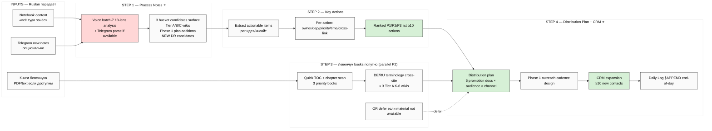

# 🎯 План дня — 20.05.2026 (среда)

## §0 Главная цель

> **Упаковать идеи и концепции + подготовить план их распространения + составить CRM для касаний.**

Это конкретизация **Master Packaging Step 6** (Sprint-Synthesis-v2 Doc 4) — substrate уже ready, drafting/distribution unblocked.

---

## §1 Контекст входа (что у нас есть на старте дня)

**Substrate готов (sprint 16-19.05):**
- 5 acked concept docs F2 (Hackathon Platform / Recursive Engine / System Merger / Outreach Scalable / Education Layer)
- Platform v2 (22 people / 32 resources / 15 monetization variants / 20 outreach templates)
- 6 K-research deep (особенно K-2 AGI Reception PITCH-BLOCKING / K-6 Method+Exokortex)
- 6 NEW Tier A wikis (3 K-6: method-systems-thinking / jetix-as-exokortex / sense-of-measure + 3 batch-6: fpf-vocabulary / mastery-formula / persistence-beats-talent)
- 3 NEW Tier B wikis (intellect-5-functional-skills / learning-knowledge-understanding-trichotomy / recursive-supportive-control-pattern)
- **Левенчук inventory v2** (cross-link matrix к 8 Jetix substrate sources; 5 GAPS surfaced; substrate ready для next FPF deep)
- 2 outreach drafts (Karpathy + Engineer cohort)
- Top-5 ACKED 19.05 evening (D1 monetization mix / BL-1 Engineer Workshop / 3 packets Option A / D2 Tier-1 partners / D5 R12 Charter flow)

**Pending inputs (Ruslan передаёт по ходу дня):**
- 📋 **Notebook content** — «всё туда занёс» (HANDOFF §7)
- 📋 **Telegram new notes** (если есть)
- 📋 **Книги Левенчука** — попутно (Системное мышление 2024 / Методология 2025 / Интеллект-стек 2023 + остальные)

**SKIP:**
- ❌ O-62 Fund-of-Humanity (acked SKIP 19.05 evening)
- ⏸️ O-66 Triple-win / O-67 Здесь-и-сейчас / O-68 Multi-Modal (additional gates required)

---

## §2 4 шага дня (последовательно)

### Шаг 1 — Обработать заметки → вытянуть новые идеи + инсайты ⭐ (P1)

**Что:** voice + text notebook batch processing.
- Notebook content (Ruslan передаёт path / содержимое)
- Telegram new notes если есть
- Аналог batch-1..6 voice pipeline pattern (10-lens cross-analysis)

**Substrate output:**
- `reports/voice-pipeline-2026-05-20-batch-7/` (или другой namespace в зависимости от источника)
- Per-note breakdown + cross-link к 8 Jetix substrate sources
- 3 bucket candidates surface (Tier A wikis / Phase 1 plan / NEW deep research candidates)

**Server CC autonomous** (10-lens analysis pattern из batch-6). ~45-60 min.

**Acceptance:** все новые идеи extracted с verbatim Ruslan voice anchors + Tier A/B/C classification + provenance.

---

### Шаг 2 — На основе идей → ключевые действия (key actions) (P1)

**Что:** synthesize из Шаг 1 surface'нутого → actionable items per идея.

**Format per key action:**
- Action title (короткий)
- Source (какая идея / claim / inсайт triggered)
- Owner (Ruslan / Cloud Cowork / Server CC)
- Dependency (что должно быть готово first)
- Priority (P1/P2/P3)
- Time estimate
- Cross-link к concept docs / Platform v2 / K-research / Левенчук inventory

**Output:** `reports/voice-pipeline-2026-05-20-batch-7/06-key-actions.md` (или внутри Шаг 1 output namespace)

**Acceptance:** ≥10 key actions × P1/P2/P3 ranked × per-action dependency map.

---

### Шаг 3 — Книги Левенчука попутно (parallel, lightweight) (P2)

**Что:** quick distillation основных книг — НЕ deep dive (это будет потом отдельный FPF deep run).

**Сценарии:**
- **A.** Если Ruslan скачал PDF/text книг → server CC TOC extract + key chapters scan + DE/RU terminology cross-cite к 3 K-6 Tier A wikis
- **B.** Если только Ridero / Aisystant preview pages → Web fetch публичных TOC и chapter previews
- **C.** Если ничего не доступно → defer; surface readiness checklist для будущей deep phase

**Target books (per Левенчук inventory v2 §3 paid layer overlap-ordered):**
1. Системное мышление 2024 Т1+Т2 (1200pp) — K-6 structural twin
2. Методология 2025 (~872pp) — K-6 anchor
3. Интеллект-стек 2023 — K-4 anchor

**Output:** `reports/levenchuk-books-quick-scan-2026-05-20/` (only if Ruslan provides material; otherwise note-only).

**Acceptance:** TOC + key chapter summaries или explicit «awaiting Ruslan material handoff».

---

### Шаг 4 — Собрать новый план распространения + CRM expansion (P1) ⭐

**Что:** synthesize Шаг 1 + 2 + 3 → unified distribution plan + CRM updates.

**Two outputs:**

**§4a — План распространения (distribution plan):**
- 6 promotion docs status (per Sprint-Synthesis-v2 Doc 4 roadmap):
  - C.1 one-pager / C.2 pitch deck v1 ⭐⭐ / C.3 technical / C.4 vision narrative L3 / C.5 onboarding / C.6 case study (deferred)
- Audience x channel matrix (L1 engineers / L2 amplifiers / L3 institutional × Tier-1 partners + email + Twitter + Telegram + IRL)
- Phase 1 outreach cadence: daily 10-20 touches start date + script templates from Platform v2 §20
- 5 NEW deep research candidates revisit (DR-2 FPF Field-Test / DR-3 Mastery Calibration / DR-5 5-Skills Pedagogy / DR-6 Layered Control / DR-7 Multi-Modal — DR-1 Fund DROPPED per O-62 SKIP)

**§4b — CRM expansion для outreach касаний:**
- Audit current `crm/people/` + `crm/orgs/` — выявить gaps vs distribution plan target audiences
- Add new contacts per priority:
  - Tier-1 partners: Karpathy + Buterin + Anthropic (acked) + добавить L1 candidates per Левенчук ecosystem (Левенчук himself / Tseren / МИМ residents)
  - L2 amplifiers — RU L2 telegram community / Karpathy lineage / academic
  - Engineer cohort 5-15 candidates pool (BL-1 priority)
- CRM skills: `/crm-add` per candidate; `/crm-rebuild-index` after batch

**Output:**
- `decisions/strategic/DISTRIBUTION-PLAN-2026-05-20.md` (Ruslan strategic prose authoring; brigadier substrate compile)
- `crm/people/<new-slugs>.md` (per new contact)
- `crm/log.md` append с batch entry

**Acceptance:** distribution plan covers 6 promotion docs × 3 audience tiers × N channels + CRM has ≥10 new contacts added для outreach queue.

---

## §3 Mermaid — flow дня

---

## §4 Promts pipeline (что будем launch'ить)

| Шаг | Prompt file (to create в течение дня) | Server CC autonomous | Time | Cost |
|---|---|---|---|---|
| 1 | `prompts/voice-batch-7-deep-analysis-2026-05-20.md` + `_EXPLAIN-...md` | yes | ~45-60 min | <€2 |
| 2 | (внутри Шаг 1 Phase 6 — key actions surface) | yes (part of Шаг 1) | embedded | embedded |
| 3 | `prompts/levenchuk-books-quick-scan-2026-05-20.md` + `_EXPLAIN` (conditional на material) | yes if material | ~30 min | <€1.5 |
| 4 | `prompts/distribution-plan-crm-expansion-2026-05-20.md` + `_EXPLAIN` | partial (CRM data ops yes; strategic prose Ruslan-authored) | ~30-45 min | <€1.5 |

**Total estimated cost дня:** <€5 (built-in tools)
**Total estimated server CC time:** 2-2.5h autonomous runs

---

## §5 Acceptance criteria (день done когда)

- ✅ Notebook + new notes processed → 10-lens analysis output
- ✅ ≥10 key actions extracted с per-action metadata
- ✅ Левенчук books — либо processed либо explicit defer note
- ✅ Distribution plan drafted (covers 6 promotion docs × audience tiers)
- ✅ CRM expansion ≥10 new contacts added
- ✅ Daily Log 2026-05-20 §APPEND end-of-day с summary

---

## §6 Constitutional / process discipline

- **R1.** Strategic prose (distribution plan §4a / key actions priorities) = Ruslan-authored или hybrid-with-ack-trail. Brigadier surfaces substrate.
- **R2.** No Foundation modifications. Only §APPEND к existing canonical docs если корроборация surface'нута.
- **R6.** Provenance per claim в всех outputs (voice anchor / report / cross-link).
- **R11.** Default-Deny preserved. SKIP-list (O-62 / O-66 / O-67 / O-68) honored.
- **Append-only.** Daily Log §APPEND only; не modify existing sections.
- **R12.** Distribution plan check against R12 anti-extraction per Platform v2 §3 15 monetization variants discipline.

---

## §7 Cross-link к active sprint state

- `reports/sprint-synthesis-v2-2026-05-19-evening/04-master-packaging-step6-roadmap.md` — Step 6 detailed spec (primary parent)
- `reports/master-map-2026-05-19-evening/00-MASTER-MAP.md` — full state map (отступ если нужен context refresh)
- `reports/voice-pipeline-2026-05-19-batch-6/05-candidates-3-buckets.md` — batch-6 decision queue (BL-1 Engineer + DR top-3 deferred selection)
- `research/levenchuk-corpus-inventory-v2-2026-05-19-evening/00-SUMMARY-FOR-RUSLAN.md` — inventory v2 ready signal для next FPF deep
- `daily-logs/_DAILY-LOG-2026-05-19.md` §10 / §11 — батч-6 + fixation execution log (previous day)

---

*План дня 20.05.2026 (среда) — authored 2026-05-20 morning Berlin. Brigadier-scribe surface; Ruslan = sole strategist на execution decisions. Step 1 → Step 4 sequenced; Step 3 параллельно когда material available.*

**Жду:** notebook content path / содержимое (Step 1 input) → запускаю Step 1 prompt.
