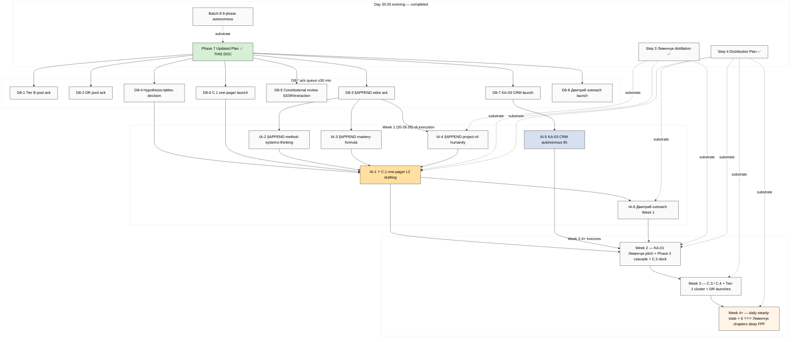
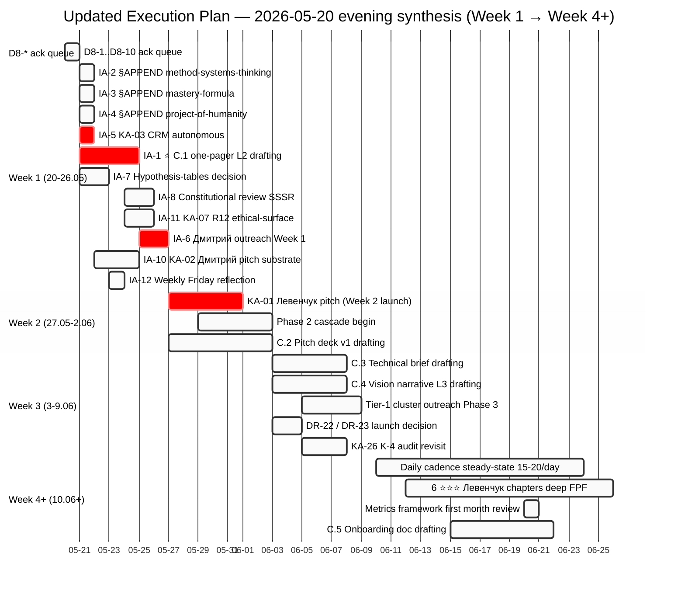

# 🎯 Updated Execution Plan — 2026-05-20 evening synthesis

> **Phase 7 ⭐⭐ output** of voice-pipeline-2026-05-20-batch-8 — primary value-add. Synthesizes ALL today's substrate (PLAN-OF-DAY morning + Steps 3+4 + batch-7 + batch-8) → updated roadmap. **R1 enforced:** brigadier surface; Ruslan = sole strategist on execution decisions.

---

## §0 TL;DR (≤200w)

Сегодня (20.05) substrate грандиозно увеличился: **Step 3 Левенчук distillation** (5 books × 8 sources cross-link matrix + DE-RU glossary + 6 ⭐⭐⭐ chapters) + **Step 4 Distribution Plan** (5000w master + 5 research docs + 4 mermaid) + **batch-7 voice deep analysis** (16 KA + 24 candidates + 9 DR + Execution Plan) + **batch-8 voice deep analysis** (14 KA + 8 Tier B + 7 DR + this Phase 7 synthesis). **Что изменилось:** появилась чёткая triad — Education + Meta-method + Optimism = Jetix offering articulation; concrete artifact request «hypothesis-tables в Jetix» (KA-20 strategic decision); audio_703 = independent re-articulation Левенчук Методология Гл. 4 (KA-01 pitch hook ⭐⭐⭐ direct anchor). **Immediate-actionable:** 4 §APPEND wikis (110 min brigadier compile post-ack) + C.1 one-pager L2 drafting (KA-22, Ruslan strategic 2-4h) + KA-03 CRM compile launch (parallel autonomous 6h, <€2) + Phase 1 Дмитрий outreach Week 1. **Backlog:** 22 Tier B candidates + 17 DR pool items + 6 ⭐⭐⭐ Левенчук chapters → future deep FPF phase. **Risks closed:** Левенчук distillation done. **NEW risk:** SSSR-pattern R12 connotation (HR-1) — paired-frame Ruslan defense preserves OK, flag для review.

---

## §1 Inputs synthesised (5 substrate sources)

### §1.1 PLAN-OF-DAY morning 2026-05-20

Status закрытия:
- **Step 1 Voice batch-7** (12:02) ✅ DONE — 9 audio analysed; 16 KAs + 24 candidates + 9 DRs; 12 D7-* decisions resolved (Ruslan walkthrough acked); pool documents created; KA-03 prompt SAVED не launched
- **Step 2 Voice batch-7 walkthrough + integration** ✅ DONE — 12 D7-* resolutions; wiki/ideas/cheat-code-positioning + wiki/concepts/project-of-humanity-positioning created Tier A; 14 Tier B → pool; 10 DR → pool
- **Step 3 Левенчук distillation** ✅ DONE (afternoon) — 5 books converted (~10 MB UTF-8); 5 per-book TOC + highlights; cross-link matrix 5×8 + 10 deep overlaps + 5 GAPS + 5 pitch hooks; DE-RU glossary 40 entries + 18 DE/EN equivalents; 6 ⭐⭐⭐ chapters identified; 3 mermaid
- **Step 4 Distribution Plan** ✅ DONE (afternoon) — `decisions/strategic/DISTRIBUTION-PLAN-2026-05-20.md` 5000w master + 5 research docs + 4 mermaid; 7 risks + 10 actionable items + sequence Дмитрий → Левенчук → cascade
- **Step 5 Voice batch-8** ✅ DONE (this run evening) — 6 audio analysed; 14 KAs + 8 Tier B + 7 DRs; Phase 7 synthesis = THIS DOCUMENT

### §1.2 Batch-7 16 KA + 24 candidates + 9 DR (carry-over)

- 16 Key Actions (KA-01 .. KA-16) — 8 P1 / 5 P2 / 3 P3
- **Pre-existing pools:** 14 Tier B candidates (O-76..O-96 minus 2 promoted) + 10 DR candidates (DR-9..DR-17 + R-future-1)
- **Carry-over P1 KAs:**
  - KA-01 Левенчук pitch (Phase 1 Distribution Plan §3 sequence Week 2)
  - KA-02 Дмитрий pitch (Phase 1 Distribution Plan §3 sequence Week 1)
  - KA-03 CRM compile (prompt SAVED, не launched — awaits D8-7 ack)
  - KA-04..KA-08 — various P1/P2 items
  - KA-09 §APPEND 6 wikis batch-7 (defer P2/P3)

### §1.3 Step 3 Левенчук distillation (substrate enabler)

**Top findings substrate (post-distillation):**
- Cross-link matrix 5 books × 8 sources finding #1: Методология 2025 Гл. 4 «метод как объект 1-го класса» = ⭐⭐⭐ structural backbone Foundation Part 4 §H IP-1 + audio_703 independent re-articulation strengthens KA-01 pitch hook
- Cross-link matrix finding #5: Инженерия личности Гл. 8 (LXP «интеллект как выносная часть») = direct anchor jetix-as-exokortex wiki + batch-8 audio_701/705 mass-education funnel
- 5 GAPS detected: alpha-machinery / 5 регионов стратегирования / 16 транс-дисциплин / системные ритмы / праксиология — потенциальные future deep research items
- 5 pitch hooks для KA-01 Левенчук pitch — ready
- 6 ⭐⭐⭐ chapters для next FPF deep phase: МG4 / МG6 / T2G8 / T1G5 / IPG1 / ISG1

### §1.4 Step 4 Distribution Plan master

**Master doc structure:**
- §0 TL;DR + 3 KPI horizons ($100K summer / first cohort Q3 2026 / 1M EOY 2026 KEYSTONE)
- §1 6 promotion docs gap analysis (C.1-C.6); C.1 one-pager + C.2 pitch deck + C.3 technical brief = P1 critical path
- §3 cascade 150 → 15 → 1M (Tier-1 + L1 cohort + L2 amplifiers + Tier-3 institutional)
- §6 cadence Week 1-4 sample week (Mon-Fri 10-20 touches/day)
- §7 KPIs framework
- §8 7 risks compiled с mitigations
- Sequence: Дмитрий → Левенчук → Tier-1 cluster → cascade

### §1.5 Batch-8 NEW findings (this run)

**Core triad emerged across batch-8 = Jetix offering articulation:**
1. **Education** — audio_701 + 705 (3-tier funnel: учебник + Claude Code + KB → 3-6мес сертификация → проекты)
2. **Meta-method** — audio_703 + 704 (success formula + hypothesis cycle)
3. **Optimism** — audio_706 (daily anchor «я тигр» + small-cohort sufficiency)

**Top ⭐⭐⭐:**
- audio_703 meta-method = direct independent re-articulation Левенчук Методология 2025 Гл. 4 (KA-01 pitch hook anchor)
- audio_704 hypothesis-tables = concrete artifact request (KA-20 strategic decision)
- audio_702 imagination as primary intellect component (K-4 audit revisit + DR-19)

---

## §2 Immediate-actionable items (≤7 days) — что Ruslan execute прямо сейчас

| # | Action | Owner | Time | Dependency | Cross-link |
|---|---|---|---|---|---|
| **IA-1 ⭐** | KA-22 C.1 one-pager L2 drafting | Ruslan strategic prose + brigadier substrate compile | 2-4h Ruslan + 2h brigadier prep | KA-21 (Phase 7 ✅ done) + KA-17/18/19 §APPEND ideally done OR parallel | Master Packaging Step 6 §1 + Левенчук distillation §4 5 hooks + Distribution Plan §3 |
| **IA-2** | KA-17 §APPEND method-systems-thinking (meta-method + hypothesis cycle) | brigadier substrate compile | 30-45 min | D8-3 ack | Левенчук Методология Гл. 4 + audio_703/704 verbatim + Foundation Part 5 |
| **IA-3** | KA-18 §APPEND mastery-formula (initial-input + daily anchor + optimism) | brigadier substrate compile | 30 min | D8-3 ack | Левенчук Инженерия личности Гл. 1+8 + audio_702/706 verbatim + persistence-beats-talent |
| **IA-4** | KA-19 §APPEND project-of-humanity-positioning (education funnel + curriculum hierarchy) | brigadier substrate compile | 30-45 min | D8-3 ack + R12 paired-frame discipline | audio_701/705 verbatim + Education Layer K-2 §4 + Distribution Plan §3 |
| **IA-5** | KA-27 KA-03 CRM compile launch (parallel autonomous) | brigadier autonomous Cloud Cowork (server CC) | ~6h autonomous + <€2 cost | D8-7 ack + prompt SAVED `prompts/ka-03-crm-first-pass-100-2026-05-20.md` | Platform v2 §02 + Distribution Plan §6 cadence + audio_706 small-cohort guardrail |
| **IA-6** | KA-28 Phase 1 Дмитрий outreach launch Week 1 | Ruslan manual | 2-3h custom pitch + 30 min outreach | IA-1 (one-pager preferred) + pre-send 8-item R12 checklist | Distribution Plan §3 sequence + O-86 humanitarian frame + O-94 custom-pitch + R12 Charter |
| **IA-7** | KA-20 Hypothesis-tables architecture decision (5 options surfaced) | Ruslan strategic decision (R1) | 15-30 min reflection | None — options ready Phase 4 §B.1 | audio_704 verbatim + Foundation Part 5 + CRM existing schema |
| **IA-8** | KA-25 Constitutional review (SSSR-pattern R12 + extraction reading) | Ruslan reflection (R1) | 30-60 min | None | audio_705 + audio_701 verbatim + R12 Charter ack + H7 People-NS LOCKED |
| **IA-9** | KA-01 Левенчук pitch drafting (carry-over batch-7, Week 2 launch target) | Ruslan strategic prose + brigadier substrate | 3-4h Ruslan | Left distillation §4 5 hooks (✅ ready) + Distribution Plan §3 sequence | research/levenchuk-books-distillation-2026-05-20/00-SUMMARY-FOR-RUSLAN.md §3+§5 |
| **IA-10** | KA-02 Дмитрий pitch substrate (carry-over batch-7, Week 1 launch input) | Ruslan strategic prose + brigadier | 2-3h Ruslan | O-86 wiki + O-94 custom-pitch ready (✅) | wiki/concepts/project-of-humanity-positioning.md |
| **IA-11** | KA-07 R12 ethical-surface review O-83 cheat-code (carry-over batch-7) | Ruslan reflection | 1-2h | None / Левенчук systemic ethics cross-cite available | wiki/ideas/cheat-code-positioning.md + R12 Charter |
| **IA-12** | Weekly Friday reflection ritual setup (Distribution Plan §7 metrics + cadence) | Ruslan habit | 30 min | /crm-weekly skill | Distribution Plan §6 + audio_706 daily anchor + KPI framework §7 |

**Total IA items: 12 (extends prompt skeleton 10 IA items с batch-8 surfacing).**

**Recommended Ruslan focus order (NOT prescriptive — surface):**
1. Ack D8-* queue (≤30 min total)
2. Execute IA-2/3/4 §APPEND wikis (parallel в brigadier substrate; 110 min total)
3. Decide IA-7 hypothesis-tables architecture (15-30 min)
4. Launch IA-5 KA-03 CRM compile (5 min ack → autonomous 6h)
5. Draft IA-1 C.1 one-pager parallel с brigadier substrate prep
6. Constitutional reflection IA-8 (weekend mode)
7. Phase 1 outreach Week 1 (IA-6 / IA-9 / IA-10) post-one-pager

---

## §3 Ack queue / Backlog (≤30 days)

### §3.1 Tier B candidates pool batch-8 additions (8 new)

Per Phase 4 §A.2 — added к `_TIER-B-CANDIDATES-POOL-2026-05-20.md` (pool count: 14 → 22):

- **O-97** Education-as-distribution funnel (3-tier)
- **O-98** Meta-method success formula explicit
- **O-99** Hypothesis cycle as system-life signature
- **O-100** Two-firmware agency theory
- **O-101** Imagination as primary intellect component
- **O-102** Optimism layer + daily anchor («я тигр»)
- **O-103** Curriculum hierarchy (systems thinking → spec)
- **O-104** Small-cohort sufficiency principle

Cherry-pick triggers documented per-candidate в pool. None auto-promoted.

### §3.2 Research pool batch-8 additions (7 new DRs)

Per Phase 4 §C.2 — added к `_RESEARCH-CANDIDATES-POOL-2026-05-20.md` (pool: 10 → 17):

- **DR-18** SSSR-pattern + Platonic philosophical inquiry (combined 8-10h)
- **DR-19** Imagination as explicit intellect component (6-8h)
- **DR-20** Temporal self-modeling literature scan (6h)
- **DR-21** Responsibility ↔ Intellect connection (4-6h)
- **DR-22** Левенчук meta-method ↔ Ruslan formal congruence (4h)
- **DR-23** Hypothesis tables substrate prior art (4-6h)
- **DR-24** Daily anchor practice scientific basis (4-6h)

Per research-pool pattern — NOT auto-launched. Ruslan cherry-picks.

### §3.3 Existing backlog status updates (post-batch-8)

| KA | Status update batch-8 |
|---|---|
| KA-04 (batch-7) — O-75 partnership template integration | Reaffirmed P2 organic; batch-8 audio_701/705 education-funnel reinforces partnership-baseline complement |
| KA-05 — Open-source posture decision (Tier C / O-93) | Unchanged P2 |
| KA-06 — KA-04 with O-75 batch | P2 active |
| KA-08 — Daily cadence Week 1 launch | ⭐ Priority elevated post-batch-8 — audio_706 daily anchor reinforces; IA-12 weekly Friday |
| KA-09 — §APPEND 6 wikis batch-7 | Status: Now part of IA-2/3/4 wave (batch-8 §APPEND extends batch-7 §APPEND); merge tracks |
| KA-10..KA-16 P2/P3 | Mostly unchanged; batch-8 surfacing slightly elevates KA-26 K-4 audit revisit (DR-19 dep) |

### §3.4 Левенчук-related backlog (carry-over)

- **6 ⭐⭐⭐ chapters identified** для future deep FPF phase (50-100h research budget): MG4 / MG6 / T2G8 / T1G5 / IPG1 / ISG1
- **5 GAPS to fill** (alpha-machinery / праксиология / 5 регионов / системные ритмы / 16 транс-дисциплин)
- **Cross-cite Левенчук в existing wikis** — partial done in batch-8 KA-17/18/19 §APPEND (post-ack)

### §3.5 Constitutional flags pending review (batch-8)

| ID | Issue | Action |
|---|---|---|
| HR-1 | SSSR-pattern positioning R12 connotation [audio_705] | Constitutional review (IA-8) |
| HR-2 | «всем по бизнесу» extraction reading [audio_701] | Constitutional review (IA-8) |
| HR-3 | Self-creating system substrate [audio_702] | AP-6 preserve; meta-system level confirmed (NOT R9 agent self-modification) |

---

## §4 Updated roadmap timeline

### Week 1 (20-26.05) — this week

**This evening (20.05):**
- ✅ Batch-8 deep analysis DONE (this run)
- ⏳ Ruslan reads Summary + Updated Execution Plan
- ⏳ D8-* ack queue (≤30 min)

**21-23.05 (weekday days):**
- IA-2/3/4 §APPEND wikis (post-D8-3 ack; brigadier execute 110 min)
- IA-7 hypothesis-tables architecture decision (Ruslan reflection)
- IA-5 KA-03 CRM compile launch (D8-7 ack → autonomous 6h)
- IA-1 C.1 one-pager L2 drafting (Ruslan strategic prose 2-4h)
- IA-10 KA-02 Дмитрий pitch substrate prep

**24-26.05 (weekend):**
- IA-8 constitutional review (weekend reflection mode)
- IA-6 KA-28 Phase 1 Дмитрий outreach launch (Week 1 sequence Distribution Plan §3)
- IA-11 KA-07 R12 ethical-surface review O-83 (parallel)
- IA-12 Weekly Friday reflection ritual first-iteration

### Week 2 (27.05-2.06)

- IA-9 KA-01 Левенчук pitch ready (substrate from distillation §4 5 hooks + DR-22 if launched)
- Phase 2 cascade begin (Tier-1 cluster outreach)
- C.2 Pitch deck v1 drafting begins (Master Packaging Step 6 §1 P1 critical path)
- KA-03 CRM output review (от Week 1 autonomous run)
- Daily cadence steady-state 10-15 touches/day per Distribution Plan §6

### Week 3 (3-9.06)

- C.3 Technical brief drafting (substrate hypothesis cycle + meta-method substrate ready from §APPEND)
- C.4 Vision narrative L3 drafting (substrate Platonic + Левенчук cross-cite + R12 paired-frame discipline)
- Tier-1 cluster outreach Phase 3 (Karpathy / Buterin / Anthropic) если KA-01/02 success
- DR-22 + DR-23 launch decision (research pool cherry-pick)
- KA-26 K-4 audit revisit (если DR-19 ready)

### Week 4+ (10.06+)

- Daily cadence steady-state 15-20 touches/day
- 6 ⭐⭐⭐ Левенчук chapters → first deep FPF research run candidate (Ruslan ack triggers prompt drafting)
- Metrics framework first month review (Distribution Plan §7)
- C.5 Onboarding doc drafting (curriculum hierarchy substrate ready post-§APPEND)
- C.6 Case study deferred Q3 2026 (post-first cohort traction)

---

## §5 Dependency map (mermaid)

---

## §6 Risks update (vs Distribution Plan §8)

### Closed / mitigated since Distribution Plan §8:

- **R-7 Левенчук books delay** — ✅ CLOSED (Step 3 distillation done; 5 books processed; substrate ready)
- **R-4 KA-03 incomplete** — ⚠️ ACTIVE (prompt SAVED; awaits D8-7 launch ack)

### Still active:

- **R-1** R12 paired-frame slippage в outreach — pre-send 8-item checklist mandatory (Distribution Plan §6 enforcement)
- **R-2** Срочность → burnout — pacing discipline + weekend тишина; batch-8 audio_706 small-cohort sufficiency = explicit Ruslan guardrail anchor
- **R-3** Aggressive tone backfire — paired с R-1; cheat-code O-83 review (IA-11)
- **R-5** O-83 cheat-code backfire — IA-11 R12 ethical-surface review must happen перед O-83 operationalization
- **R-6** Segmentation contradiction Platform v2 vs O-88 anti-tiered universalism — AP-6 preserve both; не resolve before more data

### NEW from batch-8:

- **R-8 NEW** SSSR-pattern R12 connotation [audio_705] — paired-frame Ruslan voice preserves voluntary opt-in (OK), но flag для constitutional review IA-8. Mitigation: explicit disclaimer в educational positioning text
- **R-9 NEW** «Всем по бизнесу» extraction reading [audio_701] — paired-frame Ruslan defense (бизнес = инструмент self-improvement) preserves OK; constitutional clarification IA-8 to document explicit
- **R-10 NEW** Self-creating system constitutional boundary [audio_702] — AP-6 preserve; meta-system level (НЕ R9 agent self-modification). Clarification recommended в Pillar C Tier 2 notes (RUSLAN-LAYER overlay, NOT foundation_generic — would Ruslan-ack только)
- **R-11 NEW** Hypothesis-tables premature architecture commit [audio_704] — mitigation: 5 options surfaced (NOT recommendation); KA-20 strategic decision required before any artifact creation

### Risk priority matrix (post-batch-8)

| Priority | Risks | Mitigation status |
|---|---|---|
| **P1** | R-1, R-2 | Pre-send checklist + weekend тишина + audio_706 anchor |
| **P2** | R-3, R-5, R-8, R-9 | IA-8 constitutional review + IA-11 R12 ethical-surface |
| **P3** | R-4, R-6, R-10, R-11 | Pre-launch checklist + AP-6 preserve + 5-option surface |

---

## §7 READY-FOR-RUSLAN-ACK quick queue

Per memory `feedback_no_unsolicited_alternatives.md` — brigadier surface, Ruslan picks. Per item ≤5 min reflection each (most), longer для D8-4/D8-5/D8-6/D8-8:

| ID | Decision | Type | Time-to-ack |
|---|---|---|---|
| **D8-1** | Approve 8 Tier B candidates O-97..O-104 pool extension | ack pool | 5 min |
| **D8-2** | Approve 7 DR candidates DR-18..DR-24 pool extension | ack pool | 5 min |
| **D8-3** | Approve 4 §APPEND wiki updates (IA-2/3/4 — meta-method + mastery + project-of-humanity + persistence touches) | execute IA | 5-10 min ack + 110 min brigadier compile post-ack |
| **D8-4 ⭐** | KA-20 Hypothesis-tables architecture decision (5 options surfaced; pick Op-1..Op-5 or hybrid) | strategic decision R1 | 15-30 min reflection |
| **D8-5** | Constitutional review SSSR-pattern R12 + «всем по бизнесу» extraction reading + self-creating system clarification | constitutional review | 30-60 min |
| **D8-6 ⭐⭐** | KA-22 C.1 one-pager L2 drafting launch ack (Ruslan strategic prose + brigadier substrate compile) | execute IA Ruslan | 2-4h Ruslan execution (start ack ≤5 min) |
| **D8-7** | KA-27 KA-03 CRM compile launch ack (pre-existing prompt saved batch-7) | execute IA autonomous | 5 min ack + ~6h autonomous + <€2 cost |
| **D8-8** | KA-28 Phase 1 Дмитрий outreach launch Week 1 (post-IA-1 one-pager preferred) | execute IA Ruslan manual | ack + 2-3h Ruslan |
| **D8-9** | Defer / promote O-101 Imagination component pending DR-19 | ack queue | 5 min |
| **D8-10** | K-4 audit revisit (KA-26) pending DR-19 — defer Week 3+? | ack queue | 5 min |

**Total ack queue time-budget: ~3-5h if everything decided/executed today; baseline 30 min для acks alone, IA work follows.**

---

## §8 Mermaid — Updated gantt timeline

---

## §9 What's after Phase 7 closure (next steps post-this-doc)

**Immediate (Ruslan ≤30 min):**
1. Read §0 TL;DR + §2 IA table + §7 ack queue (≤15 min)
2. Ack D8-1, D8-2, D8-3, D8-7 (admin acks, ≤15 min total)

**Tonight if energy (Ruslan optional):**
3. Reflect D8-4 hypothesis-tables decision (Op-1..Op-5 pick) — 15-30 min
4. Launch IA-5 KA-03 CRM compile autonomous (post-D8-7 ack; затем sleep, brigadier runs)

**Tomorrow 21.05:**
5. brigadier executes IA-2/3/4 §APPEND wikis (110 min; post-D8-3 ack)
6. Ruslan starts IA-1 C.1 one-pager L2 drafting (2-4h strategic prose)
7. Parallel: IA-10 KA-02 Дмитрий pitch substrate prep

**Weekend 24-26.05:**
8. IA-8 constitutional review SSSR + extraction (30-60 min)
9. IA-11 KA-07 R12 ethical-surface review O-83 cheat-code (1-2h)
10. IA-6 Phase 1 Дмитрий outreach launch end-of-week (post-IA-1 one-pager + R12 8-item checklist)

**Week 2 (27.05+):**
11. IA-9 KA-01 Левенчук pitch drafting (Week 2 send target)
12. Phase 2 cascade begin

**Critical reminders:**
- ⚠️ **R12 paired-frame discipline** mandatory в всех outreach (Distribution Plan §6 pre-send 8-item checklist)
- ⚠️ **Pacing guardrail** — audio_706 «небольшое количество с налаженной работой = достаточно» (small-cohort sufficiency) = explicit Ruslan anti-burnout anchor
- ⚠️ **Research-pool pattern** — NO auto-launch DRs; Ruslan cherry-picks
- ⚠️ **SKIP-list integrity** — O-62/O-66/O-67/O-68 NOT re-surfaced batch-8 (clean)
- ⚠️ **R1 enforcement** — strategic prose authored by Ruslan; brigadier surface only
- ⚠️ **Constitutional posture** preserved (R1/R2/R6/R11/R12/IP-1/EP-5/AP-6)

---

## §10 Closure

Этот document = **synthesis всех substrate появившихся сегодня 20.05** (Steps 1-5: PLAN-OF-DAY morning + Step 3 Левенчук + Step 4 Distribution Plan + batch-7 + batch-8 этого Phase 7 synthesis). 12 IA items + 10 D8-* ack decisions + Week 1-4+ horizons + risk update + dependency graph + gantt timeline.

**R1 enforced:** Brigadier = scribe only. **Ruslan = sole strategist** on execution decisions. Все IA / KA / DR items surfaced для ack — НЕ recommendation.

**Per Ruslan voice ack evening 20.05:** «акнем что в бэк-лог, что добавим прямо сейчас, потом ван-пэйджер делать». ⭐ **IA-1 C.1 one-pager** = top action per Ruslan explicit voice anchor.

**Next concrete operation post-acks:** D8-3 → IA-2/3/4 brigadier execute (110 min) + D8-7 → IA-5 brigadier autonomous (6h) + D8-6 → IA-1 Ruslan strategic prose drafting.

---

*Phase 7 ⭐⭐ Updated Execution Plan synthesis closure 2026-05-20 evening. Source: PLAN-OF-DAY + Steps 3+4 + batch-7 + batch-8 (6 audio 701-706). Awaits Ruslan ack queue D8-1..D8-10.*
