# DATA-FLOWS.md — Jetix OS data flows v1-beta

> **Scope.** 7 канонических data flows + state machines + writeback loops.
> Дополняет SYSTEM-DESIGN-TECH.md §8 (Runtime view). Visual-first — mermaid
> диаграммы с прозаической подписью + failure modes.
>
> **Для кого.** Агенты при выполнении flows; Ruslan для operational review;
> новые collaborators для понимания dynamics системы.

---

## §F.0 Flow catalog

| # | Flow | Trigger | Primary output | Section |
|---|------|---------|----------------|---------|
| F1 | Morning ritual (`/plan-day`) | Ruslan command | Daily Log plan section | §F.1 |
| F2 | Voice-memo → wiki | Voice file drop + Ruslan `/ingest` | Wiki pages + edges | §F.2 |
| F3 | External content → wiki (`/ingest <source>`) | Ruslan command | Wiki pages + edges + writeback | §F.3 |
| F4 | Query + writeback (`/ask <question>`) | Ruslan command | Answer + citations + optional comparisons | §F.4 |
| F5 | Evening ritual (`/close-day`) | Ruslan command | Daily Log closed + distillate routed | §F.5 |
| F6 | Weekly natyagivanie (`/cross`) | Ruslan command | Cross-report + new tasks + insights | §F.6 |
| F7 | Error flow (SAFE-SAVE) | Any error / unclear | Commit + scratchpad + escalation | §F.7 |
| F8 | Notion migration (α/β/γ/δ) | Ruslan per phase | Raw dumps + wiki ingests | §F.8 |

**State machines (entities lifecycle):** §F.9.

**Cross-cutting flow invariants:** §F.10.

---

## §F.1 Morning ritual (`/plan-day`)

### F.1.1 Trigger & preconditions

**Trigger:** Ruslan запускает `./jetix morning` или `/plan-day` в Claude Code.

**Preconditions:**
- `daily-log/{today}.md` ещё не создан (или создан template'ом).
- `strategy/life/` содержит текущий weekly + monthly docs.
- Нет in-progress блокеров (SAFE-SAVE состояния должны быть resolved).

### F.1.2 Sequence diagram

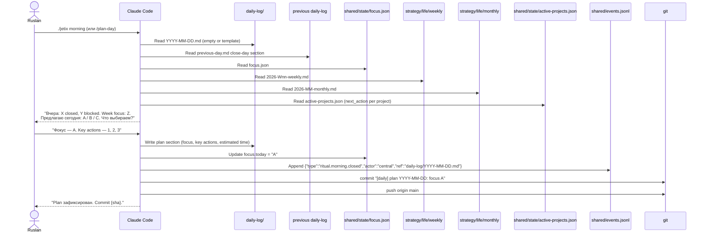

### F.1.3 Steps (prose)

1. **Read strategic context:** weekly, monthly, yearly (if quarterly review approaching).
2. **Read operational state:** `focus.json`, `priorities.json`, `active-projects.json`.
3. **Read recent daily-log + open tasks** from `tasks/master.md` + per-project tasks.
4. **Read previous close-day** — what was planned для сегодня?
5. **Synthesize draft plan:** Focus of day + 3-5 key actions + estimated time + risks.
6. **Show plan к Ruslan → Ruslan approves/edits.**
7. **Write `daily-log/{today}.md`** с frontmatter (type: daily-log, date, focus, status).
8. **Emit event:** `ritual.morning.closed` к `shared/events.jsonl`.
9. **Commit + push.**

### F.1.4 Failure modes

| Failure | Response | Recovery |
|---------|----------|----------|
| Notion MCP down | Skip Notion steps; use local daily-log only | Proceed — Notion not on critical path for plan |
| Strategy weekly missing | Offer "create weekly first?" короткий dialog | Don't skip; weekly drives daily focus |
| Rate limit 529 | 3× backoff; then SAFE-SAVE drafts | Resume when API back |
| Ruslan пропустил close-day yesterday | Detect; offer short recap first | ≤5 min recover |
| Ruslan offline → no approval | SAFE-SAVE draft plan; mark "awaiting approval" | Resume on return |

### F.1.5 Quality focus

- **Time:** complete < 60s end-to-end with approval.
- **Learnability:** новый user понимает ритуал с первого раза через explicit
  4 questions pattern.

---

## §F.2 Voice-memo → wiki flow

### F.2.1 Trigger & preconditions

**Trigger:** Ruslan записал voice-memo → drops в `raw/voice-memos/`. После —
запускает pipeline:

```bash
python3 tools/transcribe.py    # OGG/MP3 → transcript
python3 tools/extract.py       # transcript → items (decisions, tasks, ideas, contacts)
python3 tools/filter.py        # dedup + meta
python3 tools/review_report.py # markdown review in ~/review-latest.md
# ← STOP: Ruslan reviews ~/review-latest.md
# Manually: /ingest per approved item (no automatic distribute)
```

**Preconditions:** Groq Whisper API doступен (SHOULD); distribute.py.bak — disabled
(HUMAN §CLAUDE.md + ADR — human review obligatory).

### F.2.2 Pipeline diagram

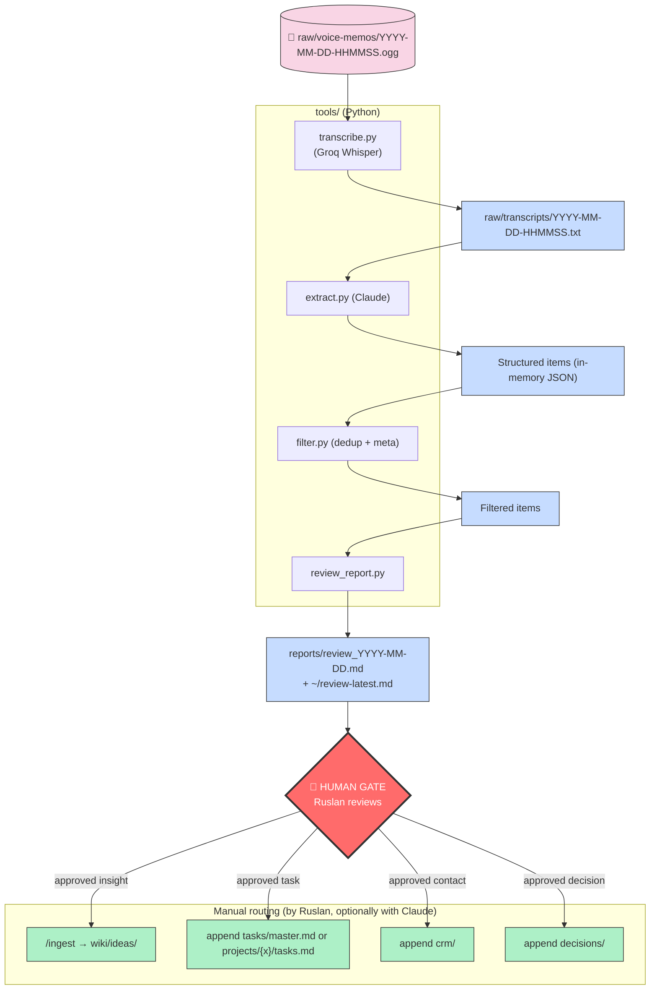

### F.2.3 Output locations

- Voice file: remains в `raw/voice-memos/` (immutable).
- Transcript: `raw/transcripts/YYYY-MM-DD-HHMMSS.txt` (UTF-8 russian).
- Review report: `reports/review_YYYY-MM-DD.md` + copy в `~/review-latest.md`.
- After Ruslan routing: varies (wiki/ideas, tasks, crm, decisions).

### F.2.4 Failure modes

| Failure | Response |
|---------|----------|
| Transcription timeout | Retry 1×; if fail → item unprocessed, Ruslan notified |
| `extract.py` malformed JSON | `filter.py` safely drops bad records + logs |
| Review report generation fail | Partial report saved + error note |
| Groq rate limit | Backoff + retry; manual fallback possible (Ruslan types) |

### F.2.5 Metrics

- Voice→transcript latency < 30s for 10-min memo (measurable).
- Extract precision ≥80% (Ruslan reviews, subjective for v1-beta; v1-final golden fixtures).

### F.2.6 Why human gate обязательный

`distribute.py.bak` — disabled намеренно. Claude-выводы **не попадают в KB без
human review**. Rationale:
- Hallucination risk (R-10) → wiki pollution compounding.
- Context-specific routing decisions Ruslan understands better (task vs idea
  vs project).
- "Слоу" (slower) но safer pipeline.

---

## §F.3 External content → wiki (`/ingest <source>`)

### F.3.1 Trigger & preconditions

**Trigger:** Ruslan passes URL or file path к `/ingest`.

**Preconditions:**
- File exists OR URL доступен via WebFetch.
- Git working copy clean (или accepted uncommitted).
- Wiki templates in `wiki/_templates/` loadable.

### F.3.2 Sequence diagram

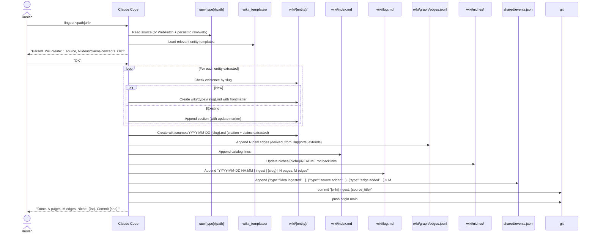

### F.3.3 Steps (prose)

1. **Fetch source:** WebFetch (URL) или Read (file path).
2. **Persist raw** in `raw/web/` (if URL) или verify `raw/*` location.
3. **LLM pass:** identify entity types (concept/entity/claim/idea), extract key
   facts, map to 9 types. Apply confidence scores (see invariant I-09):
   - Явная цитата → 0.8-1.0.
   - Inferred → 0.5-0.7.
4. **For each identified entity:**
   - Check existence by slug (wiki already has? `wiki/{type}/{slug}.md`).
   - If new → create with template + frontmatter.
   - If exists → append section, mark update.
5. **Create source card** `wiki/sources/YYYY-MM-DD-{slug}.md`:
   - Citation (URL, author, date).
   - Claims extracted (with confidence).
   - Topics.
6. **Append edges** to `edges.jsonl`:
   ```json
   {"from":"wiki/sources/...","to":"wiki/concepts/...","type":"supports","created":"YYYY-MM-DD","origin":"/ingest","confidence":0.85,"valid_from":"YYYY-MM-DD"}
   ```
7. **Update `index.md`** with new page refs.
8. **Update niche READMEs** (backlinks for niche navigation).
9. **Append `log.md`** event.
10. **Emit events** к `shared/events.jsonl`.
11. **Commit + push.**

### F.3.4 Output summary

- 1 source page + N entity pages + M edges + index entries + log entry.
- Event trail в `shared/events.jsonl`.
- Chat report: "N pages, M edges, niche: {list}, confidence avg {X}".

### F.3.5 Failure modes

| Failure | Response |
|---------|----------|
| WebFetch 403/404 | Report error; ask Ruslan alternative |
| LLM can't parse (corrupted PDF) | Fallback: source-only page + claim "needs manual extraction" |
| Duplicate detected (high similarity) | Suggest `/consolidate`; default merge in-place + notice |
| Malformed content (unexpected format) | Partial ingest + report к Ruslan |
| Git push fail | SAFE-SAVE, note "push pending" |

---

## §F.4 Query + writeback (`/ask <question>`)

### F.4.1 Trigger & preconditions

**Trigger:** Ruslan asks через `/ask` or `./jetix ask "..."`.

**Preconditions:**
- wiki/ populated (index.md, edges.jsonl existent).
- Anthropic API available (else Kay mode: grep-only search + Ruslan reads raw).

### F.4.2 Sequence diagram (with HippoRAG PPR)

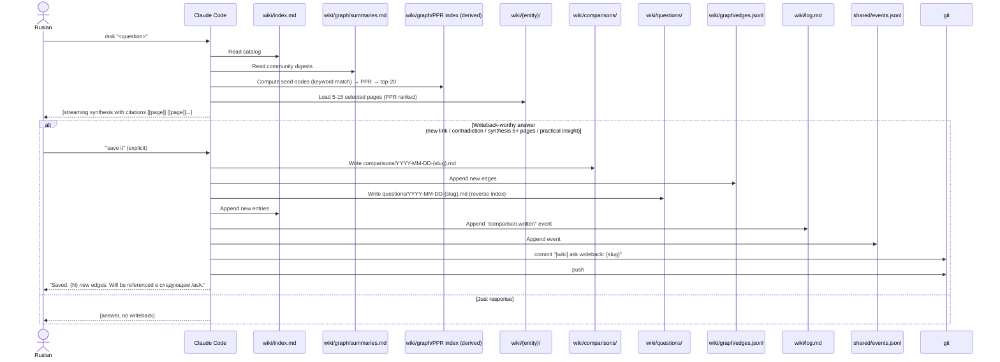

### F.4.3 Writeback criteria

`comparisons/` write ONLY if ≥1 of:
- **Новая связь** между 2+ pages (создаёт ≥1 new edge).
- **Contradiction detected** → edge type `contradicts`.
- **Синтез по 5+ pages** (summary level).
- **Practical insight** с applicability.

Иначе — просто ответ в чате без writeback.

### F.4.4 HippoRAG PPR (invariant I-27)

**Algorithm (simplified):**
```python
def hipporag_retrieve(question, k=20):
    seeds = keyword_match(question, wiki_index)  # lexical seeds
    pagerank_scores = personalized_pagerank(
        graph=load_edges_jsonl(),
        seeds=seeds,
        damping=0.85,
    )
    top_k = sorted(pagerank_scores.items(), key=lambda x: -x[1])[:k]
    return [page for page, _ in top_k]
```

**Implementation:** `tools/hipporag.py` ~50 LOC (networkx + pagerank).

**Cache:** after each `/build-graph`, precompute PPR for common seed-sets →
`wiki/graph/PPR-cache.json`. Refresh when edges.jsonl grows >10%.

### F.4.5 Reverse index `wiki/questions/` (invariant I-30)

Every `/ask` → save:

```markdown
---
type: question
created: YYYY-MM-DD
times-asked: 1
last-asked: YYYY-MM-DD
similar-to: []  # linked on re-ask
status: answered
---

# Question: {question text}

## Short synth
{2-3 sentences answer summary}

## Top 5 relevant pages
- [[wiki/ideas/focus-theory]]
- [[wiki/claims/brooks-law]]
- ...

## Answer generated at {timestamp}
[full answer, as given to Ruslan]
```

**Repeat query:** detects similar existing entry, inc'its `times-asked`, shows
prior answer + **diff** (what's changed since `last-asked`).

### F.4.6 Failure modes

| Failure | Response |
|---------|----------|
| Vague question | Claude asks clarification |
| No relevant pages | "No wiki support; proceed with uncited opinion? y/n" |
| Rate limit | Partial answer from already-loaded pages + SAFE-SAVE + retry suggestion |
| PPR computation fail | Fallback: lexical match only (degraded quality, documented) |

---

## §F.5 Evening ritual (`/close-day`)

### F.5.1 Trigger & preconditions

**Trigger:** Ruslan runs `./jetix close-day` или `/close-day` (end of work block).

**Preconditions:**
- `daily-log/{today}.md` exists (с morning plan).
- `daily-log/drafts/{today}-*.md` may or may not exist.

### F.5.2 Sequence diagram

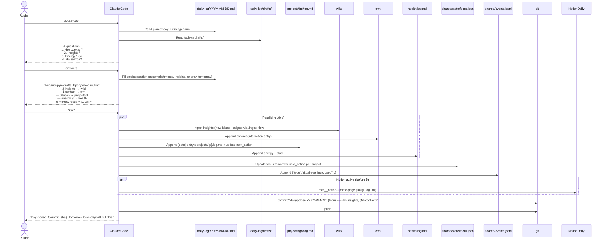

### F.5.3 Steps (prose)

1. **Read today's daily-log** + all `daily-log/drafts/{today}-*.md`.
2. **Ask 4 questions** (canonical):
   - Что сделал? (objective facts)
   - Key insights?
   - Energy level 1-5?
   - Tomorrow priorities?
3. **Fill structured sections** of `daily-log/{today}.md`.
4. **Process drafts** — identify artifact candidates:
   - Insights → `wiki/ideas/{slug}.md` drafts (Ruslan approve).
   - Tasks → `tasks/master.md` or `projects/{p}/tasks.md`.
   - Contacts → `crm/{category}.md`.
   - Decisions → `decisions/...`.
   - State (energy, mood) → `health/log.md`.
5. **Distillate** (GitHub-style): each draft with `promoted-to: [paths]`
   frontmatter → writeback flows.
6. **Update `focus.json`** for tomorrow.
7. **Update projects' `next_action`** per project mentioned today.
8. **Notion sync** (while Фаза < δ): `mcp__notion-update-page` Daily Log DB.
9. **Emit event** `ritual.evening.closed`.
10. **Commit + push.**

### F.5.4 Draft promotion invariant

Each draft should ideally have (optimizer §1.7):

```yaml
---
type: daily-draft
created: YYYY-MM-DD
topic: {topic-slug}
status: raw | distilled
promoted-to: []  # filled at close-day
---
```

At close-day, Claude fills `promoted-to: [wiki/ideas/X.md, crm/partners.md, tasks/master.md]`
showing where content went. Enables reverse-query: "which drafts породили most
wiki content?" (productivity metric).

### F.5.5 Failure modes

| Failure | Response |
|---------|----------|
| Ruslan в спешке, отвечает коротко | Claude accepts minimum (energy only) |
| Skipped close-day вчера | Claude offers quick retrospective (5 min) |
| Notion MCP down (before δ) | SAFE-SAVE; note "notion sync pending" во frontmatter; reconcile позже |
| No drafts, empty day | Records "low-activity day" — still commits Daily Log |

---

## §F.6 Weekly natyagivanie (`/cross`)

### F.6.1 Trigger & preconditions

**Trigger:** Ruslan runs `./jetix review week` или `./jetix cross hypotheses projects`.

**Preconditions:**
- 5-7 daily-log files за неделю.
- `projects/` active > 0.
- `hypotheses/active.md` или related entities.

### F.6.2 Sequence diagram

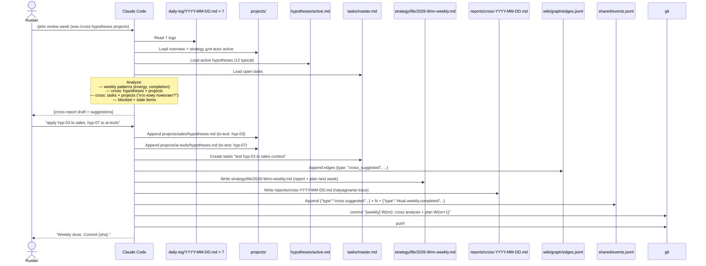

### F.6.3 Natyagivanie (cross) as primitive (invariant I-28 adopted from optimizer §1.2)

`./jetix cross <A> <B>` — generalized skill. Examples:

| Command | Meaning |
|---------|---------|
| `./jetix cross hypotheses projects` | Apply all hypotheses × each project |
| `./jetix cross tasks projects` | "Who helps whom?" cross-pollination |
| `./jetix cross decisions projects` | Are we violating our own decisions? |
| `./jetix cross strategy-A strategy-B` | Apply project A's strategy onto B |

**Gradient boosting effect (optimizer §1.2):** previous `cross_suggested` edges
are input — system doesn't re-discover same cross-links. Each iteration
builds on residuals.

### F.6.4 Weekly report structure

`strategy/life/2026-Wnn-weekly.md` (templated):

```markdown
---
type: weekly-report
week: 2026-Wnn
start: YYYY-MM-DD
end: YYYY-MM-DD
created: YYYY-MM-DD
---

# Week {nn}, 2026

## What happened (evidence)
- {bullet points from daily logs, chronological}

## Key metrics delta (from METRICS.md)
- wiki edges +N | decisions +N | natyagivaniya +N | unclear-backlog N

## Insights
- {from daily-log reflections + close-day insights distilled}

## Projects status
- quick-money: {progress, blockers}
- research: ...

## Natyagivanie results (this week)
- hypotheses × projects → {N cross-suggestions, {K} adopted}

## Honest retro (what didn't work)
- {reflection-agent-style honest critique, optional}

## Plan for next week
- Focus: {one thing}
- Key actions: 1, 2, 3
- Experiments / hypotheses to test: ...
```

### F.6.5 Failure modes

| Failure | Response |
|---------|----------|
| Data gaps (skipped days) | Mark "data incomplete" — don't fabricate |
| Project logs empty (inactive) | Mark paused/not-updated |
| No active hypotheses | Skip hypotheses × projects cross |
| Analysis depth overflow context | Decompose: 1-pass summary + selective deep dives |

---

## §F.7 Error flow — SAFE-SAVE

### F.7.1 Trigger

Any of:
- Unhandled exception.
- External dependency unavailable (API 529, MCP disconnect).
- Agent confused / doesn't know how to proceed.
- Git conflict (unresolvable automatically).
- Context overflow (≥95% fill).
- Uncertainty about destructive op.

### F.7.2 Sequence diagram

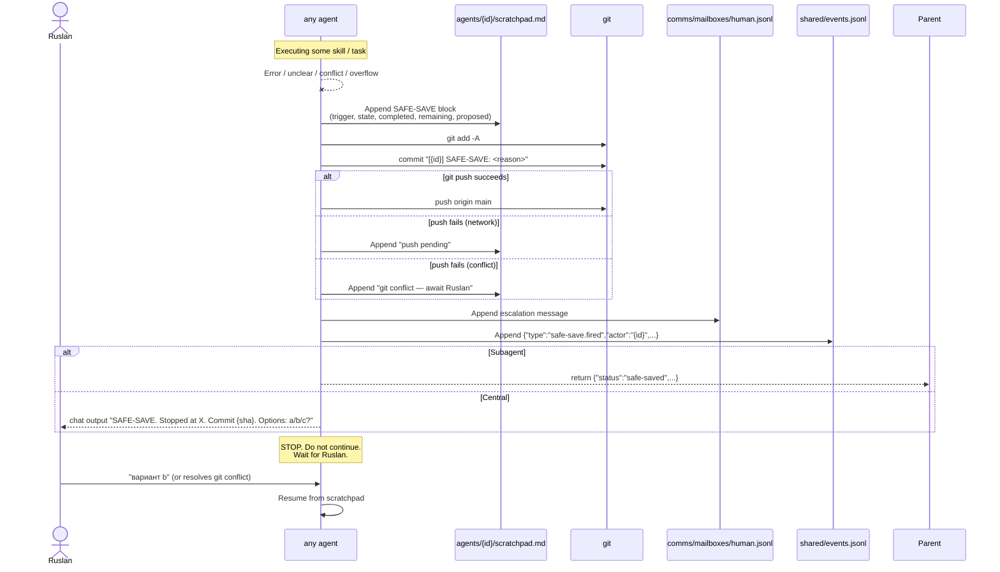

### F.7.3 SAFE-SAVE guarantees (invariants)

- **Never deletes state** — only fixates.
- **Always commits + pushes** (or notes "push pending").
- **Always reports к Ruslan** через mailbox + chat.
- **Always stops** — не "гадает" resolution.

### F.7.4 Recovery protocols

| Trigger | Recovery path |
|---------|---------------|
| API 529 | Retry 3× backoff; then SAFE-SAVE; Ruslan can try later or switch model (`JETIX_LLM=...`) |
| MCP disconnect | Switch to local dumps (`raw/notion-*`); continue |
| Git conflict | Ruslan resolves manually (NEVER force) |
| Context overflow | Decompose via Task tool OR `/compact` OR session restart |
| Agent confused | Ruslan clarifies; agent resumes with guidance |

---

## §F.8 Notion migration (α/β/γ/δ)

### F.8.1 Phase overview

(Full plan: `design/NOTION-MIGRATION-PLAN.md` 525 lines. Here — synthesis.)

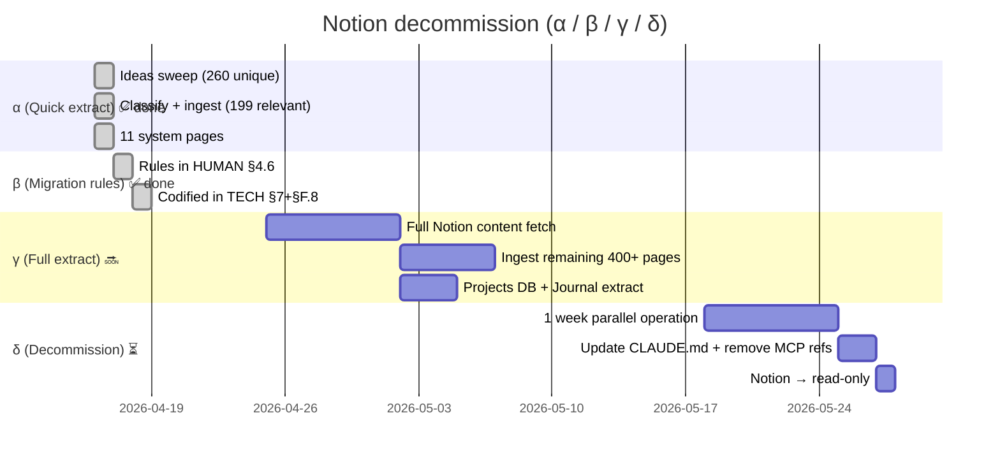

### F.8.2 Generic migration flow (per batch)

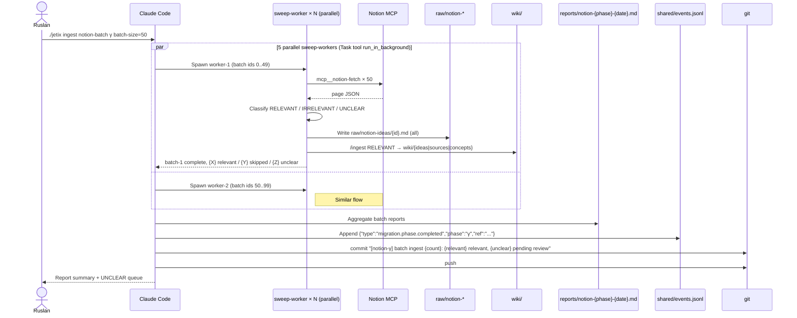

### F.8.3 Phase-specific details

**Phase α (done):** Quick extract.
- Input: 260 idea sweep + 11 system pages.
- Output: 199 RELEVANT в `wiki/ideas/` + `wiki/sources/`; 11 system pages в `raw/notion-pages/` + wiki.
- Commits: `[notion-α]` prefix.

**Phase β (done):** Rules.
- Migration rules codified в HUMAN §4.6, TECH §7 + §F.8.
- No data migration — doc phase.

**Phase γ (upcoming):** Full extract.
- Input: остальные 400+ idea cards + full DB contents (Projects, Journal of Chats, Daily Log legacy).
- Flow: sweep-worker batches of 50, 5 parallel workers.
- Output: `raw/notion-*` complete archive + wiki/ populated.
- Tag: `notion-gamma-complete-YYYY-MM-DD`.

**Phase δ (final):** Decommission.
- Criteria for cutover (ALL must be TRUE):
  1. Every Notion page has соответствие в wiki/projects/archive.
  2. All 4 DBs fully exported.
  3. All attachments downloaded.
  4. `/ask` answers any system question без Notion MCP.
  5. No agent declared with `mcp__notion-*` tool.
  6. No skill calls Notion MCP.
  7. CLAUDE.md updated (remove "Notion = external truth").
  8. 7 days of parallel operation без new data loss detected.
  9. Ruslan explicit "OK".
- Tag: `notion-decommissioned-YYYY-MM-DD`.

### F.8.4 Idempotency

**Invariant:** `/ingest` skips items with hash match to existing `raw/notion-ideas/{id}.md`.
Prevents re-import.

### F.8.5 Failure modes

| Failure | Response |
|---------|----------|
| Notion MCP down mid-batch | SAFE-SAVE batch state (IDs done); Ruslan resumes when MCP back |
| Anthropic rate limit | sweep-worker pauses + backoff; on persistent fail → SAFE-SAVE + Ruslan resumes |
| Notion API change mid-migration | Report: "X/Y complete, stopped at Z"; Ruslan diagnoses MCP; restart from checkpoint |
| Duplicate edge case | Write to `reports/sweep-conflicts-YYYY-MM-DD.md` for manual reconcile |
| Rich content (tables, toggles, formulas) lost in markdown | Preserve raw JSON в `raw/notion-pages-raw/`; selective reformat in γ |

---

## §F.9 State machines — key entities

### F.9.1 Project lifecycle

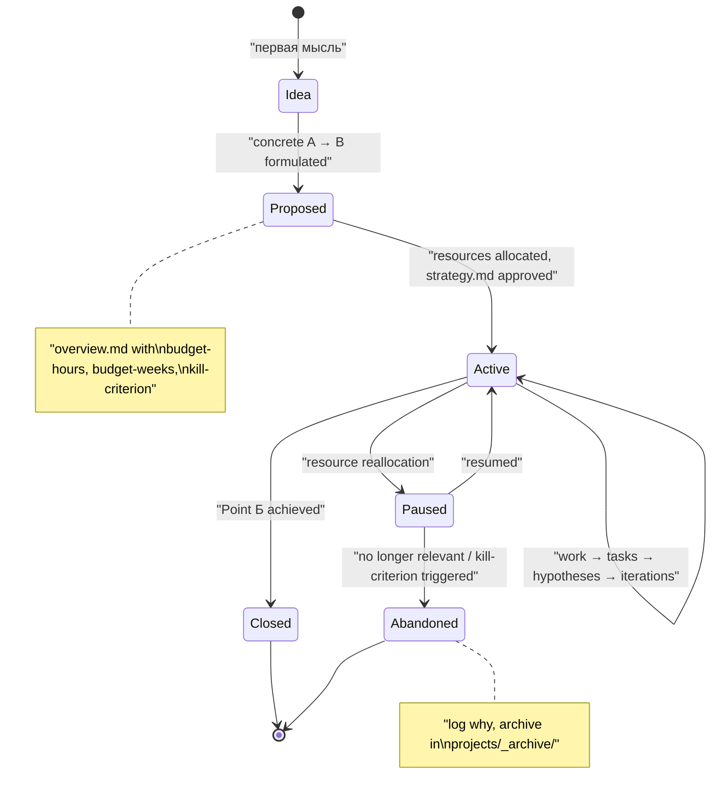

### F.9.2 Task lifecycle

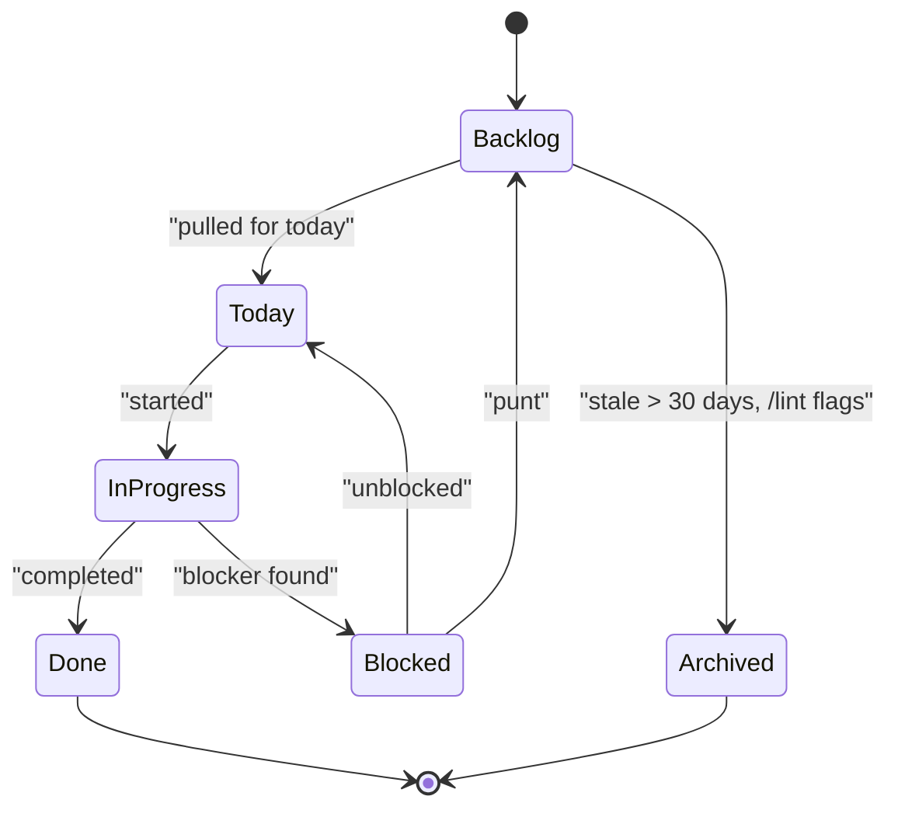

### F.9.3 Hypothesis lifecycle

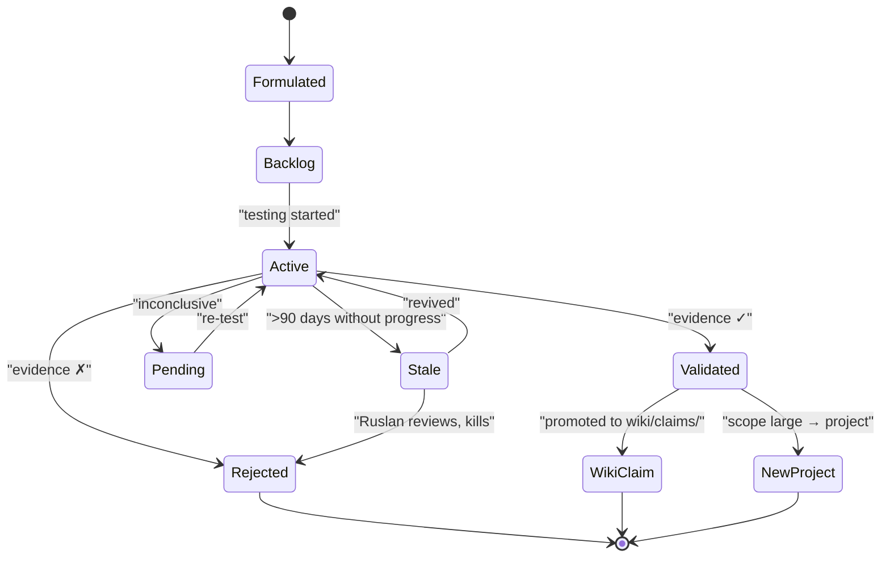

### F.9.4 Decision lifecycle

```mermaid
stateDiagram-v2
    [*] --> Draft : "proposal (strategist, plan mode)"
    Draft --> Rejected : "Ruslan rejects → archive"
    Draft --> Recorded : "Ruslan approves → decisions/{slug}.md"
    Recorded --> InForce : "applied"
    Recorded --> Propagated : "/propagate-decision → agents' strategies.md"
    Propagated --> InForce : "agents aware"
    InForce --> Reviewed : "replay-check run (weekly reflection)"
    Reviewed --> InForce : "still valid"
    Reviewed --> Superseded : "new decision replaces (old keeps history)"
    InForce --> Archived : "no longer relevant"
    Superseded --> [*]
    Archived --> [*]
    Rejected --> [*]

    note right of Recorded : "NEVER deleted.\nOnly appended events:\nreviewed / superseded / archived"
```

### F.9.5 Idea lifecycle

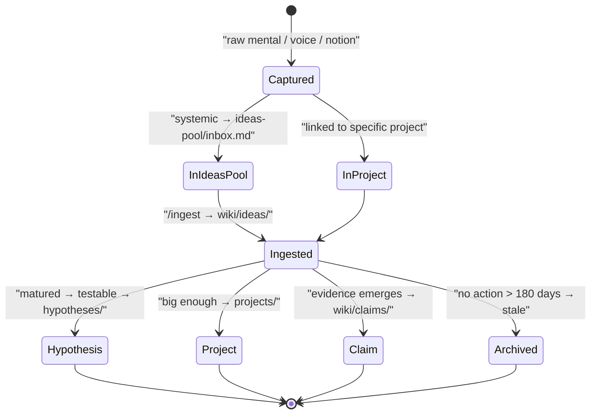

### F.9.6 Edge temporal lifecycle

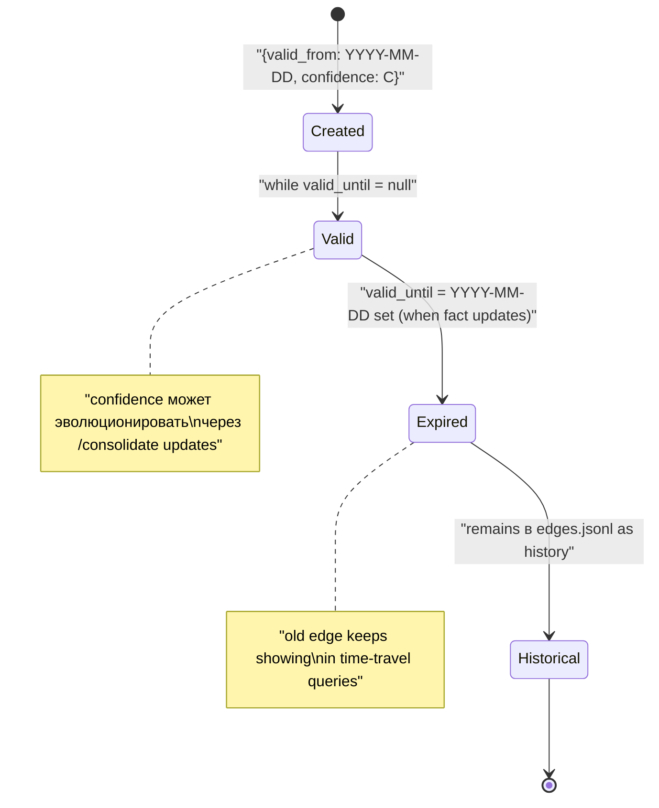

---

## §F.10 Cross-cutting flow invariants

All flows share:

### F.10.1 Provenance enforcement
Every wiki page resulting from ingest carries `sources:` frontmatter
(invariant I-07). Без provenance — `/lint` fails.

### F.10.2 Idempotency
All ingest operations dedup by slug/hash. Prevents accidental re-processing.

### F.10.3 Append-only logs
Each flow appends к:
- `wiki/log.md` (wiki events).
- `shared/events.jsonl` (unified canonical stream).
- Specialized: `decisions/*-log.md`, `projects/{x}/log.md`, mailboxes.

### F.10.4 SAFE-SAVE on failure
Any error → §F.7 pattern. Invariant I-14 non-negotiable.

### F.10.5 Git discipline
Every completed sub-step — commit. Every flow end — push. Invariant I-21.

### F.10.6 Human gate for L3 (strategy + decisions)
No flow автоматически writes к `strategy/`, `decisions/`, `projects/{x}/strategy.md`
without explicit Ruslan approval (invariant I-11).

### F.10.7 Voice pipeline: hard human gate
`~/review-latest.md` — mandatory stop (§F.2). `distribute.py.bak` — disabled
intentionally.

### F.10.8 Writeback compounding
After `/ask` — optional writeback to `comparisons/` + `questions/` + edges
(§F.4). Next `/ask` benefits from prior context. This is the compounding
engine.

### F.10.9 Event emission discipline
Every skill invocation emits to `shared/events.jsonl`. Enables time-travel
queries (`git checkout` + replay), analytics, `./jetix metrics`.

### F.10.10 Semi-manual mode
All flows triggered by Ruslan's explicit command. No cron, no event-driven,
no autonomy budget. Invariant I-19.

---

## §F.11 Flow summary map

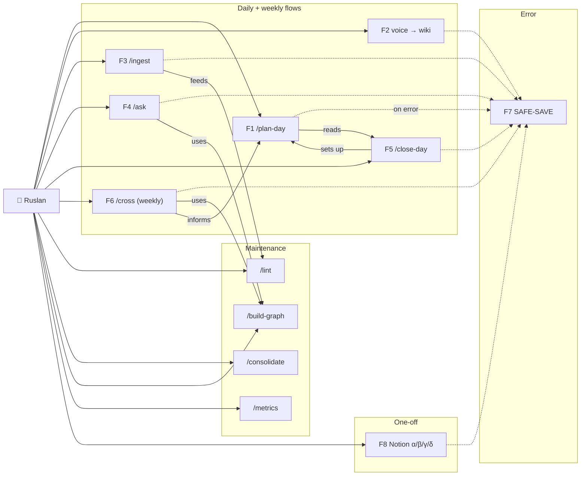

---

## §F.12 Closing observation

Все flows соблюдают shared pattern:

```
1. git pull (ensure fresh state)
2. Read current state (configs, state files, relevant data)
3. Plan / decompose the operation
4. Execute (with SAFE-SAVE on any error)
5. Emit event to shared/events.jsonl + domain-specific log
6. Commit (with convention message)
7. Push origin main
8. Report to Ruslan (or parent agent)
```

This is **the canonical execution pattern** of Jetix OS. Every new skill /
ritual added **must** follow it. Consistency = debuggability = Q1 Transparency.

---

*End of DATA-FLOWS.md v1-beta. ~900 lines, 8 canonical flows + 6 state machines
+ cross-cutting invariants. Synthesized from both engineer reviews
(Engineer A arc42 Runtime view + Engineer B mermaid-first sequence diagrams).
Writeback / HippoRAG / questions reverse index — optimizer leverage embedded.
Living document — extend when new flows / state machines stabilize.*
