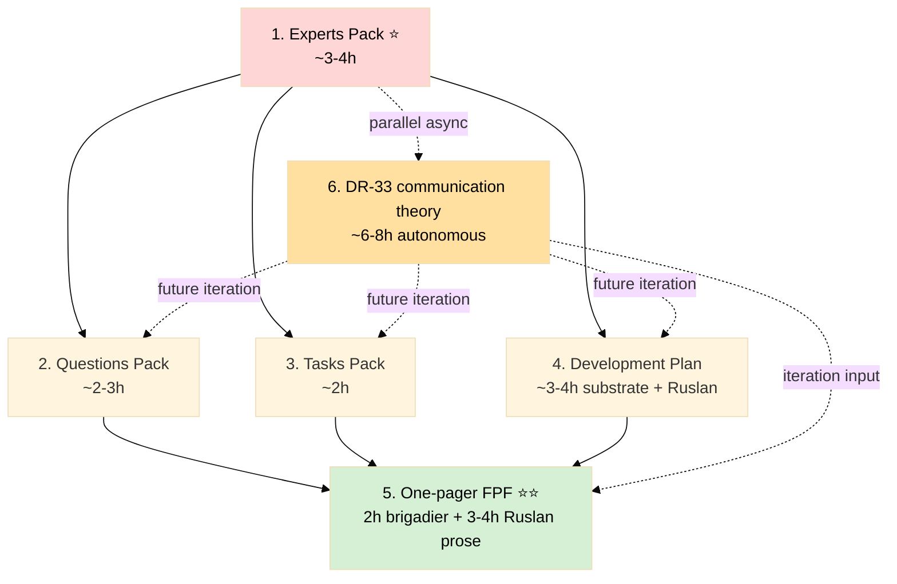

# 📦 Expanded Docs Plan — 6 documents для быстрой передачи Jetix-идеи

> **Thesis (Ruslan voice 21.05):** «колоссальную идею донести любому человеку за 30-60 min». FPF = universal language testing — pitch это и доносит, и тестирует FPF.
>
> **6 documents** строим в определённом order. Heavy lifting = server CC autonomous (2 prompts). Ruslan = strategic prose authoring on top of substrate.

---

## §0 TL;DR (≤200w)

6 documents:
1. **Experts Pack** ⭐ FIRST — описание Jetix через 5 ROY swarm experts lenses (engineering / investor / mgmt / philosophy / systems) + перечитанный corpus
2. **Questions Pack** — конкретные открытые вопросы (% партнерам / first-cohort профиль / monetization edges / etc.)
3. **Tasks Pack** — все задачи на данный момент (что ещё надо сделать)
4. **Development Plan** — план развития (multi-horizon: week / month / quarter / year+)
5. **One-pager** (FPF lang) — primary deliverable; mention FPF как universal language testing
6. **DR-33 «как доносить информацию»** — deep research parallel async

Order: 1 → 2,3,4 (parallel) → 5 → 6 (parallel async).

**Heavy execution:** 2 server CC autonomous prompts (DR-26 unit-econ + Expanded docs substrate). Cloud Cowork = orchestrator.

---

## §1 Why это нужно (Ruslan voice 21.05)

- One-pager в одиночку **не покрывает** все аспекты Jetix → нужны supplementary docs для глубокого диалога с разными audiences
- **% партнерам** = critical open question — first-cohort joiners должны знать структуру вознаграждения; Без этого pitch расплывается
- **5 ROY experts** = native Jetix substrate — Jetix построен с 5-lens orchestration; описание через них = self-coherent + signals depth
- **FPF universal language thesis** — если получится донести колоссальную идею за 30-60 min, это **proof-of-concept FPF** (meta-level)
- **DR-33** — communication theory layer; информирует styling всех 5 docs + future iterations

---

## §2 6 Documents — детальный breakdown

### 1. ⭐ Experts Pack — `decisions/strategic/EXPERTS-PACK-2026-05-21.md`

**Что:** Описание Jetix через 5 ROY swarm expert lenses + перечитанный corpus.

**5 expert lenses:**
- `engineering-expert.md` — clean code / architecture / system design view
- `investor-expert.md` — capital / unit-econ / moats view
- `mgmt-expert.md` — PM / delivery / ethics-surface view
- `philosophy-expert.md` — epistemology / mental models / stoic view
- `systems-expert.md` — systems thinking / cybernetics / VSM view

**Структура per expert (~600-800w):**
- Что этот expert видит в Jetix (сильные / слабые стороны через lens)
- Что Jetix отвечает на их queries
- Какие компоненты Jetix больше всего relevant к этому lens
- Какие open questions / risks из этого lens

**Why FIRST:** перед остальными docs нужна re-read corpus через 5 lenses → это foundation. Без этого Questions / Tasks / Dev Plan / One-pager будут «slop» без expert depth.

**Owner:** Server CC autonomous (heavy read через corpus + 5-lens synthesis).

**Time:** ~3-4h (corpus pass + 5 expert sections).

### 2. Questions Pack — `decisions/strategic/QUESTIONS-PACK-2026-05-21.md`

**Что:** Все конкретные вопросы на которые ещё нет ответов или требуется уточнение.

**Категории вопросов:**
- **Monetization** — % партнерам (Mondragón ratio? QF? other?); revenue split per tier; reinvestment loop
- **First-cohort профиль** — кто идеальные founding partners; quantity (3 / 10 / 30?); selection criteria
- **R12 paired-frame edge cases** — что считается «extraction beyond agreed share» в practice
- **Legal / Foundation formation** — что нужно зарегистрировать, когда; jurisdiction (DE? US? other?)
- **Technology stack** — какой LLM provider lock-in risk; on-prem vs cloud для customer data
- **Operational** — daily cadence sustainable как scale (15-20/day → 100/day?)
- **Strategic** — Levenchuk responsiveness contingency; Karpathy clusters dependency
- **Risks** — R-batch-9-N1..N4 open mitigations
- **Hypothesis priorities** — какие из 22 Tier B + 25 DR пойдут first для testing

**Structure per question:**
- Question (verbatim)
- Why this matters (impact)
- Current state (что known)
- Gap (что unknown)
- Resolution path (ack / DR / experiment / Ruslan reflection)

**Owner:** Server CC autonomous (compile из всех substrate documents).

**Time:** ~2-3h.

### 3. Tasks Pack — `decisions/strategic/TASKS-PACK-2026-05-21.md`

**Что:** Все active tasks (что ещё надо сделать).

**Включает:**
- 18 KAs batch-9 + 16 KAs batch-7 + 14 KAs batch-8 (consolidate / dedup)
- 7 A-actions FINAL v2 + 11 A-actions Updated Plan 21.05
- 22 Tier B candidates + 25 DR candidates (pool referenced)
- 5 GAPS Левенчук distillation
- 6 ⭐⭐⭐ chapters future deep FPF phase
- Foundation Strategic Layer Phase 2 onset items

**Structure (Kanban-style):**
- **NOW (this week)** — A-actions Week 1
- **NEXT (this month)** — A-actions Week 2-4
- **LATER (this quarter)** — Phase 2-3 cascade items + deep FPF phase
- **POOL (defer / cherry-pick)** — Tier B + DR pool referenced
- **DROPPED (with reason)** — SKIP-list O-62/O-66/O-67/O-68

**Owner:** Server CC autonomous (consolidate из всех existing KA lists + A-actions + pools).

**Time:** ~2h.

### 4. Development Plan — `decisions/strategic/DEVELOPMENT-PLAN-2026-05-21.md`

**Что:** План развития multi-horizon.

**Horizons:**
- **Week 1 (21-26.05)** — One-pager + детальные documents + first outreach
- **Week 2-4 (27.05-15.06)** — cascade activation + Tier-1 outreach + first hypothesis closures
- **Month 2-3 (15.06-31.07)** — first cohort traction + monetization tests + ROY swarm hardening
- **Quarter 3-4 (Aug-Dec 2026)** — $100K revenue milestone + first 1000 users
- **Year+ (2027+)** — $1B trajectory + 1M users + humanity-scale framing

**Structure per horizon:**
- Key milestones
- Required capabilities
- Risks / dependencies
- Decision gates
- Success metrics

**Owner:** Server CC substrate (но R1 — Ruslan reviews + approves всё strategic direction; brigadier surfaces options NOT decides).

**Time:** ~3-4h substrate; +Ruslan review.

### 5. One-pager — `decisions/strategic/ONE-PAGER-FPF-2026-05-21.md`

**Что:** Primary deliverable — quick передача Jetix идеи за 30-60 min через FPF language.

**Структура (~600-800w, на FPF):**
- **Hook:** «we are working on humanity-level project together» (O-86 frame) + «FPF universal language — we are testing this conveyance»
- **Problem:** information overload + method gap (Левенчук + Method-Systems-Thinking)
- **Solution:** **«метод по объединению методов по улучшению системы самой себя»** (O-107 canonical one-liner) + 3-tier education funnel
- **Differentiation:** 4 Левенчук-cited concepts + K-6 31 components + 8-doc inventory (audio_709) + hypothesis architecture operational + ROY swarm 5-experts
- **FPF mention:** explicit «this very document tests FPF as universal language for quick conveyance of colossal idea в 30-60 min»
- **Offer (R12 paired):** free учебник + Claude Code access + community + Hypothesis arch substrate
- **Ask (R12 paired):** voluntary engagement + feedback + (optional) первый cohort partnership с 20-25% take rate (DR-26 validation pending)

**Constraints:**
- R12 paired-frame mandatory (offer + ask explicit + voluntary)
- ≥3 Левенчук cross-cites
- O-75 + O-86 frames integrated
- Aggressive language paraphrase (R-3 risk mitigation)
- 20-25% take rate provisional (DR-26 gates public lock)

**Owner:** **R1 — Ruslan strategic prose authoring** (substrate ready post Experts Pack); brigadier compile substrate only.

**Time:** brigadier substrate ~2h + Ruslan prose ~3-4h.

### 6. DR-33 NEW — `prompts/dr-33-communication-best-practices-2026-05-21.md`

**Что:** Глубокий research «как лучше всего доносить колоссальную идею».

**Scope:**
- Communication theory baseline (Shannon / Berlo / Schramm models)
- Best practices: TED-talk structure / Heath «Made to Stick» (SUCCES framework) / Pixar storytelling / Feynman simplification / Kahneman dual-process targeting
- FPF context: что FPF делает better / worse vs natural language
- Audience-specific (L1 engineer / L2 amplifier / L3 institutional / humanitarian) styling adaptation
- Mediation channels: written / video / podcast / talk / 1-on-1 / async DM
- Time-budget optimisation: 30 sec / 5 min / 30 min / 1 h / 1 day formats per audience

**Owner:** Server CC autonomous (deep research like prior DRs).

**Time:** ~6-8h autonomous.

**Output:** `research/communication-best-practices-2026-05-21/` с Summary + 5-7 sub-docs + mermaid diagrams.

**Ack:** Ruslan explicit «глубокий ещё ресерч сделаем» (voice 21.05).

---

## §3 Order + Dependency map

**Critical path:** Experts Pack → Questions/Tasks/Dev Plan parallel → One-pager.

**DR-33:** parallel async (input для iteration, not blocking critical path).

---

## §4 Конкретные шаги (executive)

### Cloud Cowork session (этот) — DONE этой сессией ✅

- ✅ ACK всё D9-* в REFLECTION-INBOX
- ✅ §APPEND Daily Log 21.05 scope expansion
- ✅ Hypothesis _log.md promotion record
- ✅ This document (`_EXPANDED-DOCS-PLAN-2026-05-21.md`)
- ⏳ Prepare 2 server CC prompts (DR-26 unit-econ + Expanded docs substrate)
- ⏳ Commit + push

### Server CC autonomous (post-push)

**Prompt 1: `expanded-docs-substrate-2026-05-21.md`** (~6-10h)
- Phase 0: FPF lens scope + corpus inventory
- Phase 1: **Experts Pack** — 5 ROY experts read + 5-lens corpus pass + per-expert sections (3-4h)
- Phase 2: **Questions Pack** compile (2-3h)
- Phase 3: **Tasks Pack** compile из existing KAs + A-actions + pools (2h)
- Phase 4: **Development Plan** substrate (3-4h, brigadier sub-strate; Ruslan reviews + decides)
- Phase 5: **One-pager** substrate prep (2h brigadier; Ruslan strategic prose authoring on top)
- Phase 6: Summary + final push

**Prompt 2: `dr-26-unit-econ-deep-dive-2026-05-21.md`** (~8-12h, parallel)
- Deep research unit-econ для 20-25% take rate validation
- Mondragón ratio analysis
- QF (Quadratic Funding) revenue distribution
- Comparable cooperative DAOs unit-econ baselines
- Output: `research/unit-econ-deep-dive-2026-05-21/` с memo + scenarios + recommendation

**Prompt 3 (DEFER): `dr-33-communication-best-practices-2026-05-21.md`** (~6-8h, parallel async)
- Heath / SUCCES + Pixar + TED + Feynman + Kahneman synthesis
- FPF-vs-natural-language analysis
- Audience-specific styling map
- Output: `research/communication-best-practices-2026-05-21/`
- **NOTE:** Defer launch до Experts Pack done (Experts Pack может surface specific communication needs).

### Ruslan steps (post Experts Pack)

1. Read Experts Pack (~10-15 min skim)
2. Review Questions Pack — ack / answer / defer per question
3. Review Tasks Pack — re-prioritize если нужно
4. Review Development Plan — R1 strategic decisions
5. **One-pager strategic prose authoring** (~3-4h sit-down session)
6. Hands-on `/hypothesis-add` H-batch-9-06 + H-08 (D9-6, 30-60 min)
7. Tier-1 ack queue review (14 names; A-NEW-8 Updated Plan)
8. End-of-Week-1: A-4 Дмитрий pitch send

---

## §5 Acceptance criteria

- ✅ All 6 documents created (5 brigadier substrate + 1 Ruslan strategic prose)
- ✅ Experts Pack covers 5 ROY swarm experts с corpus pass
- ✅ Questions Pack ≥30 concrete questions (target ~50)
- ✅ Tasks Pack consolidated KAs + A-actions (dedup) + pool references
- ✅ Development Plan 5 horizons (Week / Month / Quarter / Year / Vision)
- ✅ One-pager ≤800w + FPF language thesis + R12 paired-frame + ≥3 Левенчук cross-cites
- ✅ DR-33 (если launched) Summary + 5-7 sub-docs
- ✅ Constitutional posture preserved (R1 / R2 / R6 / R11 / R12 / IP-1 / EP-5 / AP-6 / append-only / research-pool-pattern)
- ✅ SKIP-list integrity (O-62/O-66/O-67/O-68 NOT surfaced)

---

## §6 Cross-refs

- Updated Execution Plan: `daily-logs/_UPDATED-EXECUTION-PLAN-2026-05-21.md`
- Daily Log 21.05: `daily-logs/_DAILY-LOG-2026-05-21.md`
- REFLECTION-INBOX ack: `decisions/REFLECTION-INBOX-2026-05-16.md` §APPEND-2026-05-21-Ruslan-ACK-all-D9
- Hypothesis arch: `hypotheses/docs/architecture-overview.md`
- ROY swarm experts: `.claude/agents/{engineering,investor,mgmt,philosophy,systems}-expert.md`
- Distribution Plan: `decisions/strategic/DISTRIBUTION-PLAN-2026-05-20.md`
- Левенчук distillation: `research/levenchuk-books-distillation-2026-05-20/`
- 5 acked concept docs F2 + Platform v2 + 6 K-research + Sprint-Synthesis-v2 + Master Map

---

*Expanded Docs Plan closure 2026-05-21. Heavy execution scheduled server CC autonomous. Ruslan = R1 strategic prose authoring on top of substrate. Constitutional posture preserved. FPF universal language testing thesis integrated.*
