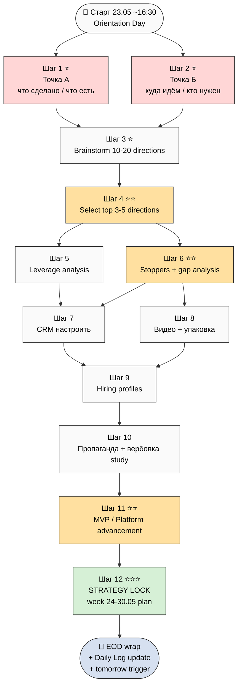

# 🎯 План дня — 2026-05-23 Saturday — **Orientation Day**

> **Day type:** Orientation (re-baseline + strategy formation, NOT execution)
>
> **Главная цель дня:** Составить новую стратегию + план на следующую неделю. **Выбрать самую эффективную** стратегию + план. **Разобраться конкретно** что мне (Ruslan) делать чтобы максимально продвинуть Jetix — отталкиваясь от ценностей заложенных в проект.

---

## §0 Главная цель (one-liner)

> **Собрать ВСЕ задачи и мысли в одно место → посмотреть что есть/чего нет → определить порядок → выполнить → зафиксировать точку Б + стратегию на следующую неделю → описать что дальше.**

Не execution day. Orientation = переразметка карты перед движением.

---

## §1 Контекст входа (start-of-day state)

### Substrate ready (что у нас УЖЕ есть — Точка А preview)

- **4 LOCKED canonical (sprint 21-22.05):** Method V2 / Strategic Plan / Economic Model V10 / AI Market PLAN Stage 1
- **Partner Offering Human-Lang** ACKED
- **3 NEW Tier A wikis** PROMOTED 22.05 (O-107 / O-121 / O-128 + 3 §APPEND)
- **DR-38 done** (8-component meta-method ~20-30K + sub-doc)
- **DR-40 done** (cybernetic external-system ~18-25K + companion)
- **3 NEW Tier A wikis batch-10 done** (Frankenstein O-122 / student-teacher O-130 / unified-framework O-129)
- **Navigation Guide DRAFT** на GitHub (sanitized; public)
- **GitHub repo PUBLIC** since 2026-05-23 — все ссылки work without login
- **AW + Toggl 22-23.05** done (10 entries / 28h35m)
- **Foundation v1.0 LOCKED** + 13 LOCKED items preserved
- **Дмитрий созвон состоялся** 22.05 — substrate готов

### Pending inputs

- Опционально — заполнить corpus Левенчука вручную (он сам делает по своей инициативе)
- Levenchuk Master Qualification research prompt готов (lev-master) — pending launch
- Navigation Guide deep prompt готов (nav-guide deep) — pending launch
- DR-37 (question-driven inquiry) + DR-43 (AGI-formula) — pending launch / prompt creation
- Wave 1 outreach send pending (Левенчук + Цэрэн + 3 МИМ-inner)

### SKIP today (out of scope)

- ❌ Wave 1 outreach send — сначала стратегия / orientation
- ❌ Code execution / heavy deep work — не execution day
- ❌ Создание новых deliverables — фиксируем что есть + планируем
- ❌ Voice batch-12 / новые ack records — стоп новый input, осмысление existing

---

## §2 Шаги дня (11 шагов в логическом порядке)

### Шаг 1 — Точка А: что сделано / что есть ⭐ (P1)

**Что:** описать current state — что конкретно сделано за последний месяц + 2 месяца + что есть лично у меня сейчас (сервер / документы / contacts / tools).

**Output:** документ `decisions/strategic/POINT-A-CURRENT-STATE-2026-05-23.md` (substrate compile от brigadier; Ruslan R1 prose pass)

**Содержание:**
- Sprint timeline 21.04 → 23.05 (38 days) — milestones по неделям
- Quantitative inventory — commits / words / docs / wikis / DRs / voice batches
- 4 canonical LOCKED — что внутри
- Foundation v1.0 architecture — что built
- Tools / infrastructure — ROY swarm / Wiki v2 / CRM / AW / Toggl / etc.
- Network — кто в CRM сейчас (KA-03 169 contacts inventory)
- Personal — где Ruslan лично сейчас (Berlin / health / energy / focus)

**Time:** 30-45 min

---

### Шаг 2 — Точка Б: куда идём в ближайшее время ⭐ (P1)

**Что:** описать target state — кто нужен / какие варианты людей подтянуть / какие ресурсы / время / команда.

**Output:** документ `decisions/strategic/POINT-B-NEAR-TARGET-2026-05-23.md`

**Содержание:**
- Target horizons — 1 неделя / 1 месяц / 3 месяца / 6 месяцев
- People needs — кто нужен сейчас (Layer 1 Founding 10-15 / Layer 2-3 contributors / ассистенты 5)
- Resource needs — capital ($20-50K Q3 audit + bridge) / time / tools / external services
- Team needs — 5 ассистентов (Sales / Tech / Video / Notion+Tests / Outreach research)
- Outreach pipeline — Wave 1 / Wave 1.5 / Wave 2-5 cascade
- MVP June Sprint target — Layer 1-3 build → 30 Июня platform ready
- Mass distribution Июль target

**Time:** 30-45 min

---

### Шаг 3 — Сгенерировать возможные направления (breadth, не selection) ⭐ (P1)

**Что:** brainstorm возможных стратегических направлений / путей продвижения Jetix. Surface всё, не выбирать.

**Output:** документ `decisions/strategic/STRATEGY-DIRECTIONS-BRAINSTORM-2026-05-23.md`

**Содержание:**
- 10-20 возможных стратегических направлений (broad surface)
- Per direction: scope / required resources / timeline / risks / opportunities
- Examples:
  - Direction A: Workshop-first (paying members → revenue → cohort)
  - Direction B: Open-source-first (Foundation + Method V2 public → community-driven adoption)
  - Direction C: Wave 1 elite Founding (10-15 builders → platform → mass)
  - Direction D: Content-first (video / blog / Twitter → audience → conversion)
  - Direction E: Token-first (launch Optimism L2 + V10 Hybrid → financial moat → cohort)
  - Direction F: Acquisition path (партнёрство с established players → leverage their distribution)
  - Direction G: Hackathon-as-platform (recursive build with cohort)
  - Direction H: Methodology consultancy (revenue funding → R&D)
  - и т.д.
- Per Goodhart's law — multiple criteria; не один scaler

**Time:** 45-60 min

---

### Шаг 4 — Выбрать самые эффективные направления ⭐⭐ (P1)

**Что:** из 10-20 directions Шаг 3 → cherry-pick 3-5 наиболее эффективных (по criteria: leverage / feasibility / alignment с values / R12 conformance / speed).

**Output:** документ `decisions/strategic/STRATEGY-SELECTED-DIRECTIONS-2026-05-23.md`

**Содержание:**
- 3-5 selected directions с обоснованием
- Per direction: critical path / first 3 actions / blockers / metrics
- Cross-pollination matrix (как они enrich друг друга)
- AP-6 dissent preservation — почему отвергнуты остальные

**Time:** 30 min

---

### Шаг 5 — Рычаги ускорения (leverage analysis) ⭐ (P2)

**Что:** посчитать какие есть **рычаги ускорения** — люди / команда / tools / capital / time / methodology. Что даст 10x effect.

**Output:** документ `decisions/strategic/LEVERAGE-ANALYSIS-2026-05-23.md`

**Содержание:**
- Leverage taxonomy: People / Capital / Tools / Time / Methodology / Network / AI
- Per leverage: current state / max potential / cost to activate / ROI estimate
- Top 5 highest-leverage moves для следующей недели
- AI-leverage specific — где AI substrate уже даёт 10-20× (Method V2 proof) → где можно ещё amplify

**Time:** 30 min

---

### Шаг 6 — Stoppers + Gap analysis: что нужно чтобы перейти из создания в продвижение ⭐⭐ (P1)

**Что:** что конкретно не хватает / стопперы / что нужно убрать чтобы перейти из **режима «создание»** в **режим «продвижение»**.

**Output:** документ `decisions/strategic/STOPPERS-GAP-ANALYSIS-2026-05-23.md`

**Содержание:**
- Current mode = «создание» (substrate building / R&D)
- Target mode = «продвижение» (distribution / cohort growth / revenue)
- Gap items list (10-15):
  - Video record не сделан → блокер для Wave 1
  - R1 prose pass на messages не сделан → блокер
  - CRM не proactively updated → блокер для outreach
  - MVP platform не built → блокер для credible Wave 2
  - Bridge capital $20-50K не raised → блокер для team
  - Team 5 ассистентов не hired → блокер для scale
  - и т.д.
- Per gap: что нужно конкретно сделать / время / приоритет

**Time:** 30 min

---

### Шаг 7 — CRM настроить ⭐ (P2)

**Что:** изучить мой входящий лист контактов (CRM 169 contacts) + настроить со всеми **потенциальными people кто может помочь** в продвижении.

**Output:** обновлённый CRM с tagging + outreach pipeline status

**Содержание:**
- Re-read CRM 169 contacts inventory (KA-03)
- Tag по relevance к Wave 1 / 1.5 / 2 / 3+
- Status update — кто warm / cold / contacted / ignored
- Surface 10-20 new potential helpers (которые могут multiply leverage)
- Cherry-pick top 10 для immediate proactive touch следующая неделя

**Tool:** `/crm-list` + `/crm-search` + `/crm-update` skills + `/crm-stuck`

**Time:** 30-45 min

---

### Шаг 8 — Видео + упаковка планирование ⭐ (P2)

**Что:** запланировать **какие видео нужно записать** + **какую упаковку сделать** для распространения.

**Output:** документ `decisions/strategic/VIDEO-PACKAGING-PLAN-2026-05-23.md`

**Содержание:**
- Video roadmap:
  - V1 (12 min) — Wave 1 anchor (Method V2 + values + Partner Offering)
  - V2 (18 min) — Long version Wave 1.5 (deep methodology)
  - V3 (3-5 min) — TikTok-ready short cuts
  - V4-N — Per-direction videos (Workshop / Tokenomics / Network State / etc.)
- Recording schedule — какие когда
- Packaging:
  - Slide deck (нужно ли — был Q7 default N; пересмотр)
  - One-pager
  - Visual brand kit
  - Landing page / GitHub Pages site
- Per packaging item: scope / time / blockers

**Time:** 30 min

---

### Шаг 9 — Кто конкретно нужен + на каких условиях ⭐ (P2)

**Что:** детально описать **кто именно сейчас нужен** + **зачем** + **на каких условиях** (compensation / commitment / role).

**Output:** документ `decisions/strategic/HIRING-PARTNERSHIP-PROFILES-2026-05-23.md`

**Содержание:**
- Per profile (10-15 profiles):
  - Layer 1 Founding builder × N (Karpathy-tier / Левенчук-tier / Buterin-tier / МИМ-tier)
  - Ассистент Sales — что делает / commitment / pay
  - Ассистент Tech — что делает / commitment / pay
  - Ассистент Video — what / commitment / pay
  - Ассистент Notion+Tests — what / commitment / pay
  - Ассистент Outreach research — what / commitment / pay
  - Advisors / mentors — что предлагаем
  - Investors (если нужны) — terms / ticket / stage
- Per profile: ideal candidate description + outreach plan + R12 paired-frame check

**Time:** 30-45 min

---

### Шаг 10 — Изучить пропаганду + вербовку (recruitment dynamics) ⭐ (P2)

**Что:** изучить **как работает пропаганда / вербовка** — это тоже навык. Применить к Jetix outreach.

**Output:** документ `decisions/strategic/PROPAGANDA-RECRUITMENT-STUDY-2026-05-23.md`

**Содержание:**
- Historical patterns: religious recruitment / political movements / network states / open source movements / crypto movements / startup founding teams
- Key books / sources: Cialdini «Influence» / Henrich «WEIRDest People» / Ostrom «Governing Commons» / Raymond «Cathedral & Bazaar» / Srinivasan «Network State» / movements case studies
- Mechanisms: voluntary opt-in vs coercion / status hierarchy / shared identity / clear thresholds / fork-and-leave
- Jetix-specific application: где применимо / где НЕ применимо (R12 paired-frame constraint)
- Concrete moves для Wave 1: framing / tone / pacing / call-to-action design

**Time:** 45-60 min

---

### Шаг 11 — MVP / Platform продвижение брейнсторм ⭐⭐ (P1)

**Что:** подумать **как уже сейчас можно продвинуть платформу** ИЛИ сделать **какой-то MVP** чтобы было что-то более мощное и осязаемое для показывания партнёрам.

**Output:** документ `decisions/strategic/MVP-PLATFORM-ADVANCEMENT-2026-05-23.md`

**Содержание:**
- Current «product» = substrate (Method V2 / docs / wikis) — это substrate-only, not product
- MVP candidates:
  - MVP-A: GitHub Pages landing (10-20h) — public face
  - MVP-B: Workshop online — live calls + recordings + Q&A (40h+)
  - MVP-C: Wiki v2 hosted UI (deeper)
  - MVP-D: ROY swarm public demo (взаимодействие с brigadier через web)
  - MVP-E: Methodology assessment tool (test ваше методологическое здоровье)
  - MVP-F: «Jetix CLI» open-source (Karpathy++ substrate как tool)
  - MVP-G: Partnership platform live (Charter signing + token mint)
  - и т.д.
- Per MVP: scope / time / leverage / what it unlocks
- Cherry-pick top 1-3 для immediate building следующая неделя

**Time:** 45-60 min

---

### Шаг 12 (финал) — Зафиксировать стратегию + план на неделю ⭐⭐⭐ (P1)

**Что:** консолидировать всё → выбрать **самую эффективную стратегию + план** → зафиксировать на следующую неделю → описать **что конкретно дальше делать**.

**Output:** документ `decisions/strategic/STRATEGY-LOCK-WEEK-24-30-MAY-2026-05-23.md` ⭐⭐⭐ MAIN deliverable дня

**Содержание:**
- Selected strategy (1 primary direction + 1-2 secondary support)
- Week 24-30.05 day-by-day plan:
  - 24.05 Sun — что делаем
  - 25.05 Mon
  - 26.05 Tue
  - 27.05 Wed
  - 28.05 Thu
  - 29.05 Fri
  - 30.05 Sat (re-orientation checkpoint)
- Per day: 3-5 concrete actions + outputs + time
- Risk register для недели
- Acceptance criteria (как пойму что неделя успешна)
- Wave 1 send target date (внутри недели)

**Time:** 45-60 min

---

## §3 Total time estimate

| Шаг | Time | Cumulative |
|---|---|---|
| 1 Точка А | 45m | 0:45 |
| 2 Точка Б | 45m | 1:30 |
| 3 Brainstorm directions | 60m | 2:30 |
| 4 Select directions | 30m | 3:00 |
| 5 Leverage analysis | 30m | 3:30 |
| 6 Stoppers + gaps | 30m | 4:00 |
| 7 CRM настроить | 45m | 4:45 |
| 8 Видео + упаковка | 30m | 5:15 |
| 9 Hiring profiles | 45m | 6:00 |
| 10 Пропаганда + вербовка | 60m | 7:00 |
| 11 MVP brainstorm | 60m | 8:00 |
| 12 ⭐⭐⭐ Strategy lock | 60m | 9:00 |

**Total: ~9 hours active work.** Реалистично с breaks → 12-14h calendar.

**Strategy:** делать по порядку; если устаёшь — break (Шаги независимы, можно прерваться). Шаги 1+2 ОБЯЗАТЕЛЬНО first (base для всего). Шаги 3+4 ⭐⭐ critical pivot. Шаг 12 ⭐⭐⭐ финал — нужны Шаги 1-11 как input.

---

## §4 Mermaid flow

---

## §5 Active Hypotheses (Layer 4 inline tracking)

> Per `hypotheses/active/` + `testing/` current focus.
> Update post-orientation: какие H тестируются следующая неделя.

### Top 3-5 in-focus сейчас

- **H-batch-9-06** [partnership]: «cohort с 50K members → €1.5M MRR Y1» — status: substrate-ready — next: D9-6 hands-on promote (pending)
- **H-batch-9-08** [partnership]: «10-25% take rate diverse acceptance» — status: substrate-ready — next: D9-6 hands-on promote (pending)
- **H-batch-10-06** [meta-method]: «sufficient method-arsenal + meta-level thinking → solve any task» — status: pool — next: D10-6 promote (acked)
- **H-batch-11-04** [intellect-dialectic]: «intellect mediates internal-external feedback» — status: pool — next: D11-3 §APPEND L13

### Hypothesis ops planned today

- [ ] Identify H для Шаг 11 MVP candidates (каждый MVP = тестируемая H)
- [ ] Surface new H per Шаг 3 directions (10-20 directions = 10-20 testable H candidates)
- [ ] No `/hypothesis-add` execution сегодня (orientation day; pool only)

### Closed last 7 days

- ✅ DR-26 unit-econ recommendation memo done (21.05)
- ✅ DR-33 communication done (21.05)
- ✅ DR-38 8-component meta-method done (22.05 overnight)
- ✅ DR-40 cybernetic external-system done (22.05 overnight)

### Attention budget

- Active + Testing: ~14 / 20 (Pillar C §4.2 RUSLAN-LAYER cap)
- Status: ✅ healthy

---

## §6 Risks / blockers

| # | Risk | Mitigation |
|---|---|---|
| R1 | Day extends за 14h → energy depletion | Break per Шаг; Шаги 1+2 must be done first; Шаг 12 finals; остальные опционально |
| R2 | Orientation paralysis (overthinking) | Time-box per Шаг (max 60m); pool unfinished thoughts; move on |
| R3 | Strategy lock без data confidence | Acknowledge — orientation = best current hypothesis; revise weekly per close-day |
| R4 | Wave 1 outreach delay (стопперы из Шаг 6) | Identified gap items → embedded в Week 24-30 plan |
| R5 | Шаги 7-10 overlap с Wave 1 prep — что делаем сначала? | Default: orientation first; Wave 1 send → Понедельник 25.05 earliest |
| R6 | Шаг 11 MVP scope creep | Bounded — pick top 1-3 candidates only; не build today |

---

## §7 Wrap (end-of-day inline — fill at EOD)

> Update post-completion.

- ✅ Completed: [TBD]
- ⏸️ Carried: [TBD]
- 🌱 Surfaced: [TBD]
- 🧪 Hypothesis ops executed: [TBD]
- 📝 Compound learning extracted: [TBD]

---

## §8 Tomorrow trigger (24.05 Sunday)

Per Шаг 12 STRATEGY LOCK output → 24.05 Sunday = первый день execution week 24-30.05. Tomorrow plan-of-day будет: «execute Day 1 of locked strategy».

Defaults:
- 24.05 likely = Wave 1 prep (R1 prose pass + video record)
- 25.05 Monday = Wave 1 send (Левенчук + Цэрэн + 3 МИМ-inner)
- 26-30.05 = Wave 1 follow-ups + MVP build start

(Финальный план на week → в Шаге 12 output документе.)

---

## §9 Cross-refs

- Точка А reference: `daily-logs/_DAILY-LOG-2026-05-22.md` (sprint end state) + `_UPDATED-EXECUTION-PLAN-2026-05-22-evening.md`
- Substrate canonical: 4 LOCKED + Partner Offering + Navigation Guide DRAFT
- CRM: `crm/index.md` + `crm/_scripts/` Python CLI
- Wave 1 outreach package: `decisions/strategic/WAVE-1-OUTREACH-PACKAGE-2026-05-22-evening.md`
- Hypothesis architecture: `hypotheses/docs/inline-daily-log-integration.md`

---

## §10 Constitutional posture

- **R1 surface only:** этот план = substrate compile + step structure; Ruslan = sole strategist на selection + lock decisions
- **R6 provenance:** all references cited
- **R11 Default-Deny:** ничего auto-executed; каждый Шаг = Ruslan does manually
- **R12 paired-frame:** Шаг 9 (hiring profiles) + Шаг 10 (recruitment dynamics) обязательны pass R12 8-item check
- **Append-only:** new file `_PLAN-OF-DAY-2026-05-23.md`; existing daily log preserved
- **AP-6:** опции preserved во всех Шагах (Шаг 3 = surface ALL directions, не filter; Шаг 4 = explicit dissent record)

---

*Plan-of-day 23.05 Saturday Orientation. По мере выполнения per Шаг — обновлять §7 wrap inline. EOD → `/close-day` skill для Daily Log promotion.*
