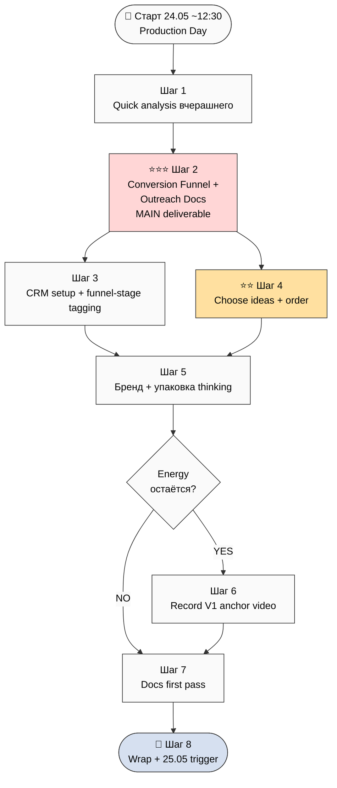

# 🎯 План дня — 2026-05-24 Sunday — **Production Day**

> **Day type:** Production (execute Week 1 plan Steps 2-4)
>
> **Главная цель дня:** Зафиксировать **центральный документ** «Conversion Funnel + Документы для Outreach» — что и в каком порядке нужно делать для outreach Дмитрия + потенциальных партнёров/работников. Plus первое начать делать (CRM setup + бренд thinking).

---

## §0 Главная цель (one-liner)

> **Создать canonical документ: stranger → cohort member conversion funnel + per-stage required docs + ordered narrative + что Jetix хочет от этого человека → начать execute (CRM + branding seeds).**

Production focus — не orientation. Today = build artefacts.

---

## §1 Контекст входа — что НОВОГО сделано за вчера (23.05 evening + 24.05 overnight)

### 🏆 Massive overnight progress

**Strategic substrate:**
- ✅ `POINT-A-CURRENT-STATE-2026-05-23.md` (30K / 12 mermaid / 220+ sources / 8 buckets)
- ✅ `POINT-B-NEAR-TARGET-2026-05-23.md` (12K / 8 mermaid / 3 horizons / 3 perspectives)
- ✅ `POINT-B-FOCUSED-WEEK-1-2026-05-23.md` (8 шагов sequence; 1m+2m horizons deferred)
- ✅ **3 NEW Tier A wikis:** O-160 development-promotion-transition / O-158 notion-mvp-bypass / O-161+O-162 cohort-target-profile-ontology
- ✅ 3 §APPEND existing wikis (method-method / jetix-as-exokortex / external-system-cybernetic)
- ✅ 11 D12-* acks processed (batch-12 + Point B compact promotions)

**Research corpus:**
- ✅ 56 NEW books vendored (508MB / 4 buckets + 3 _unknown)
- ✅ 80 PDFs → MD conversion done (77/80 = 96% repo)
- ✅ **Mistral OCR 11/11 scan books** (4811 pages full coverage / 11.6M chars / **$4.81 / 152 sec**)
- ✅ Phase 6 bucket cross-mapping (80 books → 4 research buckets с relevance scores)

**ROY Swarm expansion:**
- ✅ Book-driven agent sorting Phase 1-7 done (8 candidates ranked)
- ✅ Ruslan ack MAX-8 → exec-agents Stage 2-6 FINISHED
- ✅ **ROY swarm 9 → 17 agents** (8 NEW: propaganda / recruitment-dynamics / nlp / sota-tracker / methodology-engineer / ml-ai-foundations / **influence-ethics (R12 enforcement cell)** / gamification-engagement)
- ✅ routing-table.yaml = 29 role entries + 4 R12 auto-pair rules (dispatch-time enforced)
- ✅ 31 NEW Tier A wikis + 15 Tier B-Plus wikis created
- ✅ CLAUDE.md updated

**Research prompts ready (могут крутиться в background сейчас):**
- 📋 `research-methodology-2026-05-24.md` (9 phases / 6-10h)
- 📋 `research-sota-2026-05-24.md` (8 phases / 5-8h)
- 📋 `research-propaganda-recruitment-2026-05-24.md` (9 phases / 6-10h / R12 STRICT)
- 📋 `research-nlp-2026-05-24.md` (9 phases / 6-10h / R12 STRICT + Phase 6 critical review)
- 📋 `levenchuk-master-qualification-research-2026-05-23.md` (11 phases / 10-15h)

---

## §2 Шаги дня (8 шагов, production focus)

### Шаг 1 — Quick analysis: что нового на ходу crunching ⭐ (P1)

**Что:** прочитать AW + Toggl substrate; check W1/W2/W3 research progress (если launched); прочитать executed-agents output.

**Output:** mental model текущего state.

**Time:** 15-30 min

---

### Шаг 2 ⭐⭐⭐ — Центральный документ: **Conversion Funnel + Outreach Docs** (MAIN deliverable дня)

**Что:** создать canonical документ который описывает:

#### §A Конечная цель Jetix
- Что мы хотим от каждого человека который контактирует:
  - **Научила** информация (методологическая трансформация)
  - **Купить** что-то (Workshop / cohort membership / partnership tier)
  - **Сделать** что-то (test метод / привести cohort / spread system)
- Per-archetype outcome (different для cohort member vs partner vs advisor vs investor)

#### §B Conversion funnel — stranger → cohort member
- **Stage 0:** Stranger (никогда не слышал)
- **Stage 1:** Awareness (видел контент / прочитал нашу страницу)
- **Stage 2:** Interest (запросил materials / посмотрел video)
- **Stage 3:** Engagement (read substrate / contact request)
- **Stage 4:** Discovery call (звонок 30-60 min)
- **Stage 5:** Trial (template / Notion tool — Дмитрий-style testing)
- **Stage 6:** Partner / Cohort member (Charter signed)
- **Stage 7:** Advocate (active spreader)

#### §C Per-stage: что человек должен делать / уметь / принести / зачем
Per stage — explicit:
- **Делать** action (what they DO)
- **Уметь** capability (what they CAN)
- **Принести** contribution (what they BRING — audience / money / skill / time)
- **Зачем им это** (their personal value gained)

#### §D Какие документы / форматы нужны
- Per stage — required artefacts:
  - Stage 1: video + landing
  - Stage 2: navigation guide + 1-pager
  - Stage 3: Method V2 deep + Partner Offering
  - Stage 4: discovery call script + R12 paired-frame checklist
  - Stage 5: Notion templates + Claude Code access setup
  - Stage 6: Charter draft + onboarding kit
  - Stage 7: ambassador materials / co-creation channels

#### §E Что в каком порядке rasсказать
- **Sequence of ideas** для каждой stage
- Per stage anchor message + supporting points + call-to-action
- Cross-reference к выбранным core ideas (когда сделаешь Step 4)

**Output:** `decisions/strategic/CONVERSION-FUNNEL-OUTREACH-DOCS-2026-05-24.md` ⭐⭐⭐

**Time:** 2-3h (Ruslan-led R1 work; Cloud Cowork drafts substrate; ты polishing prose)

---

### Шаг 3 — CRM setup (поток людей виден) ⭐ (P1)

**Что:**
- Re-read CRM 169 contacts inventory (180 actual per Phase 5 Point A)
- Tag per funnel stage (Stage 0-7)
- Pipeline view: кто где в funnel сейчас
- Surface top 10-20 для immediate proactive touch
- Update existing entries с current status

**Tools:** `/crm-list` / `/crm-search` / `/crm-update` / `/crm-stuck` / `/crm-dash`

**Output:** updated CRM с funnel-stage tagging; `crm/views/funnel-2026-05-24.md` view

**Time:** 1-2h

---

### Шаг 4 ⭐⭐ — Choose ideas + order (substrate selection для outreach)

**Что:** **из всего substrate** (4 LOCKED + 13 + 3 NEW + 31 NEW Tier A wikis + 80 book MDs + DR-38/40 + Method V2) — выбрать **5-10 core ideas** для outreach narrative + порядок.

**Per idea:**
- One-liner pitch
- Why this matters (для target archetype)
- Linked substrate refs
- Per-funnel-stage usage

**Кандидаты из существующих anchors:**
- Method V2 core thesis (всё = информация + методы)
- AGI minimal formula (O-133)
- Foundational values (O-138 «жить чтобы жить + не умереть + развиваться»)
- Welcome-frame R12-compatible (O-144)
- 8-component meta-method (O-121)
- Cybernetic external-system (O-128)
- Triple-role partner (worker + investor + promoter)
- Development → Promotion transition (O-160)
- Cohort target ontology (O-161/O-162 голодный + дисциплина + ответственность)
- Notion-MVP-bypass pattern (O-158)

**Output:** `decisions/strategic/CORE-IDEAS-SEQUENCE-OUTREACH-2026-05-24.md` (Ruslan R1 — ты picks order + anchors)

**Time:** 1-2h

---

### Шаг 5 ⭐ — Бренд + упаковка thinking

**Что:** quick brainstorm:
- **Visual identity:** color palette / logo direction / typography
- **Naming consistency:** Jetix / Jetix OS / Jetix Workshop / etc.
- **Voice + tone:** R12-compatible / Welcome-frame / cohort-target-aligned
- **Asset list:** website / landing / video format / one-pager / slide deck (revisit Q7)

**Output:** `decisions/strategic/BRAND-PACKAGING-DRAFT-2026-05-24.md` (notes only — final design = later production)

**Time:** 30-60 min

---

### Шаг 6 — Record video first cuts (если energy)

**Что:** запись V1 anchor video (12-15 min) per Шаг 4 ideas + order locked.

- Recording setup verification
- Multiple take iterations
- Raw video → review

**Output:** `raw/video/2026-05-24/V1-anchor-draft.mp4` (или подобный)

**Time:** 2-3h (если energy остаётся)

**Note:** can defer to 25.05 если устал.

---

### Шаг 7 — Документы первый pass

**Что:** quick first-pass drafts для:
- Landing page text (один файл `decisions/strategic/LANDING-PAGE-DRAFT-2026-05-24.md`)
- One-pager (revisit existing PARTNER-OFFERING)
- Notion template skeleton для Дмитрия

**Output:** drafts (не production-ready)

**Time:** 1-2h

---

### Шаг 8 (финал) — Wrap + tomorrow trigger ⭐

**Что:** end-of-day:
- Что сделано
- Что carried
- Что surfaced
- Tomorrow plan trigger (25.05)
- `/close-day` if applicable

**Output:** wrap §7 inline в этом doc + 25.05 plan-of-day trigger

**Time:** 15-30 min

---

## §3 Total time estimate

| Шаг | Time | Cumulative |
|---|---|---|
| 1 Quick analysis | 30m | 0:30 |
| 2 ⭐⭐⭐ Conversion Funnel + Outreach Docs | 2-3h | 3:30 |
| 3 CRM setup | 1-2h | 5:00 |
| 4 ⭐⭐ Choose ideas + order | 1-2h | 6:30 |
| 5 Бренд + упаковка | 30-60m | 7:00 |
| 6 Record video | 2-3h | 9:30 (optional) |
| 7 Documents first pass | 1-2h | 11:00 |
| 8 Wrap | 30m | 11:30 |

**Total: ~8-11h active.** Realistically ~10h с breaks → если start ~12:30 → wrap ~22:30. Шаги 6+7 могут carry на завтра.

---

## §4 Priority gates

**MUST do today (P1):**
- ⭐⭐⭐ Шаг 2 Conversion Funnel + Outreach Docs (central deliverable)
- ⭐⭐ Шаг 4 Choose ideas + order (foundation для video)

**SHOULD do today (P2):**
- ⭐ Шаг 1 analysis (quick)
- ⭐ Шаг 3 CRM setup

**NICE if energy (P3):**
- Шаг 5 Brand thinking
- Шаг 6 Video recording
- Шаг 7 Docs first pass

---

## §5 Mermaid flow

---

## §6 Active Hypotheses (Layer 4)

### Top in-focus сегодня

- **H-batch-10-06** [meta-method]: «sufficient method-arsenal + meta-level thinking → solve any task» — testing через Шаг 2 funnel design (если 10 ideas достаточно)
- **H-batch-11-04** [intellect-dialectic]: «intellect mediates internal-external feedback» — applicable funnel design (external = audience)
- **H-batch-12-substrate-saturation** (O-163): «информации/методов уже достаточно» — testing через Шаг 4 ideas selection (выбрать из existing, не нужно add)

### Closed yesterday (23.05)

- 11 D12-* acks (batch-12 substrate fixation)
- 8 new ROY agents creation (book-driven expansion)
- Mistral OCR coverage gap closed

### Attention budget

- Active + Testing: ~14 / 20 (healthy)

---

## §7 Risks / blockers

| # | Risk | Mitigation |
|---|---|---|
| R1 | Energy depletion (вчера 7h Deep Work + 7h40m сон only) | Pace; break per Шаг; defer Шаг 6+7 если усталость |
| R2 | Шаг 2 overcomplication — funnel design = большой scope | Time-box 3h max; iterate not perfect |
| R3 | W1/W2/W3 research crunch overlap distracts | Не reading research mid-day; review только wrap |
| R4 | CRM tagging tedious без clear funnel definition | Шаг 2 first (creates funnel), потом Шаг 3 tag |
| R5 | Video recording technical setup issues | Шаг 6 defer без guilt if setup time-sink |

---

## §8 Wrap (end-of-day inline)

- ✅ Completed: [TBD]
- ⏸️ Carried: [TBD]
- 🌱 Surfaced: [TBD]
- 🧪 Hypothesis ops executed: [TBD]
- 📝 Compound learning extracted: [TBD]

---

## §9 Cross-refs

- Predecessor plan: `daily-logs/_PLAN-OF-DAY-2026-05-23.md` (Orientation)
- Week 1 plan: `decisions/strategic/POINT-B-FOCUSED-WEEK-1-2026-05-23.md` (Шаги 2-3 этого дня = Steps 2-4 Week 1)
- Substrate canonical: Method V2 / Strategic Plan / Economic V10 / Partner Offering / Navigation Guide / 3 NEW Tier A wikis + 31 NEW + 15 Tier B-Plus
- CRM: `crm/index.md` + `/crm-*` skills
- O-160 development→promotion mode (Tier A) — operational frame для сегодня
- O-158 Notion-MVP-bypass (Tier A) — Шаг 7 docs reference
- O-161/162 cohort-target ontology — Шаг 2 funnel filter criteria

---

## §10 Tomorrow trigger (25.05 Monday)

Зависит от Шага 8 wrap state. Default scenarios:

- **If Шаги 1-5 done + good progress:** 25.05 = Шаг 6 (video record) + Шаг 7 (docs first pass)
- **If Шаги 6-7 also done today:** 25.05 = Wave 1 outreach SEND (Левенчук + Цэрэн + 3 МИМ-inner)
- **If Шаги 1-2 only done:** 25.05 = continue Шаги 3-5

Plan-of-day 25.05 trigger в Шаге 8 wrap.

---

## §11 Constitutional posture

- **R1 surface only:** этот plan = sequence + substrate compile; Ruslan = R1 prose authoring на final outreach materials
- **R6 provenance:** Cross-cite Yesterday substrate
- **R11 Default-Deny:** все execute через manual Ruslan action (CRM updates / video record / etc.)
- **R12 paired-frame:** Шаг 2 funnel design + Шаг 4 ideas selection MUST pass R12 8-item check; influence-ethics-expert auto-fires при dispatch
- **Append-only:** new file `_PLAN-OF-DAY-2026-05-24.md`

---

*Plan-of-day 24.05 Production Day. Per Ruslan voice ack lunch dictation. Per O-160 development→promotion mode operational frame. Per Week 1 FOCUSED plan Steps 2-5 execution.*
