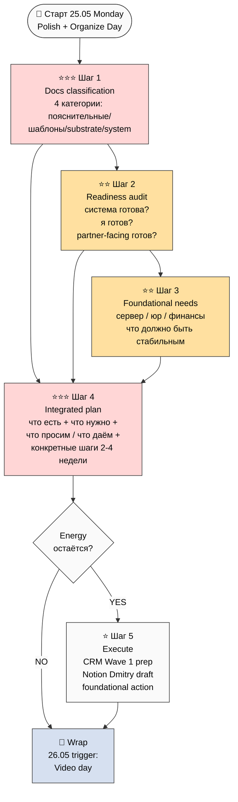

# 🗂️ План дня — 2026-05-25 Monday — **Document Polish + Pre-Outreach Readiness Day**

> **Day type:** Polish + Organize (substrate ready; теперь classify + readiness audit + foundational gaps surface)
>
> **Главная цель дня:** Разгрузить все карты — что есть / что нет / какой документ зачем / насколько готова система и я принимать партнёров → новый чёткий план развития → конкретные шаги. Чтобы не было каши в голове и можно было быстро к партнёрам идти.

---

## §0 Главная цель (one-liner)

> **Допилить и доупаковать все документы / схемы / шаблоны → выйти из дня с ясной картиной "что есть, что нужно, что просим у партнёров, что даём" → готовность к завтрашнему видео packaging и послезавтрашнему outreach.**

Mode: **Polish day** — substrate накоплен massive; теперь organize + classify + decision gates.

---

## §1 Контекст входа — что закрылось 24.05 evening + overnight 25.05 ⭐

### 🏆 Massive overnight wave — 4 major plans закрыты

| # | Plan | Status | Файл |
|---|---|---|---|
| 1 | **Consolidated Human-Language Plan** (план обучения plain Russian) | ✅ closed | `decisions/strategic/CONSOLIDATED-HUMAN-LANGUAGE-PLAN-2026-05-24.md` (~2716w / 11 sections / 5 mermaid) |
| 2 | **Execution Plan Fixation** (что делаю сам + 2 направления + 4 типа партнёров + sequencing) | ✅ closed | `decisions/strategic/EXECUTION-PLAN-FIXATION-2026-05-24.md` (~4188w / 11 sections / 6 mermaid) |
| 3 | **Personal OS Notion Template Plan** (Layer 1+2 design) | ✅ closed | `decisions/strategic/PERSONAL-OS-NOTION-TEMPLATE-PLAN-2026-05-24.md` (~4166w / 15 sections / 7 mermaid / 22K words total) |
| 4 | **Team OS Notion Template Plan** (Layer 3 collaboration — multi-tenant + roles + marketplace + monetization + daily CC pass) | ✅ closed | `decisions/strategic/TEAM-OS-NOTION-TEMPLATE-PLAN-2026-05-24.md` (~5.5K main / 14 sections / 7 mermaid) |

Plus: **Joel Barker Paradigms 1992** stub added (10 концептов + 10 Jetix cross-cites — paradigm pioneers profile + Going Back to Zero + Future-Vision Question).

### Substrate state на утро 25.05

- **Foundation v1.0 LOCKED** untouched (11 Parts + Pillar A/C + 8 RUSLAN-ACK)
- **4 LOCKED canonical** (Method V2 / Strategic Plan / Economic V10 / AI Market PLAN)
- **6+ NEW plain-language synthesis docs** Sprint 23-25.05 (CONSOLIDATED-HL / EXECUTION-PLAN / PERSONAL-OS / TEAM-OS / OUTREACH-CONTENT / RESEARCH-EDUCATION)
- **5 research deeps** (methodology / sota / propaganda / nlp / lev-master)
- **17 ROY agents** (9 original + 8 book-driven)
- **62+ wiki concepts** (Tier A/B-Plus)
- **80+ books MD'd** (research-corpus + inbox + lev-master)
- **PARTNER-OFFERING-HUMAN-LANG** + **JETIX-NAVIGATION-GUIDE** ready as partner-facing surface

### Что не закрыто

- ❌ **edu-agent execution prompt** (Option A acked, executor НЕ создан)
- ❌ **ABC execution prompts** (Plan B docs / Plan A video / Plan C Notion templates fronted)
- ❌ **Видео A/B/C** не записаны
- ❌ **Wave 1 outreach** не отправлен
- ❌ **Notion templates** на дизайн-уровне (Personal OS + Team OS) — implementation pending
- ❌ **CRM Wave 1 first 10 targets** не tagged по 5+1 archetypes

---

## §2 Шаги дня (5 шагов, polish + organize focus)

### Шаг 1 ⭐⭐⭐ — Document inventory + classification (каши быть не должно)

**Что:** Заново пройти все ~100+ strategic docs + 80+ книг + wikis + plans → **classify по 4 категориям**:

#### §A 4 категории документов

| Категория | Что это | Кому показываем |
|---|---|---|
| 🟢 **Пояснительные** (explanation layer) | Plain-language человеческий перевод, кому что объясняет | Партнёрам / cohort members / publicly shareable |
| 🛠️ **Шаблоны работы** (operational templates) | Готовые structures чтобы человек начал работать | Internal + cohort onboarding |
| 📚 **Substrate (depth)** | Глубокий research / Foundation / методология | Internal только; refs для curious deep-divers |
| ⚙️ **System infrastructure** | Foundation / Pillars / scripts / configs | Internal только; не показываем |

**Pre-classification draft (Cloud Cowork starting point):**

- 🟢 **Пояснительные:**
  - PARTNER-OFFERING-HUMAN-LANG-2026-05-22 ⭐ primary
  - CONSOLIDATED-HUMAN-LANGUAGE-PLAN-2026-05-24 ⭐ primary
  - EXECUTION-PLAN-FIXATION-2026-05-24 (что мы делаем + кто партнёры)
  - JETIX-NAVIGATION-GUIDE-2026-05-22-DRAFT (sanitized public)
  - 00-SUMMARY-FOR-RUSLAN per major plan (~500w each — quick reads)
- 🛠️ **Шаблоны работы:**
  - PERSONAL-OS-NOTION-TEMPLATE-PLAN-2026-05-24 (Layer 1+2 design — fork-friendly)
  - TEAM-OS-NOTION-TEMPLATE-PLAN-2026-05-24 (Layer 3 collaboration)
  - OUTREACH-CONTENT-OUTCOMES-CTAS-2026-05-24 (13 CTAs + 18 P0-P6 artifacts)
  - CRM templates (24 roles / 13 statuses / voice integration)
  - Charter draft (в Team OS Phase 5)
  - Discovery call template (в Personal OS Phase 5 + Team OS Phase 7)
  - 7 analysis templates (week/month/quarter/annual/project/hypothesis/discovery — в Personal OS Phase 5)
- 📚 **Substrate (depth refs):**
  - 4 LOCKED canonical (Method V2 / Strategic Plan / Economic V10 / AI Market PLAN)
  - 5 research deep (methodology / sota / propaganda / nlp / lev-master)
  - RESEARCH-EDUCATION-2026-05-24 (Phase 7 12 proposals)
  - POINT-A / POINT-B / POINT-B-FOCUSED-WEEK-1
  - RUSLAN-NOTES-EDUCATION-PARADIGM (O-176..O-185)
  - 80+ книг MD (research-corpus + inbox + lev-master + education-corpus)
  - 62 wiki concepts Tier A/B-Plus
- ⚙️ **System infrastructure:**
  - 11 Foundation Parts + Pillar C
  - 17 ROY agents
  - shared/schemas/
  - swarm/lib/routing-table.yaml
  - tools/ scripts
  - CLAUDE.md

**Output:** `decisions/strategic/DOCS-CLASSIFICATION-2026-05-25.md` (~3-5K plain prose — explicit categorization + per-doc one-liner + кому-что-показывать matrix)

**Time:** 2-3h (Cloud Cowork draft + Ruslan picks final categorization)

---

### Шаг 2 ⭐⭐⭐ — Readiness audit (готов ли я + система принять партнёров и клиентов?)

**Что:** Честный audit по чек-листам:

#### §A System-side readiness (что работает / что нет)

- ☐ Foundation 11 Parts работают? (тестируем дисциплину frontmatter / append-only / R6 provenance per claim — нет ли drift'a)
- ☐ ROY swarm 17 agents — все activated в routing-table? (cross-check vs CLAUDE.md)
- ☐ Notion existing pages (Command Center / Daily Log DB / Projects / CRM / Research / Life OS) — отражают current state OR drift?
- ☐ CRM 180 contacts — funnel-stage tagging есть? (Plan-of-Day 24.05 Шаг 3 not done)
- ☐ Voice pipeline (Wispr → run_pipeline.sh) — работает stable?
- ☐ Mistral OCR pipeline (cost cap €10/day) — stable?
- ☐ Toggl integration — работает?
- ☐ Git discipline (commits / hooks / no API keys) — clean?

#### §B My-side readiness (что я могу / что не могу)

- ☐ Время — сколько часов в день Deep Work возможно? (per cohort target О-161/162 personal alignment)
- ☐ Energy — текущий уровень? Burnout signs? (Plan-of-Day 24.05 §7 R1 flagged 7h Deep Work + 7h40 сон only)
- ☐ Skills — какие capability gaps мешают partner outreach? (video production? design? legal?)
- ☐ Финансы — runway сколько? €100K trajectory на трэке?
- ☐ Здоровье — sustainable cadence?
- ☐ Relationships — partner / family / close-friends supportive?

#### §C Partner-facing readiness (готовность receive)

- ☐ Можно ли сейчас, если Maxim напишет «давай делать курс», начать через 24h?
- ☐ Если Дмитрий захочет тестировать Notion template — есть actual ready template? (NET: дизайн готов, implementation pending)
- ☐ Discovery call script готов? (есть в шаблоне, не practiced)
- ☐ Charter draft готов? (есть в Team OS Phase 5 design, актуальный текст pending)
- ☐ Если 5 партнёров одновременно скажут yes — bandwidth permit?

**Output:** `decisions/strategic/READINESS-AUDIT-2026-05-25.md` (~2-3K plain prose — honest GO/STOP list)

**Time:** 1-2h

---

### Шаг 3 ⭐⭐ — Foundational infrastructure needs (что нужно стабильно до партнёров)

**Что:** Surface что **должно быть стабильным** до того как партнёры включаются. База без которой не могу развиваться.

#### Areas to cover (Ruslan-dictation):

- **Сервер / инфраструктура:**
  - Текущий сервер CC — на жалованье OR нужен upgrade?
  - Notion plan — Free OR Team plan (для multi-tenant Team OS)?
  - Wispr Flow / voice — стабильно?
  - Backup стратегия (filesystem mirror — где hosted)?
  - Domain / hosting для landing page
- **Юридическое оформление:**
  - Берлин — нужно ли регистрировать Einzelunternehmen / GmbH / UG?
  - Налоговое consulting (Steuerberater)
  - Контракт template для partner agreements
  - Charter legal basis (cooperative governance — Mondragón structure в DE)?
  - IP rights (open-source vs proprietary mix)
- **Финансовое:**
  - Бизнес-счёт separate?
  - Bookkeeping system (FastBill / lexoffice / etc.)
  - Invoice template
  - Revenue tracking baseline
  - Bank / payment integration
- **Tech operational:**
  - GitHub repo (private vs public mix)
  - Backup / disaster recovery
  - API key management (Mistral / Notion / etc.)
  - Cost monitoring (€10/day cap discipline)

**Output:** `decisions/strategic/FOUNDATIONAL-INFRASTRUCTURE-NEEDS-2026-05-25.md` (~2-3K)

**Time:** 1-2h (Ruslan-led R1; Cloud Cowork structures + cross-cites)

---

### Шаг 4 ⭐⭐⭐ — Новый план развития (от Step 1-3 → integrated roadmap)

**Что:** Берём Step 1 (categorization) + Step 2 (readiness audit) + Step 3 (foundational gaps) → **новый чёткий план развития 2-4 недели**.

#### Sections:

1. **Что у нас есть** (Step 1 categorization — сводка)
2. **Где готовы / где НЕ готовы** (Step 2 audit gaps)
3. **Что должно быть стабильным** (Step 3 foundational)
4. **Что просим у партнёров** (per 4 типа partner types — execution-plan Phase 4):
   - T1 Methodology: methodology feedback / course co-design
   - T2 Resources: audience / capital / tech infra
   - T3 Audience: testing / feedback / first cohort
   - T4 Consultants: delivery scale (deferred)
5. **Что можем дать партнёрам:**
   - Substrate access (Method V2 / wikis)
   - Personal OS + Team OS templates (после implementation)
   - Recognition / Charter
   - Revenue share (per 4 monetization templates)
   - Cohort / community access
6. **Конкретные шаги недели:**
   - **Сегодня (25.05) Polish day** — этот документ
   - **Завтра (26.05) Video day** — Видео A/B/C recording
   - **27-28.05** — Notion templates implementation (Personal OS Week 1 core 5 DBs)
   - **29-31.05** — Wave 1 outreach prep + first sends (Maxim / Oleg / Левенчук)
   - **1-7.06** — Dmitry trial + feedback + iterate

**Output:** `decisions/strategic/INTEGRATED-DEVELOPMENT-PLAN-2026-05-25.md` (~4-6K)

**Time:** 2-3h (Cloud Cowork synthesizes + Ruslan picks final framing)

---

### Шаг 5 ⭐ — Execute по шагам (если energy остаётся)

**Что:** Начать execute из Шаг 4 plan'a:
- CRM Wave 1 first 10 targets identification + funnel-stage tagging
- Notion template Dmitry trial first draft (~2-4h за Personal OS Phase 5 spec)
- Landing page text revisit (PARTNER-OFFERING + EXECUTION-PLAN compile)
- Foundational gaps action: 1-2 items quick action (Notion Team plan upgrade decision / Steuerberater contact / etc.)

**Time:** 2-4h (carry если energy остаётся; иначе на 26.05 после видео)

---

## §3 Total time estimate

| Шаг | Time | Cumulative |
|---|---|---|
| 1 Docs classification | 2-3h | 3:00 |
| 2 Readiness audit | 1-2h | 5:00 |
| 3 Foundational needs | 1-2h | 7:00 |
| 4 Integrated plan | 2-3h | 10:00 |
| 5 Execute (если energy) | 2-4h | 14:00 (optional) |

**Total: 7-10h active + 2-4h optional execution = realistically ~8-10h.** Если start ~11:00 → wrap ~21:00.

---

## §4 Priority gates

**MUST do today (P1):**
- ⭐⭐⭐ Шаг 1 Docs classification (каши быть не должно)
- ⭐⭐⭐ Шаг 4 Integrated plan (без неё нет ясности следующих недель)

**SHOULD do today (P2):**
- ⭐⭐ Шаг 2 Readiness audit (honest gaps surface)
- ⭐⭐ Шаг 3 Foundational needs (что просим у партнёров определяется этим)

**NICE if energy (P3):**
- ⭐ Шаг 5 Execute (Wave 1 prep / Notion template Dmitry / etc.)

---

## §5 Mermaid flow

---

## §6 Active Hypotheses (Layer 4)

### Top in-focus сегодня

- **H-25.05-organize-eliminates-fog**: «document classification + readiness audit устранят кашу в голове → быстрее partner conversations» — testing через Шаг 1+2
- **H-25.05-foundational-first**: «foundational infrastructure (сервер / юр) должна быть стабильна ДО Wave 1 outreach, иначе breakage риски» — testing через Шаг 3
- **H-25.05-substrate-saturation** (О-163 carried): «информации/методов уже достаточно» — testing через Шаг 1 (если на classification не появляется новых gap нужд → confirmed)

### Closed previous days (23-24.05)

- All 4 major plans closed (Consolidated-HL / Execution-Plan / Personal OS / Team OS)
- Barker Paradigms zafiksirovana (paradigm pioneers profile = cohort target О-161/162 confirmation)

### Attention budget

- Active + Testing: ~12 / 20 (healthy — после massive Sprint 23-24)

---

## §7 Risks / blockers

| # | Risk | Mitigation |
|---|---|---|
| R1 | Polish day = слишком много document writing → exhaustion before video day 26.05 | Time-box per Шаг; Шаг 5 optional carry |
| R2 | Categorization → analysis paralysis (over-thinking) | Шаг 1 = quick rough first pass; iterate week later if needed |
| R3 | Readiness audit → откладывание actions «надо ещё чуть-чуть подготовиться» | Шаг 4 plan = explicit dates / triggers; no «когда-нибудь» allowed |
| R4 | Foundational gaps surface revealing major missing infra → derails Wave 1 sequence | Priority filter: только blocking gaps; deferable парк to backlog |
| R5 | Каша в голове усиливается because we add MORE docs (classification + audit + foundational + plan) | Output rule: max 4 new docs today; each ≤6K words; concise mandate |

---

## §8 Wrap (end-of-day inline — fill вечером)

- ✅ Completed: [TBD]
- ⏸️ Carried: [TBD]
- 🌱 Surfaced: [TBD]
- 🧪 Hypothesis ops executed: [TBD]
- 📝 Compound learning: [TBD]

---

## §9 Cross-refs

- Predecessor: `daily-logs/_PLAN-OF-DAY-2026-05-24.md` (Production Day)
- Closed substrate this sprint:
  - `decisions/strategic/CONSOLIDATED-HUMAN-LANGUAGE-PLAN-2026-05-24.md` (план обучения plain)
  - `decisions/strategic/EXECUTION-PLAN-FIXATION-2026-05-24.md` (sequencing + 4 partner types)
  - `decisions/strategic/PERSONAL-OS-NOTION-TEMPLATE-PLAN-2026-05-24.md` (Layer 1+2)
  - `decisions/strategic/TEAM-OS-NOTION-TEMPLATE-PLAN-2026-05-24.md` (Layer 3)
  - `decisions/strategic/OUTREACH-CONTENT-OUTCOMES-CTAS-2026-05-24.md` (38K substrate)
  - `decisions/strategic/RESEARCH-EDUCATION-2026-05-24.md` (Phase 7-8)
- Substrate baseline:
  - 4 LOCKED canonical (Method V2 / Strategic Plan / Economic V10 / AI Market PLAN)
  - `PARTNER-OFFERING-HUMAN-LANG-2026-05-22.md` (style anchor)
  - `decisions/strategic/POINT-B-FOCUSED-WEEK-1-2026-05-23.md` (Week 1 trajectory)
- Newly fixed:
  - `wiki/sources/2026-05-24-barker-paradigms-1992.md` (paradigm pioneers profile)
- CRM: `crm/index.md` + 180 contacts + 24 roles + 13 statuses

---

## §10 Tomorrow trigger (26.05 Tuesday — Video Day)

Зависит от §8 wrap state. Default scenarios:

- **If Шаги 1-4 done + Шаг 5 partial:** 26.05 = Видео A + B recording (per execution-plan Phase 2 Ruslan-solo)
- **If Шаги 1-4 only:** 26.05 = Шаг 5 carry first + Видео A start
- **If Шаги 1-2 only:** 26.05 = continue Шаги 3-4 + push video to 27.05

**Default 26.05 plan:** Видео A (методология / прошивка база) + Видео B (видение обучения + 7 ступеней) recording — 4-6h Deep Work focused.

---

## §11 Constitutional posture

- **R1 surface only:** этот plan = sequence + structure; Ruslan = R1 prose author для actual категоризации / readiness verdicts / foundational gap decisions / integrated plan content
- **R6 provenance:** cross-cite all 4 closed plans + Sprint 23-24 substrate
- **R11 Default-Deny:** все execute через manual Ruslan action (NO auto-creation of Notion pages / NO outreach send / NO video recording)
- **R12 paired-frame:** Шаг 2 readiness audit + Шаг 4 integrated plan include R12 check (что просим у партнёров MUST pass 8-item check)
- **Append-only:** new file `_PLAN-OF-DAY-2026-05-25.md`

---

*Plan-of-day 25.05 Document Polish + Pre-Outreach Readiness Day. Per Ruslan voice ack 2026-05-25 morning «допилить документы / разгрузить карты / собрать в кучу / новый план / конкретные шаги». Substrate saturation confirmed; mode = organize > add.*
