# 🗂️ План дня — 2026-05-26 Tuesday — **Architecture Foundation Day + Notion Live**

> **Day type:** Architecture fixation + implementation live (massive Notion workspace built реально)
>
> **Главный факт дня:** За 25→26.05 закрыто **11 major deliverables** (~120-150K plain Russian + 80+ phase reports + 50+ mermaid + LIVE Notion workspace). Architecture foundation полностью зафиксирована. Сейчас фокус — **review + R1 decisions** + начинать filling per direction.

---

## §0 90-секундный TL;DR

- **11 deliverables CLOSED.** Architecture foundation готова: master skeleton (94 docs / 14 directions / 4 layers Notion / Workshop+Mastery+Network концепция / Preparation Stage / metaplan v2 MAX-DEPTH).
- **Notion workspace LIVE** (35 pages / 36 DBs / 44 relations / 20 AI tools / Master Dashboard / Onboarding) — стерильный, scope-bounded, готов для review в Notion UI.
- **~80+ R1 decisions** ждут тебя через несколько документов (priority 5-7 critical).
- **Pending action:** revoke Notion token (security advisory из notion-build) → создать new tokens когда будешь работать дальше.
- **Сегодня дальше:** review key deliverables → ack приоритеты → начинать filling per direction OR Дмитрий Кайзер call follow-up.
- **Завтра 27.05:** Video Day (per Platform Lifecycle Week 1) — Видео A блокер всего Wave 1.

---

## §1 Что ЗАКРЫТО сегодня (11 major deliverables)

### 🏗️ Architecture / Public docs

| # | Deliverable | Что внутри | Status |
|---|---|---|---|
| 1 | **DOCS-CLASSIFICATION-2026-05-25** | 4 категории mapping + 19 GAPs + audience matrix + Build readiness 70% | ✅ Closed (Cloud Cowork) |
| 2 | **JETIX-FULL-MAP-AND-DOCS-SKELETON-2026-05-25** | 12 entities + 6 directions + status + 94 docs skeleton + reference corps + master synthesis (10 mermaid) | ✅ Closed (server, 14 phases) |
| 3 | **JETIX-PUBLIC-DOCS-METAPLAN-2026-05-25** (v1) | 3 variants (A/B/C/D Hybrid) structure + comparison + recommendation B-на-A lite-гибрид | ✅ Closed (server, 8 phases) |
| 4 | **JETIX-PUBLIC-DOCS-METAPLAN-V2-2026-05-25** | MAX-DEPTH variant D Hybrid + 11 directions + Rules (10 angles) + Values + Vision standalone + Chinese corps + per-direction skeletons | ✅ Closed (server, 12 phases) |
| 5 | **JETIX-WORKSHOP-MASTERY-NETWORK-CONCEPT-2026-05-26** | 3 NEW directions (Workshop + Mastery + Network) + Vision expansion + 5 vivid worked examples + 8 mermaid + 300% density pass | ✅ Closed (server, 11 phases + density pass) |
| 6 | **WORKSHOP-CONCEPT-SUPPLEMENT-2026-05-26** | Voice 26.05 augmentation (Founder-as-Exhibit + anti-marketing + Mastery deepening templates×unique + темы vs levels) + 16 new ideas | ✅ Closed (server, 8 phases) |
| 7 | **PREPARATION-STAGE-CONCEPT-SUPPLEMENT-2026-05-26** | Preparation Stage explicit + Extended 8-step meta-method + 7 augmentation patches + 5 worked examples + AI stratification | ✅ Closed (server, 8 phases) |
| 8 | **NOTION-TEMPLATES-3-LAYERS-ARCHITECTURE-V2-2026-05-25** | Layer 1 Personal + Layer 2 Team (Generic + Jetix overlay + Brand pattern) + Layer 3 Universal Business Foundation + Plus Ruslan-voice additions (Habits / Strategic / Философский лист) | ✅ Closed (server, 12 phases + 3 voice updates) |

### 🛠️ Implementation / Build

| # | Deliverable | Что | Status |
|---|---|---|---|
| 9 | **NOTION-BUILD-REPORT-2026-05-25** + Notion workspace LIVE | 35 pages + 36 DBs + 44 relations + 20 AI tools mega + Master Dashboard + Onboarding & Help; idempotency verified (re-run 0 dupes); sterile shell preserved | ✅ Closed (server, 14 phases) |
| 10 | **BUILD-ARTEFACTS-SPECS** Phases 0-12 | 10-12 артефактов deep spec (15-point template each) — Видео A/B/C / Notion / Charter / Лендинг / Discovery / Юр / Supporting | ⚠️ 13 phase reports done; Phase 13 Main consolidate pending |
| 11 | **CALL-PLAN-DMITRIY-KAISER-2026-05-25** | 1h call plan + 6 substance тезисов + 5+ вопросов + R12 sweep + pre/post checklists | ✅ Closed (server) |

---

## §2 Что ждёт тебя (R1 decisions queue — ~80+ total)

### Priority P1 — needs decision soon (next 1-2 days)

| Источник | Decisions waiting | Урgency |
|---|---|---|
| **JETIX-FULL-MAP §12 main** | 15 R1 (master skeleton ОК? / consolidate Governance⊂Корпорация? / 12 категорий ОК? / Charter+видео C первыми? / Build sequencing A/B/C? / first prompt после фиксации?) | ⭐⭐⭐ |
| **METAPLAN-V2 §13** | 10-15 R1 (final 14 directions ОК? / sequence creation? / format per direction? / public release first what?) | ⭐⭐⭐ |
| **WORKSHOP-CONCEPT §11** | 10-15 R1 (workshop metaphor ОК как primary frame? / 3 new directions integrate? / online→offline timeline?) | ⭐⭐ |
| **NOTION-BUILD review** | Open Notion → walk через workspace → ack «красиво / удобно» OR change requests | ⭐⭐⭐ |

### Priority P2 — needs decision this week

| Источник | Decisions waiting |
|---|---|
| **NOTION-ARCH-V2 §11** | 15-20 R1 (DBs keep/drop/merge per layer? / Notion plan upgrade timing? / Layer 4 implementation order?) |
| **WORKSHOP-SUPPLEMENT** | 5-7 R1 (Founder-as-Exhibit pattern apply how? / anti-marketing stance integration?) |
| **PREP-STAGE SUPPLEMENT** | 5-7 R1 (extended 8-step method apply where? / 7 augmentation patches которые apply?) |
| **DOCS-CLASSIFICATION §11** | 7 R1 (priorities GAP P1/P2/P3? / JETIX-NAV polish?) |

### Priority P3 — backlog (review когда есть energy)

| Источник | Decisions waiting |
|---|---|
| **BUILD-ARTEFACTS-SPECS** | 10-15 R1 per артефакт (видео A длительность? / Notion 5 баз scope? / Charter format подписи?) |
| **CALL-PLAN-DMITRIY-KAISER** | Post-call CRM entry + follow-up decision (если call happened) |
| **PLATFORM-LIFECYCLE §10** | 10 R1 (final 7-10 Wave 1 / видео C смарт-контракты? / юр путь? / темп Build?) |

---

## §3 Что нужно сделать дальше (concrete next steps)

### 🚨 Immediate (today / завтра утром)

1. **Открыть Notion workspace** `🚀 Jetix OS` — walk через everything built:
   - 🟢 Layer 1 Personal Core (11 DBs)
   - 🔵 Layer 2 Team Collaboration (Generic + Jetix overlay + Brand pattern)
   - 🟠 Layer 3 Universal Business Foundation (15 DBs)
   - 🤖 AI Tools & Lifehacks (20 tools)
   - 📊 Master Dashboard
   - 📖 Onboarding & Help
2. **Revoke Notion token** в Notion UI (Settings → Integrations → Jetix Builder → Delete) — token был в чате, security advisory triggered. Создать new когда будешь работать дальше.
3. **Read SUMMARY** trio (быстро ≤30 мин total):
   - `reports/jetix-public-docs-metaplan-v2-2026-05-25/00-SUMMARY-FOR-RUSLAN.md`
   - `reports/jetix-workshop-mastery-network-concept-2026-05-26/00-SUMMARY-FOR-RUSLAN.md`
   - `reports/notion-build-2026-05-25/00-SUMMARY.md`
4. **R1 ack** top P1 decisions (master skeleton ОК? / variant D ОК? / workshop metaphor ОК? / Notion workspace ОК?)

### 📅 Завтра (27.05 — Video Day per Platform Lifecycle Week 1)

5. **Видео A запись** — главный блокер всего Wave 1 (4 сущности зависят: Платформа / Партнёры / Образование / Дистрибуция)
   - Spec готов: `reports/build-artefacts-specs-2026-05-25/03-video-A-spec.md`
   - Target: умные методологи + R12-чек метода
   - Длительность: 5-15 мин (TBD R1)
   - Style: substance > marketing
6. **Дмитрий Кайзер post-call** (если call состоялся today) — CRM update + follow-up email decision

### 📅 Эта неделя (per Platform Lifecycle Week 1-2)

7. **Phase 13 Build-Artefacts-Specs Main consolidate** (server бросил — restart needed)
8. **Steuerberater email** quick win (~30 мин)
9. **Notion Personal OS Дмитрий-trial** — fork template + invite Дмитрий (когда video A готов)
10. **Charter v1 текст** draft → Прапион R12 ревью
11. **JETIX-NAVIGATION-GUIDE polish** (status DRAFT → ready)

---

## §4 Strategic insights дня

### 🎯 Architecture saturation reached

После 11 deliverables — substrate saturation полностью подтверждён. **Mode shift confirmed**: development → fixation → filling per direction → outreach. Не add больше architecture; теперь execute.

### 🏛️ Foundation metaphor crystallized — «Мастерская»

Workshop / Mastery / Network = body of Vision. Не abstract «платформа», а concrete мега-мастерская мирового уровня с physical/virtual progression Online→Offline. Founder-as-Exhibit pattern (anti-marketing) = primary outreach стиль.

### 🎯 Preparation Stage explicit — мастерство at transitions

Critical insight: мастерство видно и накапливается **на переходах** (prep→action / study→action / action→feedback). Method V2 §J 6-step extended до 8 steps with explicit preparation. **The Trick:** preparation → picture → unique custom method (не из repertoire — born из situation).

### 📊 Templates × Unique tasks dualism (Mastery deep)

Накапливать templates максимально (что templatable → автоматизировать) + embrace unique (каждая задача жизни уникальна). Mastery = балансировать.

### 🌐 Notion live = first major implementation milestone

35 pages / 36 DBs / 44 relations / sterile shell preserved / idempotent / R12-audited. Это первый real artefact наружу — реальный workspace который партнёры могут fork.

---

## §5 Mermaid flow дня

```mermaid
%%{init: {'theme':'base','themeVariables':{'primaryTextColor':'#000','textColor':'#000','lineColor':'#333','primaryBorderColor':'#333','primaryColor':'#fafafa'}}}%%
graph TB
    Start([🌅 25-26.05 Sprint<br/>Architecture Foundation Day])

    subgraph CLOSED[✅ 11 Deliverables CLOSED]
        D1[DOCS-CLASSIFICATION<br/>4 категории + 19 GAPs]
        D2[JETIX-FULL-MAP<br/>12 entities + 94 docs skeleton]
        D3[METAPLAN v1+v2<br/>variant D MAX-DEPTH 11 directions]
        D4[WORKSHOP+MASTERY+NETWORK<br/>3 NEW directions + Vision body]
        D5[2 SUPPLEMENTS<br/>Founder-Exhibit + Preparation Stage]
        D6[NOTION-ARCH-V2<br/>3 layers full spec]
        D7[NOTION BUILD LIVE<br/>35 pages + 36 DBs + 44 relations]
        D8[CALL-PLAN DMITRIY<br/>1h script ready]
    end

    Start --> CLOSED

    subgraph PENDING[⏳ Ruslan R1 Decisions ~80+]
        P1[P1 critical 15+<br/>master skeleton / variant D /<br/>workshop metaphor / Notion review]
        P2[P2 important 25+<br/>per layer DBs / patches /<br/>GAP priorities]
        P3[P3 backlog 40+<br/>per артефакт details / posting]
    end

    CLOSED --> PENDING

    subgraph NEXT[🚀 Next Steps]
        N1[🚨 IMMEDIATE<br/>Notion workspace walk<br/>+ revoke token<br/>+ read 3 SUMMARY]
        N2[📅 27.05 Video Day<br/>Видео A БЛОКЕР]
        N3[📅 Эта неделя<br/>Charter / Steuerberater /<br/>Дмитрий trial / JETIX-NAV polish]
        N4[📅 Конец недели<br/>Build exit ≥80% check]
    end

    PENDING --> NEXT

    NEXT --> EXIT([🎯 Build → Run<br/>per Platform Lifecycle])

    style CLOSED fill:#d6f0d6,color:#000
    style PENDING fill:#fff8d5,color:#000
    style NEXT fill:#ffe0a0,color:#000
    style EXIT fill:#cce6ff,color:#000
    style N2 fill:#ffd6d6,color:#000
```



---

## §6 Active Hypotheses

### Tested today (mostly confirmed)

- **H-substrate-saturation** (О-163) — ✅ CONFIRMED. 11 deliverables за день без новых substantial gaps выявило что глубина достаточна.
- **H-organize-eliminates-fog** (25.05) — ⚠️ PARTIAL. 11 deliverables organize'ed substrate, но 80+ R1 decisions overload — нужна **prioritization session**.
- **H-foundational-first** (25.05) — ⚠️ DEFERRED. Legal/Financial defer'ed per Ruslan voice; вернёмся когда specialists найдены.

### NEW hypotheses (today)

- **H-26.05-workshop-metaphor-resonates** — workshop/мастерская = primary frame для outreach
- **H-26.05-founder-as-exhibit-works** — observation через results + anti-marketing > traditional pitch
- **H-26.05-preparation-mastery-marker** — quality of preparation = visible mastery proxy
- **H-26.05-notion-implementation-fork-ready** — sterile workspace + idempotent design = fork-friendly для партнёров

### Attention budget

- Active + Testing: ~18 / 20 (close to cap — нужна prioritization session ASAP)
- Closed today: 11 major + 30+ minor

---

## §7 Risks / blockers

| # | Risk | Mitigation |
|---|---|---|
| R1 | **R1 decisions overload** (~80+ pending) — paralysis риск | Priority session завтра утром — pick top 10 critical, остальное defer |
| R2 | **Token security advisory** — token leaked в чате | REVOKE сегодня вечером + create new когда работать |
| R3 | **Видео A не записано** — блокер всего Wave 1 | 27.05 Video Day priority №1 |
| R4 | **Phase 13 Build-Artefacts-Specs Main missing** | Quick restart server CC OR Cloud Cowork собирает быстро |
| R5 | **Burnout signs** — 11 deliverables за день + voice batches → mental load | Завтра обязательно ≥1 recovery activity (отдых / физ актив) |
| R6 | **Notion plan limits** возможные при scale (per notion-build Phase 10 audit — 7 API-limit gaps выявлены с workarounds) | Document'ed; нужны upgrade decisions для Run stage |

---

## §8 Wrap (end-of-day inline — fill вечером)

- ✅ Completed: [11 major deliverables — см. §1]
- ⏸️ Carried: [Phase 13 Build-Artefacts-Specs Main / R1 decisions ack / Notion walk]
- 🌱 Surfaced: [16+10+9 = 35 new concepts from voice notes 26.05]
- 🧪 Hypothesis ops executed: [substrate saturation confirmed; workshop metaphor surfaced; preparation stage explicit]
- 📝 Compound learning: [organize > add mode confirmed; supplements pattern works для voice additions; sterile shell pattern works для external API writes]

---

## §9 Cross-refs

- Predecessor: `daily-logs/_PLAN-OF-DAY-2026-05-25.md` (Polish Day)
- **Strategic core (today closed):**
  - `decisions/strategic/JETIX-FULL-MAP-AND-DOCS-SKELETON-2026-05-25.md` + reports
  - `decisions/strategic/JETIX-PUBLIC-DOCS-METAPLAN-V2-2026-05-25.md` + reports
  - `decisions/strategic/JETIX-WORKSHOP-MASTERY-NETWORK-CONCEPT-2026-05-26.md` + reports
  - `decisions/strategic/WORKSHOP-CONCEPT-SUPPLEMENT-2026-05-26.md` + reports
  - `decisions/strategic/PREPARATION-STAGE-CONCEPT-SUPPLEMENT-2026-05-26.md` + reports
  - `decisions/strategic/NOTION-TEMPLATES-3-LAYERS-ARCHITECTURE-V2-2026-05-25.md`
  - `decisions/strategic/NOTION-BUILD-REPORT-2026-05-25.md` + Notion workspace live
- **Voice anchors (today):**
  - 3 voice notes 26.05 verbatim preserved в supplements
- **Reference baseline:**
  - 4 LOCKED canonical (Method V2 / Strategic Plan / Economic V10 / AI Market PLAN)
  - PARTNER-OFFERING-HUMAN-LANG (style anchor)
  - PLATFORM-LIFECYCLE-STAGES-PLAN (Build/Run/Scale)
  - DOCS-CLASSIFICATION-2026-05-25 (4 категории baseline)

---

## §10 Tomorrow trigger (27.05 Wednesday — Video Day)

Default scenario per Platform Lifecycle Week 1:

- **Утром (≤2h):** R1 decisions priority session — pick top 10 critical из 80+ pending
- **Day:** Видео A запись (главный Build блокер)
- **Вечером (optional):** Steuerberater email draft + JETIX-NAV polish

Если energy low → carry video A на 28.05; делаем R1 session + Steuerberater + Charter draft start.

---

## §12 ⭐ EVENING REVIEW SESSION (26.05 evening, ~17:00+ Berlin)

> **Главная цель сейчас:** Довести все documents до порядка → зафиксировать как рабочие на человеческом языке → продвинуться в **video planning + descriptions** (видео А/Б/В — план + описания; запись завтра).

### §12.A Шаги по порядку (~3-5h budget)

1. **Recall yesterday's substrate (~15 мин)** — open & skim 3 главные SUMMARY:
   - `reports/jetix-public-docs-metaplan-v2-2026-05-25/00-SUMMARY-FOR-RUSLAN.md` (variant D 11 directions)
   - `reports/jetix-workshop-mastery-network-concept-2026-05-26/00-SUMMARY-FOR-RUSLAN.md` (workshop+mastery+network)
   - `reports/notion-build-2026-05-25/00-SUMMARY.md` (Notion workspace LIVE 35 pages/36 DBs)

2. **Document review queue (~1.5-2h)** — по каждому из 11 ключевых docs принять решение **ack / redraft / drop** (см. §13 ниже список с пометками)

3. **Lock as ready (~30 мин)** — для docs которые ack'аются: убрать `-DRAFT` суффикс / update frontmatter `status: ready` / commit как finalized

4. **Video planning + descriptions (~1.5-2h)** — для каждого из 3 видео (А/Б/В) написать:
   - Цель видео (что хотим донести)
   - Audience (primary + secondary)
   - 3-7 ключевых мыслей
   - Структура сцен (intro / 3-5 sections / closing)
   - Hook начала (first 30 сек)
   - CTA конца
   - Длительность target
   - YouTube description (готовое для копи-паст)
   - Превью / thumbnail concept
   - Substrate sources (откуда тянем content)

5. **Update Daily Log Notion (~10 мин)** — занести что сделано (см. §14 — готовый текст для копи-паст)

6. **Wrap + tomorrow trigger** — заполнить §8 Wrap + подтвердить 27.05 = Video Day priority

### §12.B Цель дня (single line)

> **Все основные documents 100% готовы / зафиксированы / на человеческом языке + видео планирование завершено (descriptions готовы для записи завтра).**

---

## §13 Document review queue (~11 ключевых docs)

> Для каждого — pick: ✅ ACK as ready / 🔄 REDRAFT (что именно) / ⏸ DEFER / 🗑️ DROP

| # | Doc | Что внутри | Action needed | Default |
|---|---|---|---|---|
| 1 | `JETIX-NAVIGATION-GUIDE-2026-05-22-DRAFT.md` (только что extended + Церен fix) | Orientation guide для Wave 1 — 15 sections + 7 mermaid + расширен Sprint 23-26.05 docs + Workshop concept | ACK + remove DRAFT суффикс | ✅ ACK как ready |
| 2 | `JETIX-FULL-MAP-AND-DOCS-SKELETON-2026-05-25.md` | 12 entities + 6 directions + 94 docs skeleton + reference corps + master synthesis | ACK master skeleton OR pick consolidations (Governance⊂Корпорация?) | ✅ ACK |
| 3 | `JETIX-PUBLIC-DOCS-METAPLAN-V2-2026-05-25.md` | Variant D MAX-DEPTH 11 directions × 3 doors × routes + Rules 10 angles + Values + Vision standalone | ACK 11 directions OR редактировать (добавить Workshop+Mastery+Network → 14 directions с supplements) | 🔄 REDRAFT — integrate workshop concept → metaplan v3 |
| 4 | `JETIX-WORKSHOP-MASTERY-NETWORK-CONCEPT-2026-05-26.md` | Foundational metaphor (workshop) + 3 NEW directions + 5 vivid scenarios | ACK workshop metaphor как primary frame для outreach | ✅ ACK |
| 5 | `WORKSHOP-CONCEPT-SUPPLEMENT-2026-05-26.md` | Founder-as-Exhibit + anti-marketing + Mastery deepening | ACK 16 NEW ideas + augmentation patches apply | ✅ ACK + apply patches |
| 6 | `PREPARATION-STAGE-CONCEPT-SUPPLEMENT-2026-05-26.md` | Preparation Stage explicit + Extended 8-step meta-method + 7 patches | ACK + apply patches к Method V2 §J reference + Mastery Concept | ✅ ACK + apply patches |
| 7 | `NOTION-TEMPLATES-3-LAYERS-ARCHITECTURE-V2-2026-05-25.md` | 3 layers full spec + Layer 4 Universal Business + Habits + Strategic + Философский лист | ACK architecture OR редактировать (Notion-build уже LIVE — verify match) | ✅ ACK |
| 8 | `NOTION-BUILD-REPORT-2026-05-25.md` + Notion LIVE | 35 pages + 36 DBs + 44 relations + 20 AI tools + Dashboard + Onboarding | Walk through Notion UI + ack «красиво / удобно» OR change requests | ⏸ Walk через UI потом ack |
| 9 | `DOCS-CLASSIFICATION-2026-05-25.md` | 4 категории + 19 GAPs + audience matrix | ACK как baseline для всех future doc decisions | ✅ ACK |
| 10 | `PLATFORM-LIFECYCLE-STAGES-PLAN-2026-05-25.md` | 3 stages Build/Run/Scale + actor matrix + 4-week Build plan | ACK Build week 1-4 sequence | ✅ ACK |
| 11 | `EXECUTION-PLAN-FIXATION-2026-05-24.md` | 4 типа партнёров + sequencing 3 недели | ACK | ✅ ACK уже acked baseline |
| 12 | `BUILD-ARTEFACTS-SPECS` (13 phase reports) | 10-12 артефактов deep specs (Видео A/B/C + Notion + Charter + Лендинг + etc.) | Phase 13 Main consolidate pending — restart server CC OR Cloud собирает | 🔄 Restart Phase 13 consolidate |
| 13 | `CALL-PLAN-DMITRIY-KAISER-2026-05-25.md` | 1h call script | CRM post-call update (если call состоялся 25.05) + ack | ✅ ACK + CRM update |
| 14 | `CONSOLIDATED-HUMAN-LANGUAGE-PLAN-2026-05-24.md` | План обучения на человеческом + 7 ступеней Bloom | ACK как baseline для Образование direction | ✅ ACK |
| 15 | `OUTREACH-CONTENT-OUTCOMES-CTAS-2026-05-24.md` | 38K substrate + 13 CTAs + 5+1 archetypes | ACK как substrate для всех future partner messaging | ✅ ACK |

**Итого pick по 15 docs:** ~10 ACK / ~3 REDRAFT / 1 DEFER (Notion walk) / 1 в work (Phase 13 restart).

---

## §14 📝 Daily Log Notion entry — ready для копи-паст

> Скопировать в **Daily Log DB** (Notion ID `30a24963-33bf-8005-817a-000beb10bcd4`), создать запись `2026-05-26`.

### Title
```
2026-05-26 — Architecture Foundation Day + Notion LIVE + Evening review session
```

### Properties (рекомендованные)
- **Date:** 2026-05-26
- **Day type:** architecture-fixation + review
- **Energy:** TBD (fill после wrap)
- **Deep Work minutes:** TBD (fill из Toggl после push)
- **Главная цель дня:** Довести все documents до order → зафиксировать рабочие на человеческом языке → план + описания видео А/Б/В

### Body (структурированно)

```markdown
## Что сделано (25-26.05 sprint)

11 major deliverables CLOSED за 25-26.05 (~150K plain Russian + 80+ phase reports + 50+ mermaid + LIVE Notion 35 pages/36 DBs/44 relations):

**Architecture / Public docs:**
1. DOCS-CLASSIFICATION (4 категории + 19 GAPs)
2. JETIX-FULL-MAP (12 entities + 94 docs skeleton)
3. METAPLAN v1 + v2 (variant D MAX-DEPTH 11 directions)
4. WORKSHOP+MASTERY+NETWORK concept (3 NEW directions + 5 vivid scenarios)
5. WORKSHOP supplement (Founder-Exhibit + anti-marketing + Mastery deepening)
6. PREPARATION-STAGE supplement (8-step extended meta-method + 7 patches)
7. NOTION-ARCH-V2 (3 layers full spec)
8. JETIX-NAVIGATION-GUIDE extended (Sprint 23-26.05 docs + Workshop concept + Церен grammar fix)

**Implementation / Build:**
9. NOTION BUILD LIVE — Jetix OS workspace создан реально (35 pages + 36 DBs + 44 relations + 20 AI tools + Master Dashboard + Onboarding)
10. BUILD-ARTEFACTS-SPECS (13 phase reports; Phase 13 Main pending)
11. CALL-PLAN-DMITRIY-KAISER (1h script)

## Strategic insights дня
- Substrate saturation confirmed (О-163) — mode shift: development → fixation → outreach
- Workshop metaphor crystallized как primary frame
- Founder-as-Exhibit anti-marketing pattern
- Preparation Stage explicit + mastery at transitions
- Templates × Unique tasks dualism

## Что сегодня вечером сделать (review session)
1. Recall 3 главные SUMMARY (~15 мин)
2. Document review queue — 15 docs ack/redraft/drop (~1.5-2h)
3. Lock as ready (~30 мин)
4. Video planning + descriptions (видео А/Б/В) (~1.5-2h)
5. Daily Log update + wrap

## Завтра (27.05 Wednesday — Video Day)
- 🎬 Видео A запись (главный Build блокер)
- Описания готовые из вечера

## Pending R1 decisions (приоритеты)
- ~80+ pending across deliverables — P1 critical 15+ нужна priority session
- Главные: master skeleton ACK / variant D ACK / workshop metaphor ACK / Notion workspace walk

## Risks
- R1 overload (нужна prioritization)
- Token leaked в чате (revoke сегодня)
- Видео A блокер (27.05 priority №1)
```

---

## §15 🎬 Video planning skeleton (для вечерней работы)

> Сегодня — **планирование + descriptions** (запись завтра 27.05).

### Видео А — Методология / Прошивка / База
- **Audience:** T1 методолог (Maxim/Oleg/Левенчук-tier) + сам R12-чек метода
- **Цель:** умный методолог за 5-15 мин понимает СУТЬ метода — может оценить substance / решить дальше копать
- **Substrate sources:** Method V2 §H+§J + RUSLAN-NOTES-EDUCATION-PARADIGM O-176..O-185 + workshop-concept Mastery + preparation-stage supplement
- **Spec:** `reports/build-artefacts-specs-2026-05-25/03-video-A-spec.md`
- **Длительность target:** 5-15 мин (R1 decision)
- **Hook 30 сек:** TBD (3 варианта вечером)
- **3-7 ключевых мыслей:** методология = прошивка / выбор методов / preparation stage / mastery at transitions / templates × unique / AI стратификация / question-first not function-first
- **CTA:** «если резонирует — посмотри Method V2 / напиши»
- **Description YouTube:** TBD

### Видео Б — Видение обучения / 7 ступеней / Paradigm shift
- **Audience:** smart T3 тестер (Дмитрий/Сева) + потенциальные cohort кандидаты
- **Цель:** показать **новую парадигму обучения** (прошивка vs накопление + AI usage stratification + question-first)
- **Substrate:** CONSOLIDATED-HL §1-5 + Outreach Content Bloom 1-7 + RUSLAN-NOTES-ED + Method V2 §J meta-method
- **Spec:** `reports/build-artefacts-specs-2026-05-25/04-video-B-spec.md`
- **Длительность:** 5-15 мин
- **Hook:** TBD (paradigm shift — почему старое не работает)
- **3-7 мыслей:** прошивка vs накопление / 7 ступеней Bloom / question-first / AI = leverage / mass mastery upliftment / curiosity-driven training
- **CTA:** «попробуй: открой Workshop / fork Personal OS»

### Видео В — Экосистема / Charter / R12 / 4 партнёров / Мастерская
- **Audience:** T1 методолог + T1 R12-мост (Прапион) + опытные T3
- **Цель:** объяснить **как устроена партнёрская экосистема** — 4 типа партнёров / что просим/даём / Charter / R12 защиты / Workshop network
- **Substrate:** Execution Plan §4 + Platform Lifecycle §4-5 + Economic V10 §11 R12 + PARTNER-OFFERING HL + workshop-concept Network spec
- **Spec:** `reports/build-artefacts-specs-2026-05-25/05-video-C-spec.md`
- **Длительность:** 5-15 мин (самое плотное возможно длиннее)
- **R12 STRICT:** AUTO-FIRE influence-ethics + recruitment-dynamics + propaganda — это самое опасное видео, mass-movement language temptation max; защита растёт быстрее системы; явно показываем потолки и fork-and-leave
- **Hook:** TBD (мега-мастерская как foundational metaphor)
- **3-7 мыслей:** Workshop+Mastery+Network / 4 типа партнёров / give-ask matrix / R12 защиты / Mondragón 5:1 / fork-and-leave / Founder-as-Exhibit
- **CTA:** «если откликается — discovery call»

### Общие принципы (per anti-marketing stance)
- Substance > hype
- Plain Russian
- НЕ marketing-buzz («революция», «трансформация»)
- НЕТ pressure для commitment
- Mention что НЕ обещаем
- Free goodbyes («хотите пользуйтесь хотите нет / удачи / чус»)
- Honest о готовности (Build stage, не Run)
- Founder = первый пользователь / exhibit

### Output to fill вечером
- `decisions/strategic/VIDEOS-A-B-C-PLAN-2026-05-26.md` — single doc с 3 video plans + descriptions ready для записи

---

## §11 Constitutional posture

- ✅ R1 surface only — этот план = pointer + structure; финальные R1 decisions = Ruslan
- ✅ R6 cross-refs к 11 today's deliverables
- ✅ R11 Default-Deny — никаких auto-execute; всё через Ruslan ack
- ✅ R12 paired-frame preserved во всех closed deliverables (R12 STRICT audits passed)
- ✅ Append-only — new file `_PLAN-OF-DAY-2026-05-26.md`

---

*Plan-of-day 26.05 Architecture Foundation Day + Notion Implementation Live. 11 major deliverables closed (~120-150K plain Russian + 80+ phase reports + 50+ mermaid + LIVE Notion workspace 35 pages/36 DBs). ~80+ R1 decisions pending — приоритизация session нужна. Tomorrow: Video Day (Видео A блокер). Substrate saturation confirmed; mode shift to filling + outreach.*
