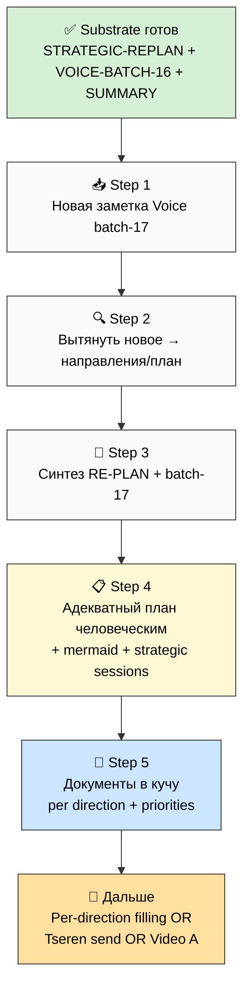

# 🗂️ План дня — 2026-05-28 Thursday — **Adequate Plan Fixation + Documents Collection**

> **Day type:** Development (integration + synthesis + collection).
>
> **Главный факт ночи:** За ночь 27→28.05 на сервере отгремел **voice-batch-16 + Strategic Re-Plan combined** (8 phases + fix). Substrate готов: **STRATEGIC-REPLAN-2026-05-28.md** (главный документ re-audit ~25 docs × 16 directions × 4 cols + plan + strategic sessions queue) + **VOICE-BATCH-16-INSIGHTS-2026-05-28.md** + 9 phase reports + 10 mermaid + SUMMARY-FOR-RUSLAN ≤2000w.

---

## §0 Цель дня (1 строка)

**Зафиксировать ещё раз адекватный план работы на человеческом языке + сразу собрать нужные документы для следующих шагов.**

---

## §1 Substrate state (что готово к утру 28.05)

### ✅ Done overnight (server CC)

| Артефакт | Что | Размер |
|---|---|---|
| `decisions/strategic/STRATEGIC-REPLAN-2026-05-28.md` | Главный документ Strategic Re-Plan (re-audit ~25 docs + 16 directions × 4 cols + plan + strategic sessions queue) | большой |
| `decisions/strategic/VOICE-BATCH-16-INSIGHTS-2026-05-28.md` | Voice batch 16 insights (O-207+) + R12 paired check | medium |
| `reports/strategic-replan-2026-05-28/00-SUMMARY-FOR-RUSLAN.md` | Человеческий summary ≤2000w | short |
| `reports/strategic-replan-2026-05-28/01-08*.md` + diagrams | 9 phase reports + mermaid suite (RP-1..RP-10) | full |

### 🎙️ Last voice processed

- **`raw/voice-memos/audio_2026-05-28_01-41-33.ogg`** (28.05 01:41:33 Berlin TZ) — обработана в voice-batch-16.
- **Жду новую заметку** от тебя (Downloads → repo → batch-17).

---

## §2 Шаги дня (5 steps per Ruslan voice 28.05)

### Step 1 — Обработать новые заметки (когда добавишь)

- Voice file → `raw/voice-memos/` → commit/push
- Server CC run: `voice-batch-17-quick` (быстрый processing per batch-15/16 pattern)
- Output: `decisions/strategic/VOICE-BATCH-17-INSIGHTS-2026-05-28.md` + phase reports

### Step 2 — Вытянуть новое из batch-17 → закинуть в направления / план

- New ideas (O-N+) → relevant directions (V4 16 directions)
- Wiki/KB proposals DRAFT (per pool pattern, не auto-promote)
- Cross-batch dedup vs Strategic Re-Plan substrate

### Step 3 — Синтезировать ещё раз (Strategic Re-Plan + batch-17)

- Update STRATEGIC-REPLAN с new insights (separate consolidation doc OR append section)
- Re-check 16 directions × 4 cols: что ещё уточнилось / что добавилось
- Surface contradictions если есть

### Step 4 — Адекватный план работы на человеческом языке

- Build `STRATEGIC-REPLAN-V2-2026-05-28.md` (или extension) — финальный план integrated
- Human-language plain Russian (НЕ academic)
- Mermaid схемы (≥5: текущее состояние / 16 directions priorities / next steps / dependencies / blockers)
- Strategic sessions queue (~25 R1 decisions + key questions + data needed per question)

### Step 5 — Собрать документы в кучу

- Documents collection per direction (что готово / что нужно / приоритеты)
- Per direction folder структура (или index doc)
- Sort by priority + Wave (1/2/3/4)
- Pool documents для choose-later (per pool-pattern feedback)

---

## §3 Mermaid — flow дня

---

## §4 Что ждёт (parked — после plan + docs collection)

### 🔴 Critical pending (carried from 27.05 plan)

1. **Tseren letter не отправлен** — draft готов (`LETTER-TO-TSEREN-RESPONSE-2026-05-26.md` + voice-pipeline-public main + SUMMARY). Polish + Telegram send.
2. **V4 #17 Security pillar supplement** — α ack'нуто; нужен supplement prompt с substrate из `INFO-SECURITY-OWN-INFRA-RESEARCH-2026-05-27.md` (543 lines).
3. **Video A не записан** — Build блокер; перенесли с 28.05 если фокус сегодня на plan+docs.
4. **R1 decisions backlog 80+** — нужна prioritization session (после adequate plan = автоматически фильтруется).

### 🟡 Background (не блокирует сегодня)

- CRM Kaiser — promote с role:advisor (basic done; detail позже)
- Strategic Reflection prose D14-1 + D14-4 — defer
- MIM Path D archived — не выбран
- Aisystant subscription — не оформлен (нужен для Levenchuk deep ingestion)

---

## §5 Что я делаю в Cloud Cowork сегодня

- ✅ ActivityWatch export 28.05 (done — commit `8a8d4bd`)
- ✅ Toggl entries 27-28.05 JSON (done — commit `51334cb`)
- ✅ Plan-of-Day 28.05 (this file)
- ⏳ Notion Daily Log entry 28.05 (create page in DB `30a24963-33bf-8005-817a-000beb10bcd4`)
- ⏳ When you drop new voice → build voice-batch-17 prompt for server CC
- ⏳ When new substrate готов → Step 2-5 prompts/EXPLAIN files for server CC

---

## §6 Cross-refs

- **Substrate главный:** `decisions/strategic/STRATEGIC-REPLAN-2026-05-28.md`
- **Voice batch-16:** `decisions/strategic/VOICE-BATCH-16-INSIGHTS-2026-05-28.md`
- **Summary человеческий:** `reports/strategic-replan-2026-05-28/00-SUMMARY-FOR-RUSLAN.md`
- **Previous plans:** `daily-logs/_PLAN-OF-DAY-2026-05-26.md` (Architecture Foundation Day)
- **Handoff:** `_HANDOFF_to_next_cowork_session_2026-05-27.md`
- **Canonical 16 directions:** `decisions/strategic/JETIX-METAPLAN-V4-FINAL-2026-05-26.md`

---

*Plan closure 2026-05-28 morning. Day type: development (integration + synthesis + collection). Цель: adequate plan + documents collection. 5 steps: новая заметка → вытянуть → синтез → human plan → docs в кучу. Substrate готов overnight (Strategic Re-Plan + batch-16 + SUMMARY). Last voice processed: 2026-05-28 01:41:33. Waiting for new voice memo from Ruslan.*
