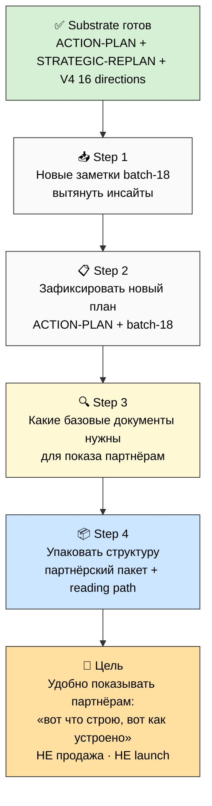

# 🗂️ План дня — 2026-05-29 Friday — **Упаковка структуры базовых документов (для показа партнёрам)**

> **Day type:** Development (упаковка + фиксация структуры базовых наработок).
>
> **Главный сдвиг:** Не для продажи, не для мега-запуска. Цель — **зафиксировать и упаковать структуру базовых документов** (наработки + идеи), чтобы удобно было **показывать потенциальным партнёрам и помощникам** — «вот что я строю, вот как это устроено».

---

## §0 90-секундный TL;DR

- За ночь 28→29.05 закрыт **voice-batch-17 + ACTION-PLAN-OUTREACH-FOCUS** (9 phases) — situation re-description + documents filtered (critical/wave-1/defer) + action queue outreach-first + outreach plan.
- **Сегодня:** упаковать **базовые документы** в удобную структуру для показа партнёрам/помощникам. Не sales, не launch — просто «вот моя система, вот наработки, посмотри».
- **Шаги:** обработать новые заметки → вытянуть инсайты → зафиксировать новый план → разобраться какие именно базовые документы нужны → упаковать структуру.
- **Substrate готов:** ACTION-PLAN + STRATEGIC-REPLAN + V4 16 directions + Workshop concept + 4 LOCKED canonical.

---

## §1 Цель дня (1 абзац)

**Зафиксировать и упаковать структуру базовых документов** — все базовые наработки и идеи ещё раз собрать, упаковать, чтобы можно было дальше **показывать потенциальным партнёрам и помощникам**: рассказывать что строю, показывать как устроено. Это **НЕ для продажи** и **НЕ для мега-запуска** — а чтобы было удобно показывать партнёру: «вот моя система Jetix, вот метод, вот направления, вот ценности и обещания, вот как ты можешь участвовать».

---

## §2 Substrate state (что готово к утру 29.05)

### ✅ Done overnight (voice-batch-17 run)

| Артефакт | Что |
|---|---|
| `decisions/strategic/ACTION-PLAN-OUTREACH-FOCUS-2026-05-28.md` | Situation re-description + documents filtered + action queue outreach-first + outreach plan |
| `decisions/strategic/VOICE-BATCH-17-INSIGHTS-2026-05-28.md` | Voice items O-N+ from 3 заметки 15:43 |
| `reports/voice-batch-17-action-plan-2026-05-28/00-SUMMARY-FOR-RUSLAN.md` | ≤1200w человеческий factual |
| 6 phase reports + diagrams AP-1..AP-6 | drill-down |

### 🎙️ Last voice processed

- **`raw/voice-memos/audio_2026-05-28_15-43-11.ogg`** (последняя из batch-17) — обработана.
- **Жду новые заметки** от тебя → batch-18.

---

## §3 Шаги дня (per Ruslan voice 29.05)

### Step 1 — Обработать новые заметки + вытянуть инсайты

- Новые voice → `raw/voice-memos/` → commit/push
- Server CC: `voice-batch-18-quick` (transcribe + extract + R12 + dedup)
- Вытянуть ВСЕ инсайты → закинуть в relevant directions
- Output: `decisions/strategic/VOICE-BATCH-18-INSIGHTS-2026-05-29.md`

### Step 2 — Зафиксировать новый план

- Интегрировать ACTION-PLAN-OUTREACH-FOCUS + новые инсайты batch-18
- Обновлённый адекватный план (human language)
- Что именно делаем дальше — concrete

### Step 3 — Разобраться какие именно базовые документы нужны

- Filter: какие документы нужны для **показа партнёрам** (не продажа, не launch)
- Базовый комплект «вот что я строю»:
  - Что такое Jetix (overview — мастерская + сеть + метод)
  - Метод (как работаем с информацией / методами / AI)
  - 16 directions карта (структура)
  - Ценности + R12 обещание (floor — что гарантируем)
  - Как партнёр / помощник может участвовать (роли + extension)
- НЕ нужно для показа (defer): financial reporting / Master Plan Part 3-4 / internal SOPs / game-mechanics

### Step 4 — Упаковать структуру этих документов

- Структура «партнёрского пакета» (как разложены документы, в каком порядке показывать)
- Каждый документ: что в нём, для кого, в каком формате (MD / PDF / Notion page / 1-pager)
- Reading path для партнёра (с чего начать → куда углубиться)
- Где живут (repo / Notion / отдельная partner-facing коллекция)

---

## §4 Mermaid — flow дня

---

## §5 Базовый комплект для партнёра (черновой scope — Ruslan уточнит/picks)

> R1 surface only — это гипотеза состава, не финальное решение. Уточняется в Step 3.

| Документ | Что показывает | Формат | Статус substrate |
|---|---|---|---|
| **Jetix overview** | Мастерская + сеть кланов + метод в одном | 1-pager / Notion page | ✅ есть (voice-pipeline-public + workshop concept) |
| **Метод** | Как работаем с информацией / методами / AI | MD / PDF | ✅ Method V2 LOCKED (нужна public-версия) |
| **16 directions карта** | Структура всего что строим | Diagram + page | ✅ V4 MetaPlan |
| **Ценности + R12 обещание** | Floor — что гарантируем (anti-extraction / fork-and-leave) | 1-pager | ⚠️ есть substrate, нужна упаковка |
| **Как участвовать** | Роли партнёра/помощника + extension protocol | Page | ⚠️ есть (partner-extension 4 layers), нужна упаковка |

---

## §6 Pending (parked — после упаковки)

- 🔴 Tseren letter не отправлен (draft готов — polish + send)
- 🔴 V4 #17 Security pillar supplement (substrate из INFO-SEC research)
- 🔴 Video A не записан (Build блокер)
- 🟡 R1 decisions backlog (фильтруется через план)

---

## §7 Что я делаю в Cloud Cowork сегодня

- ✅ ActivityWatch refresh 28-29.05 (commit `278cce4`)
- ✅ Toggl entries 28-29.05 JSON (commit `03ac133`)
- ✅ Plan-of-Day 29.05 (this file)
- ⏳ Notion Daily Log entry 29.05
- ⏳ Когда дашь новые заметки → voice-batch-18 prompt для server CC
- ⏳ Когда план + scope готовы → prompt для упаковки базового партнёрского пакета

---

## §8 Cross-refs

- **Substrate главный:** `decisions/strategic/ACTION-PLAN-OUTREACH-FOCUS-2026-05-28.md`
- **Re-Plan:** `decisions/strategic/STRATEGIC-REPLAN-2026-05-28.md`
- **Canonical 16 directions:** `decisions/strategic/JETIX-METAPLAN-V4-FINAL-2026-05-26.md`
- **Foundation metaphor:** `decisions/strategic/JETIX-WORKSHOP-MASTERY-NETWORK-CONCEPT-2026-05-26.md`
- **Predecessor plan:** `daily-logs/_PLAN-OF-DAY-2026-05-28.md`
- **Handoff:** `_HANDOFF_to_next_cowork_session_2026-05-27.md`

---

*Plan closure 2026-05-29 morning. Day type: development (упаковка + фиксация). Цель: упаковать структуру базовых документов для показа партнёрам/помощникам (НЕ продажа, НЕ launch). 4 steps: новые заметки → новый план → какие документы нужны → упаковать структуру. Substrate готов overnight (voice-batch-17 + ACTION-PLAN). Last voice processed: audio_2026-05-28_15-43-11.ogg.*
