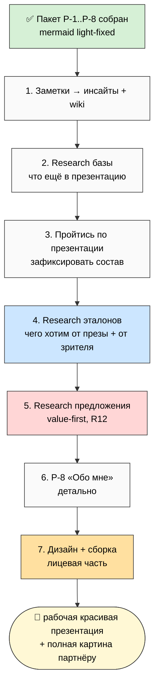

# 🗂️ План дня — 2026-05-30 Saturday — **Презентация для партнёров: фиксация пакета + сборка**

> **Day type:** Development.
>
> **Главный сдвиг:** партнёрский пакет (P-1..P-8) собран — переходим к **обновлению/фиксации всей информации для партнёров + сборке рабочей красивой презентации**.

---

## §0 90-секундный TL;DR

- Overnight закрыт **extend-прогон**: P-6/P-7/P-8 созданы, P-1 round 2 + доп-расширения, **mermaid light-fix на всех 14 схемах** (black-on-black устранён).
- **Сегодня:** ещё раз пройтись по всему пакету, добить непокрытые смыслы/направления, зафиксировать состав «что рассказываем партнёру» → сделать ресёрчи (эталоны презентаций + «сильное честное предложение») → описать P-8 «Обо мне» → пойти в дизайн и сборку презентации.
- **Цель = рабочая презентация** + полная зафиксированная картина для партнёра.

---

## §1 Цель дня + задача

**Цель дня.** Проработать и зафиксировать **обновлённую улучшенную версию презентации** и в целом всю информацию/документы, которые рассказываем партнёру (ещё раз пройтись по партнёрскому пакету P-1..P-8).

**Задача дня.** Всё зафиксировать и **как можно больше воплотить** — создать уже **рабочую, красивую презентацию**, доносящую смыслы.

---

## §2 Substrate state (готово к утру 30.05)

| Артефакт | Статус |
|---|---|
| `partner-package/P-1..P-8` + README | ✅ собран (P-1 round 2 + extends; P-6/P-7/P-8 created) |
| Mermaid (14 схем в пакете) | ✅ light-fix (force light theme, black-on-black устранён) |
| Notion: «Сбор партнёрских документов» / «Поиск первых партнёров» / «Сбор презентации в кучу» | ✅ каркасы (продолжаем) |
| `PARTNER-PACKAGE-2026-05-29.md` overview | ✅ обновлён |
| Notion-links в P-1 (Блок 4 placeholder) | ⏳ Cloud Cowork вставит partner-safe |

---

## §3 Шаги дня (per Ruslan voice 30.05)

### Шаг 1 — Новые заметки → инсайты
- Обработать новые голосовые (если есть) → вытянуть все инсайты для текущей задачи (презентация) + что нужно добавить в **wiki**.
- Output: `VOICE-BATCH-19-INSIGHTS` (если есть заметки) + wiki-кандидаты.

### Шаг 2 — Research по нашей базе (что ещё в презентацию)
- Пройтись по всей базе документов: какие ещё **интересные данные** / **направления Jetix** (из V4 16 directions) мы НЕ упомянули в пакете/презентации.
- Цель: полноценная картина для потенциального партнёра.
- Output: список «что добавить» → в пакет/презентацию.

### Шаг 3 — Пройтись по презентации → зафиксировать состав
- Ещё раз по презентации: зафиксировать **основные документы и что именно рассказываем** (порядок, акценты).
- Output: фикс состава презентации (на странице «Сбор презентации в кучу»).

### Шаг 4 — Research: эталоны презентаций (стартапы / сильные компании)
- Как делают лучшие презентации (pitch / vision decks): **как, в чём суть, для чего**.
- Чётко зафиксировать: **чего мы хотим от презентации** и **чего хотим от человека, который её увидит**.
- Лучшие наработки → в создание презентации + донесение смыслов.

### Шаг 5 — Research: сильное честное предложение + взаимодействие с партнёрами
- Как делать предложение, **от которого трудно отказаться** — и как взаимодействовать с партнёрами.
- ⚠️ **R12 paired-frame:** value-first, НЕ манипуляция/FOMO/давление (influence-ethics RECEIVER). «Невозможно отказаться» = настолько ценно и честно, а не через дарк-паттерны.

### Шаг 6 — Детально описать P-8 «Обо мне» (перед дизайном)
- Понять **что именно рассказывать, почему, зачем** — наполнить скелет P-8 (история Руслана).

### Шаг 7 — Дизайн + сборка презентации (лицевая часть)
- Когда все сырьевые материалы зафиксированы → дизайн презентации → создание лицевой части.

---

## §4 Mermaid — flow дня

---

## §5 Переходящие страницы (продолжаем работу)

- **Сбор партнёрских документов** (Notion) — пакет P-1..P-8
- **Поиск первых партнёров** (Notion) — §5 partner-facing страница (15-20)
- **Сбор презентации в кучу** (Notion) — хаб сборки презентации (4 шага)

---

## §6 Что я делаю в Cloud Cowork сегодня

- ✅ ActivityWatch 29.05 full export (commit `ccc0050`)
- ✅ Toggl entries 29→30.05 (commit `09fb4d3`)
- ✅ Plan-of-Day 30.05 (this file) + Notion daily page 30.05
- ⏳ Вставить partner-safe Notion-links в P-1 Блок 4
- ⏳ Когда дашь заметки → voice-batch-19 prompt
- ⏳ Промты серверу: research эталонов презентаций + research предложения (R12 paired) — по твоему go

---

## §7 Cross-refs

- **Пакет:** `partner-package/` + `decisions/strategic/PARTNER-PACKAGE-2026-05-29.md`
- **Forward plan:** `decisions/strategic/FORWARD-ACTION-PLAN-2026-05-29.md`
- **16 directions:** `decisions/strategic/JETIX-METAPLAN-V4-FINAL-2026-05-26.md`
- **Predecessor:** `daily-logs/_PLAN-OF-DAY-2026-05-29.md`

---

*Plan closure 2026-05-30. Day type: development. Цель: фиксация обновлённого пакета + сборка рабочей презентации для партнёров. 7 шагов: заметки→инсайты · research базы · фикс состава презентации · research эталонов · research предложения (R12) · P-8 «Обо мне» · дизайн+сборка. Substrate: P-1..P-8 готов, mermaid light-fixed. Carryover: 3 Notion-страницы. R1 surface, R12 paired на research предложения/презентации.*
