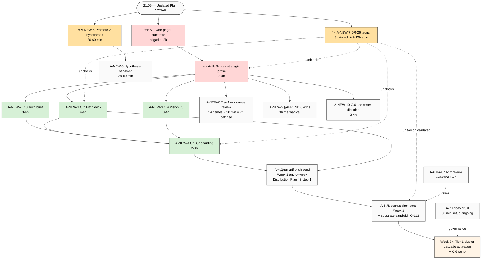
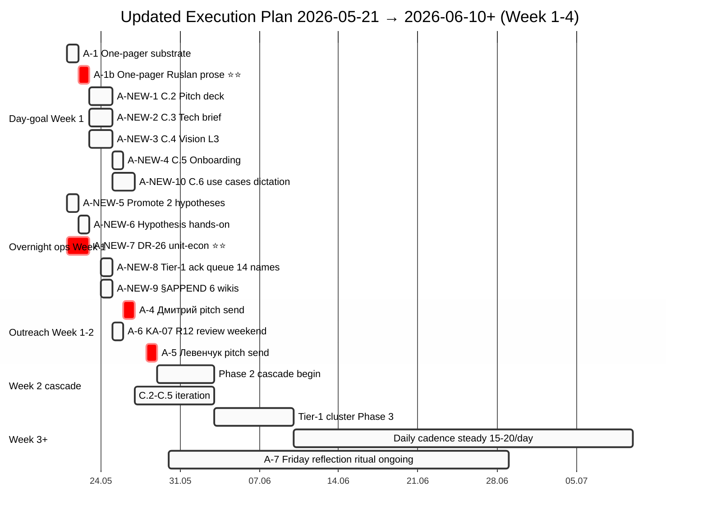

# 🎯 Updated Execution Plan — 2026-05-21 synthesis (post-batch-9 + overnight builds)

> **Phase 7 ⭐⭐ batch-9 primary value-add.** Synthesizes:
>
> 1. Execution Plan FINAL v2 (7 A-actions A-1..A-7) — predecessor 20.05 evening
> 2. Overnight builds 20.05 evening: **Hypothesis Architecture 7-layer** (GAP-1 closed) + **KA-03 CRM 169 contacts** (Tier-1 ack queue 14 names)
> 3. **Daily Log 21.05 goal-of-day**: «one-pager + детальные документы / пояснения / use cases / audience framings для продвижения»
> 4. **Batch-9 NEW findings** (7 audio 707-713; 18 KAs; 15 Tier B; 8 DR; 9 hypothesis-candidates; 5 ⭐⭐⭐ findings)
>
> → **Updated A-N roadmap** integrating всё substrate sprint 20-21.05.

---

## §0 TL;DR (≤250w)

**Что изменилось vs FINAL v2 evening 20.05:**

- ✅ **3 risks CLOSED** since FINAL v2: Hypothesis-arch-premature / CRM-target-list-missing / Day-goal-undefined
- ✅ **4 NEW risks** surface batch-9: unit-econ slippage / self-validation abductive / timing-argument hubris / governance R12 boundary
- ✅ **Substrate jump:** 9 hypothesis-candidates + 6 outreach opener-hooks + 5 ⭐⭐⭐ findings + canonical one-liner + 8-doc inventory voiced + 20-25% take rate explicit
- ✅ **Day-goal-21.05 fully fed:** one-pager + 4 детальные документы C.2-C.5 all have batch-9 substrate; C.6 use cases sparse (needs dictation)

**New action layout — 11 A-actions (7 old + 4 new + restructure):**

| Layer | A-IDs | Status |
|---|---|---|
| Day-goal-21.05 PRIMARY ⭐⭐ | A-1 / A-1b / A-NEW-1..A-NEW-5 | substrate ready, Ruslan executes этим днем/неделей |
| Overnight build operationalisation | A-NEW-6 (hypothesis hands-on) / A-NEW-7 (DR-26 launch) | first-real-use post-overnight |
| Outreach prep | A-NEW-8 (Tier-1 ack queue 14 names) | KA-03 ready |
| Existing FINAL v2 continuing | A-4 (Дмитрий pitch Week 1) / A-5 (Левенчук Week 2) / A-6 (KA-07 R12 weekend) / A-7 (Friday ritual) | unchanged |

**Critical path этой недели (Week 1 21-26.05):** A-1 + A-1b one-pager → A-NEW-1..4 детальные документы → A-NEW-6 первая активная гипотеза → A-NEW-8 Tier-1 ack queue review → A-4 Дмитрий pitch send end-of-week.

---

## §1 Inputs synthesised

| # | Input | Status | Contribution |
|---|---|---|---|
| 1 | Execution Plan FINAL v2 evening 20.05 | LOCKED predecessor | 7 A-actions A-1..A-7 baseline |
| 2 | Hypothesis Architecture 7-layer (overnight 20.05 evening) | OPERATIONAL | hypotheses/ first-class dir + 9 skills + 5 samples; GAP-1 closed; public-promise hook (audio_711 claim 3) |
| 3 | KA-03 CRM 169 contacts (overnight 20.05 evening) | OPERATIONAL | 93 NEW entries / 169 total; 7 L1 + 35 L2 + 51 L3 segmentation; **Tier-1 ack queue 14 names** ready |
| 4 | Daily Log 21.05 goal-of-day | ACTIVE | «one-pager + детальные документы для продвижения» — explicit day-target |
| 5 | Batch-9 findings (this run) | NEW | 5 ⭐⭐⭐ + 18 KAs + 15 Tier B + 8 DR + 9 hypothesis-candidates + 6 outreach opener-hooks |
| 6 | Audio_709 claim 1 voiced 8-doc inventory | NEW EXPLICIT | DIRECT 1:1 day-goal-21.05 mapping (метод / кто я / наработки / чем занимаюсь / планы корпорации / планы на мир / описание метода / возможности при работе со мной) |

---

## §2 Immediate-actionable items (≤7 days) — что Ruslan execute прямо сейчас

| # | Action | Owner | Time | Dependency | Cross-link | Day-goal-21.05? |
|---|---|---|---|---|---|---|
| **A-1** ⭐⭐ | One-pager C.1 L2 substrate prep | brigadier | 2h | None | Distribution Plan §1 + Левенчук pitch hooks + 8-doc inventory (audio_709 claim 1) | ✅ PRIMARY |
| **A-1b** ⭐⭐ | One-pager Ruslan strategic prose ~600-800w | Ruslan | 2-4h | A-1 done | O-75 / O-86 / O-114 inventory / O-115 self-label / O-107 one-liner | ✅ PRIMARY |
| **A-NEW-1** ⭐⭐ | Детальные документы C.2 Pitch deck compile | brigadier (2h) + Ruslan (2-4h) | 4-6h | A-1+A-1b done | Master Packaging Step 6 / O-107 / O-115 / O-119 / Substrate-sandwich O-113 | ✅ details |
| **A-NEW-2** | Детальные документы C.3 Tech brief (ML/AI audience) | brigadier (2h) + Ruslan (1-2h) | 3-4h | A-1 + Hypothesis arch overnight | O-105 intellect substrate + Hypothesis arch deliverable details | ✅ details |
| **A-NEW-3** | Детальные документы C.4 Vision narrative L3 (humanitarian) | brigadier (2h) + Ruslan (1-2h) | 3-4h | A-1 + O-86 frame + HR-4 hubris paraphrase | O-86 / O-106 desire-to-live / O-107 collaborative-product / O-111 closed-loop | ✅ details |
| **A-NEW-4** | Детальные документы C.5 Onboarding doc (cohort intake) | brigadier (1.5h) + Ruslan (1h) | 2-3h | A-NEW-1..3 done | partnership-baseline / O-109 / O-116 / O-117 / Hypothesis arch hands-on | ✅ details |
| **A-NEW-5** ⭐ | Promote H-batch-9-06 + H-08 to active hypotheses via `/hypothesis-add` | Ruslan + brigadier | 30-60 min | Hypothesis arch ✓ ready | hypotheses/active/ + Hypothesis arch §5 short-term plan | supportive |
| **A-NEW-6** | Hypothesis arch hands-on first use session | Ruslan | 30-60 min | A-NEW-5 done | hypotheses/active/H-batch-9-06.md + /hypothesis-dash | supportive |
| **A-NEW-7** ⭐⭐ | DR-26 ⭐⭐ unit-econ deep-dive launch | brigadier autonomous (~8-12h) | 5 min Ruslan ack | Mondragón substrate ✓ + R12 anti-extraction primitive | DR pool + O-108 + C.2 pitch deck monetization | supportive (gates) |
| **A-NEW-8** | Tier-1 ack queue review (14 names KA-03) | Ruslan | 30 min × 14 = 7h batched | A-1 done (canonical descriptors) | crm/people/ + Distribution Plan §3 cascade + 6 batch-9 outreach opener-hooks | Phase 1 prep |
| **A-NEW-9** | §APPEND batch-9 to 6 existing wikis | brigadier (per ack) | 3h mechanical | Ruslan ack §APPEND set + A-1 canonical descriptors | 6 wikis: partnership-baseline / project-of-humanity / method-systems-thinking / jetix-as-exokortex / mastery-formula / sense-of-measure | substrate consolidation |
| **A-NEW-10** | Day-goal-21.05 use cases C.6 substrate dictation | Ruslan dictation (1-2h) + brigadier compile (2h) | 3-4h total | A-NEW-8 may surface case-study candidates | Distribution Plan §1 use-case-tier (currently sparse) | ⚠️ partial |

### A-actions FINAL v2 continuing (unchanged status)

| # | Action | Status |
|---|---|---|
| **A-4** | KA-02 Дмитрий pitch drafting + send Week 1 (21-26.05) | UNCHANGED — substrate ready Week 1 launch |
| **A-5** | KA-01 Левенчук pitch drafting + send Week 2 (27.05-2.06) | UPDATED — substrate-sandwich O-113 articulation now ready for integration |
| **A-6** | KA-07 R12 ethical-surface review O-83 cheat-code | UNCHANGED — weekend reflection 1-2h |
| **A-7** | Weekly Friday reflection ritual setup | UNCHANGED — 30 min habit setup |

---

## §3 Ack queue / Backlog (≤30 days)

### §3.1 Tier B candidates pool extensions batch-9 (15 items)

> Pool count: 22 → 37 total (batch-9 +15). Per `feedback_research_pool_pattern.md` — NOT promoted; cherry-pick per Ruslan ack.

- **O-105** Two-tier intellect (external/internal + sensing) — DR-25 gates
- **O-106** ⭐ Desire-to-live = primary info-valve — Tier A standalone candidate если Ruslan ack
- **O-107** Canonical one-liner «метод по объединению методов» — ready ack
- **O-108** ⭐⭐ 20-25% take rate — DR-26 gates
- **O-109** Responsibility-pact framework — Tier A or §APPEND
- **O-110** Установка-layer precedes method-selection — cross-batch corroborated
- **O-111** Closed-loop development Jetix↔society — adjacent existing
- **O-112** Trial-and-error / метод тыка legitimation — §APPEND-ready
- **O-113** Левенчук+Ruslan substrate sandwich — one-pager substrate
- **O-114** ⭐⭐⭐ «Метод обработки информации» descriptor + 8-doc inventory — PRE-ACKED via voice command
- **O-115** Ruslan public self-label «методологист философ изобретатель» — bio material
- **O-116** Partnership invitation language verbatim — onboarding ready
- **O-117** Governance-layering Jetix-meaning vs partner-project — boundary check
- **O-118** «Тягучка зависимость от жизни» phrase — voice-only preserve
- **O-119** Self-validation by outcome / recursive bootstrap — origin-story substrate

### §3.2 Research pool extensions batch-9 (8 DR-25..DR-32)

> Pool count: 17 → 25 total (batch-9 +8). NOT auto-launched. Cherry-pick per Ruslan ack.

- **DR-25** Sensing/feeling cross-disciplinary scan — P3
- **DR-26** ⭐⭐ Unit-economics deep-dive — **P1 URGENT** (gates O-108 + C.2 pitch + DP §5) — recommend immediate ack
- **DR-27** Closed-loop ecosystem dynamics — P3
- **DR-28** Humanity-self-awareness threshold philosophy — **P2** (enhances C.4)
- **DR-29** Method-creation rate vs info-accumulation timing — P3 (long-term substrate)
- **DR-30** Partnership invitation language A/B substrate — P3
- **DR-31** Governance-layer R12 boundary audit — P3
- **DR-32** Origin-story / bootstrap-credibility pitch A/B — P3

### §3.3 Hypothesis migration backlog (post-overnight-build)

- **Promotable via `/hypothesis-add` immediately (A-NEW-5):**
  - H-batch-9-06 «20-25% take rate sustainable + perceived-fair with responsibility-pact»
  - H-batch-9-08 «"метод-по-объединению-методов" one-liner increases pitch conversion vs alternatives»
- **Pool-tagged in Tier B entries (7):** H-batch-9-01/02/03/07/09 + samples promotion review
- **Deferred frame-level / DR scope (2):** H-batch-9-04 (civilization at threshold — frame-level) + H-batch-9-05 (method-creation rate — DR-29 scope)
- **22 Tier B + 25 DR pool items** → ongoing review для hypothesis conversion per Hypothesis arch §5 short-term plan

### §3.4 Existing FINAL v2 backlog (status updates)

- ✅ A-4 Дмитрий pitch — Week 1 launch — no change since FINAL v2
- ✅ A-5 Левенчук pitch — Week 2 launch — UPDATED substrate-sandwich integration
- ✅ A-6 KA-07 R12 review — weekend — no change
- ✅ A-7 Weekly Friday reflection ritual — ongoing — no change

### §3.5 §APPEND wiki recommendations (Phase 6 ack queue)

| Wiki | §APPEND-batch-9 substrate |
|---|---|
| `wiki/concepts/partnership-baseline.md` | O-109 responsibility-pact + O-116 «в одном корабле» invitation + O-117 governance-layering |
| `wiki/concepts/project-of-humanity-positioning.md` | O-106 desire-to-live + O-111 closed-loop |
| `wiki/concepts/method-systems-thinking.md` | O-107 canonical one-liner + O-110 установка-layer + O-112 trial-and-error |
| `wiki/concepts/jetix-as-exokortex.md` | O-106 desire-to-live + O-118 «тягучка зависимость от жизни» phrase |
| `wiki/concepts/mastery-formula.md` | O-105 two-tier intellect + O-112 trial-and-error + O-119 self-validation |
| `wiki/concepts/sense-of-measure.md` | O-105 sensing-as-intellect-component |

→ A-NEW-9 mechanical execution after Ruslan ack §APPEND set.

---

## §4 Updated roadmap timeline

### Week 1 (21-26.05) — THIS WEEK

```
ДЕНЬ 21.05 (today):
  ├─ A-1 + A-1b One-pager (день/завтра) — substrate ready
  ├─ A-NEW-5 promote 2 active hypotheses (30 min) — quick win
  ├─ A-NEW-6 Hypothesis arch hands-on first session (30 min)
  ├─ A-NEW-7 DR-26 ⭐⭐ unit-econ launch (5 min ack) — runs autonomous
  └─ Ruslan reads Phase 7 + acks D9-* decisions

22-23.05:
  ├─ A-NEW-1 C.2 Pitch deck compile (after A-1 done)
  ├─ A-NEW-2 C.3 Tech brief compile (parallel)
  └─ A-NEW-3 C.4 Vision narrative L3 (parallel)

24.05 (Sat):
  ├─ A-NEW-4 C.5 Onboarding doc (after A-NEW-1..3)
  ├─ A-NEW-8 Tier-1 ack queue review (3-4h batched)
  └─ A-NEW-9 §APPEND 6 wikis mechanical

25.05 (Sun):
  ├─ A-6 KA-07 R12 ethical-surface review O-83 (1-2h)
  └─ A-NEW-10 Use cases C.6 dictation (1-2h)

26.05 (Mon):
  └─ A-4 Дмитрий pitch send (end-of-week — Distribution Plan §3 step 1)

🎯 End-of-Week-1 deliverables:
  • One-pager DONE
  • C.2/C.3/C.4/C.5 detail docs DONE (4 docs)
  • DR-26 unit-econ memo received (~24-36h roundtrip)
  • 14 Tier-1 contacts statused
  • 2 active hypotheses operational
  • 6 wikis §APPEND-batch-9
  • A-4 Дмитрий pitch sent
```

### Week 2 (27.05-2.06)

```
27-30.05:
  ├─ A-5 Левенчук pitch send (post-DR-26 unit-econ math validated)
  ├─ Phase 2 cascade begin (Distribution Plan §3 step 2)
  ├─ C.2-C.5 documents iteration based on A-4 / A-5 feedback
  └─ Дмитрий + Левенчук responses tracking

31.05-2.06:
  ├─ Tier-1 cluster outreach Phase 3 begin (ML/AI cluster: Karpathy / Olah / Kaplan)
  ├─ C.6 use cases ramp up (substrate dictation continues)
  └─ Weekly Friday reflection ritual run #1 (A-7)
```

### Week 3 (3-9.06)

```
- Tier-1 cluster outreach Phase 3 continues (strategic + humanitarian clusters)
- Daily cadence ramp до 10-15 touches/day
- 6 ⭐⭐⭐ Левенчук chapters deep FPF phase candidates (per distillation)
- Hypothesis pool review for 1-2 more promotions to active
- DR-26 follow-up: H-batch-9-06 take-rate hypothesis testing in cohort intake
```

### Week 4+ (10.06+)

```
- Daily cadence steady 15-20 touches/day
- C.2/C.3/C.4/C.5 final iteration based on response patterns
- Tier B pool revisit (promote 1-2 candidates per week based on substrate validation)
- DR pool cherry-pick (P2 items first: DR-22 Левенчук-meta-method-congruence / DR-28 humanity-threshold)
- Constitutional review running (R12 paired-frame discipline checks per outreach batch)
- Foundation Strategic Layer Phase 2 onset (Pillar A North Star refresh substrate; Pillar B P1 quick-money advanced; Pillar C R12 programmable Ethereum substrate scoped)
```

---

## §5 Dependency map (mermaid)



---

## §6 Risks update

### Closed / mitigated since FINAL v2 evening 20.05

| Risk | Status | Mitigation |
|---|---|---|
| **R-Hypothesis-arch-premature** | ✅ CLOSED | Overnight 7-layer build operational; GAP-1 OMG Essence integration done; public-promise hook ready (audio_711 claim 3 «инструменты для теста гипотез») |
| **R-CRM-target-list-missing** | ✅ CLOSED | KA-03 overnight: 169 contacts (93 NEW); 7 L1 + 35 L2 + 51 L3 segmentation; Tier-1 ack queue 14 names ready |
| **R-Day-goal-undefined** | ✅ CLOSED | Audio_709 claim 1 voiced 8-doc inventory explicitly; Day-goal-21.05 fully scoped via batch-9 §B + 14-lens §7 day-goal supportive matrix |

### Still active from Distribution Plan §8 + FINAL v2

| Risk | Severity | Mitigation status |
|---|---|---|
| **R-1 R12 paired-frame slippage** | medium | ✅ Batch-9 paired-frame audit 4/4 R12-relevant claims paired verbatim; discipline preserved; ongoing per outreach batch |
| **R-2 Burnout срочность** | medium | ⚠️ audio_708 «не выебываемся, яички в кулачок» self-coaching; «я каждому запихаю» momentum tension preserved AP-6; Ruslan IA-8 reflection scheduled |
| **R-3 Aggressive tone backfire** | medium-high | ⚠️ Batch-9 verbatim contains harsh language («долбоеб» / «запихаю» / «ёбаный»); pitch materials require softer paraphrase; substrate ≠ pitch enforced |
| **R-5 O-83 cheat-code backfire** | medium | ⏸️ A-6 KA-07 review pending weekend; no batch-9 movement; substrate preserved |
| **Левенчук unresponsive baseline** | low-medium | ⚠️ Week 2 contingency built; substrate-sandwich O-113 articulation strengthens pitch; warm-intro path via Левенчук cluster contacts (KA-03) |

### NEW risks batch-9

| Risk | Severity | Mitigation prep |
|---|---|---|
| **R-batch-9-N1 Unit-econ slippage** | medium | 20-25% voiced but «надо математику просчитать» Ruslan self-flag preserved; **DR-26 unit-econ deep-dive ⭐⭐ gates public anchor** before pitch materials lock 20-25%; provisional placeholder OK pre-validation |
| **R-batch-9-N2 Self-validation abductive reasoning** | low-medium | Audio_712-713 «I built it responsibly → it must be good» logic preserved verbatim; pitch material должна не rely solely на bootstrap proof structure — combine с external corroboration (Левенчук distillation + 30+ books matrix + Master Map substrate) |
| **R-batch-9-N3 Timing-argument hubris** | medium | Audio_709 «сейчас уже должны заниматься такие системы» implies Jetix = the-system; pitch material для L3 audience soften: «one of the systems / contributing to convergence» rather than singular «the» framing; AP-6 preserve verbatim в substrate |
| **R-batch-9-N4 Governance-layer R12 boundary** | low-medium | Audio_711 «Jetix управляет смыслами ценностями» — risk meaning-frame imposition; paired-frame voluntary opt-in preserved verbatim batch-9 §A.3 HR-3; DR-31 governance-boundary audit (P3 deferred) для long-term refinement |

### Risk priority matrix

```
HIGH:    none active
MED-HIGH: R-3 aggressive tone backfire (pitch paraphrase needed before public material)
MEDIUM:   R-1 R12 / R-2 burnout / R-5 cheat-code / R-batch-9-N1 unit-econ slippage / R-batch-9-N3 timing-hubris
LOW-MED:  Левенчук unresponsive / R-batch-9-N2 abductive / R-batch-9-N4 governance R12 boundary
```

---

## §7 READY-FOR-RUSLAN-ACK (D9-* quick ack queue)

> Per memory `feedback_no_unsolicited_alternatives.md` — Ruslan picks per item; brigadier surfaces. Each item ≤5-30 min reflection.

| ID | Decision | Type | Time-to-ack |
|---|---|---|---|
| **D9-1** | Approve 15 Tier B candidates O-105..O-119 pool extension (already appended) | ack pool | 5 min |
| **D9-2** | Approve 8 DR candidates DR-25..DR-32 pool extension (already appended) | ack pool | 5 min |
| **D9-3** ⭐⭐ | KA-36 / A-NEW-7 DR-26 unit-econ deep-dive launch (gates O-108 + C.2 pitch + DP §5) | execute IA URGENT | 5 min ack + 8-12h autonomous |
| **D9-4** ⭐⭐ | KA-30 / A-1 + A-1b one-pager compile launch (day-goal PRIMARY) | execute IA | 5 min ack + 4-6h |
| **D9-5** | KA-31..34 / A-NEW-1..4 C.2/C.3/C.4/C.5 детальные документы compile (day-goal details) | execute IA after A-1 | per-doc 5 min ack |
| **D9-6** ⭐ | KA-35 / A-NEW-5 promote H-batch-9-06 + H-08 to active hypotheses via `/hypothesis-add` | execute IA | 15-30 min |
| **D9-7** | KA-37 / A-NEW-8 Tier-1 ack queue review (14 names KA-03) | execute IA | 30 min × 14 = 7h batched |
| **D9-8** | KA-38 / A-NEW-9 §APPEND batch-9 to 6 existing wikis | execute IA mechanical | 5 min ack + 3h |
| **D9-9** | KA-40 / A-NEW-6 Hypothesis arch hands-on first use | execute IA | 5 min ack + 30-60 min |
| **D9-10** | KA-45 / A-NEW-10 use cases C.6 substrate dictation | backlog-ack | depends Ruslan dictation slot |
| **D9-11** | Tier A promotion candidates O-106 (desire-to-live) + O-107 (one-liner) — promote standalone vs §APPEND existing | strategic decision R1 | 15 min |
| **D9-12** | R-batch-9-N1..N4 risk update accept | constitutional review | 15-30 min |
| **D9-13** | HR-1..HR-6 batch-9 high-risk items review (aggressive tone backfire substrate vs pitch paraphrase needs) | constitutional review | 15-30 min |
| **D9-14** | A-5 Левенчук pitch Week 2 — substrate-sandwich integration ack | execute IA Week 2 | 5 min ack |

**Recommended first acks этим днем (priority order):**
1. D9-3 (DR-26 launch — runs autonomous in background)
2. D9-4 (one-pager — day-goal PRIMARY)
3. D9-6 (hypothesis promote — quick win post-overnight)
4. D9-8 (§APPEND mechanical — pool consolidation)

---

## §8 Mermaid gantt — Updated timeline Week 1-4+



---

## §9 What's after Phase 7 closure (next steps post-this-doc)

```
Ruslan reads:
  ├─ Summary 00-SUMMARY-FOR-RUSLAN.md (~5 min)
  ├─ Phase 7 Updated Plan §0 + §2 + §7 (~10 min)
  └─ Optional deep-dive §6 risks + §3 ack queue (~10 min)

Ruslan acks (first session):
  ├─ D9-3 ⭐⭐ DR-26 launch (5 min ack — runs autonomous 8-12h в background)
  ├─ D9-4 ⭐⭐ A-1 + A-1b one-pager (5 min ack — start strategic prose immediately)
  ├─ D9-6 ⭐ promote 2 hypotheses (15-30 min hands-on — quick win)
  └─ D9-8 §APPEND wikis (5 min ack — brigadier executes async)

Ruslan executes (today / tomorrow):
  ├─ A-1 + A-1b one-pager (2-4h strategic prose this evening or tomorrow morning)
  ├─ A-NEW-5 + A-NEW-6 hypothesis promote + hands-on (combined ~60 min slot)
  └─ A-NEW-8 Tier-1 ack queue review (batched 3-4h focused session over 1-2 days)

Returns after first execution:
  ├─ One-pager DONE → C.2-C.5 details compile next
  ├─ DR-26 memo arrives → unit-econ paragraph lock
  ├─ Active hypotheses operational → first real Jetix-machinery deliverable
  └─ A-4 Дмитрий pitch send end-of-week
```

---

## §10 Critical observations Phase 7 synthesis

### Coherence check across substrate

✅ **All 14 lenses batch-9 fed Phase 7 inputs** — no missing substrate.

✅ **8-doc inventory (audio_709 claim 1) maps 1:1 к day-goal-21.05** — Ruslan voiced ровно what is target.

✅ **5 ⭐⭐⭐ findings all addressed** в this Updated Plan:
- 8-doc inventory → §2 A-1 + A-1b + A-NEW-1..4 day-goal items
- Canonical one-liner → O-107 / A-1b strategic prose substrate
- 20-25% take rate → A-NEW-7 DR-26 + R-batch-9-N1 risk
- Desire-to-live valve → O-106 / A-NEW-3 C.4 substrate
- Humanity self-awareness threshold → A-NEW-3 C.4 substrate + L3 frame

✅ **3 risks closed; 4 new risks documented** — net risk reduction.

✅ **No R1 violation** — brigadier surface only; Ruslan = sole strategist; all strategic prose authoring slots marked Ruslan.

✅ **Research-pool pattern preserved** — DR-26 NOT auto-launched; awaits D9-3 ack.

✅ **R12 paired-frame discipline** — 20-25% take rate paired with responsibility-pact reinvestment loop verbatim batch-9.

✅ **SKIP-list integrity** — O-62/O-66/O-67/O-68 NOT re-surfaced batch-9.

✅ **AP-6 dissent preserved** — 6 atoms preserved verbatim (dual-hypothesis 707 / тягучка 709 / господствующим 712 / фундамент 708 / etc.).

✅ **IP-1 STRICT** — Foundation роли U.Episteme abstract; Ruslan = RUSLAN-LAYER; no executor binding.

✅ **EP-5 F-grade explicit** — F2 verbatim baseline + F2-F4 brigadier analysis explicit.

### What this plan DOESN'T do

- ❌ Does NOT auto-launch any DR/KA — research-pool pattern strict
- ❌ Does NOT modify Foundation Parts / Pillar C / shared/schemas
- ❌ Does NOT promote O-62/O-66/O-67/O-68 SKIP-list items
- ❌ Does NOT author strategic prose — Ruslan slots marked для R1
- ❌ Does NOT lock 20-25% take rate publicly — DR-26 gates anchor
- ❌ Does NOT resolve AP-6 dissents — preserves verbatim

### Phase 7 confidence assessment

| Dimension | Confidence | Notes |
|---|---|---|
| Day-goal-21.05 substrate completeness | **HIGH** | 8-doc inventory voiced; all 4 detail docs have substrate; only C.6 use cases partial |
| Substrate-vs-pitch transformation readiness | MEDIUM-HIGH | aggressive language paraphrase needed; abductive reasoning caveat needed; otherwise ready |
| Unit-econ anchor stability | MEDIUM | 20-25% voiced; DR-26 validation needed before public lock |
| Outreach pipeline readiness | **HIGH** | KA-03 CRM 169 contacts ready; 14 Tier-1 queue + 6 batch-9 opener-hooks |
| Hypothesis ops first-use readiness | **HIGH** | Hypothesis arch overnight operational; 2 hypotheses promotable; A-NEW-6 hands-on scheduled |
| Risk landscape clarity | MEDIUM-HIGH | 3 closed; 4 new documented; mitigation prep paths clear |

---

*Phase 7 ⭐⭐ Updated Execution Plan closure 2026-05-21. Synthesizes Execution Plan FINAL v2 + Hypothesis arch overnight + KA-03 CRM overnight + Daily Log 21.05 goal-of-day + Batch-9 findings. Ruslan = sole strategist on execution decisions. Recommended first 4 acks D9-3/D9-4/D9-6/D9-8 этим днем.*
