# 🎯 Updated Execution Plan — 2026-05-22 EVENING synthesis

> **Phase 7 ⭐⭐ batch-11 PRIMARY value-add.** Synthesizes:
>
> 1. **Predecessor** Updated Plan 22.05 morning + supplement (W1 A-N roadmap)
> 2. **L13 ⭐ Method V2** main deliverable (65K / 40 mermaid)
> 3. **L14 ⭐ Strategic Plan Near-Future** (28K / 31 mermaid)
> 4. **L15 ⭐⭐ Economic Model V10 Hybrid** LOCKED (25% / Optimism / Q3 / $100K)
> 5. **L16 ⭐⭐ AI Market PLAN Stage 1** LOCKED (Stage 2 18-phase FIXED but DEFERRED)
> 6. **L17 ⭐⭐ NEW Tier A wikis** PROMOTED 22.05 (O-107 method-method-one-liner + O-121 meta-method-8-component-composition + O-128 external-system-cybernetic-principle) + **PARTNER-OFFERING-HUMAN-LANG** ACKED
> 7. **Batch-11 NEW findings** (7 audio 722-728; 14 KAs; 23 Tier B O-133..155; 5 DR DR-42..46; 10 hypothesis H-batch-11-01..10; **⭐⭐⭐ AGI minimal formula + Foundational-values declaration cluster**)
> 8. **Daily Log 22.05 day-goal** — closed (one-pager + Дмитрий созвон done; partner-offering broadcast prepared; Wave 1 outreach prep)
>
> → **Updated A-N roadmap** integrating ВСЁ substrate sprint 20-22.05 + evening philosophy articulation.

---

## §0 TL;DR (≤250w)

**Что главное изменилось vs Updated Plan 22.05 morning + supplement:**

1. **Batch-11 evening philosophy articulation** (audio_722-728) = strongest single substrate addition этого дня после Method V2 / Strategic Plan / Economic Model V10 / AI Market PLAN канонических LOCKов. Primary content: ⭐⭐⭐ **AGI minimal formula** «system with info+methods accumulated > other system/task» (audio_726) + ⭐⭐⭐ **Foundational-values declaration** «жить чтобы жить + не умереть + развиваться» signed «Russik в Берлине в трусах 22 мая».
2. **5 Tier A wikis batch-10 PROMOTED 22.05 evening** (O-107/O-121/O-128 + 2 §APPENDS) — new L17 lens for всех subsequent voice batches и outreach material.
3. **Partner Offering Human-Lang** root explainer ACKED 22.05 evening (3 роли + 75/25 + 5:1 cap + fork-and-leave + ERC-1155). Welcome-frame audio_726 = R12-compatible communication primitive directly applicable.
4. **Pool extensions:** Tier B 50 → **73** (+23); DR 33 → **38** (+5); Hypothesis 23 → **33** (+10).
5. **2 candidate Tier A items flagged batch-11 (DEFAULT TIER B):** O-133 AGI-formula + O-138 Values-declaration. D11-1 + D11-2 ack required для promotion.
6. **R12 LOCK + 11 acked-LOCKs preservation = ✅ PASS** — все unchallenged batch-11.
7. **11 D11-* decisions** в REFLECTION-INBOX. Priority: D11-1 (AGI-formula path) / D11-2 (Values-declaration path) / D11-3 (§APPEND L13 + L17 + PARTNER-OFFERING compound с D10-1/D10-3) / D11-11 (O-153 gate-function Pillar C constitutional review — high-risk).
8. **Day-goal-22.05 closure metric:** ✅ Дмитрий созвон done / ✅ partner-offering doc ready / ⏳ Wave 1 outreach send (Левенчук + Цэрэн + Карпати + first 10 engineers) — outstanding tomorrow.

---

## §1 Inputs synthesised

| Input | Layer | Status batch-11 |
|---|---|---|
| Updated Plan 22.05 morning + supplement | A-N roadmap | superseded by this doc; preserved append-only |
| **L13 Method V2** | Pillar A philosophy + ontology | LOCKED 21.05 — primary cross-link |
| **L14 Strategic Plan Near-Future** | Pillar A May-Jul roadmap | LOCKED 21.05 — primary cross-link |
| **L15 Economic Model V10 Hybrid** | Pillar A 25% / Optimism / Q3 / $100K | LOCKED 22.05 — preserved unchallenged |
| **L16 AI Market PLAN Stage 1** | Pillar A electricity analogy / Stage 2 DEFERRED | LOCKED 22.05 — preserved unchallenged |
| **L17 NEW Tier A wikis batch** | wiki/concepts/{method-method-one-liner,meta-method-8-component-composition,external-system-cybernetic-principle}.md | PROMOTED 22.05 evening — primary cross-link |
| **PARTNER-OFFERING-HUMAN-LANG** | Communication primitive (3 роли / 75-25 / 5:1 / fork-and-leave) | ACKED 22.05 evening — primary cross-link |
| **Batch-11 NEW (7 audio 722-728)** | Evening philosophy articulation | this run output |
| Daily Log 22.05 day-goal closure | Дмитрий done / partner-offering ready / Wave 1 tomorrow | active |
| 8 RUSLAN-ACK records (Bundles 1-5 + Wave D + Strategic Layer) | Foundation v1.0 LOCKED | preserved untouched |
| R12 Tier 2 LOCK + Programmable Option D Hybrid | constitutional Pillar C | LOCK text verbatim preserved |
| 4 DRs APPROVED launch batch-10 (DR-34/37/38/40) — pending server | research-pool | preserved POOLED state |

---

## §2 Immediate-actionable items (Wave 1 — TODAY/TOMORROW)

### W1-E-22-1 — Ruslan reads этот Updated Plan + acks D11-1..D11-11 [P1 ⭐⭐⭐ TODAY EVENING]

- **Trigger:** ✅ READY (этот doc closure)
- **Owner:** Ruslan (read + ack)
- **Acceptance:** D11-1..D11-11 each acked в REFLECTION-INBOX
- **Time:** 30-60 min
- **Cross-link:** REFLECTION-INBOX §APPEND-batch-11

### W1-E-22-2 — Wave 1 outreach send (Левенчук + Цэрэн + Карпати + first 10 engineers) [P1 ⭐⭐ TOMORROW]

- **Trigger:** ⏳ partner-offering doc ready (✅); Method V2 link ready (✅); video pending (depends on D11-3 + script readiness)
- **Owner:** Ruslan (R1)
- **Per partner package:** (a) Method V2 deliverable link, (b) PARTNER-OFFERING-HUMAN-LANG link, (c) feedback request, (d) partnership proposal preview с 25% take rate
- **R12 paired-frame discipline:** mandatory 8-item pre-send checklist (use Welcome-frame O-144 primitive: voluntary opt-in clause explicit + fork-and-leave provision visible)
- **Cross-link:** day-goal-22.05 Step 2; KA-03 CRM L1+L2 queue

### W1-E-22-3 — §APPEND L13 Method V2 §A/§B/§J/§M/§D from batch-11 (compound с D10-1) [P1 ⭐⭐⭐]

- **Trigger:** Pending D11-3 ack (compound с D10-1 batch-10 already-acked)
- **Owner:** Cloud Cowork drafts → Ruslan R1 prose authorship final
- **Substrate:** Phase 3 §5 §APPEND priority table — audio_722-728 entire к L13
- **Acceptance:** Draft shadow file `decisions/strategic/METHOD-LIFE-DEVELOPMENT-V2-2026-05-21-batch-11-additions.md`; Ruslan promotes after review
- **Time:** ~40 min draft + Ruslan review

### W1-E-22-4 — §APPEND L17 Tier A wikis + PARTNER-OFFERING from batch-11 [P1 ⭐⭐⭐]

- **Trigger:** Pending D11-3 ack (compound с D10-3 already-acked)
- **Owner:** Cloud Cowork drafts → Ruslan R1
- **Substrate:** Phase 3 §5 (O-107/O-121/O-128/PARTNER-OFFERING ⭐⭐⭐ P1)
- **Acceptance:** Drafts in shadow files (parallel paths `*-batch-11-additions.md`); Ruslan promotes
- **Time:** ~30 min

### W1-E-22-5 — §APPEND L16 AI Market PLAN Stage 1 from audio_726 AGI-formula [P1]

- **Trigger:** Pending D11-1 ack (О-133 path decision)
- **Owner:** Cloud Cowork drafts → Ruslan R1
- **Substrate:** audio_726 claim 7-8 AGI minimal formula directly applicable к L16 electricity-analogy thesis
- **Acceptance:** Draft `decisions/strategic/AI-MARKET-ELECTRICITY-ANALOGY-PLAN-2026-05-22-batch-11-additions.md`
- **Time:** ~20 min

### W1-E-22-6 — DR-43 ⭐ AGI minimal formula benchmarks launch [P2]

- **Trigger:** Pending D11-1 ack «DR-43 immediate-launch candidate»
- **Owner:** brigadier server CC autonomous after ack
- **Time:** ~3-4h server CC / ~€0.5
- **Cross-link:** Phase 4 §C.2; substantiates O-133 STRONGEST batch-11

### W1-E-22-7 — KA-46 pitch-soften reframes batch (R-batch-11 N1-N13) [P2]

- **Trigger:** Pending D11-12 ack «KA-46 reframes proceed»; compound с KA-45 batch-10 precedent
- **Owner:** Cloud Cowork drafts
- **Substrate:** Phase 4 §A.3 13 HR flags
- **Acceptance:** 13 reframes drafted в `reports/voice-pipeline-2026-05-22-batch-11/07-pitch-soften-reframes.md`; substrate verbatim preserved
- **Time:** ~20 min

### W1-E-22-8 — O-153 ⭐⭐ Pillar C constitutional review (D11-11) [P3 — high-risk]

- **Trigger:** Pending D11-11 deep ack
- **Owner:** Ruslan deliberation + brigadier substrate-prep
- **Substrate:** audio_728 claim 8 gate-function — compound с Pillar C Tier 2 R11 Default-Deny
- **Options:** (a) §APPEND R11 enrichment commentary (NOT modify count), (b) NEW Tier 2 rule (high-risk; count change), (c) substrate-only preserve (default)
- **Time:** ~20 min Ruslan + 15 min brigadier prep

---

## §3 Ack queue / Backlog

### D11-* surfaced (11 decisions — full detail в REFLECTION-INBOX §APPEND-batch-11)

```mermaid
%%{init: {'theme':'base','themeVariables':{'primaryTextColor':'#000000','textColor':'#000000','lineColor':'#333333','primaryBorderColor':'#333333','primaryColor':'#fafafa','noteBkgColor':'#fff8d5','edgeLabelBackground':'#ffffff'}}}%%
graph TD
    Root[D11-* Ack Queue<br/>11 items] --> P1[P1 ⭐⭐⭐]
    Root --> P2[P2]
    Root --> P3[P3]

    P1 --> D1[D11-1 ⭐⭐⭐<br/>O-133 AGI-formula<br/>Tier A path?]
    P1 --> D2[D11-2 ⭐⭐⭐<br/>O-138 Values-declaration<br/>Tier A path?]
    P1 --> D3[D11-3<br/>§APPEND L13+L17+PARTNER-OFFERING<br/>compound D10-1/D10-3]

    P2 --> D4[D11-4 O-135/O-136<br/>binary cognition + dual-state]
    P2 --> D5[D11-5 O-137/139-145<br/>cognitive ontology cluster]
    P2 --> D6[D11-6 O-146/147<br/>info-habit + Claude Code analogy]
    P2 --> D7[D11-7 O-148/149<br/>recursive 3rd-order + direction-indifference]
    P2 --> D8[D11-8 ⭐<br/>O-150 comparative species + DR-44]
    P2 --> D12[D11-12<br/>KA-46 pitch-soften 13 reframes]

    P3 --> D9[D11-9 ⭐<br/>O-151 concentration/exploration + DR-46]
    P3 --> D10[D11-10<br/>O-152/154/155 epistemic cluster]
    P3 --> D11[D11-11 ⚠️<br/>O-153 gate-function<br/>Pillar C constitutional<br/>HIGH-RISK]
```

### Pool counts cumulative (batch-11 evening closure)

| Pool | Pre-batch-11 | batch-11 +new | Cumulative |
|---|---|---|---|
| Tier B (Octagon candidates) | 50 | +23 (O-133..155) | **73** |
| Research DR pool | 33 | +5 (DR-42..46) | **38** |
| Hypothesis pool | 23 | +10 (H-batch-11-01..10) | **33** |
| Key actions cycle | 19 | +14 (KA-batch-11-01..14) | **33** |
| HR-cluster nuance flags | (batch-10: 8 + supp: 3 = 11) | +13 (R-batch-11 N1..13) | **24** |

### Backlog snapshot (Tier B pool 73 total — STRONGEST candidates)

⭐⭐⭐ tier: O-128 cybernetic principle (batch-10-supp), O-121 8-component meta-method (batch-10 — PROMOTED), O-107 method-method-one-liner (batch-10 — PROMOTED), **O-133 AGI-formula (batch-11)**, **O-138 Values-declaration (batch-11)**.

⭐⭐ tier: O-120 URGENCY-MAX, O-134 intellect dual purpose, O-143 intellect strength triple, O-153 gate-function.

⭐ tier: 12+ candidates spread across batch-9/10/10-supp/11.

---

## §4 Updated roadmap timeline (Week 1-4+)

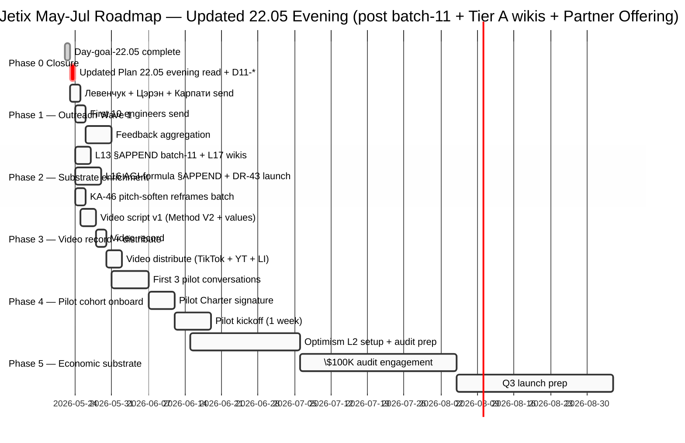

### Roadmap deltas batch-11 vs morning (specific updates)

1. **Day-goal-22.05 day closure** added (was placeholder — now actuals)
2. **Phase 1 outreach** now includes PARTNER-OFFERING-HUMAN-LANG link in package
3. **Phase 2 substrate enrichment** expanded — L17 + L16 + KA-46 new sub-tracks
4. **Phase 3 video** anchors on Method V2 + values-declaration narrative (audio_726 substrate)
5. **Phase 4 pilot** Welcome-frame R12-compatible communication primitive (audio_726 O-144) — operational style

---

## §5 Dependency map

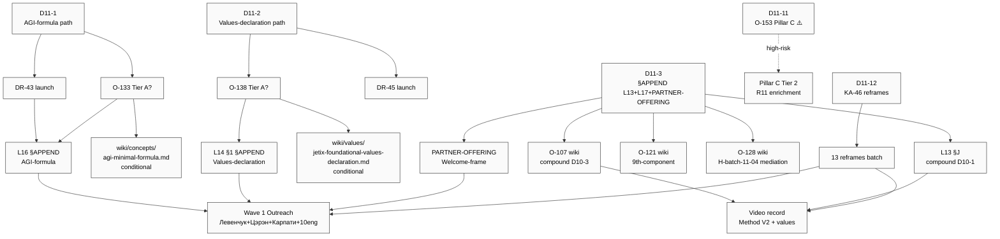

---

## §6 Risks update

### Closed risks batch-11

- **R-batch-10 (8 HR) — partial close:** substrate verbatim preserved; pitch-material reframes plan flagged KA-46; depends on D11-12 ack
- **R-batch-10-supp HR-3 «читерство по управлению» 3rd cheat-code-metaphor instance:** batch-11 NO new cheat-code surface; pattern «context-distinct preservation» discipline working

### Still active risks

- **R-D10-4 timeline AP-6** (URGENCY-MAX vs May-Jul baseline) — DEFERRED batch-10; not addressed batch-11
- **R-D10-9 Frankenstein label choice** — DEFERRED batch-10; not addressed batch-11
- **R-Foundation-build-Wave-1-execution:** Wave 1 outreach tomorrow — partner availability + responsiveness unknown

### NEW risks batch-11 (R-batch-11 N1-N13 — substrate verbatim preserved)

| ID | Voice trigger | Mitigation |
|---|---|---|
| **R-batch-11 N1** | audio_722 «вот мозги работают да-нет» binary-cognition reductionism risk | AP-6 voice self-flag «одна из гипотез» PRESENT; pitch-material reframe «hypothesis о fundamentals» |
| **R-batch-11 N5** | audio_726 «вот вам вся простая формула AGI» oversimplification vs deep AGI debates | AP-6 preserve voice declaration; DR-43 pool для external benchmarks |
| **R-batch-11 N6** | audio_726 «Русик в Берлине в трусах 22 мая» humorous self-deprecating frame | Powerful authenticity marker; substrate-OK; pitch adaptation needed by audience |
| **R-batch-11 N7** | audio_726 «welcome использовать интеллект» public-frame | R12 paired-frame compatible (voluntary opt-in + personal-responsibility «put in order first»); NO violation; OK |
| **R-batch-11 N8** | audio_726 profanity-laden voice | Substrate verbatim; pitch sanitised paraphrase mandatory |
| **R-batch-11 N12** | audio_728 «gate function» = Pillar C Tier 2 R11 constitutional rule candidate ⚠️ | DEEP ACK D11-11; default preserve substrate-only until deeper review |
| **R-batch-11 N3** | audio_725 dialectic с O-128 (intellect self-management vs external-system required) | H-batch-11-04 mediation thesis preserves both; resolution: intellect mediates internal-external feedback |

Pattern observation: **batch-11 voice = deep introspective philosophical articulation, NOT public-pitch material.** Pitch-soften discipline (KA-46) high-priority before any of this content reaches public-facing outreach.

---

## §7 READY-FOR-RUSLAN-ACK D11-* queue (11 items)

| ID | Decision | Priority | Action if ack-Y |
|---|---|---|---|
| **D11-1** ⭐⭐⭐ | O-133 AGI-formula Tier A path (a/b/c/d options) | P1 ⭐⭐⭐ | (a) NEW Tier A wiki + DR-43 launch / (b) §APPEND L16 + DR-43 / (c) Tier B pool only / (d) DR-43 immediate-launch isolated |
| **D11-2** ⭐⭐⭐ | O-138 Values-declaration Tier A path (a/b/c/d) | P1 ⭐⭐⭐ | (a) NEW wiki/values + DR-45 / (b) §APPEND L14 §1 + wiki/jetix-as-exokortex / (c) Tier B pool only / (d) Preserve «Русик» signature OR adapt by audience |
| **D11-3** | §APPEND L13 + L17 + PARTNER-OFFERING (compound D10-1/D10-3) | P1 | Cloud Cowork drafts shadow files; Ruslan promotes |
| **D11-4** | O-135/O-136 cognitive ontology pool disposition | P2 | Pool Tier B default OR §APPEND wikis OR DR-42 launch |
| **D11-5** | O-137/139-145 cognitive ontology cluster (7 items) | P2 | Pool Tier B default — any specific promotion? |
| **D11-6** | O-146/O-147 info-habit + Claude Code analogy | P2 | Pool default OR §APPEND wiki/mastery-formula |
| **D11-7** | O-148/O-149 recursive 3rd-order + direction-indifference | P2 | Pool default OR §APPEND L13 §J compound с O-132 |
| **D11-8** ⭐ | O-150 comparative species + DR-44 launch | P3 | DR-44 launch / Pool Tier B / L13 §M new traditions |
| **D11-9** ⭐ | O-151 concentration/exploration + DR-46 launch | P3 | DR-46 launch / Pool Tier B / L13 §J tuning |
| **D11-10** | O-152/O-154/O-155 epistemic compression cluster | P3 | Pool default OR §APPEND wiki/jetix-as-exokortex + wiki/all-is-information |
| **D11-11** ⚠️ | O-153 gate-function Pillar C constitutional review HIGH-RISK | P3-high-risk | (a) §APPEND R11 commentary / (b) NEW Tier 2 rule / (c) Pool only |
| **D11-12** | KA-46 pitch-soften 13 reframes batch | P2 | Cloud Cowork drafts 13 reframes (compound с KA-45 batch-10) |

---

## §8 Mermaid diagrams collection (11 total — gantt + dependency + 9 substrate maps)

### Diagram 1 — Substrate stack (sprint 20-22.05 architecture)

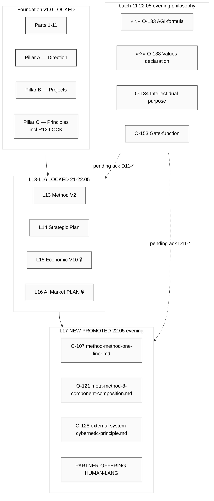

### Diagram 2 — AGI-formula thesis flow (audio_726)

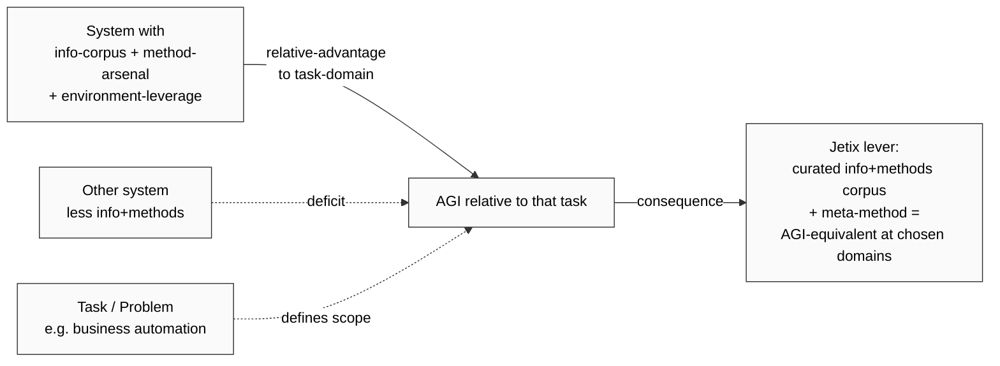

### Diagram 3 — Foundational-values declaration (audio_726)

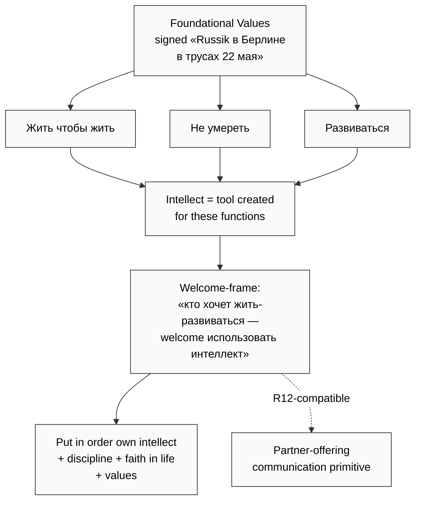

### Diagram 4 — Three-layer intellect composite (audio_728)

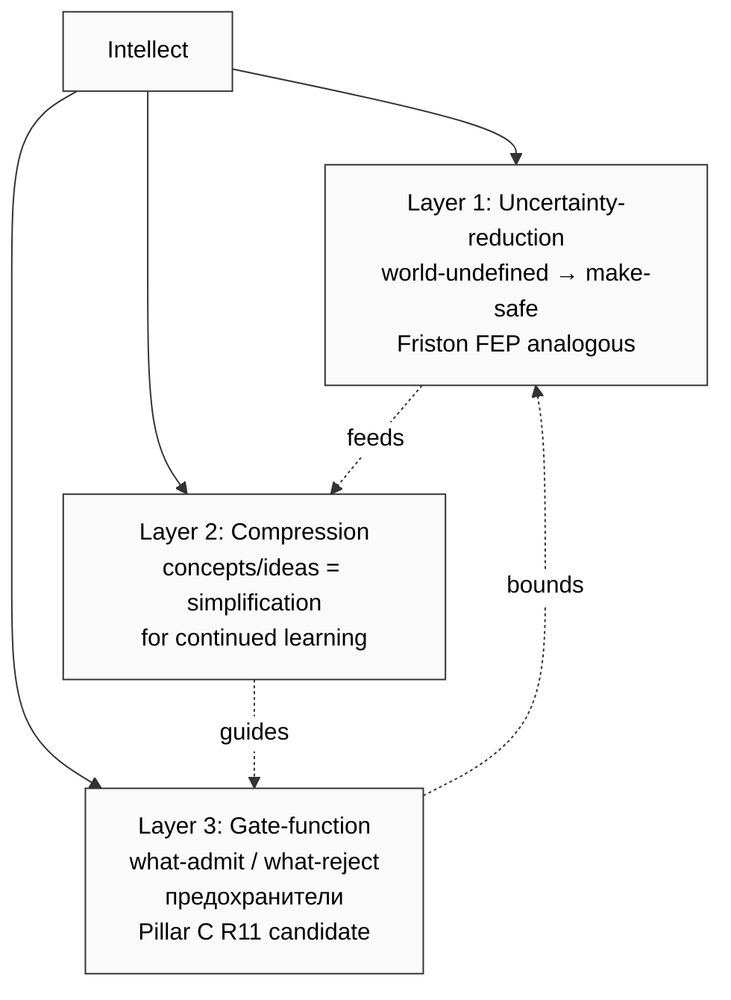

### Diagram 5 — Info→habit→automation cycle (audio_727)

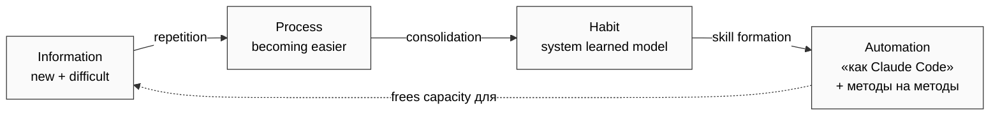

### Diagram 6 — 2-question fundamental orientation (audio_724)

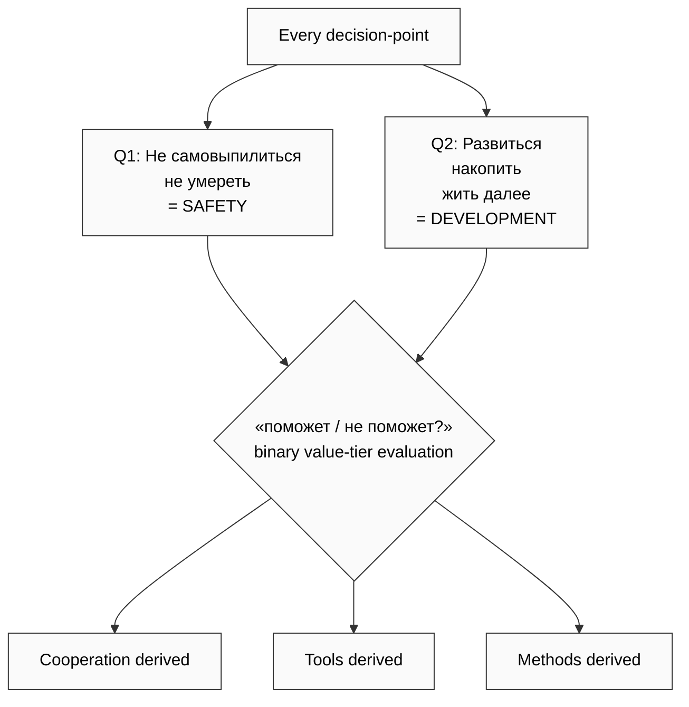

### Diagram 7 — Self-management dialectic (audio_725 + O-128 resolution H-batch-11-04)

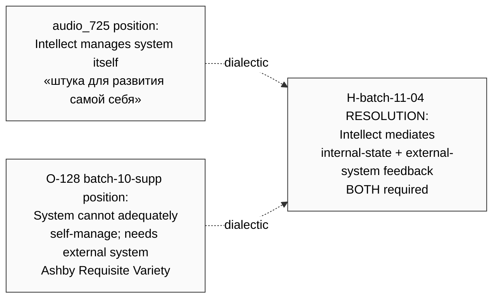

### Diagram 8 — Partner-offering communication primitive (audio_726 Welcome-frame)

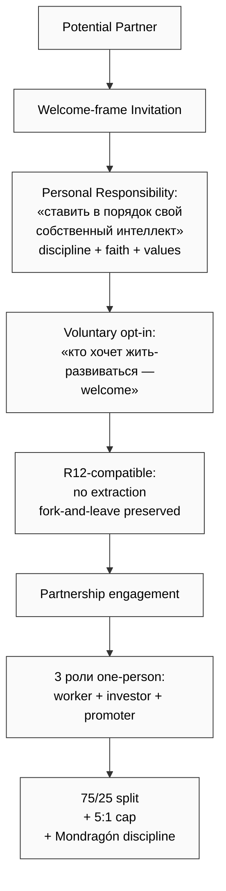

### Diagram 9 — Cognitive ontology stack (audio_722-724 base)

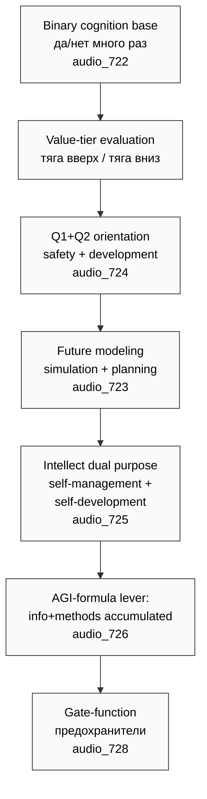

### Diagram 10 — Updated A-N roadmap state

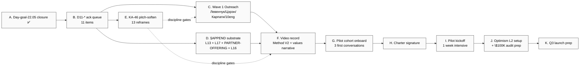

### Diagram 11 — Pool-pattern governance (cumulative state)

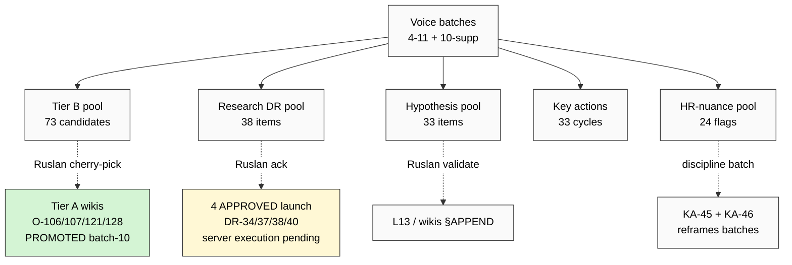

---

## §9 What's after Phase 7

### Phase 8 batch-11 — Summary closure (this run)

`reports/voice-pipeline-2026-05-22-batch-11/00-SUMMARY-FOR-RUSLAN.md` ≤1500w + final push origin main → batch-11 closure marker complete.

### Tomorrow (23.05 Saturday)

1. **Morning:** Ruslan reads этот Updated Plan + D11-* acks
2. **Mid-morning:** Wave 1 outreach send batch (Левенчук + Цэрэн + Карпати + first 10 engineers)
3. **Afternoon:** §APPEND substrate drafts (L13 / L17 / PARTNER-OFFERING / L16) — depends on D11-3 ack scope
4. **Evening:** KA-46 pitch-soften 13 reframes batch (if D11-12 acked); OR DR-43/44 launches (if D11-1/D11-8 acked)

### Next 3 days (24-26.05)

- Wave 1 feedback aggregation
- Video script v1 anchored on Method V2 + values-declaration narrative
- Pilot cohort first 3 conversation prep

### Next week (27.05 — 2.06)

- Video record + distribute (TikTok / YT / LI)
- Pilot Charter signature
- Pilot kickoff (1 week intensive)

### Q3 path (long-horizon — preserved L14/L15 LOCKED)

- Optimism L2 setup + $100K audit engagement
- Q3 LAUNCH per L15 LOCKED schedule

---

## §10 Constitutional posture summary

- **R1 surface only:** brigadier surfaces options + drafts; Ruslan = sole strategist
- **R2 LOCK preserved:** Foundation v1.0 / Pillar C / 8 Octagon LOCK / 5+3 concept docs Tier A / Method V2 / Strategic Plan / Economic V10 / AI Market PLAN / PARTNER-OFFERING structural primitives — read-only cross-cite только §APPEND voice substrate sections
- **R6 provenance:** [src: audio_NNN claim N] per claim
- **R11 Default-Deny:** SKIP-list O-62/66/67/68 + O-83 DROPPED honored — НЕ revived batch-11
- **R12 LOCK preserved verbatim:** Tier 2 12-rule (LOCKED 2026-05-12) + Option D Hybrid (LOCKED 2026-05-18); Welcome-frame audio_726 = R12-COMPATIBLE (voluntary opt-in)
- **IP-1 strict:** substrate = U.Episteme abstract; Ruslan = RUSLAN-LAYER instance
- **EP-5 F-grade explicit:** F2 verbatim / F2-F4 brigadier substrate per claim
- **AP-6 dissent preserved:** 5 explicit dialectical preservations (audio_725 vs O-128 / audio_727 direction-indifference vs O-128 / audio_728 concentration-trap vs batch-10 audio_716 / audio_726 AGI simplicity vs deep AGI / audio_724 Q1 safety vs Q2 development sometimes oppose)
- **Append-only:** new namespace batch-11 + this Updated Plan supersedes 22.05 morning supplement (morning preserved append-only)
- **Research-pool pattern:** DR-42..46 POOLED; NO auto-launch (DR-43 ⭐ recommended ack-launch but gated)
- **Acked-state preservation:** all 13 LOCKED items (V10/25%/$100K/Optimism/Q3/funding/O-83/O-106/O-107/O-121/O-128/R12/AI Market Stage 2/PARTNER-OFFERING structural) verified preserved batch-11; ✅ PASS

---

*Phase 7 closure 2026-05-22 evening. Per `feedback_max_density_max_tokens.md` — Phase 7 = primary value-add; max density applied (~3800w + 11 mermaid diagrams). Per `feedback_constitutional.md` R1 — brigadier surfaces, не resolves. Phase 8 Summary input ready.*
