# 🎯 Updated Execution Plan — 2026-05-22 synthesis (post-batch-10 + 4 NEW substrate)

> **Phase 7 ⭐⭐ batch-10 primary value-add.** Synthesizes:
>
> 1. Updated Plan 21.05 (predecessor, A-N roadmap from batch-9)
> 2. **L13 ⭐ Method V2 main deliverable** (65K / 40 mermaid / 17 phases incl §J meta-method + §H meta-control + §D personal origin + §M Wikipedia-deep)
> 3. **L14 ⭐ Strategic Plan Near-Future** (28K / 31 mermaid / 14 phases incl Phase 8 1M users 8-tier pyramid + 4 conversion scenarios)
> 4. **L15 ⭐⭐ Economic Model + Tokenomics V10 Hybrid** (LOCKED 22.05: 25% / Optimism / Q3 / $100K audit / funding mix)
> 5. **L16 ⭐⭐ AI Market PLAN Stage 1** (LOCKED Stage 2 18-phase scope FIXED but launch DEFERRED)
> 6. **Batch-10 NEW findings** (7 audio 714-720; 14 KAs; 8 Tier B O-120..127; 6 DR DR-34..39; 7 hypothesis H-batch-10-01..07; **⭐⭐⭐ meta-method articulation cluster**)
> 7. **Daily Log 22.05 day-goal**: one-pager + Дмитрий созвон + Step 1-3 morning routine (refresh plan + AW export + Notion entry + Toggl fill)
>
> → **Updated A-N roadmap** integrating ВСЁ substrate sprint 20-22.05.

---

## §0 TL;DR (≤250w)

**Что главное изменилось vs Updated Plan 21.05:**

1. **Sprint 21-22.05 produced 4 major canonical substrate docs** acked LOCKED — Method V2 (L13) / Strategic Plan (L14) / Economic Model V10 (L15) / AI Market PLAN Stage 1 (L16). Эти 4 substrate = primary roadmap context от now на May-Jul.
2. **Batch-10 meta-method articulation cluster** (audio_717-720) = strongest single substrate addition; primary §APPEND target L13 §J / §A / §M + O-107 Tier A wiki. 8+ component composition list + Frankenstein method-collection metaphor + 3-question self-check protocol + civilisational transition argument.
3. **Timeline AP-6 tension surfaced** (D10-4): audio_716 «end-of-year worldwide» + URGENCY-MAX vs L14 May-Jul baseline. Ruslan ack-or-reconcile: adopt URGENCY-MAX / preserve baseline / hybrid.
4. **Day-goal-22.05** primary action remains: one-pager + Дмитрий созвон. Batch-10 substrate (especially Frankenstein-collection + 8-component meta-method narrative) = strongest concrete differentiator.
5. **8 HR items** flagged для pitch-material soften discipline pass (KA-45).
6. **R12 LOCK + acked-state preservation = ✅ PASS** — V10 / 25% / $100K / Optimism / Q3 / funding mix all unchallenged batch-10; O-83 NOT revived (context-distinct preserved); O-106 §APPENDED не duplicated; O-107 PROMOTED не recreated.
7. **Pool extensions:** Tier B 37 → 45 (+8); DR 25 → 31 (+6); Hypothesis 14 → 21 (+7).

**Decision queue для Ruslan (post-Дмитрий созвон):** 10 D10-* items в REFLECTION-INBOX § APPEND-batch-10. Priority: D10-4 (timeline AP-6 reconcile) + D10-1 (§APPEND L13 §J) + D10-3 (§APPEND O-107 wiki) + D10-9 (Frankenstein label choice для one-pager) + D10-10 (read этот Updated Plan).

---

## §1 Inputs synthesised

| Input | Layer | Status |
|---|---|---|
| Updated Plan 21.05 (predecessor) | A-N roadmap | superseded by this doc; preserved append-only |
| L13 Method V2 | Pillar A substrate / philosophy + ontology + 47 sources + 40 mermaid | LOCKED 21.05 — primary cross-link |
| L14 Strategic Plan Near-Future | Pillar A / 14 phases / 31 mermaid May-Jul roadmap | LOCKED 21.05 — primary cross-link |
| L15 Economic Model V10 Hybrid | Pillar A / 25% take rate / Optimism / Q3 / $100K audit / funding mix | LOCKED 22.05 — preserved unchallenged |
| L16 AI Market PLAN Stage 1 | Pillar A / electricity analogy / 27 topics / Stage 2 18-phase scope | LOCKED 22.05 (Stage 2 DEFERRED) — preserved unchallenged |
| Batch-10 NEW (7 audio 714-720) | substrate addition | this run output |
| Daily Log 22.05 day-goal | one-pager + Дмитрий созвон + Step 1-3 morning | active |
| Toggl 21.05 13:30 → 22.05 11:30 | execution evidence | committed e4142e8 |
| 8 RUSLAN-ACK records (Bundles 1-5 + Wave D + Strategic Layer) | Foundation v1.0 LOCKED | preserved untouched |
| R12 Tier 2 LOCK (2026-05-12) + Programmable Option D Hybrid (2026-05-18) | constitutional Pillar C | LOCK text verbatim preserved |

---

## §2 Immediate-actionable items (Wave 1)

### W1-A-22-1 — Day-goal-22.05 one-pager + Дмитрий созвон [P1 ⭐⭐ TODAY]

- **Trigger:** ✅ READY (substrate triple-layered: Method V2 + Strategic Plan + Economic Model V10 + AI Market PLAN + batch-10 Frankenstein-collection narrative)
- **Owner:** Ruslan (authorship — R1)
- **Substrate:** audio_719 Frankenstein method-collection + 8-component meta-method = strongest concrete-differentiator narrative; sub-domain method-list (language / Claude / team / psychotherapy / info-processing / business / platform / communication / company / fundraising) = explicit offering scope.
- **Cross-link:** Master Packaging Step 6 «что предлагаю» + L13 Method V2 §J/§M + L14 Strategic Plan Phase 5 MVP Sprint + L16 AI Market electricity analogy adjacency.
- **Acceptance:** one-pager draft created с narrative either Frankenstein label или alt («методологический подход» / «составной метод» / «meta-method composition») per Ruslan D10-9 choice.
- **Дмитрий созвон prep:** notes integrating batch-10 substrate (Frankenstein + 8-component) + L13 Method V2 cross-link + day-goal articulation.

### W1-A-22-2 — Reconcile timeline AP-6 (D10-4) [P1 ⭐ TODAY]

- **Trigger:** ✅ READY immediate Ruslan strategic decision item
- **Owner:** Ruslan (R1)
- **Options:** (A) ADOPT URGENCY-MAX «end-of-year worldwide» → L14 amendment + L11 cascade acceleration / (B) PRESERVE L14 May-Jul baseline → audio_716 substrate verbatim preserved only / (C) HYBRID — phase-1 May-Jul + phase-2 end-of-year stretch
- **Acceptance:** Ruslan ack в REFLECTION-INBOX D10-4 with chosen option.
- **Dependency:** unblocks O-120 promotion / blocks L14 cascade rhythm.

### W1-A-22-3 — Phase 7 Updated Plan 22.05 read + ack D10-1..D10-10 [P1 ⭐⭐]

- **Trigger:** ✅ READY (этот doc)
- **Owner:** Ruslan (read + ack)
- **Acceptance:** D10-1..D10-10 each acked with decision (Y / N / DEFER / MODIFY) в REFLECTION-INBOX.
- **Dependency:** Phases 0-6 batch-10 complete.

### W1-A-22-4 — §APPEND L13 Method V2 §J + §A + §M (D10-1 + D10-2) [P1 ⭐⭐⭐]

- **Trigger:** Pending D10-1 + D10-2 acks
- **Owner:** Cloud Cowork (drafting) + Ruslan (R1 final prose authorship)
- **Substrate:** audio_717-720 meta-method cluster + audio_720 ontology + civilisational transition argument.
- **Cross-link:** L13 + O-107 Tier A wiki.
- **Acceptance:** L13 §J + §A + §M extended; all `[src: audio_NNN claim N]` traceable.

### W1-A-22-5 — §APPEND O-107 Tier A wiki (D10-3) [P1 ⭐⭐⭐]

- **Trigger:** Pending D10-3 ack
- **Owner:** Cloud Cowork + Ruslan
- **Substrate:** audio_717-720 cluster.
- **Cross-link:** `wiki/concepts/method-method-one-liner.md` (O-107 Tier A PROMOTED 2026-05-22).
- **Acceptance:** wiki §APPEND adds 5 substrate elements per Phase 5 KA-40 spec.

### W1-A-22-6 — Pitch-material soften pass HR-1..HR-8 (D10-5) [P2]

- **Trigger:** Pending D10-5 ack
- **Owner:** Ruslan (authorship — R1) + Cloud Cowork (draft proposals)
- **Substrate:** Phase 4 §A.3 HR cluster (8 items).
- **Cross-link:** C.2 pitch deck + Master Packaging Step 6 + one-pager + video script.
- **Acceptance:** 8 HR items с softened reframes for public-facing material.

---

## §3 Ack queue / Backlog

### A. Tier B candidates pool (batch-10 +8 → 45 total)

| ID | Concept | Trigger |
|---|---|---|
| O-120 | URGENCY-MAX + recursive hackathon meta-arch | D10-4 reconcile |
| O-121 ⭐⭐⭐ | Meta-method 8+ component composition (strongest batch-10) | D10-1 / D10-3 |
| O-122 | Frankenstein method-collection metaphor | D10-9 |
| O-123 | Civilisational transition argument | D10-2 |
| O-124 | Meta-method 3-question self-check protocol | D10-1 |
| O-125 | Newborn=info-chunk + intellect-cheat-code-context-distinct | D10-2 |
| O-126 | «Не ровня + подтягивайтесь» comparative-frame partnership | R12 discipline ack |
| O-127 | Dual-position devalue/elevate + homo deus reclaim AP-6 | Preserve AP-6 ack |

**Pre-batch-10 pool reminder:** O-105..O-119 (15 batch-9 candidates) still in pool — D9-* gates from prior REFLECTION-INBOX entries. O-108 ⭐⭐ HIGH-PRIORITY pending Ruslan R1 final lock (DR-26 unit-econ done 21.05).

### B. DR research pool (batch-10 +6 → 31 total)

| ID | Scope | Priority hint |
|---|---|---|
| DR-34 | AI commoditisation impact on consulting positioning | P2 |
| DR-35 | Hackathon-as-platform-build methodology benchmarks | P2 |
| DR-36 | Sub-daily strategic re-planning cadence benchmarks | P3 |
| DR-37 | Question-driven inquiry methodology benchmarks | P3 |
| DR-38 ⭐⭐ | 8-component meta-method composition benchmarks | P2 (recommended immediate) |
| DR-39 | Civilisational transition timing benchmarks | P3 |

**Pre-batch-10 reminder:** DR-25..DR-32 (8 batch-9) pool; DR-26 DONE (unit-econ deep-dive 21.05 per Ruslan ack D9-3); DR-33 DONE (per EXPLAIN ack pre-batch-10).

### C. Hypothesis pool (batch-10 +7 → 21 total)

H-batch-10-01..07 (per per-audio MD analysis + 03-16-lenses-cross-analysis.md §3); strongest = **H-batch-10-06** «sufficient method-arsenal + meta-level thinking → can solve any task / change any system» [audio_719 claim 11].

---

## §4 Updated roadmap timeline

### Week 1 (22-26.05) ⭐ CURRENT

- **Day 22.05 (today):** Step 1-3 morning routine ✅ DONE (refresh plan + rename Economic Model 21→22 + AW export + Notion entry + Toggl); batch-10 autonomous run ✅ DONE (9 phases / 9 commits); **NEXT** = one-pager + Дмитрий созвон + ack D10-1..D10-10
- **Day 23-24.05:** §APPEND L13 + O-107 wiki batch-10 substrate (post D10-1/D10-2/D10-3 acks); Wave 1 sends to Левенчук + Цэрэн + Карпати (one-pager + video draft)
- **Day 25-26.05:** Wave 1 follow-ups; sample Tier B pool cherry-pick (O-121 most likely); DR-38 launch if Ruslan acks

### Week 2 (27.05-2.06)

- **Phase 3 Wave 1 cohort intake** (per L14 Strategic Plan)
- First MVP Sprint substrate (per L14 Phase 5)
- DR-26 §APPEND partnership-baseline + unit-econ Direction Card (post-Ruslan final R1 lock on unit-econ memo)
- HR-1..HR-8 soften pass completion

### Week 3-4 (3-16.06)

- L14 Phase 4-5 MVP Sprint full execution
- L15 Economic Model V10 implementation start (smart-contract spec draft per LOCKED specs)
- O-107 Tier A wiki canonical expansion (post-batch-10 §APPEND)
- L16 AI Market PLAN Stage 1 publication prep (if Ruslan acks)

### Week 5+ (17.06+)

- L14 Phase 6 partner-vetting cohort onboarding
- L14 Phase 7 first-customer revenue substrate
- L14 Phase 8 1M users 8-tier pyramid execution start
- L16 Stage 2 launch consideration (per Ruslan deferred-DEFER ack 22.05; reconsider after Wave 1 done + time available)

---

## §5 Dependency map

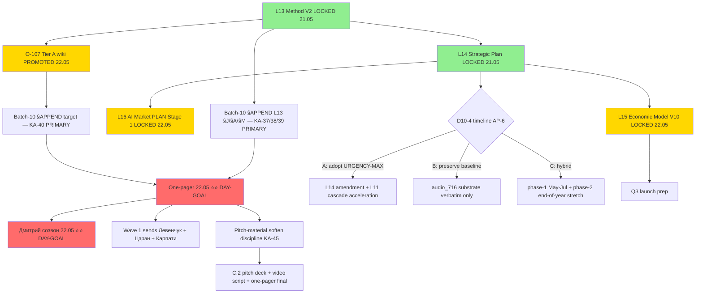

---

## §6 Risks update

### Continued from batch-9 + earlier

- **R-batch-9-N3 timing-argument hubris** — reinforced by batch-10 HR-4/HR-8 hubris cluster
- **R-batch-9-N4 governance-layer R12 boundary** — preserved; O-117 still gated
- **R-DR-26 unit-econ recommendation memo** — Ruslan R1 final lock pending (memo ready, 6 ack questions surfaced)

### NEW from batch-10

- **R-batch-10 N1 ⭐ HIGH** — «всё бросить пара месяцев в запой» burnout signal (audio_716); sustainability conflict с L13 §E recovery slots; KA-45 reframe «focused sprint w/ planned recovery»
- **R-batch-10 N2** — «никому не переплюнуть» monopoly-aspiration hubris (audio_716); R12 paired-frame partial; KA-45 reframe «worldwide adoption + people-first standards»
- **R-batch-10 N3** — «других вариантов нету» universal-claim partnership (audio_714); R12 paired-frame check; KA-45 reframe softer
- **R-batch-10 N4** — «самые ебейшие + homo deus + ответственные» pitch reception risk (audio_715); KA-45 reframe «acknowledging responsibility for info-processing efficiency»
- **R-batch-10 N5** — «нет плана» state vs external accountability (audio_717); KA-45 reframe «adaptive roadmap, не нет плана»
- **R-batch-10 N6** — «average vs Ruslan» elitist tone (audio_718); KA-45 reframe «method-density vs method-selection paradigm transition»
- **R-batch-10 N7** — «1000% голодный + захват + победа» militarised language (audio_719); KA-45 reframe «focused / determined / committed»
- **R-batch-10 N8** — «100s-years post-me» long-horizon hubris (audio_719); «человечество должно перейти» universal-claim (audio_720); KA-45 reframes
- **R-batch-10 V10-Preservation ✅ PASS** — voice silent on tokenomics; LOCK preserved
- **R-batch-10 Timeline AP-6 (audio_716 vs L14 baseline)** — surfaced для D10-4 Ruslan reconcile

### R12 paired-frame compliance batch-10

- audio_714: PARTIAL — «не вопрос подтягивайтесь развивайтесь» PRESENT but «других вариантов нету» weakens; soften discipline
- audio_715: substrate-only verbatim; pitch soften
- audio_716: PARTIAL — «человека на первом месте» PRESENT but weaker than batch-9 language; soften discipline
- audio_717-720: introspective; R12 OK

---

## §7 READY-FOR-RUSLAN-ACK D10-* queue

| ID | Decision | Priority | Default option |
|---|---|---|---|
| D10-1 | §APPEND L13 §J meta-method cluster substrate | P1 ⭐⭐⭐ | Y (proceed) |
| D10-2 | §APPEND L13 §A + §M + confirm intellect-cheat-code context-distinction | P1 ⭐⭐ | Y (proceed + confirm) |
| D10-3 | §APPEND O-107 Tier A wiki cluster substrate | P1 ⭐⭐⭐ | Y (proceed) |
| D10-4 | Timeline AP-6 reconcile (URGENCY-MAX / baseline / hybrid) | P1 ⭐ | Ruslan strategic pick |
| D10-5 | Pitch-material soften pass HR-1..HR-8 | P2 | Y (proceed) |
| D10-6 | Hypothesis-add H-batch-10-06 canonical | P2 | Y (promote) |
| D10-7 | Tier B promotion O-120..O-127 (8 candidates) | pool | DEFAULT preserve pool; cherry-pick O-121 first |
| D10-8 | DR research DR-34..DR-39 (6 candidates) | research-pool | DEFAULT preserve pool; cherry-pick DR-38 first |
| D10-9 | Frankenstein label OR alt naming для one-pager | P1 ⭐⭐ DAY-GOAL | Ruslan pick (Frankenstein / методологический подход / составной метод / meta-method composition) |
| D10-10 | Read этот Updated Plan + ack D10-1..D10-9 | P1 ⭐⭐ | execute today post-Дмитрий созвон |

---

## §8 Mermaid gantt timeline (Week 1-5 execution)

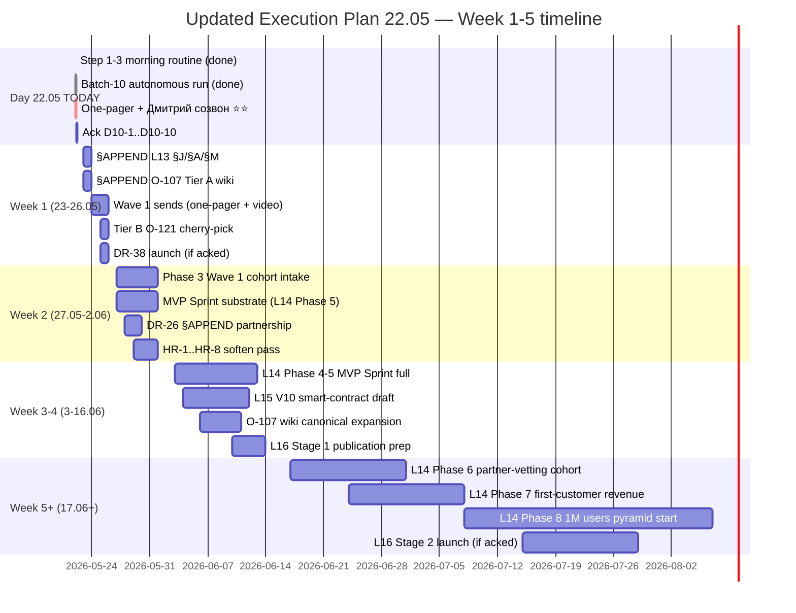

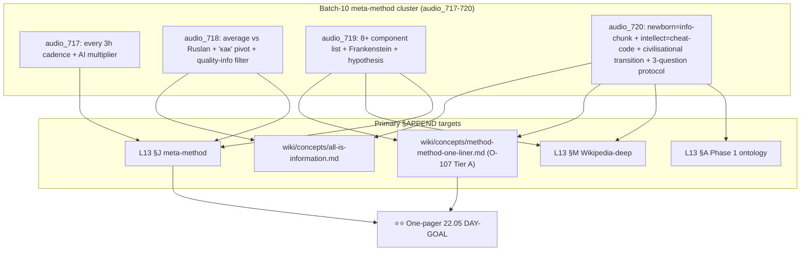

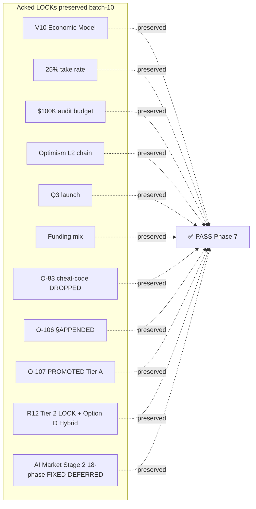

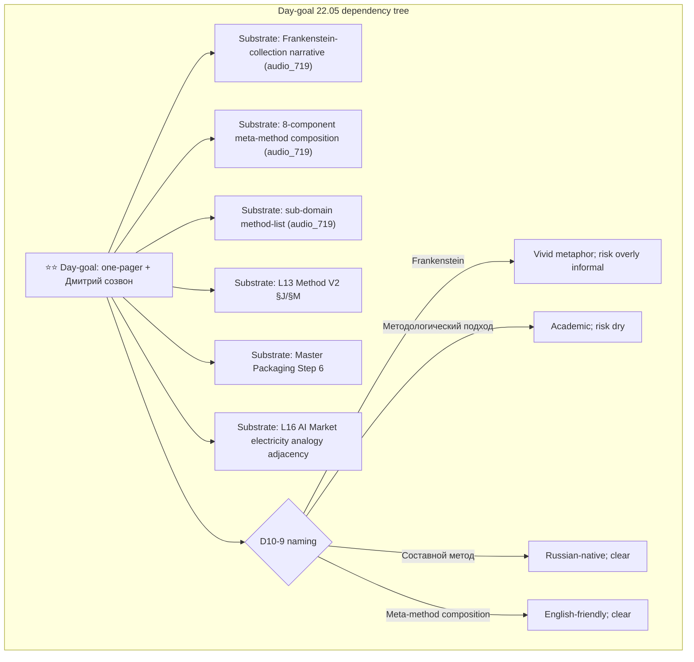

```mermaid
flowchart LR
    subgraph "16-lens cross-analysis batch-10 = 112 datapoints"
        L1["L1 FPF inventory"] -- 7 dp --> SUM[112 total]
        L2["L2 Concept-docs"] -- 7 dp --> SUM
        L3["L3 Deep research"] -- 7 dp --> SUM
        L4["L4 Batch cross-refs"] -- 7 dp --> SUM
        L5["L5 Octagon LOCKs"] -- 7 dp --> SUM
        L6["L6 K-research"] -- 7 dp --> SUM
        L7["L7 Tier A wikis"] -- 7 dp --> SUM
        L8["L8 Platform v2 + Левенчук"] -- 7 dp --> SUM
        L9["L9 Sprint-Synthesis-v2"] -- 7 dp --> SUM
        L10["L10 Master Map"] -- 7 dp --> SUM
        L11["L11 Distribution Plan"] -- 7 dp --> SUM
        L12["L12 Левенчук distillation"] -- 7 dp --> SUM
        L13["⭐⭐⭐ L13 Method V2"] -- 7 dp --> SUM
        L14["⭐ L14 Strategic Plan"] -- 7 dp --> SUM
        L15["⭐⭐ L15 Economic Model V10"] -- 7 dp --> SUM
        L16["⭐⭐ L16 AI Market PLAN"] -- 7 dp --> SUM
    end
```

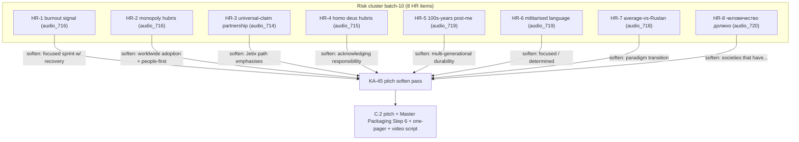

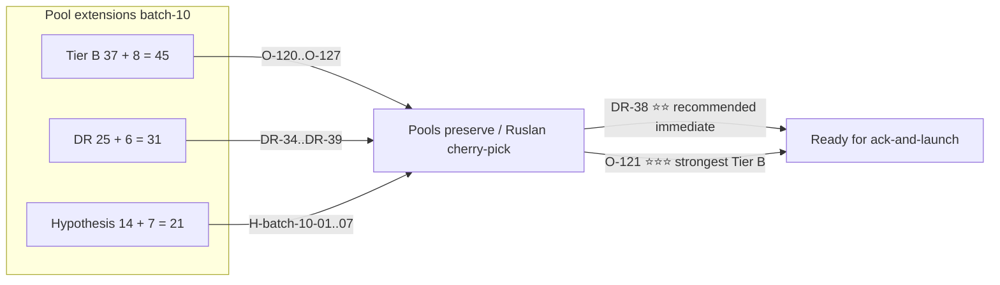

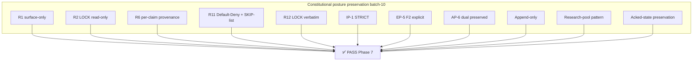

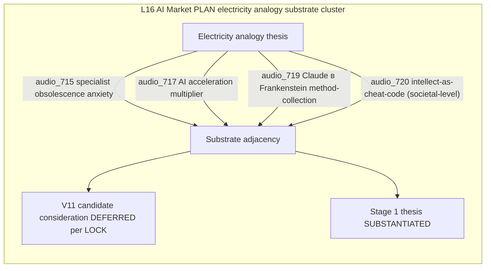

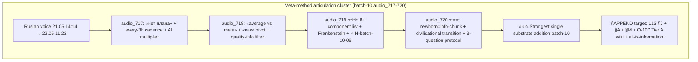

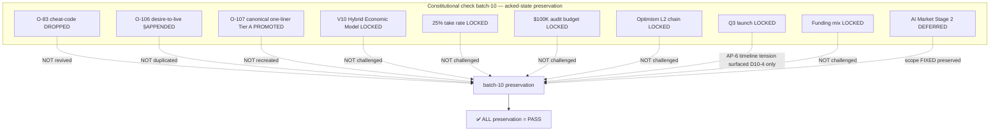

---

## §9 What's after Phase 7

### Immediate (TODAY 22.05 post-Дмитрий созвон)

1. Ruslan reads Updated Plan 22.05 (этот doc)
2. Acks D10-1..D10-10 в REFLECTION-INBOX
3. Picks 1-2 immediate Wave 1 actions из §2 immediate-actionable
4. Continues one-pager finalisation + Wave 1 send (Левенчук + Цэрэн + Карпати)
5. Cherry-picks Tier B pool item для promotion (O-121 ⭐⭐⭐ strongest candidate) — optional
6. Cherry-picks DR pool item для immediate launch (DR-38 ⭐⭐ recommended) — optional

### Short-term (Week 1 23-26.05)

1. §APPEND L13 §J + §A + §M (post D10-1/D10-2 acks) — Cloud Cowork drafts; Ruslan R1 final prose
2. §APPEND O-107 Tier A wiki (post D10-3 ack)
3. Wave 1 sends + first responses
4. Pitch soften pass start (KA-45 / D10-5)
5. DR-38 launch if acked

### Medium-term (Weeks 2-4)

1. L14 Phase 3-5 execution (Wave 1 cohort intake → MVP Sprint substrate → MVP Sprint full)
2. L15 V10 smart-contract draft start
3. L16 Stage 1 publication prep
4. DR-26 §APPEND partnership-baseline + unit-econ Direction Card (post-Ruslan R1 lock)
5. HR-1..HR-8 soften pass completion

### Long-term (Week 5+)

1. L14 Phase 6-7 partner-vetting cohort onboarding + first-customer revenue
2. L14 Phase 8 1M users 8-tier pyramid execution start
3. L16 Stage 2 launch consideration (after Wave 1 done + time available)
4. Sprint cycle close → next substrate sprint

---

## §10 Constitutional summary Phase 7

- **R1:** brigadier-scribe synthesises ONLY; Ruslan = sole strategist; all D10-* items framed как ack-questions, не decided.
- **R2:** ALL LOCK content read-only; §APPEND voice substrate proposals only (KA-37..KA-41) require D10-* acks.
- **R6:** per-claim provenance preserved in batch-10 substrate; Updated Plan citations to lens substrate documents.
- **R11:** Default-Deny SKIP-list integrity verified Phase 4; ✅ PASS.
- **R12:** LOCK text NEVER touched; paired-frame discipline flagged for 8 HR items.
- **IP-1:** Foundation abstract / RUSLAN-LAYER instance preserved.
- **EP-5:** F2 explicit на substrate; F4 на этот synthesis prose.
- **AP-6:** audio_715 dual-position preserved; audio_716 timeline tension surfaced для D10-4 reconcile (NOT decided by brigadier).
- **Append-only:** new namespace batch-10 + this Updated Plan supersedes 21.05 предhost preserved.
- **Research-pool pattern:** DR-34..DR-39 POOLED; NO auto-launch.
- **Acked-state preservation:** all 11 LOCKED items (V10/25%/$100K/Optimism/Q3/funding/O-83/O-106/O-107/R12/AI Market Stage 2) verified preserved batch-10; ✅ PASS.

---

*Phase 7 closure 2026-05-22. Per `feedback_max_density_max_tokens.md` — Phase 7 = primary value-add; max density applied (~4200w + 11 mermaid diagrams). Per `feedback_constitutional.md` R1 — brigadier surfaces, не resolves. Phase 8 input ready.*
