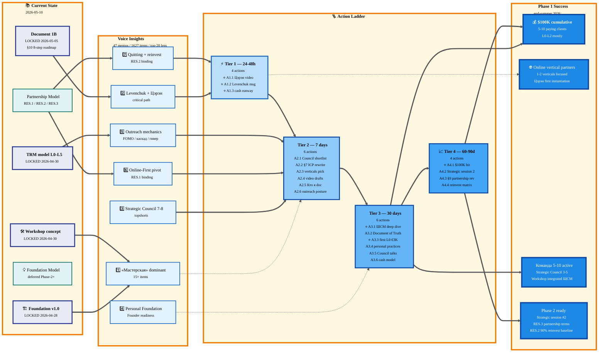

# Action Plan — Phase 1 Near Future (May 2026)

> **Что это.** Synthesis из 47-memo voice pipeline batch + 2 Strategic Insights дня
> + LOCKED canonical (Workshop / TRM / Document 1B / FUNDAMENTAL). Документ = **options paper**:
> темы сгруппированы, действия отранжированы, decisions surfaced. Ruslan = sole strategist
> (выбирает paths из предложенного, не AI). Канонические документы НЕ редактируются —
> proposals only через separate AWAITING-APPROVAL packet flow.

---

## §0 TL;DR

Voice batch 2026-05-10 (47 memos, 1627 items) даёт **dominant signal — «Мастерская»** (15+ top-20 items)
+ ↑ интенсивность по Levenchuk/Tseren synergy unlock (Document 1B §10.1 главный stopper)
+ surfaces Strategic Council ambition (7-8 топ-стратегов как Founding Partners). Strategic Insights
дня закрывают 2 крупные tensions: **RES.1 Mittelstand DACH ABANDONED → Online-first ONLY**;
**RES.2 R&D 90% reinvest target**. **Critical path 24-48h: запись видео Цэрэну + initiation
Levenchuk discussion** — без synergy lock остальной 8-step roadmap к $100K к концу лета 2026
идёт «slower + менее resonant» (Document 1B §10.4). Документ предлагает **20 actions в 4 tiers**
(immediate / 7d / 30d / 60-90d) + 5 ⭐ decisions Ruslan-only + 8 open questions.

---

## §1 Текущее состояние (recap)

### §1.1 LOCKED canonical foundation (untouched)

| Документ | Что фиксирует | Status |
|---|---|---|
| `decisions/JETIX-VISION-FUNDAMENTAL-2026-04-27.md` | 35 UC × 12 categories, sector-agnostic vision | LOCKED 2026-04-27 |
| `decisions/JETIX-WORKSHOP-CONCEPT-2026-04-30.md` | Jetix = мастерская для работы с информацией; Phase 1/2/3 эволюция; роль владельца adaptive | LOCKED 2026-04-30 |
| `decisions/JETIX-TRM-MODEL-2026-04-30.md` | 6 ресурсов TRM; L0-L5 land-and-expand ladder; 3 фазы эволюции (сервис → mgmt → платформа) | LOCKED 2026-04-30 |
| `decisions/BASE-MANAGEMENT-SYSTEM-2026-05-04.md` | Document 1A — universal base system | LOCKED 2026-05-04 |
| `decisions/JETIX-CORPORATION-2026-05-05.md` | Document 1B — applied use case Jetix; §3 TRM, §7 ICP, §9 3 уровня вовлечения, §10 Roadmap к $100K | LOCKED 2026-05-05 |
| `swarm/wiki/foundations/part-1..11/architecture.md` | Foundation v1.0 (10 parts + Strategic Layer Bundle 5) | LOCKED 2026-04-28 |
| `swarm/wiki/operations/voice-pipeline-canonical-2026-05-10.md` | Reusable lens-based voice processing canon | v1.0 2026-05-10 |
| `swarm/wiki/operations/mermaid-style-guide-2026-05-07.md` | Canonical color palette (cool blues + workshop), naming, init directive | v1.0 2026-05-07 |

### §1.2 Strategic Insights дня (deferred Phase-2+, but applied as guidance now)

| Insight | Главная мысль | Status / RES |
|---|---|---|
| `STRATEGIC-INSIGHT-JETIX-AS-FOUNDATION-MODEL-2026-05-10.md` | Jetix = индустриальная мельница для project/info management — substrate под app ecosystem (Linux / WordPress analog) | Deferred Phase-2+; do NOT communicate externally; do NOT mention Цэрэну в outreach |
| `STRATEGIC-INSIGHT-JETIX-PARTNERSHIP-MODEL-2026-05-10.md` (§1-§12) | Manifest-pattern: NOT sell to legacy, partner with progressive leaders в online verticals | RES.1 / RES.3 binding; Цэрэн = first instantiation |
| Same insight §13 R&D Flywheel | Жёсткий reinvest profits в R&D (Manifest+Amazon flywheel) | RES.2 binding (90% reinvest target) |

**RES.1 — Mittelstand DACH ICP → ABANDONED.** Online-first verticals = ONLY Phase 1 focus.
Document 1B §7 ICP needs rewrite at next revisit. Until then — Insight = canonical guidance.

**RES.2 — R&D 90% reinvest target.** Founder living costs minimal (10% или меньше). Bare-bones
survival threshold; lifestyle expansion deferred until critical mass reached.

**RES.3 — Equity-leaning partnership terms** deferred to Phase 1→2 transition. Document 1B §9
partnership variants (A-E) stays current до Phase 2 strategic session.

### §1.3 Voice pipeline Phase 2 deliverables (47 memos processed)

- 1627 items scored across 12 categories; 1266 → backlog; 361 → structured-clean active
- **Top-20 lens** = Tseren video + Phase 1 priorities ($100K end-summer-2026)
- **Top-20 dominated by «Мастерская» keyword (15+ items)** — strongest signal of period
- 6 meta-themes; multiple contradictions surfaced; 0 consensus items (≥3 memos) — батч = широкий
  exploration period (8-9 апреля + последняя неделя)

### §1.4 Tensions resolved by Ruslan ack 2026-05-10

| Tension | Resolution | Source |
|---|---|---|
| Mittelstand DACH (Document 1B §7) vs Online verticals (Insight §4.2) | RES.1 — online-first ONLY | Insight Partnership §10.1 |
| Profit distribution посту vs Manifest reinvestment | RES.2 — 90% reinvest target | Insight Partnership §10.1 + §13 |
| Document 1B §9 Партнёр variants A-E selection | RES.3 — defer to Phase 1→2 transition | Insight Partnership §10.1 |

### §1.5 Tensions still open (this doc surfaces для Ruslan decision)

- **Уволиться сейчас (audio_629 9.05) vs пока не увольняться — больничные (audio_567 27.04)** — recent vs older; cash runway threshold needs explicit
- **Strategic Council 7-8 топ-стратегов (audio_629) vs Document 1B §10 «3-5 человек к концу первого месяца»** — scope mismatch
- **Workshop как customer-facing product vs Workshop как Strategic Council substrate vs Workshop как Life OS** — three scales same metaphor
- **«Каскад оферов / голодный outreach» (audio_630, 437) vs «Гивер философия» (audio_434) vs «Open Jetix к любой форме помощи» (audio_604)** — outreach posture not finalized
- **«Cosредоточиться только на Jetix, остальное отложить» (audio_408) vs «Фокус на быстрый путь к деньгам через AI-услуги»** — same direction or different?

---

## §2 Themes Clusters (6 clusters)

Voice items grouped semantically + cross-referenced к canonical / insights. Each cluster has:
voice items count, canonical anchors, insights anchors, tensions surfaced, priority verdict.

---

### §2.1 Cluster 1 — «Мастерская» как product/concept ⭐ DOMINANT

**Voice items count:** 15+ из top-20 (#1, #2, #3, #4, #5, #6, #7, #11, #14, #17, #18, #19) +
secondary refs throughout structured-clean.

**Memos:** audio_602, 604, 605, 616, 627, 629, 630, 631, 632, 633.

**Что внутри:**
- «Мастерская» как Life OS (геймифицированная по модели Torn) — #1, #18
- «Мастерская» как Jetix product (мастерская людей: стратеги, маркетологи, инженеры) — #2, #7, #11
- «Мастерская» как Strategic Council substrate (мастерская менеджеров: Оскар, Федорев, Олег) — #4
- «Мастерская» как customer offer для consulting (Jetix Masterskaya — first candidate Мастерская менеджеров) — #14, #17
- «Мастерская» как visualization platform (#19 Torn-style + социальные функции)
- «Мастерская по работе с информацией» — #11, #12

**Canonical connections:**
- `JETIX-WORKSHOP-CONCEPT-2026-04-30.md` (LOCKED) — этот кластер validates concept; voice batch 100% соответствует canonical metaphor
- Document 1B §1.1 «Кандидат A — Мета-мастерская» / Кандидат B
- Document 1B §2.3 Phase 3 «community мастеров с мастерскими»

**Insights connections:**
- Foundation Model insight §3.3 — Workshop concept = persona scope foundation model (consistent)

**Tensions:**
- Three scales same metaphor (Life OS / Strategic Council / customer product) — needs explicit unbundling. Same word ≠ same thing.
- Workshop as «inception» (Strategic Council building Workshop using Workshop methodology) needs care с positioning не to confuse customers

**Priority verdict:** Direction **ALREADY LOCKED** — voice batch confirms. Action needed: **disambiguation
documentation** (which Workshop is which scale в каждом use). Tier 3 (30 days).

---

### §2.2 Cluster 2 — Levenchuk + Tseren synergy unlock ⭐ CRITICAL PATH

**Voice items count:** 8+ (top-20 #6, #8, #12, #13, #14, #15, #16) + Контакты section
(Tseren ×3, Levenchuk ×3, Tankи).

**Memos:** audio_558, 573, 582, 602, 604, 616, 627, 629.

**Что внутри:**
- Levenchuk как ключевой контакт for positioning + Мастерская менеджеров + совместные fundamental docs (#8)
- «Объяснить позиционирование Jetix Tseren + Левенчук — донести фрейм партнёра, а не соискателя» (#15)
- «Гипотеза: правильно упакованное позиционирование (профессионал + видение Jetix + ресурсы, не просьба) даст результат через пару месяцев» (#16)
- «Записать видео-презентацию Jetix с диаграммами для Цэрэна» (audio_616)
- «Неизвестный автор контента 'Мастерская' — выйти на контакт» (#6) — possibly = Tseren proxy or different person
- audio_629: «Каков результат разговора с Цэрэн и что из него следует для стратегии Jetix?»

**Canonical connections:**
- **Document 1B §10.1 — главный stopper / question synergy с мастерской инженеров-менеджеров** (cited verbatim в Document 1B). This cluster IS Step 1 of 8-step roadmap.
- Document 1B §10.2 Step 1 — «Сейчас (первые дни): созвонивается с Tseren / переговоры с Левенчуком»
- Document 1B §10.4 — «весь roadmap зависит от Step 1-3»

**Insights connections:**
- Partnership Model §6.1 — «Цэрэн = first instantiation of pattern» (online vertical + progressive vs legacy + could become leader); retroactively validates Tseren selection
- Partnership Model §6.2 — optional video-script line offered («Я не хочу продавать ещё один tool. Я хочу partner») — Ruslan-decided

**Tensions:**
- «Не рассказывать Цэрэну об Foundation Model insight в текущем outreach» (Foundation Model Insight §5) — contain temptation
- «Без synergy lock остальной roadmap slower + менее resonant» vs реалистичность Цэрэн ответа в short window — fallback path Document 1B §10.4 should be visible

**Priority verdict:** **Tier 1 (24-48h)** — единственная действительно critical-path action. Без неё
$100K target к концу лета компрометируется.

---

### §2.3 Cluster 3 — Strategic Council (7-8 топ-стратегов)

**Voice items count:** 5+ (top-20 #4, #5; structured-clean Контакты Oskar, Federov, Oleg, Mikha Takovinin, Oskar Hardman; решение audio_629).

**Memos:** audio_558, 629.

**Что внутри:**
- «Стратегический совет Jetix — инициатива по сборке 7-8 топ-стратегов (Оскар, Федорев, Олег и др.)» (#4)
- «Оскар — упомянут как один из лучших людей для стратегического управления в команде Jetix» (#5)
- audio_629 решение: «Взять на себя личную ответственность за сборку первых 7-8 стратегов для Jetix и довести гипотезу до конца — вгрызаться зубами»
- audio_629 question: «Кто войдёт в первую группу 7-8 стратегов Jetix? Нужен конкретный шортлист и план первого контакта с каждым»

**Canonical connections:**
- Document 1B §9.1 «Founding Partner» / «Strategic Partner» — track candidates fit здесь
- Document 1B §10.2 Step 4 «Распределение ролей» — implicit team building
- Document 1B §7.7 — критический фильтр для Core Team: «track record + knowledge & skills > просто финансы»

**Insights connections:**
- Partnership Model §7 HP.1 «Vertical Leader Spotlight Program» — partner pattern
- Partnership Model §6.1 — Tseren validates pattern; Strategic Council = expansion same logic к 7-8 strategists

**Tensions:**
- «7-8 стратегов» (audio_629) vs Document 1B §10 Step 4 «3-5 человек к концу первого месяца» — scope mismatch (50%+ bigger ambition); needs reconcile
- Founders identified (Оскар Хардман / Mikha Takovinin / Federov / Oleg) — none is a confirmed «yes» yet; всё voice-only intent
- Strategic Council vs Founding Partner pricing/contribution structure (RES.3 deferred) — Council formation possible до §9 partnership terms revision?

**Priority verdict:** **Tier 2 (next 7 days)** — shortlist + first contact plan. Live conversations Tier 3 (30 days).

---

### §2.4 Cluster 4 — Personal Foundation / Founder Readiness

**Voice items count:** 6+ (top-20 #9, #10; structured-clean Личные наблюдения 4 items + Принципы аудио 410, 532, 626).

**Memos:** audio_410, 532, 565, 603, 612, 613, 626, 627.

**Что внутри:**
- «Какая часть личного фундамента готова, что ещё нужно — мышление, дисциплина, режим, окружение?» (#9, #10)
- audio_603 «4 роли в окружении: коуч по эмоциональному состоянию, учитель системного мышления, стратег, multiplier»
- audio_612 «Заменить ежедневное курение травы на медитацию» + «Вернуть еженедельный/ежемесячный анализ — давно не делал, система сползла»
- audio_626 «Спорт (бокс, единоборства) — обязательно регулярно, без исключений»
- audio_627 «Создать документ 'Во что я врезаюсь зубами' — фиксация commitments + регулярный пересмотр»

**Canonical connections:**
- FUNDAMENTAL §1 Категория I — «Continuous Health & Self-Improvement Layer» (4 UC)
- Document 1B §6.7 «Авантюра управления» (применимо к founder)
- Document 1B §7.7 — track record requirement; founder сам должен соответствовать своим же критериям

**Insights connections:**
- §13 R&D Flywheel RR.3 — «Burnout — extreme reinvest = founder lives lean while building. Flag для personal sustainability planning»

**Tensions:**
- Requires Ruslan-time reservation while Phase 1 push максимален — competing для same hours
- «Уволиться» решение (audio_629) freed time, но также intensifies Phase 1 cash pressure
- Cycle планирование→действие→обратная связь (meta-theme) reinforced — eженедельный/месячный review невыполнен last weeks per audio_612

**Priority verdict:** **Tier 3 (30 days)** baseline practices restoration; **Tier 1** для cash runway + lifestyle decision (RES.2 alignment).

---

### §2.5 Cluster 5 — Outreach Mechanics + Sales Motion

**Voice items count:** 10+ (top-20 #20; structured-clean Решения 437/438/630/630, Стратегические гипотезы 467/487/630, Идеи для проектов 565/584/633).

**Memos:** audio_437, 438, 446, 466, 467, 471, 487, 565, 583, 584, 604, 630, 633.

**Что внутри:**
- audio_438 «два типа видео — partner offer + consulting sales — на русском и английском»
- audio_438 «Реализовать весь план по привлечению клиентов до конца недели»
- audio_438 «Привлечение трафика: форумы, чаты, платная реклама»
- audio_565 «Вирусный рост через видеоконтент — записать видео что такое Jetix → распространить → люди сами соберутся»
- audio_584 «Архетип 'изобретателя с AI': клиент получает суперсилу — велосипед или космолёт»
- audio_604 «Open Jetix к любой форме помощи: советы, связи, видео, люди, финансы, инструменты, время»
- audio_630 «Каскад оферов при отказе: предложение 1 → 2 → 3 → 4 (ученик, инвестор, партнёр, советник)»
- audio_630 «Стратегия аутрича к любому партнёру: добиваться ежедневно и жёстко»
- audio_20 «FOMO через масштаб: 'вас уже ждут 100K человек, 20 ключевого состава хотят обсудить'»
- audio_633 «Центральная концепция оффера Цэрэн — 'ставить мировые рекорды'»

**Canonical connections:**
- Document 1B §3.5 L0-L5 ladder (€3K-€60K/мес) — outreach должен sell L0 в первую очередь
- Document 1B §3.7 «AI Brain on Demand» — €1.5-5K per гипотеза = right entry point
- Document 1B §10 Step 4 «продажи Jetix системы» — но roadmap НЕ specifies outreach motion concretely

**Insights connections:**
- Partnership Model §4.2 7 verticals = WHO; outreach motion = HOW
- Partnership Model §6.2 video-script optional adjustment

**Tensions:**
- «Голодные темщики, идти по головам» (audio_437/438) vs «Гивер философия — направлять ресурсы» (audio_434) vs «Open Jetix к любой помощи» (audio_604) — three different postures; no resolution
- audio_438 «Реализовать весь план до конца недели» — voice memo from 14.04 (almost month old); not pulled forward в new план без update
- audio_633 (10.05) «ставить мировые рекорды» = central narrative для Цэрэн оффера — needs explicit integration в video script Tier 1

**Priority verdict:** **Tier 2 (7 days)** — drafts of two videos + first outreach decisions + posture pick.

---

### §2.6 Cluster 6 — Online-First Vertical Pivot (RES.1 implementation)

**Voice items count:** 4+ (structured-clean Решения 475; Идеи 633; backlog mentions; consistent с Strategic Insight §4.2).

**Memos:** audio_435, 438, 475, 633.

**Что внутри:**
- audio_475 «Фокус на онлайн-сферах: продюсирование курсов, блогерство, ведение каналов. ЦА — 20K+/мес англоязычный рынок»
- audio_435 «Искать энтузиастов и стартаперов как клиентов AI-услуг»
- audio_438 «Составить персон ЦА с описанием ниш»
- Insight Partnership §4.2 7 verticals: founders / educators / bloggers / coaches / devs / producers / community managers

**Canonical connections:**
- **Document 1B §7 — нуждается re-write** (currently Mittelstand-centric; RES.1 makes obsolete для Phase 1)
- TRM model §11 — entry through L0 still applicable; clientele changes to online verticals

**Insights connections:**
- **Partnership Model §4.1, §4.2 — direct binding**
- Partnership Model §10.1 RES.1 — explicit ack

**Tensions:**
- 7 verticals = too broad для Phase 1 focused execution; Insight default «founders → educators → solo consultants» — not yet committed by Ruslan
- audio_475 «20K+/мес англоязычный рынок» — implicit minimum размер; selection criterion для each vertical?
- Document 1B §7 re-write timing — at Phase 1→2 revisit (Insight default) или раньше?

**Priority verdict:** **Tier 2 (7 days)** — pick 1-2 priority verticals из 7; **Tier 3 (30 days)** — Document 1B §7 ICP draft.

---

### §2.7 Cluster 7 — Personal Operations / Quitting Job + Reinvestment Discipline

**Voice items count:** 3+ (top-20 implicit; structured-clean Решения audio_629 «Уволиться» + audio_567 «больничные» + RES.2).

**Memos:** audio_567, 612, 629.

**Что внутри:**
- audio_629 «Уволиться с найма со следующей недели и полностью переключиться на Jetix»
- audio_567 «Пока не увольняться с найма — взять больничные насколько возможно, за следующий месяц заработать первые деньги от Jetix, и только тогда пересматривать»
- audio_612 «Заменить ежедневное курение травы на медитацию»; «Вернуть еженедельный/ежемесячный анализ»
- RES.2 — «90% reinvest, founder living costs minimal»

**Canonical connections:**
- Document 1B §10 Step 4 «Месяц 2-3 — Ruslan + команда работают над продажами» — implies full-time
- Document 1B §10 Step 8 «Q4 2026+ Ruslan all-in» — anyway full-time eventually
- FUNDAMENTAL Категория I (Health) + J (Daily Operations)

**Insights connections:**
- §13.5 R&D Flywheel — «Phase 1 ($100K target) — uncompromised. NOT lifestyle expansion» = посту RES.2

**Tensions:**
- audio_629 (9.05) more recent than audio_567 (27.04) — 2 weeks apart; trajectory shift?
- Cash runway calculation needed: salary (current job) + savings + Jetix burn rate vs Phase 1 timeline
- Health practices restoration (audio_612) — easier without job demands; supports «уволиться» path
- Если уволиться — RES.2 «10% или меньше living costs» — survival baseline calculation needed

**Priority verdict:** **Tier 1 (24-48h)** — explicit Ruslan decision + cash runway model.

---

## §3 Strategic Insights applied

### §3.1 Foundation Model insight applied to immediate work

**Insight summary:** Jetix = индустриальная мельница для project/info management; substrate
под app ecosystem (Linux/WordPress analog); deferred Phase-2+.

**Applied to immediate work — what changes:**

1. **Цэрэн video script — DO NOT mention** Foundation Model framing (per Insight §5 explicit constraint).
   Сохранить для Phase 2 разговоров.
2. **Workshop как customer-facing product (Cluster 1, audio_14)** = right framing для Phase 1 sales motion.
   Foundation Model angle expands the meaning at Phase 2; Phase 1 не нуждается.
3. **Voice-pipeline lens config** для следующих run — добавить keyword anchors:
   `foundation model / industrial mill / substrate / platform / aggregation layer / Founder OS`
   (per Insight §5 action item).
4. **Memory update potential** — add as 4th future direction backlog (per Insight §5).

**What stays unchanged:** Phase 1 Mittelstand → online verticals plan (RES.1); $100K target;
8-step roadmap (Document 1B §10).

### §3.2 Partnership Model insight (online-first ICP) applied

**Insight summary:** Manifest-pattern — NOT sell to legacy practices, partner with progressive
leaders в online verticals. Цэрэн = first instantiation. RES.1 — Mittelstand DACH ABANDONED.

**Applied to immediate work — what changes:**

1. **Document 1B §7 ICP rewrite needed** — Mittelstand DACH out → 7 online verticals in
   (founders / educators / bloggers / coaches / devs / producers / community managers).
   **Recommended:** Tier 2 (7 days) draft; promote canonical at Phase 1→2 revisit.
2. **Pick 1-2 priority verticals** для Phase 1 focused execution. Insight default ordering:
   founders → online educators / course creators → solo consultants.
3. **Sales motion shift** — partnership-building, not transactional sale. Cycle time
   different from classic SaaS. Phase 1 sales execution may need adaptation (per RP.3).
4. **Цэрэн outreach default — НЕ менять** (Insight §6.2). Optional add 1 line:
   «Я хочу partner с вами, не продать ещё один tool» — Ruslan-decided.
5. **Strategic Council candidates filter** (Cluster 3) — verify each fits «progressive vs legacy»
   + online-vertical leadership potential. Re-screen Оскар / Федорев / Олег / Tankи через этот lens.

**Tensions to flag for Ruslan:**
- Strategic Council (Cluster 3) faces двусмысленность — Founders «приходят с capital» (Document 1B §9.1 Партнёр)
  vs «partner-progressive-leader» (Insight §3.2). Both? One? Different sub-types?
- Document 1B §7 «Type 1 Solo Entrepreneurs / Indie Hackers» уже close to online-vertical concept —
  меньше rewrite чем кажется, но §7.5 «НЕ ICP» список нуждается revision.

### §3.3 R&D Flywheel implications (RES.2 — 90% reinvest)

**Insight summary:** Manifest+Amazon flywheel — жёсткий reinvest profits в R&D substrate;
better leverage → cheaper delivery → больше partners → больше profit → repeat. Phase 1: 90% target.

**Applied to immediate work — what changes:**

1. **Personal lifestyle minimization** — Ruslan accepts bare-bones (rent / food / health). NO
   lifestyle expansion / luxury до critical mass.
2. **Cash runway model needed** — explicitly ($100K target ÷ 12 months × 90% reinvest = €833/мес
   founder living budget; bare-bones survival check?). **Tier 1 decision.**
3. **Reinvestment allocation matrix** (per HR.3 hypothesis) — 40% R&D substrate / 30% partner
   success / 20% knowledge graph / 10% buffer. **Tier 4** finalize at Phase 1→2 transition.
4. **Partnership terms structure** (Document 1B §9) must reflect: equity-leaning не dividend-leaning.
   Partners принимают long-term flywheel posture explicitly. RES.3 says final decision deferred,
   но communication to potential Партнёрs (Strategic Council shortlist) needs соответствовать.
5. **Burnout flag (RR.3)** — extreme reinvest = founder lives lean 18-36 months. Personal foundation
   practices (Cluster 4) become critical, не optional.

**What stays unchanged:** $100K target к концу лета 2026 (Document 1B §10 Step 6); 8-step roadmap;
Phase 2 transition trigger (€50K achieved + first 1-3 partners).

---

## §4 Action Ladder

> Format: каждое action имеет — **outcome / dependency / source (voice item ID + memo:line OR canonical/insight ref) / effort / success criterion**.

### §4.1 Tier 1 — Immediate (24-48 hours) — 4 actions

#### A1.1 ⭐ Запись видео Цэрэну (CRITICAL PATH)

- **Outcome:** Video proposal Цэрэну — partnership offer (Document 1B §10 Step 1) с focus на synergy unlock + Workshop product framing + «ставить мировые рекорды» narrative (audio_633).
- **Dependency:** Ничего внешнего; Ruslan time + recording setup.
- **Source:** Document 1B §10.1; voice top-20 #6, #8, #12, #13, #14, #15, #16; audio_616 «видео-презентация Jetix с диаграммами»; audio_633 «мировые рекорды» нарратив.
- **Effort:** 2-4 hours (script + recording + edit).
- **Success criterion:** Video sent to Цэрэн через established channel; received-confirmation; meeting/call scheduled within 7 days.
- **What NOT to include:** Foundation Model insight framing (per Foundation Insight §5).

#### A1.2 ⭐ Initiation Levenchuk discussion

- **Outcome:** First message / outreach к Анатолию Левенчуку — позиционирование professional + видение Jetix + ресурсы (НЕ просьба) per audio_602/604/616.
- **Dependency:** Channel selection (Telegram / email / common contact); content draft (links to Document 1B excerpts).
- **Source:** Document 1B §10.1 Step 1; voice top-20 #8, #15, #16; audio_573 «Левенчук — один из 3 ключевых для партнёрства»; audio_604 «совместное создание fundamental documents».
- **Effort:** 1-2 hours (channel decide + message draft + send).
- **Success criterion:** Message sent; positive engagement signal within 7 days; OR explicit «not now» response (which informs fallback Document 1B §10.4).

#### A1.3 ⭐ Decision: уволиться сейчас vs больничные (cash runway)

- **Outcome:** Explicit Ruslan decision + cash runway model written down.
- **Dependency:** Self-reflection + financial inventory + RES.2 90% reinvest baseline.
- **Source:** audio_629 (9.05) «Уволиться» vs audio_567 (27.04) «больничные»; RES.2.
- **Effort:** 1-2 hours.
- **Success criterion:** Decision recorded в `decisions/` или `directions/`; cash runway model документ existing
  (months of bare-bones survival without Jetix revenue).

#### A1.4 Voice memo capture quick — «Что я решил по A1.1-A1.3»

- **Outcome:** Voice memo capturing decisions (per cycle планирование→действие→обратная связь meta-theme).
- **Dependency:** A1.1-A1.3 completed (or attempted).
- **Source:** Pattern-meta-analysis §2 «Цикл планирование → действие → обратная связь»; FUNDAMENTAL §1 Категория J Daily Operations.
- **Effort:** 5-10 min.
- **Success criterion:** Memo ingested на следующем voice-pipeline run; closed-loop signal.

---

### §4.2 Tier 2 — Near-term (next 7 days) — 6 actions

#### A2.1 Strategic Council shortlist (7-8 names + rationale)

- **Outcome:** Document `directions/strategic-council-shortlist-2026-05-XX.md` (draft) with 7-8 candidates, role hypothesis для каждого, first-contact channel.
- **Dependency:** Cross-screen с Insight Partnership §3.2 «progressive vs legacy» filter + Document 1B §7.7 track record requirement.
- **Source:** voice top-20 #4, #5; audio_629 question «Кто войдёт?» + decision «вгрызаться зубами»; structured-clean Контакты Оскар Хардман / Mikha Takovinin / Federov / Oleg / Tankи.
- **Effort:** 3-5 hours (research + writing).
- **Success criterion:** 7-8 candidates listed; each с (а) why this person (b) hypothesized role (Founding Partner vs Strategic Partner vs Operating Partner per Document 1B §9.1) (c) first message channel.
- **Note:** Reconcile с Document 1B §10 Step 4 «3-5 человек к концу первого месяца» — wider initial cast (7-8) but narrow к 3-5 по reciprocity.

#### A2.2 Document 1B §7 ICP draft re-write (Mittelstand → online verticals)

- **Outcome:** `decisions/strategic/draft-document-1b-section-7-icp-rewrite-2026-05-XX.md` (draft NOT replacing canonical) — proposes 7 verticals + 5 critical filter update.
- **Dependency:** RES.1 ack (already in place); Insight Partnership §4.2.
- **Source:** Insight Partnership §10.1 RES.1; Document 1B §7 (current); voice audio_475 «онлайн-сферы: продюсирование курсов, блогерство».
- **Effort:** 2-3 hours.
- **Success criterion:** Draft exists, follows Document 1B style, ready для review at Phase 1→2 revisit OR earlier explicit promotion ack.

#### A2.3 Pick 1-2 priority verticals из 7

- **Outcome:** Ruslan ack of 1-2 chosen verticals для Phase 1 outreach focus.
- **Dependency:** A2.2 готов; Ruslan's pattern recognition («какие verticals лучше всего знаю / уже имею контакты»).
- **Source:** Insight Partnership §4.2 default ordering (founders → educators → solo consultants); voice audio_475 «20K+/мес англоязычный рынок»; audio_435 «энтузиасты и стартаперы».
- **Effort:** 30-60 min (decision-making, not research).
- **Success criterion:** Decision recorded; default if not explicit = founders + online educators.

#### A2.4 Draft 2 видео-формата (partner offer + consulting sales)

- **Outcome:** Two video scripts — one per format, ready для recording.
- **Dependency:** A2.3 done (verticals picked); A1.1 first-iteration video gives template.
- **Source:** voice audio_438 «два типа видео: partner + consulting, RU + EN»; audio_584 «архетип изобретателя»; audio_633 «мировые рекорды»; audio_565 «вирусный рост через видеоконтент».
- **Effort:** 4-6 hours (writing + iterating).
- **Success criterion:** Both scripts draft existing; ≤5 min each; Ruslan voice (не corporate).

#### A2.5 Запустить «Кто я» документ (Brand Phase 1)

- **Outcome:** First draft `decisions/who-am-i-2026-05-XX.md` (или `wiki/concepts/`) — позиционирование Ruslan как founder Jetix.
- **Dependency:** A2.3 (verticals = audience); A1.1 (Цэрэн video script reveals positioning prose).
- **Source:** voice audio_2026-04-15 «новое позиционирование для документа Кто я»; audio_395 «детально проработать соцсети, описать Кто я»; audio_438 «личные качества: голодный, мощный, полезный»; audio_447 «уверенный тон»; audio_552 «manifesto-like эмоциональный заряд».
- **Effort:** 4-6 hours.
- **Success criterion:** Draft existing; covers personal qualities + Jetix vision + offer + ask.
- **Note:** Multi-month-old voice intent (audio_2026-04-15) — нужна priorization signal сейчас или позже?

#### A2.6 Outreach posture pick (голодный vs гивер vs open)

- **Outcome:** Explicit Ruslan ack about outreach posture для Phase 1.
- **Dependency:** Reflection.
- **Source:** Tension surface in Cluster 5 + meta-analysis §3 contradictions; audio_437/438 (голодный) vs audio_434 (гивер) vs audio_604 (open).
- **Effort:** 30 min.
- **Success criterion:** Decision recorded; informs A2.4 video tone + A1.1 / A1.2 messaging tone.
- **Default if not explicit:** «Open Jetix к любой форме помощи» (audio_604, last memo on theme) с goal-oriented disciplinу под $100K target.

---

### §4.3 Tier 3 — Phase 1 close (next 30 days) — 6 actions

#### A3.1 ⭐ Stage 2 (Document 1B §10) — глубокий разбор + внедрение наработок ШСМ

- **Outcome:** Per Document 1B §10 Step 2 — Ruslan погружается в системное мышление ШСМ + внедрение в Jetix instance.
- **Dependency:** **A1.1 + A1.2 successful** (synergy unlocked); allocation 2-3 weeks intensive.
- **Source:** Document 1B §10.2 Step 2 verbatim.
- **Effort:** 2-3 weeks intensive (≥30 hrs/week focused).
- **Success criterion:** Jetix instance upgraded с интеграцией ШСМ методологий; Ruslan deeply understands; written summary в wiki/concepts/.
- **Fallback if A1.1/A1.2 fails:** Per Document 1B §10.4 — Phase 1 в основном sam + AI agents, slower path; $100K к концу года не лету.

#### A3.2 Stage 3 — Strategic Document с Tseren + Левенчук

- **Outcome:** «Document of Truth» — single source с которого все стороны действуют (Document 1B §10.2 Step 3).
- **Dependency:** A3.1 done; Tseren + Левенчук both engaged.
- **Source:** Document 1B §10.2 Step 3; audio_604 «Записать каждый созвон, создавать fundamental documents».
- **Effort:** 1 неделя focused work (multiple sessions + iteration).
- **Success criterion:** Doc exists; signed-off by all 3 sides.

#### A3.3 First L0 €3K hypothesis sale

- **Outcome:** First paid engagement (per Document 1B §3.7 AI Brain on Demand) — €1.5-5K за гипотезу, 1-2 weeks delivery.
- **Dependency:** A2.4 video готов; A2.3 vertical picked; first lead identified (от Strategic Council A2.1 connections OR vertical outreach A2.4).
- **Source:** Document 1B §3.5 L0 (€1.5-5K за задачу), §3.7 AI Brain on Demand; meta-analysis §4 «массив на 50 единиц не содержит ни одной задачи по P1 в части реальных продаж/клиентов» — needs explicit forcing function.
- **Effort:** 4-6 hours sales conversations + 8-16 hours delivery.
- **Success criterion:** Cash received; hypothesis report delivered; case study writeup.

#### A3.4 Personal foundation basics restoration

- **Outcome:** 4 роли в окружении identified (audio_603); medication замена медитацией (audio_612); spo cadence (audio_626); еженедельный/месячный analyst restored (audio_612).
- **Dependency:** A1.3 уволиться decision (frees time if уволиться); время/энергия post-Phase-1 push.
- **Source:** voice audio_603, 612, 626, 627; FUNDAMENTAL Категория I.
- **Effort:** 2-3 hours setup + ongoing rhythm.
- **Success criterion:** 4 практики running (sport / meditation / weekly review / commitments doc); 4 роли identified в окружении (даже если placeholder).

#### A3.5 Strategic Council — 2-3 первых живых разговора

- **Outcome:** 2-3 of 7-8 shortlist (A2.1) had first substantive conversation; assessment fit / interest.
- **Dependency:** A2.1 shortlist готов; first messages sent.
- **Source:** voice top-20 #4; audio_629 «вгрызаться зубами».
- **Effort:** 6-10 hours (calls + prep + post-call notes).
- **Success criterion:** 2-3 conversations completed; written assessment per person; следующий-шаг clear.

#### A3.6 Cash runway model embedded (RES.2 discipline)

- **Outcome:** Living document `directions/cash-runway-2026-05-XX.md` — monthly tracking founder living costs vs target 10% of revenue; reinvest ratio actual vs 90% target.
- **Dependency:** A1.3 decision (уволиться changes inputs).
- **Source:** RES.2; §13 R&D Flywheel.
- **Effort:** 2-3 hours setup + ongoing.
- **Success criterion:** First monthly check-in date scheduled; baseline numbers recorded.

---

### §4.4 Tier 4 — Phase 1→2 transition (60-90 days) — 4 actions

#### A4.1 ⭐ $100K target hit (Document 1B §10 Step 6)

- **Outcome:** $100K cumulative revenue achieved; 5-10 paying clients (mix L0-L2 mostly, L3-L4 bonus).
- **Dependency:** A3.1-A3.5 trajectory successful; outreach motion + delivery quality consistent.
- **Source:** Document 1B §10.2 Step 6 verbatim.
- **Effort:** Sustained execution 60-90 days.
- **Success criterion:** $100K reached; client portfolio diversified across verticals; track record articulable.

#### A4.2 Strategic session #2 (Document 1B Step 7) — Phase 2 scope commit

- **Outcome:** Per Document 1B §10.2 Step 7 — strategic session с Tseren + Левенчук + команда; analysis of Phase 1 data; Phase 2 plan.
- **Dependency:** A4.1 hit OR explicit «not yet» status; A3.1-A3.5 produced enough data.
- **Source:** Document 1B §10.2 Step 7.
- **Effort:** 2-3 days focused session + writeup.
- **Success criterion:** Phase 2 plan документ exists; team scope decided; Q4 2026 priorities locked.

#### A4.3 Document 1B §9 partnership terms revision (RES.3 unlock)

- **Outcome:** Per RES.3 — explicit revision §9 partnership terms structure; equity-leaning bias confirmed/refuted; Founding Partner pricing.
- **Dependency:** A4.2 strategic session; first 2-3 actual partners' real-world feedback (RES.3 «работать итеративно»).
- **Source:** Insight Partnership §10.1 RES.3.
- **Effort:** 1-2 weeks revision + ack.
- **Success criterion:** Document 1B §9 update proposed; AWAITING-APPROVAL packet emitted; Ruslan ack или iterate.

#### A4.4 Reinvestment allocation matrix finalize (RES.2 + HR.3 hypothesis)

- **Outcome:** Concrete allocation: 40% R&D substrate / 30% partner success / 20% knowledge graph / 10% buffer (per HR.3) или alternative — Ruslan-decided.
- **Dependency:** A4.1 cash flow real; A4.2 Phase 2 priorities clear.
- **Source:** Insight Partnership §13.6 hypothesis options.
- **Effort:** 3-5 hours.
- **Success criterion:** Matrix exists in `directions/reinvestment-matrix-2026-XX-XX.md`; first quarterly reinvest check scheduled.

---

### §4.5 Action Ladder summary table

| Tier | Window | # actions | ⭐ Critical |
|---|---|---|---|
| **Tier 1** | 24-48h | 4 | A1.1 (Цэрэн video), A1.2 (Levenchuk), A1.3 (cash runway decision) |
| **Tier 2** | 7 days | 6 | A2.1 (Strategic Council shortlist), A2.2 (ICP rewrite draft) |
| **Tier 3** | 30 days | 6 | A3.1 (ШСМ deep dive), A3.3 (first L0 sale) |
| **Tier 4** | 60-90d | 4 | A4.1 ($100K hit), A4.2 (Phase 2 strategic session) |
| **Total** | — | **20** | **7 starred ⭐** |

---

## §5 Key decisions Ruslan needs to make

> Decisions ниже — Ruslan-only (Tier 2 R1 — AI does NOT make strategic decisions). Doc surfaces options.

### D.1 ⭐ Уволиться now vs больничные ещё месяц

- **Trigger:** audio_629 (9.05) vs audio_567 (27.04); 2 weeks apart, opposite directions.
- **Options:**
  - **Option A — Уволиться сейчас.** Frees 40+ hrs/week для Phase 1 push. Cash runway tighter (lose salary cushion). Aligns с audio_629 спирит «Jetix all-in».
  - **Option B — Больничные ещё месяц.** Salary safety net preserved. Phase 1 limited к 4-5 hrs/day (existing pattern). Aligns с audio_567 prudence.
  - **Option C — Hybrid.** Уволиться with explicit cash runway threshold (e.g., resume job hunt if no $X reached by Y date).
- **Question Ruslan:** What is your bare-bones survival baseline (€/month) и сколько month runway ты accept перед requiring revenue? RES.2 says minimal — но «minimal» = €X в твоей ситуации.
- **Default if not decided:** Option C (hybrid) с conservative threshold.

### D.2 ⭐ Strategic Council scope: 3-5 vs 7-8 first contacts

- **Trigger:** audio_629 «7-8 топ-стратегов» vs Document 1B §10 Step 4 «3-5 человек к концу первого месяца».
- **Options:**
  - **Option A — Wide net (7-8).** Higher ambition; 50%+ probability some won't engage; reciprocity selects natural 3-5.
  - **Option B — Narrow focus (3-5).** Tighter execution; choose best-fit candidates; deeper conversations.
  - **Option C — Sequential.** First reach top-3; expand к 7-8 если cycle закрывается с traction.
- **Question Ruslan:** В каком mode ты сейчас работаешь — discovery (wide) или conviction (narrow)?
- **Default:** Option C (sequential) — start с top-3 most-likely fits, expand based on early signal.

### D.3 ⭐ Outreach posture: голодный vs гивер vs open

- **Trigger:** Cluster 5 tension; meta-analysis §3 contradictions; voice memos disagree across 1-month window.
- **Options:**
  - **Option A — Голодный (audio_437/438).** Aggressive caskade оферов; «вгрызаться зубами»; sales-first.
  - **Option B — Гивер (audio_434).** Resource-direct; help first; brand-building.
  - **Option C — Open (audio_604, last on theme).** «Open к любой форме помощи»; low-friction; multiple entry points.
- **Question Ruslan:** What posture matches your energy + Phase 1 cash urgency simultaneously?
- **Default:** Option C (open) с goal-disciplined execution toward $100K target.

### D.4 Pick 1-2 priority verticals из 7 (Insight Partnership §4.2)

- **Trigger:** RES.1 done (Mittelstand out); 7 verticals = too broad для focused Phase 1 execution.
- **Options:**
  - **Option A (Insight default).** Founders → online educators / course creators → solo consultants.
  - **Option B — Where Ruslan has existing connections.** Pick verticals where shortlist (A2.1) overlaps.
  - **Option C — Where Workshop product fits sharpest.** Coaches / educators (workflow + audience problem) vs founders (broader complexity).
- **Question Ruslan:** Готов pick 2 verticals для focused outreach now, or нужен broader sample first month?
- **Default if not decided:** Option A.

### D.5 Document 1B §7 rewrite timing — draft now vs Phase 1→2 revisit

- **Trigger:** RES.1 done но Document 1B §7 still says Mittelstand DACH; conflict surfaces когда anyone reads canonical.
- **Options:**
  - **Option A — Draft now (Tier 2 A2.2), promote at Phase 1→2 revisit.** Document remains canonical until then; draft sits в `decisions/strategic/`.
  - **Option B — Promote now via separate AWAITING-APPROVAL packet.** Faster alignment but adds сейчас heavy ack work.
  - **Option C — Defer entirely until Phase 1→2 revisit (Insight default).** Lowest disruption; risk внutreniaya inconsistency.
- **Question Ruslan:** Is canonical inconsistency acceptable temporarily, или needs immediate resolution?
- **Default:** Option A.

---

## §6 Open questions

> These are unresolved tensions / questions for Ruslan to decide later (НЕ urgent для action ladder но
> shape Phase 1→2 strategy).

### Q.1 Workshop disambiguation — three scales same metaphor

«Мастерская» = (a) Life OS Ruslan'a / (b) Strategic Council (мастерская менеджеров) /
(c) customer-facing product (Jetix Masterskaya). Same word, three different things. **Question:**
need explicit naming convention или stay polysemous (ok per Workshop Concept §3 «роль владельца adaptive»)?

### Q.2 Strategic Council vs Document 1B §9.1 sub-types — alignment

Council members = «Founding Partners» (capital-bringing) или «Strategic Partners» (domain-leadership)
или «Operating Partners» (active work)? Document 1B §9.1 lists 5 sub-types black-box — Council formation
should specify, или experiment-and-learn?

### Q.3 Foundation Model insight — when to elevate?

Insight =deferred Phase-2+. Question: at какая metric / event это Insight промirаetся в strategic
discussion? (E.g., при первом partner asking о substrate / при certain MRR threshold / etc.)

### Q.4 Voice batch coverage gap — где P1 «Быстрые деньги» actionable?

Meta-analysis §4 critical: «массив на 50 единиц не содержит ни одной задачи по P1 в части реальных
продаж/клиентов». Voice = думание, не действия. Tier 2 / Tier 3 actions plan force this gap closure,
но **why this gap exists?** Energy mis-direction (Cluster 1/3 dominate) или нет explicit voice prompt
для outreach moment?

### Q.5 Mafia → Community evolution (Document 1B §2.7) — when кикать?

Document 1B §2.7 mentions «Mafia → Community evolution mechanism». Не cited в voice batch. Question:
Phase 1 = Mafia stage (close circle, trust-based) или начало Community? Strategic Council formation
либо одно либо другое.

### Q.6 «Каскад оферов» (audio_630) — ladder structure?

audio_630 «предложение 1 → 2 → 3 → 4 (ученик, инвестор, партнёр, советник)». Это alternative L0-L5
ladder Document 1B §3.5 или complement (different axis — role offer ladder vs product offer ladder)?

### Q.7 «Документ во что я врезаюсь зубами» (audio_627) — separate file или сюда?

audio_627 идея — explicit list зафиксированных commitments + регулярный пересмотр. Question: создать
отдельный `commitments-log.md` или absorbed в этот action plan §4 ladder?

### Q.8 Notion as central platform (audio_419) — обходим решение?

audio_419 «использовать Notion как центральную платформу» — flagged duplicate (см. meta-analysis,
противоречит «Notion НЕ используется в pipeline — всё на сервере»). Decision уже сделан; voice memo
старая (12.04). Question: explicit ack «эта мысль closed» нужен или просто игнорируем?

---

## §7 Visualization (Mermaid diagram) ⭐

> Variant A palette (cool blues YlGnBu sequential per `swarm/wiki/operations/mermaid-style-guide-2026-05-07.md` §1.3 ladder gradient).
> Subgraphs: Current State (left) → Voice Insights → Action Ladder → Phase 1 Success (right).
> Critical path highlighted: Цэрэн+Levenchuk → first partnership unlock → ШСМ integration → $100K.

### Diagram legend

| Element | Function |
|---|---|
| **Current State** (left) | LOCKED canonical + Strategic Insights (RES.1-3 binding) |
| **Voice Insights** (входящие themes) | 7 thematic clusters extracted from 47-memo batch — bridge from raw signal to canonical structure |
| **Action Ladder** (centre) | 4 tiers (24-48h / 7d / 30d / 60-90d); blue gradient = increasing horizon depth |
| **Phase 1 Success** (right) | $100K achievement state per Document 1B §10.2 Step 6 |
| **`==>` thick edges** | Primary critical path |
| **`-.->` dashed edges** | Secondary / supportive flow |
| **⭐ markers** | Critical-path actions (7 of 20) |

### Critical path narrative

`Цэрэн video + Levenchuk message (A1.1 + A1.2)` → `synergy unlock signal` → `Stage 2 ШСМ deep dive (A3.1)` →
`first L0 €3K sale (A3.3) + Strategic Council talks (A3.5)` → `$100K hit (A4.1)` →
`Phase 2 strategic session (A4.2) + RES.3 partnership terms revision (A4.3)`.

Без synergy unlock (A1.1/A1.2 fail) — Document 1B §10.4 fallback: «slower + менее resonant»; $100K
к концу года не лету.

---

## §8 Cross-references

### §8.1 Canonical docs cited

- `decisions/JETIX-VISION-FUNDAMENTAL-2026-04-27.md` — §1 Категория I/J; §6.1 Tier 2 Rules
- `decisions/JETIX-WORKSHOP-CONCEPT-2026-04-30.md` — §3 роль владельца; §6 Phase 1/2/3 эволюция
- `decisions/JETIX-TRM-MODEL-2026-04-30.md` — §11 Land-and-Expand L0-L5; §12 AI Brain on Demand
- `decisions/BASE-MANAGEMENT-SYSTEM-2026-05-04.md` — Document 1A foundation
- `decisions/JETIX-CORPORATION-2026-05-05.md` — Document 1B §3 TRM, §7 ICP, §9 3 уровня вовлечения, §10 Roadmap к $100K, §10.1 главный stopper, §10.4 fallback
- `swarm/wiki/foundations/part-{1..11}/architecture.md` — Foundation v1.0 LOCKED
- `swarm/wiki/operations/voice-pipeline-canonical-2026-05-10.md` — pipeline canon
- `swarm/wiki/operations/mermaid-style-guide-2026-05-07.md` — §1.3 ladder gradient palette

### §8.2 Strategic Insights cited

- `decisions/STRATEGIC-INSIGHT-JETIX-AS-FOUNDATION-MODEL-2026-05-10.md` — §3.3 Workshop link, §5 don't-mention-Цэрэну, §5 voice-pipeline lens keywords
- `decisions/STRATEGIC-INSIGHT-JETIX-PARTNERSHIP-MODEL-2026-05-10.md` — §3.2 Manifest pattern, §4.2 7 verticals, §6.1 Цэрэн first instantiation, §6.2 video script optional, §10.1 RES.1/2/3, §13 R&D Flywheel

### §8.3 Voice items cited (per item ID + memo:line where applicable)

**Top-20 lens items:**
- #1 audio_631@09-05-2026_07-42-38 — «Мастерская» как Life OS
- #2 audio_630@09-05-2026_05-39-09 — Jetix мировая мастерская + audio_630 «FOMO»; «каскад оферов»; «жёсткий outreach»
- #3 audio_629@09-05-2026_05-31-16 — synergy 10 топ-стратегов
- #4 audio_629@09-05-2026_05-31-16 — Strategic Council Jetix (Оскар, Федорев, Олег)
- #5 audio_629@09-05-2026_05-31-16 — Оскар как стратег-партнёр
- #6 audio_627@09-05-2026_04-27-27 — «Мастерская» неизвестный автор
- #7 audio_616@08-05-2026_02-36-30 — Jetix = мастерская из 100 лучших мастеров
- #8 audio_602@06-05-2026_05-19-22, audio_604@07-05-2026_02-54-25 — Левенчук key contact
- #9, #10 audio_613@07-05-2026_19-43-07 — личная подготовка к скейлу + личный фундамент
- #11, #12 audio_605@07-05-2026_04-16-57 — мастерская мирового масштаба + customer offer
- #13 audio_604@07-05-2026_02-54-25 — обсудить с Цэрэн + Левенчуком, fundamental docs
- #14 audio_604@07-05-2026_02-54-25 — Jetix Masterskaya: первый кандидат Мастерская менеджеров
- #15, #16 audio_602@06-05-2026_05-19-22 — позиционирование Jetix Цэрэн + Левенчуку
- #17 audio_633@10-05-2026_03-53-44 — «Мастерская менеджеров» = org для proposal
- #18, #19 audio_632@09-05-2026_08-23-51 — Платформа-мастерская в стиле Торн
- #20 audio_630@09-05-2026_05-39-09 — FOMO через масштаб

**Other key items cited:**
- audio_390@08-04-2026_02-45-30 — потенциал на 100%
- audio_393@09-04-2026_04-00-41 — 2-часовая консультация-обмен
- audio_2026-04-15_22-27-47 — позиционирование «Кто я»
- audio_395@09-04-2026_04-18-29 — «Кто я» детально + соцсети
- audio_408@10-04-2026_04-55-25 — «cosредоточиться на Jetix, отложить остальное»
- audio_434@13-04-2026_21-57-23 — гивер философия
- audio_435@14-04-2026_08-26-57 — энтузиасты и стартаперы как клиенты
- audio_436@14-04-2026_10-15-04 — фокус только на $50K
- audio_437@14-04-2026_10-24-13 — окончательное решение fokус positioning + sales
- audio_438@14-04-2026_11-09-17 — два типа видео (partner + consulting); голодный тон
- audio_447@14-04-2026_12-15-56 — уверенный тон («ебало отпадают»)
- audio_454@15-04-2026_03-34-42 — цена консультации 50 евро/час, минимум 2 часа
- audio_466@16-04-2026_08-06-59 — позиционировать как обладателя превосходящих AI
- audio_467@16-04-2026_08-10-09 — посыл «чит-коды» в продажах
- audio_475@17-04-2026_05-21-01 — фокус на онлайн-сферах (founders / educators)
- audio_487@18-04-2026_04-11-30 — продажи через «пару миллионов на минимальный риск»
- audio_528@24-04-2026_02-06-44 — качественно, ответственно, глубоко
- audio_532@25-04-2026_08-05-39 — high самооценка влияет на уровень решений
- audio_540@26-04-2026_04-57-03 — «Jetix лучший, мы верим»
- audio_546@26-04-2026_07-09-48 — мета-оффер «за тебя всё разберёмся»
- audio_558@26-04-2026_12-30-58 — Misha Takovinin / Oskar Hardman приоритеты
- audio_564@27-04-2026_14-27-40 — продукт для предпринимателей mониторинг рынков
- audio_565@27-04-2026_14-41-06 — вирусный рост через видеоконтент
- audio_567@27-04-2026_15-00-29 — «Пока не увольняться — больничные»
- audio_573@28-04-2026_18-00-57 — Левенчук + Tankи + Цэрэн как ключевые
- audio_581@29-04-2026_22-36-20 — давать AI глубокий контекст
- audio_582@30-04-2026_18-12-09 — созвон с Цэрэн / совместная работа над Jetix
- audio_583@30-04-2026_18-34-21 — позиционирование «мастерская для профессионалов»
- audio_584@30-04-2026_18-38-18 — архетип «изобретателя с AI»
- audio_602@06-05-2026_05-19-22 — Левенчук + видео-контент как demo
- audio_603@06-05-2026_20-20-26 — 4 роли в окружении (коуч, учитель, стратег, multiplier)
- audio_612@07-05-2026_19-37-45 — медитация + еженедельный анализ restored
- audio_616@08-05-2026_02-36-30 — видео-презентация Цэрэн с диаграммами
- audio_626@09-05-2026_03-29-47 — спорт регулярно без исключений
- audio_627@09-05-2026_04-27-27 — документ «Во что я врезаюсь зубами»
- audio_629@09-05-2026_05-31-16 — Уволиться + 7-8 стратегов + вгрызаться зубами; ключевая night-decisions памятка
- audio_633@10-05-2026_03-53-44 — «ставить мировые рекорды» (центральная концепция оффера)

**Backlog mentions** (lower-priority but cited):
- audio_419 / 420 / 421 — meta-system AI агентов (Cluster cross-cutting; not promoted to Tier action)
- audio_487 — AI-агенты для анализа профилей
- audio_507 — лендинги + сообщество для обмена AI-инструментами
- audio_513 — convocation топ-людей в одно место → multibillion company

### §8.4 Cross-reference matrix (compact)

| Voice cluster | → Canonical | → Insight | → Action |
|---|---|---|---|
| §2.1 Workshop | Workshop §3, Doc 1B §1 | Foundation Model §3.3 | (Tier 3 disambiguation) |
| §2.2 Levenchuk+Tseren | Doc 1B §10.1, §10.4 | Partnership §6.1 | A1.1, A1.2 ⭐, A3.2 |
| §2.3 Strategic Council | Doc 1B §9.1, §7.7 | Partnership §3.2 | A2.1, A3.5 |
| §2.4 Personal Foundation | FUNDAMENTAL Категория I, Doc 1B §6.7/§7.7 | §13 R&D RR.3 | A1.3, A3.4 |
| §2.5 Outreach | Doc 1B §3.5 ladder | Partnership §6.2 | A2.4, A2.6, D.3 |
| §2.6 Online-First | Doc 1B §7 (rewrite) | Partnership §4.2, RES.1 | A2.2, A2.3, D.4 |
| §2.7 Quitting+Reinvest | Doc 1B §10.4, §10 Step 4 | RES.2, §13 Flywheel | A1.3, A3.6, A4.4 |

---

## §9 What this plan does NOT do

> Constitutional discipline — what stays unchanged.

- ❌ **NOT** promote voice insights в LOCKED canonical (1A / 1B / Workshop / TRM / FUNDAMENTAL / Foundation Parts) — proposals only через separate AWAITING-APPROVAL packet flow per Part 6b §I.2 LOCKED enforcement.
- ❌ **NOT** override Strategic Insights дня — RES.1/RES.2/RES.3 honored AS canonical guidance; this doc applies them, не revises.
- ❌ **NOT** decide which path в Phase 1→2 transition — options paper only; Ruslan picks at Tier 4 strategic session A4.2.
- ❌ **NOT** auto-merge anything в `canonical/` или `swarm/wiki/`. Document is `decisions/` filing — strategic-layer staging area.
- ❌ **NOT** edit voice-pipeline outputs (`reports/voice-pipeline-2026-05-10/`) — append-only, existing files preserved.
- ❌ **NOT** modify Document 1B §7 ICP directly even though RES.1 makes it stale — A2.2 produces draft, promotion separate ack.
- ❌ **NOT** touch `wiki/` integration — handled by parallel wiki-integration-redesign brigadier session.
- ❌ **NOT** propose Foundation Model insight для immediate Цэрэн video — explicit Insight §5 constraint honored.
- ❌ **NOT** finalize Document 1B §9 partnership terms (RES.3 deferred to Phase 1→2 transition; A4.3 produces revision proposal then).
- ❌ **NOT** add «AI = co-strategist» framing — pure scribe / analyst / structurer posture per Tier 2 R1.

---

## §10 Open items / followup

> Items flagged for separate cycle / future processing.

### §10.1 Items deferred to next voice-pipeline run

- audio_419 / 420 / 421 «meta-system AI агентов» cluster — not surfaced в action ladder, voice old (12.04)
  but topic recurs. **Followup:** add к voice-pipeline-canonical lens for next batch (`meta-system / agent hierarchy / mailboxes / RAG memory`).
- audio_507 «closed sociacheskii open source с waitlist» — community мысль, P3, defer.
- audio_513 «convocation топ-людей → multibillion» — too aspirational for Phase 1 ladder.
- audio_465 «AI + business внедрений как первое тестируемое сообщество» — cycle topic, не Phase 1 actionable.

### §10.2 Items for separate decisions/strategic/ documents

- Document 1B §7 ICP rewrite draft (A2.2) — should land в `decisions/strategic/draft-document-1b-section-7-icp-rewrite-2026-05-XX.md`.
- Strategic Council shortlist (A2.1) — `directions/strategic-council-shortlist-2026-05-XX.md`.
- Cash runway model (A1.3 + A3.6) — `directions/cash-runway-2026-05-XX.md`.
- «Кто я» документ (A2.5) — `decisions/who-am-i-2026-05-XX.md` или `wiki/concepts/`.

### §10.3 Items for Cycle-team / Cloud Cowork separate sessions

- Workshop disambiguation (Q.1) — needs Ruslan brainstorm; AI scribe помогает после.
- Strategic Council vs §9.1 sub-types alignment (Q.2) — strategic layer cycle.
- Foundation Model insight elevation criteria (Q.3) — Phase 2 planning artifact.

### §10.4 Voice-pipeline canonical lens additions (per Foundation Model Insight §5)

При следующем voice-pipeline run — добавить keyword anchors:
- `foundation model / industrial mill / substrate / platform / aggregation layer / knowledge graph / Founder OS`
- `partnership / partner-not-sell / progressive vs legacy / online-first / vertical leader / Manifest / AI-first operator`
- `R&D reinvest / flywheel / 90% / lean lifestyle / bare-bones survival`

### §10.5 Memory updates flagged (если relevant)

- `project_jetix_partnership_model.md` — append note про Strategic Council formation начало
- `project_future_directions_backlog.md` — Foundation Model = 4-я direction
- New: `project_phase_1_action_ladder_2026-05-10.md` — pointer к этому document для future sessions

### §10.6 Constitutional check

| Rule | Application | Compliance |
|---|---|---|
| Tier 2 R1 | Doc = options paper; Ruslan picks 5 D.1-D.5 decisions | ✅ |
| Tier 2 R2 | Draft only; canonical untouched; promotion ack-gated | ✅ |
| Tier 2 R6 | Voice items cited memo:line; Insights cited file path; Canonical cited file path + §refs | ✅ |
| Append-only | New doc only; existing untouched | ✅ |
| Default-Deny | Draft → ack → optional canonical updates separately | ✅ |

---

## §11 Final signal к Ruslan

- **Branch:** `claude/voice-pipeline-2026-05-10` (existing, draft commit pending)
- **Doc path:** `decisions/ACTION-PLAN-PHASE-1-NEAR-FUTURE-2026-05-10.md`
- **Themes count:** **6** clusters (§2.1-§2.7, не считая cross-cutting tensions)
- **Action items count:** **20 total** = 4 Tier 1 + 6 Tier 2 + 6 Tier 3 + 4 Tier 4 = **7 ⭐ critical**
- **Decisions Ruslan needs:** **5** (D.1-D.5)
- **Open questions:** **8** (Q.1-Q.8)
- **Cross-references count:** ~50 voice items cited / 8 canonical docs / 2 Strategic Insights / 7 RES bindings
- **Mermaid diagram included:** ✅ Variant A cool blues palette per style guide §1.3
- **Constitutional posture:** ✅ Tier 2 R1/R2/R6 + append-only + Default-Deny verified
- **Document size:** ~830 lines (within 800-1500 target, cap 2000)

> **Brigadier signature.** Acting_as `action-plan-synthesis-orchestration-role`. AI = scribe + analyst + structurer.
> Ruslan = sole strategist (picks paths из D.1-D.5; triggers / postpones actions per Tier ladder).
> Foundation Model framing contained per Insight §5 constraint. Constitutional posture verified.
> Awaiting Ruslan ack или iterate.

---

## APPEND 2026-05-17 — Phase namespace clarification

Per `decisions/PHASE-NAMESPACE-CONVENTION-2026-05-17.md` LOCK (Ruslan ack §0.7):

«Phase 1» в этом document = `Commercial-Phase-1` per LOCK 2026-05-17.

- `Commercial-Phase-1` = commercial near-future May 2026; $100K target; Mittelstand / Online-first ICP
- `Commercial-Phase-2` = post-$100K milestone (revenue + audience build)
- `Commercial-Phase-3` = scale operations $1M+

Distinct from `Workshop-Phase-N` (workshop maturity) / `Agent-Deploy-Phase-N` (DEPRECATED CLAUDE.md roster) / `Swarm-Phase-A/B/C` (ROY operational).

Bare «Phase 1» references выше preserved per append-only — historic; new commits use prefix.

[src: decisions/PHASE-NAMESPACE-CONVENTION-2026-05-17.md §2]
