# 🗺️ Карта местности Jetix OS — все основные документы + инструкция по изучению

> **Назначение.** Единый authoritative «карта местности» для всей системы Jetix OS на дату 2026-05-15. Один документ → видишь все категории → выбираешь reading track под свой профиль → читаешь.
>
> **Это НЕ заменяет:**
> - [canonical/INDEX.md](../canonical/INDEX.md) — plain list of canonical docs (остаётся как single-page navigation)
> - [outreach/jetix-document-pool-2026-05-12.md](../outreach/jetix-document-pool-2026-05-12.md) — outreach-focused per-L1 sequence (остаётся для outreach pipeline)
> - [CANONICAL-WALKTHROUGH-2026-05-06.md](../CANONICAL-WALKTHROUGH-2026-05-06.md) — 110-doc walkthrough с ack-checklist (частично устарел post-Heptagon, но preserved as historical)
>
> **Reading rate baseline:** 200 слов/мин (intellectual Russian content). Темпы у всех разные.

---

## §0 Что внутри этого документа

| Раздел | Что | Время чтения |
|---|---|---|
| §1 Quick orientation | Кто я / контекст системы / today's snapshot | 3 мин |
| §2 Mermaid 1 — категориальная карта | Все 34 актуальных docs сгруппированы по 9 категориям, color-coded | 5 мин visual |
| §3 Mermaid 2 — Reading ladder | 4 reading tracks per audience (Quick / L1 / Researcher / Mentor) | 5 мин visual |
| §4 Mermaid 3 — Граф зависимостей | Как documents строятся друг на друге (cites / extends / supersedes) | 5 мин visual |
| §5 Per-document detail | Полная таблица per document (status / time / cites / cited-by / F-G-R / commit SHA) | reference |
| §6 Reading tracks (текст) | Инструкции «если ты X — track Y» | 5 мин |
| §7 Special collections | Foundation Parts / RUSLAN-ACK / Strategic Layer queue | reference |
| §8 Open questions for Ruslan | hypotheses-to-test, не gates | 2 мин |
| §9 Changelog | Append-only updates | reference |

---

## §1 Quick orientation

**Jetix OS** — multi-agent система для управления AI consulting business + личной жизнью. Owner: Руслан (Берлин). Sole strategist (Tier 2 R1). AI = scribe / structurer / analyst.

**Сейчас 2026-05-15.** Foundation v1.0 LOCKED 28.04.2026 (`foundation-architecture-locked-2026-04-28`). Heptagon (7 strategic insights) LOCKED 10-12.05. Charter v0 LOCKED 12.05.

**3 layer architecture** (per Charter §1.0a):
1. **Мастерская по работе с информацией** (workshop) — основа
2. **Сеть мастерских** (network) — Phase 2
3. **Сеть сетей** (network of networks) — Phase 3+

**Phase 1 цель:** $100K к концу лета 2026. **Long-term:** 100-200-летняя generational scale.

---

## §2 Mermaid 1 — Категориальная карта (все актуальные documents)

```mermaid
%%{init: {'theme':'base', 'themeVariables': {'primaryTextColor':'#000000','textColor':'#000000','lineColor':'#333333','primaryBorderColor':'#333333','primaryColor':'#fafafa','noteTextColor':'#000000','noteBkgColor':'#fff8d5','edgeLabelBackground':'#ffffff'}}}%%
flowchart TB
    %% =============================================================
    %% Mermaid 1: Categorical Overview of all active Jetix OS docs
    %% Date: 2026-05-15
    %% Status shape encoding:
    %%   LOCKED       = [[Title]]   (double bracket)
    %%   ACTIVE/READY = [Title]     (single rect)
    %%   DRAFT        = (Title)     (rounded)
    %% =============================================================

    subgraph CONST["🏛️ Constitutional / Foundation"]
        direction TB
        VF[[Vision FUNDAMENTAL<br/>~2h · 35 UC × 12 cat]]
        FA[[Foundation v1.0 LOCKED<br/>11 Parts + Pillar C]]
        FT[[Foundation overview<br/>technical · ~1h15]]
        FH[[Foundation overview<br/>human/workshop · ~50min]]
        PR[[Pillar C Principles<br/>12 Tier-2 hard rules]]
        R12[[R12 Anti-Extraction<br/>~11min · constitutional packet]]
    end

    subgraph HEPT["🔶 Heptagon (7 Strategic Insights)"]
        direction TB
        H1[[H1 Foundation Model<br/>~7min]]
        H2[[H2 Partnership Model<br/>~15min]]
        H4[[H4 Network State / Balaji<br/>~19min]]
        H5[[H5 Tyson Mentorship<br/>~7min]]
        H6[[H6 Gamified Platform<br/>~21min]]
        H7[[H7 People-NS<br/>~12min · LOCKED 12.05]]
    end

    subgraph CHRT["📜 Charter / Clan"]
        direction TB
        CV[[Charter v0 LOCKED<br/>~24min · 14 sections]]
    end

    subgraph BASE["🧱 Базовые методологические"]
        direction TB
        D1A[[Doc 1A — Base Management<br/>~1h40 · universal каркас]]
        D1B[[Doc 1B — Jetix Corporation<br/>~2h30 · applied use case]]
        WS[[Workshop concept<br/>~11min · мастерская metaphor]]
        TRM[[TRM Model<br/>~32min · 6 resources × L0-L5]]
    end

    subgraph MON["💰 Monetization (Phase 2+ hypothesis bank)"]
        direction TB
        M0[Monetization v0<br/>~1h35 · 75 H × 5 buckets]
        MW2[Wave 2 folder<br/>+18 H + 75 test designs<br/>= 166 H total]
    end

    subgraph OUT["📤 Outreach"]
        direction TB
        PT(Pitch Doc<br/>~18min · DRAFT)
        DP[Document Pool index<br/>~6min · per-L1 sequence]
        VS[Video scenario v2<br/>~7min · ready-to-record]
        VAC[Antigravity checklist<br/>~4min · tabs prep]
        L1P[L1 Profiles · 9 names<br/>profiles/l1-first-clan/]
    end

    subgraph OPS["⚙️ Operations / Methodology"]
        direction TB
        VP[Voice pipeline canon<br/>~7min]
        MS[Mermaid style guide<br/>~8min]
        AT[CRM system<br/>crm/ + 10 skills]
        AR[AutoResearch<br/>tools/jetix-autoresearch/]
    end

    subgraph RES["🔬 Research deep"]
        direction TB
        PNS[People-NS research<br/>~56min · 1237 lines]
        GT[Game Theory research<br/>~52min · 20 cheating mech]
        P4D[Phase 4 wiki digest<br/>~1h · concentrated ref]
        QM[Gamification mining<br/>~4h30 · 221 Q × 692 var]
        AR2[Anton call report<br/>~29min · 2-month narrative]
    end

    subgraph ACT["🎯 Action Plan / Strategic decisions"]
        direction TB
        AP[Action Plan Phase 1<br/>~42min · 4-tier ladder]
        SD[Strategic decisions 12.05<br/>~16min · 7 ack'd choices]
        SL[Strategic Layer queue<br/>decisions/strategic/<br/>29 D-Lock + 4 insights]
    end

    subgraph NAV["🧭 Navigation / Handoff"]
        direction TB
        CIDX[canonical/INDEX.md<br/>plain list]
        CWT[CANONICAL-WALKTHROUGH<br/>06.05 · partially stale]
        HO[_HANDOFF latest<br/>11.05]
        CM[CLAUDE.md<br/>master config + Pillar C inline]
    end

    %% --- Cross-category structural edges (light, for orientation only) ---
    VF -.Layer 1 of 2.-> FA
    FA -.locked tag.-> FT
    FA -.locked tag.-> FH
    H7 -.parent.-> CV
    CV -.uses.-> R12
    D1A -.parent.-> D1B
    HEPT -.synth.-> CV
    PNS -.feeds.-> H7
    GT -.feeds.-> H7

    %% --- classDef block (palette per category, Variant A blues + accents) ---
    classDef constitutional fill:#1a3a5c,stroke:#0d2540,color:#fff,stroke-width:2px
    classDef heptagon fill:#e07b00,stroke:#a35900,color:#fff,stroke-width:2px
    classDef charter fill:#6b3fa0,stroke:#4a2870,color:#fff,stroke-width:2px
    classDef base fill:#2a7a7a,stroke:#1a5050,color:#fff,stroke-width:2px
    classDef monetization fill:#3a8a3a,stroke:#235823,color:#fff,stroke-width:2px
    classDef outreach fill:#a0a020,stroke:#707015,color:#000,stroke-width:2px
    classDef operations fill:#5a5a5a,stroke:#3a3a3a,color:#fff,stroke-width:2px
    classDef research fill:#3a7aa0,stroke:#1565c0,color:#fff,stroke-width:2px
    classDef action fill:#a04a4a,stroke:#702828,color:#fff,stroke-width:2px
    classDef navigation fill:#bbbbbb,stroke:#666,color:#000,stroke-width:1px

    class VF,FA,FT,FH,PR,R12 constitutional
    class H1,H2,H4,H5,H6,H7 heptagon
    class CV charter
    class D1A,D1B,WS,TRM base
    class M0,MW2 monetization
    class PT,DP,VS,VAC,L1P outreach
    class VP,MS,AT,AR operations
    class PNS,GT,P4D,QM,AR2 research
    class AP,SD,SL action
    class CIDX,CWT,HO,CM navigation
```

**Status shape encoding:**

- `[[Double bracket]]` = LOCKED (immutable canonical baseline)
- `[Single rect]` = ACTIVE / READY (operationally live, может править)
- `(Rounded)` = DRAFT (pending Ruslan revision / ack)

**Цветовая кодировка per категория:**

| Категория | Color | Hex |
|---|---|---|
| Constitutional / Foundation | тёмно-синий | #1a3a5c |
| Heptagon | оранжевый | #e07b00 |
| Charter / Clan | пурпурный | #6b3fa0 |
| Базовые методологические | teal | #2a7a7a |
| Monetization | зелёный | #3a8a3a |
| Outreach | жёлто-зелёный | #a0a020 |
| Operations / Methodology | серый | #5a5a5a |
| Research deep | голубой | #3a7aa0 |
| Action Plan / Strategic decisions | красно-розовый | #a04a4a |
| Navigation / Handoff | светло-серый | #bbbbbb |

---

## §3 Mermaid 2 — Reading Order Ladder (4 tracks per audience)

```mermaid
%%{init: {'theme':'base', 'themeVariables': {'primaryTextColor':'#000000','textColor':'#000000','lineColor':'#333333','primaryBorderColor':'#333333','primaryColor':'#fafafa','noteTextColor':'#000000','noteBkgColor':'#fff8d5','edgeLabelBackground':'#ffffff'}}}%%
flowchart LR
    %% =============================================================
    %% Mermaid 2: Reading tracks per audience type
    %% Time per node = minutes @ 200 wpm Russian
    %% =============================================================

    START((Start here))

    subgraph TA["📍 Track A — Quick overview (~35-65 min)"]
        direction TB
        A1[Pitch Doc<br/>18 min]
        A2[Charter §1 Preamble<br/>5 min]
        A3[H7 People-NS<br/>12 min]
        A4[Anton report<br/>29 min · optional]
        A1 --> A2 --> A3 -.optional.-> A4
    end

    subgraph TB["🎯 Track B — L1 candidate serious (~3h)"]
        direction TB
        B1[Pitch Doc<br/>18 min]
        B2[Charter v0 full<br/>24 min]
        B3[H7 People-NS<br/>12 min]
        B4[H6 Gamified<br/>21 min]
        B5[Workshop concept<br/>11 min]
        B6[Anton report<br/>29 min]
        B7[2-3 Hexagon insights<br/>per profession ~50 min]
        B1 --> B2 --> B3 --> B4 --> B5 --> B6 --> B7
    end

    subgraph TC["🔬 Track C — Researcher / academic (~7-8h)"]
        direction TB
        C1[Foundation overview<br/>technical · 1h15]
        C2[H1 → H2 → H4 → H5<br/>→ H6 → H7 · ~1h25]
        C3[People-NS research<br/>56 min]
        C4[Game Theory research<br/>52 min]
        C5[Phase 4 wiki digest<br/>1h]
        C6[Vision FUNDAMENTAL<br/>~2h]
        C1 --> C2 --> C3 --> C4 --> C5 --> C6
    end

    subgraph TD["💼 Track D — Mentor / partner / investor (~6h)"]
        direction TB
        D1[Doc 1A Base Management<br/>1h40]
        D2[Doc 1B Jetix Corporation<br/>2h30]
        D3[Charter v0<br/>24 min]
        D4[TRM Model<br/>32 min]
        D5[Action Plan Phase 1<br/>42 min]
        D6[Selective Hexagon<br/>~30 min]
        D1 --> D2 --> D3 --> D4 --> D5 --> D6
    end

    START -.casual visitor.-> TA
    START -.partner candidate.-> TB
    START -.deep reader.-> TC
    START -.executive review.-> TD

    classDef trackA fill:#a0a020,stroke:#707015,color:#000,stroke-width:2px
    classDef trackB fill:#6b3fa0,stroke:#4a2870,color:#fff,stroke-width:2px
    classDef trackC fill:#3a7aa0,stroke:#1565c0,color:#fff,stroke-width:2px
    classDef trackD fill:#2a7a7a,stroke:#1a5050,color:#fff,stroke-width:2px
    classDef startNode fill:#fff,stroke:#000,stroke-width:3px,color:#000

    class START startNode
    class A1,A2,A3,A4 trackA
    class B1,B2,B3,B4,B5,B6,B7 trackB
    class C1,C2,C3,C4,C5,C6 trackC
    class D1,D2,D3,D4,D5,D6 trackD
```

**Total reading time per track:**

| Track | Time | Audience | Output |
|---|---|---|---|
| **A — Quick overview** | 35-65 min | Casual visitor после видео-знакомства | «Я понимаю что это, могу принять решение об интересе» |
| **B — L1 candidate serious** | ~3h | Партнёр / mentor / connector кандидат | «Я понимаю Charter, могу обсудить role на 30-60 мин созвоне» |
| **C — Researcher / academic** | ~7-8h | Academic researcher / deep reader | «Я понимаю substrate + theory + provenance — могу критиковать или цитировать» |
| **D — Mentor / partner / investor** | ~6h | Executive review / capital allocation | «Я понимаю business framework + phase plan — могу оценить fit + ask» |

---

## §4 Mermaid 3 — Граф зависимостей (cites / extends / supersedes)

```mermaid
%%{init: {'theme':'base', 'themeVariables': {'primaryTextColor':'#000000','textColor':'#000000','lineColor':'#333333','primaryBorderColor':'#333333','primaryColor':'#fafafa','noteTextColor':'#000000','noteBkgColor':'#fff8d5','edgeLabelBackground':'#ffffff'}}}%%
flowchart TB
    %% =============================================================
    %% Mermaid 3: Dependency graph — how documents build on each other
    %% Edge types:
    %%   ===>     extends / locks in    (solid thick arrow)
    %%   -->      cites / depends-on    (solid thin arrow)
    %%   -.->     extends / branches    (dashed arrow)
    %%   ==X==    supersedes            (red double arrow)
    %% =============================================================

    %% --- Constitutional substrate (bottom) ---
    VF[Vision FUNDAMENTAL<br/>27.04 · Layer 1]
    FA[Foundation v1.0 LOCKED<br/>28.04 · 11 Parts + Pillar C]
    PR[Pillar C Principles<br/>12 Tier-2 rules]
    DDT[default-deny-table.yaml<br/>derived from Pillar C]

    %% --- Methodology layer ---
    WS[Workshop concept<br/>30.04]
    TRM[TRM Model<br/>30.04]
    D1A[Doc 1A Base Management<br/>04-05.05]
    D1B[Doc 1B Jetix Corporation<br/>05-06.05]
    FT[Foundation overview tech<br/>29.04]
    FH[Foundation overview human<br/>06.05]

    %% --- Heptagon (insights) ---
    H1[H1 Foundation Model<br/>10.05]
    H2[H2 Partnership<br/>10.05]
    H4[H4 Balaji NS<br/>10.05]
    H5[H5 Tyson<br/>10.05]
    H6[H6 Gamified<br/>11.05]
    PNSR[People-NS research<br/>11.05]
    GTR[Game Theory research<br/>12.05]
    SD[Strategic decisions 12.05]
    H7[H7 People-NS<br/>12.05 · LOCKED]
    R12[R12 Anti-Extraction packet<br/>12.05]

    %% --- Charter + Outreach ---
    CV[Charter v0 LOCKED<br/>12.05]
    PT[Pitch Doc<br/>12.05]
    DP[Document pool<br/>12.05]
    AR2[Anton report<br/>11.05]
    L1P[L1 9 profiles]
    VS[Video scenario v2<br/>15.05]
    VAC[Antigravity checklist<br/>15.05]

    %% --- Monetization ---
    M0[Monetization v0<br/>14.05]
    MW2[Wave 2 folder<br/>14.05]

    %% --- Action Plan ---
    AP[Action Plan Phase 1<br/>10.05]

    %% =========== EDGES — depends-on / extends ===========

    VF ==> FA
    FA ==> PR
    PR ==> DDT

    VF --> WS
    WS --> TRM
    WS --> D1A
    TRM --> D1B
    D1A ==> D1B
    FA --> FT
    FA --> FH
    D1A --> FH
    D1B --> FH
    WS --> FH

    %% Heptagon dependencies
    VF --> H1
    VF --> H2
    H1 -.related.-> H2
    H4 -.related.-> H1
    H5 -.related.-> H2
    H6 --> H1
    H6 --> H2
    H6 --> H5

    %% Research feeding H7
    PNSR ==> H7
    GTR ==> H7
    SD ==> H7
    H1 --> H7
    H2 --> H7
    H4 --> H7
    H5 --> H7
    H6 --> H7

    %% Charter + R12 from H7
    H7 ==> CV
    H7 ==> R12
    GTR --> R12

    %% Charter cites L1 + Anton
    CV --> L1P
    AR2 --> CV

    %% Outreach derived from Charter
    CV ==> PT
    PT --> DP
    PT --> VS
    VS --> VAC

    %% Action plan
    H1 --> AP
    H2 --> AP
    D1A --> AP
    D1B --> AP

    %% Monetization
    M0 ==> MW2

    %% --- classDef ---
    classDef constitutional fill:#1a3a5c,stroke:#0d2540,color:#fff
    classDef heptagon fill:#e07b00,stroke:#a35900,color:#fff
    classDef charter fill:#6b3fa0,stroke:#4a2870,color:#fff
    classDef base fill:#2a7a7a,stroke:#1a5050,color:#fff
    classDef monetization fill:#3a8a3a,stroke:#235823,color:#fff
    classDef outreach fill:#a0a020,stroke:#707015,color:#000
    classDef research fill:#3a7aa0,stroke:#1565c0,color:#fff
    classDef action fill:#a04a4a,stroke:#702828,color:#fff

    class VF,FA,PR,DDT,R12,FT,FH constitutional
    class H1,H2,H4,H5,H6,H7 heptagon
    class CV charter
    class WS,TRM,D1A,D1B base
    class M0,MW2 monetization
    class PT,DP,AR2,L1P,VS,VAC outreach
    class PNSR,GTR,SD research
    class AP action
```

**Edge legend:**

- **===>** (thick solid) — extends / locks in (load-bearing dependency)
- **-->** (thin solid) — cites / depends-on
- **-.related.->** (dashed) — companion / lateral relationship

**Key dependency chains (load-bearing):**

1. `Vision FUNDAMENTAL → Foundation LOCKED → Pillar C → default-deny-table`
2. `Workshop → Doc 1A → Doc 1B → Foundation overview human`
3. `People-NS research + Game Theory research + Strategic decisions → H7 → Charter v0 + R12 packet`
4. `Charter → Pitch → Video scenario → Antigravity checklist`
5. `Monetization v0 → Wave 2`

---

## §5 Per-document detail table

> **Per document fields:** Title / Path / Status / Type / Date / LOCK tag / Reading time / Что внутри / Зачем нужен / Target audience / Cites / Cited by / F-G-R / prose_authored_by / commit SHA (для LOCKED). Provenance per Tier 2 R6.

### §5.1 Constitutional / Foundation

| # | Doc | Status | Path | Date | Reading | F-G-R | Commit |
|---|---|---|---|---|---|---|---|
| 1 | Vision FUNDAMENTAL | LOCKED v1.0 | [decisions/JETIX-VISION-FUNDAMENTAL-2026-04-27.md](JETIX-VISION-FUNDAMENTAL-2026-04-27.md) | 27.04.2026 | ~2h05 | F8 / constitutional / R-high | `570b52c` |
| 2 | Foundation Architecture v1.0 LOCKED | LOCKED | [swarm/wiki/foundations/](../swarm/wiki/foundations/) (11 Parts + Pillar C) | 28.04.2026 | ~3-4h browse | F5-F8 / foundation / R-high | tag `foundation-architecture-locked-2026-04-28` |
| 3 | Foundation overview — technical | LOCKED | [swarm/wiki/synthesis/foundation-master-overview-technical-2026-04-29.md](../swarm/wiki/synthesis/foundation-master-overview-technical-2026-04-29.md) | 29.04.2026 | ~1h15 | F4 / synthesis-derivative / R-medium | `28224e0` |
| 4 | Foundation overview — human/workshop | LOCKED v1.0 | [swarm/wiki/synthesis/foundation-master-overview-human-workshop-2026-05-06.md](../swarm/wiki/synthesis/foundation-master-overview-human-workshop-2026-05-06.md) | 06.05.2026 | ~50 min | F4 / synthesis / R-medium | `144ff51` tag `foundation-overview-human-workshop-locked-2026-05-06` |
| 5 | Pillar C — 12 Tier-2 hard rules | LOCKED | [principles/tier-2-system/foundation-generic/](../principles/tier-2-system/foundation-generic/) (12 files + _index.md) | 28.04.2026 (+R12 12.05.2026) | ~30 min | F5-F8 / constitutional / R-high | per-file |
| 6 | R12 Anti-Extraction packet | EXECUTED | [swarm/awaiting-approval/r12-anti-extraction-2026-05-12.md](../swarm/awaiting-approval/r12-anti-extraction-2026-05-12.md) | 12.05.2026 | ~11 min | F4 / constitutional-elevation / R-high | `ddc6787` |

**Что внутри (расширенно):**

- **Vision FUNDAMENTAL** — 35 Use Cases × 12 categories, 11 hard rules (foundation §6.1), Layer 1 of 2 (RUSLAN-LAYER = Layer 2). 24,812 слов. Constitutional anchor для всего.
- **Foundation v1.0 LOCKED** — 11 Parts: System State Persistence / Signal Ingestion / Knowledge Base / Role Taxonomy / Compound Learning / Provenance Officer / Human Gate / Project Lifecycle / Health Monitoring / Owner Interaction / External Touchpoints + Pillar A (Strategic Direction Substrate, Part 11) + Pillar C (Principles).
- **Foundation overview technical** — engineering deep walkthrough всех 11 Parts с провенансом per claim, target: technical-deep-engineering audience.
- **Foundation overview human/workshop** — same overview через метафору мастерской, target: smart-human-without-engineering-context (founder / partner / investor / future Jetix member).
- **Pillar C** — 12 Tier-2 hard rules (R1-R12), foundation_generic; canonical source для Part 6b constitutional_never_list; sync invariant с CLAUDE.md §4.1 lint-enforced.
- **R12 Anti-Extraction** — additive Tier-2 rule 12: «AI / substrate cannot extract value from members beyond agreed share; members can fork-and-leave without penalty». Locked 12.05 via Part 6b stage_gate.

### §5.2 Heptagon — 7 Strategic Insights

| # | Insight | Status | Path | Date | Reading | F-G-R | Commit |
|---|---|---|---|---|---|---|---|
| H1 | Foundation Model | LOCKED (deferred Phase 2+) | [decisions/STRATEGIC-INSIGHT-JETIX-AS-FOUNDATION-MODEL-2026-05-10.md](STRATEGIC-INSIGHT-JETIX-AS-FOUNDATION-MODEL-2026-05-10.md) | 10.05.2026 | ~7 min | F2 / strategic-insight / R-medium | `8898c5d` |
| H2 | Partnership Model | LOCKED (deferred Phase 2+) | [decisions/STRATEGIC-INSIGHT-JETIX-PARTNERSHIP-MODEL-2026-05-10.md](STRATEGIC-INSIGHT-JETIX-PARTNERSHIP-MODEL-2026-05-10.md) | 10.05.2026 | ~15 min | F2 / strategic-insight / R-medium | `ef8bca8` |
| H3 | R&D Flywheel | EMBEDDED in H2 §13 | (within H2 doc) | 10.05.2026 | — | F2 / sub-insight | within `ef8bca8` |
| H4 | Network State / Balaji | LOCKED (deferred Phase 3+) | [decisions/STRATEGIC-INSIGHT-BALAJI-NETWORK-STATE-2026-05-10.md](STRATEGIC-INSIGHT-BALAJI-NETWORK-STATE-2026-05-10.md) | 10.05.2026 | ~19 min | F2 / strategic-insight / R-medium | `3246715` |
| H5 | Tyson Mentorship Pattern | LOCKED (deferred research) | [decisions/STRATEGIC-INSIGHT-TYSON-MENTORSHIP-PATTERN-2026-05-10.md](STRATEGIC-INSIGHT-TYSON-MENTORSHIP-PATTERN-2026-05-10.md) | 10.05.2026 | ~7 min | F2 / strategic-insight / R-medium | `85e7db2` |
| H6 | Gamified Platform | HIGH PRIORITY applied now | [decisions/STRATEGIC-INSIGHT-JETIX-AS-GAMIFIED-PLATFORM-2026-05-11.md](STRATEGIC-INSIGHT-JETIX-AS-GAMIFIED-PLATFORM-2026-05-11.md) | 11.05.2026 | ~21 min | F3 / strategic-insight-applied / R-medium | `04caf94` |
| H7 | People-Network-State | LOCKED 12.05 | [decisions/STRATEGIC-INSIGHT-JETIX-AS-PEOPLE-NETWORK-STATE-2026-05-12.md](STRATEGIC-INSIGHT-JETIX-AS-PEOPLE-NETWORK-STATE-2026-05-12.md) | 12.05.2026 | ~12 min | F3 / heptagon-synthesis / R-high | `93b796d` |

**Что внутри (расширенно):**

- **H1 Foundation Model** — что есть Jetix как substrate (универсальная Base Management System под любой business). Companion: Doc 1A + 1B.
- **H2 Partnership Model** — как Jetix растёт (manifest-style + online-first scope). Партнёр / Клиент / Работник framework. R&D flywheel в §13.
- **H4 Network State (Balaji)** — Phase 3 community substrate pattern. 5 of 7 NS steps map to Workshop Phase 3 evolution.
- **H5 Tyson Mentorship** — Young Heavyweight Champion через depth-mentorship от 1-2 лучших (Cus D'Amato analogy applied к Strategic Council).
- **H6 Gamified Platform** — Torn/Dota/Roblox patterns. Jetix Realm = MMO operational layer. 6 entities × 7 mechanics.
- **H7 People-Network-State** — Heptagon synthesis (7th insight). Folds Game Theory cooperation findings (M-A/M-B/M-C). Direct parent Charter + R12.

### §5.3 Charter / Clan

| # | Doc | Status | Path | Date | Reading | F-G-R | Commit |
|---|---|---|---|---|---|---|---|
| 1 | Jetix First Clan Charter v0 | LOCKED v0 | [decisions/JETIX-FIRST-CLAN-CHARTER-2026-05-12.md](JETIX-FIRST-CLAN-CHARTER-2026-05-12.md) | 12.05.2026 | ~24 min | F5 / charter-constitutional / R-high | `23f9493` |

**Что внутри:**

- Constitutional + manifesto combined. 14 секций. §1 Preamble = Ruslan dictated voice; §2-§14 = ai-draft accepted as v0 baseline (revisions allowed in-place per Tier 2 R1).
- §1.0a «Что есть Jetix» — мастерская по работе с информацией / 4 принципа (ответственность, дисциплина, авантюризм, системное мышление) / 3-layer architecture / Phase 1+2 цели.
- §1.7 marathon timeline — 100-200 лет generational scale (distinct от L0-L6 operational ladder timeline 10-15y в §13).
- Cites: H7 LOCKED (`93b796d`) + R12 LOCKED (`ddc6787`) + 4 evening locks Q-D1..Q-D4 + 9 L1 deep profiles.

### §5.4 Базовые методологические (Methodology layer)

| # | Doc | Status | Path | Date | Reading | F-G-R | Commit |
|---|---|---|---|---|---|---|---|
| 1 | Workshop concept | LOCKED v1.0 | [decisions/JETIX-WORKSHOP-CONCEPT-2026-04-30.md](JETIX-WORKSHOP-CONCEPT-2026-04-30.md) | 30.04.2026 | ~11 min | F5 / conceptual-canonical / R-high | `8bbcbc9` |
| 2 | TRM Model | LOCKED v1.0 | [decisions/JETIX-TRM-MODEL-2026-04-30.md](JETIX-TRM-MODEL-2026-04-30.md) | 30.04.2026 | ~32 min | F5 / system-concept / R-high | `a133b41` |
| 3 | Doc 1A — Базовая Система Управления | LOCKED v1.0 | [decisions/BASE-MANAGEMENT-SYSTEM-2026-05-04.md](BASE-MANAGEMENT-SYSTEM-2026-05-04.md) | 04.05.2026 (locked 05.05) | ~1h40 | F5 / management-system / R-high | `d26b7a2` tag `base-management-system-locked-2026-05-05` |
| 4 | Doc 1B — Jetix Corporation | LOCKED v1.0 | [decisions/JETIX-CORPORATION-2026-05-05.md](JETIX-CORPORATION-2026-05-05.md) | 05.05.2026 (locked 06.05) | ~2h30 | F5 / corporation-framework / R-high | `5fcd04d` tag `jetix-corporation-locked-2026-05-06` |

**Что внутри (расширенно):**

- **Workshop concept** — мастерская metaphor (Ruslan-dictated). Replaces "house metaphor" в foundation-master-overview. WHAT Jetix is concept layer. Companion к TRM.
- **TRM Model** — Total Resource Management. 6 resources (compute / memory / energy / attention / network / capital) × L0-L5 ladder. HOW + market layer.
- **Doc 1A — Base Management System** — universal каркас (не привязан к Jetix). Любой business может использовать. 19,930 слов.
- **Doc 1B — Jetix Corporation** — applied use case Документа 1A. Концептуальный документ корпорации. §3 TRM detailed + §9 Партнёр/Клиент/Работник + 8 faces. 30,350 слов.

### §5.5 Monetization (Phase 2+ hypothesis bank)

| # | Doc | Status | Path | Date | Reading | F-G-R | Commit |
|---|---|---|---|---|---|---|---|
| 1 | Monetization v0 (Wave 1) | ACK'd as hypothesis bank | [decisions/JETIX-MONETIZATION-AUDIENCE-COOPERATION-METHODOLOGY-v0-2026-05-14.md](JETIX-MONETIZATION-AUDIENCE-COOPERATION-METHODOLOGY-v0-2026-05-14.md) | 14.05.2026 | ~1h35 | F2 / hypothesis-bank / R-low | `90cb2bb` |
| 2 | Wave 2 folder | ACTIVE | [reports/monetization-research-2026-05-14/wave2/](../reports/monetization-research-2026-05-14/wave2/) | 14.05.2026 | ~2-3h browse | F2 / hypothesis-bank / R-low | `8911c16` |

**Что внутри:**

- **Monetization v0** — 75 гипотез × audience cooperation methodology × 5 бакетов (H-M Models / H-A Audience / H-C Cooperation / H-F Frame / H-O Operational).
- **Wave 2 folder** — +18 H + 75 test designs + 15 книг deep extracts + 25 industry numbers + 73 Q sub-H + cross-pollination matrix + 6 phase docs path-to-state = **166 H total**.

**Status:** `ruslan-acked-as-hypothesis-bank-2026-05-14` — bank для Phase 2+ work, **не selection ladder**. AI не promoted ни одной гипотезы.

### §5.6 Outreach

| # | Doc | Status | Path | Date | Reading | F-G-R | Commit |
|---|---|---|---|---|---|---|---|
| 1 | Pitch Doc | DRAFT-pending-Ruslan-revision | [outreach/jetix-mentor-partner-pitch-2026-05-12.md](../outreach/jetix-mentor-partner-pitch-2026-05-12.md) | 12.05.2026 | ~18 min | F2 / outreach-pitch / R-low | `f880053` |
| 2 | Document pool index | READY | [outreach/jetix-document-pool-2026-05-12.md](../outreach/jetix-document-pool-2026-05-12.md) | 12.05.2026 | ~6 min | F2 / outreach-document-index / R-medium | `f767daf` |
| 3 | Video scenario v2 | ready-to-record | [_archive/calls/_VIDEO-RECORDING-tseren-2026-05-15.md](../_archive/calls/_VIDEO-RECORDING-tseren-2026-05-15.md) | 15.05.2026 | ~7 min | F2 / outreach-video-scenario / R-low | `ff6ce06` |
| 4 | Antigravity checklist | READY | [_archive/calls/_VIDEO-ANTIGRAVITY-CHECKLIST-2026-05-15.md](../_archive/calls/_VIDEO-ANTIGRAVITY-CHECKLIST-2026-05-15.md) | 15.05.2026 | ~4 min | F2 / outreach-recording-aid / R-low | `77dbcaa` |
| 5 | L1 First Clan profiles (9 имён) | ACTIVE | [profiles/l1-first-clan/](../profiles/l1-first-clan/) (9 .md files) | varies | ~5-10 min per file | F2 / outreach-profiles / R-medium | per-file |

**L1 profiles** (9 имён): Анатолий Левенчук, Андрей Федорев, Дмитрий «Гуманитарщина», Егор Гиренко, Олег Брагинский, Оскар Хартман, Павел Дуров, Цэрэн Цэрэнов, Владимир Тарасов.

### §5.7 Operations / Methodology

| # | Doc | Status | Path | Date | Reading | F-G-R |
|---|---|---|---|---|---|---|
| 1 | Voice pipeline canonical | LIVING v1.0 | [swarm/wiki/operations/voice-pipeline-canonical-2026-05-10.md](../swarm/wiki/operations/voice-pipeline-canonical-2026-05-10.md) | 10.05.2026 | ~7 min | F4 / tooling-canonical / R-medium |
| 2 | Mermaid style guide | LIVING v1.0 | [swarm/wiki/operations/mermaid-style-guide-2026-05-07.md](../swarm/wiki/operations/mermaid-style-guide-2026-05-07.md) | 07.05.2026 | ~8 min | F4 / tooling-style-guide / R-medium |
| 3 | CRM system | LIVING | [crm/README.md](../crm/README.md) + [crm/PLAN.md](../crm/PLAN.md) | ongoing | ~30 min full | F4 / crm-canonical / R-medium |
| 4 | AutoResearch infrastructure | Phase 1 plan | [tools/jetix-autoresearch/](../tools/jetix-autoresearch/) | 11.05.2026 (Phase 1 design) | ~10 min plan | F2 / research-tooling / R-low |
| 5 | Wiki Architecture v2 | LIVING | [wiki/](../wiki/) + skills `/ingest` `/ask` `/lint` `/consolidate` | ongoing | ~15 min docs | F3 / wiki-canonical / R-medium |

### §5.8 Research deep

| # | Doc | Status | Path | Date | Reading | F-G-R | Commit |
|---|---|---|---|---|---|---|---|
| 1 | People-NS research | DRAFT-awaits-strategize | [reports/jetix-people-network-state-research-2026-05-11.md](../reports/jetix-people-network-state-research-2026-05-11.md) | 11.05.2026 | ~56 min | F3 / hypothesis-research / R-medium | parent of H7 |
| 2 | Game Theory + Cheating research | DRAFT-awaits-strategize | [reports/jetix-game-theory-cheating-research-2026-05-12.md](../reports/jetix-game-theory-cheating-research-2026-05-12.md) | 12.05.2026 | ~52 min | F3 / hypothesis-research / R-medium | companion |
| 3 | Phase 4 wiki digest | READY-awaits-strategize | [reports/phase-4-wiki-digest-2026-05-11.md](../reports/phase-4-wiki-digest-2026-05-11.md) | 12.05.2026 | ~1h | F2 / phase-prep-digest / R-medium | one-stop deep ref |
| 4 | Gamification question mining run | COMPLETE | [reports/gamification-question-mining-run-2026-05-11.md](../reports/gamification-question-mining-run-2026-05-11.md) | 11.05.2026 | ~4h30 (huge) | F2 / question-mining / R-low | 221 Q × 692 var |
| 5 | Anton call report | ACTIVE | [reports/anton-call-report-2026-05-11.md](../reports/anton-call-report-2026-05-11.md) | 11.05.2026 | ~29 min | F2 / mentor-call-report / R-medium | 2-month narrative |

**Что внутри (расширенно):**

- **People-NS research** — deep research substrate для H7 (1237 строк). Источники: Dmitry humanities letter chat + 6 Hexagon insights + Doc 1B. Ruslan verbatim hypothesis 11.05 evening.
- **Game Theory research** — 20 cheating mechanisms × Jetix as coordinating substrate. Companion к People-NS. Drives R12.
- **Phase 4 wiki digest** — concentrated reference для ФАЗА 4 Realm spec drafting.
- **Gamification question mining run** — 221 Q × 692 variants, Tier A 38 / B 251 / C 223. Edges +282 (609→891).
- **Anton report** — narrative за 2 месяца (11.03 → 11.05). 810 commits. Audience: Антон (ментор + психолог).

### §5.9 Action Plan / Strategic decisions

| # | Doc | Status | Path | Date | Reading | F-G-R | Commit |
|---|---|---|---|---|---|---|---|
| 1 | Action Plan Phase 1 | DRAFT-awaits-Ruslan-ack | [decisions/ACTION-PLAN-PHASE-1-NEAR-FUTURE-2026-05-10.md](ACTION-PLAN-PHASE-1-NEAR-FUTURE-2026-05-10.md) | 10.05.2026 | ~42 min | F3 / action-plan / R-medium | `ba23fd1` |
| 2 | Strategic decisions 12.05 | ACKED 7 choices | [reports/strategic-decisions-2026-05-12.md](../reports/strategic-decisions-2026-05-12.md) | 12.05.2026 | ~16 min | F3 / strategic-decisions / R-medium | inline |
| 3 | Strategic Layer queue | ACTIVE Wave 1.4 | [decisions/strategic/](strategic/) (29 D-Lock + 4 insights + 7 templates) | ongoing | ~30 min browse | F2 / lock-entries-queue / R-low | per-file |

**Что внутри:**

- **Action Plan Phase 1** — 4-tier ladder для near-future executions. Parent insights: H1+H2. Parent canonical: Doc 1A/1B + Workshop + TRM + Vision FUNDAMENTAL.
- **Strategic decisions 12.05** — record 7 Ruslan choices (Q1-Q7) on People-NS + Game Theory research. Drives H7 Heptagon promotion + R12 elevation + Charter drafting.
- **Strategic Layer queue** — 29 D-Lock entries Wave 1.4 promotion queue + 4 insights + 7 templates (structural references для Pillar A architecture §I).

### §5.10 Navigation / Handoff / Master config

| # | Doc | Status | Path | Reading |
|---|---|---|---|---|
| 1 | canonical/INDEX.md | ACTIVE | [canonical/INDEX.md](../canonical/INDEX.md) | ~3 min |
| 2 | CANONICAL-WALKTHROUGH-2026-05-06 | partially stale | [CANONICAL-WALKTHROUGH-2026-05-06.md](../CANONICAL-WALKTHROUGH-2026-05-06.md) | ~13 min |
| 3 | _HANDOFF latest | latest cowork | [_archive/handoffs/_HANDOFF_to_next_cowork_session_2026-05-11.md](../_archive/handoffs/_HANDOFF_to_next_cowork_session_2026-05-11.md) | ~9 min |
| 4 | CLAUDE.md | master config | [CLAUDE.md](../CLAUDE.md) (Source of Truth section + Pillar C inlined §4) | ~15 min |
| 5 | HOME.md / README.md / MIGRATION.md | reference | (root level) | ~5 min each |
| 6 | archive/INDEX.md | preserved | [archive/INDEX.md](../archive/INDEX.md) (~63 docs pre-Foundation) | ~5 min |
| 7 | deferred/INDEX.md | preserved | [deferred/INDEX.md](../deferred/INDEX.md) (5 strategic insights + 1 WIP) | ~3 min |

**Note on CANONICAL-WALKTHROUGH-2026-05-06.md:** 110-doc walkthrough с ack-checklist от 06.05. Частично устарел post-Heptagon (post-10.05) — не отражает H1-H7 LOCKs / Charter v0 / R12 / Monetization v0+Wave 2. Preserved as historical baseline, **не canonical reading entry** на 15.05.

---

## §6 Reading tracks — текстовые инструкции per audience

### §6.1 «Если ты впервые здесь» (Quick visitor)

**Profile:** посмотрел видео-знакомство (5-7 мин), хочешь понять что это, нужно решить — интересно ли дальше.

**Track A — Quick overview (~35-65 min total):**

1. **Pitch Doc** (~18 мин) — entry point: кто Ruslan / что строит / per-role ask / какие есть наработки
2. **Charter §1 Preamble** (~5 мин) — Ruslan-voice dictated preamble: что есть Jetix, 4 принципа, 3-layer arch
3. **H7 People-NS** (~12 мин) — synthesis 7 insights → People-Network-State framework
4. **Anton report** (~29 мин, optional) — 2-month detailed narrative как дошёл до Foundation LOCKED + Heptagon

**Stopping point:** после H7 — достаточно для базового understanding. После Anton report — для narrative path understanding.

### §6.2 «Если ты L1 candidate» (serious partnership conversation)

**Profile:** один из 9 имён L1 First Clan (или похожий профиль). Готов потратить ~3 часа на чтение. После — 30-60 мин созвон.

**Track B — L1 candidate serious (~3h total):**

1. **Pitch Doc** (~18 мин) — same as Track A
2. **Charter v0 full** (~24 мин) — все 14 секций, не только Preamble. Это конституция что подписываешь (символически на L1 stage).
3. **H7 People-NS** (~12 мин) — Heptagon synthesis
4. **H6 Gamified Platform** (~21 мин) — Realm operational layer (geymification как механика, не суть)
5. **Workshop concept** (~11 мин) — мастерская metaphor (companion к Charter §1.0a)
6. **Anton report** (~29 мин) — narrative как добрался
7. **2-3 Hexagon insights per profession** (~50 мин) — per-name customization

**Per-name customization** — точная sequence per кандидат в [outreach/jetix-document-pool-2026-05-12.md §«Per-L1-Candidate»](../outreach/jetix-document-pool-2026-05-12.md):

| L1 name | Дополнительные insights к base sequence |
|---|---|
| Цэрэн Цэрэнов (МИМ Managing Partner) | H6 Gamified (МИМ overlap) + Workshop concept (мастерская analog) |
| Анатолий Левенчук (научный руководитель ШСМ) | H5 Tyson (depth-mentorship) + TRM Model + Anton report |
| Владимир Тарасов (Таллинская школа) | H5 Tyson + Workshop concept (без видео; letter-style classical) |
| Оскар Хартман (German-Russian investor) | Anton report + H6 + Doc 1B (corporation framework — investor depth) |
| Олег Брагинский (problem-solver) | H6 Gamified + Game Theory research (его methodology fit) |
| Егор Гиренко (Strategy Club) | H7 (synthesis level) + community-building parallels |
| Дмитрий «Гуманитарщина» | H7 + humanities-angle (anti-extraction philosophy R12) |
| Павел Дуров (aspirational) | Charter (anti-extraction R12 = direct alignment с Telegram values) |
| Андрей Федорев (strategist) | H7 + general base track |

### §6.3 «Если ты mentor / investor / partner» (executive review)

**Profile:** ограниченное время, executive review style. Нужно оценить fit + ask без deep technical immersion.

**Track D — Mentor / partner / investor (~6h total):**

1. **Doc 1A — Базовая Система Управления** (~1h40) — universal management framework (применимо к любому business)
2. **Doc 1B — Jetix Corporation** (~2h30) — applied use case Doc 1A. §3 TRM + §9 Партнёр/Клиент/Работник framework
3. **Charter v0** (~24 мин) — constitutional commitment (что подписывают L1)
4. **TRM Model** (~32 мин) — 6 resources × L0-L5 ladder
5. **Action Plan Phase 1** (~42 мин) — 4-tier ladder near-future execution
6. **Selective Hexagon insights** (~30 мин) — H1 + H2 + (optionally H4 для Network State pattern)

**Optional deep:** Vision FUNDAMENTAL (~2h) — constitutional vision deep dive. Только если нужен Layer 1 detail.

### §6.4 «Если ты researcher / academic» (deep reader)

**Profile:** академический researcher / deep reader. Хочешь полную картину с provenance — для критики или цитирования.

**Track C — Researcher / academic (~7-8h total):**

1. **Foundation overview — technical** (~1h15) — engineering deep walkthrough всех 11 Parts с провенансом per claim
2. **All Hexagon insights (H1 → H2 → H4 → H5 → H6 → H7)** (~1h25) — все 6 LOCKED + 7-й Heptagon synthesis
3. **People-NS research** (~56 мин) — deep substrate под H7
4. **Game Theory research** (~52 мин) — companion с 20 cheating mechanisms
5. **Phase 4 wiki digest** (~1h) — concentrated one-stop reference
6. **Vision FUNDAMENTAL** (~2h) — Layer 1 constitutional vision (35 UC × 12 categories)

**Optional deep:**

- **Gamification question mining run** (~4h30) — 221 Q × 692 variants (very long, для specific research interest в gamification mechanics)
- **Foundation Parts individual** (3-4h browse) — каждый из 11 Parts отдельно в `swarm/wiki/foundations/`

### §6.5 «Если ты сам Ruslan» (self-orientation)

**Quick reference paths:**

- **Constitutional:** `decisions/JETIX-VISION-FUNDAMENTAL-2026-04-27.md` + `swarm/wiki/foundations/` + `principles/`
- **Methodology:** `decisions/BASE-MANAGEMENT-SYSTEM-2026-05-04.md` + `decisions/JETIX-CORPORATION-2026-05-05.md`
- **Heptagon:** `decisions/STRATEGIC-INSIGHT-*.md` (6 files) + `decisions/JETIX-FIRST-CLAN-CHARTER-2026-05-12.md`
- **Outreach:** `outreach/` + `_archive/calls/_VIDEO-*.md` (root) + `profiles/l1-first-clan/`
- **Monetization (Phase 2+):** `decisions/JETIX-MONETIZATION-*-v0-2026-05-14.md` + `reports/monetization-research-2026-05-14/`
- **Active drafts:** `swarm/awaiting-approval/` + `decisions/ACTION-PLAN-PHASE-1-NEAR-FUTURE-2026-05-10.md`
- **Latest handoff:** `_archive/handoffs/_HANDOFF_to_next_cowork_session_*.md`
- **Latest video prep:** `_archive/calls/_VIDEO-RECORDING-tseren-2026-05-15.md` + `_archive/calls/_VIDEO-ANTIGRAVITY-CHECKLIST-2026-05-15.md`

**Master config:** `CLAUDE.md` (Source of Truth section + Pillar C Tier-2 inlined в §4)

---

## §7 Special collections

### §7.1 11 Foundation Parts (LOCKED 28.04.2026)

Tag: `foundation-architecture-locked-2026-04-28`. Все 11 Parts в `swarm/wiki/foundations/`:

| # | Part | Path |
|---|---|---|
| 1 | System State Persistence | [part-1-system-state-persistence/architecture.md](../swarm/wiki/foundations/part-1-system-state-persistence/architecture.md) |
| 2 | Signal Ingestion & Triage | [part-2-signal-ingestion-triage/architecture.md](../swarm/wiki/foundations/part-2-signal-ingestion-triage/architecture.md) |
| 3 | Knowledge Base & Methodology Library | [part-3-knowledge-base-methodology-library/architecture.md](../swarm/wiki/foundations/part-3-knowledge-base-methodology-library/architecture.md) |
| 4 | Role Taxonomy & Coordination Protocol | [part-4-role-taxonomy-coordination-protocol/architecture.md](../swarm/wiki/foundations/part-4-role-taxonomy-coordination-protocol/architecture.md) |
| 5 | Compound Learning & Methodology Capture | [part-5-compound-learning-methodology-capture/architecture.md](../swarm/wiki/foundations/part-5-compound-learning-methodology-capture/architecture.md) |
| 6a | Provenance Officer | [part-6a-provenance-officer/architecture.md](../swarm/wiki/foundations/part-6a-provenance-officer/architecture.md) |
| 6b | Human Gate | [part-6b-human-gate/architecture.md](../swarm/wiki/foundations/part-6b-human-gate/architecture.md) |
| 7 | Project Lifecycle Substrate (+ Bundle 5 Pillar B) | [part-7-project-lifecycle-substrate/architecture.md](../swarm/wiki/foundations/part-7-project-lifecycle-substrate/architecture.md) + [bundle-5-supplement-pillar-b.md](../swarm/wiki/foundations/part-7-project-lifecycle-substrate/bundle-5-supplement-pillar-b.md) |
| 8 | Health Monitoring & System Integrity | [part-8-health-monitoring-system-integrity/architecture.md](../swarm/wiki/foundations/part-8-health-monitoring-system-integrity/architecture.md) |
| 9 | Owner Interaction Scaffold | [part-9-owner-interaction-scaffold/architecture.md](../swarm/wiki/foundations/part-9-owner-interaction-scaffold/architecture.md) |
| 10 | External Touchpoints & Network Interface | [part-10-external-touchpoints-network-interface/architecture.md](../swarm/wiki/foundations/part-10-external-touchpoints-network-interface/architecture.md) |
| 11 | Strategic Direction Substrate (Pillar A) | [part-11-strategic-direction-substrate/architecture.md](../swarm/wiki/foundations/part-11-strategic-direction-substrate/architecture.md) |
| Pillar C | Principles Foundation sub-system | [principles/architecture.md](../swarm/wiki/foundations/principles/architecture.md) |

### §7.2 RUSLAN-ACK records (9)

Foundation Wave RUSLAN-ACK records (6 entries) moved to `archive/decisions/` post canonical cleanup 2026-05-06 — preserved as historical record:

- [Bundle 1](../archive/decisions/RUSLAN-ACK-WAVE-C-BUNDLE-1-2026-04-28.md) — Parts 1/2/4/6a baseline (archive)
- [Bundle 1 supplement 1](RUSLAN-ACK-WAVE-C-BUNDLE-1-supplement-2026-04-28.md) — retroactive constitutional pattern (decisions/ still active)
- [Bundle 1 supplement 2](RUSLAN-ACK-WAVE-C-BUNDLE-1-supplement-2-2026-04-28.md) (decisions/ still active)
- [Bundle 2](../archive/decisions/RUSLAN-ACK-WAVE-C-BUNDLE-2-2026-04-28.md) — Parts 3/5/6b (archive)
- [Bundle 3](../archive/decisions/RUSLAN-ACK-WAVE-C-BUNDLE-3-2026-04-28.md) — Parts 8/10 (archive)
- [Bundle 4](../archive/decisions/RUSLAN-ACK-WAVE-C-BUNDLE-4-2026-04-28.md) — Parts 7/9 (archive)
- [Wave D Integration Pass](../archive/decisions/RUSLAN-ACK-WAVE-D-INTEGRATION-PASS-2026-04-28.md) — Coverage 55/55, Inter-Part 98.1% (archive)
- [Bundle 5 Strategic Layer](../archive/decisions/RUSLAN-ACK-STRATEGIC-LAYER-BUNDLE-5-2026-04-28.md) — Pillar A/B/C structural placement (archive)
- [Strategic Layer Templates](RUSLAN-ACK-STRATEGIC-LAYER-TEMPLATES-2026-04-28.md) — 7 templates ack (decisions/ still active)
- [Monetization Hypothesis Bank ack](RUSLAN-ACK-MONETIZATION-HYPOTHESIS-BANK-2026-05-14.md) — bank for Phase 2+ (decisions/ still active)

### §7.3 F8 Constitutional Schemas

| Schema | Path |
|---|---|
| Message v2.0.0 | [shared/schemas/message.schema.json](../shared/schemas/message.schema.json) |
| Task contract | [shared/schemas/task.schema.json](../shared/schemas/task.schema.json) |
| Task return packet (Part 4 §I.1) | [shared/schemas/task-return-packet.json](../shared/schemas/task-return-packet.json) |
| Briefing | [shared/schemas/briefing.schema.json](../shared/schemas/briefing.schema.json) |
| Executor binding template (IP-1 Role≠Executor) | [shared/schemas/executor-binding.yaml.template](../shared/schemas/executor-binding.yaml.template) |
| Default-Deny table (Part 6b §I.2) | [.claude/config/default-deny-table.yaml](../.claude/config/default-deny-table.yaml) |
| Principle doc | [shared/schemas/principle-doc.json](../shared/schemas/principle-doc.json) |
| Project strategy | [shared/schemas/project-strategy.json](../shared/schemas/project-strategy.json) |
| Strategic direction doc | [shared/schemas/strategic-direction-doc.json](../shared/schemas/strategic-direction-doc.json) |
| Decisions DB | [shared/schemas/decisions-db.json](../shared/schemas/decisions-db.json) |

### §7.4 Что НЕ canonical (но preserved)

- **archive/** — [archive/INDEX.md](../archive/INDEX.md) — ~63 docs pre-Foundation, append-only via `git mv`. Includes: `archive/design/JETIX-FPF.md` (3758 строк FPF Constitutional Spec, FPF-Steward governed; archived as historical), `archive/decisions/JETIX-FOUNDATION-BUILD-MASTER-PLAN-BRIEF-2026-04-27.md`, `archive/decisions/AUDIT-CURRENT-STATE-2026-04-27.md`.
- **deferred/** — [deferred/INDEX.md](../deferred/INDEX.md) — 5 strategic insights + 1 active WIP companion.
- **decisions/strategic/** — 29 D-Lock entries + 4 insights + 7 templates; active Wave 1.4 pipeline.
- **reports/** — 33+ historical research deliverables.
- **prompts/** — 149 brigadier prompts + handoff chats.

---

## §8 Open Questions for Ruslan

Per `feedback_breadth_not_selection.md` — открытые вопросы = hypotheses-to-test, не gates. Перечислены чтобы surface, не решены autonomous.

1. **Q-MAP-1: Локация документа** — выбран `decisions/JETIX-DOCUMENT-MAP-2026-05-15.md` (applied F2 deliverable, не constitutional). Alternative `canonical/JETIX-DOCUMENT-MAP-*.md` — но canonical/ обычно содержит только INDEX. Если хочешь промотить в canonical/ позже — `git mv` будет тривиальный.
2. **Q-MAP-2: Track A длина** — выбран range 35-65 мин (Pitch + Charter §1 + H7 = 35; +Anton optional = 64). Если 30 мин feel too tight — можно вынести Anton как obligatory.
3. **Q-MAP-3: Mermaid 1 переполнен** — 34 nodes в одном flowchart. На 1080p screen-share читаемо ли? Если no — split на 2 sub-mermaid (Constitutional+Heptagon+Charter vs остальные).
4. **Q-MAP-4: Vision FUNDAMENTAL в Track D** — отмечен «optional» (т.к. 2h дополнительно сверх 6h base). Если для investors это load-bearing — поднять в obligatory.
5. **Q-MAP-5: Foundation Parts в Track C** — отмечены как optional browse (3-4h). Альтернатива — выделить отдельный Track E «Foundation Engineer» (~10h) для technical-deep audience.

**Эти вопросы — для следующей cowork session или async ack. Ничего не блокирует use этого MAP в текущей форме.**

---

## §9 Changelog (append-only)

| Date | Change | Author |
|---|---|---|
| 2026-05-15 | Initial creation — 3 mermaid + 4 tracks + per-doc table + side updates | ai-scribe (CC autonomous Plan Mode) |

**Append-only discipline:** новые updates добавляются СВЕРХУ существующих entries. Старые entries НЕ удаляются и НЕ редактируются.

---

## §10 Maintenance protocol

**Trigger refresh когда:**

- Новый LOCKED документ (charter / heptagon / methodology) → добавить в §5 table + соответствующий mermaid node
- Существующий документ deprecated / superseded → mark в §5 + add edge в Mermaid 3
- Track обнаруживается mismatch с реальным reading flow (feedback от L1) → adjust §6 instructions
- Foundation parts добавляются (Part 12, etc.) → §7.1 update

**Quarterly review:** проверить что docs list NOT diverges >10% от canonical/INDEX.md (R refuted_if condition). Если diverges — full re-sync.

---

## §11 Related companion documents

- **[canonical/INDEX.md](../canonical/INDEX.md)** — plain list of canonical docs (this MAP companion-with companion-link added in top section)
- **[outreach/jetix-document-pool-2026-05-12.md](../outreach/jetix-document-pool-2026-05-12.md)** — outreach-focused per-L1 sequence (this MAP companion)
- **[CANONICAL-WALKTHROUGH-2026-05-06.md](../CANONICAL-WALKTHROUGH-2026-05-06.md)** — 110-doc walkthrough с ack-checklist (partially stale, preserved as historical)
- **[CLAUDE.md](../CLAUDE.md)** — master configuration (Source of Truth section + Pillar C inlined §4)
- **[_archive/calls/_VIDEO-RECORDING-tseren-2026-05-15.md](../_archive/calls/_VIDEO-RECORDING-tseren-2026-05-15.md)** — video scenario v2 (this MAP used in Block 5 as primary visual)
- **[_archive/calls/_VIDEO-ANTIGRAVITY-CHECKLIST-2026-05-15.md](../_archive/calls/_VIDEO-ANTIGRAVITY-CHECKLIST-2026-05-15.md)** — Antigravity tabs checklist (this MAP added as Tab 0)

---

*Создано 2026-05-15 (server CC autonomous Plan Mode per `prompts/jetix-document-map-deep-prompt-2026-05-15.md`). Constitutional anchor: Tier 2 R1 (AI = scribe / catalog, Ruslan = sole strategist) + R2 (no Foundation path writes) + R6 (provenance per LOCKED doc commit SHA) + R11 (Default-Deny). Append-only discipline. F2 applied-now deliverable. Не Foundation-level write.*
