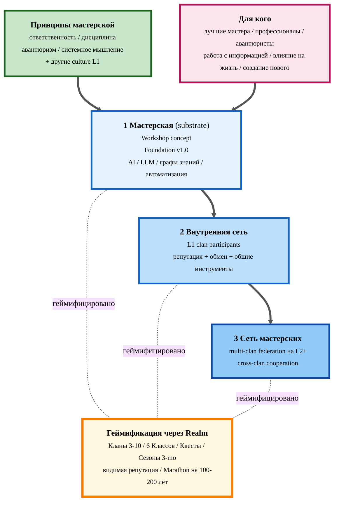
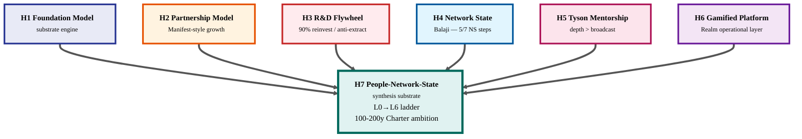

# 🏛️ JETIX First Clan Charter v0

> **Constitutional + Manifesto combined** (per Q6 ack 2026-05-12). Single binding artefact для 9 L1 signatories.
>
> **Status.** `DRAFT-PENDING-RUSLAN-REVISION` — AI-scribe initial draft на основе H7 LOCKED + R12 LOCKED + 4 evening locks + 9 L1 deep profiles + 12K wiki digest. Ruslan revision pass → status `LOCKED` + `prose_authored_by: ruslan` (или `hybrid-with-ack-trail` если accepted as-is с minor edits). Per **Tier 2 R1** — strategic prose authoring = Ruslan-only authority; AI = scribe + skeleton + initial draft.
>
> **Launch mode.** STEALTH (per Q-D3) — circulate only к 9 L1 candidates + close advisors. NOT для public publication до L3 milestone (≥1K federation, 12-24 months).

---

## §1 Преамбула — манифест

> **Prose author note.** Эта преамбула — Ruslan voice (dictated 2026-05-12), structured AI-scribe. Все остальные секции Charter — initial AI-draft pending Ruslan revision.

### §1.0 Что такое Хартия

**Хартия** — это не product spec, не business plan, не roadmap. Это **constitutional document** организации: декларация того, во что мы верим, по каким правилам играем, и под чем готовы поставить подпись. Над инструкциями. Над strategy. Stable artifact, который меняется не от настроения, а только через формальный процесс amendment.

Хартия — это то, что подписывают, когда хотят зайти всерьёз. От «нравится идея» — к «я в этом, и вот мои обязательства».

### §1.0a Что есть Jetix (короткое определение)

Прежде чем разворачивать манифест — **что такое Jetix конкретно, без философии**:

**Jetix — это мастерская по работе с информацией.** Не консалтинг-фирма, не AI-стартап, не coworking. **Мастерская** в старом смысле: место, где мастера и подмастерья работают вместе с общими инструментами, по общим принципам, в общем ритме. Только инструменты другие — AI, языковые модели, графы знаний, автоматизация. И материал, с которым работаем, — не дерево или металл, а **информация**: исследования, методологии, стратегии, тексты, протоколы, систематизация знаний.

**Принципы**, на которых мастерская стоит: **ответственность** (за результат, за слово, за людей, которых привёл), **дисциплина** (работа с информацией длинная, не каждый день feels хорошо), **авантюризм** (заходить туда, где открывается новое), **системное мышление** (связи между задачами и системами), + другие принципы, добавляемые по мере того как формируется культура L1.

И всё это — в **геймифицированном, интересном стиле**: Кланы (3-10 человек), Классы (6 архетипов: Hunter / Guardian / Scholar / Creator / Architect / Merchant), Квесты (реальные задачи), Сезоны (3-month cycles), видимая репутация.

**Для кого:** лучших мастеров, профессионалов, авантюристов — людей, которые хотят работать с информацией, влиять на жизнь, создавать новое.

**Архитектура** — три слоя: мастерская (substrate) → в ней сеть (внутренние связи) → сеть мастерских (multi-clan federation на L2+) — всё геймифицировано через Realm.

**Цели:** **Phase 1** — собрать всех таких профессионалов в одной мастерской с лучшими инструментами, перестроить общество в удобный и безопасный режим. **Phase 2** — исследования и развитие человечества как такового.

#### §1.0a.viz Jetix Workshop Architecture (visual)

---

### §1.1 Зачем мы пишем эту Хартию

Две причины — обе одинаково тяжёлые.

**Первая.** Нам нужен **координирующий протокол для top-tier профессионалов поверх корпоративных границ и национальных государств**. Не SaaS-tool, не очередная LinkedIn-замена, не DAO с токеномикой. Реальный substrate, где сильные люди могут работать вместе на длинных горизонтах без того, чтобы их растаскивали корпоративные NDA, страновые границы, патенты, опцион-vesting'и или вендор-лоск-ины. Сегодня такого substrate просто не существует. Мы его строим.

**Вторая.** Нам нужно **решать задачи такого масштаба, что один человек, одна команда, одна корпорация — не справляются**. Ускорить прогресс там, где он застрял. Заполнить пустоты, в которые государство и большие корпорации не идут (или идут только за extraction). У нас амбициозные цели — реально на следующие 100 лет — и они требуют не пяти специалистов, а тысяч и десятков тысяч профессионалов, работающих вместе по понятным правилам и с общими ценностями. Без Хартии — это толпа, не движение.

### §1.2 Почему status quo не работает

Корпорации удерживают талантливых людей через зависимости: компенсация-vesting, non-compete, информационные асимметрии, lock-in на инструментах и контактах. Государства удерживают через паспорта, налоговое резидентство, лицензирование, бюрократию. Платформы Web 2.0 — через extraction внимания и эксклюзивный доступ к собственным же данным пользователя. Это **технофеодализм** (термин Варуфакиса, 2023): новый класс владельцев substrate, новый класс зависимых от substrate. [src: Game Theory research §11; H7 People-NS §1]

И ещё одно — **доверия к управляющим этих систем мало**. Не «потому что они плохие люди», а потому что incentives корпораций и государств выстроены так, что благие намерения по отношению к человечеству — побочный продукт, в лучшем случае случайный. Чаще — конфликтующий с основными KPI. Мы не хотим, чтобы будущее человечества — наши общие ресурсы, наша планета, наши дети — оставались в руках людей, у которых нет ни глубокой экспертизы, ни искреннего интереса к долгосрочному развитию системы.

### §1.3 Наш ход

Мы делаем простой ход с непростыми последствиями: **собираем всех профессионалов в одно место**. Не лучших по статусу, не самых громких. **Реальных профессионалов** — тех, у кого есть наработки, методология, многолетний опыт, и кто готов работать вместе на длинных горизонтах.

Цель — постепенно сместить управление ключевыми системами (бизнеса, технологий, со временем — общественных институтов) в руки людей, которые **знают, что делают**. Не идеологический переворот, а медленный, накапливающийся сдвиг — через демонстрацию того, что профессионалы, работающие вместе по правилам Хартии, дают результаты, которые корпоративная и государственная машина дать не может.

### §1.4 На чьих плечах мы стоим

Эта Хартия — не наша оригинальная идея. Это **сбор наработок всего человечества**, фильтрованных через одну линзу: «что работало у тех, кто реально двигал систему вперёд».

Системное мышление — от Bertalanffy, Beer, Meadows до Левенчука, через десятилетия работы школ системного менеджмента. Игровая теория и теория кооперации — от Nash, Axelrod, Schelling, Ostrom, Nowak. Виртуальные экономики — от Castronova, Lehdonvirta. Открытая разработка как способ работать — от инженеров, которые сделали интернет открытым: Berners-Lee, Cerf, Torvalds, Stallman и тысячи имён, которых мы никогда не узнаем. Философия — от стоиков до Поппера, Хайдеггера, Варуфакиса. Mentorship-pattern — от Cus D'Amato к Тайсону, от Тарасова и Таллинской школы менеджеров.

Мы стоим на работе **всех авантюристов мира** — людей, которые шли не туда, куда было удобно, а туда, где открывалось что-то новое. Это документ от авантюристов для авантюристов. От мастеров — для мастеров. От профессионалов — для профессионалов. От людей, для которых работа = призвание, а не способ платить ипотеку.

### §1.5 Амбиция — реально на 100 лет

Мы ставим перед собой ambition такого масштаба, что произносить его вслух почти неприлично: **постепенно поменять мировой порядок и передать управление в руки реальных профессионалов**. Чтобы система под названием «человечество» развивалась адекватно, открывала новое, изобретала — **в безопасной, приятной обстановке**, с минимумом страха самоуничтожения от внутренних или внешних угроз.

Это не «свергнуть существующее». Это **построить параллельно и лучше**. Чтобы со временем талантливые люди голосовали ногами — выбирая работать через substrate Jetix, а не через корпоративные иерархии или государственные процедуры. Чтобы власть и капитал постепенно перетекали туда, где результат — потому что результат там, где профессионалы работают вместе по понятным правилам.

### §1.6 Гипотеза о будущем — длинная жизнь без смысла

Есть базовая гипотеза, на которой стоит наш long-term фрейм. **Жизнь людей будет удлиняться** — медицина становится точнее, доступнее, и в обозримой перспективе обычная продолжительность активной жизни сдвинется к 100+ годам. Это меняет всё.

Государство не заинтересовано в том, чтобы наполнить эти годы смыслом — у государства нет такого KPI. Корпорация заинтересована только в том, чтобы выкачать ресурсы из работающего человека и забыть про пенсионера. **Никто из существующих институтов не строит «как сделать длинную жизнь осмысленной»** — потому что никто на этом не зарабатывает напрямую.

Мы — строим. **Превращаем жизнь в quest** — с реально интересными задачами, понятными правилами, приятным окружением, видимым ростом. Каждый день — это день, когда хочется проснуться. Не «дотянуть до выходных», а «что я сегодня сделаю с теми, с кем работаю». Развитие — не от страха («иначе уволят»), а от интереса и от того, что вокруг люди, на которых хочется быть похожим.

Это даёт **синергию** — на уровне клана, на уровне всего человечества — которой нет в системе, где каждый защищается от каждого. И эта синергия — реально ускоряет развитие планеты. Не на проценты — на разы. Это и есть наш вклад в улучшение человечества и приближение лучших времён.

### §1.7 Если ты дочитал

Если ты дочитал до этого места — мы, скорее всего, говорим на одном языке. Прочитай Хартию дальше. Подпиши, если согласен с её constitutional principles. Откажись, если нет — без давления, без обиды, без социальной цены. Fork-and-leave работает в обе стороны.

Это marathon на 100-200 лет, не sprint. Места хватит на всех, кто готов работать всерьёз.

---

## §2 Mission

**Технически:** Jetix First Clan = координирующий substrate для top-tier профессионалов (специалистов / executives / инвесторов / владельцев малого бизнеса / менторов), создающий методологическую и репутационную инфраструктуру для совместной работы поверх корпоративных и национальных границ.

**Три constitutional гарантии (per R12 Tier 2 rule):**

1. **No extraction beyond agreed share** — revenue, equity, данные, внимание, репутация — всё ограничено явным соглашением. Substrate **не может** в одностороннем порядке расширить extraction surface. [src: R12 §2 statement #1]
2. **Fork-and-leave right** — участник в любой момент уходит без штрафа, забирая свои данные, репутацию, контакты и созданные артефакты. Mutual no-poach norm preserved. [src: R12 §2 statement #2]
3. **Constitutional barrier** — будущие изменения, расширяющие extraction surface, требуют формального amendment через Part 6b stage_gate. Не slippery slope. Не retrofit. [src: R12 §2 statement #3]

Эти три гарантии — **анти-технофеодальная стойка**. Они constitutional, не операционные. Их нельзя «временно отключить ради roadmap'а». Их можно только формально amend'нуть через процесс §7.

---

## §3 Membership

### §3.1 Critera

L1 First Clan набирается из людей со следующими характеристиками:

- **Methodology depth** — у тебя есть собственная развитая методология решения задач (системная / траблшутинг / управленческая / финансовая / гуманитарная / технологическая). Ты не «эксперт в области X», ты — **носитель transferable метода**.
- **Cooperation orientation** — твой track record показывает способность долгосрочно кооперироваться, делиться доступом, поддерживать. Не only-zero-sum игрок.
- **Anti-extraction alignment** — ты сам не строишь бизнес на extraction beyond agreed share. Если строишь — ты честно об этом говоришь, и мы расходимся без обид.
- **Top-tier track record** — публичный или хорошо известный среди peers вклад в свою область: книги, методологии, школы, корпоративные achievements, инвестиции, медиа-присутствие.

L1 — это **5-10-15 стратегических игроков**, не массовая когорта. Качество > количество.

### §3.2 L1 Confirmed candidates (9)

| # | Имя | Role в L1 | Lineage / методология |
|---|---|---|---|
| 1 | **Анатолий Левенчук** | Mentor / methodology validation | Системное мышление (ШСМ); INCOSE / OMG переводы; основной mentor lineage |
| 2 | **Олег Брагинский** | Mentor / problem-solving | Школа Траблшутеров; PhD технических наук; methodology lineage #2 |
| 3 | **Владимир Тарасов** | Mentor / managerial art | Академия управленческого искусства (AMA1984, ex-Таллинская школа менеджеров); methodology lineage #3 |
| 4 | **Цэрэн Цэрэнов** | Partner (МИМ integration) | МИМ; мехмат МГУ + ВШЭ; первая instantiation Partnership Model |
| 5 | **Андрей Федорив** | Strategist (Brand & Network) | FEDORIV agency (Киев / DACH); FEDORIV VLOG; маркетинг + outreach сеть |
| 6 | **Егор Гиренко** | Strategist (Strategy Council) | Accenture Strategy & Consulting (Frankfurt); Strategy Club podcast; corporate-strategy bridge |
| 7 | **Оскар Хартманн** | Investor / capital + connections | Hartmann Fellowships; serial entrepreneur; Германия / Дубай |
| 8 | **Дмитрий Коврин (Гуманитарщина)** | Humanities bridge / Charter review | YouTube «Гуманитарщина»; преподаватель английского; гуманитарный аудит языка |
| 9 | **Павел Дуров** | Aspirational anchor / Telegram alignment | Telegram founder; substrate-builder; aspirational L1 signature (high-leverage if engaged) |

[src: profiles/l1-first-clan/ — 9 deep profiles, 17.3K слов total; Q4 ack 2026-05-12]

### §3.3 Tier structure (L0 → L6)

| Уровень | Кол-во | Что | Сроки |
|---|---|---|---|
| **L0** | 1 | Founder solo (Руслан); Foundation v1.0 LOCKED 2026-04-28 | NOW |
| **L1** | 5 base / 10 target / 10-15 ambition flex | First Clan strategists (9 confirmed + 1 organic) | 30-60 дней |
| **L2** | 100 | Multi-clan first cohort; Realm pilot | 6-12 мес |
| **L3** | 1K | Specialist federation; public Charter v1 launch | 12-24 мес |
| **L4** | 10K-50K | Jetix Realm public; Marathon momentum | 24-36 мес |
| **L5** | 100K-1M | Mass adoption; critical mass | 5 лет |
| **L6** | 10M+ | People-Network-State recognition by ecosystem | 10-15 лет operational / 100-200 лет Charter ambition (generational) |

[src: H7 People-NS §6 + Q7 ack 2026-05-12]

**L1 ACTIVATION TRIGGER:** ≥5 подписанных Charter signatures + 1 первая совместная Quest (см. §5).

---

## §4 Constitutional Principles

### §4.1 R12 Anti-Extraction (verbatim Tier 2 rule)

> **AI / substrate cannot extract value from members beyond agreed share; members can fork-and-leave without penalty.**
>
> **Русский:** AI / substrate не может извлекать ценность из участников сверх согласованной доли; участники могут отделиться и уйти без штрафа.

[src: principles/tier-2-system/foundation-generic/ai-does-not-extract-value-beyond-agreed-share.md §1 — LOCKED commit `ddc6787` 2026-05-12]

Это **constitutional**, не операционное правило. Эскалация на нарушение — `halt_log_alert`, grade F8, через Part 6b §I.2 derived enforcement.

### §4.2 Cooperation orientation (game-theory grounded)

Мы не «надеемся на кооперацию». Мы **системно ломаем 7 структурных условий** защёлкивающих defection в Prisoner's Dilemma — через mechanism design:

- **Repeated games hardcoded** (M-A) — Marathon Seasons превращают каждый interaction в move в multi-decade game. [src: H7 §5 M-A + Axelrod 1984]
- **Reputation ledger visible** (M-B) — Persona + Clan reputation public. Anonymity невозможна. Defection instantly visible. [src: H7 §5 M-B + Nowak 2005]
- **Anti-extraction constitutional anchor** (M-C) — R12 (§4.1) делает substrate-мутацию в технофеодализм structurally forbidden. [src: H7 §5 M-C + R12]

Cooperation — dominant strategy через iterated visible play, не идеология.

### §4.3 Methodology as moat

Не tools, не аудитория — **накопленная методология** — наш защитимый ров (per H1 Foundation Model + H5 Tyson). Каждая ментор-mentee связь (parallel lineages у Левенчука / Брагинского / Тарасова) = nested repeated-game; знание компаундируется в Jetix Knowledge Base (wiki/ + decisions/).

### §4.4 Transparency principle

- **Reputation ledger visibility** — каждый L1 видит вклады других в публичном виде (artefact track-record, Quest completions, mentorship cycles).
- **Strategic prose attribution** — `prose_authored_by:` в каждом стратегическом документе; AI-drafted vs Ruslan-authored vs hybrid-with-ack-trail прозрачно различимы (per Tier 2 R6 provenance).
- **Decision audit trail** — `decisions/` директория = canonical, append-only, git-tracked.

### §4.5 Mutual support obligation

L1 members обязуются — в рамках agreed share:

- Открывать релевантные контакты (intro request от другого L1 → response в течение 7 дней).
- Делиться методологическим know-how (mentorship sessions, методички, code reviews).
- Поддерживать репутационно (public credit за вклад, no internal smearing).
- Не переманивать ключевых людей друг у друга без явного согласия (mutual no-poach внутри L1).

[src: H7 §5 M-A/B/C + R12 §2 + H2 Partnership Model]

---

## §5 Operational Mechanics

### §5.1 6 Archetypes (FULL set per Q-D2 ack 2026-05-12)

L1 (и далее) роли организуются вокруг **6 архетипов**, каждый со своими responsibilities и Quest pool:

| Archetype | Function | Examples в L1 |
|---|---|---|
| **🏹 Hunter** | Sales / new business / клиентский outreach | Sales-lead pattern |
| **🛡️ Guardian** | Operations / процессы / quality assurance | Operations / DevOps |
| **📚 Scholar** | Research / методологические синтезы / training | Левенчук / Брагинский / Тарасов (mentor-lineages) |
| **🎨 Creator** | Content / artefacts / community | Дмитрий (humanities) / Федорив (brand) |
| **🏛️ Architect** | Strategy / AI / system design | Руслан / Гиренко (Strategy Council) |
| **💼 Merchant** | BizDev / partnerships / capital | Хартманн / Цэрэн (МИМ partnership) / Дуров (aspirational anchor) |

[src: H6 Gamified Platform §4.2 + Q-D2 ack 2026-05-12]

L1 member может играть 1-2 архетипа. Архетип — не fixed identity, а активная функция в текущей Quest cohort.

### §5.2 Realm Seasons (Marathon model)

- **Baseline cycle:** 3 месяца / Season (12 недель active + 1 неделя retrospection / planning).
- **Phase 1 priority** (per Q5 ack): концепция Marathon Seasons получает дальнейшую elaboration в отдельном spec — но даже без полного spec, **L1 First Clan уже работает в режиме Season 0 (соло Руслан) → Season 1 (L1 launch)**.
- **Per-Season структура:** Quest cohort assignment → mid-Season checkpoint → end-Season retrospection + reputation update.
- **Marathon horizon:** Charter ambition = **100-200 лет** (generational scale). L0→L6 operational ladder = 10-15 лет до L6 (10M+ recognition). Каждый Season = move в long-game.

[src: H6 Gamified Platform §4 + Q5 ack 2026-05-12 detailed spec deferred]

### §5.3 Clans (3-10 members)

- **Clan** = project-team structure внутри L1+ (3-10 человек).
- **Cross-archetype:** хороший Clan собирает 1 Architect + 1 Hunter + 1 Scholar + 1 Creator (или иную комбинацию по Quest requirement).
- **Clan reputation** аккумулируется отдельно от Persona reputation (E1 + E3 в Realm taxonomy).
- L1 9 members может разбиться на 1-2 Clans для первых совместных Quests.

### §5.4 Quests

- **Quest** = реальная бизнес-задача с rewards: репутация + €/equity (per Q-D4 — все 3 monetization варианта открыты).
- **Quest size:** от 1 недели (skirmish) до 6 месяцев (campaign).
- **Quest definition:** инициируется любым L1; согласовывается остальными L1 (или подмножеством); reward structure прозрачна upfront.
- **First Quest для L1 — TBD** в первые 30 дней после ≥5 подписей.

### §5.5 Resources (TRM 6)

L1 разделяет 6 типов ресурсов (per TRM model):

- **Capital** — финансы (личные / Clan pool / external investment)
- **Time** — наиболее scarce; L1 коммитит 1-2 часа/неделя baseline
- **Audience** — каждый L1 имеет свою аудиторию (читатели, ученики, клиенты); cross-pollination через Charter signing
- **Knowledge** — методология, артефакты, training material (compounding в Jetix KB)
- **Compute** — AI substrate, инфра, инструменты
- **Network** — связи каждого L1; intro-доступ обусловлен agreed share

[src: decisions/JETIX-TRM-MODEL-2026-04-30.md]

### §5.6 Source of truth (per Q-D1 ack 2026-05-12)

**Filesystem = canonical, authoritative source of truth.** Все Charter amendments, ack-records, reputation updates, Quest definitions — coordinatable через git-tracked Markdown файлы в Jetix OS репозитории. Notion / Telegram / прочие view-tools NOT authoritative; filesystem wins any conflict. [src: Global Rule 4 + CLAUDE.md §4.2 RUSLAN-LAYER]

---

## §6 Decision-Making Process

L1 решения принимаются по трём режимам:

1. **Constitutional decisions** (Tier 2 rules / Charter amendments / fundamental scope changes): **Ruslan = founding-strategist authority** retained (per Tier 2 R1 — AI not allowed to strategize; this also applies к Charter authoring). Constitutional изменения требуют ≥7/9 L1 signatory ack PLUS Ruslan ack (cascading veto).
2. **Operational decisions** (Quest definitions / Clan formations / partnership tactics): делегированы relevant Archetype lead или Clan internal vote. Surfaced к L1 только при escalation.
3. **Reputation-weighted decisions** (per H7 §5 M-B): когда требуется voting beyond constitutional / operational layer, голос каждого L1 weighted его repuation score (visible cooperation track-record per M-B).

**Major decisions** (anything affecting >50% L1 members material wellbeing OR Charter scope) — **consensus ≥7/9 L1 + Ruslan ack**.

[src: H7 §5 + Tier 2 R1 (FUNDAMENTAL §6.1 rule 1) + Bundle 5 ack 2026-04-28]

---

## §7 Amendment Process

Charter может быть amended через следующий процесс:

1. **Formal proposal** записан в `swarm/awaiting-approval/charter-amendment-YYYY-MM-DD-<topic>.md` (filesystem source-of-truth per §5.6).
2. **≥7/9 L1 signatory ack** — каждый ack записан в proposal append-only history.
3. **Lint pass** через `/lint --check-charter-amendment` (sync invariant с principles/ + .claude/config/).
4. **7-day review period** между last L1 ack и Charter file update — buffer для objection / forking decision.
5. **Status change** Charter file: `LOCKED` → `LOCKED-AMENDED-YYYY-MM-DD`; `parent_amendment:` field в frontmatter указывает на proposal.

**Constitutional protections (cannot be diluted):**

- **R12 Anti-Extraction** (§4.1) — protected at Tier 2 constitutional level. Any amendment ослабляющий R12 = halt_log_alert F8 grade; требует FUNDAMENTAL §6.1 rule 12 amendment (separate constitutional procedure, не Charter-level).
- **Fork-and-leave right** (§8) — protected равно R12.

[src: R12 §5 + Part 6b §I.2 + FUNDAMENTAL §6.1 rule 11]

---

## §8 Exit / Fork-and-Leave (R12-grounded)

Любой L1 member может покинуть Charter в любой момент.

**No penalty:**
- Без штрафа / clawback / exit fee
- Без legal retaliation
- Без public smearing (per §4.4 transparency principle applied symmetrically)

**Member retains (full ownership):**
- **Personal data** — всё, что член загрузил / authored в Jetix
- **Reputation history** — portable, accessible через export
- **Direct contacts** установленные через Jetix interactions
- **Artifacts** — всё, что член personally authored (методички, контент, code)

**Member forfeits (после exit):**
- Future participation в Realm Seasons / Quests
- Access к shared Clan resources (E5 pool, если был участником)
- Voting rights в L1 decisions
- Reputation visibility going forward (frozen at exit point)

**Mutual no-poach norm** preserved 12 месяцев после exit — не для legal teeth, а для preserving trust среди оставшихся L1.

[src: R12 §2 statements #1-3]

---

## §9 Conflict Resolution

Внутренние разногласия — escalation ladder:

1. **Bilateral conversation** (24 часа): двое L1 в conflict пытаются разобраться напрямую. Без посредников. Без публичных каналов.
2. **Clan-level mediation** (72 часа): если conflict внутри Clan, Clan lead (или next senior member) модерирует. Запись решения в `swarm/wiki/clans/<clan-id>/conflicts/`.
3. **Federation council** (если bilateral + Clan не разрешили): ≥3 L1 нейтральных members модерируют. Запись через AWAITING-APPROVAL packet.
4. **Constitutional review** (если alleged Tier 2 R-violation, особенно R12): full Part 6b stage_gate review; Ruslan ack required; outcome — formal Charter notation OR (worst case) member exit invoked.

**No public airing of internal disputes** — stealth principle (per Q-D3 ack) preserved до L3 milestone. Внутренние конфликты не «выносятся в Twitter» / на YouTube / в публичный chat.

---

## §10 Sunset Clause

Если Jetix First Clan dissolved (вероятность low, но constitutional discipline требует):

- **Charter formally terminated** по ≥7/9 L1 vote PLUS Ruslan ack
- **All shared resources distributed** pro-rata по contribution (Clan E5 pools, joint Quest rewards, joint IP)
- **All member data returned** через export procedure
- **Charter archived** в `archive/JETIX-FIRST-CLAN-CHARTER-2026-05-12-DISSOLVED-YYYY-MM-DD.md` (historical record)
- **Constitutional principles preserved** — R12, fork-and-leave право — могут переноситься в любую successor structure

Rare edge case. Но constitutional documents must define their own end-state.

---

## §11 Signature Page

Подписывая ниже, L1 candidate подтверждает:

- Прочитал и понял §1-10 Charter
- Согласен с §4 Constitutional Principles, в особенности §4.1 R12 Anti-Extraction
- Принимает §6 Decision-Making Process (включая Ruslan retained constitutional authority)
- Принимает §8 Fork-and-Leave право как двустороннюю гарантию

**Signing mechanism (TBD — choose at L1 activation):**
- Option A: Digital signature через PGP signed commit в `decisions/JETIX-FIRST-CLAN-CHARTER-2026-05-12.md` history
- Option B: Notion subpage ack с timestamp + identity verification
- Option C: Signed Telegram message в private L1 channel (transcribed to filesystem)
- Option D: Hybrid — anyone of A/B/C, member's choice

| # | Name | Role | Contact (TBD per profile) | Signature date | Mechanism |
|---|---|---|---|---|---|
| 1 | Анатолий Левенчук | Mentor / methodology validation | per profile | _pending_ | _TBD_ |
| 2 | Олег Брагинский | Mentor / problem-solving | per profile | _pending_ | _TBD_ |
| 3 | Владимир Тарасов | Mentor / managerial art | per profile | _pending_ | _TBD_ |
| 4 | Цэрэн Цэрэнов | Partner (МИМ integration) | per profile | _pending_ | _TBD_ |
| 5 | Андрей Федорив | Strategist (Brand & Network) | per profile | _pending_ | _TBD_ |
| 6 | Егор Гиренко | Strategist (Strategy Council) | per profile | _pending_ | _TBD_ |
| 7 | Оскар Хартманн | Investor | per profile | _pending_ | _TBD_ |
| 8 | Дмитрий Коврин | Humanities bridge | per profile | _pending_ | _TBD_ |
| 9 | Павел Дуров | Aspirational anchor | per profile | _pending_ | _TBD_ |
| 10 | _organic discovery slot_ | _TBD_ | _TBD_ | _pending_ | _TBD_ |

**L1 ACTIVATION TRIGGER:** ≥5 confirmed signatures. После achievement — first Quest определяется в течение 14 дней.

---

## §12 Heptagon Visual

**Diagram M1** — Heptagon overview. 6 Hexagon insights → H7 People-Network-State synthesis substrate. [src: H7 §3 mapping + H7 §4 transition]

---

## §13 L0→L6 Ladder Timeline

```mermaid
%%{init: {'theme':'base', 'themeVariables': {'primaryColor':'#fff8e1', 'primaryTextColor':'#000', 'primaryBorderColor':'#f57c00', 'lineColor':'#555', 'fontFamily':'Inter, system-ui, sans-serif', 'fontSize':'14px'}}}%%
flowchart LR
    L0["<b>L0</b><br/>1<br/><small>NOW<br/>Founder solo</small>"]:::ladder_l0
    L1["<b>L1</b><br/>5-15<br/><small>30-60d<br/>First Clan</small>"]:::ladder_l1
    L2["<b>L2</b><br/>100<br/><small>6-12mo<br/>Multi-clan</small>"]:::ladder_l2
    L3["<b>L3</b><br/>1K<br/><small>12-24mo<br/>Federation</small>"]:::ladder_l3
    L4["<b>L4</b><br/>10K-50K<br/><small>24-36mo<br/>Realm public</small>"]:::ladder_l4
    L5["<b>L5</b><br/>100K-1M<br/><small>5y<br/>Mass adoption</small>"]:::ladder_l5
    L6["<b>L6</b><br/>10M+<br/><small>10-15y operational<br/>100-200y ambition<br/>People-NS recognition</small>"]:::ladder_l5

    L0 ==> L1 ==> L2 ==> L3 ==> L4 ==> L5 ==> L6

    classDef ladder_l0 fill:#e3f2fd,stroke:#1565c0,stroke-width:3px,color:#000
    classDef ladder_l1 fill:#bbdefb,stroke:#1565c0,stroke-width:3px,color:#000
    classDef ladder_l2 fill:#90caf9,stroke:#0d47a1,stroke-width:3px,color:#000
    classDef ladder_l3 fill:#64b5f6,stroke:#0d47a1,stroke-width:3px,color:#000
    classDef ladder_l4 fill:#42a5f5,stroke:#0d47a1,stroke-width:3px,color:#000
    classDef ladder_l5 fill:#1e88e5,stroke:#0d47a1,stroke-width:4px,color:#fff
```

**Diagram M3** — L0→L6 ladder. Timeline + counts. [src: H7 §6 + Q7 ack]

---

## §14 Filing

- **Этот файл:** `decisions/JETIX-FIRST-CLAN-CHARTER-2026-05-12.md` (canonical, append-only)
- **Parent insight:** `decisions/STRATEGIC-INSIGHT-JETIX-AS-PEOPLE-NETWORK-STATE-2026-05-12.md` (H7 LOCKED)
- **Constitutional anchor:** `principles/tier-2-system/foundation-generic/ai-does-not-extract-value-beyond-agreed-share.md` (R12 Tier 2 LOCKED)
- **Companion pitch doc:** `outreach/jetix-mentor-partner-pitch-2026-05-12.md` (DRAFT)
- **9 L1 profiles:** `profiles/l1-first-clan/*.md`
- **Strategic decisions log:** `reports/strategic-decisions-2026-05-12.md` (Q1-Q7 + Q-D1..Q-D4 ack records)
- **canonical/INDEX.md:** обновить после Ruslan revision → LOCKED

---

> **AI = scribe + skeleton. Ruslan = sole strategist + canonical author + prose authority.**
> Per Tier 2 R1. Status remains `DRAFT-PENDING-RUSLAN-REVISION` до Ruslan revision pass.
