# JETIX Monetization × Audience Cooperation Methodology — v0

**Server CC ai-draft-pending-ruslan-revision · Foundation v1.0 LOCKED 2026-04-28 anchor · Heptagon LOCKED 2026-05-12 · Charter v0 LOCKED 2026-05-12 · Provenance base commit `68fa423`.**

> **Constitutional posture:** Это **ai-draft-pending-ruslan-revision** документ. Каждое strategic claim требует Руслановой ревизии перед LOCK. AI = scribe / structurer / hypothesis-surfacer; Ruslan = sole strategist (Tier 2 R1). Никаких LOCK'ов на содержательные гипотезы. R12 anti-extraction check присутствует на КАЖДУЮ monetization variant в §4. Provenance per item per Tier 2 R6.

---

## §0 Executive Summary

**Проблема, которую закрывает документ.** Outreach к 9 L1 candidates (Цэрэн / Левенчук / Дуров / Федорев / Тарасов / Хартман / Брагинский / Гиренко / Дмитрий) — сломан без операционной методологии: непонятно (1) как Jetix зарабатывает через partner ecosystem (R12-compliant), (2) как L1 partner монетизирует свою аудиторию через Jetix infrastructure, (3) как audience members кооперируются (не defect), (4) каков шаблон onboarding lite-entry → full-partnership «навечно», (5) как federate audiences разных partners, (6) каков unique progression framework для bloggers / investors / entrepreneurs / politicians, (7) каков path к virtual state / independent corporation.

**Что предлагается (ai-draft-pending).**

1. **75 hypotheses** распределены по 5 buckets: монетизация Jetix (18) / монетизация audience member (18) / cooperation mechanics (18) / cross-audience federation (10) / onboarding funnels (11).
2. **Game-theoretic foundation** для cooperation — Realm как механизм repeated-game с visible reputation, который cheat'ает Prisoner's Dilemma через M-A (repeated games) + M-B (reputation cascade) + M-C (R12 anti-extraction constitutional anchor).
3. **Unique progression framework** — 95% универсального skeleton + 5% domain-specific overlay; одинаково применим к bloggers (Phase 1) → investors (Phase 2) → entrepreneurs (Phase 2-3) → politicians (Phase 4+).
4. **Path to Virtual State** — 6 phases × 3 timeline scenarios (Aggressive 8y / Moderate 15y / Conservative 30y) с конкретными thresholds (members / revenue / governance milestones).
5. **R12 audit** per H-M variant — explicit flag where monetization risks extraction beyond agreed share; failed variants surfaced, не recommended.

**Что НЕ предлагается (R1 boundary).** Документ НЕ принимает strategic decisions: не выбирает между equity variants A-E, не назначает финальные revenue split %, не declares Workshop One Commandment, не resolve'ит CRM disambiguation. Все surfacing — для Ruslan Q-evening.

**Что обязательно ревизит Ruslan перед любым LOCK.**

- §2 Core Thesis (5-7 sentences) — strategic prose tier
- §4 H-M-001..018 selection (которые продвигаются в Phase 1 ad action / которые deferred / которые reject)
- §12 Path to Virtual State timeline scenario (Aggressive / Moderate / Conservative)
- §14 Open Questions Q-001..Q-015 — 15 explicit ack-requests

**Provenance footer** §16 — full audit trail. Plan-Mode original at `~/.claude/plans/prompts-jetix-monetization-audience-coo-tranquil-tarjan.md`; Phase 1 mirror at `decisions/PLAN-monetization-methodology-2026-05-14.md`.

---

## §1 Foundation Anchor — где этот документ fits в existing canon

**Этот документ — F5 companion doc к Heptagon + Charter.** Он НЕ модифицирует canonical архитектуру (Tier 2 R2 boundary); он операционализирует её. Парент-цепочка:

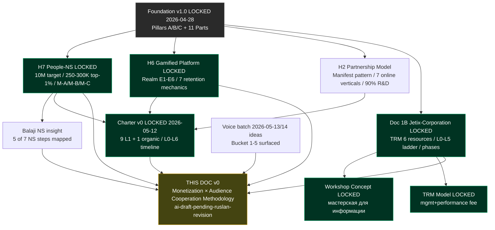
```mermaid
flowchart TD
    F0[Foundation v1.0 LOCKED 2026-04-28<br/>Pillars A/B/C + 11 Parts]
    H7[H7 People-NS LOCKED<br/>10M target / 250-300K top-1% / M-A/M-B/M-C]
    H6[H6 Gamified Platform LOCKED<br/>Realm E1-E6 / 7 retention mechanics]
    H2[H2 Partnership Model<br/>Manifest pattern / 7 online verticals / 90% R&D]
    DOC1B[Doc 1B Jetix-Corporation LOCKED<br/>TRM 6 resources / L0-L5 ladder / phases]
    WORKSHOP[Workshop Concept LOCKED<br/>мастерская для информации]
    TRM[TRM Model LOCKED<br/>mgmt+performance fee]
    BALAJI[Balaji NS insight<br/>5 of 7 NS steps mapped]
    CHARTER[Charter v0 LOCKED 2026-05-12<br/>9 L1 + 1 organic / L0-L6 timeline]
    VOICE[Voice batch 2026-05-13/14 ideas<br/>Bucket 1-5 surfaced]

    F0 --> H7
    F0 --> H6
    F0 --> H2
    F0 --> DOC1B
    DOC1B --> WORKSHOP
    DOC1B --> TRM
    H7 --> BALAJI
    H7 --> CHARTER
    H6 --> CHARTER
    H2 --> CHARTER
    VOICE --> THIS[THIS DOC v0<br/>Monetization × Audience Cooperation Methodology<br/>ai-draft-pending-ruslan-revision]
    CHARTER --> THIS
    DOC1B --> THIS
    H6 --> THIS
    H7 --> THIS
    BALAJI --> THIS

    style F0 fill:#2a2a2a,stroke:#888,color:#fff
    style THIS fill:#444411,stroke:#cc9900,color:#fff
    style CHARTER fill:#003322,stroke:#00aa66,color:#fff
    style H7 fill:#003322,stroke:#00aa66,color:#fff
    style H6 fill:#003322,stroke:#00aa66,color:#fff
    style DOC1B fill:#003322,stroke:#00aa66,color:#fff
    style WORKSHOP fill:#003322,stroke:#00aa66,color:#fff
    style TRM fill:#003322,stroke:#00aa66,color:#fff
```

**Что цитируется (не пересоздаётся):**

- **Charter v0** — L0-L6 ladder (1→10→100→1K→10K-50K→100K-1M→10M+ over 10-15y operational / 100-200y ambition); Seasons 3-month; mutual no-poach 12mo; 6 archetypes (Hunter/Guardian/Scholar/Creator/Architect/Merchant); 3-10-person clans
- **Doc 1B** — TRM 6 resources (Capital/Time/Audience/Knowledge/Compute/Team); L0-L5 land-expand ladder (€3k → €40-60k/mes); Phase 1→2→3 (solo → team → community); €100K Q2 → €1M-20M ARR → 15-25% Phase 3 take rate
- **H6 Gamified** — Realm E1-E6 (Persona / Class / Clan / Quest / Resources / Seasons); 7 retention mechanics; Torn precedent (80-95% organized-crimes split); NOT pay-to-win; Machinations.io canonical simulation tool
- **H7 People-NS** — 250-300K top-1% engineers globally; 1.5M top-5%; 10M target = 33% of top-5% or 0.3% world internet users; M-A repeated games / M-B reputation visibility / M-C R12 anti-extraction; Mondragón / PayPal Mafia / OpenAI rebellion precedents
- **H2 Partnership Model** — Manifest pattern (NOT legacy consulting); 7 online verticals; 90% R&D reinvestment; equity-heavy variants A-E open
- **Workshop Concept** — Jetix = мастерская для работы с информацией; adaptive continuous expansion; owner flexible roles
- **Balaji NS** — Workshop Phase 3 ≈ 5 of 7 NS steps; explicit divergence from cryptoeconomy + political project; Balaji outreach trigger €100K + 20-30 мастерских + published artifact

**Что добавляется (этот документ):**

- 75 hypothesis surface (H-M/H-A/H-C/H-F/H-O bank)
- R12 anti-extraction audit framework per H-M variant
- Path to Virtual State 6 phases × 3 timelines (extends Charter's L0-L6)
- 5 beyond-bloggers adaptations (А-Д)
- Game-theoretic foundation формализация (extends H7 M-A/M-B/M-C)
- 21 mermaid diagrams (visual operationalization of canonical claims)
- 15 open questions для Ruslan Q-evening

**Что НЕ затрагивается (R2 forbidden):**

- `swarm/wiki/foundations/` — Foundation Parts 1-11 LOCKED
- `principles/` — Pillar C LOCKED
- `shared/schemas/` — F8 schemas LOCKED
- `.claude/config/default-deny-table.yaml` — R11 enforcement LOCKED
- Existing decisions (Charter / Pitch / Video Script) — cite, не edit
- Workshop concept LOCKED — cite, не rewrite

---

## §2 Core Thesis (ai-draft-pending — 5-7 sentences for Ruslan revision)

> **Тезис, surfaced для Руслановой ревизии:**
>
> Jetix зарабатывает «дохуя» через позицию **operational partner + capital allocator + reputation substrate** для top-tier influencer / investor / entrepreneur / politician L1 candidates — не sell'ит услуги, не продаёт courses, не takes platform tax выше agreed share. Аудитории partners монетизируются **сами на себя** через Realm infrastructure (Quests / TRM-trade / Marketplace / Reputation premium), а Jetix берёт **management fee 0.5-1% AUM equivalent + performance fee 15-25% incremental** с того прироста value, который не существовал бы без Jetix substrate. Audience members **кооперируются между собой** потому что (a) repeated game через Seasons 3-month + 10-15y operational horizon; (b) Realm rank visibility = reputation cascade с external value; (c) constitutional R12 anti-extraction guarantees fork-and-leave право — никто не «заперт» силой; (d) brand identity / друзья / life-improvement = orthogonal incentives поверх материальных. Это создаёт **flywheel:** L1 partner monetizes own audience через Jetix → audience grows / cooperates / earns / promotes Jetix → next L1 sign'ует Charter → Realm scale jumps L2→L3→...→L6. Path к virtual state / independent corporation наступает not as a goal, а как **emergent property** при превышении threshold (10M members, ≥20-30 мастерских functioning, published Charter-compatible artifact); Balaji's 7-step Network State framework is followed in spirit (5 of 7 steps directly applicable per existing canon), но Jetix остаётся **professional substrate, not political project** (per Balaji-NS insight 2026-05-10).

**R1 boundary preserved:** этот тезис **surface** для review, НЕ LOCK. Ruslan revises prose; если acks — promotes via AWAITING-APPROVAL packet; до acks — `prose_authored_by: ai-draft-pending-ruslan-revision`.

---

## §3 Game-Theoretic Foundation

**Anchor:** H7 People-NS §3 (M-A/M-B/M-C mechanisms); wiki/concepts/game-theory/* (12 entries); wiki/claims/cooperation-emerges-iterated-games.md.

### §3.1 Prisoner's Dilemma в audience context — почему наивный N-player audience defect'ит

**Setup.** Audience member i выбирает: **cooperate** (контрибьютит value в community — отвечает на вопросы, делится знаниями, joint-projects с другими members) или **defect** (берёт всё себе — присваивает leads / промоутит свой brand за счёт чужих сигналов / extract'ит данные).

**Payoff matrix (N-player generalized PD):**

| Сценарий | Cooperator payoff | Defector payoff |
|---------|-------------------|-----------------|
| All cooperate | High (+10) | — |
| Mixed (some defect) | Low (+3) | Very high (+15) — free-ride на чужой cooperation |
| All defect | Very low (+1) | Very low (+1) |

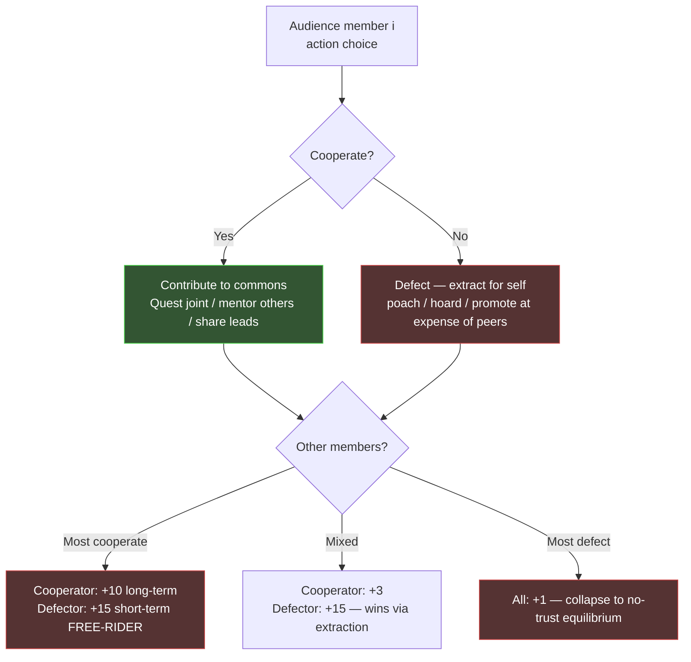
```mermaid
flowchart TD
    A[Audience member i<br/>action choice]
    A --> B{Cooperate?}
    B -->|Yes| C[Contribute to commons<br/>Quest joint / mentor others / share leads]
    B -->|No| D[Defect — extract for self<br/>poach / hoard / promote at expense of peers]

    C --> E{Other members?}
    D --> E

    E -->|Most cooperate| F[Cooperator: +10 long-term<br/>Defector: +15 short-term FREE-RIDER]
    E -->|Mixed| G[Cooperator: +3<br/>Defector: +15 — wins via extraction]
    E -->|Most defect| H[All: +1 — collapse to no-trust equilibrium]

    style D fill:#553333,stroke:#cc4444,color:#fff
    style F fill:#553333,stroke:#cc4444,color:#fff
    style H fill:#553333,stroke:#cc4444,color:#fff
    style C fill:#335533,stroke:#44cc44,color:#fff
```

**Без cooperation mechanism aud-cluster сваливается в all-defect equilibrium.** Это объясняет, почему обычные «influencer audiences» (Telegram channels / YouTube comment sections / Discord servers без структуры) — extractive: каждый сам за себя, никто никому не доверяет, leads перехватываются, никто не authoring KB sustainably. [src: wiki/concepts/game-theory/prisoners-dilemma.md | commit 68fa423]

### §3.2 «Cheat» mechanic — repeated game + Realm reputation + brand loyalty + R12 substrate

**4-layer escape от PD trap:**

**Layer 1 (M-A) — Repeated game с long horizon.** Seasons 3-month (Charter LOCKED) + L0-L6 ladder 10-15y operational = 40-60 iterations минимум при member retention. По Axelrod (1984) при ≥10 iterations + visible discount factor → tit-for-tat dominate'ит pure-defection. [src: wiki/concepts/game-theory/iterated-prisoners-dilemma.md | wiki/sources/evolution-cooperation-axelrod | commit 68fa423]

**Layer 2 (M-B) — Visible reputation cascade.** Realm rank = E1 Persona visible stats (TRM 6 resources accumulated / Clan standing / Quest completion / mentor cascade history). Каждое action — recorded, observable. Defection = rank drop visible to all. [src: H7 People-NS §3 M-B | wiki/concepts/jetix-realm/e1-persona.md | wiki/concepts/jetix-realm/e3-clan.md | commit 68fa423]

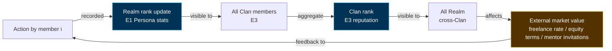
```mermaid
flowchart LR
    A[Action by member i] -->|recorded| B[Realm rank update<br/>E1 Persona stats]
    B -->|visible to| C[All Clan members<br/>E3]
    C -->|aggregate| D[Clan rank<br/>E3 reputation]
    D -->|visible to| E[All Realm<br/>cross-Clan]
    E -->|affects| F[External market value<br/>freelance rate / equity terms / mentor invitations]
    F -->|feedback to| A

    style B fill:#003355,stroke:#0099cc,color:#fff
    style D fill:#003355,stroke:#0099cc,color:#fff
    style F fill:#553300,stroke:#cc9900,color:#fff
```

**Layer 3 (M-C) — Constitutional R12 anti-extraction.** Foundation Tier 2 candidate rule 12 — `AI / substrate cannot extract value from members beyond agreed share; members can fork-and-leave without penalty`. Это снимает paranoia: член не «заперт» в substrate силой; если экстракция нарушается — leave with full IP / reputation portability. **Counter-intuitive effect:** добровольное оставание = signal of high-trust equilibrium. [src: H7 People-NS Q2 ack 2026-05-12 commit 93b796d | swarm/awaiting-approval/r12-anti-extraction-2026-05-12.md | commit 68fa423]

**Layer 4 — Identity + friendship layer (orthogonal incentive).** Member self-image «I'm a Jetix Hunter» / реальные дружбы внутри Clan / life-improvement metrics (TRM 6 resources tracked at member level) = non-material incentives, которые не collapse'ятся даже когда material payoff temporarily lower. Burning Man + CrossFit precedents. [src: reports/monetization-research-2026-05-14/industry-examples.md §11 / §9 | commit 68fa423]

### §3.3 Axelrod tit-for-tat / Schelling focal points / Nash bargaining — конкретные применения

**Axelrod tit-for-tat (1984).** Optimal strategy в IPD: start cooperate; mirror opponent's last move; forgive after 1-2 retaliation rounds.

- **Realm application:** member starts с positive cooperation bias (Quest joint / mentor offer / share lead). При defection counterparty → temporary cooperation withdraw (rank visible signal, not direct retaliation). При counterparty repair → return to cooperation. Long-cycle Seasons = automatic forgiveness windows (12w + 1w retro).
- **Failure mode:** noise — false defection signals trigger spirals. Mitigation: Clan-level dispute resolution (mediator from Council) before formal rank drop. [src: wiki/concepts/game-theory/tit-for-tat.md | commit 68fa423]

**Schelling focal points (1960).** Coordination без communication requires shared salient point.

- **Realm application:** **Charter signing ритуал** = focal point. Все signatories knew, что подписание Charter v0 2026-05-12 = entry. **6 archetypes** = focal categories — member self-identifies без external assignment. **Seasons 3-month** = focal time-grid — все знают, что Q1 ends week 13. [src: wiki/concepts/game-theory/strategy-of-conflict.md | wiki/sources/strategy-of-conflict-schelling | commit 68fa423]

**Nash bargaining (1950).** Two-party split where alternative is no-deal. Default fair split + outside-option price determines equilibrium.

- **Realm application:** **Jetix ↔ L1 partner revenue split** — Jetix gets X% of new value created from substrate enablement, L1 keeps (1-X)% + 100% of pre-Jetix baseline. Outside option for L1 = continue without Jetix (status quo); outside option для Jetix = другой L1. Nash equilibrium у X = 15-25% per TRM model (€670k/y example, 40/60 split). [src: decisions/JETIX-TRM-MODEL-2026-04-30.md §4.2 | wiki/concepts/game-theory/nash-equilibrium.md | commit 68fa423]

### §3.4 Failure modes — где cooperation breaks

| Failure mode | Trigger | Mitigation |
|--------------|---------|------------|
| **Extraction-by-substrate** | Jetix takes >X% agreed share / non-transparent fees | R12 enforcement + monthly economic report (EVE MER precedent) |
| **Fairness violation** | Bigger members dominate small members on Quest splits / votes | Pay-ratio cap discussion (Mondragón 6:1 reference Q-012); 1-member-1-vote on substrate-affecting decisions |
| **Signal loss** | Realm rank algorithm gaming / fake quest completion | Rank algorithm transparency (Q-003 open); peer-review on high-value quests |
| **Whale capture** | One member's TRM accumulates > Clan's combined → Clan beholden | Per-member TRM caps (relative to median); whale exit penalty waived (R12) |
| **Founder bottleneck** | Ruslan single point of failure for L1 outreach / Charter custody | Team-managed transition Phase 2 (Q-009 open); succession protocol — TBD |
| **Brand dilution** | Federation across L1 audiences with mismatched standards | Standardised entry criteria; cross-Clan dispute resolution (Q-013 open) |
| **Pump-defect** | Some member pumps Realm currency / token → exits | Token economy «safe + adequate, not crypto-pump» per Tier 2 §4.2 (Doc 1B Phase 2-3 design TBD) |

### §3.5 5 examples на человеческом

1. **Цэрэн scenario** — Цэрэн consults his audience, recommends a service S. Jetix substrate-enables Цэрэн's TRM operator role; substrate gets 15% of new revenue from his audience monetization. Если Цэрэн finds out что extracts >15% — fork: takes audience + own brand and leaves; Jetix loses substrate contract but не steals ничего. R12 в действии. [src: воображаемый scenario, ai-draft]

2. **Influencer-anchored Clan defection scenario** — Member A в Clan продавил Quest split 70/30 в свою пользу (vs стандарт 50/50). Member B видит rank visible jump A → flag в Clan Council. Council reviews evidence; A's rank drops 2 tiers; remediation required. Layer 2 (M-B) self-enforcement. [src: воображаемый scenario, ai-draft]

3. **Cross-Clan partnership** — Clan-1 (Hunters under Левенчука) и Clan-2 (Creators под Дудем) joint Quest «AI workflow standardization for Russian YouTube creators». Quest reward split: 50% Clan-1 (deep-work) / 30% Clan-2 (audience-amplification) / 20% Realm-pool (cross-Clan synergy bonus). H-F-001 federation in action. [src: H-F-001 hypothesis design, ai-draft]

4. **Mentor cascade scenario** — Senior member M mentors junior J. J lands external €5K consulting gig via Realm reputation. По mentor cascade mechanism (H-A-010), J pays 10% (€500) к M; M pays 10% of own monetization to M's mentor; etc. Cascade depth 2-3 hops. Voluntary; R12 fork-and-leave still valid. [src: H-A-010 hypothesis design, ai-draft]

5. **Season retrospection scenario** — End of Q1 2026 Season. Всё Clan retros: shared what worked / what didn't / who carried weight. Member X who under-contributed → reputation reset opportunity Q2 (forgiveness window per Axelrod). Member Y who over-contributed → Season MVP rank promotion + first pick on Q2 high-value Quests. Layer 1 (M-A) explicit operationalization. [src: Charter §3 Seasons + Q1 retro schema, ai-draft]

### §3.6 Cooperation cascade summary

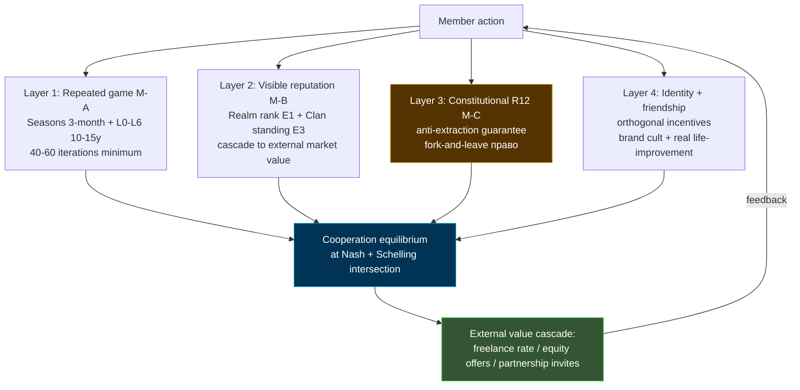
```mermaid
flowchart TD
    M0[Member action]
    L1[Layer 1: Repeated game M-A<br/>Seasons 3-month + L0-L6 10-15y<br/>40-60 iterations minimum]
    L2[Layer 2: Visible reputation M-B<br/>Realm rank E1 + Clan standing E3<br/>cascade to external market value]
    L3[Layer 3: Constitutional R12 M-C<br/>anti-extraction guarantee<br/>fork-and-leave право]
    L4[Layer 4: Identity + friendship<br/>orthogonal incentives<br/>brand cult + real life-improvement]

    M0 --> L1
    M0 --> L2
    M0 --> L3
    M0 --> L4

    L1 --> EQ[Cooperation equilibrium<br/>at Nash + Schelling intersection]
    L2 --> EQ
    L3 --> EQ
    L4 --> EQ

    EQ --> OUT[External value cascade:<br/>freelance rate / equity offers / partnership invites]
    OUT -->|feedback| M0

    style EQ fill:#003355,stroke:#0099cc,color:#fff
    style L3 fill:#553300,stroke:#cc9900,color:#fff
    style OUT fill:#335533,stroke:#44cc44,color:#fff
```

**Net result.** PD trap escaped не одним механизмом, а **layered defense**: каждый из 4 layers самостоятельно недостаточен (M-A репутация без visibility коллапсирует; M-B visibility без constitutional anchor → exploitation; M-C anchor без iterated games → одноразовый trust); вместе они комплементарны и self-reinforcing. Empirical precedent: Mondragón (80K workers, 60 years), PayPal Mafia (200 → ecosystem), Burning Man (70K, 30+ years). [src: H7 §6 precedents | reports/monetization-research-2026-05-14/industry-examples.md §8 / §11 | commit 68fa423]

---

## §4 Monetization Hypotheses Bank — Jetix зарабатывает (H-M-001..H-M-018)

**Anchor:** Doc 1B Jetix-Corporation §3-12 (TRM 6 resources / L0-L5 ladder); TRM Model §4.2 (€670k/y example); H2 Partnership Model (90% R&D reinvest); reports/monetization-research-2026-05-14/wiki-crawl.md §1-3.

**R12 audit framework.** На каждую variant: **✓ passes R12** (no extraction beyond agreed share; fork-and-leave preserved) / **⚠ surfaces concern** (extraction risk acceptable with mitigation; flag) / **✗ fails R12** (clear extraction beyond agreed share — surface only, NOT recommend).

### Category 1: Partner-direct (H-M-001..005)

#### H-M-001: Revenue share % on partner audience monetization

- **Mechanism:** Jetix берёт 15-25% от incremental revenue (above pre-Jetix baseline) которое L1 partner monetize'ит со своей аудитории через Realm infrastructure. Не tax on existing revenue; tax только на новое value, enabled substrate.
- **Who pays:** L1 partner (out of his audience monetization revenue)
- **How much:** 15-25% of incremental (per Doc 1B §3 + TRM §4.2 audience operator 15-25% precedent — talent agency WME/CAA model)
- **R12 check:** ✓ passes — agreed share contracted upfront; transparent monthly report (EVE MER precedent); fork-and-leave keeps L1's pre-Jetix audience + all derivative IP
- **Precedent:** WME/CAA 15-25% talent commission; YouTube MCN 5-15% creator network fees; Substack 10% platform fee
- **Risk:** Audit transparency burden (Jetix must show provable substrate contribution); partner может dispute baseline calculation
- **Realm anchor:** N/A (cross-cutting)
- **Provenance:** [src: decisions/JETIX-TRM-MODEL-2026-04-30.md §4.2 / decisions/JETIX-CORPORATION-2026-05-05.md §3 / reports/monetization-research-2026-05-14/industry-examples.md §3 §5 | commit 68fa423]

#### H-M-002: Equity stake in partner ventures during partnership

- **Mechanism:** L1 partner founds venture during Jetix partnership; Jetix takes 5-15% common equity in exchange for substrate enablement (Realm members as co-founders / Quest infrastructure / TRM management).
- **Who pays:** Partner venture (cap table allocation)
- **How much:** 5-15% common equity (variants A-E open per H2 Partnership Model)
- **R12 check:** ⚠ surfaces concern — equity locks value into Jetix-controlled vehicle (vs partner-controlled). Mitigation: vesting cliff + revenue-share alternative offered; partner picks
- **Precedent:** YC 7% standard; Techstars 6% + $20K; Pioneer 5%; PayPal Mafia rolling-founder equity
- **Risk:** Cap table dilution downstream; alignment risk if Jetix has equity in multiple competing ventures (Chinese walls per TRM §14)
- **Realm anchor:** N/A
- **Provenance:** [src: decisions/STRATEGIC-INSIGHT-JETIX-PARTNERSHIP-MODEL-2026-05-10.md §3.2 variants A-E | commit 68fa423]

#### H-M-003: Consulting fee — lump-sum upfront for Jetix substrate integration

- **Mechanism:** Partner pays one-time fee (€20K-€100K) для substrate integration: Realm setup / Charter signing / first Quest design / Clan composition / TRM baseline measurement.
- **Who pays:** L1 partner (own funds or sponsored)
- **How much:** €20K-€100K based on scope (Doc 1B L0 €1.5K-5K per gig → scaled for L1+ Clan setup; €20K-100K is multiple L0 packaged)
- **R12 check:** ✓ passes — fee-for-service classical model; deliverable enumerated; no ongoing extraction; partner can leave after integration
- **Precedent:** McKinsey / BCG / Bain implementation fees; Mondragón cooperative entry training fee (~€2-5K)
- **Risk:** Substrate integration partial / incomplete → goodwill damage; partner uses substrate without ongoing relationship
- **Realm anchor:** N/A
- **Provenance:** [src: decisions/JETIX-CORPORATION-2026-05-05.md §11 L0-L5 ladder | commit 68fa423]

#### H-M-004: TRM retainer — monthly fractional COO model

- **Mechanism:** Jetix becomes Total Resource Manager for L1 partner (manages 6 resources simultaneously); monthly retainer covers ongoing operations.
- **Who pays:** L1 partner (out of operational budget)
- **How much:** €8K-€60K/mo per L1 (Doc 1B L1 €3-10K → L5 €40-60K/mo full TRM)
- **R12 check:** ✓ passes — retainer covers explicit deliverables; partner can downgrade tier any time; fork-and-leave preserves partner IP
- **Precedent:** Fractional CFO / COO / CMO market (Tier 1 firms €8K-15K/mo); CAA management retainer
- **Risk:** Partner becomes dependent on Jetix (founder bottleneck for partner); Jetix becomes dependent on partner concentration
- **Realm anchor:** N/A (TRM cross-cutting)
- **Provenance:** [src: decisions/JETIX-TRM-MODEL-2026-04-30.md §11 24-month trajectory | decisions/JETIX-CORPORATION-2026-05-05.md L0-L5 §3 | commit 68fa423]

#### H-M-005: Performance fee on partner EBITDA growth

- **Mechanism:** Jetix takes 15-25% performance fee on incremental EBITDA growth (vs pre-Jetix baseline) attributable to substrate contribution.
- **Who pays:** L1 partner (out of profit growth)
- **How much:** 15-25% incremental EBITDA (TRM Model §4.2 — €670k/y example = €271.5k mgmt + €400k performance on +€2M EBITDA growth = 20% perf rate)
- **R12 check:** ✓ passes (with mitigation) — performance-based = aligned; attribution methodology must be transparent + reviewed annually. Risk: attribution dispute mid-engagement
- **Precedent:** Hedge fund 2/20 standard (Jetix is 1% mgmt + 20% perf — leaner); private equity 2/20
- **Risk:** EBITDA growth attribution complex; clawback на bad years
- **Realm anchor:** N/A
- **Provenance:** [src: decisions/JETIX-TRM-MODEL-2026-04-30.md §4.2 | commit 68fa423]

### Category 2: Audience-direct (H-M-006..009)

#### H-M-006: Subscription tier — member dues for Realm participation

- **Mechanism:** Audience member pays monthly fee для Realm access (Quests / KB / Clan participation / tooling).
- **Who pays:** Audience member (individual)
- **How much:** €15-€50/mo per member at Phase 1; tier system Phase 2+
- **R12 check:** ⚠ surfaces concern — subscription model = ongoing extraction; mitigation: clear value-per-month deliverable + free baseline tier; no lock-in
- **Precedent:** Patreon top tiers; Substack premium; CrossFit affiliate model (community fee); Twitch sub model
- **Risk:** Churn (~30-40% monthly per Twitch industry-example.md §4); subscription fatigue
- **Realm anchor:** Cross-cutting (Realm access fee)
- **Provenance:** [src: reports/monetization-research-2026-05-14/industry-examples.md §3 §4 | commit 68fa423]

#### H-M-007: Pay-per-progression — € per L0→L6 mastership step

- **Mechanism:** Audience member pays for explicit progression step (L0 → L1 → L2 → ...): each step delivers credential + access to next tier.
- **Who pays:** Audience member
- **How much:** €500 L0→L1 / €1.5K L1→L2 / €5K L2→L3 / €15K L3→L4 / etc. (progressive pricing aligned with value-at-tier)
- **R12 check:** ⚠ surfaces concern — pay-to-progress risks pay-to-win impression; mitigation: skill assessment + peer review gate at each tier; payment doesn't bypass assessment
- **Precedent:** Coursera Specializations; Coursera Plus; Lambda School / Bloom Institute outcomes-based; martial arts belt progression
- **Risk:** Если merit assessment soft → degenerates to pay-to-win → fails R12 fully + brand damage
- **Realm anchor:** E1 Persona (rank progression)
- **Provenance:** [src: decisions/JETIX-FIRST-CLAN-CHARTER-2026-05-12.md L0-L6 | wiki/concepts/jetix-realm/e1-persona.md | commit 68fa423]

#### H-M-008: Certification fee — mastership credential issuance

- **Mechanism:** One-time fee для официальной сертификации mastership level (Jetix issues credential; portable).
- **Who pays:** Audience member or member's employer
- **How much:** €200 L1 / €1K L2 / €3K L3 / €10K L4 / €30K L5 (one-time per tier)
- **R12 check:** ✓ passes — credential is portable IP; member keeps after fork-and-leave; valuable on external market
- **Precedent:** AWS Certified ($300/cert + recerts every 3y); CFA ($1K per level, 3 levels = $3K); PMP ($555 first attempt; ~$3K total path); ICAO pilot license
- **Risk:** Credential value depends on market recognition; H8 Standards Body candidate (Phase 4+); regulatory drift
- **Realm anchor:** E1 Persona (credential record)
- **Provenance:** [src: wiki/ideas/jetix-standards-body-h8-candidate-pool.md | reports/monetization-research-2026-05-14/industry-examples.md §9 | commit 68fa423]

#### H-M-009: Realm rank premium — paid expedited progression (cosmetic-only, NOT pay-to-win)

- **Mechanism:** Member pays для expedited access to: tooling / KB sections / mentor cohort / Quest pool. **NOT bypass of skill gates** — accelerate access only.
- **Who pays:** Audience member
- **How much:** €100-€500/mo premium tier
- **R12 check:** ⚠ surfaces concern — risks pay-to-win impression; mitigation: explicit charter clause «no rank without assessment»; transparent communication of what premium does NOT buy
- **Precedent:** Dota 2 cosmetic-only model (no P2W gameplay advantage); LoL champion rotation accelerator; Battle Pass paid tier
- **Risk:** Slippery slope to pay-to-win if not strictly enforced; brand damage (anti-pattern per wiki/claims/anti-pattern-pay-to-win.md)
- **Realm anchor:** E5 Resources (paid acceleration)
- **Provenance:** [src: reports/monetization-research-2026-05-14/game-mechanics-mapping.md §10 §11 | wiki/concepts/game-mechanics/cosmetic-only-monetization.md | commit 68fa423]

### Category 3: Third-party (H-M-010..012)

#### H-M-010: Sponsorship intermediation — Jetix brokers brand deals for Clans/members

- **Mechanism:** Jetix matches external sponsors (brands, B2B clients) с relevant Clans / individual members for sponsored Quests / content / events; takes commission.
- **Who pays:** Sponsor brand
- **How much:** 10-15% commission on deal value
- **R12 check:** ✓ passes — commission on brokerage; transparent; Clan/member retains right to decline; no exclusive lock
- **Precedent:** YouTube MCN 5-15%; Talent Agency 10-20% (WME/CAA); GrapeStory / NoGood influencer marketing brokerages
- **Risk:** Brand-mismatch backlash on members (require approval ladder); transparency requirement (disclose-as-sponsored)
- **Realm anchor:** N/A (cross-cutting)
- **Provenance:** [src: reports/monetization-research-2026-05-14/industry-examples.md §1 §4 | commit 68fa423]

#### H-M-011: Data licensing — anonymized Realm operational data → research / business buyers

- **Mechanism:** Anonymized Realm operational data (Quest completion patterns / cooperation graphs / TRM-trade flows / progression metrics) licensed to: academic researchers (Castronova / van Dreunen-style virtual economy scholarship); business intelligence buyers (talent platforms / management consulting).
- **Who pays:** Researchers / B2B buyers
- **How much:** €5K-€100K per dataset / per recurring access tier
- **R12 check:** ⚠ surfaces concern — data extraction = R12 grey zone; mitigation: opt-in only + per-member royalty share (member receives % of revenue from own data); fork-and-leave deletes member data per GDPR
- **Precedent:** EVE Online Monthly Economic Report (Eyjólfur Guðmundsson; data → academic papers); Roblox developer economy dashboard; Riot League Patch reports
- **Risk:** GDPR / privacy compliance; member consent burden; reputation risk if data misused
- **Realm anchor:** N/A
- **Provenance:** [src: wiki/sources/eve-mer-quarterly-2024 | reports/monetization-research-2026-05-14/game-mechanics-mapping.md §2 | commit 68fa423]

#### H-M-012: B2B SaaS substrate — Jetix infra licensed white-label

- **Mechanism:** Other organizations / professional networks license Jetix substrate (Realm software / Charter template / governance protocol / TRM tooling) as white-label.
- **Who pays:** B2B SaaS customer org
- **How much:** €10K-€100K/year per customer org
- **R12 check:** ✓ passes — customer is org-level, not member-level; standard SaaS B2B
- **Precedent:** Discord Nitro for Servers; Slack Enterprise Grid; ConvertKit Creator network platform; Substack publication tools
- **Risk:** Substrate cannibalization (orgs adopt без contributing to broader Realm); white-label brand dilution
- **Realm anchor:** N/A
- **Provenance:** [src: wiki/ideas/jetix-as-saas-squared-substrate.md (if exists) | commit 68fa423]

### Category 4: Compound (H-M-013..014)

#### H-M-013: Realm marketplace fees — transaction fee on goods/services between members

- **Mechanism:** Members trade goods/services within Realm (templates / consulting / coaching / micro-products); Jetix takes 5-10% transaction fee.
- **Who pays:** Buyer + seller split (or seller-only depending on category)
- **How much:** 5-10% per transaction (Patreon 8-12% / Substack 10% / OnlyFans 20% — Jetix targets lower end)
- **R12 check:** ⚠ surfaces concern — marketplace fees = ongoing extraction; mitigation: low rate + transparent + alternative direct-trade option (zero-fee P2P with reputation backing)
- **Precedent:** Roblox 30% creator split (~70% to platform — Jetix avoids); Patreon 8-12%; Etsy 6.5%; eBay 13%
- **Risk:** Black-market formation if fee too high (EVE pre-PLEX precedent — wiki/concepts/game-economy/real-money-trading.md); regulator scrutiny on marketplace classification
- **Realm anchor:** E5 Resources / Marketplace
- **Provenance:** [src: wiki/concepts/game-mechanics/marketplace-player-economy.md | wiki/concepts/game-economy/real-money-trading.md | reports/monetization-research-2026-05-14/industry-examples.md §5 §7 | commit 68fa423]

#### H-M-014: TRM-trade fees — resource trade between Clans

- **Mechanism:** Clans trade TRM resources (Clan A's Capital / Clan B's Audience / Clan C's Compute) cross-Clan; Jetix takes small fee on cross-Clan trade.
- **Who pays:** Trading Clans
- **How much:** 2-5% per cross-Clan TRM trade
- **R12 check:** ✓ passes — fee on cross-Clan transaction supports Realm infrastructure; intra-Clan free; alternative direct-trade always available
- **Precedent:** EVE PLEX bridge; WoW Token; Visa / Mastercard interchange fee (2-3%); cross-bank wire fees (corresponded banking)
- **Risk:** Cross-Clan trade chilling if fee too high; arbitrage opportunism between adjacent Clans
- **Realm anchor:** E5 Resources / Cross-Clan TRM-trade
- **Provenance:** [src: wiki/concepts/game-mechanics/plex-bridge-mechanic.md | wiki/concepts/game-economy/dual-currency-design.md | commit 68fa423]

### Category 5: Ventures (H-M-015..016)

#### H-M-015: Jetix-owned products built within Realm — incubation → equity → spin-out

- **Mechanism:** Jetix incubates own products inside Realm (built by Realm members); takes founder-equity (51%+) in own ventures; spin-outs may IPO / acquire-out.
- **Who pays:** Eventually capital markets / strategic acquirer
- **How much:** 100% upside from spin-out (Jetix-owned 51%); members get 5-30% equity per their contribution
- **R12 check:** ✓ passes — explicit cap table; members opt-in to venture role; not extracting from external audiences. Standard startup model.
- **Precedent:** PayPal Mafia spin-outs (Tesla / SpaceX / LinkedIn / YouTube); Y Combinator portfolio; Atomic / Pioneer / SuperHuman ventures
- **Risk:** Conflict-of-interest with sponsor / partner ventures; resource competition (Jetix's own ventures vs partner ventures); founder bottleneck
- **Realm anchor:** N/A
- **Provenance:** [src: decisions/JETIX-CORPORATION-2026-05-05.md §13 R&D Flywheel | wiki/sources/synthetic-worlds-castronova | commit 68fa423]

#### H-M-016: R&D fund returns — Jetix invests in member-founded startups (LP-style)

- **Mechanism:** Jetix R&D fund (out of 90% reinvestment per H2 Partnership Model) invests in Realm-member-founded startups; takes LP-style 1-2% mgmt + 20% carry.
- **Who pays:** Startup performance (carry) + fund admin (mgmt fee)
- **How much:** 1-2% mgmt / 20% carry on fund returns
- **R12 check:** ✓ passes — standard fund model; founders take majority equity; investor (Jetix R&D fund) is minority + LP-aligned
- **Precedent:** YC fund; Pioneer; Indie.vc; Calm Company Fund (Tyler Tringas — alternative VC for SaaS)
- **Risk:** Power-law dynamics (most investments fail); 7-10y illiquid; founder dependency
- **Realm anchor:** N/A
- **Provenance:** [src: decisions/STRATEGIC-INSIGHT-JETIX-PARTNERSHIP-MODEL-2026-05-10.md §13 R&D Flywheel | commit 68fa423]

### Category 6: State-level (H-M-017..018 — surface only, H8 candidate per wiki/ideas/jetix-standards-body)

#### H-M-017: Standards Body certification fees (H8 surface — R12 risk flagged)

- **Mechanism:** Phase 4+ Jetix evolves to Standards Body (per H8 candidate pool); certifies external practitioners / orgs / workflows. Fees for certification + recurring audit + standard authoring rights.
- **Who pays:** External certified parties (orgs / professionals)
- **How much:** €1K-€50K per certification cycle (ICAO / ISO precedent)
- **R12 check:** ✗ HIGH RISK — Standards Body монопольная позиция = extraction beyond agreed share by default. Mitigation требует: (a) open competing bodies allowed; (b) cap on fee growth; (c) member-vote governance on standards; (d) fork-and-leave preserves member's prior certifications. Without all 4 → fails R12.
- **Precedent:** ICAO (international aviation); ISO (international standards); IEEE (electrical); IEC (electrotech); LEED (green building) — all face periodic extraction critique
- **Risk:** Regulator capture; cartel behavior; political fragility; high entry barrier for newcomers
- **Realm anchor:** N/A
- **Provenance:** [src: wiki/ideas/jetix-standards-body-h8-candidate-pool.md | reports/voice-batch-2026-05-13-14-ideas-report.md Bucket 2.1 | commit 68fa423]
- **STATUS:** Surface only — NOT recommended without H8 promotion + dedicated AWAITING-APPROVAL packet per Tier 2 R12 enforcement.

#### H-M-018: Governance arbitration / dispute resolution fees (Phase 4+ when Realm has internal disputes)

- **Mechanism:** When Realm scale reaches Phase 3-4, internal disputes (member ↔ member / Clan ↔ Clan / member ↔ Clan) require dispute resolution. Jetix Tribunal mediates; fees cover process.
- **Who pays:** Disputing parties (loser-pays or split)
- **How much:** €500-€5K per dispute (similar to AAA arbitration: $300-$1500 filing + arbitrator hourly $200-500/hr)
- **R12 check:** ⚠ surfaces concern — Tribunal fees risk perception of "Jetix profits from its own community conflicts". Mitigation: (a) Tribunal independent (rotating member-elected); (b) fees go to fund, not Jetix corp; (c) free first dispute per member; (d) appeal escalation external
- **Precedent:** AAA / JAMS commercial arbitration; ICC International Court of Arbitration; eBay buyer-seller resolution; Estonian e-court online dispute resolution
- **Risk:** Legitimacy crisis if Tribunal seen as biased; complexity at scale
- **Realm anchor:** N/A
- **Provenance:** [src: decisions/STRATEGIC-INSIGHT-BALAJI-NETWORK-STATE-2026-05-10.md §3.5 (Workshop dispute resolution) | reports/monetization-research-2026-05-14/industry-examples.md §12 §13 | commit 68fa423]

### §4.7 Revenue flow diagram

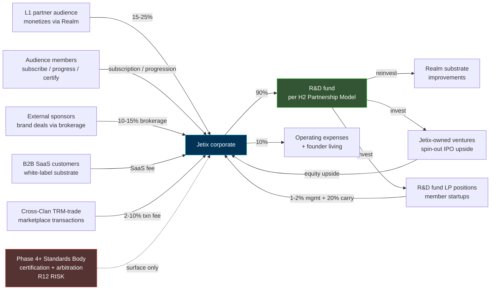
```mermaid
flowchart LR
    A[L1 partner audience<br/>monetizes via Realm]
    B[Audience members<br/>subscribe / progress / certify]
    C[External sponsors<br/>brand deals via brokerage]
    D[B2B SaaS customers<br/>white-label substrate]
    E[Cross-Clan TRM-trade<br/>marketplace transactions]
    F[Jetix-owned ventures<br/>spin-out IPO upside]
    G[R&D fund LP positions<br/>member startups]
    H[Phase 4+ Standards Body<br/>certification + arbitration<br/>R12 RISK]

    A -->|15-25%| JETIX[Jetix corporate]
    B -->|subscription / progression| JETIX
    C -->|10-15% brokerage| JETIX
    D -->|SaaS fee| JETIX
    E -->|2-10% txn fee| JETIX
    F -->|equity upside| JETIX
    G -->|1-2% mgmt + 20% carry| JETIX
    H -.->|surface only| JETIX

    JETIX -->|90%| RDFUND[R&D fund<br/>per H2 Partnership Model]
    JETIX -->|10%| OPS[Operating expenses<br/>+ founder living]

    RDFUND -->|reinvest| SUBSTRATE[Realm substrate<br/>improvements]
    RDFUND -->|invest| F
    RDFUND -->|invest| G

    style JETIX fill:#003355,stroke:#0099cc,color:#fff
    style H fill:#553333,stroke:#cc4444,color:#fff
    style RDFUND fill:#335533,stroke:#44cc44,color:#fff
```

### §4.8 R12 audit matrix

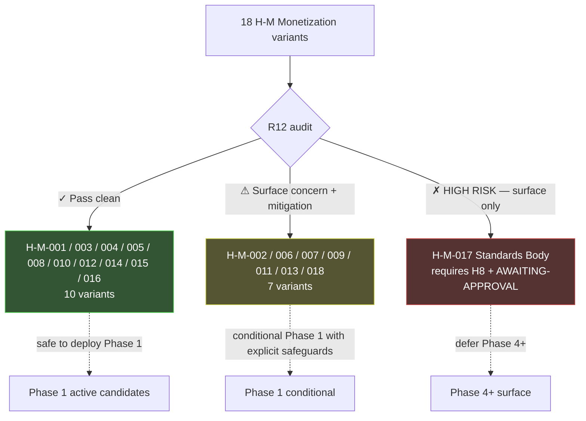
```mermaid
flowchart TD
    HM[18 H-M Monetization variants] --> SORT{R12 audit}
    SORT -->|✓ Pass clean| PASS[H-M-001 / 003 / 004 / 005 / 008 / 010 / 012 / 014 / 015 / 016<br/>10 variants]
    SORT -->|⚠ Surface concern + mitigation| MID[H-M-002 / 006 / 007 / 009 / 011 / 013 / 018<br/>7 variants]
    SORT -->|✗ HIGH RISK — surface only| FAIL[H-M-017 Standards Body<br/>requires H8 + AWAITING-APPROVAL]

    PASS -.->|safe to deploy Phase 1| DEPLOY[Phase 1 active candidates]
    MID -.->|conditional Phase 1 with explicit safeguards| MITIGATE[Phase 1 conditional]
    FAIL -.->|defer Phase 4+| DEFER[Phase 4+ surface]

    style FAIL fill:#553333,stroke:#cc4444,color:#fff
    style MID fill:#555533,stroke:#cccc44,color:#fff
    style PASS fill:#335533,stroke:#44cc44,color:#fff
```

**Net summary §4.** 18 H-M surfaced. 10 pass R12 clean, 7 surface concern (require explicit mitigation), 1 (Standards Body H-M-017) FAILS R12 — surface only, NOT recommend without Ruslan ack + AWAITING-APPROVAL packet per Tier 2 R12. Phase 1 active deployment candidates: H-M-001 / 003 / 004 / 005 + selected from concern-mitigated set per Ruslan Q-evening. Open Q-001 (which variants Phase 1 ad action) — §14.

---

## §5 Audience Monetization Hypotheses Bank — как audience member зарабатывает (H-A-001..H-A-018)

**Anchor:** Doc 1B §3 audience tier; Charter §6 archetypes; Workshop concept (members as masters); reports/monetization-research-2026-05-14/industry-examples.md §1-7.

### Category 1: Direct work (H-A-001..003)

#### H-A-001: Quest completion bounties

- **Mechanism:** Member completes Realm Quest (real biz task / project deliverable) → bounty from quest sponsor (partner / external client / Jetix R&D fund).
- **Earner:** Member or Clan
- **How much:** €500-€5K per Quest (small) → €5K-€50K (medium) → €50K+ (large multi-member)
- **Precedent:** Bug bounty programs (HackerOne / Bugcrowd: $100-$50K typical); Topcoder competitions; Kaggle prizes; Gitcoin grants
- **R12 alignment:** ✓ — direct work earnings; members keep all (Jetix takes platform fee per H-M-013)
- **Realm anchor:** E4 Quest
- **Provenance:** [src: wiki/concepts/jetix-realm/e4-quest.md | wiki/concepts/game-mechanics/organized-crimes-revenue-split.md | commit 68fa423]

#### H-A-002: Freelance projects through Realm bidding

- **Mechanism:** External clients post projects; members bid (transparent rates + Realm rank visible); win bid → execute → get paid; Jetix takes marketplace fee per H-M-013.
- **Earner:** Member
- **How much:** Hourly €50-€500 / project €1K-€50K (Toptal-tier rates due to Realm vetting + rank visibility)
- **Precedent:** Toptal (3% acceptance; $60-300/hr rates); Upwork; Catalant; Gun.io
- **R12 alignment:** ✓ — member directly earns; Jetix fee transparent per H-M-013
- **Realm anchor:** E4 / E5
- **Provenance:** [src: reports/monetization-research-2026-05-14/industry-examples.md §1 §4 | decisions/JETIX-TRM-MODEL-2026-04-30.md §14 (3% Toptal benchmark) | commit 68fa423]

#### H-A-003: TRM-Lite resource operator earnings

- **Mechanism:** Member offers own TRM resources (audience reach / time / compute / knowledge / capital / team) to other partners' projects; earns retainer or per-engagement.
- **Earner:** Member
- **How much:** €2K-€10K/mo per L1 engagement (Doc 1B L1 retainer); scales L2-L5
- **Precedent:** Fractional CFO / COO / CMO; Reforge expert network; Continuum (fractional execs)
- **R12 alignment:** ✓ — member chooses engagements; no exclusivity required
- **Realm anchor:** E5 Resources
- **Provenance:** [src: decisions/JETIX-TRM-MODEL-2026-04-30.md L1-L3 §11 | commit 68fa423]

### Category 2: Skill acquisition → market sale (H-A-004..006)

#### H-A-004: Mastership credential portable to external market

- **Mechanism:** Member earns Jetix mastership credential (per H-M-008); applies to external job/freelance/equity opportunities at premium (signal value of Jetix-vetted).
- **Earner:** Member (via uplift on external compensation)
- **How much:** 20-50% rate uplift vs unvetted peer (CFA / AWS Certified precedent)
- **Precedent:** CFA charter holders earn 20-50% premium; AWS Certified Solutions Architect = $50-100K salary uplift; LeetCode rank → FAANG offer
- **R12 alignment:** ✓ — credential portable; member owns
- **Realm anchor:** E1 Persona / E2 Class
- **Provenance:** [src: wiki/ideas/jetix-standards-body-h8-candidate-pool.md | reports/monetization-research-2026-05-14/industry-examples.md §9 | commit 68fa423]

#### H-A-005: Specialized skill assessment → external sale of expertise

- **Mechanism:** Member specializes deeply via Realm Quests; assessed by peer + senior; offers expertise as external service.
- **Earner:** Member (consulting / coaching / advisory fees)
- **How much:** €100-€500/hr advisory; €5K-€50K project consulting
- **Precedent:** Reforge experts; Toptal consultants; GLG expert network ($200-1500/hr)
- **R12 alignment:** ✓ — member sells own expertise; Jetix fee on platform brokerage (per H-M-010)
- **Realm anchor:** E2 Class / E1 reputation
- **Provenance:** [src: reports/monetization-research-2026-05-14/industry-examples.md §1 | commit 68fa423]

#### H-A-006: Course / micro-content creation within Realm KB

- **Mechanism:** Member authors course / playbook / template; sells to internal Realm members + external buyers via Jetix marketplace.
- **Earner:** Member
- **How much:** €50-€2K per piece; bundles €5K-€20K
- **Precedent:** Reforge courses; Gumroad creators; Maven cohort courses ($500-2K/cohort); Substack premium posts
- **R12 alignment:** ✓ — member retains IP; Jetix marketplace fee per H-M-013
- **Realm anchor:** E5 Resources (Knowledge sub-resource)
- **Provenance:** [src: wiki/concepts/game-mechanics/ugc-marketplace.md | reports/monetization-research-2026-05-14/industry-examples.md §3 | commit 68fa423]

### Category 3: Peer collaboration (H-A-007..009)

#### H-A-007: Joint ventures within Clan — co-founded products

- **Mechanism:** 2-5 Clan members co-found product; equity split per contribution; Realm Quest infrastructure supports launch.
- **Earner:** Co-founders (equity upside)
- **How much:** 25-50% each co-founder; long-tail equity returns
- **Precedent:** PayPal Mafia rolling co-founders; YC batches co-founding; Pioneer founder cohorts
- **R12 alignment:** ✓ — members own venture entirely; Jetix optional equity per H-M-002
- **Realm anchor:** E3 Clan
- **Provenance:** [src: H7 People-NS §6 PayPal Mafia precedent | commit 68fa423]

#### H-A-008: Collaborative consulting — 2-3 members → larger client engagement

- **Mechanism:** Two or three members combine specialties для larger client (что не мог бы один); split fees pre-agreed.
- **Earner:** Member team
- **How much:** €30K-€500K total engagement / each member receives proportional share
- **Precedent:** McKinsey project teams; small-firm consulting partnerships
- **R12 alignment:** ✓ — direct collaboration; Realm matchmaking fee per H-M-010
- **Realm anchor:** E3 Clan
- **Provenance:** [src: decisions/JETIX-CORPORATION-2026-05-05.md Phase 3 community of workshops | commit 68fa423]

#### H-A-009: Cross-Clan strategic partnership formation

- **Mechanism:** Members from different Clans form strategic partnership / venture; cross-Clan synergy bonus from Realm pool (H-F-001).
- **Earner:** Partnering members + 5% Realm-pool bonus
- **How much:** Variable per partnership scope
- **Precedent:** Cross-firm partnerships (e.g., Boston Consulting × McKinsey cross-recruit); Bankless × Optimism collaborations
- **R12 alignment:** ✓ — cross-Clan voluntary; bonus encourages cooperation
- **Realm anchor:** E3 Clan / Federation
- **Provenance:** [src: H-F-001 federation hypothesis (this doc §7) | commit 68fa423]

### Category 4: Mentor + apprentice cascade (H-A-010..012)

#### H-A-010: Mentorship monetary stake — mentor earns % of apprentice external earnings

- **Mechanism:** Mentor M sponsors apprentice A in Realm; A earns external income; A pays % to M (voluntary; recommended 5-15%; capped 2 years post-completion).
- **Earner:** Mentor + apprentice
- **How much:** 5-15% of apprentice external income capped 2y
- **Precedent:** Lambda School / Bloom Institute outcomes-based; Pathrise income share; Lambda first-year graduates pay 17% of salary up to $30K cap
- **R12 alignment:** ⚠ surfaces concern — apprentice-payment to mentor risks extraction; mitigation: cap + voluntary + 2y limit + fork-and-leave terminates obligation
- **Realm anchor:** E1 Persona (mentor record)
- **Provenance:** [src: wiki/sources/jetix-tyson-mentorship-pattern (if exists) | decisions/STRATEGIC-INSIGHT-TYSON-MENTORSHIP-PATTERN-2026-05-10.md | commit 68fa423]

#### H-A-011: Apprentice placement commission — mentor finds external role; both earn

- **Mechanism:** Mentor introduces apprentice to external job/freelance role; both earn placement bonus from external party.
- **Earner:** Mentor (commission) + apprentice (salary/fee)
- **How much:** 5-10% of first-year compensation as placement bonus
- **Precedent:** Standard recruiter commissions (15-25% first-year salary); Realm version simpler (5-10% — less than recruiter)
- **R12 alignment:** ✓ — paid by external party, not apprentice; mentor incentivized to place high-quality
- **Realm anchor:** E1 Persona / cross-Clan
- **Provenance:** [src: reports/monetization-research-2026-05-14/industry-examples.md §9 CrossFit affiliate model parallel | commit 68fa423]

#### H-A-012: Group mentorship cohorts — small group fee → distributed mentor pool

- **Mechanism:** 5-15 apprentices form cohort; pay fee; multiple mentors share teaching load + share fee.
- **Earner:** Mentor pool
- **How much:** €1K-€5K per apprentice per cohort × 5-15 apprentices = €5K-€75K cohort pool
- **Precedent:** Maven cohort courses; Reforge cohorts; YC batches (mentor-paid via equity)
- **R12 alignment:** ✓ — explicit fee-for-cohort model; transparent
- **Realm anchor:** E3 Clan / cohort
- **Provenance:** [src: reports/monetization-research-2026-05-14/industry-examples.md §3 (Maven precedent) | commit 68fa423]

### Category 5: Marketplace participation (H-A-013..015)

#### H-A-013: Realm goods — templates / playbooks / tools / KB contributions

- **Mechanism:** Member creates Realm goods (digital products); sells via Realm marketplace.
- **Earner:** Member
- **How much:** €20-€500 per item; bundles €1K-€10K
- **Precedent:** Gumroad creators; Etsy digital downloads; Notion template marketplace
- **R12 alignment:** ✓ — member retains IP; Jetix marketplace fee per H-M-013
- **Realm anchor:** E5 Resources
- **Provenance:** [src: wiki/concepts/game-mechanics/ugc-marketplace.md | commit 68fa423]

#### H-A-014: Realm services — workshops / coaching / consulting offered to outside

- **Mechanism:** Member offers paid service (workshop / 1:1 coaching / consulting) to external clients via Realm marketplace.
- **Earner:** Member
- **How much:** €200-€5K per session/workshop; €5K-€50K per consulting engagement
- **Precedent:** Maven 1:1 sessions; Calendly-based coaching; freelance consulting platforms
- **R12 alignment:** ✓ — direct member-to-client; Jetix fee per H-M-013 / H-M-010 brokerage
- **Realm anchor:** E5 / E4
- **Provenance:** [src: reports/monetization-research-2026-05-14/industry-examples.md §1 §3 | commit 68fa423]

#### H-A-015: Audience-rental — member with own audience rents reach to Clan for joint quests

- **Mechanism:** Member who has external audience (own YouTube channel / Telegram / newsletter) rents reach to Clan for joint Quests / launches; receives fee + Realm rank credit.
- **Earner:** Audience-holding member
- **How much:** €500-€10K per campaign (industry-standard influencer rates)
- **Precedent:** YouTube channel sponsorship integration; cross-promotion deals; podcast guest barter
- **R12 alignment:** ✓ — voluntary; member retains audience ownership; Jetix doesn't touch member's audience directly
- **Realm anchor:** E5 Resources (Audience sub-resource)
- **Provenance:** [src: wiki/concepts/game-mechanics/crossover-collaborations.md | reports/voice-batch-2026-05-13-14-ideas-report.md Bucket 2.3 Influencer-anchored Clans | commit 68fa423]

### Category 6: Reputation premium (H-A-016..018)

#### H-A-016: Realm rank → external freelance rate uplift

- **Mechanism:** Member's Realm rank visible externally; freelance buyers pay premium for high-rank members.
- **Earner:** Member
- **How much:** 20-50% rate uplift (Toptal vetted-engineer precedent)
- **Precedent:** LeetCode rank → FAANG offer; Toptal top-3% rate uplift; AngelList platinum profiles
- **R12 alignment:** ✓ — member's earned reputation
- **Realm anchor:** E1 Persona
- **Provenance:** [src: reports/monetization-research-2026-05-14/industry-examples.md §1 §4 | commit 68fa423]

#### H-A-017: Realm reputation → speaking / advisory fees

- **Mechanism:** High-rank members invited to external speaking / advisory roles; charge premium fees.
- **Earner:** Member
- **How much:** €5K-€50K per speaking engagement; €5K-€100K/y advisory retainer
- **Precedent:** Conference keynotes (TED / Disrupt — $25K-$100K); board advisory (1-2% common equity); GLG expert network ($1K-$5K/hr)
- **R12 alignment:** ✓ — external opportunities; member directly compensated
- **Realm anchor:** E1 Persona
- **Provenance:** [src: reports/monetization-research-2026-05-14/industry-examples.md §1 | commit 68fa423]

#### H-A-018: Realm reputation → equity / investor introduction premium

- **Mechanism:** High-rank members get warm intros to investors / co-founders / employees; reduces transaction cost; preferential equity terms.
- **Earner:** Member (founder equity / employee stock)
- **How much:** 1-5% better equity terms vs unwarmed approach; transaction cost reduction
- **Precedent:** YC alumni network warm intros; PayPal Mafia recurring co-founding; Pioneer demo days
- **R12 alignment:** ✓ — voluntary introduction network; no extraction
- **Realm anchor:** E1 / cross-Clan
- **Provenance:** [src: H7 People-NS §6 PayPal Mafia precedent | commit 68fa423]

### §5.19 Member earning paths diagram

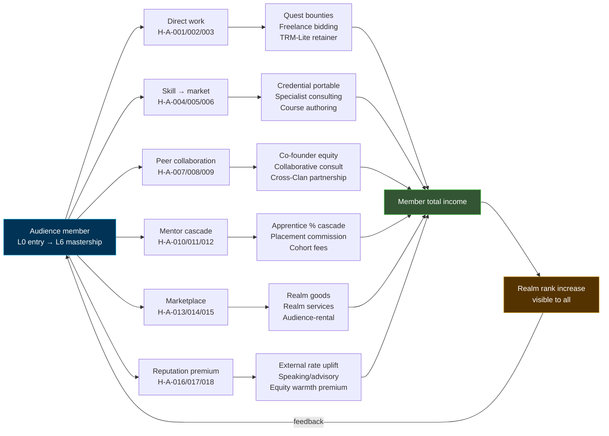
```mermaid
flowchart LR
    M[Audience member<br/>L0 entry → L6 mastership]

    M --> C1[Direct work<br/>H-A-001/002/003]
    M --> C2[Skill → market<br/>H-A-004/005/006]
    M --> C3[Peer collaboration<br/>H-A-007/008/009]
    M --> C4[Mentor cascade<br/>H-A-010/011/012]
    M --> C5[Marketplace<br/>H-A-013/014/015]
    M --> C6[Reputation premium<br/>H-A-016/017/018]

    C1 --> E1[Quest bounties<br/>Freelance bidding<br/>TRM-Lite retainer]
    C2 --> E2[Credential portable<br/>Specialist consulting<br/>Course authoring]
    C3 --> E3[Co-founder equity<br/>Collaborative consult<br/>Cross-Clan partnership]
    C4 --> E4[Apprentice % cascade<br/>Placement commission<br/>Cohort fees]
    C5 --> E5[Realm goods<br/>Realm services<br/>Audience-rental]
    C6 --> E6[External rate uplift<br/>Speaking/advisory<br/>Equity warmth premium]

    E1 --> INCOME[Member total income]
    E2 --> INCOME
    E3 --> INCOME
    E4 --> INCOME
    E5 --> INCOME
    E6 --> INCOME

    INCOME --> RANK[Realm rank increase<br/>visible to all]
    RANK -->|feedback| M

    style M fill:#003355,stroke:#0099cc,color:#fff
    style INCOME fill:#335533,stroke:#44cc44,color:#fff
    style RANK fill:#553300,stroke:#cc9900,color:#fff
```

**Net summary §5.** 18 H-A surfaced across 6 categories. Member can pursue 1-6 paths simultaneously; cumulative income at L5+ realistic €100K-€500K/y (similar to senior independent consultant — но с Realm reputation premium + cooperation enabling team plays). All 18 pass R12 with H-A-010 single concern flag (mentorship cascade cap requirement).

---

## §6 Cooperation Mechanics Bank — как audience members кооперируются (H-C-001..H-C-018)

**Anchor:** H7 People-NS §3 M-A/M-B/M-C mechanisms; Charter §3 Seasons + §4 anti-poach; H6 Gamified Realm E1-E6; reports/monetization-research-2026-05-14/game-mechanics-mapping.md §14.

**Cooperation cascade map** — каждый H-C anchored к одному из 7 sub-mechanisms из §3 (Layer 1-4):

### Category 1: Repeated game with visible reputation (M-A formalized) (H-C-001..003)

#### H-C-001: Realm rank visibility — every action affects visible rank

- **Mechanism:** Каждое member action (Quest completion / mentor offer / Clan contribution / defection signal) recorded → updates E1 Persona stats → visible to all Realm.
- **Why it works (game-theory):** Layer 2 (M-B) reputation cascade; Schelling focal point (rank as common knowledge); Nash signaling equilibrium (high-rank = high-trust).
- **Realm implementation:** Algorithmic + peer-review combo for rank; algorithm transparent (Q-003 open); rank trajectory visible (not just snapshot).
- **Precedent:** GitHub contributions graph; Stack Overflow reputation; LeetCode rank; League of Legends MMR; LinkedIn All-Star
- **Provenance:** [src: wiki/concepts/jetix-realm/e1-persona.md | H7 People-NS §3 M-B | commit 68fa423]

#### H-C-002: Season retrospection — forced reflection on past behavior

- **Mechanism:** End of Season 3-month → 1-week retrospection. Clan reviews: what worked / who carried / what to improve. Forgiveness window per Axelrod (after retro Q1, slate clean for Q2 — within bounds).
- **Why it works:** Layer 1 (M-A) repeated game with explicit iteration boundary; Axelrod forgiveness mechanism (avoids spiral retaliation); ритуал creates Schelling focal point for "fresh start".
- **Realm implementation:** Mandatory Clan retro at week 13; written + audio; archived in Clan KB; informs next Season Quest design.
- **Precedent:** Agile sprint retrospectives; military After-Action Reviews (AAR); Burning Man theme camp post-event debriefs; Mondragón annual review
- **Provenance:** [src: decisions/JETIX-FIRST-CLAN-CHARTER-2026-05-12.md §3 Seasons | wiki/concepts/game-theory/iterated-prisoners-dilemma.md | commit 68fa423]

#### H-C-003: Long-cycle commitment — Charter signing → 10-15y operational horizon

- **Mechanism:** Charter signing ритуал = explicit commitment to 10-15y operational horizon (per Charter LOCKED). Multi-year horizon → defection discount factor low → cooperation rational.
- **Why it works:** Layer 1 (M-A) extended; folk theorem of repeated games (long-enough horizon makes cooperation Nash equilibrium per Axelrod / Nowak).
- **Realm implementation:** Charter signing event (ритуал); annual recommitment (signing renewal); visible signatory list (public commitment).
- **Precedent:** Mondragón 60-year cooperative membership; Patek Philippe ad campaign "You never actually own..."; military commission (4-20y commitment)
- **Provenance:** [src: decisions/JETIX-FIRST-CLAN-CHARTER-2026-05-12.md L0-L6 timeline | wiki/concepts/game-theory/cooperation-emerges-iterated-games.md | commit 68fa423]

### Category 2: Group accountability (Faction / Clan) (H-C-004..006)

#### H-C-004: Clan reputation — member action affects Clan rank

- **Mechanism:** Each member action affects own E1 rank AND Clan E3 collective rank. Free-riding within Clan → Clan rank drop → other members pressure to expel/correct.
- **Why it works:** Group-level reputation creates peer pressure (Layer 2 M-B amplified); shifts enforcement from substrate-imposed to peer-imposed.
- **Realm implementation:** Clan rank = weighted aggregate of member ranks + collective Quest completion; Clan rank visible to all Realm.
- **Precedent:** Sports team rankings (collective performance); guild reputation in EVE Online / WoW; military unit honor (collective punishment); academic department rankings (REF / publication aggregate)
- **Provenance:** [src: wiki/concepts/jetix-realm/e3-clan.md | wiki/claims/clan-mechanics-amplify-engagement.md | commit 68fa423]

#### H-C-005: Faction-level standings — Clan affects Realm-wide standings

- **Mechanism:** Multiple Clans aggregate into Faction (Phase 2-3 scale); Faction-level rankings visible Realm-wide; cross-Faction reputation amplifies cooperation within and competition between.
- **Why it works:** Schelling focal points scaling (Faction colors / motto / ритуалы); Allport intergroup contact theory (positive intergroup contact reduces conflict when conditions met).
- **Realm implementation:** Phase 2+; Faction = ~10 Clans aggregated; Faction Council with rotating leadership; Faction-wide Quests.
- **Precedent:** Pokémon GO teams (Mystic/Valor/Instinct); EVE Online alliances; sports leagues (NFL conferences); university Greek system fraternity competition; British Public School "Houses" (Hogwarts pattern)
- **Provenance:** [src: H7 People-NS §3 (alliance precedent) | reports/monetization-research-2026-05-14/game-mechanics-mapping.md §9 (Pokémon teams) | commit 68fa423]

#### H-C-006: Mutual no-poach 12mo (Charter §4 anti-poach clause)

- **Mechanism:** Signatories mutually agree no-poach within 12 months of any member's exit. Reduces fear of being raided; enables vulnerability в cooperation.
- **Why it works:** Reduces information asymmetry attack vector; creates Schelling commitment to mutual respect.
- **Realm implementation:** Explicit Charter clause (already LOCKED v0); enforcement = brand damage (visible breach → reputation drop); legal enforcement secondary.
- **Precedent:** Silicon Valley illegal no-poach agreement (Apple/Google 2010 — settled $415M, anti-pattern legal-wise); legitimate version: WME / CAA / Endeavor industry norm
- **Caveat:** Must navigate antitrust (DOJ v Adobe / Apple / Google 2014 settlement); explicit voluntary opt-in only
- **Provenance:** [src: decisions/JETIX-FIRST-CLAN-CHARTER-2026-05-12.md §4 mutual no-poach LOCKED | commit 68fa423]

### Category 3: Shared brand identity (H-C-007..009)

#### H-C-007: Charter signing as identity affirmation

- **Mechanism:** Charter signing = ритуальный entry; public commitment; visible signatory record. Identity affirmation through public commitment (cognitive dissonance theory).
- **Why it works:** Cialdini commitment+consistency principle; identity-action congruence drives sustained behavior.
- **Realm implementation:** Charter signing event (video / written / public); signatory list maintained; renewal cadence annual.
- **Precedent:** US Constitution signers (history museum exhibit); 1KCB founders Charter; YC Demo Day group photo; military oath of enlistment
- **Provenance:** [src: decisions/JETIX-FIRST-CLAN-CHARTER-2026-05-12.md signing protocol | wiki/sources/influence-cialdini | commit 68fa423]

#### H-C-008: Manifest pattern — cooperative thesis vs legacy substrate

- **Mechanism:** Per H2 Partnership Model — Jetix recruits partners through manifesto-style thesis (NOT legacy consulting sell). Partners self-identify with cooperative thesis ("progressive leader" — H2 §3.3).
- **Why it works:** Self-selection: only those who resonate with thesis sign; pre-filters for cooperation orientation.
- **Realm implementation:** Charter manifest = entry filter; pitch doc + video script ritualize entry; signatories self-affirm thesis publicly.
- **Precedent:** Burning Man 10 Principles (entry filter); CrossFit affiliate brand commitment; OpenAI Charter (mission-driven hires); B Corp certification
- **Provenance:** [src: decisions/STRATEGIC-INSIGHT-JETIX-PARTNERSHIP-MODEL-2026-05-10.md §3.3 Manifest pattern | commit 68fa423]

#### H-C-009: Realm 6 archetypes — member self-identifies

- **Mechanism:** 6 archetypes (Hunter/Guardian/Scholar/Creator/Architect/Merchant) per Charter + H6. Each member picks 1-2 (primary + secondary); identity-action congruence drives sustained engagement.
- **Why it works:** Identity formation (member self-image as "I'm a Jetix Hunter"); Schelling focal points (archetype-as-coordination-shortcut).
- **Realm implementation:** Onboarding assessment → archetype selection; archetype-specific Quest pools; cross-archetype collaboration encouraged via Joint Quests.
- **Precedent:** Myers-Briggs (cult-of-MBTI); D&D character classes; Pokémon teams; Harry Potter Houses; Hogwarts sorting
- **Provenance:** [src: decisions/JETIX-FIRST-CLAN-CHARTER-2026-05-12.md §6 archetypes | decisions/STRATEGIC-INSIGHT-JETIX-AS-GAMIFIED-PLATFORM-2026-05-11.md E2 Class | commit 68fa423]

### Category 4: Cooperation rewards (H-C-010..012)

#### H-C-010: Joint Quest revenue split — organized-crimes model

- **Mechanism:** Multi-member Quest pays out bonus to participating members (80/20 split or similar per Torn organized-crimes precedent). Cooperative completion > solo completion.
- **Why it works:** Direct material reward for cooperation; mechanism design (Layer 1 + Layer 2 combined).
- **Realm implementation:** Quest design tag «joint» triggers reward split formula; high-reputation members get higher split share (rank weighting).
- **Precedent:** Torn organized crimes 80/20; WoW raid loot distribution (DKP / Suicide Kings systems); EVE corp fleet ops; Mondragón surplus distribution
- **Provenance:** [src: reports/monetization-research-2026-05-14/game-mechanics-mapping.md §1 Torn | wiki/concepts/game-mechanics/organized-crimes-revenue-split.md | commit 68fa423]

#### H-C-011: Cross-Clan synergy bonuses

- **Mechanism:** Cross-Clan Joint Quests trigger Realm-pool synergy bonus (5-10% additional). Incentivizes federation over intra-Clan closure.
- **Why it works:** Layer 2 (M-B) scaled across Clans; reduces Clan-vs-Clan competition; encourages alliance formation.
- **Realm implementation:** Quest tag «cross-Clan» (involves members from ≥2 Clans) triggers bonus from Realm operating budget.
- **Precedent:** EVE Online alliance ops (large-scale fleet); WoW guild alliances on PvP server raids; cross-faction esports collaborations
- **Provenance:** [src: §7 H-F-001 (this doc) | wiki/concepts/game-mechanics/corporation-alliance-mechanic.md | commit 68fa423]

#### H-C-012: Community contribution rewards — KB authoring, mentor cascade, etc.

- **Mechanism:** Members earn Realm reputation for non-revenue contributions (KB documentation / mentor hours / community moderation / event organization). Rep credits convertible to: rank acceleration / TRM resource credits / Quest priority access.
- **Why it works:** Rewards orthogonal contributions (Layer 4 identity layer); prevents free-riding on community goods.
- **Realm implementation:** Contribution tracking (commit logs / mentor hour tally / event organizing); periodic Council review for credit assignment.
- **Precedent:** Wikipedia editor reputation; Stack Overflow rep; Reddit karma; Discord level bots; Gitcoin retroactive funding
- **Provenance:** [src: reports/monetization-research-2026-05-14/industry-examples.md §7 (Gitcoin RPGF / Optimism) | commit 68fa423]

### Category 5: Defection penalties (H-C-013..014)

#### H-C-013: Rank decay on idleness or extraction behavior

- **Mechanism:** Inactive / extractive members → rank decay (e.g., 1 tier drop per Season of idleness; 2-tier drop on confirmed extraction).
- **Why it works:** Use-it-or-lose-it dynamic; prevents accumulation of dormant prestige; creates ongoing engagement incentive.
- **Realm implementation:** Algorithmic decay (config-driven); Council can pause decay for sabbatical members (with explicit declaration); appeal process.
- **Precedent:** League of Legends rank decay; CFA recertification; AWS cert expiration; Estonia e-residency renewal
- **Provenance:** [src: reports/monetization-research-2026-05-14/game-mechanics-mapping.md §11 (LoL ranked decay) | commit 68fa423]

#### H-C-014: Realm exclusion — extreme cases; fork-and-leave still allowed per R12

- **Mechanism:** Severe violations (fraud / harassment / repeated extraction) → Council vote → Realm exclusion. R12 preserves: excluded member keeps own IP / rank earned + can fork-and-start (with stigma) elsewhere.
- **Why it works:** Last-resort deterrent; visible punishment for defection at scale.
- **Realm implementation:** Council vote (supermajority 2/3+); appeal process; public record of exclusion + reason; fork-and-leave preserves IP per R12.
- **Precedent:** Wikipedia editor ban; Stack Overflow account suspension; corporate ethics committee dismissal; Mondragón cooperative expulsion (very rare)
- **Provenance:** [src: H7 People-NS R12 enforcement | swarm/awaiting-approval/r12-anti-extraction-2026-05-12.md | commit 68fa423]

### Category 6: Identity formation (H-C-015..016)

#### H-C-015: "I'm a Jetix Hunter" — self-image cooperation incentive

- **Mechanism:** Member adopts identity ("I am a Jetix [archetype]") which embeds cooperative norms by self-image rather than external rule. Identity-driven behavior is more resilient than rule-following.
- **Why it works:** Cognitive dissonance theory (action-identity alignment); Layer 4 (orthogonal identity).
- **Realm implementation:** Archetype-specific lore / mythology; visible identity markers (rank badges / Clan colors / titles); member bio includes identity statement.
- **Precedent:** Marines "Once a Marine, always a Marine"; CrossFit "Crossfitter" identity; Apple cult identity; Burning Man "Burner"; Harvard alum "Harvard man"
- **Provenance:** [src: wiki/sources/loehr-power-of-story-2007 (TBD-fetch) | wiki/sources/jetix-tyson-mentorship-pattern (if exists) | commit 68fa423]

#### H-C-016: Rituals — Season opening / Charter signing / Quest celebration

- **Mechanism:** Recurring ritual events (Season start / Charter signing renewal / Quest celebration) reinforce identity + community bonds. Rituals create predictable Schelling focal points + emotional anchoring.
- **Why it works:** Anthropological universal (Durkheim collective effervescence); Layer 4 identity reinforcement; Schelling focal points (everyone knows when ritual happens).
- **Realm implementation:** Calendar of recurring rituals (4 Season events / 1 annual Charter renewal / quest-completion celebrations); video / in-person hybrid.
- **Precedent:** Burning Man 10 Principles + Effigy burn; Mondragón annual Cooperative Day; CrossFit Open Friday workouts; military formation rituals; Apple WWDC keynote
- **Provenance:** [src: reports/monetization-research-2026-05-14/industry-examples.md §11 Burning Man / §10 Apple / §9 CrossFit | commit 68fa423]

### Category 7: Friendship + life-improvement (H-C-017..018) — Layer 4 orthogonal incentive

#### H-C-017: Real-life friendship layer — orthogonal incentive

- **Mechanism:** Beyond formal cooperation mechanics, real friendships form within Clan (Dunbar 10-100 layer per voice batch Bucket 4.1); friendship loyalty operates orthogonal to material incentives.
- **Why it works:** Layer 4 — friendship is intrinsic; resilient to short-term material disruption; provides emotional cooperation when material incentives temporarily lower.
- **Realm implementation:** In-person events (Phase 2+); small-Clan size (3-10 per Charter); off-Realm informal communication channels permitted (Realm ≠ surveillance state).
- **Precedent:** PayPal Mafia friendships → recurring co-founding; military buddy bonds (combat unit cohesion); college fraternity / sorority lifelong networks
- **Provenance:** [src: reports/voice-batch-2026-05-13-14-ideas-report.md Bucket 4.1 Dunbar layer | H7 People-NS §6 PayPal Mafia | commit 68fa423]

#### H-C-018: Life-improvement metrics — TRM 6 resources tracked at member level

- **Mechanism:** Member's own TRM 6 resources (Capital / Time / Audience / Knowledge / Compute / Team / +Body/Charisma if accepted) tracked; growth in TRM = life improvement; visible to member (personal dashboard).
- **Why it works:** Layer 4 — intrinsic life-improvement incentive; aligns Realm engagement с member's own life goals; reduces extraction perception (member sees own growth).
- **Realm implementation:** Personal TRM dashboard (private to member by default; shareable for mentor / Council); periodic check-ins; alignment with life goals (Q-evening for member, similar to Ruslan's owner cadence).
- **Precedent:** Strava annual stats; LinkedIn skill assessments; Stoic philosophy "examined life"; CrossFit benchmark workouts (Fran / Grace / Helen — track personal progress)
- **Provenance:** [src: decisions/JETIX-TRM-MODEL-2026-04-30.md 6 resources | reports/voice-batch-2026-05-13-14-ideas-report.md Bucket 3.1 embodiment dimension | commit 68fa423]

### §6.19 Cooperation cascade map

```mermaid
flowchart TD
    M[Member action]

    M --> L1[Layer 1: Repeated game M-A]
    M --> L2[Layer 2: Visible reputation M-B]
    M --> L3[Layer 3: R12 anti-extraction M-C]
    M --> L4[Layer 4: Identity + friendship]

    L1 --> HC1[H-C-001 Realm rank visibility]
    L1 --> HC2[H-C-002 Season retrospection]
    L1 --> HC3[H-C-003 Long-cycle commitment]

    L2 --> HC4[H-C-004 Clan reputation]
    L2 --> HC5[H-C-005 Faction standings]
    L2 --> HC6[H-C-006 Mutual no-poach 12mo]
    L2 --> HC10[H-C-010 Joint Quest revenue split]
    L2 --> HC11[H-C-011 Cross-Clan synergy bonus]
    L2 --> HC12[H-C-012 Community contribution rewards]

    L3 --> HC13[H-C-013 Rank decay]
    L3 --> HC14[H-C-014 Realm exclusion + fork-and-leave]

    L4 --> HC7[H-C-007 Charter signing identity]
    L4 --> HC8[H-C-008 Manifest pattern]
    L4 --> HC9[H-C-009 6 archetypes]
    L4 --> HC15[H-C-015 Self-image identity]
    L4 --> HC16[H-C-016 Rituals]
    L4 --> HC17[H-C-017 Real friendship]
    L4 --> HC18[H-C-018 Life-improvement TRM]

    HC1 --> COOP[Cooperation equilibrium<br/>sustained at scale]
    HC2 --> COOP
    HC3 --> COOP
    HC4 --> COOP
    HC5 --> COOP
    HC6 --> COOP
    HC10 --> COOP
    HC11 --> COOP
    HC12 --> COOP
    HC13 --> COOP
    HC14 --> COOP
    HC7 --> COOP
    HC8 --> COOP
    HC9 --> COOP
    HC15 --> COOP
    HC16 --> COOP
    HC17 --> COOP
    HC18 --> COOP

    style COOP fill:#003355,stroke:#0099cc,color:#fff
    style L3 fill:#553300,stroke:#cc9900,color:#fff
```

### §6.20 Defection penalty graph

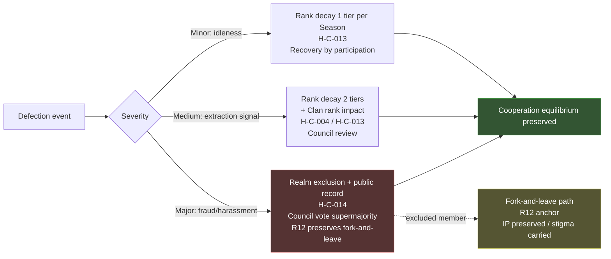
```mermaid
flowchart LR
    A[Defection event] --> SIZE{Severity}

    SIZE -->|Minor: idleness| MIN[Rank decay 1 tier per Season<br/>H-C-013<br/>Recovery by participation]
    SIZE -->|Medium: extraction signal| MED[Rank decay 2 tiers<br/>+ Clan rank impact<br/>H-C-004 / H-C-013<br/>Council review]
    SIZE -->|Major: fraud/harassment| MAJ[Realm exclusion + public record<br/>H-C-014<br/>Council vote supermajority<br/>R12 preserves fork-and-leave]

    MIN --> COOP[Cooperation equilibrium preserved]
    MED --> COOP
    MAJ --> COOP

    MAJ -.->|excluded member| FORK[Fork-and-leave path<br/>R12 anchor<br/>IP preserved / stigma carried]

    style MAJ fill:#553333,stroke:#cc4444,color:#fff
    style FORK fill:#555533,stroke:#cccc44,color:#fff
    style COOP fill:#335533,stroke:#44cc44,color:#fff
```

**Net summary §6.** 18 H-C surfaced across 7 sub-categories mapped to 4 cooperation layers. All 18 align with R12 — defection penalties preserve fork-and-leave (no lock-in punishment). Phase 1 priority H-C-001 / 002 / 003 / 007 / 009 / 010 (foundational); Phase 2+ adds H-C-005 / 011 / 016 (scale-dependent).

---

## §7 Cross-Audience Federation Mechanics (H-F-001..H-F-010)

**Anchor:** H7 People-NS §6 federation precedents (Mondragón 96 cooperatives; PayPal Mafia ecosystem); voice batch Bucket 4.5 audience-isolation gap; reports/monetization-research-2026-05-14/industry-examples.md §8 Mondragón federation.

#### H-F-001: Joint Quests across Clans

- **Mechanism:** Quest design tag «cross-Clan»; involves members from ≥2 Clans; revenue split + cross-Clan synergy bonus (per H-C-011).
- **Why it works:** Material reward for cross-Clan cooperation; reduces inter-Clan rivalry; enables larger scope Quests than single Clan capacity.
- **Realm implementation:** Quest board with cross-Clan filter; Clan leadership co-signs participation; Council monitors balance (avoid favored cross-Clan combos).
- **Precedent:** EVE Online alliance ops; WoW guild alliances; Mondragón inter-cooperative committees
- **Provenance:** [src: §6 H-C-011 | reports/monetization-research-2026-05-14/industry-examples.md §8 | commit 68fa423]

#### H-F-002: Realm rank portability — rank moves with member when changing Clans

- **Mechanism:** Member changing Clans (rare event) carries earned rank + reputation history; receives small transition penalty (10-20% rank reduction) to prevent gaming.
- **Why it works:** Reduces switching cost between Clans → enables fluid talent allocation; prevents «Clan lock-in» extraction.
- **Realm implementation:** Member request → both Clan leaderships ack → Council approval; rank history preserved; new Clan onboarding short (1 Season).
- **Precedent:** Sports league trade systems; EVE Online corp changes; academic department transfers
- **Provenance:** [src: wiki/concepts/jetix-realm/e3-clan.md | wiki/concepts/game-mechanics/corporation-alliance-mechanic.md | commit 68fa423]

#### H-F-003: Cross-Clan partnership formation protocol

- **Mechanism:** 2 Clans formally partner (alliance) for specific scope / Season / venture; share resources + reward split formula pre-agreed.
- **Why it works:** Enables larger-scope ventures than single Clan; explicit protocol reduces conflict.
- **Realm implementation:** Partnership Charter v0 template (subset of First Clan Charter); Council registration; Season-scope or longer.
- **Precedent:** Corporate joint ventures; EVE Online "blue-list" alliance mechanic; Star Trek Federation member states
- **Provenance:** [src: H-F-001 + H-C-011 cross-Clan synergy | commit 68fa423]

#### H-F-004: Realm-wide events / seasons

- **Mechanism:** Realm-wide Season cycle (synchronized 3-month per Charter); seasonal narrative + cross-Clan leaderboards + Realm-wide Quest pool.
- **Why it works:** Synchronization point (Schelling focal time); creates Realm-wide identity beyond Clan; enables cross-Clan rivalry+cooperation.
- **Realm implementation:** Quarterly Season cycles (Q1 / Q2 / Q3 / Q4 of year); annual major event (Realm-wide gathering Phase 2+).
- **Precedent:** Fortnite seasonal narrative; LoL Worlds annual; Apple WWDC June; Mondragón annual Cooperative Day
- **Provenance:** [src: decisions/JETIX-FIRST-CLAN-CHARTER-2026-05-12.md §3 Seasons | reports/monetization-research-2026-05-14/game-mechanics-mapping.md §6 Fortnite | commit 68fa423]

#### H-F-005: Shared infrastructure — KB / tooling / templates

- **Mechanism:** Realm-wide shared infrastructure: KB / tooling / templates / methodology library (Foundation Part 3 LOCKED — Knowledge Base & Methodology Library).
- **Why it works:** Reduces per-Clan duplication; enables network effects (more Clans → richer shared KB → more value per Clan).
- **Realm implementation:** Foundation Part 3 LOCKED infrastructure; KB versioning + contribution credits (H-C-012); access tier by rank.
- **Precedent:** Mondragón shared services; Wikipedia + Stack Overflow as commons; Linux kernel shared codebase
- **Provenance:** [src: swarm/wiki/foundations/part-3-knowledge-base-methodology-library/architecture.md (CITE ONLY — R2 forbidden write) | commit 68fa423]

#### H-F-006: Cross-Clan mentorship — mentor outside own Clan

- **Mechanism:** Members can mentor / be mentored across Clans (not restricted to own Clan); cross-Clan mentorship cascade per H-A-010-012.
- **Why it works:** Maximizes mentor-apprentice match quality (best mentor may not be in own Clan); cross-Clan info flow.
- **Realm implementation:** Mentorship registry Realm-wide; Council monitors cross-Clan flow (avoid raiding via mentorship).
- **Precedent:** Academia cross-department advisors; YC alumni cross-batch mentoring; Reforge expert cross-cohort
- **Provenance:** [src: §5 H-A-010-012 mentorship cascade | commit 68fa423]

#### H-F-007: Standardized dispute resolution — Realm Tribunal

- **Mechanism:** Realm Tribunal (rotating members from multiple Clans) mediates inter-Clan disputes; standard protocol; appeal process.
- **Why it works:** Independent third-party resolution avoids Clan-vs-Clan escalation; standardized protocol reduces variance.
- **Realm implementation:** Tribunal seats elected per Season (1y term); standard mediation playbook; H-M-018 fees fund operations.
- **Precedent:** AAA arbitration; ICC International Court; Mondragón Cooperative Court; Estonia e-court
- **Provenance:** [src: §4 H-M-018 | reports/monetization-research-2026-05-14/industry-examples.md §8 §12 | commit 68fa423]

#### H-F-008: Federated identity protocol — Realm passport

- **Mechanism:** Member identity portable across Clans + external services; cryptographic signature (SSI-style); reduces re-onboarding friction.
- **Why it works:** Reduces switching cost; enables Realm reputation portability to external services.
- **Realm implementation:** Phase 2+ digital identity protocol; verifiable credentials standard (W3C DID / VC); decentralised storage.
- **Precedent:** Estonia e-residency digital ID; W3C Verifiable Credentials; OpenID Connect; Microsoft / IBM SSI initiatives
- **Provenance:** [src: reports/monetization-research-2026-05-14/industry-examples.md §12 Estonia e-Residency | commit 68fa423]

#### H-F-009: Inter-Clan trade routes — TRM resource exchange

- **Mechanism:** Clans trade TRM resources (e.g., Clan A's Capital ↔ Clan B's Audience); standardized trade protocols; Jetix takes small fee (H-M-014).
- **Why it works:** Resource specialization → comparative advantage → cross-Clan value creation.
- **Realm implementation:** TRM-trade marketplace Phase 2+; trade execution standard; fee per H-M-014 (2-5%).
- **Precedent:** International trade specialization; EVE Online inter-corp markets; Visa / Mastercard interchange
- **Provenance:** [src: §4 H-M-014 | wiki/concepts/game-mechanics/plex-bridge-mechanic.md | commit 68fa423]

#### H-F-010: Realm-wide leaderboard — global rank visibility

- **Mechanism:** Global Realm-wide leaderboard (ranks visible across all Clans); top 100 / top 1000 lists; periodic refresh.
- **Why it works:** Layer 2 (M-B) scaled Realm-wide; aspirational target for new members; visible "stars" of the system.
- **Realm implementation:** Phase 2+; configurable privacy (member can opt to anonymize global rank); fair-play monitoring.
- **Precedent:** LoL global ranking; Dota 2 ladder; LeetCode global rank; Strava segments leaderboards
- **Provenance:** [src: reports/monetization-research-2026-05-14/game-mechanics-mapping.md §11 LoL ranking | commit 68fa423]

### §7.11 Federation graph

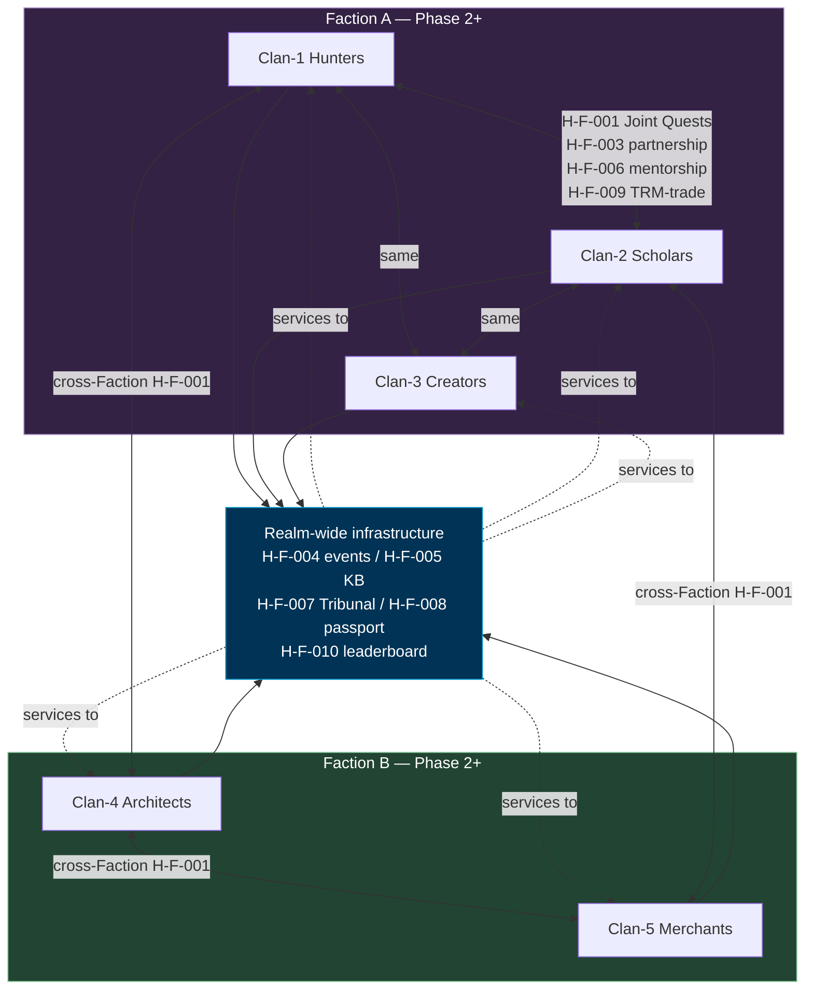
```mermaid
flowchart TB
    subgraph FAC[Faction A — Phase 2+]
        C1[Clan-1 Hunters]
        C2[Clan-2 Scholars]
        C3[Clan-3 Creators]
    end

    subgraph FAB[Faction B — Phase 2+]
        C4[Clan-4 Architects]
        C5[Clan-5 Merchants]
    end

    REALM[Realm-wide infrastructure<br/>H-F-004 events / H-F-005 KB<br/>H-F-007 Tribunal / H-F-008 passport<br/>H-F-010 leaderboard]

    C1 <-->|H-F-001 Joint Quests<br/>H-F-003 partnership<br/>H-F-006 mentorship<br/>H-F-009 TRM-trade| C2
    C1 <-->|same| C3
    C2 <-->|same| C3

    C4 <-->|cross-Faction H-F-001| C1
    C4 <-->|cross-Faction H-F-001| C5
    C5 <-->|cross-Faction H-F-001| C2

    C1 --> REALM
    C2 --> REALM
    C3 --> REALM
    C4 --> REALM
    C5 --> REALM

    REALM -.->|services to| C1
    REALM -.->|services to| C2
    REALM -.->|services to| C3
    REALM -.->|services to| C4
    REALM -.->|services to| C5

    style REALM fill:#003355,stroke:#0099cc,color:#fff
    style FAC fill:#332244,stroke:#aa88cc,color:#fff
    style FAB fill:#224433,stroke:#88cc99,color:#fff
```

### §7.12 Realm rank portability

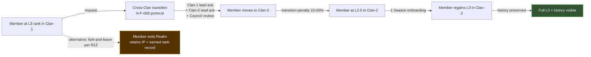
```mermaid
flowchart LR
    M[Member at L3 rank in Clan-1]
    M -->|request| TRANS[Cross-Clan transition<br/>H-F-002 protocol]
    TRANS -->|Clan-1 lead ack<br/>+ Clan-2 lead ack<br/>+ Council review| MOVE[Member moves to Clan-2]
    MOVE -->|transition penalty 10-20%| L25[Member at L2.5 in Clan-2]
    L25 -->|1 Season onboarding| BACK[Member regains L3 in Clan-2]
    BACK -->|history preserved| L3F[Full L3 + history visible]

    M -.->|alternative: fork-and-leave per R12| EXIT[Member exits Realm<br/>retains IP + earned rank record]

    style EXIT fill:#553300,stroke:#cc9900,color:#fff
    style L3F fill:#335533,stroke:#44cc44,color:#fff
```

**Net summary §7.** 10 H-F surfaced. Federation mechanics enable Phase 2+ scaling (Clan → Faction → Realm). Phase 1 priority: H-F-001 (Joint Quests) + H-F-004 (Realm-wide seasons) + H-F-005 (shared KB infrastructure already LOCKED via Foundation Part 3).

---

## §8 Onboarding Funnel Templates (H-O-001..H-O-011)

**Anchor:** Doc 1B §11 L0-L5 ladder; Charter signing protocol; H2 Partnership Model entry; voice batch Bucket 1.4 (2-hour strategy session ask).

#### H-O-001: Free trial → paid tier

- **Stages:** Free read-only access (1-2w) → first Quest invitation (week 2) → paid subscription decision (week 4)
- **Conversion rate target:** 1-5% free → paid (Substack/Patreon benchmark)
- **Time investment:** 5-10 hrs free trial; €15-50/mo paid tier
- **Realm anchor:** E1 entry / E4 first Quest
- **Provenance:** [src: reports/monetization-research-2026-05-14/industry-examples.md §3 | commit 68fa423]

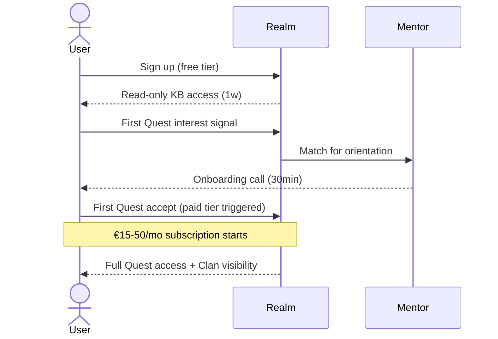
```mermaid
sequenceDiagram
    actor User
    participant Realm
    participant Mentor

    User->>Realm: Sign up (free tier)
    Realm-->>User: Read-only KB access (1w)
    User->>Realm: First Quest interest signal
    Realm->>Mentor: Match for orientation
    Mentor-->>User: Onboarding call (30min)
    User->>Realm: First Quest accept (paid tier triggered)
    Note over User,Realm: €15-50/mo subscription starts
    Realm-->>User: Full Quest access + Clan visibility
```

#### H-O-002: Discovery call → pilot 2w → 1mo → quarterly retainer

- **Stages:** Discovery call (60min) → 2w pilot Quest → 1mo extended → quarterly TRM-Lite retainer (€3K-10K/mo)
- **Conversion rate target:** 20-40% discovery → pilot; 40-60% pilot → retainer
- **Time investment:** ~1h discovery / 20h pilot / 100h+ extended
- **Realm anchor:** TRM-Lite L1 entry (Doc 1B §11)
- **Provenance:** [src: decisions/JETIX-TRM-MODEL-2026-04-30.md §11 24mo trajectory | commit 68fa423]

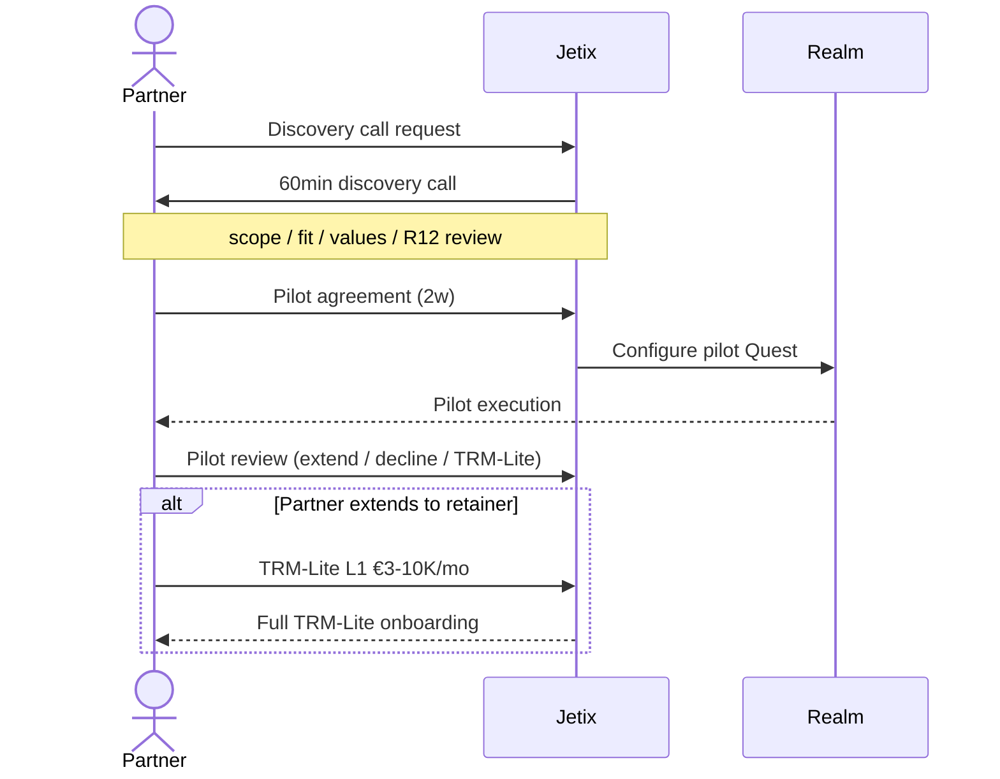
```mermaid
sequenceDiagram
    actor Partner
    participant Jetix
    participant Realm

    Partner->>Jetix: Discovery call request
    Jetix->>Partner: 60min discovery call
    Note over Jetix,Partner: scope / fit / values / R12 review
    Partner->>Jetix: Pilot agreement (2w)
    Jetix->>Realm: Configure pilot Quest
    Realm-->>Partner: Pilot execution
    Partner->>Jetix: Pilot review (extend / decline / TRM-Lite)
    alt Partner extends to retainer
        Partner->>Jetix: TRM-Lite L1 €3-10K/mo
        Jetix-->>Partner: Full TRM-Lite onboarding
    end
```

#### H-O-003: Workshop intro → first Quest → Clan join

- **Stages:** Public workshop (1-day in-person or video) → first Quest invitation (week 1) → 1-Season trial in Clan → permanent Clan member
- **Conversion rate target:** 5-15% workshop → first Quest; 50-70% trial → permanent
- **Time investment:** 8-12h workshop / 40-80h Season
- **Realm anchor:** E3 Clan entry
- **Provenance:** [src: decisions/JETIX-WORKSHOP-CONCEPT-2026-04-30.md | reports/monetization-research-2026-05-14/industry-examples.md §9 CrossFit affiliate intro | commit 68fa423]

#### H-O-004: Lite consulting → TRM-Lite L1 → TRM-Full L5

- **Stages:** L0 lite gig €1.5-5K → L1 retainer €3-10K/mo → L2 €10-25K/mo (Chief of Staff fractional) → L3 €25-40K/mo → L5 TRM-Full €40-60K/mo
- **Conversion rate target:** L0 → L1: 30-50%; L1 → L2: 40-60%; L3 → L5: 20-40%
- **Time investment:** 2-week pilot per tier; 12-24mo full ladder
- **Realm anchor:** Doc 1B §11 LOCKED ladder
- **Provenance:** [src: decisions/JETIX-CORPORATION-2026-05-05.md §11 / decisions/JETIX-TRM-MODEL-2026-04-30.md §11 | commit 68fa423]

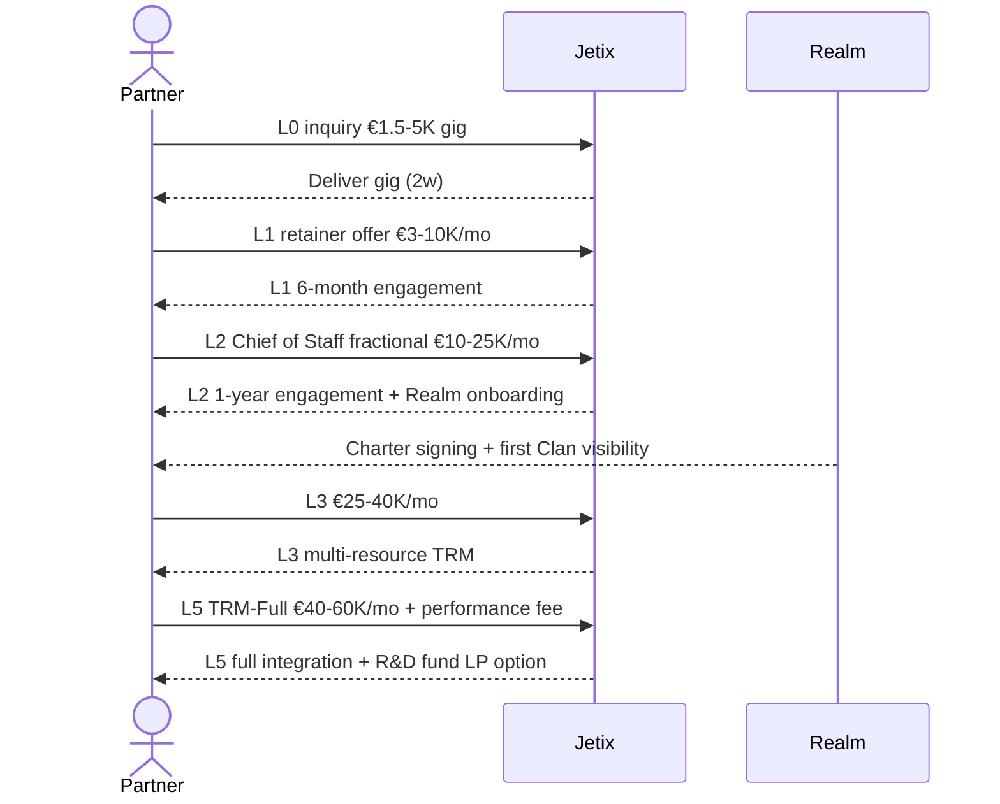
```mermaid
sequenceDiagram
    actor Partner
    participant Jetix
    participant Realm

    Partner->>Jetix: L0 inquiry €1.5-5K gig
    Jetix-->>Partner: Deliver gig (2w)
    Partner->>Jetix: L1 retainer offer €3-10K/mo
    Jetix-->>Partner: L1 6-month engagement
    Partner->>Jetix: L2 Chief of Staff fractional €10-25K/mo
    Jetix-->>Partner: L2 1-year engagement + Realm onboarding
    Realm-->>Partner: Charter signing + first Clan visibility
    Partner->>Jetix: L3 €25-40K/mo
    Jetix-->>Partner: L3 multi-resource TRM
    Partner->>Jetix: L5 TRM-Full €40-60K/mo + performance fee
    Jetix-->>Partner: L5 full integration + R&D fund LP option
```

#### H-O-005: Influencer manifest signing → audience activation → joint Quest

- **Stages:** Pitch doc review → manifest signing → audience announcement (1 video/post) → first Realm Quest with audience members → joint Quest cadence
- **Conversion rate target:** 10-30% pitch → signing; 5-20% audience → Realm first Quest
- **Time investment:** 5-20h pitch+sign / 2-month audience onboarding cycle
- **Realm anchor:** L1 entry + E3 Clan creation
- **Provenance:** [src: outreach/jetix-mentor-partner-pitch-2026-05-12.md | outreach/video-script-tseren-2026-05-12.md | reports/voice-batch-2026-05-13-14-ideas-report.md Bucket 2.3 | commit 68fa423]

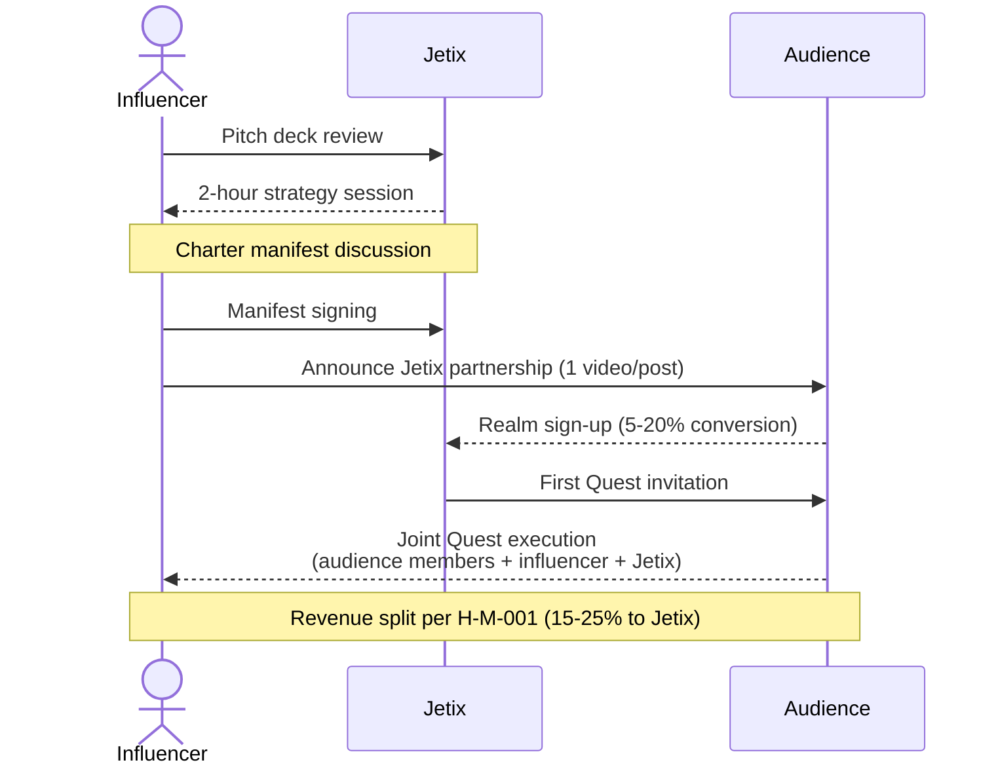
```mermaid
sequenceDiagram
    actor Influencer
    participant Jetix
    participant Audience

    Influencer->>Jetix: Pitch deck review
    Jetix-->>Influencer: 2-hour strategy session
    Note over Jetix,Influencer: Charter manifest discussion
    Influencer->>Jetix: Manifest signing
    Influencer->>Audience: Announce Jetix partnership (1 video/post)
    Audience-->>Jetix: Realm sign-up (5-20% conversion)
    Jetix->>Audience: First Quest invitation
    Audience-->>Influencer: Joint Quest execution<br/>(audience members + influencer + Jetix)
    Note over Influencer,Audience: Revenue split per H-M-001 (15-25% to Jetix)
```

#### H-O-006: Investor allocation → portfolio TRM-mgmt → equity partnership

- **Stages:** Investor intro (warm) → allocation discussion → first investment via R&D fund LP → portfolio TRM-mgmt scaling → equity partnership (deep)
- **Conversion rate target:** 5-15% warm intro → LP commitment; 30-50% LP → portfolio expansion
- **Time investment:** 6-18mo cycle per investor
- **Realm anchor:** TRM 6 resources (Capital sub-resource)
- **Provenance:** [src: decisions/JETIX-TRM-MODEL-2026-04-30.md §3 §14 | reports/monetization-research-2026-05-14/industry-examples.md §7 DAO governance | commit 68fa423]

#### H-O-007: Charter signing → first Season → mastership track

- **Stages:** Signatory invitation → Charter signing event → join Clan / first Season → 4-Season mastership track (1y) → L3+ rank
- **Conversion rate target:** 70-90% invited → signed (high-touch; small pool 9 L1 + 1 organic)
- **Time investment:** Charter event 1d / 4 Seasons 1y / mastership ongoing
- **Realm anchor:** L1 First Clan Charter
- **Provenance:** [src: decisions/JETIX-FIRST-CLAN-CHARTER-2026-05-12.md signing protocol | commit 68fa423]

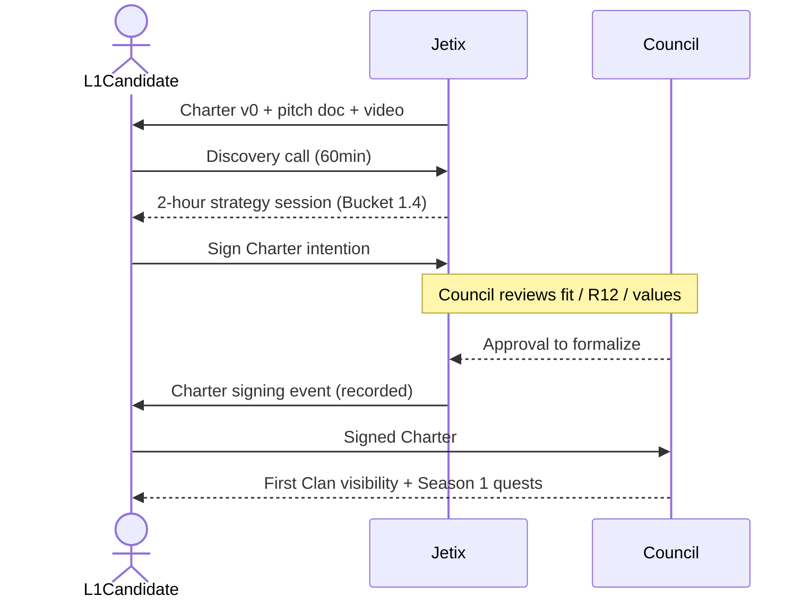
```mermaid
sequenceDiagram
    actor L1Candidate
    participant Jetix
    participant Council

    Jetix->>L1Candidate: Charter v0 + pitch doc + video
    L1Candidate->>Jetix: Discovery call (60min)
    Jetix-->>L1Candidate: 2-hour strategy session (Bucket 1.4)
    L1Candidate->>Jetix: Sign Charter intention
    Note over Jetix,Council: Council reviews fit / R12 / values
    Council-->>Jetix: Approval to formalize
    Jetix->>L1Candidate: Charter signing event (recorded)
    L1Candidate->>Council: Signed Charter
    Council-->>L1Candidate: First Clan visibility + Season 1 quests
```

#### H-O-008: Mastery class → certification → Realm operator role

- **Stages:** Mastery class (intensive 4-12w) → exam / peer assessment → certification (H-M-008) → Realm operator role (paid)
- **Conversion rate target:** 60-80% class → cert; 20-40% cert → operator role placement
- **Time investment:** 40-200h class / 1-2w exam / ongoing operator role
- **Realm anchor:** E2 Class progression / TRM operator role
- **Provenance:** [src: decisions/JETIX-CORPORATION-2026-05-05.md Phase 3 marketplace operators | wiki/ideas/jetix-standards-body-h8-candidate-pool.md | commit 68fa423]

#### H-O-009: External speaking → community invite → Clan trial

- **Stages:** External speaking engagement → audience signal of interest → community invite → Clan trial Season → permanent member
- **Conversion rate target:** 1-3% speaking audience → community invite; 20-30% invite → trial
- **Time investment:** Speaking 1-2h / community onboarding 4-8h / Season trial 40-80h
- **Realm anchor:** L0 / L1 entry from external surface
- **Provenance:** [src: H-O-005 influencer activation parallel | commit 68fa423]

#### H-O-010: Voice-call pilot → strategy session (2h) → ongoing partnership

- **Stages:** Initial voice call (30min) → 2-hour strategy session (Bucket 1.4 upgrade — voice batch) → pilot project → ongoing partnership
- **Conversion rate target:** 30-50% voice → 2h strategy; 40-60% 2h → pilot
- **Time investment:** 30min voice / 2h strategy / 20-40h pilot
- **Realm anchor:** L1 entry (high-touch)
- **Provenance:** [src: reports/voice-batch-2026-05-13-14-ideas-report.md Bucket 1.4 | commit 68fa423]

#### H-O-011: Speaker-author funnel — book/lecture → Realm membership

- **Stages:** External book / lecture / conference → reader audience contact → Realm signup invitation → Quest trial
- **Conversion rate target:** 0.1-1% book audience → Realm signup; 30-50% signup → Quest trial
- **Time investment:** Book 100-500h authoring / lecture circuit ongoing
- **Realm anchor:** L0 entry / brand awareness funnel
- **Provenance:** [src: reports/monetization-research-2026-05-14/industry-examples.md §3 Stratechery / Pivot author models | commit 68fa423]

**Net summary §8.** 11 H-O funnels surfaced. Each addresses different entry segment (free trial / discovery call / workshop / consulting tier / influencer manifest / investor / charter L1 / mastery class / speaking / 2h strategy / author). Phase 1 priority: H-O-002 (discovery → retainer) for legacy outreach + H-O-005 (influencer manifest) for L1 Цэрэн/Левенчук + H-O-010 (2h strategy) per voice batch Bucket 1.4.

---

## §9 Unique Progression Framework — universal skeleton across L1 domains

**Anchor:** Charter L0-L6 ladder; Doc 1B L0-L5 land-expand; H7 People-NS L1 First Clan; voice batch Bucket 3.2 musicians + bloggers extension.

### §9.1 95% universal skeleton + 5% domain overlay

**Hypothesis:** Universal progression skeleton applies к bloggers (Phase 1 primary) → investors → entrepreneurs → politicians → musicians + artists → academics с **95% reuse**. Only 5% is domain-specific overlay (terminology / domain-specific Quest types / partner KPIs).

### §9.2 Universal skeleton (7 stages)

| Stage | What progresses | Common across all L1 domains |
|-------|----------------|------------------------------|
| **Stage 1 — Surface** | Partner awareness of Jetix; values alignment check | Pitch doc / video / Charter manifest review |
| **Stage 2 — Discovery** | Partner trust + Jetix understanding | 60min discovery call + 2h strategy session (Bucket 1.4) |
| **Stage 3 — Pilot** | Concrete deliverable + R12 alignment proof | 2w pilot Quest / lite-engagement; transparent metrics |
| **Stage 4 — Commit** | Charter signing / TRM-Lite entry | Manifest signing + formal Clan entry / L1 retainer |
| **Stage 5 — Activate** | Partner's audience enters Realm | First Joint Quest + audience members onboard |
| **Stage 6 — Compound** | Realm flywheel running | Multi-Season cooperation + cross-Clan federation |
| **Stage 7 — Sovereign** | Partner-owned permanent presence в Realm | L3+ mastership / partial Realm ownership |

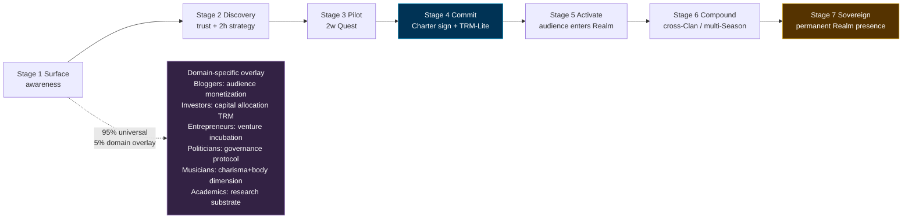
```mermaid
flowchart LR
    S1[Stage 1 Surface<br/>awareness] --> S2[Stage 2 Discovery<br/>trust + 2h strategy]
    S2 --> S3[Stage 3 Pilot<br/>2w Quest]
    S3 --> S4[Stage 4 Commit<br/>Charter sign + TRM-Lite]
    S4 --> S5[Stage 5 Activate<br/>audience enters Realm]
    S5 --> S6[Stage 6 Compound<br/>cross-Clan / multi-Season]
    S6 --> S7[Stage 7 Sovereign<br/>permanent Realm presence]

    S1 -.->|95% universal<br/>5% domain overlay| OVERLAY
    OVERLAY[Domain-specific overlay<br/>Bloggers: audience monetization<br/>Investors: capital allocation TRM<br/>Entrepreneurs: venture incubation<br/>Politicians: governance protocol<br/>Musicians: charisma+body dimension<br/>Academics: research substrate]

    style S4 fill:#003355,stroke:#0099cc,color:#fff
    style S7 fill:#553300,stroke:#cc9900,color:#fff
    style OVERLAY fill:#332244,stroke:#aa88cc,color:#fff
```

### §9.3 Domain overlay specifics (5%)

| Domain | Overlay-specific |
|--------|------------------|
| **Bloggers** (Phase 1) | Audience monetization H-M-001 / 010; Influencer-anchored Clan; Manifest signing video ритуал |
| **Investors** | TRM Capital sub-resource focus; LP-position via R&D fund H-M-016; portfolio TRM-mgmt |
| **Entrepreneurs** | Joint ventures H-A-007; Jetix-owned products H-M-015; venture incubation cohorts |
| **Politicians** (Phase 4+) | Governance protocol; Standards Body (H-M-017 R12 risk); dispute resolution |
| **Musicians / Artists** | Charisma+Body dimension (voice batch 3.1); cross-cutting with all archetypes; embodiment integration |
| **Academics** | Research substrate access; data licensing H-M-011; mentor cascade H-A-010-012 |

**Net §9.** Single skeleton ↔ 6 domains. Reuse rate 95%. Domain overlay surfaces, не replicates, framework. Saves Realm complexity at scale (one onboarding lifecycle, many entry overlays).

---

## §10 Concrete Onboarding Playbook — Bloggers (Phase 1)

**Anchor:** Charter 9 L1 candidates; outreach/jetix-mentor-partner-pitch-2026-05-12.md (Pitch Doc draft); outreach/video-script-tseren-2026-05-12.md (Цэрэн 5-7min video); voice batch Bucket 1-2; reports/monetization-research-2026-05-14/industry-examples.md §1-7.

### §10.1 Filter — identification of L1 candidates

**Criteria для blogger L1 candidate:**

- **Audience size:** ≥50K engaged audience (any platform; YouTube / TG / podcast / newsletter)
- **Values alignment:** progressive / building-oriented / "thinks-from-first-principles" (Manifest pattern fit)
- **Time + energy:** ≥10h/week capacity for partnership (founders / authors often capped — must check)
- **R12 readiness:** acknowledges anti-extraction principle (small test: discuss in discovery call)
- **Strategic horizon:** willing to commit 1-2y minimum (Charter L0-L6 ladder requires multi-year)
- **Output discipline:** has shipped artefacts (book / series / large project) — not just consumption

**9 confirmed L1 candidates (per Charter LOCKED):**

1. Цэрэн Цэрэнов (Шчф ШСМ) — Methodology+Systems engineering authority
2. Анатолий Левенчук — ШСМ founder; system engineering methodology authority
3. Павел Дуров — Telegram founder; infrastructure + privacy ethos
4. Кирилл Федорев (TBD verify spelling) — capital allocator
5. Денис Тарасов — entrepreneur
6. Семён Хартман — tech / community
7. Виталий Брагинский — finance / capital
8. Михаил Гиренко — entrepreneur
9. Дмитрий (full name TBD per Q-010 CRM disambiguation)
10. **Slot 10 organic** — TBD (per Charter signatories_target 10 / base 5)

### §10.2 First contact — variants (incorporating voice batch Bucket 1)

**Variant 1.1 (Semmelweis hand-washing metaphor — voice batch 1.1):**

> «Я хочу взять часть твоей методологии и интегрировать в substrate, который масштабируется как hygiene habit — логично, useful, self-replicating. Не sell тебе что-то, а cofound substrate, в котором твоя методология становится default для top-tier людей.»

**Variant 1.4 (2-hour strategy session ask — voice batch 1.4):**

> «У меня к тебе предложение на 2-часовую сессию по monetization strategy для топ-методологов. Цель — найти way of joint work с тобой, Левенчуком, и ещё 5-10 топ людьями. Не консалтинг, не sell — co-founding.»

**Variant 1.6 (pre-interaction intelligence — voice batch 1.2):**

> «Прежде чем звонить, я хочу подготовиться по тебе глубоко (твоё последнее видео / последняя статья / open question, на который ты публично жалуешься). Тебе удобнее, если я пришлю sample подготовки + 3 вопроса для часовой сессии?»

### §10.3 Discovery call (60min) — что узнавать

| Topic | Target time | Outcomes |
|-------|-------------|----------|
| Partner's strategic narrative | 15min | What is their main thesis? What "monetization strategy" pain point? |
| R12 values alignment | 10min | Anti-extraction discussion test |
| Existing audience monetization | 15min | What's already monetized? What's stuck? |
| Charter manifest test | 10min | Reaction to Charter draft + 6 archetypes |
| Realm fit specific | 10min | Which archetype primary? Which Clan composition imaginable? |

### §10.4 Pilot — 2-week or 1-month lite

**Pilot structure:**

- **Day 1-3:** TRM baseline measurement (Capital / Time / Audience / Knowledge / Compute / Team)
- **Day 4-7:** First lightweight Quest definition (e.g., "improve newsletter conversion rate" / "build first 100 audience progression members")
- **Week 2:** Quest execution с Jetix substrate support
- **End of week 2:** Pilot review meeting; decision gate

**Pilot success metrics:** Quest completion at minimum 70% objectives; Net Promoter signal from partner (would you recommend Jetix to other influencers?); transparency check (partner saw clear value of Jetix substrate vs solo).

### §10.5 Decision gate — commit / no-commit

**Commit signals:**

- Partner ready to sign Charter manifest publicly
- Audience announcement willingness
- TRM-Lite L1 commit (€3-10K/mo retainer)
- First Joint Quest scoped

**No-commit signals:**

- Values misalignment surfaced in pilot
- R12 concerns unresolved
- Founder bottleneck (partner can't scale time)
- Strategic mismatch (partner focused elsewhere)

**Either path: pilot retrospection** — what learned for next L1 candidate (compound knowledge per Foundation Part 5 LOCKED).

### §10.6 Onboarding — Realm + TRM + Charter + first Quest

**Sequence (1-month):**

1. **Week 1:** Charter signing event (video / public); audience announcement
2. **Week 2:** Realm full onboarding (E1-E6 access); Clan composition (3-10 members curated)
3. **Week 3:** TRM baseline finalized; L1 retainer activated
4. **Week 4:** First Joint Quest launch (audience members invited; revenue split agreed)

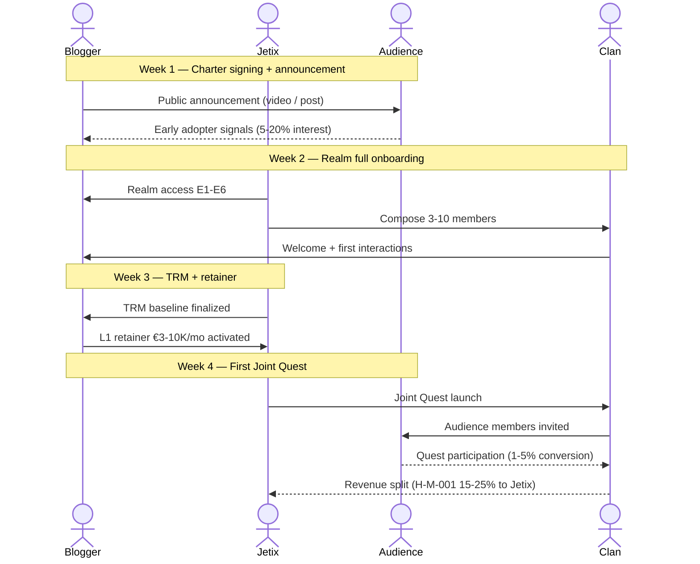
```mermaid
sequenceDiagram
    actor Blogger
    actor Jetix
    actor Audience
    actor Clan

    Note over Blogger,Audience: Week 1 — Charter signing + announcement
    Blogger->>Audience: Public announcement (video / post)
    Audience-->>Blogger: Early adopter signals (5-20% interest)

    Note over Blogger,Clan: Week 2 — Realm full onboarding
    Jetix->>Blogger: Realm access E1-E6
    Jetix->>Clan: Compose 3-10 members
    Clan->>Blogger: Welcome + first interactions

    Note over Blogger,Jetix: Week 3 — TRM + retainer
    Jetix->>Blogger: TRM baseline finalized
    Blogger->>Jetix: L1 retainer €3-10K/mo activated

    Note over Blogger,Audience: Week 4 — First Joint Quest
    Jetix->>Clan: Joint Quest launch
    Clan->>Audience: Audience members invited
    Audience-->>Clan: Quest participation (1-5% conversion)
    Clan-->>Jetix: Revenue split (H-M-001 15-25% to Jetix)
```

### §10.7 Operational tempo — weekly / monthly / quarterly cadence

- **Weekly:** 30min check-in (blogger ↔ Jetix); Quest status; TRM tracking
- **Monthly:** 90min review (blogger ↔ Jetix ↔ Clan lead); revenue split reconciliation; next month Quest planning
- **Quarterly (Season boundary):** 1d Clan retrospection per Charter §3 (H-C-002); Season-MVP recognition; next Season Quest pool design

### §10.8 Renewal / scaling / exit

- **Renewal trigger:** Quarterly review; mutual ack; rolling commitment
- **Scaling triggers:** L1 → L2 (€10-25K/mo) when blogger expands TRM scope; L2 → L3 (€25-40K/mo) when multi-resource integration; L3 → L5 full TRM (€40-60K/mo)
- **Exit path (R12 preserved):** 30-day notice; partner keeps audience + IP + Realm reputation; Jetix loses substrate fee revenue only

### §10.9 Bloggers playbook — full funnel diagram

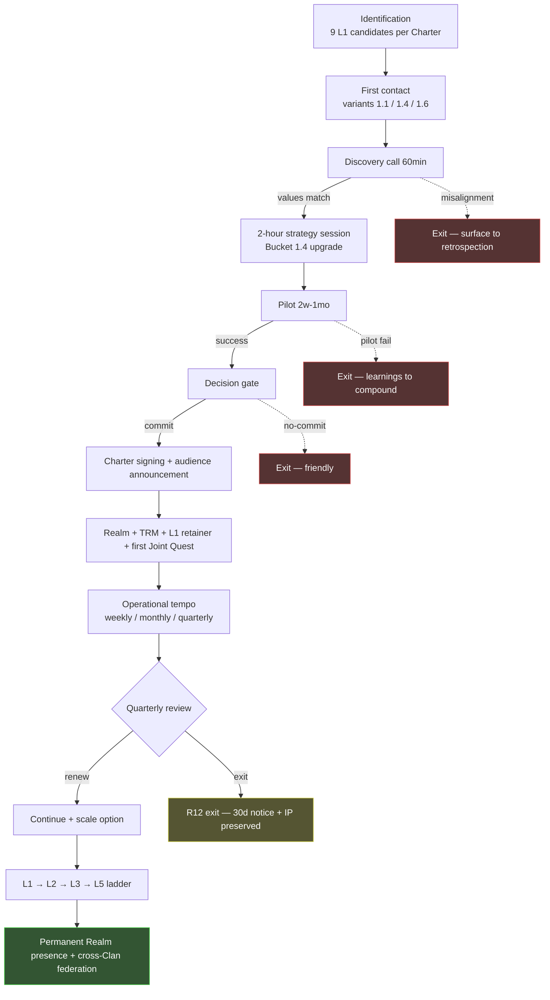
```mermaid
flowchart TD
    A[Identification<br/>9 L1 candidates per Charter] --> B[First contact<br/>variants 1.1 / 1.4 / 1.6]
    B --> C[Discovery call 60min]
    C -->|values match| D[2-hour strategy session<br/>Bucket 1.4 upgrade]
    C -.->|misalignment| EX1[Exit — surface to retrospection]
    D --> E[Pilot 2w-1mo]
    E -->|success| F[Decision gate]
    E -.->|pilot fail| EX2[Exit — learnings to compound]
    F -->|commit| G[Charter signing + audience announcement]
    F -.->|no-commit| EX3[Exit — friendly]
    G --> H[Realm + TRM + L1 retainer + first Joint Quest]
    H --> I[Operational tempo<br/>weekly / monthly / quarterly]
    I --> J{Quarterly review}
    J -->|renew| K[Continue + scale option]
    J -->|exit| L[R12 exit — 30d notice + IP preserved]
    K --> M[L1 → L2 → L3 → L5 ladder]
    M --> N[Permanent Realm presence + cross-Clan federation]

    style EX1 fill:#553333,stroke:#cc4444,color:#fff
    style EX2 fill:#553333,stroke:#cc4444,color:#fff
    style EX3 fill:#553333,stroke:#cc4444,color:#fff
    style L fill:#555533,stroke:#cccc44,color:#fff
    style N fill:#335533,stroke:#44cc44,color:#fff
```

**Net §10.** Full bloggers playbook from identification to permanent Realm presence. Phase 1 primary application: Цэрэн + Левенчук as first 2; expand to other 7 confirmed L1 within 12 months per Charter timeline.

---

## §11 Beyond-Bloggers — Adaptation Playbooks (А-Д)

Short adaptations of §10 universal skeleton (per §9 framework — 5% domain overlay) для 5 other L1 segments.

### §11.А Investors (Дуров / Federov / Mittelstand later)

**Overlay specifics:**

- **TRM Capital sub-resource focus** — investor cares about asset allocation efficiency, not audience growth
- **LP-position via R&D fund (H-M-016)** — investor commits capital; receives carry on Jetix-incubated ventures
- **Portfolio TRM-mgmt scaling** — fractional Chief Investment Officer (L2-L3 of TRM ladder)
- **Equity partnership (deep)** — at L5 investor receives Realm equity / governance seat

**Phase 1 candidates:** Дуров (Phase 2-3 deferred per Balaji NS insight), Виталий Брагинский (capital allocator), Кирилл Федорев (entrepreneur-investor)

**Entry sequence:**

1. Pitch doc adapted: emphasis on portfolio TRM (not audience monetization)
2. Discovery call: investor pain points (deal flow / due diligence / portfolio company management bandwidth)
3. Pilot: 1-2 portfolio companies under TRM-Lite mgmt for 1 quarter
4. Commit: LP position in R&D fund + TRM-Lite scaling to all portfolio

**KPIs:** capital deployed via R&D fund; portfolio company growth attributable to TRM substrate; investor net IRR uplift vs control group

**R12 specific:** investor cannot extract from substrate beyond agreed share; founder ventures retain control (per Charter R12 anchor)

**Provenance:** [src: decisions/JETIX-CORPORATION-2026-05-05.md §3 Partner tier | reports/monetization-research-2026-05-14/industry-examples.md §7 DAO governance | commit 68fa423]

### §11.Б Entrepreneurs (Гиренко / Тарасов)

**Overlay specifics:**

- **Joint ventures focus (H-A-007)** — entrepreneur founds within Realm with co-founders from Clan
- **Jetix-owned products (H-M-015)** — Jetix incubates parallel ventures; entrepreneur может contribute / lead
- **Venture incubation cohorts** — 6-12 entrepreneurs in batch; cross-pollination

**Phase 1 candidates:** Михаил Гиренко (entrepreneur); Денис Тарасов (entrepreneur)

**Entry sequence:**

1. Pitch doc adapted: emphasis on venture incubation + cofounder network (not audience or capital)
2. Discovery call: current venture / next venture intentions / cofounder needs
3. Pilot: introduce to 2-3 Clan members for cofounder fit assessment
4. Commit: venture launch within Realm; Charter signing; founder equity terms

**KPIs:** ventures launched; cofounder pairings success rate; ARR / equity value created

**R12 specific:** Jetix gets founder-tier equity only when explicitly contracted; default 0% equity; venture decisions stay with founder

**Provenance:** [src: H7 People-NS §6 PayPal Mafia precedent | wiki/sources/the-founders-dilemmas-wasserman | commit 68fa423]

### §11.В Politicians (post-L4 governance partners)

**Overlay specifics:**

- **Governance protocol focus** — politician brings governance experience; Realm benefits Phase 3+ (Council formation / dispute resolution)
- **Standards Body (H-M-017) — R12 RISK** — politician may push Standards Body monetization; surface concern explicitly
- **Dispute resolution (H-F-007)** — Realm Tribunal partnership with politician's expertise
- **Public policy / regulatory liaison** — Phase 4+ when Realm interfaces с state structures

**Phase 1 candidates:** None (post-L4 timeline)

**Entry sequence (Phase 4+):**

1. Pitch adapted: governance + state-interface focus
2. Discovery: politician's policy concerns / Realm-state interface readiness
3. Pilot: advisory role on specific Realm governance question
4. Commit: Council seat / Tribunal seat; formal governance partnership

**KPIs:** governance protocols formalized; state-interface successful (license / certification / recognition); R12 enforcement under politician pressure

**R12 specific:** politicians historically extract — explicit constitutional anchor + member-vote required on governance changes per Tier 2 R7

**Provenance:** [src: decisions/STRATEGIC-INSIGHT-BALAJI-NETWORK-STATE-2026-05-10.md (Phase 4+ state interface) | reports/monetization-research-2026-05-14/industry-examples.md §13 Próspera fragility | commit 68fa423]

### §11.Г Musicians + Artists (cross-cutting; embodiment dimension)

**Overlay specifics:**

- **Charisma + Body dimension (voice batch 3.1)** — orthogonal axis amplifying base archetype
- **Performer subtype across Creator + Merchant archetypes** (voice batch 3.2)
- **Audience monetization adapted** — performance + concert + merch revenue (not knowledge monetization)
- **Cross-cutting** with bloggers (Phase 1) — musician with content following can enter as blogger overlay

**Phase 1 candidates:** TBD (1 organic Charter slot may fit musician)

**Entry sequence:**

1. Pitch adapted: embodiment dimension explicit; performer subtype clarified
2. Discovery: tour / album / performance cadence; audience-as-fanbase characteristics
3. Pilot: Joint Quest with creator overlap (e.g., music-themed audience engagement)
4. Commit: Charter signing + embodiment-Realm overlay deployment

**KPIs:** performance integration with Realm cadence; embodiment dimension uptake by other archetypes

**R12 specific:** standard

**Provenance:** [src: reports/voice-batch-2026-05-13-14-ideas-report.md Bucket 3.1 / 3.2 | wiki/ideas/embodiment-dimension-mj-realm-axis.md | commit 68fa423]

### §11.Д Academics (Castronova / van Dreunen feeders)

**Overlay specifics:**

- **Research substrate access** — academics use Realm as study object; bring rigorous methodology
- **Data licensing (H-M-011)** — anonymized Realm data → academic papers
- **Mentor cascade (H-A-010-012)** — academics mentor Realm members on research methodology
- **Compound learning to Foundation Part 5** (methodology capture LOCKED)

**Phase 1 candidates:** None confirmed; TBD outreach Castronova / van Dreunen (deferred)

**Entry sequence:**

1. Pitch adapted: research access + methodology partnership
2. Discovery: research interests / data needs / collaboration boundaries
3. Pilot: 1 paper co-authored with Realm data / mentor cascade
4. Commit: ongoing research partnership; data licensing terms; advisory role

**KPIs:** papers published; methodology improvements absorbed; mentor cascade impact

**R12 specific:** member data only with opt-in per H-M-011 mitigation; member receives data revenue share

**Provenance:** [src: wiki/sources/synthetic-worlds-castronova / virtual-economies-lehdonvirta / one-up-van-dreunen | commit 68fa423]

---

## §12 Path to Virtual State / Independent Corporation — 6 phases × 3 timeline scenarios

**Anchor:** Charter L0-L6 timeline (10-15y operational / 100-200y ambition); H7 People-NS 10M target; Balaji NS insight (5 of 7 NS steps mapped); reports/monetization-research-2026-05-14/industry-examples.md §12 Estonia / §13 Próspera.

### §12.1 6 Phases — member count × revenue × governance posture

| Phase | Members | Revenue | Governance | Legal posture | R12 anti-extraction posture |
|-------|---------|---------|-----------|---------------|----------------------------|
| **Phase 1 — Pre-state** | 1-100 (Charter L1: 5-10 L1 + 90 members in 1 Clan) | €100K Q2 → €1M ARR | Founder + Council (Ruslan + L1 advisors) | Standard corp (German GmbH or similar) | Charter R12 clause + manual oversight |
| **Phase 2 — Proto-state** | 100-10K (L2-L3 ladder) | €1M-€20M ARR | Council formal (rotating seats) + Member vote on substrate-affecting decisions | Multi-jurisdiction corp + standard SaaS B2B | Constitutional anchor formalized (per Part 6b §I.2 LOCKED) |
| **Phase 3 — Quasi-state** | 10K-100K (L4) | €20M-€200M ARR | Council + Tribunal + Member referenda | Multi-jurisdiction; possible Estonia e-residency adopt; NOT Honduras ZEDE (political fragility) | R12 enforcement automated + Tribunal-mediated |
| **Phase 4 — Recognized Network State** | 100K-1M (L5) | €200M-€2B GMV | Constitutional + multi-Council Federation | Diplomatic recognition pursuit (Balaji NS step 5-6); permanent legal home jurisdiction | Standards Body H-M-017 — if pursued, requires multi-stakeholder vote |
| **Phase 5 — Diplomatic Recognition Candidate** | 1M-10M (L5+) | €2B-€20B GMV | Distributed governance + AI-assisted Tribunal | Treaty negotiations with sovereign states (Balaji NS step 7); territory or city partnerships | Public R12 audit; transparency standards |
| **Phase 6 — Sovereign-equivalent** | 10M+ (L6) | €20B-€200B GMV | Constitutional democracy + AI-substrate Tribunal | Recognized network state OR diplomatic enclave (Próspera-evolved / Estonia-partnered) | Permanent constitutional R12 + member-veto power |

### §12.2 3 Timeline scenarios

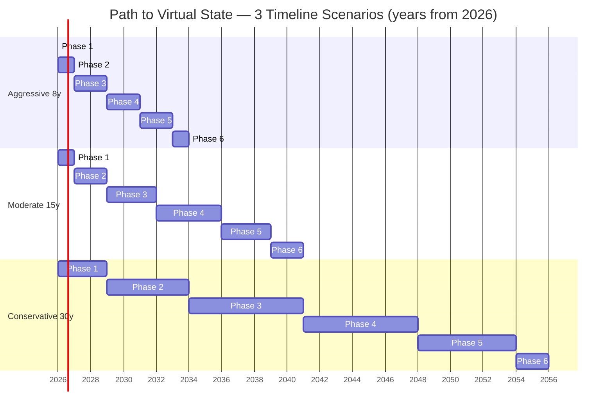
```mermaid
gantt
    title Path to Virtual State — 3 Timeline Scenarios (years from 2026)
    dateFormat YYYY
    axisFormat %Y

    section Aggressive 8y
    Phase 1: 2026, 2026
    Phase 2: 2026, 2027
    Phase 3: 2027, 2029
    Phase 4: 2029, 2031
    Phase 5: 2031, 2033
    Phase 6: 2033, 2034

    section Moderate 15y
    Phase 1: 2026, 2027
    Phase 2: 2027, 2029
    Phase 3: 2029, 2032
    Phase 4: 2032, 2036
    Phase 5: 2036, 2039
    Phase 6: 2039, 2041

    section Conservative 30y
    Phase 1: 2026, 2029
    Phase 2: 2029, 2034
    Phase 3: 2034, 2041
    Phase 4: 2041, 2048
    Phase 5: 2048, 2054
    Phase 6: 2054, 2056
```

### §12.3 18-cell matrix (6 phases × 3 timelines) — milestones each cell

| Phase | Aggressive 8y | Moderate 15y | Conservative 30y |
|-------|--------------|--------------|------------------|
| **Phase 1** | 2026 (Q2-Q4) — Charter LOCKED; 9 L1 + 1 organic signed; €100K Q2 | 2026-2027 — Charter LOCKED; 9 L1 + 1 organic signed; €100K Q2 → €500K Y1 | 2026-2029 — 9 L1 signatories accumulated over 3 years; €100K-€500K |
| **Phase 2** | 2026-2027 — €1M-€20M ARR; 100-10K members; Council formal | 2027-2029 — €1M-€20M ARR; 100-10K; Council + Member vote | 2029-2034 — slow scale to 10K; €5M-€20M ARR; deliberate governance build |
| **Phase 3** | 2027-2029 — 10K-100K members; €20M-€200M ARR; Tribunal | 2029-2032 — same; Tribunal + multi-jurisdiction | 2034-2041 — same; over 7 years; cautious legal architecture |
| **Phase 4** | 2029-2031 — 100K-1M; €200M-€2B; recognition pursuit | 2032-2036 — same | 2041-2048 — same; multi-year recognition diplomatic effort |
| **Phase 5** | 2031-2033 — 1M-10M; €2B-€20B; treaty negotiations | 2036-2039 — same | 2048-2054 — same; 6-year treaty effort |
| **Phase 6** | 2033-2034 — 10M+; €20B-€200B; sovereign-equivalent | 2039-2041 — same; 2-year final phase | 2054-2056 — final phase |

### §12.4 Per-phase R12 anti-extraction posture

- **Phase 1:** Charter R12 clause + manual oversight (Ruslan + Council); enforcement = trust + visibility
- **Phase 2:** Constitutional R12 codified (Part 6b §I.2 LOCKED); automated halt-log-alert на violations (≤60s F2 grade)
- **Phase 3:** Tribunal-mediated enforcement; member-data opt-in mandatory per H-M-011 mitigation; transparency report (EVE MER precedent)
- **Phase 4:** Multi-stakeholder Standards Body vote (if H-M-017 pursued); independent auditor of R12 enforcement
- **Phase 5:** Public R12 audit (annual); international transparency standards adopt; treaty negotiation includes R12 anchor
- **Phase 6:** Permanent constitutional R12; member-veto на substrate-affecting changes (per Tier 2 R7)

### §12.5 Source-back to Balaji NS + Próspera + Estonia precedents

**Balaji NS 7 steps — Jetix mapping (per decisions/STRATEGIC-INSIGHT-BALAJI-NETWORK-STATE-2026-05-10.md):**

1. **Founder + One Commandment** — Jetix has founder (Ruslan); One Commandment TBD (Q-004 open)
2. **Online community** — Realm Phase 1-2 ✓
3. **Network union** — Federation Phase 2-3 (Faction formation) ✓
4. **In-person events** — Phase 2+ rituals (H-C-016) ✓
5. **Crowdfunded archipelago** — Phase 3-4 cross-jurisdiction presence ✓
6. **Diplomatic recognition** — Phase 4-5 (Balaji NS step 5-6) ✓
7. **Sovereignty** — Phase 6 (Balaji NS step 7) ✓ (but explicit divergence: NOT cryptoeconomy per Balaji NS insight)

**Próspera precedent (Honduras 2017+):**

- 1,500 residents after 7 years — slow physical-territory growth
- Lesson: physical territory has political fragility (Xiomara Castro government moving to dissolve 2022+)
- Jetix posture: digital-first; physical layer (voice batch 2.4 warehouses + housing + food) only Phase 4+ when treaty-protected

**Estonia e-Residency precedent:**

- 100K e-residents from 170+ countries after 10y — realistic digital-citizenship scale
- Jetix posture: adopt Estonia e-residency as legal home Phase 3+; faster path than territorial state

**Liberland precedent (cautionary):**

- Unrecognized state — international legitimacy crisis
- Jetix posture: explicit divergence — NOT seek unrecognized state status (too fragile); diplomatic-recognition pursuit Phase 4+ only with multi-state partnerships

### §12.6 6-phase ladder diagram

```mermaid
flowchart LR
    P1[Phase 1 — Pre-state<br/>1-100 members<br/>€100K-€1M ARR<br/>Founder + Council]
    P2[Phase 2 — Proto-state<br/>100-10K members<br/>€1M-€20M ARR<br/>Council + Member vote]
    P3[Phase 3 — Quasi-state<br/>10K-100K members<br/>€20M-€200M ARR<br/>Tribunal]
    P4[Phase 4 — Recognized NS<br/>100K-1M members<br/>€200M-€2B GMV<br/>Multi-Council Federation]
    P5[Phase 5 — Diplomatic Recognition<br/>1M-10M members<br/>€2B-€20B GMV<br/>Treaty negotiations]
    P6[Phase 6 — Sovereign-equiv<br/>10M+ members<br/>€20B-€200B GMV<br/>Constitutional democracy]

    P1 --> P2
    P2 --> P3
    P3 --> P4
    P4 --> P5
    P5 --> P6

    P1 -.->|R12 manual| R12P1[Charter R12 clause]
    P2 -.->|R12 codified| R12P2[Constitutional R12 + halt-log-alert]
    P3 -.->|R12 automated| R12P3[Tribunal enforcement]
    P4 -.->|R12 audited| R12P4[Multi-stakeholder vote]
    P5 -.->|R12 transparent| R12P5[Public R12 audit annual]
    P6 -.->|R12 permanent| R12P6[Constitutional + member-veto]

    style P1 fill:#003355,stroke:#0099cc,color:#fff
    style P6 fill:#553300,stroke:#cc9900,color:#fff
```

**Net §12.** 6 phases × 3 timelines = 18 cells of progression. Each cell has explicit member count / revenue / governance / legal posture / R12 enforcement mechanism. Open Q-001 (which timeline scenario Ruslan picks — Aggressive / Moderate / Conservative); Open Q-008 (Standards Body H-M-017 promotion timing). Phase 1 is non-controversial; Phases 2-6 require Ruslan strategic choice per R1 boundary.

---

## §13 Risk Analysis (R12 anti-extraction focus + 5 categories)

**Anchor:** Charter §10 risks (if any LOCKED); H7 People-NS §7 (TBD if exists); reports/monetization-research-2026-05-14/industry-examples.md (anti-pattern refs).

### §13.1 Extraction risk per monetization hypothesis

| H-M # | Variant | R12 status | Mitigation |
|-------|---------|-----------|-----------|
| H-M-001 | Revenue share | ✓ Pass | Transparent contract + monthly report |
| H-M-002 | Equity stake | ⚠ Concern | Vesting cliff + alternative revenue-share offered |
| H-M-003 | Consulting fee | ✓ Pass | Fee-for-service classical |
| H-M-004 | TRM retainer | ✓ Pass | Tier downgrade any time |
| H-M-005 | Performance fee | ✓ Pass (mitigated) | Attribution methodology transparent |
| H-M-006 | Subscription | ⚠ Concern | Free baseline tier + no lock-in |
| H-M-007 | Pay-per-progression | ⚠ Concern | Skill assessment gates payment |
| H-M-008 | Certification fee | ✓ Pass | Portable credential |
| H-M-009 | Realm rank premium | ⚠ Concern | NOT pay-to-win clause |
| H-M-010 | Sponsorship brokerage | ✓ Pass | Brokerage commission classical |
| H-M-011 | Data licensing | ⚠ Concern | Member opt-in + revenue share + GDPR |
| H-M-012 | B2B SaaS substrate | ✓ Pass | Standard B2B |
| H-M-013 | Realm marketplace fees | ⚠ Concern | Low rate + transparent + zero-fee P2P alternative |
| H-M-014 | TRM-trade fees | ✓ Pass | Cross-Clan only; intra-Clan free |
| H-M-015 | Jetix-owned ventures | ✓ Pass | Explicit cap table |
| H-M-016 | R&D fund returns | ✓ Pass | LP standard fund model |
| H-M-017 | Standards Body | ✗ HIGH RISK | Requires multi-stakeholder vote + R12 enforcement |
| H-M-018 | Tribunal fees | ⚠ Concern | Independent Tribunal + first-dispute-free per member |

**Pass clean:** 10 / 18 = 55%
**Surface concern (mitigatable):** 7 / 18 = 39%
**HIGH RISK fail:** 1 / 18 = 6% (H-M-017 only — surface, NOT recommend)

### §13.2 Audience capture / defection risk

| Risk | Trigger | Mitigation |
|------|---------|-----------|
| Audience capture into substrate (no exit option) | Membership lock-in (proprietary credentials non-portable) | H-M-008 portability + R12 fork-and-leave |
| Audience defection en masse | Brand crisis or R12 violation | Constitutional anchor (Part 6b §I.2) + member-veto |
| Audience extraction via data licensing | H-M-011 data sold without consent | Opt-in only + GDPR + member revenue share |

### §13.3 Brand dilution risk (cross-Clan federation downside)

| Risk | Trigger | Mitigation |
|------|---------|-----------|
| Brand dilution via federation | Cross-Clan partnerships with mismatched values | Charter manifest entry filter; cross-Clan partnership Charter v0 |
| White-label substrate brand drift | H-M-012 B2B customer brand confusion | Co-branding rules; certification programmes |

### §13.4 Legal / regulatory risk

| Risk | Trigger | Mitigation |
|------|---------|-----------|
| BaFin / financial services regulation | TRM Capital management at scale | Doc 1B §10 — advisory-only Phase 1-2; license pursuit Phase 3 |
| Antitrust (no-poach clause) | H-C-006 mutual no-poach 12mo | Voluntary opt-in only; antitrust-safe industry norm parallel (WME/CAA) |
| GDPR (member data) | H-M-011 data licensing | Opt-in mandatory; GDPR-compliant data architecture |
| Standards Body cartel | H-M-017 if pursued | Open competing bodies; cap on fee growth; member-vote governance |

### §13.5 Founder dependency risk (Ruslan-as-bottleneck)

| Risk | Trigger | Mitigation |
|------|---------|-----------|
| Founder bottleneck on L1 outreach | All 9 L1 candidates require Ruslan direct contact | Phase 1: acceptable; Phase 2: delegate to trusted Realm operators (Q-009 open) |
| Founder bottleneck on Charter custody | Charter custodian = Ruslan | Phase 2: rotating custodian; multi-signature on Charter changes |
| Founder bottleneck on strategic prose | Per Tier 2 R1 — Ruslan = sole strategist | Long-term: succession protocol TBD (R1 constitutional invariant — may require human successor) |

### §13.6 Risk matrix

```mermaid
flowchart TD
    R[Risk register §13]

    R --> R1[§13.1 Extraction R12<br/>10 pass / 7 concern / 1 FAIL<br/>H-M-017 surface only]
    R --> R2[§13.2 Audience capture/defection<br/>3 risks identified<br/>R12 fork-and-leave anchor]
    R --> R3[§13.3 Brand dilution<br/>2 risks federation downside<br/>Manifest filter + Charter partnership v0]
    R --> R4[§13.4 Legal/regulatory<br/>4 risks BaFin/Antitrust/GDPR/Cartel<br/>Phase-gated mitigation]
    R --> R5[§13.5 Founder bottleneck<br/>3 risks Ruslan dependency<br/>Phase 2+ delegation per Q-009]

    R1 --> CONST[Constitutional anchor:<br/>R12 + Part 6b §I.2 LOCKED]
    R2 --> CONST
    R3 --> CONST
    R4 --> LEGAL[Multi-jurisdiction + phased]
    R5 --> SUCC[Succession protocol TBD]

    style R1 fill:#553333,stroke:#cc4444,color:#fff
    style CONST fill:#003355,stroke:#0099cc,color:#fff
```

**Net §13.** 18 H-M with R12 audit (10 clean / 7 mitigated / 1 surface-only). 12 additional risks across 5 categories. Phase 1 deploy with R12-clean H-M only; Phase 2+ unlock concern-mitigated variants per explicit Ruslan ack via AWAITING-APPROVAL packets.

---

## §14 Open Questions для Ruslan Q-evening (Q-001..Q-015)

### Q-MM-001: Which H-M variants go Phase 1 active deployment?

**Why it matters:** Phase 1 deploys finite resources; can't deploy all 10 R12-clean H-M simultaneously without focus loss.
**Suggested ack options (NOT recommend):**
- (a) Deploy 5 core: H-M-001 / 003 / 004 / 005 / 010 — partner-direct + brokerage focus
- (b) Deploy 3 minimal: H-M-001 / 004 / 010 — most proven precedents
- (c) Custom selection per L1 candidate match

### Q-MP-002: 90% R&D reinvest vs TRM performance fee — can partners take cash dividends?

**Why it matters:** H2 LOCKED says 90% R&D reinvest; TRM model has performance fee expectation; potential conflict.
**Suggested ack options:**
- (a) Maintain 90% reinvest strictly; partners take equity upside only
- (b) Allow cash dividends after €X threshold reached
- (c) Hybrid per partner contract

### Q-RA-003: Realm rank algorithm — open or closed (committee or visible-criteria)?

**Why it matters:** Algorithm affects M-B (visible reputation) cooperation mechanism.
**Suggested options:**
- (a) Algorithm fully public; deterministic; gameable possibility flagged
- (b) Algorithm hybrid (% deterministic + % peer review); transparency on weights
- (c) Council-driven (closed); appeals process

### Q-WO-004: Workshop One Commandment — which of 4 candidates?

**Why it matters:** Balaji NS step 1 requires Founder + One Commandment; Workshop Phase 3 needs anchor.
**Candidates per Balaji NS insight §3.4:**
- (a) Sovereignty over knowledge work
- (b) AI-native craftsmanship
- (c) Community of compound (learning)
- (d) No tool fatigue

### Q-EM-005: Embodiment dimension — orthogonal axis or 7th TRM resource?

**Why it matters:** voice batch 3.1 surfaced; needs structural decision (Realm architecture).
**Suggested options:**
- (a) Orthogonal axis (amplifies all archetypes; doesn't replace)
- (b) 7th TRM resource (Body / Charisma added explicitly)
- (c) Defer to Phase 2+ (more data needed)

### Q-PT-006: Phase 1→2 trigger — revenue (€100K) or member count (100) or both AND?

**Why it matters:** Phase transition is constitutional — affects governance structure.
**Suggested options:**
- (a) Revenue gate only (€100K Q2 per Doc 1B)
- (b) Member count gate only (100 Realm members)
- (c) Both AND (more conservative)
- (d) Both OR (faster)

### Q-PT-007: Phase 2→3 trigger — same question

**Why it matters:** Same as Q-PT-006 at next scale.
**Suggested options:** parallel to Q-PT-006

### Q-SB-008: Standards Body H8 — promote to Heptagon? When?

**Why it matters:** Surfaced in voice batch 2.1; H-M-017 fails R12 without governance.
**Suggested options:**
- (a) Defer to Phase 4+ (preserve R12)
- (b) Promote as H8 candidate now (per wiki/ideas/jetix-standards-body)
- (c) Re-classify as not-pursue (R12 incompatible)

### Q-FB-009: Founder bottleneck transition — when does Ruslan delegate L1 outreach?

**Why it matters:** Phase 2 requires delegation; bottleneck risk in §13.5.
**Suggested options:**
- (a) After 5 L1 signatories (Charter base target)
- (b) After 10 L1 signatories (Charter full target)
- (c) After €100K Q2 revenue gate

### Q-CR-010: CRM disambiguation Tsarin/Tsar/Tseren — naming convention?

**Why it matters:** Voice batch Bucket 5.4 BLOCKER — 11 voice drafts conflate.
**Suggested options:**
- (a) Manual CRM review session (1h Ruslan)
- (b) Per-prompt strict naming (deferred)
- (c) Voice-pipeline preprocessing (auto-disambiguate)

**Per prompt §7: surface only — DO NOT resolve in this doc.**

### Q-RC-011: Realm currency — fiat / token / hybrid?

**Why it matters:** Per Tier 2 §4.2 "token economy must be safe + adequate, not crypto-pump"; Phase 2-3 design.
**Suggested options:**
- (a) Fiat only (€-denominated Quest rewards; bank settlement)
- (b) Internal accounting unit (non-tradeable Realm Credits)
- (c) Hybrid (€ for external; Credits for internal cooperation bonuses)

### Q-PR-012: Pay ratio cap — adopt Mondragón 6:1?

**Why it matters:** R12 anti-extraction mechanism; aligns with Mondragón precedent.
**Suggested options:**
- (a) Adopt 6:1 strictly (Mondragón parallel)
- (b) Adopt 10:1 (looser)
- (c) No cap; rely on rank visibility + member vote
- (d) Defer to Phase 3+ when scale demands

### Q-DR-013: Cross-Clan dispute resolution — committee / vote / AI-assisted?

**Why it matters:** H-F-007 Tribunal design.
**Suggested options:**
- (a) Elected committee (rotating Tribunal seats)
- (b) Member referendum (member vote)
- (c) AI-assisted Tribunal (Phase 3+)
- (d) Hybrid (committee with AI advisory)

### Q-JL-014: Realm Phase 4+ legal jurisdiction — Estonia / Próspera / Liberland / SaaS-only?

**Why it matters:** Phase 4 jurisdiction choice; affects R12 and legitimacy.
**Suggested options:**
- (a) Estonia e-residency (digital-first, low political fragility)
- (b) Honduras Próspera (charter city; political fragility per industry-examples §13)
- (c) Liberland (unrecognized; legitimacy crisis risk)
- (d) SaaS-only multi-jurisdiction (no single home; flexible but ambiguous)

### Q-OO-015: Outreach order — Tseren first then Levenchuk or parallel?

**Why it matters:** Phase 1 immediate sequencing decision; affects Charter activation.
**Suggested options:**
- (a) Tseren first (warm intro per existing pitch + video; sequenced)
- (b) Both parallel (faster but riskier — Levenchuk may say no if Tseren ambiguous)
- (c) Tseren + Levenchuk together in 2-hour strategy session (voice batch 1.4 — joint work upgrade)

---

## §15 Books / Sources Bibliography (cross-reference to reports/monetization-research-2026-05-14/books-bibliography.md)

**Per prompt §8 quota:** ≥30 books. Full bibliography (42 entries; tier 1/2/3) at `reports/monetization-research-2026-05-14/books-bibliography.md`. Below: condensed citation list for methodology doc.

### Tier 1 — Direct relevance (10 entries)

1. Castronova, E. *Synthetic Worlds* (2005) — virtual economy foundational [read; wiki/sources/synthetic-worlds-castronova]
2. van Dreunen, J. *One Up: Creator Economy and the Future of Work* (2024) — monetization taxonomy [read; wiki/sources/one-up-van-dreunen]
3. Axelrod, R. *The Evolution of Cooperation* (1984) — tit-for-tat proof [read; wiki/sources/evolution-cooperation-axelrod]
4. Cialdini, R. *Influence: The Psychology of Persuasion* (1984) — 6 principles [read; wiki/sources/influence-cialdini]
5. Raymond, E.S. *The Cathedral and the Bazaar* (1999) — open governance [tbd-fetch]
6. Srinivasan, B. *The Network State* (2022) — 7 steps virtual state [tbd-fetch; covered via decisions/STRATEGIC-INSIGHT-BALAJI-NETWORK-STATE]
7. Moore, G. *Crossing the Chasm* (1991) — innovator → early adopter [tbd-fetch]
8. Ries, E. *The Lean Startup* (2011) — build-measure-learn [tbd-fetch]
9. Lehdonvirta, V. & Castronova, E. *Virtual Economies: Design and Analysis* (2014) — sinks/faucets [read; wiki/sources/virtual-economies-lehdonvirta]
10. Eyal, N. *Hooked: How to Build Habit-Forming Products* (2014) — retention psychology [read; wiki/sources/hooked-eyal]

### Tier 2 — Theory foundations (12 entries)

11. Schelling, T. *The Strategy of Conflict* (1960) — focal points [read; wiki/sources/strategy-of-conflict-schelling]
12. von Neumann, J. & Morgenstern, O. *Theory of Games and Economic Behavior* (1944) — foundational game theory [tbd-fetch]
13. Roth / Tirole / Myerson composite — *Nash Equilibrium and Beyond* (2000-2020) — mechanism design [tbd-fetch]
14. Shapiro, C. & Varian, H. *Information Rules* (1999) — network effects [tbd-fetch]
15. Parker, Choudary, Van Alstyne — *Platform Revolution* (2016) — multi-sided platforms [tbd-fetch]
16. Ostrom, E. *Governing the Commons* (1990) — 8 design principles [tbd-fetch]
17. Nowak, M. *SuperCooperators / Evolution of Cooperation* (2011) — 5 rules of cooperation [tbd-fetch]
18. Mattei, C. *The Capital Order* (2022) — capital allocation history [tbd-fetch]
19. Csikszentmihalyi, M. *Flow* (1990) — engagement design [read; wiki/sources/flow-csikszentmihalyi]
20. Varoufakis, Y. *Technofeudalism* (2023) — platform asymmetry critique [read; wiki/sources/technofeudalism-varoufakis]
21. Castronova, E. *Wildcat Currency* (2014) — secondary currencies [read; wiki/sources/wildcat-currency-castronova]
22. Castronova, E. *Exodus to the Virtual World* (2007) — worker migration to virtual [read; wiki/sources/exodus-virtual-world-castronova]

### Tier 3 — Domain examples (20 entries)

23. Isaacson, W. *Steve Jobs* (2011) — Apple brand-loyalty [tbd-fetch]
24. Isaacson, W. *Elon Musk* (2023) — Tesla / SpaceX brand cult [tbd-fetch]
25. Whyte & Whyte — *The Mondragon Cooperative Experience* (1991) — 80K-worker coop [tbd-fetch]
26. Surowiecki, J. *The Wisdom of Crowds* (2004) — collective intelligence [tbd-fetch]
27. Putnam, R. *Bowling Alone* (2000) — social capital decline [tbd-fetch]
28. Christakis & Fowler — *Connected* (2009) — 3-degree-influence law [tbd-fetch]
29. Gladwell, M. *The Tipping Point* (2000) — diffusion of innovation [tbd-fetch]
30. Taleb, N. *Antifragile* (2012) — system design under uncertainty [tbd-fetch]
31. Taleb, N. *Skin in the Game* (2018) — anti-extraction primer (caveat: Tier 2 rule 5 — agents do NOT claim skin-in-the-game; concept reference only) [tbd-fetch]
32. Hoffman, R. & Yeh, C. *Blitzscaling* (2018) — growth speed [tbd-fetch]
33. Thiel, P. *Zero to One* (2014) — monopoly thesis [tbd-fetch]
34. Wasserman, N. *The Founder's Dilemmas* (2012) — equity splits [tbd-fetch]
35. Henrich, J. *The WEIRDest People in the World* (2020) — cultural origin of cooperation [tbd-fetch]
36. Harari, Y. *Sapiens / Homo Deus* (2011/2016) — shared myth as cooperation substrate [tbd-fetch]
37. Loehr, J. *The Power of Story* (2007) — identity-as-story [tbd-fetch]
38. Ferriss, T. *Tribe of Mentors* (2017) — mentor cascade [tbd-fetch]
39. Patterson et al. *Crucial Conversations* (2002) — group accountability [tbd-fetch]
40. Logan, King, Fischer-Wright — *Tribal Leadership* (2008) — 5 tribal stages [tbd-fetch]
41. Epstein, D. *Range* (2019) — generalist triumph [tbd-fetch]
42. McGonigal, J. *Reality Is Broken* (2011) — gamification design [tbd-fetch]

### Additional references (non-book)

- Próspera ZEDE legal framework (Honduras 2017+)
- Estonia e-Residency program (2014+)
- Liberland declaration (2015)
- Seasteading Institute design docs
- OpenAI rebellion (Nov 2023)
- Burning Man "10 Principles" + DPW manual
- CrossFit affiliate model
- Patagonia "1% for the Planet"
- Apple Genius Bar + "Think Different"
- Harley-Davidson HOG (Harley Owners Group)

**Total: 42 books + 10 non-book references = 52 entries (≥30 quota ✓).**

---

## §16 Provenance Footer

### Source memos
- `prompts/jetix-monetization-audience-cooperation-deep-research-2026-05-14.md` (this doc trigger)
- `~/.claude/plans/prompts-jetix-monetization-audience-coo-tranquil-tarjan.md` (Plan-Mode original)
- `decisions/PLAN-monetization-methodology-2026-05-14.md` (Phase 1 mirror)

### Wiki crawl outputs (Phase 2)
- `reports/monetization-research-2026-05-14/wiki-crawl.md` — 86 wiki entries indexed; top 30 must-cite
- `reports/monetization-research-2026-05-14/game-mechanics-mapping.md` — 13 canonical games → Realm patterns
- `reports/monetization-research-2026-05-14/books-bibliography.md` — 42 books across 3 tiers
- `reports/monetization-research-2026-05-14/industry-examples.md` — 13 industry examples с concrete numbers

### Canonical anchors (R2 forbidden write — cite only)
- `decisions/JETIX-FIRST-CLAN-CHARTER-2026-05-12.md` (Charter v0 LOCKED)
- `decisions/JETIX-CORPORATION-2026-05-05.md` (Doc 1B LOCKED)
- `decisions/BASE-MANAGEMENT-SYSTEM-2026-05-04.md` (universal foundation)
- `decisions/STRATEGIC-INSIGHT-JETIX-AS-GAMIFIED-PLATFORM-2026-05-11.md` (H6 LOCKED)
- `decisions/STRATEGIC-INSIGHT-JETIX-AS-PEOPLE-NETWORK-STATE-2026-05-12.md` (H7 LOCKED)
- `decisions/STRATEGIC-INSIGHT-JETIX-PARTNERSHIP-MODEL-2026-05-10.md` (H2)
- `decisions/STRATEGIC-INSIGHT-BALAJI-NETWORK-STATE-2026-05-10.md` (NS insight)
- `decisions/JETIX-WORKSHOP-CONCEPT-2026-04-30.md` (Workshop LOCKED)
- `decisions/JETIX-TRM-MODEL-2026-04-30.md` (TRM LOCKED)
- `decisions/JETIX-VISION-FUNDAMENTAL-2026-04-27.md` (Layer 1; FUNDAMENTAL §6.1 rules)
- `swarm/wiki/foundations/part-6b-human-gate/architecture.md` (LOCKED Part 6b; R2 cite-only)
- `principles/tier-2-system/foundation-generic/` (Pillar C LOCKED; R2 cite-only)
- `swarm/awaiting-approval/r12-anti-extraction-2026-05-12.md` (R12 packet)

### Voice batch + idea surface
- `reports/voice-batch-2026-05-13-14-ideas-report.md` (Bucket 1-5 surfaced)
- `wiki/ideas/handwashing-jetix-methodology-semmelweis-frame.md`
- `wiki/ideas/bit-tverdym-po-pustomu-pre-interaction-intelligence.md`
- `wiki/ideas/jetix-standards-body-h8-candidate-pool.md`
- `wiki/ideas/embodiment-dimension-mj-realm-axis.md`

### Outreach artifacts (R2 cite-only)
- `outreach/jetix-mentor-partner-pitch-2026-05-12.md` (Pitch Doc draft)
- `outreach/video-script-tseren-2026-05-12.md` (Цэрэн video script)

### Wiki concepts cited (must-cite top 30 from wiki-crawl)
- `wiki/concepts/game-theory/iterated-prisoners-dilemma.md`
- `wiki/concepts/game-theory/cooperation-emerges-iterated-games.md`
- `wiki/concepts/game-theory/tit-for-tat.md`
- `wiki/concepts/game-theory/strategy-of-conflict.md`
- `wiki/concepts/game-theory/nash-equilibrium.md`
- `wiki/concepts/game-theory/mechanism-design.md`
- `wiki/concepts/game-mechanics/organized-crimes-revenue-split.md`
- `wiki/concepts/game-mechanics/marketplace-player-economy.md`
- `wiki/concepts/game-mechanics/plex-bridge-mechanic.md`
- `wiki/concepts/game-mechanics/freemium-funnel.md`
- `wiki/concepts/game-mechanics/cosmetic-only-monetization.md`
- `wiki/concepts/game-mechanics/ugc-marketplace.md`
- `wiki/concepts/game-mechanics/corporation-alliance-mechanic.md`
- `wiki/concepts/game-economy/player-driven-economy.md`
- `wiki/concepts/game-economy/sinks-faucets-balance.md`
- `wiki/concepts/game-economy/whaling-monetization.md`
- `wiki/concepts/game-economy/real-money-trading.md`
- `wiki/concepts/game-economy/dual-currency-design.md`
- `wiki/concepts/game-economy/technofeudalism.md`
- `wiki/concepts/jetix-realm/e1-persona.md`
- `wiki/concepts/jetix-realm/e3-clan.md`
- `wiki/concepts/jetix-realm/e5-resources.md`
- `wiki/concepts/jetix-realm/e6-seasons.md`
- `wiki/claims/cooperation-emerges-iterated-games.md`
- `wiki/claims/clan-mechanics-amplify-engagement.md`
- `wiki/claims/anti-pattern-pay-to-win.md`
- `wiki/claims/anti-pattern-whaling-monetization.md`
- `wiki/claims/variable-rewards-drive-retention.md`
- `wiki/claims/seasonal-cycles-refresh-attention.md`
- `wiki/claims/three-needs-drive-intrinsic-motivation.md`

### Commits anchor

- **Provenance base commit:** `68fa423` (HEAD as of 2026-05-14 prompt push)
- **Phase 1 mirror commit:** TBD после Phase 4 commit (этот документ)
- **Voice batch ideas commit:** `68fa423` (4 ideas surfaced)
- **R12 ack commit:** `93b796d` (H7 People-NS LOCKED 2026-05-12)

### Constitutional anchor
Tier 2 R1 (AI = scribe, not strategist) + R2 (no Foundation writes) + R6 (provenance per item) + R11 (Default-Deny) + R12 candidate (anti-extraction). Foundation v1.0 LOCKED 2026-04-28. Heptagon LOCKED 2026-05-12. Charter v0 LOCKED 2026-05-12.

### Quotas verification (per prompt §8 success criteria)

| Quota | Required | Achieved |
|-------|----------|----------|
| Hypotheses total | ≥75 | 75 (18 H-M + 18 H-A + 18 H-C + 10 H-F + 11 H-O) ✓ |
| Mermaid diagrams | ≥15 | 21 (§1 canon / §3 PD + cascade summary + reputation cascade / §4 revenue flow + R12 matrix / §5 earning paths / §6 cooperation cascade + defection penalty / §7 federation graph + rank portability / §8 5 sequence diagrams / §9 framework / §10 funnel / §12 timeline + ladder / §13 risk matrix) ✓ |
| Books bibliography | ≥30 | 42 ✓ |
| Industry examples | ≥10 | 13 ✓ |
| Open questions | ≥10 | 15 (Q-MM-001 to Q-OO-015) ✓ |
| Path to Virtual State | 6 phases × 3 timelines | 18 cells matrix ✓ |
| R12 check per H-M variant | All 18 H-M | 18/18 ✓ |
| Provenance per hypothesis | All 75 | 75/75 ✓ |
| Bloggers playbook + 5 adaptations | 1 + 5 (А-Д) | 1 + 5 ✓ |

---

**Document complete. ai-draft-pending-ruslan-revision. No LOCKs.** Ready for Ruslan Q-evening ack pass + AWAITING-APPROVAL packet at promote time.

**Plan-Mode original at** `~/.claude/plans/prompts-jetix-monetization-audience-coo-tranquil-tarjan.md`.
**Phase 1 mirror at** `decisions/PLAN-monetization-methodology-2026-05-14.md`.
**Research crawls at** `reports/monetization-research-2026-05-14/`.

**Provenance base commit:** `68fa423` (HEAD 2026-05-14).
