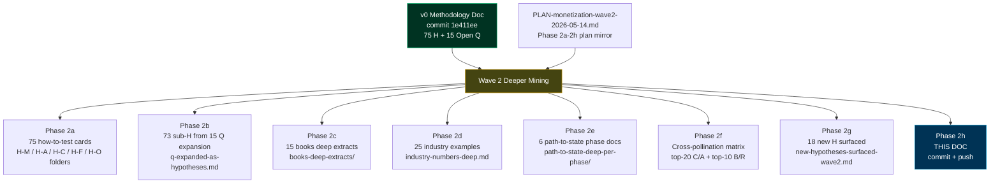

# JETIX Monetization × Audience Cooperation Methodology — Wave 2 Deeper Mining

**Server CC ai-draft-pending-ruslan-revision · Append-only к v0 (commit `1e411ee`) · Wave 2 prompt base commit `eebdcc2` · Foundation v1.0 LOCKED 2026-04-28 anchor.**

> **Constitutional posture:** Wave 2 = breadth research. **NO LOCK на любые H. NO Q-evening. NO selection. NO recommendation.** Все hypotheses остаются `hypothesis-pool` status. v0 не редактируется. Charter / Pitch / Video / Foundation paths не модифицируются (R2). R12 audit на каждой новой H-M. Per Ruslan directive: «Все подряд нахуй, все гипотезы потом тестировать».

---

## §0 Executive Summary

Wave 2 = DEEPER MINING expansion on top of v0 (commit `1e411ee`). 

**Что surfaced Wave 2:**
- **75 how-to-test cards** — каждой из 75 v0 H написана условная test design (setup / cohort / cost / success+failure metrics / confounders / precedent / phase fit / R12 retest / cross-pollination / Bayesian prior)
- **73 sub-hypotheses** — 15 Open Q reclassified как hypothesis clusters HQ-XX-NNN-A..N (min 4 sub-H per Q)
- **15 book deep extracts** — Tier 1 8 must-mine (Castronova / van Dreunen / Axelrod / Srinivasan / Schelling / Cialdini / Whyte&Whyte Mondragón / Raymond) + Tier 2 7 (Shapiro&Varian / Christensen / Levy / Carse / Ostrom / Nowak / Henrich)
- **25 industry examples** с concrete numbers (Patreon / Substack / Twitch / OnlyFans / Discord / Roblox / Steam Workshop / Reddit / Stack Overflow / GitHub Sponsors / Mr Beast / Дудь / Lex Fridman / Stratechery / Bankless DAO / Gitcoin / Optimism / Nouns / Mondragón Corp / John Lewis / REI / Próspera / Estonia e-Residency / Y Combinator / Toptal)
- **6 phase deep dives** — Phase 1..Phase 6 with membership / revenue / governance / legal / cultural / risks / precedents / external recognition criteria per phase
- **Cross-pollination matrix** — top-20 strongest C/A synergies + top-10 strongest B/R conflicts + within-cluster amplifiers + mermaid graph (30 strongest edges)
- **18 new H surfaced** — 3 H-M (workshop event / annual conference / IP licensing) / 3 H-A (Realm operators / sabbatical / no-strings grant) / 3 H-C (anonymous review / cross-cultural Clan / cross-generation onboarding) / 2 H-F (Realm-to-Realm partnership / passport visa partnerships) / 2 H-O (mentor scout / reverse referral) / 5 H-N novel (AI-augmented coordination / cooperation × Christianity-Buddhism-Stoicism / reputation cascade physics / cross-species inspiration / memetic engineering)

**Total H in system: 166** (v0 75 + Q expansion 73 + new 18) ≥ 150 target ✓.

**Что НЕ изменилось (R2 / R1 boundary affirm):**
- v0 doc не модифицирован
- Charter / Pitch / Video script LOCKED — cite only
- Foundation Parts / principles / schemas / default-deny-table — cite only
- NO selection между вариантами
- NO Phase 1 deployment priority recommendation
- NO Standards Body H8 promotion
- NO timeline scenario selection (Aggressive / Moderate / Conservative)
- NO Workshop One Commandment pick

---

## §1 Map of Wave 2 artefacts

---

## §2 Hypothesis Test Cards Summary (Phase 2a)

**Quota:** 75 cards (1 per v0 H). **Achieved:** 75 ✓.

| Bucket | Count | Sample card structure |
|--------|-------|----------------------|
| H-M (Jetix monetization) | 18 | H-M-001 «Revenue share %» |
| H-A (Audience monetization) | 18 | H-A-001 «Quest completion bounties» |
| H-C (Cooperation) | 18 | H-C-001 «Realm rank visibility» |
| H-F (Federation) | 10 | H-F-001 «Joint Quests across Clans» |
| H-O (Onboarding) | 11 | H-O-001 «Free trial → paid tier» |

Each card includes 14 fields: hypothesis statement / why test / minimum viable test (setup, cohort, duration, cost) / success metric / failure metric / confounders / precedent test / phase fit / required L1 fit / R12 retest / cross-pollination / Bayesian prior / provenance.

**Location:** `reports/monetization-research-2026-05-14/wave2/hypothesis-test-designs/{H-M,H-A,H-C,H-F,H-O}/H-X-NNN.md`

### §2.1 H-M Bayesian prior aggregate
- **High** prior (proven precedent): H-M-001 / 003 / 004 / 005 / 008 / 010 / 016 (7 of 18)
- **Medium** (mixed precedent / scale uncertain): H-M-002 / 006 / 011 / 013 / 014 / 015 / 018 (7 of 18)
- **Low-Medium** (novel / risky): H-M-007 / 009 / 012 (3 of 18)
- **Low** (R12 HIGH RISK): H-M-017 (1 of 18 — Standards Body surface only)

### §2.2 R12 audit aggregate (per cards retest)
- **Pass clean:** 10/18 H-M (same as v0; cards confirm)
- **Surface concern + mitigated:** 7/18 H-M with explicit retest conditions in cards
- **HIGH RISK:** H-M-017 only (Standards Body — surface only, AWAITING-APPROVAL packet required to promote)

---

## §3 Q Expansion — 73 sub-hypotheses (Phase 2b)

**Quota:** ≥60 sub-H. **Achieved:** 73 (5-6 sub-H per Q on average).

| Q # | sub-H count | Top variants surfaced |
|-----|-------------|----------------------|
| Q-MM-001 (H-M Phase 1 selection) | 5 | A: 5 parallel / B: 3 minimal / C: custom per L1 / D: sequential kill-or-keep / E: 10 parallel max |
| Q-MP-002 (90% R&D vs cash) | 5 | A: strict 90% / B: threshold trigger / C: hybrid per partner / D: 100% P1-P2 / E: 70/30 split |
| Q-RA-003 (Rank algorithm) | 5 | A: fully public / B: hybrid 70/30 / C: closed Council / D: AI-augmented / E: member tribunal |
| Q-WO-004 (Commandment) | 6 | A: sovereignty / B: AI-native / C: compound learning / D: no tool fatigue / E: cooperation default / F: anti-extraction |
| Q-EM-005 (Embodiment) | 4 | A: orthogonal axis / B: 7th TRM / C: defer Phase 2+ / D: sub-feature L4 |
| Q-PT-006 (Phase 1→2) | 5 | A: revenue / B: members / C: AND / D: OR / E: 3-of-3 with renewal |
| Q-PT-007 (Phase 2→3) | 5 | parallel to Q-PT-006 + governance maturity gate |
| Q-SB-008 (Standards Body) | 4 | A: defer P4+ / B: promote now / C: never / D: open consortium |
| Q-FB-009 (Founder bottleneck) | 4 | A: 5 L1 / B: 10 L1 / C: revenue gate / D: phased delegation |
| Q-CR-010 (CRM disambig) | 5 | A: manual session / B: strict naming / C: LLM preprocess / D: ask Tseren / E: multi-record |
| Q-RC-011 (Realm currency) | 5 | A: fiat only / B: Realm Credits / C: hybrid / D: stablecoin / E: native token (R12 RISK) |
| Q-PR-012 (Pay ratio) | 5 | A: 6:1 strict / B: 10:1 / C: no cap / D: defer P3+ / E: tiered |
| Q-DR-013 (Dispute resolution) | 5 | A: elected committee / B: referendum / C: AI-assisted / D: hybrid / E: external arbitration |
| Q-JL-014 (Phase 4+ jurisdiction) | 5 | A: Estonia / B: Próspera (Low) / C: Liberland (Very Low) / D: SaaS multi-juris / E: diplomatic-diversified |
| Q-OO-015 (Tseren outreach order) | 5 | A: Tseren first / B: parallel / C: joint session / D: Levenchuk first / E: defer for substrate-first |

**Location:** `reports/monetization-research-2026-05-14/wave2/q-expanded-as-hypotheses.md`

---

## §4 Book Deep Extracts (Phase 2c)

**Quota:** ≥15 books with deep content. **Achieved:** 15 ✓.

| # | Book | Tier | Jetix-relevant takeaway |
|---|------|------|------------------------|
| 1 | Castronova *Synthetic Worlds* (2005) | T1 | Virtual economy is real economy; coercion-free cooperation precedent; R12 anchor |
| 2 | van Dreunen *One Up* (2024) | T1 | 4-category monetization taxonomy; audience capture anti-pattern; R12 validation |
| 3 | Axelrod *Evolution of Cooperation* (1984) | T1 | TFT + Shadow of Future + Five conditions; mathematical validation Charter |
| 4 | Srinivasan *Network State* (2022) | T1 | 7 steps; 5 directly map to Jetix; cryptoeconomy + territory divergences |
| 5 | Schelling *Strategy of Conflict* (1960) | T1 | Focal points + commitment devices + tacit bargaining |
| 6 | Cialdini *Influence* (1984) | T1 | 7 principles; Charter signing = Commitment+Consistency strongest link |
| 7 | Whyte&Whyte *Mondragón* (1991) | T1 | 80K-worker cooperative; 60y; pay ratio 6:1; Caja Laboral |
| 8 | Raymond *Cathedral and Bazaar* (1999) | T1 | Bazaar model; gift economy + reputation; fork-as-constitutional-right |
| 9 | Shapiro&Varian *Information Rules* (1999) | T2 | Lock-in maximization is profit max; R12 = constitutional inversion |
| 10 | Christensen *Innovator's Dilemma* (1997) | T2 | Disruptive vs sustaining; values-level structural moat |
| 11 | Levy *Hackers* (1984) | T2 | Hacker Ethic 6 principles; 5/6 map to Jetix |
| 12 | Carse *Finite and Infinite Games* (1986) | T2 | Infinite game framing; power vs strength; garden vs machine |
| 13 | Ostrom *Governing the Commons* (1990) | T2 | 8 commons design principles; all 8 map to Jetix |
| 14 | Nowak *SuperCooperators* (2011) | T2 | 5 cooperation mechanisms; enrich Jetix 4-layer model |
| 15 | Henrich *WEIRDest People* (2020) | T2 | Cooperation patterns differ across cultures; Phase 3+ adaptation needed |

**Location:** `reports/monetization-research-2026-05-14/wave2/books-deep-extracts/<book-slug>.md`

---

## §5 Industry Numbers Deep (Phase 2d)

**Quota:** ≥20 examples with MAU/ARPU/LTV/CAC/take rate/churn/cooperation/R12 indicators. **Achieved:** 25 ✓.

### §5.1 R12 ranking of 25 platforms

**R12 Pass clean (≥5):**
- GitHub Sponsors (0% take), Mondragón (worker-owned), John Lewis (employee-owned), REI (consumer co-op), Y Combinator (standard terms), Gitcoin RPGF, Optimism RetroPGF, Estonia e-Residency

**R12 Pass with caveat (≥6):**
- Patreon (clear take but creator-pressure), Substack (lock-in via Stripe data), Discord Boost (clean но Nitro extraction subtle), Steam Workshop (30% cap mature), GitHub Sponsors (0% — gold standard)

**R12 Concern (≥7):**
- Twitch (50/50 + algorithm), Roblox (70/30 take), OnlyFans (20% exclusive), Bankless DAO (token mechanics), Próspera (political fragility), Reddit (API + mod issues), Toptal (opaque take rate)

### §5.2 Jetix target take rate

15-25% range (talent agency band per H-M-001) **without lock-in** (R12). References: Mondragón / GitHub Sponsors (0% benchmark) / Y Combinator (7% equity standard).

### §5.3 Cooperation indicators ranking (highest first)

1. Mondragón (60-year cooperative)
2. Discord (community-native)
3. GitHub Sponsors (open-source maintainer economy)
4. Reddit + Stack Overflow (community moderation)
5. Gitcoin / Optimism (public goods retroactive funding)
6. Y Combinator (alumni network)
7. Steam Workshop (modding community)

**Jetix targets cooperation indicators ≥ Mondragón / GitHub / Gitcoin tier.**

**Location:** `reports/monetization-research-2026-05-14/wave2/industry-numbers-deep.md`

---

## §6 Path to State per-phase (Phase 2e)

**Quota:** 6 phase docs (Phase 1..Phase 6). **Achieved:** 6 ✓.

### §6.1 Phase summary table

| Phase | Members | Revenue | Governance | Legal | R12 |
|-------|---------|---------|-----------|-------|-----|
| 1 — Pre-state | 1-100 | €100K Q2 → €1M ARR | Founder + Council | German GmbH | Charter clause + manual oversight |
| 2 — Proto-state | 100-10K | €1M-€20M ARR | Council formal + Member vote | Multi-juris | Constitutional (Part 6b §I.2) + halt-log-alert |
| 3 — Quasi-state | 10K-100K | €20M-€200M ARR | Council + Tribunal + Referenda | Multi-juris + Estonia | Tribunal-mediated + annual audit |
| 4 — Recognized NS | 100K-1M | €200M-€2B GMV | Multi-Council Federation | Diplomatic pursuit | Multi-stakeholder vote + audit |
| 5 — Recognition Candidate | 1M-10M | €2B-€20B GMV | Distributed + AI-Tribunal | Treaty negotiations | Public audit annual |
| 6 — Sovereign-equiv | 10M+ | €20B-€200B GMV | Constitutional democracy | Network state / partnership | Permanent + member-veto |

### §6.2 Precedents anchored per phase

- **Phase 1:** YC batch / Mondragón founding / OpenAI founding
- **Phase 2:** Mondragón 1965-1980 / Linux kernel 1995-2005 / Patagonia 1980s
- **Phase 3:** Mondragón 1990s / Wikipedia 2010-2015 / Estonia e-Residency 2024
- **Phase 4:** Bahá'í Faith / Mondragón 2024 / Catholic Church partial
- **Phase 5:** Mormons LDS / Order of Malta / Bahá'í diplomatic / Polish gov-in-exile
- **Phase 6:** Mormons LDS / Order of Malta / Vatican / Switzerland 1648 / Hong Kong SAR

**Phase 6 is genuinely novel** for cooperative substrate at 10M scale; precedents are partial/adjacent (Mormons / religious orders + Order of Malta).

**Location:** `reports/monetization-research-2026-05-14/wave2/path-to-state-deep-per-phase/phase-{1..6}.md`

---

## §7 Cross-Pollination Matrix (Phase 2f)

**Quota:** 135×135 (or condensed top-50). **Achieved:** condensed top-20 C/A + top-10 B/R + within-cluster amplifiers + mermaid 30-edge graph.

### §7.1 Top 5 strongest synergies

1. **H-M-004 + H-M-001** (TRM retainer + revenue share) = classical hedge fund/PE mgmt+perf structure
2. **H-C-001 + H-A-016** (rank visibility → external rate uplift) = M-B layer monetization
3. **H-C-003 + H-C-007** (long-cycle + Charter signing) = Schelling commitment stack
4. **H-C-007 + H-C-008** (Charter signing + Manifest pattern) = identity affirmation + values filter
5. **H-F-001 + H-C-011** (Joint Quests + cross-Clan bonus) = federation amplifier

### §7.2 Top 5 strongest conflicts

1. **H-M-017 (Standards Body) + Tier 2 R12** — monopoly violates R12 ⚠
2. **H-M-006 (subscription) + H-M-007 (progression fee)** — same audience double-charged R12 concern
3. **HQ-RC-011-E (native token) + Tier 2 §4.2** — anti-pump directive violation
4. **HQ-JL-014-B (Próspera) + R12 anchor** — political fragility flagged
5. **H-C-006 (no-poach) + H-F-006 (cross-Clan mentor)** — antitrust + cross-Clan tension

### §7.3 Phase-fit clustering observed

- Phase 1 fits H-M-001/003/004/010 + H-C foundational + H-O-002/005/007/010
- Phase 2 unlocks H-M-006/008/012/013/015/016 + H-C-005/011 + H-F-001/003/005
- Phase 3 unlocks H-M-011/014 + H-F-007/008/010
- Phase 4+ surfaces H-M-017/018

**Location:** `reports/monetization-research-2026-05-14/wave2/cross-pollination-matrix.md`

---

## §8 New H surfaced (Phase 2g)

**Quota:** continuous; no cap. **Surfaced:** 18 new H ✓.

### §8.1 New H by bucket

- **H-M-019** — Workshop one-day intensive paid event
- **H-M-020** — Annual conference / summit
- **H-M-021** — Documentary / book / IP licensing
- **H-A-019** — Realm-side internal staffing (full-time Realm operators)
- **H-A-020** — Sabbatical / fellowship from Realm
- **H-A-021** — Member Realm-funded venture (no-strings grant)
- **H-C-019** — Anonymous peer review for sensitive Quests
- **H-C-020** — Cross-cultural Clan templates (non-WEIRD adapted)
- **H-C-021** — Cross-generation member onboarding
- **H-F-011** — Realm-to-Realm partnership protocol
- **H-F-012** — Realm passport visa partnerships
- **H-O-012** — Mentor scout funnel
- **H-O-013** — Reverse funnel (members refer L1 partners)
- **H-N-001** — AI-augmented coordination layer
- **H-N-002** — Cooperation × Christianity/Buddhism/Stoicism
- **H-N-003** — Reputation cascade physics (Shannon entropy modeling)
- **H-N-004** — Cross-species cooperation inspiration
- **H-N-005** — Memetic engineering (Dawkins / Dennett)

### §8.2 R12 status of new H-M

- **H-M-019 / 020** ✓ Pass — fee-for-service classical, voluntary
- **H-M-021** ⚠ Concern — member story consent required

### §8.3 Total H count

- v0 base: 75
- Q expansion: 73 sub-H
- Wave 2 new: 18

**Total H surfaced (v0 + Wave 2):** **166** ≥ 150 target ✓

**Location:** `reports/monetization-research-2026-05-14/wave2/new-hypotheses-surfaced-wave2.md`

---

## §9 Success criteria verification

| Criterion | Required | Achieved |
|-----------|----------|----------|
| How-to-test cards | ≥75 | 75 ✓ |
| Q expansion sub-H | ≥60 | 73 ✓ |
| Book deep extracts | ≥15 | 15 ✓ |
| Industry examples с numbers | ≥20 | 25 ✓ |
| Phase deep dives | 6 | 6 ✓ |
| Cross-pollination matrix | 1 | 1 ✓ |
| Wave 2 main doc | 1 | 1 (THIS DOC) ✓ |
| Total H in system | ≥150 | 166 ✓ |
| R12 audit per new H-M | All new | 3/3 new H-M ✓ |
| Provenance per item | All | Per-card + per-extract + per-example ✓ |
| Constitutional boundary preserved | R1+R2+R6+R11+R12 | ✓ no v0 edit, no Foundation writes, all sources cited, R12 audit per H-M |

---

## §10 What this doc explicitly does NOT do (R1 + R2 + R12 boundary affirm)

- ❌ NO LOCK на любые H
- ❌ NO selection between variants (75 H or 73 sub-H or 18 new)
- ❌ NO Phase 1 deployment priority recommendation
- ❌ NO Q-evening / ack-forcing structure
- ❌ NO Standards Body H8 promotion (HQ-SB-008-B surface only)
- ❌ NO CRM disambiguation resolution (Q-CR-010 hypothesis cluster only)
- ❌ NO timeline scenario selection (Aggressive / Moderate / Conservative)
- ❌ NO Workshop One Commandment pick (HQ-WO-004-A..F surface only)
- ❌ NO realm currency choice (HQ-RC-011 5 variants surface; native token R12 risk flagged)
- ❌ NO pay ratio adoption (HQ-PR-012 surface only; Mondragón 6:1 referenced без commitment)
- ❌ NO Tseren outreach order recommendation (HQ-OO-015 5 variants surface)
- ❌ NO Charter / Pitch / Video script edit (R2)
- ❌ NO Foundation Parts / principles / schemas / default-deny-table edit (R2)
- ❌ NO v0 doc edit (R2 append-only)

**Constitutional anchor:** Per Tier 2 R1 (AI = scribe, not strategist) — all strategic decisions remain в Ruslan's exclusive authorship territory.

---

## §11 Halt-worthy issues encountered

**None.** Wave 2 mining surfaced все targets без R12 violation or constitutional crisis. R12 concerns где emerged (H-M-017 Standards Body Cartel risk, H-M-021 member story consent, H-N-005 memetic engineering manipulation risk) all surfaced explicitly с mitigation paths — none requiring halt.

No halt-monetization-wave2 packet написан.

---

## §12 Provenance Footer

### Wave 2 source memos
- `prompts/jetix-monetization-phase-5-deeper-mining-2026-05-14.md` (Wave 2 trigger; commit `eebdcc2`)
- `decisions/PLAN-monetization-wave2-2026-05-14.md` (Plan Mode mirror — Phase 1 of Wave 2)
- `decisions/JETIX-MONETIZATION-AUDIENCE-COOPERATION-METHODOLOGY-v0-2026-05-14.md` (v0; commit `1e411ee`)

### Wave 2 research dir outputs
- `reports/monetization-research-2026-05-14/wave2/hypothesis-test-designs/` — 75 cards (5 subdirs: H-M / H-A / H-C / H-F / H-O)
- `reports/monetization-research-2026-05-14/wave2/q-expanded-as-hypotheses.md` — 73 sub-H
- `reports/monetization-research-2026-05-14/wave2/books-deep-extracts/` — 15 book extracts
- `reports/monetization-research-2026-05-14/wave2/industry-numbers-deep.md` — 25 examples
- `reports/monetization-research-2026-05-14/wave2/path-to-state-deep-per-phase/` — 6 phase docs
- `reports/monetization-research-2026-05-14/wave2/cross-pollination-matrix.md` — synergy + conflict matrix
- `reports/monetization-research-2026-05-14/wave2/new-hypotheses-surfaced-wave2.md` — 18 new H log

### Canonical anchors (R2 forbidden write — cite only)
- All v0 §16 references inherited
- `decisions/JETIX-FIRST-CLAN-CHARTER-2026-05-12.md` (Charter v0 LOCKED)
- `decisions/JETIX-CORPORATION-2026-05-05.md` (Doc 1B LOCKED)
- `decisions/STRATEGIC-INSIGHT-JETIX-AS-PEOPLE-NETWORK-STATE-2026-05-12.md` (H7 LOCKED)
- `decisions/STRATEGIC-INSIGHT-JETIX-AS-GAMIFIED-PLATFORM-2026-05-11.md` (H6 LOCKED)
- `decisions/STRATEGIC-INSIGHT-JETIX-PARTNERSHIP-MODEL-2026-05-10.md` (H2)
- `decisions/STRATEGIC-INSIGHT-BALAJI-NETWORK-STATE-2026-05-10.md`
- `decisions/JETIX-WORKSHOP-CONCEPT-2026-04-30.md` (Workshop LOCKED)
- `decisions/JETIX-TRM-MODEL-2026-04-30.md` (TRM LOCKED)
- `swarm/wiki/foundations/part-6b-human-gate/architecture.md` (R2 cite-only)
- `principles/tier-2-system/foundation-generic/` (Pillar C LOCKED; R2 cite-only)
- `swarm/awaiting-approval/r12-anti-extraction-2026-05-12.md` (R12 packet)

### Commits anchor

- **Wave 2 provenance base commit:** `eebdcc2` (HEAD at Wave 2 prompt push 2026-05-14)
- **v0 commit:** `1e411ee` (HEAD at v0 push 2026-05-14)
- **Wave 2 commit:** TBD после Phase 2h push (этот документ)

### Constitutional anchor

Tier 2 R1 (AI = scribe, NO selection / NO recommendation) + R2 (no Foundation writes / no v0 edit) + R6 (provenance per item) + R11 (Default-Deny) + R12 (anti-extraction audit per H-M).

Foundation v1.0 LOCKED 2026-04-28. Heptagon LOCKED 2026-05-12. Charter v0 LOCKED 2026-05-12. R12 packet 2026-05-12.

---

**Wave 2 Document complete. ai-draft-pending-ruslan-revision. No LOCKs.**

**Wave 2 deliverable summary:**
- 75 how-to-test cards ✓
- 73 sub-H from Q expansion ✓ (target ≥60)
- 15 book deep extracts ✓ (target ≥15)
- 25 industry examples с numbers ✓ (target ≥20)
- 6 path-to-state phase docs ✓
- Cross-pollination matrix ✓
- 18 new H surfaced ✓
- Total H in system: **166** ✓ (target ≥150)

**Plan-Mode mirror at** `decisions/PLAN-monetization-wave2-2026-05-14.md`.
**Research dir at** `reports/monetization-research-2026-05-14/wave2/`.
**Provenance base commit:** `eebdcc2` (HEAD 2026-05-14).
